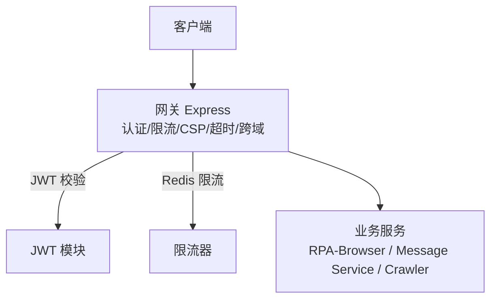
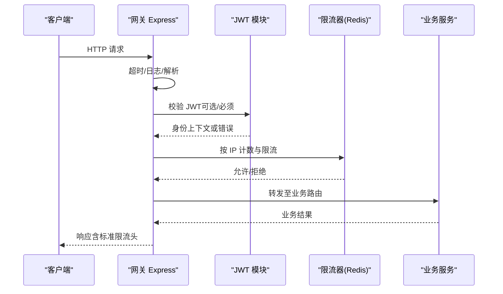
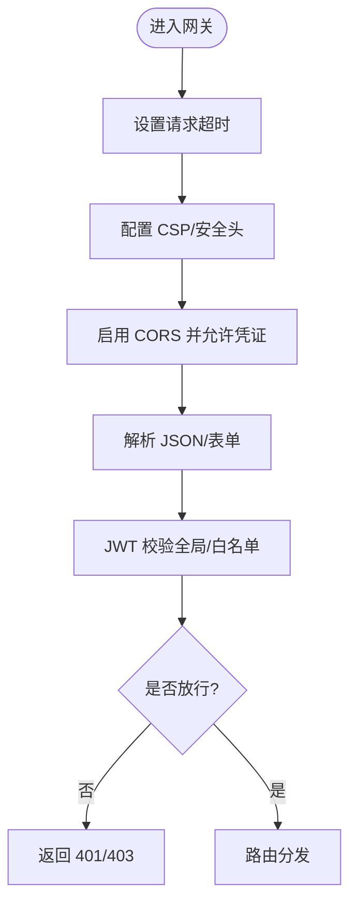
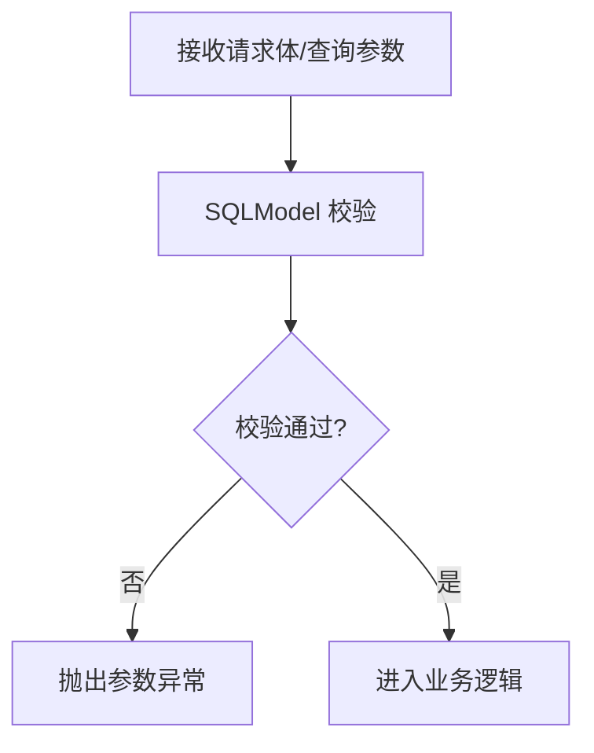
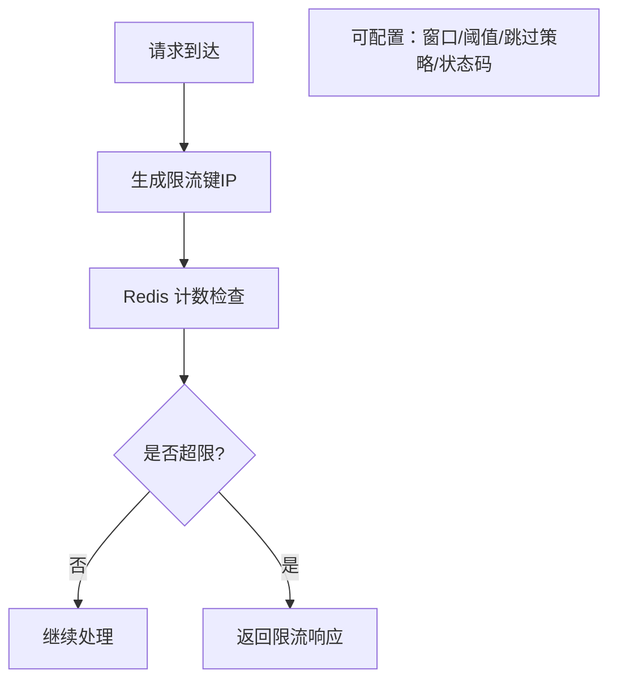
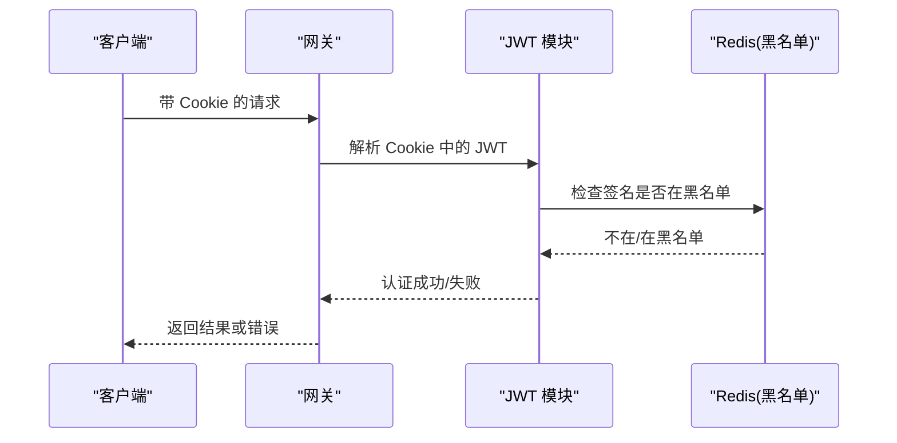
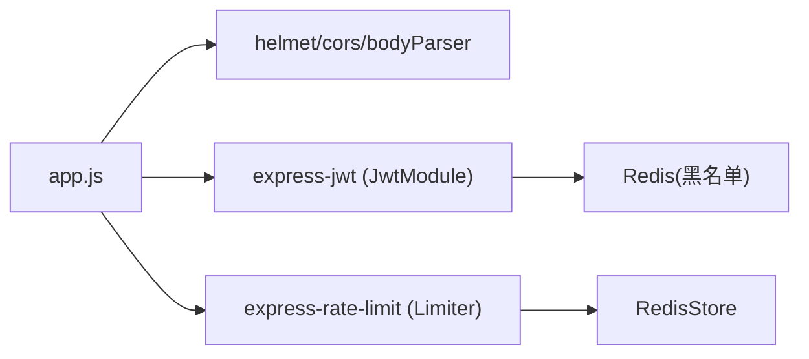

# API 安全防护

<cite>
**本文引用的文件**
- [Limiter.js](file://be-gateway/ExpressServerEnd/MiddleWare/Limiter.js)
- [JwtModule.js](file://be-gateway/ExpressServerEnd/Service/user_permission_module/JwtModule.js)
- [app.js](file://be-gateway/ExpressServerEnd/app.js)
- [项目接口规范.md](file://RPA-Browser/.trae/rules/项目接口规范.md)
- [test_comment_crud.py](file://be-message-service/tests/test_comment_crud.py)
- [gateway_auth.py](file://be-bilibili-crawler/Utils/网关/gateway_auth.py)
</cite>

## 目录
1. [简介](#简介)
2. [项目结构](#项目结构)
3. [核心组件](#核心组件)
4. [架构总览](#架构总览)
5. [详细组件分析](#详细组件分析)
6. [依赖关系分析](#依赖关系分析)
7. [性能与安全考量](#性能与安全考量)
8. [故障排查指南](#故障排查指南)
9. [结论](#结论)
10. [附录](#附录)

## 简介
本文件面向本仓库的 API 安全体系，聚焦于请求验证、限流控制与恶意请求防护。内容覆盖：
- API 网关安全中间件（认证、CSP、超时、跨域）
- 请求参数校验（Pydantic/SQLModel 契约式校验）
- SQL 注入与 XSS 防护策略
- 速率限制、IP 白名单与请求频率控制
- 针对 API 滥用、DDoS 攻击与数据泄露的治理方案

## 项目结构
本项目采用多服务架构，API 安全能力主要分布在以下位置：
- be-gateway：Express 网关，集中实现认证、限流、CSP、超时、跨域等通用安全中间件
- RPA-Browser：FastAPI 后端，强调使用 SQLModel 进行强类型参数校验
- be-message-service：消息服务，提供评论等业务的入参校验与异常处理
- be-bilibili-crawler：爬虫服务，包含网关鉴权工具

**图表来源**
- [app.js:82-111](file://be-gateway/ExpressServerEnd/app.js#L82-L111)
- [JwtModule.js:86-131](file://be-gateway/ExpressServerEnd/Service/user_permission_module/JwtModule.js#L86-L131)
- [Limiter.js:20-51](file://be-gateway/ExpressServerEnd/MiddleWare/Limiter.js#L20-L51)

**章节来源**
- [app.js:82-111](file://be-gateway/ExpressServerEnd/app.js#L82-L111)
- [JwtModule.js:86-131](file://be-gateway/ExpressServerEnd/Service/user_permission_module/JwtModule.js#L86-L131)
- [Limiter.js:20-51](file://be-gateway/ExpressServerEnd/MiddleWare/Limiter.js#L20-L51)

## 核心组件
- 网关安全中间件
  - 超时保护：统一设置请求超时，避免长连接占用资源
  - CSP：通过 Helmet 配置内容安全策略，降低 XSS 风险
  - 跨域：开启 CORS 并允许携带凭证，配合 HttpOnly Cookie 传递 JWT
  - 认证：全局 JWT 校验，支持可选登录路径白名单
- 限流器
  - 基于 Redis 的分布式限流，按 IP 维度计数
  - 可定制窗口时间、阈值、跳过策略与响应码
  - 支持本地回环地址放行策略
- 参数校验
  - 强制使用 SQLModel/Pydantic 定义复杂参数，禁止裸字典
  - 单元测试覆盖非法输入场景，确保边界与类型约束生效
- 防注入与 XSS
  - 服务端统一 CSP、禁用危险对象加载
  - 参数强类型校验减少注入面；数据库层建议参数化查询（见最佳实践）

**章节来源**
- [app.js:82-111](file://be-gateway/ExpressServerEnd/app.js#L82-L111)
- [Limiter.js:20-69](file://be-gateway/ExpressServerEnd/MiddleWare/Limiter.js#L20-L69)
- [项目接口规范.md:5-19](file://RPA-Browser/.trae/rules/项目接口规范.md#L5-L19)
- [test_comment_crud.py:427-452](file://be-message-service/tests/test_comment_crud.py#L427-L452)

## 架构总览
下图展示从客户端到网关再到业务服务的请求流程，以及关键安全拦截点。

**图表来源**
- [app.js:82-111](file://be-gateway/ExpressServerEnd/app.js#L82-L111)
- [JwtModule.js:86-131](file://be-gateway/ExpressServerEnd/Service/user_permission_module/JwtModule.js#L86-L131)
- [Limiter.js:20-51](file://be-gateway/ExpressServerEnd/MiddleWare/Limiter.js#L20-L51)

## 详细组件分析

### 网关安全中间件（认证、CSP、超时、跨域）
- 超时与日志：为开发环境记录请求耗时与入参，便于定位慢请求与异常
- CSP：通过 Helmet 严格限制脚本、样式、媒体等资源来源，关闭 object 加载
- 跨域：允许携带凭证，使浏览器可在跨域时发送 HttpOnly Cookie
- 认证：全局 JWT 校验，并提供可选登录路径白名单，未登录仅读接口可按策略放行

**图表来源**
- [app.js:82-111](file://be-gateway/ExpressServerEnd/app.js#L82-L111)
- [JwtModule.js:86-131](file://be-gateway/ExpressServerEnd/Service/user_permission_module/JwtModule.js#L86-L131)

**章节来源**
- [app.js:82-111](file://be-gateway/ExpressServerEnd/app.js#L82-L111)
- [JwtModule.js:86-131](file://be-gateway/ExpressServerEnd/Service/user_permission_module/JwtModule.js#L86-L131)

### 请求参数校验（SQLModel/Pydantic 契约式校验）
- 强制使用 SQLModel 定义复杂入参与出参，禁止裸字典，确保类型与必填约束
- 通过单元测试验证非法输入抛出异常，保障边界条件与类型一致性
- 建议在业务层对敏感字段做长度、格式、枚举值校验，最小化注入面

**图表来源**
- [项目接口规范.md:5-19](file://RPA-Browser/.trae/rules/项目接口规范.md#L5-L19)
- [test_comment_crud.py:427-452](file://be-message-service/tests/test_comment_crud.py#L427-L452)

**章节来源**
- [项目接口规范.md:5-19](file://RPA-Browser/.trae/rules/项目接口规范.md#L5-L19)
- [test_comment_crud.py:427-452](file://be-message-service/tests/test_comment_crud.py#L427-L452)

### 速率限制与 IP 白名单
- 分布式限流：基于 Redis 存储计数器，支持自定义窗口时间与阈值，按 IP 维度统计
- 标准响应头：遵循 draft-7 的 RateLimit 头，便于前端感知配额
- 本地回环放行：对私有 IP（如 x-bili-ip 标识的内网地址）直接放行，避免内部调用被误限
- 灵活跳过：支持根据请求特征跳过计数或仅对成功/失败请求计数

**图表来源**
- [Limiter.js:20-51](file://be-gateway/ExpressServerEnd/MiddleWare/Limiter.js#L20-L51)
- [Limiter.js:53-64](file://be-gateway/ExpressServerEnd/MiddleWare/Limiter.js#L53-L64)

**章节来源**
- [Limiter.js:20-69](file://be-gateway/ExpressServerEnd/MiddleWare/Limiter.js#L20-L69)

### 认证与令牌管理（JWT）
- Token 签发：HS256 算法，固定有效期，签名密钥集中管理
- 传输与存储：优先从 HttpOnly Cookie 读取，避免 localStorage 暴露给 XSS
- 撤销机制：支持黑名单校验，过期或撤销时拒绝访问
- 白名单：部分只读接口允许未登录访问，写操作仍要求认证

**图表来源**
- [JwtModule.js:21-33](file://be-gateway/ExpressServerEnd/Service/user_permission_module/JwtModule.js#L21-L33)
- [JwtModule.js:63-70](file://be-gateway/ExpressServerEnd/Service/user_permission_module/JwtModule.js#L63-L70)
- [JwtModule.js:79-95](file://be-gateway/ExpressServerEnd/Service/user_permission_module/JwtModule.js#L79-L95)

**章节来源**
- [JwtModule.js:21-33](file://be-gateway/ExpressServerEnd/Service/user_permission_module/JwtModule.js#L21-L33)
- [JwtModule.js:63-70](file://be-gateway/ExpressServerEnd/Service/user_permission_module/JwtModule.js#L63-L70)
- [JwtModule.js:79-95](file://be-gateway/ExpressServerEnd/Service/user_permission_module/JwtModule.js#L79-L95)

### SQL 注入与 XSS 防护策略
- SQL 注入防护
  - 参数化查询：所有数据库查询必须使用参数绑定，禁止字符串拼接
  - 最小权限：数据库账号仅授予必要权限，限制 DDL/DML 范围
  - 输入过滤：结合 SQLModel/Pydantic 强类型校验，限制长度与格式
- XSS 防护
  - 服务端 CSP：通过 Helmet 限制脚本与资源来源，禁用危险对象
  - 输出编码：渲染模板时对用户输入进行转义
  - 安全 Cookie：HttpOnly + Secure + SameSite 防止窃取与 CSRF

**章节来源**
- [项目接口规范.md:5-19](file://RPA-Browser/.trae/rules/项目接口规范.md#L5-L19)
- [app.js:82-104](file://be-gateway/ExpressServerEnd/app.js#L82-L104)
- [JwtModule.js:43-61](file://be-gateway/ExpressServerEnd/Service/user_permission_module/JwtModule.js#L43-L61)

### 恶意请求防护与 DDoS 缓解
- 请求级防护
  - 超时：统一设置请求超时，避免长连接耗尽资源
  - 限流：按 IP 与接口维度限制 QPS，突发流量快速回落
  - 白名单：内网/可信来源放行，外部来源严格限流
- 系统级防护
  - 接入 WAF/CDN：清洗 CC/DDoS 流量，屏蔽恶意 UA/Geo
  - 监控告警：基于限流命中数、错误率、延迟指标触发告警
  - 熔断降级：下游服务不可用时快速失败，保护整体可用性

[本节为通用安全建议，不直接引用具体代码]

## 依赖关系分析
- 网关层依赖
  - express-rate-limit + rate-limit-redis：分布式限流
  - helmet：安全头与 CSP
  - cors：跨域与凭证
  - express-jwt：JWT 校验与白名单
- 业务层依赖
  - Pydantic/SQLModel：强类型参数校验
  - 测试用例：覆盖非法输入与边界条件

**图表来源**
- [app.js:82-111](file://be-gateway/ExpressServerEnd/app.js#L82-L111)
- [Limiter.js:1-6](file://be-gateway/ExpressServerEnd/MiddleWare/Limiter.js#L1-L6)
- [JwtModule.js:10-14](file://be-gateway/ExpressServerEnd/Service/user_permission_module/JwtModule.js#L10-L14)

**章节来源**
- [app.js:82-111](file://be-gateway/ExpressServerEnd/app.js#L82-L111)
- [Limiter.js:1-6](file://be-gateway/ExpressServerEnd/MiddleWare/Limiter.js#L1-L6)
- [JwtModule.js:10-14](file://be-gateway/ExpressServerEnd/Service/user_permission_module/JwtModule.js#L10-L14)

## 性能与安全考量
- 限流粒度
  - 按 IP 与接口组合限流，热点接口单独收紧阈值
  - 区分成功/失败请求计数，避免误伤正常重试
- 缓存与存储
  - Redis 限流键前缀隔离不同业务，避免冲突
  - JWT 黑名单使用高效数据结构，定期清理过期项
- 资源保护
  - 超时与并发上限防止雪崩
  - CSP 与最小权限原则降低攻击面

[本节为通用指导，不直接引用具体代码]

## 故障排查指南
- 限流命中过多
  - 检查 keyGenerator 是否正确提取真实 IP
  - 调整 windowMs 与 limit，或为可信来源添加 skip 策略
- 认证失败
  - 确认 Cookie 名称、SameSite、Secure 配置与浏览器一致
  - 检查 JWT 密钥、算法与黑名单状态
- 参数校验报错
  - 核对 SQLModel 字段类型与必填项
  - 查看测试用例中抛出的异常类型，定位非法输入

**章节来源**
- [Limiter.js:20-69](file://be-gateway/ExpressServerEnd/MiddleWare/Limiter.js#L20-L69)
- [JwtModule.js:21-33](file://be-gateway/ExpressServerEnd/Service/user_permission_module/JwtModule.js#L21-L33)
- [test_comment_crud.py:427-452](file://be-message-service/tests/test_comment_crud.py#L427-L452)

## 结论
本项目的 API 安全体系以网关为中心，结合强类型参数校验、分布式限流与严格的认证策略，有效应对常见威胁。建议持续完善：
- 细化接口级限流与灰度策略
- 引入 WAF/CDN 与更完善的监控告警
- 强化数据库参数化与最小权限实践
- 定期审计 CSP 与 Cookie 策略，平衡安全与兼容性

[本节为总结性内容，不直接引用具体代码]

## 附录
- 相关工具与参考
  - 网关鉴权工具：用于上游服务对接时的鉴权辅助
  - 接口规范：强制 SQLModel 定义复杂参数，提升安全性与可维护性

**章节来源**
- [gateway_auth.py](file://be-bilibili-crawler/Utils/网关/gateway_auth.py)
- [项目接口规范.md:5-19](file://RPA-Browser/.trae/rules/项目接口规范.md#L5-L19)