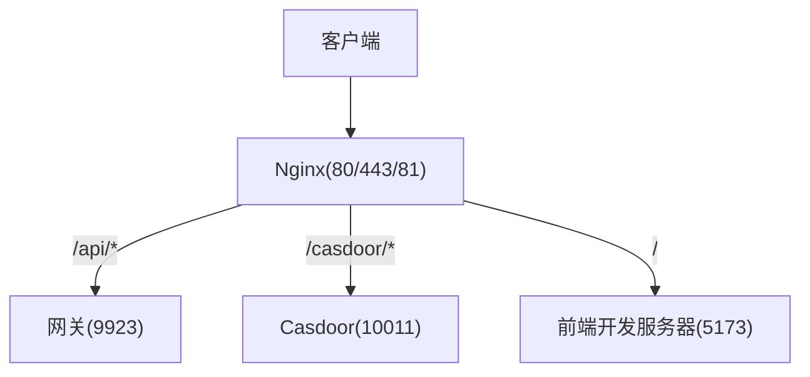
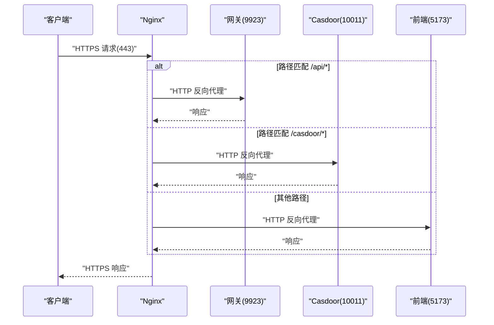
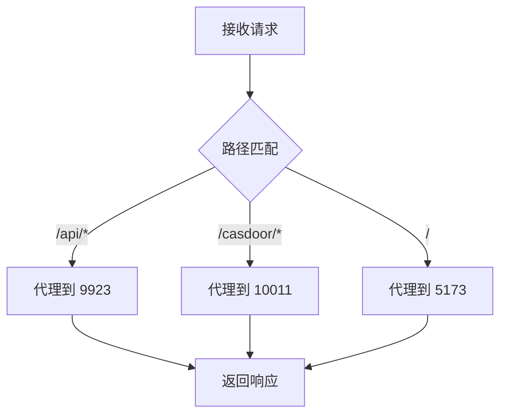
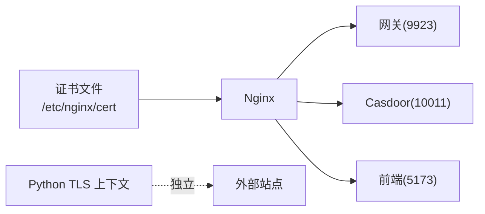

# SSL/TLS 证书管理

<cite>
**本文引用的文件**
- [docker_vol/nginx/conf/nginx.conf](file://docker_vol/nginx/conf/nginx.conf)
- [docker-compose.yml](file://docker-compose.yml)
- [be-bilibili-crawler/Utils/代理/SealedRequests.py](file://be-bilibili-crawler/Utils/代理/SealedRequests.py)
- [docker_vol/goaccess/goaccess.conf](file://docker_vol/goaccess/goaccess.conf)
</cite>

## 目录
1. [简介](#简介)
2. [项目结构](#项目结构)
3. [核心组件](#核心组件)
4. [架构总览](#架构总览)
5. [详细组件分析](#详细组件分析)
6. [依赖关系分析](#依赖关系分析)
7. [性能与安全建议](#性能与安全建议)
8. [故障排查指南](#故障排查指南)
9. [结论](#结论)
10. [附录](#附录)

## 简介
本文件围绕本项目中的 HTTPS 与证书管理，给出基于 Nginx 的反向代理配置、自签名证书生成、Let's Encrypt 自动续期与多域名证书管理的落地方案；同时覆盖证书安全存储、密钥管理、证书轮换策略，以及常见问题的定位与修复（如证书过期、HTTPS 连接失败、浏览器安全警告等）。文档严格依据仓库中现有配置进行分析与扩展。

## 项目结构
当前仓库通过 Docker Compose 编排服务，Nginx 作为对外入口暴露 80/443/81 端口，并将请求反向代理到内部服务。证书挂载点位于 docker_vol/nginx/cert，Nginx 配置文件位于 docker_vol/nginx/conf/nginx.conf。

图表来源
- [docker-compose.yml:357-371](file://docker-compose.yml#L357-L371)
- [docker_vol/nginx/conf/nginx.conf:9-49](file://docker_vol/nginx/conf/nginx.conf#L9-L49)

章节来源
- [docker-compose.yml:357-371](file://docker-compose.yml#L357-L371)
- [docker_vol/nginx/conf/nginx.conf:9-49](file://docker_vol/nginx/conf/nginx.conf#L9-L49)

## 核心组件
- Nginx 反向代理：监听 80/443/81，按路径将流量转发至后端 API、Casdoor、前端开发服务器。
- 证书挂载：docker_vol/nginx/cert 映射到容器内 /etc/nginx/cert，用于存放证书与私钥。
- 上游 TLS 控制：对特定 upstream 使用 proxy_ssl_* 参数控制是否校验及 SNI。
- Python 侧 TLS 上下文：爬虫模块自定义 TLS 版本与套件，确保与目标站点兼容。

章节来源
- [docker_vol/nginx/conf/nginx.conf:9-68](file://docker_vol/nginx/conf/nginx.conf#L9-L68)
- [docker-compose.yml:357-371](file://docker-compose.yml#L357-L371)
- [be-bilibili-crawler/Utils/代理/SealedRequests.py:76-82](file://be-bilibili-crawler/Utils/代理/SealedRequests.py#L76-L82)

## 架构总览
下图展示从客户端到 Nginx 再到各上游服务的请求链路，以及证书在 Nginx 层的角色。

图表来源
- [docker_vol/nginx/conf/nginx.conf:22-48](file://docker_vol/nginx/conf/nginx.conf#L22-L48)
- [docker-compose.yml:357-371](file://docker-compose.yml#L357-L371)

## 详细组件分析

### Nginx 反向代理与 HTTPS 配置
- 监听端口：80、443、81（IPv4/IPv6）。
- server_name：当前配置为单一域名。
- 反向代理规则：
  - /api/* -> 网关 9923
  - /casdoor/* -> Casdoor 10011
  - / -> 前端 5173
- 上游 TLS 控制：针对特定 location 设置 proxy_ssl_server_name/off 与 proxy_ssl_name，以适配上游的 SNI 或证书校验需求。

图表来源
- [docker_vol/nginx/conf/nginx.conf:22-48](file://docker_vol/nginx/conf/nginx.conf#L22-L48)

章节来源
- [docker_vol/nginx/conf/nginx.conf:9-68](file://docker_vol/nginx/conf/nginx.conf#L9-L68)

### 证书存储与挂载
- 宿主机目录：docker_vol/nginx/cert
- 容器内目录：/etc/nginx/cert
- 挂载方式：只读挂载，避免运行时被意外修改。

章节来源
- [docker-compose.yml:365-368](file://docker-compose.yml#L365-L368)

### 上游 TLS 与 SNI 控制
- 在特定 location 中关闭 proxy_ssl_server_name 并显式设置 proxy_ssl_name，以控制与上游的 TLS 握手行为（例如上游需要特定 SNI 或无需校验）。

章节来源
- [docker_vol/nginx/conf/nginx.conf:66-67](file://docker_vol/nginx/conf/nginx.conf#L66-L67)

### Python 侧 TLS 上下文（爬虫）
- 最小/最大 TLS 版本：TLSv1 ~ TLSv1.3
- ALPN：启用 h2
- 密码套件：自定义组合并禁用不安全算法

章节来源
- [be-bilibili-crawler/Utils/代理/SealedRequests.py:76-82](file://be-bilibili-crawler/Utils/代理/SealedRequests.py#L76-L82)

## 依赖关系分析
- Nginx 依赖证书文件（fullchain.pem、privkey.pem），由 docker-compose 挂载到容器。
- Nginx 反向代理到多个上游服务（网关、Casdoor、前端）。
- Python 爬虫独立维护 TLS 上下文，与 Nginx 层无直接耦合。

图表来源
- [docker-compose.yml:365-371](file://docker-compose.yml#L365-L371)
- [docker_vol/nginx/conf/nginx.conf:22-48](file://docker_vol/nginx/conf/nginx.conf#L22-L48)
- [be-bilibili-crawler/Utils/代理/SealedRequests.py:76-82](file://be-bilibili-crawler/Utils/代理/SealedRequests.py#L76-L82)

章节来源
- [docker-compose.yml:357-371](file://docker-compose.yml#L357-L371)
- [docker_vol/nginx/conf/nginx.conf:22-48](file://docker_vol/nginx/conf/nginx.conf#L22-L48)
- [be-bilibili-crawler/Utils/代理/SealedRequests.py:76-82](file://be-bilibili-crawler/Utils/代理/SealedRequests.py#L76-L82)

## 性能与安全建议
- 启用 HTTP/2：在 Nginx 的 443 server 块中启用 http2 以提升性能（需配合现代浏览器与正确证书链）。
- 强制 HTTPS：将 80 端口重定向到 443，避免明文传输。
- 安全头：添加 HSTS、X-Content-Type-Options、Referrer-Policy 等头部。
- 密码套件与协议：仅允许 TLSv1.2+，禁用弱加密套件。
- 会话复用：启用 session cache 与 OCSP stapling，减少握手开销。
- 日志与监控：集中记录访问与错误日志，结合 goaccess 等工具进行可视化分析。

[本节为通用建议，不直接引用具体代码文件]

## 故障排查指南

### 常见问题与处理
- 证书过期
  - 现象：浏览器提示“证书已过期”或握手失败。
  - 处理：检查证书有效期，更新 fullchain.pem 与 privkey.pem，重载 Nginx。
- HTTPS 连接失败
  - 现象：无法建立 TLS 连接或握手报错。
  - 处理：确认 443 端口开放、证书路径正确、Nginx 配置语法无误、上游可达。
- 浏览器安全警告
  - 现象：显示“不安全”或“证书不受信任”。
  - 处理：确保证书链完整（包含中间证书）、域名匹配、未使用自签证书于生产环境。
- 上游 TLS/SNI 问题
  - 现象：某些上游因 SNI 或证书校验失败导致 502。
  - 处理：调整 proxy_ssl_server_name 与 proxy_ssl_name，必要时在上游部署正确证书。

章节来源
- [docker_vol/nginx/conf/nginx.conf:9-68](file://docker_vol/nginx/conf/nginx.conf#L9-L68)
- [docker-compose.yml:357-371](file://docker-compose.yml#L357-L371)

## 结论
本项目已通过 Nginx 提供统一的 HTTPS 入口，并通过 Docker 卷挂载证书文件。当前配置未启用 TLS 相关指令，建议在 443 server 块中补充证书路径、HTTP/2、安全头与重定向策略。对于上游 TLS 场景，按需调整 proxy_ssl_* 参数。Python 爬虫侧已自定义 TLS 上下文以满足目标站点兼容性。整体方案便于后续接入 Let’s Encrypt 自动续期与多域名证书管理。

[本节为总结性内容，不直接引用具体代码文件]

## 附录

### A. 自签名证书生成与部署流程
- 生成私钥与证书：
  - 使用 OpenSSL 生成 RSA 私钥与自签名证书（含 SAN 支持）。
- 放置证书：
  - 将 fullchain.pem 与 privkey.pem 放入 docker_vol/nginx/cert。
- 配置 Nginx：
  - 在 443 server 块中指定 ssl_certificate 与 ssl_certificate_key。
  - 启用 http2、HSTS、安全头，并将 80 重定向到 443。
- 验证：
  - 使用 curl 或浏览器访问 https://域名，检查证书链与协议版本。

[本节为操作指引，不直接引用具体代码文件]

### B. Let’s Encrypt 自动续期与多域名证书
- 推荐方案：
  - 使用 certbot 或 acme.sh 签发与续期证书，输出 fullchain.pem 与 privkey.pem。
  - 将证书写入 docker_vol/nginx/cert，并在 Nginx 中引用。
- 自动续期：
  - 配置定时任务（cron/systemd timer）定期执行续期命令。
  - 续期成功后触发 Nginx 平滑重载（nginx -s reload）。
- 多域名：
  - 使用 SAN 证书或 SNI 在同一 Nginx 实例上托管多个域名。
  - 每个 server_name 对应独立的 ssl_certificate 与 ssl_certificate_key。

[本节为操作指引，不直接引用具体代码文件]

### C. 证书安全存储与密钥管理
- 权限控制：
  - 限制证书与私钥文件的读写权限（仅 Nginx 运行用户可访问）。
- 备份与恢复：
  - 定期备份证书与私钥，采用加密存储与异地备份。
- 生命周期管理：
  - 建立证书到期告警（提前 30/15/7 天）。
  - 制定轮换计划，避免业务中断。

[本节为操作指引，不直接引用具体代码文件]

### D. 证书轮换策略
- 滚动替换：
  - 先部署新证书，再切换 Nginx 引用，最后清理旧证书。
- 灰度发布：
  - 先在测试环境验证，再逐步推广到生产。
- 回滚预案：
  - 保留上一版证书与配置，出现问题时快速回滚。

[本节为操作指引，不直接引用具体代码文件]

### E. 与现有配置的衔接
- 当前 Nginx 配置未启用 TLS，需在 443 server 块中添加证书路径与相关指令。
- 证书挂载点已就绪，可直接将证书文件放入 docker_vol/nginx/cert。
- 上游 TLS 控制已在部分 location 中体现，可按需扩展到其他路径。

章节来源
- [docker_vol/nginx/conf/nginx.conf:9-68](file://docker_vol/nginx/conf/nginx.conf#L9-L68)
- [docker-compose.yml:365-371](file://docker-compose.yml#L365-L371)