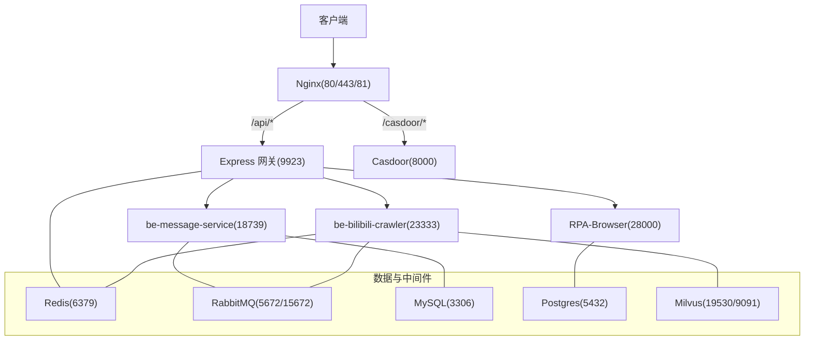
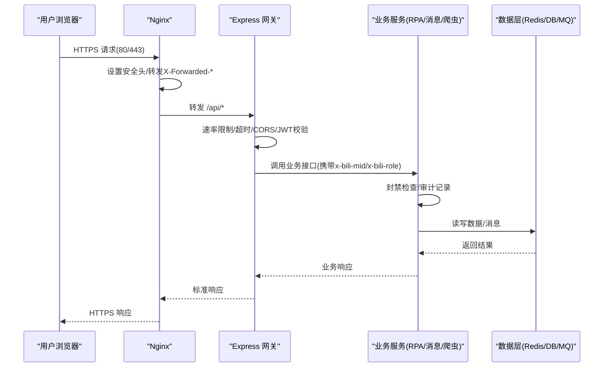
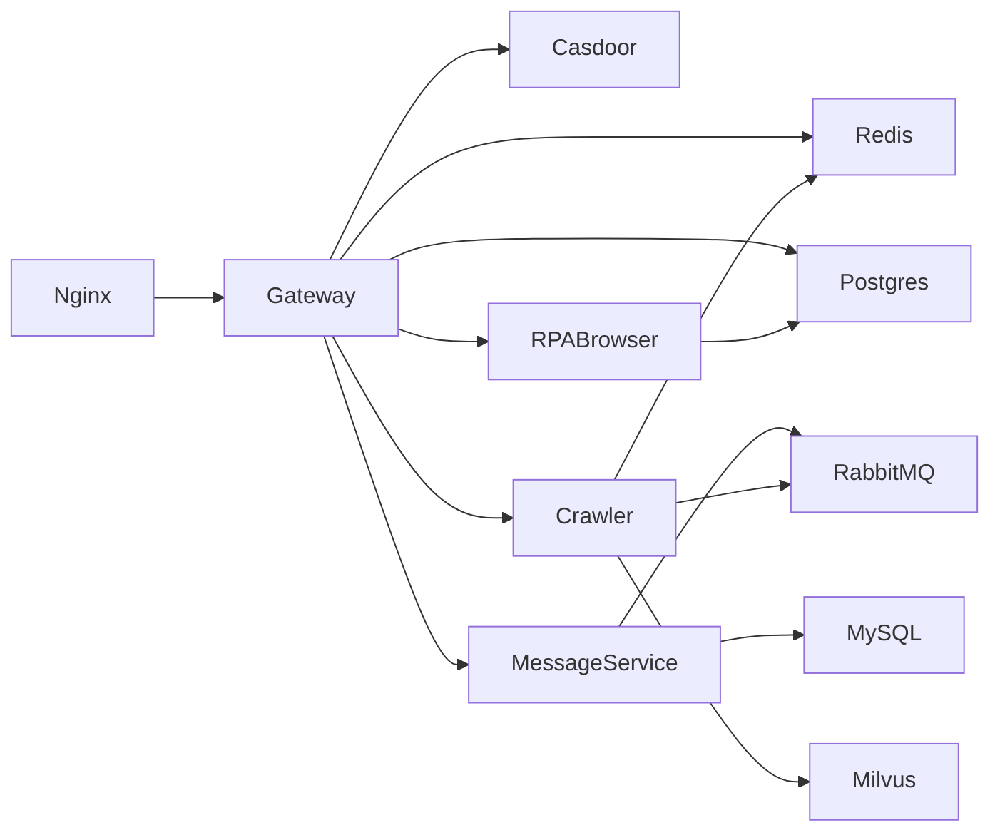

# 网络安全配置

<cite>
**本文引用的文件**
- [docker-compose.yml](file://docker-compose.yml)
- [dc-dev.yml](file://dc-dev.yml)
- [nginx.conf](file://docker_vol/nginx/conf/nginx.conf)
- [Limiter.js](file://be-gateway/ExpressServerEnd/MiddleWare/Limiter.js)
- [app.js](file://be-gateway/ExpressServerEnd/app.js)
- [casdoor_config.js](file://be-gateway/ExpressServerEnd/config/casdoor_config.js)
- [config.yml](file://be-gateway/ExpressServerEnd/config/config.yml)
- [ban_guard.py](file://RPA-Browser/app/utils/middlewares/ban_guard.py)
- [squid.example.conf](file://be-bilibili-crawler/scripts/光猫ip/squid.example.conf)
- [go-proxy docker-compose.yml](file://go-proxy-ipv6-pool-auto/docker-compose.yml)
- [auth.gen.ts（前端）](file://Vue3FrontEndDemoExercise/src/api/community/hey-api/core/auth.gen.ts)
</cite>

## 目录
1. [简介](#简介)
2. [项目结构](#项目结构)
3. [核心组件](#核心组件)
4. [架构总览](#架构总览)
5. [详细组件分析](#详细组件分析)
6. [依赖关系分析](#依赖关系分析)
7. [性能与安全注意事项](#性能与安全注意事项)
8. [故障排查指南](#故障排查指南)
9. [结论](#结论)
10. [附录](#附录)

## 简介
本文件面向生产与开发环境，提供端到端的网络安全配置说明，覆盖防火墙规则、SSL/TLS 证书管理、网络隔离策略、访问控制机制、Docker 容器网络、端口安全、Nginx 反向代理安全、API 网关防护、流量监控、入侵检测与安全事件响应流程。文档基于仓库中现有配置与代码进行梳理，并给出可操作的加固建议与合规要点。

## 项目结构
- 入口与编排：通过 docker-compose.yml 统一编排 Nginx、后端服务、数据库、缓存、消息队列、向量检索等；开发环境使用 dc-dev.yml 简化依赖。
- 反向代理：Nginx 暴露 80/443/81 端口，转发 API 到网关，静态资源与 Casdoor 控制台分别代理至对应服务。
- 网关与鉴权：Express 网关集成 Helmet、CORS、超时、JWT 校验与速率限制；Casdoor 作为统一身份认证中心。
- 业务服务：RPA-Browser、be-message-service、be-bilibili-crawler 等通过环境变量与内部网络通信。
- 外部出口：可选 IPv6 代理池（Go 实现）与 Squid 示例用于出站流量控制。

图表来源
- [docker-compose.yml:179-212](file://docker-compose.yml#L179-L212)
- [docker-compose.yml:227-309](file://docker-compose.yml#L227-L309)
- [docker-compose.yml:120-164](file://docker-compose.yml#L120-L164)
- [docker-compose.yml:357-371](file://docker-compose.yml#L357-L371)

章节来源
- [docker-compose.yml:1-380](file://docker-compose.yml#L1-L380)
- [dc-dev.yml:1-213](file://dc-dev.yml#L1-L213)

## 核心组件
- Nginx 反向代理：统一入口、HTTPS 终止、请求头透传、路径路由、WebSocket 支持。
- Express 网关：安全头、跨域、超时、JWT 鉴权、速率限制、本地访问限制。
- 身份认证：Casdoor OAuth2/OIDC，服务端证书与客户端凭据由环境变量注入。
- 封禁与审计：RPA 服务内置封禁拦截中间件；管理员操作审计日志。
- 出站流量控制：IPv6 代理池与 Squid 示例，限制仅允许特定域名与端口。
- 前端鉴权：OpenAPI 生成的 Bearer Token 注入逻辑。

章节来源
- [nginx.conf:9-48](file://docker_vol/nginx/conf/nginx.conf#L9-L48)
- [app.js:82-111](file://be-gateway/ExpressServerEnd/app.js#L82-L111)
- [casdoor_config.js:1-18](file://be-gateway/ExpressServerEnd/config/casdoor_config.js#L1-L18)
- [ban_guard.py:1-76](file://RPA-Browser/app/utils/middlewares/ban_guard.py#L1-L76)
- [squid.example.conf:1-39](file://be-bilibili-crawler/scripts/光猫ip/squid.example.conf#L1-L39)
- [auth.gen.ts（前端）:1-48](file://Vue3FrontEndDemoExercise/src/api/community/hey-api/core/auth.gen.ts#L1-L48)

## 架构总览
下图展示从浏览器到各服务的完整调用链与安全控制点：Nginx 终止 TLS 并设置安全头，网关进行速率限制与 JWT 校验，业务服务执行权限与封禁检查，所有敏感数据经加密通道传输。

图表来源
- [nginx.conf:9-48](file://docker_vol/nginx/conf/nginx.conf#L9-L48)
- [app.js:82-111](file://be-gateway/ExpressServerEnd/app.js#L82-L111)
- [Limiter.js:20-50](file://be-gateway/ExpressServerEnd/MiddleWare/Limiter.js#L20-L50)
- [ban_guard.py:32-72](file://RPA-Browser/app/utils/middlewares/ban_guard.py#L32-L72)

## 详细组件分析

### Nginx 反向代理安全配置
- 监听端口：80/443/81，启用 IPv6 监听。
- 安全头与请求头：设置 Host、X-Forwarded-Proto、自定义 x-bili-ip/x-bili-forward/x-bili-protocol，便于下游识别真实来源与协议。
- 路由策略：
  - /casdoor/* 代理至 Casdoor 控制台。
  - /api/* 代理至网关（当前指向宿主机 9923 端口）。
  - / 代理至前端开发服务器（Vite 5173），并开启 WebSocket 升级以支持 HMR。
  - 81 端口代理至 Casdoor WebUI，便于运维访问。
- 建议加固：
  - 在 server 块中添加 HSTS、强制 HTTPS 重定向、禁用不安全协议与密码套件。
  - 为 /api/* 增加 IP 白名单或 WAF 规则，限制仅允许网关所在网段访问。
  - 对 /casdoor/* 增加基础认证或内网访问限制。

章节来源
- [nginx.conf:9-69](file://docker_vol/nginx/conf/nginx.conf#L9-L69)

### SSL/TLS 证书管理
- 证书挂载：Nginx 容器将 ./docker_vol/nginx/cert 挂载为只读，用于存放证书与私钥。
- 建议实践：
  - 使用 Let’s Encrypt 自动续期，证书更新后触发 Nginx reload。
  - 私钥权限设置为 600，属主 root，避免被其他进程读取。
  - 启用 TLS 1.2+，禁用弱密码套件，启用 OCSP Stapling 与 HSTS。
  - 定期扫描证书过期时间并告警。

章节来源
- [docker-compose.yml:357-371](file://docker-compose.yml#L357-L371)

### 网络隔离与端口安全
- 容器网络：默认 bridge 网络，已启用 IPv6；关键服务仅暴露必要端口到宿主机。
- 端口映射：
  - Nginx: 80/443/81
  - 网关: 9923
  - RPA: 28000
  - 消息服务: 18739
  - 爬虫: 23333
  - 数据库/缓存/队列: 3306/5432/6379/5672/15672/19530/9091
- 建议加固：
  - 生产环境仅开放 80/443 到公网，其余端口绑定 127.0.0.1 或仅内网可达。
  - 使用防火墙规则（如 iptables/nftables）限制源 IP 访问管理端口（如 RabbitMQ 管理界面 15672）。
  - 对数据库与缓存服务启用强密码与最小权限账号。

章节来源
- [docker-compose.yml:68-118](file://docker-compose.yml#L68-L118)
- [docker-compose.yml:120-178](file://docker-compose.yml#L120-L178)
- [docker-compose.yml:179-226](file://docker-compose.yml#L179-L226)
- [docker-compose.yml:227-309](file://docker-compose.yml#L227-L309)
- [docker-compose.yml:357-371](file://docker-compose.yml#L357-L371)

### 访问控制与速率限制
- 网关速率限制：基于 Redis 的分布式限流，按 IP 统计窗口请求数，支持自定义 key 生成器与跳过策略。
- 本地访问限制：restrictToLocalhost 仅允许来自内网地址的请求进入特定接口，防止外网直接调用。
- 安全头与跨域：Helmet 配置 CSP、Referrer-Policy；CORS 允许凭证模式，谨慎放行 origin。
- 建议加固：
  - 针对登录、验证码、支付等敏感接口设置更严格的速率限制。
  - 结合 WAF 或云厂商安全组，对异常 IP 进行动态封禁。
  - 对跨域白名单进行严格校验，避免开放重定向与 token 泄露。

章节来源
- [Limiter.js:20-69](file://be-gateway/ExpressServerEnd/MiddleWare/Limiter.js#L20-L69)
- [app.js:82-111](file://be-gateway/ExpressServerEnd/app.js#L82-L111)

### 身份认证与授权
- Casdoor 集成：通过环境变量注入 endpoint、clientId、clientSecret、organization、application、certificate 等；支持 service 应用用于服务间调用。
- 前端鉴权：OpenAPI 生成工具自动注入 Bearer Token，确保 API 调用携带认证信息。
- 建议加固：
  - 使用 HTTPS 传输所有认证相关请求。
  - 配置 CASDOOR_FRONTEND_ALLOWLIST 限制前端来源，防止开放重定向。
  - 定期轮换密钥与证书，最小化权限范围。

章节来源
- [casdoor_config.js:1-18](file://be-gateway/ExpressServerEnd/config/casdoor_config.js#L1-L18)
- [auth.gen.ts（前端）:1-48](file://Vue3FrontEndDemoExercise/src/api/community/hey-api/core/auth.gen.ts#L1-L48)

### 封禁与审计
- 封禁拦截：RPA 服务中间件根据 x-bili-mid/x-bili-role 判断用户角色与封禁状态，命中则返回标准 403 响应，不进入业务逻辑。
- 管理员审计：记录管理员操作类型、目标类型与 ID、详情，写入数据库；失败仅告警不影响主流程。
- 建议加固：
  - 封禁状态查询应带缓存与 TTL，降低数据库压力。
  - 审计日志需防篡改与长期归档，满足合规要求。

章节来源
- [ban_guard.py:1-76](file://RPA-Browser/app/utils/middlewares/ban_guard.py#L1-L76)
- [admin_audit.py:1-43](file://RPA-Browser/app/services/admin_audit.py#L1-L43)

### 出站流量与代理
- IPv6 代理池：通过 Go 实现的代理服务，容器网络启用 IPv6，暴露 3128 端口供上游抓取使用。
- Squid 示例：限制 CONNECT 仅允许特定 SSL 端口与域名，拒绝 IPv4 流量，仅允许 IPv6。
- 建议加固：
  - 对外部域名进行白名单控制，禁止访问高风险站点。
  - 对代理出口进行日志审计与异常流量告警。

章节来源
- [go-proxy docker-compose.yml:1-18](file://go-proxy-ipv6-pool-auto/docker-compose.yml#L1-L18)
- [squid.example.conf:1-39](file://be-bilibili-crawler/scripts/光猫ip/squid.example.conf#L1-L39)

### API 网关安全防护
- 超时保护：全局设置请求超时，防止慢连接占用资源。
- 安全头：CSP、Referrer-Policy、X-Frame-Options 等，减少 XSS、点击劫持等风险。
- 跨域：credentials 模式下严格限制 origin，避免凭证泄露。
- 建议加固：
  - 对每个路由细化 CORS 策略，仅允许可信来源。
  - 结合 WAF 对 SQL 注入、XSS、路径遍历等进行检测与阻断。

章节来源
- [app.js:82-111](file://be-gateway/ExpressServerEnd/app.js#L82-L111)

## 依赖关系分析
- Nginx 依赖后端网关与 Casdoor，负责流量分发与 TLS 终止。
- 网关依赖 Redis（限流）、Postgres（用户与业务数据）、Casdoor（认证）。
- 业务服务依赖各自的数据存储与消息队列，形成松耦合的微服务架构。
- 出站代理服务于爬虫模块，隔离外部网络访问。

图表来源
- [docker-compose.yml:120-178](file://docker-compose.yml#L120-L178)
- [docker-compose.yml:179-226](file://docker-compose.yml#L179-L226)
- [docker-compose.yml:227-309](file://docker-compose.yml#L227-L309)

章节来源
- [docker-compose.yml:1-380](file://docker-compose.yml#L1-L380)

## 性能与安全注意事项
- 性能
  - Nginx worker_connections 与 accept_mutex 合理配置，避免高并发下锁竞争。
  - 网关速率限制使用 Redis 存储，注意键空间与过期策略，避免内存膨胀。
  - 数据库连接池与超时参数调优，避免连接耗尽。
- 安全
  - 所有敏感配置通过环境变量注入，避免硬编码。
  - 生产环境关闭调试日志与源码访问，仅暴露必要端口。
  - 定期漏洞扫描与依赖更新，修复已知 CVE。

[本节为通用指导，无需具体文件引用]

## 故障排查指南
- Nginx 无法加载证书：检查挂载路径与权限，确认证书格式正确且未过期。
- 网关限流过严：调整 windowMs 与 limit，观察 Redis 键前缀 limiter:* 的计数变化。
- 跨域报错：核对 CORS origin 白名单与前端请求头，确保 credentials 模式一致。
- 认证失败：验证 Casdoor 配置与证书，检查前端是否携带有效 Bearer Token。
- 封禁误判：检查 x-bili-mid/x-bili-role 是否正确注入，确认封禁缓存失效逻辑。

章节来源
- [Limiter.js:20-69](file://be-gateway/ExpressServerEnd/MiddleWare/Limiter.js#L20-L69)
- [app.js:82-111](file://be-gateway/ExpressServerEnd/app.js#L82-L111)
- [ban_guard.py:32-72](file://RPA-Browser/app/utils/middlewares/ban_guard.py#L32-L72)

## 结论
本项目通过 Nginx 统一入口、Express 网关安全控制、Casdoor 统一认证、RPA 封禁中间件与审计日志，构建了较为完善的网络安全体系。建议在生产环境中进一步实施端口最小化暴露、WAF 防护、证书自动化管理与合规审计，以满足更高的安全与合规要求。

[本节为总结性内容，无需具体文件引用]

## 附录
- 常见攻击防护
  - XSS：启用 CSP，限制脚本来源，避免 unsafe-inline/unsafe-eval。
  - CSRF：使用 SameSite Cookie 与双重提交令牌。
  - 暴力破解：结合速率限制与账户锁定策略。
  - 注入攻击：参数化查询与输入校验。
- 漏洞修复
  - 及时更新依赖与镜像版本，启用镜像签名与扫描。
  - 对配置文件进行最小权限与脱敏处理。
- 合规性
  - 日志留存不少于 180 天，包含访问、认证、审计日志。
  - 数据传输全程加密，密钥与证书集中管理。

[本节为通用指导，无需具体文件引用]