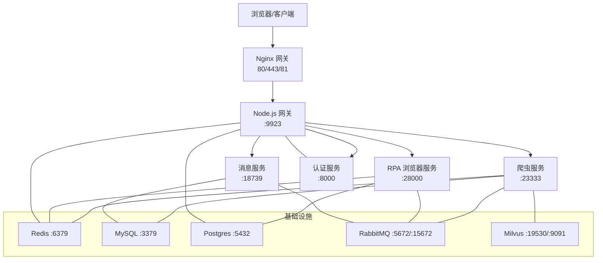
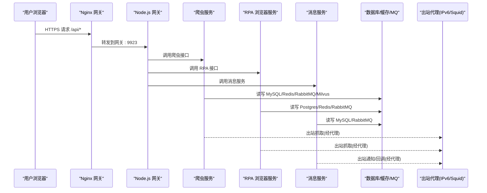
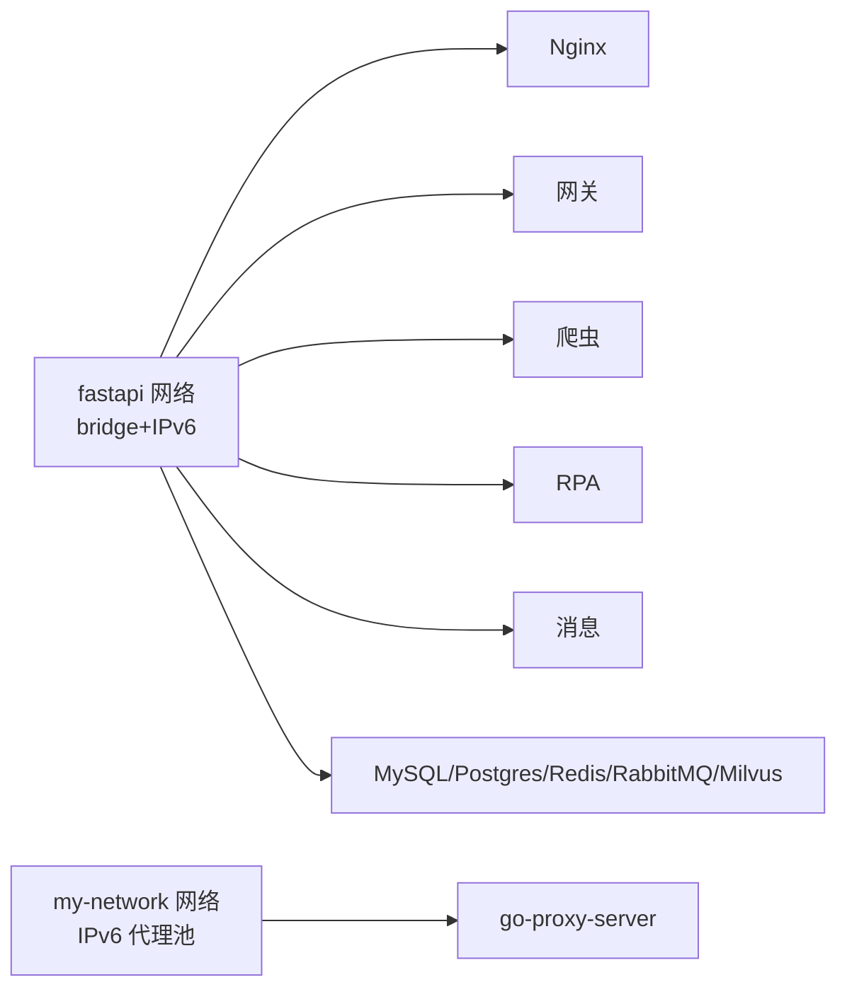
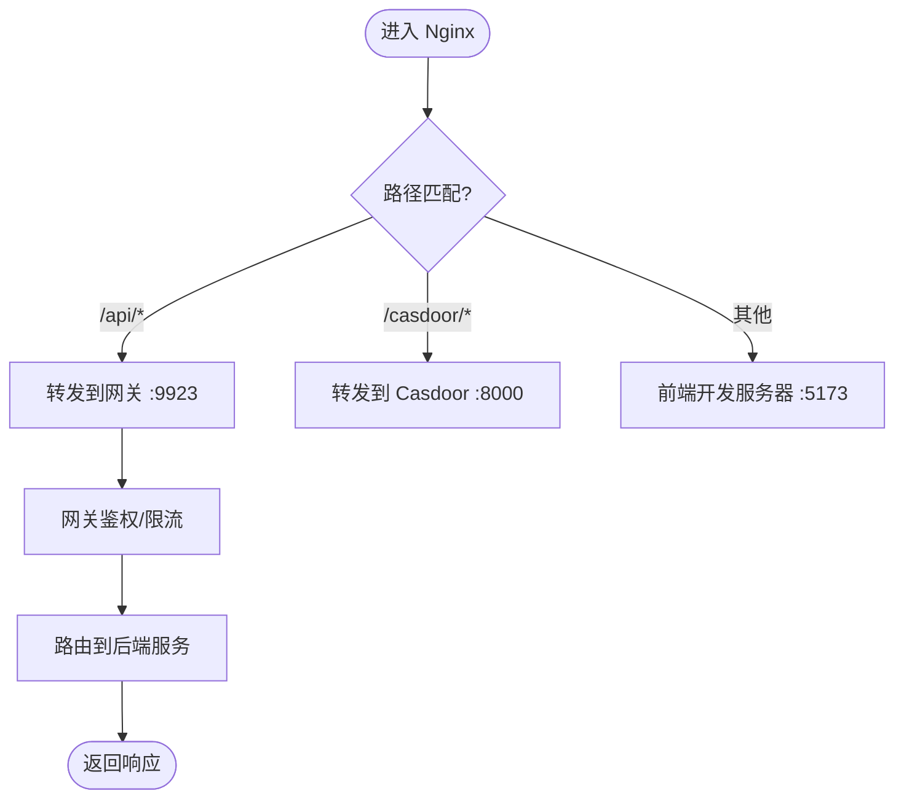
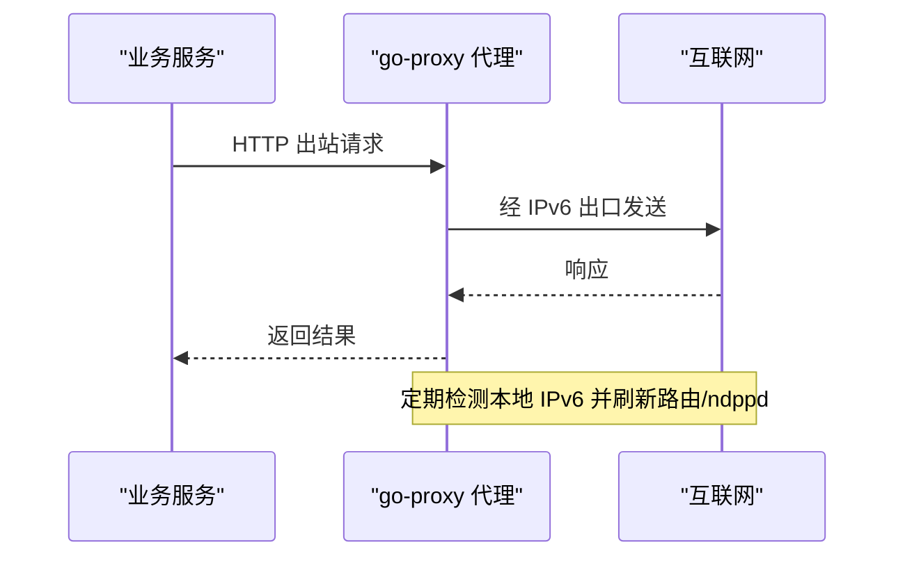
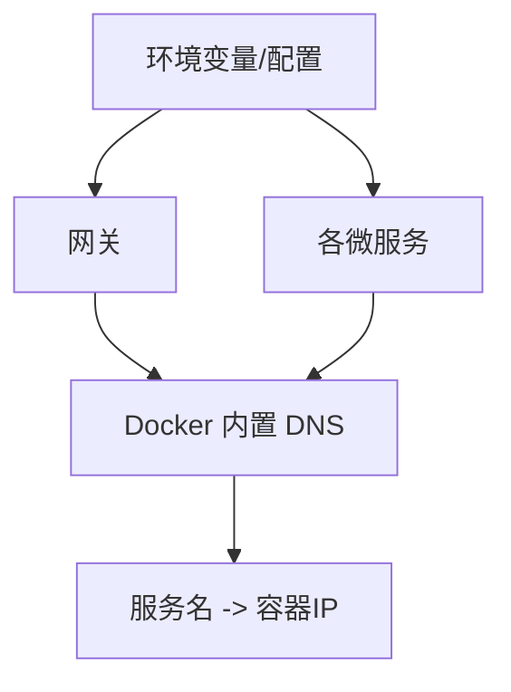
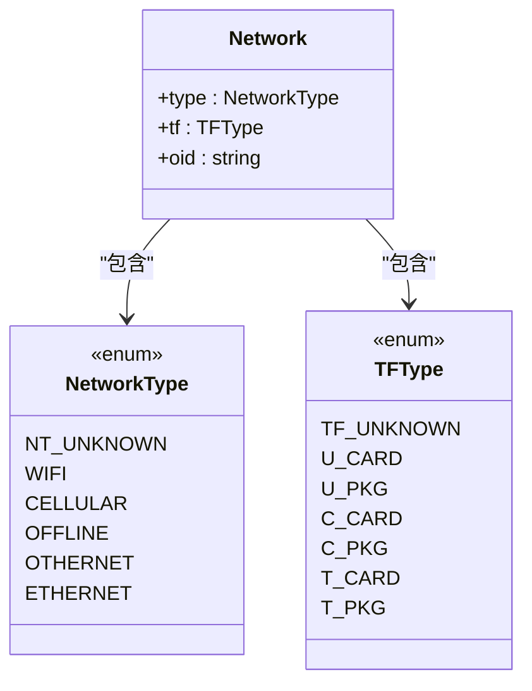
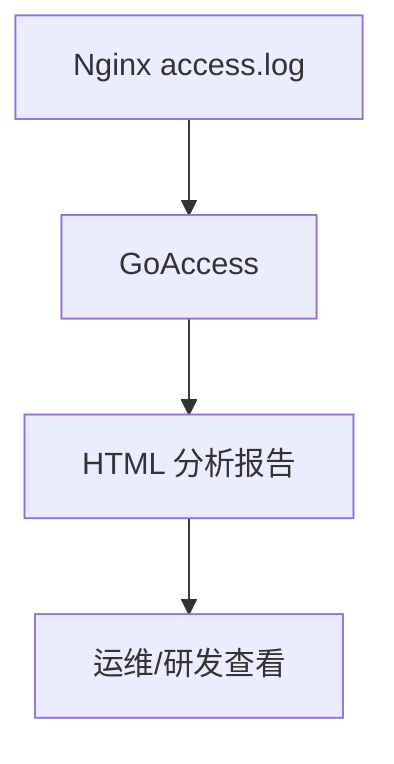
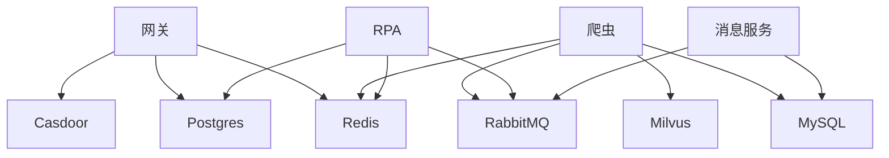
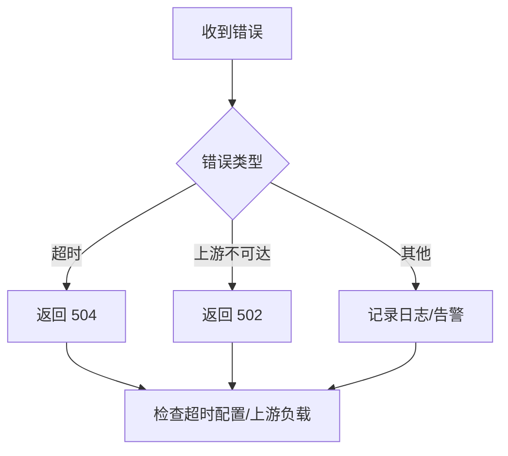

# 网络隔离策略

<cite>
**本文引用的文件**
- [docker-compose.yml](file://docker-compose.yml)
- [dc-dev.yml](file://dc-dev.yml)
- [nginx.conf](file://docker_vol/nginx/conf/nginx.conf)
- [config.yml](file://be-gateway/ExpressServerEnd/config/config.yml)
- [app.js](file://be-gateway/ExpressServerEnd/app.js)
- [go-proxy docker-compose.yml](file://go-proxy-ipv6-pool-auto/docker-compose.yml)
- [ipv6_monitor.go](file://go-proxy-ipv6-pool-auto/go-proxy-ipv6-pool/ipv6_monitor.go)
- [squid.example.conf](file://be-bilibili-crawler/scripts/光猫ip/squid.example.conf)
- [network.proto](file://be-bilibili-crawler/Service/GrpcModule/Grpc/GrpcProto/bilibili/metadata/network/network.proto)
- [NetworkErrorView.vue](file://Vue3FrontEndDemoExercise/src/views/NetworkErrorView.vue)
- [goaccess.conf](file://docker_vol/goaccess/goaccess.conf)
</cite>

## 目录
1. [简介](#简介)
2. [项目结构](#项目结构)
3. [核心组件](#核心组件)
4. [架构总览](#架构总览)
5. [详细组件分析](#详细组件分析)
6. [依赖关系分析](#依赖关系分析)
7. [性能与容量规划](#性能与容量规划)
8. [故障排查指南](#故障排查指南)
9. [结论](#结论)
10. [附录](#附录)

## 简介
本文件面向微服务集群的网络隔离与安全通信，覆盖容器网络拓扑、跨服务访问控制、外部 API 调用防护、服务发现与注册、流量监控与异常检测，以及常见通信故障（连接失败、延迟、超时）的排障方案。本项目基于 Docker Compose 编排，使用 Nginx 作为统一入口网关，内部服务通过 Docker 网络进行隔离与互通；消息中间件（RabbitMQ）、缓存（Redis）、数据库（MySQL/Postgres）与向量检索（Milvus）等基础设施均纳入同一网络域。对外出口通过 IPv6 代理池与 Squid 代理实现可控出站。

## 项目结构
- 编排与网络
  - 生产编排：[docker-compose.yml](file://docker-compose.yml)
  - 开发编排：[dc-dev.yml](file://dc-dev.yml)
  - 默认网络：bridge 驱动，启用 IPv6，命名 fastapi
  - 独立子网：IPv6 代理池网络 my-network（用于出站代理）
- 入口与路由
  - Nginx 反向代理：[nginx.conf](file://docker_vol/nginx/conf/nginx.conf)
  - 网关配置（RPC 超时、MQ 地址等）：[config.yml](file://be-gateway/ExpressServerEnd/config/config.yml)
- 出站代理与网络探测
  - IPv6 代理监控与动态更新：[ipv6_monitor.go](file://go-proxy-ipv6-pool-auto/go-proxy-ipv6-pool/ipv6_monitor.go)
  - 代理池编排：[go-proxy docker-compose.yml](file://go-proxy-ipv6-pool-auto/docker-compose.yml)
  - 可选 HTTP 代理（Squid）：[squid.example.conf](file://be-bilibili-crawler/scripts/光猫ip/squid.example.conf)
- 协议与元数据
  - gRPC 网络类型元数据定义：[network.proto](file://be-bilibili-crawler/Service/GrpcModule/Grpc/GrpcProto/bilibili/metadata/network/network.proto)
- 前端诊断
  - 网络错误与延迟检测页面：[NetworkErrorView.vue](file://Vue3FrontEndDemoExercise/src/views/NetworkErrorView.vue)
- 日志与流量分析
  - GoAccess 配置（Nginx 访问日志分析）：[goaccess.conf](file://docker_vol/goaccess/goaccess.conf)

**图示来源**
- [docker-compose.yml:120-309](file://docker-compose.yml#L120-L309)
- [nginx.conf:9-48](file://docker_vol/nginx/conf/nginx.conf#L9-L48)

**章节来源**
- [docker-compose.yml:1-380](file://docker-compose.yml#L1-L380)
- [dc-dev.yml:1-213](file://dc-dev.yml#L1-L213)
- [nginx.conf:1-71](file://docker_vol/nginx/conf/nginx.conf#L1-L71)

## 核心组件
- 网络边界与访问控制
  - Nginx 仅暴露 80/443/81，所有后端 API 经 /api 路由至网关，避免直接暴露服务端口。
  - 通过 extra_hosts 将 host.docker.internal 指向宿主机网关，便于容器间与宿主通信。
- 服务发现与通信
  - 服务间通过 Docker 网络名解析（如 mysql、redis、rabbitmq、standalone、be-message-service）。
  - 网关通过环境变量注入上游服务 URI（BILI_CRAWLER_URI、RPA_SERVICE_URI、MESSAGE_SERVICE_URI）。
- 出站流量控制
  - 通过 go-proxy 提供 IPv6 代理池，结合 squid 示例配置对出站进行 ACL 限制。
- 可观测性
  - Nginx 访问日志由 GoAccess 生成可视化报告；前端提供网络连通性与延迟检测。

**章节来源**
- [docker-compose.yml:165-309](file://docker-compose.yml#L165-L309)
- [nginx.conf:30-48](file://docker_vol/nginx/conf/nginx.conf#L30-L48)
- [go-proxy docker-compose.yml:1-19](file://go-proxy-ipv6-pool-auto/docker-compose.yml#L1-L19)
- [squid.example.conf:126-138](file://be-bilibili-crawler/scripts/光猫ip/squid.example.conf#L126-L138)

## 架构总览
下图展示从客户端到各微服务的请求路径、网络隔离边界与出站代理。

**图示来源**
- [nginx.conf:30-48](file://docker_vol/nginx/conf/nginx.conf#L30-L48)
- [docker-compose.yml:120-309](file://docker-compose.yml#L120-L309)
- [go-proxy docker-compose.yml:1-19](file://go-proxy-ipv6-pool-auto/docker-compose.yml#L1-L19)

## 详细组件分析

### 容器网络拓扑与命名空间
- 默认网络 fastapi（bridge + IPv6）承载全部服务，服务间通过容器名互相访问。
- 独立网络 my-network 承载 IPv6 代理池，隔离出站流量。
- 关键服务端口映射：
  - Nginx: 80/443/81
  - 网关: 9923
  - 爬虫: 23333
  - RPA: 28000
  - 消息: 18739
  - 认证: 8000
  - 数据库/缓存/MQ: 各自端口

**图示来源**
- [docker-compose.yml:372-380](file://docker-compose.yml#L372-L380)
- [go-proxy docker-compose.yml:12-18](file://go-proxy-ipv6-pool-auto/docker-compose.yml#L12-L18)

**章节来源**
- [docker-compose.yml:1-380](file://docker-compose.yml#L1-L380)
- [dc-dev.yml:206-213](file://dc-dev.yml#L206-L213)

### 跨服务通信安全与内网访问控制
- 入口最小化：仅 Nginx 暴露 80/443/81，其他服务不直接对外。
- 路径级路由：/api 前缀统一走网关，避免误暴露静态资源或管理端点。
- 认证与鉴权：Casdoor 集成于网关与消息服务，集中管理身份与会话。
- 出站 ACL：Squid 示例中允许 localnet/localhost，拒绝其余访问，可按需扩展。

**图示来源**
- [nginx.conf:22-48](file://docker_vol/nginx/conf/nginx.conf#L22-L48)
- [config.yml:23-29](file://be-gateway/ExpressServerEnd/config/config.yml#L23-L29)

**章节来源**
- [nginx.conf:1-71](file://docker_vol/nginx/conf/nginx.conf#L1-L71)
- [config.yml:1-29](file://be-gateway/ExpressServerEnd/config/config.yml#L1-L29)
- [squid.example.conf:126-138](file://be-bilibili-crawler/scripts/光猫ip/squid.example.conf#L126-L138)

### 外部 API 调用防护（出站代理）
- IPv6 代理池：通过 go-proxy 动态获取公网 IPv6 并刷新 ndppd 配置，保障出站 IP 轮换与可达性。
- 代理池编排：独立网络 my-network 隔离出站流量，端口 3128 暴露给需要出站的容器。
- 可选 HTTP 代理：Squid 示例提供 ACL 与缓存策略，便于对出站进行细粒度控制。

**图示来源**
- [ipv6_monitor.go:73-93](file://go-proxy-ipv6-pool-auto/go-proxy-ipv6-pool/ipv6_monitor.go#L73-L93)
- [go-proxy docker-compose.yml:1-19](file://go-proxy-ipv6-pool-auto/docker-compose.yml#L1-L19)

**章节来源**
- [ipv6_monitor.go:1-113](file://go-proxy-ipv6-pool-auto/go-proxy-ipv6-pool/ipv6_monitor.go#L1-L113)
- [go-proxy docker-compose.yml:1-19](file://go-proxy-ipv6-pool-auto/docker-compose.yml#L1-L19)
- [squid.example.conf:109-160](file://be-bilibili-crawler/scripts/光猫ip/squid.example.conf#L109-L160)

### 服务发现机制
- 基于 Docker 网络的服务名解析：服务通过容器名（如 rabbitmq、mysql、redis、standalone、be-message-service）相互发现。
- 环境变量注入：网关与服务通过环境变量配置上游地址（如 BILI_CRAWLER_URI、RPA_SERVICE_URI、MESSAGE_SERVICE_URI），避免硬编码。
- 健康检查：部分服务提供健康端点（如消息服务 /health），用于编排层探活。

**图示来源**
- [docker-compose.yml:131-149](file://docker-compose.yml#L131-L149)
- [docker-compose.yml:194-210](file://docker-compose.yml#L194-L210)
- [docker-compose.yml:279-307](file://docker-compose.yml#L279-L307)

**章节来源**
- [docker-compose.yml:120-309](file://docker-compose.yml#L120-L309)

### 协议与元数据（gRPC 网络类型）
- 在 gRPC 头部携带网络类型信息（如 WIFI/CELLULAR/ETHERNET），便于服务端根据网络环境做差异化处理。
- 该元数据可用于计费、限流或风控策略。

**图示来源**
- [network.proto:1-35](file://be-bilibili-crawler/Service/GrpcModule/Grpc/GrpcProto/bilibili/metadata/network/network.proto#L1-L35)

**章节来源**
- [network.proto:1-35](file://be-bilibili-crawler/Service/GrpcModule/Grpc/GrpcProto/bilibili/metadata/network/network.proto#L1-L35)

### 流量分析与监控
- Nginx 访问日志：GoAccess 读取 COMBINED 格式日志，输出 HTML 报表，支持 GeoIP 分析。
- 前端诊断：NetworkErrorView 提供 DNS 查询与 ping 测试，辅助定位网络问题。

**图示来源**
- [goaccess.conf:1-17](file://docker_vol/goaccess/goaccess.conf#L1-L17)
- [NetworkErrorView.vue:49-105](file://Vue3FrontEndDemoExercise/src/views/NetworkErrorView.vue#L49-L105)

**章节来源**
- [goaccess.conf:1-17](file://docker_vol/goaccess/goaccess.conf#L1-L17)
- [NetworkErrorView.vue:49-105](file://Vue3FrontEndDemoExercise/src/views/NetworkErrorView.vue#L49-L105)

## 依赖关系分析
- 服务启动顺序与依赖
  - 网关依赖 Postgres、Redis、Casdoor
  - 爬虫依赖 MySQL、Redis、RabbitMQ、Unidbg、Milvus
  - RPA 依赖 Postgres、Redis、RabbitMQ、Casdoor
  - 消息服务依赖 RabbitMQ、MySQL、Casdoor
- 网络耦合
  - 所有服务共享 fastapi 网络，服务名即 DNS 名称
  - 出站流量通过 my-network 隔离，避免污染主网络

**图示来源**
- [docker-compose.yml:120-309](file://docker-compose.yml#L120-L309)

**章节来源**
- [docker-compose.yml:120-309](file://docker-compose.yml#L120-L309)

## 性能与容量规划
- 并发与连接数
  - Nginx worker_connections 设置为 1024，可根据 QPS 调整。
- 资源限制
  - 爬虫服务设置内存上限 5G，防止 OOM。
- 超时与重试
  - 网关 RPC 超时配置为 5000ms，避免长尾阻塞。
  - 前端 fetch 请求设置 5s 超时，提升用户体验。
- 缓存与复用
  - Squid 可开启磁盘缓存与 refresh_pattern，降低重复请求开销。
- 可观测性
  - 通过 GoAccess 实时统计与 GeoIP 分析，快速定位热点与异常来源。

**章节来源**
- [nginx.conf:1-5](file://docker_vol/nginx/conf/nginx.conf#L1-L5)
- [docker-compose.yml:121-125](file://docker-compose.yml#L121-L125)
- [config.yml:23-29](file://be-gateway/ExpressServerEnd/config/config.yml#L23-L29)
- [NetworkErrorView.vue:69-105](file://Vue3FrontEndDemoExercise/src/views/NetworkErrorView.vue#L69-L105)
- [squid.example.conf:149-160](file://be-bilibili-crawler/scripts/光猫ip/squid.example.conf#L149-L160)

## 故障排查指南
- 常见问题定位
  - 连接被拒/不可达：检查上游服务是否启动、端口是否暴露、防火墙规则。
  - DNS 解析失败：确认 Docker 网络是否正常、服务名是否正确、DNS 是否可用。
  - 超时：检查网关 RPC 超时、前端 fetch 超时、出站代理可达性。
- 网关错误码映射
  - 超时（ETIMEDOUT/ESOCKETTIMEDOUT）→ 504
  - 上游不可达/无效响应 → 502
- 出站代理问题
  - 检查 IPv6 地址是否变化、ndppd 配置是否生效、代理端口是否开放。
- 日志与指标
  - 查看 Nginx 访问日志与 GoAccess 报告，定位高延迟与错误率。
  - 使用前端 NetworkErrorView 进行连通性与延迟测试。

**图示来源**
- [app.js:33-66](file://be-gateway/ExpressServerEnd/app.js#L33-L66)

**章节来源**
- [app.js:33-66](file://be-gateway/ExpressServerEnd/app.js#L33-L66)
- [ipv6_monitor.go:73-93](file://go-proxy-ipv6-pool-auto/go-proxy-ipv6-pool/ipv6_monitor.go#L73-L93)
- [goaccess.conf:1-17](file://docker_vol/goaccess/goaccess.conf#L1-L17)
- [NetworkErrorView.vue:49-105](file://Vue3FrontEndDemoExercise/src/views/NetworkErrorView.vue#L49-L105)

## 结论
本项目通过 Nginx 统一入口、Docker 网络隔离、环境变量驱动的服务发现与出站代理池，构建了清晰的内网访问边界与可控的外部出站通道。配合 GoAccess 与前端诊断工具，可实现对流量与异常的持续观测。建议在后续演进中引入更细粒度的网络策略（如服务网格或零信任模型），并完善链路追踪与指标采集，以进一步提升稳定性与可维护性。

## 附录
- 关键配置位置
  - 网络与端口：[docker-compose.yml](file://docker-compose.yml)
  - 入口路由：[nginx.conf](file://docker_vol/nginx/conf/nginx.conf)
  - 出站代理：[go-proxy docker-compose.yml](file://go-proxy-ipv6-pool-auto/docker-compose.yml)、[ipv6_monitor.go](file://go-proxy-ipv6-pool-auto/go-proxy-ipv6-pool/ipv6_monitor.go)
  - 出站 ACL：[squid.example.conf](file://be-bilibili-crawler/scripts/光猫ip/squid.example.conf)
  - 网关超时：[config.yml](file://be-gateway/ExpressServerEnd/config/config.yml)
  - 错误码映射：[app.js](file://be-gateway/ExpressServerEnd/app.js)
  - 网络元数据：[network.proto](file://be-bilibili-crawler/Service/GrpcModule/Grpc/GrpcProto/bilibili/metadata/network/network.proto)
  - 前端诊断：[NetworkErrorView.vue](file://Vue3FrontEndDemoExercise/src/views/NetworkErrorView.vue)
  - 日志分析：[goaccess.conf](file://docker_vol/goaccess/goaccess.conf)