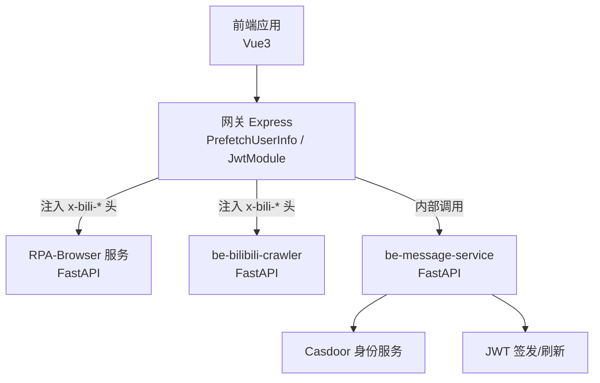
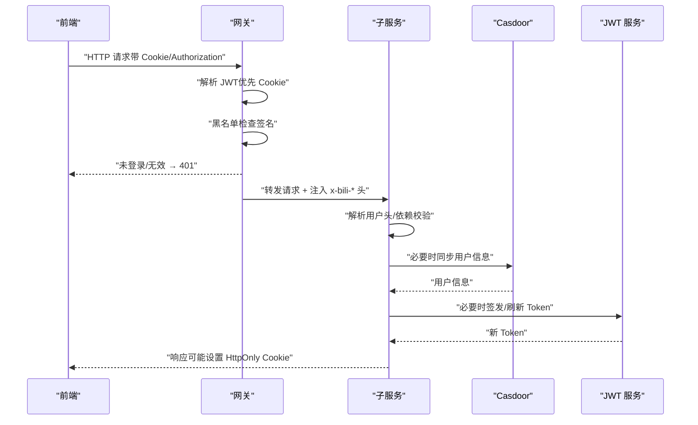
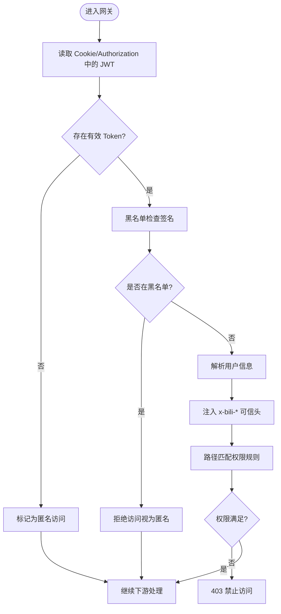
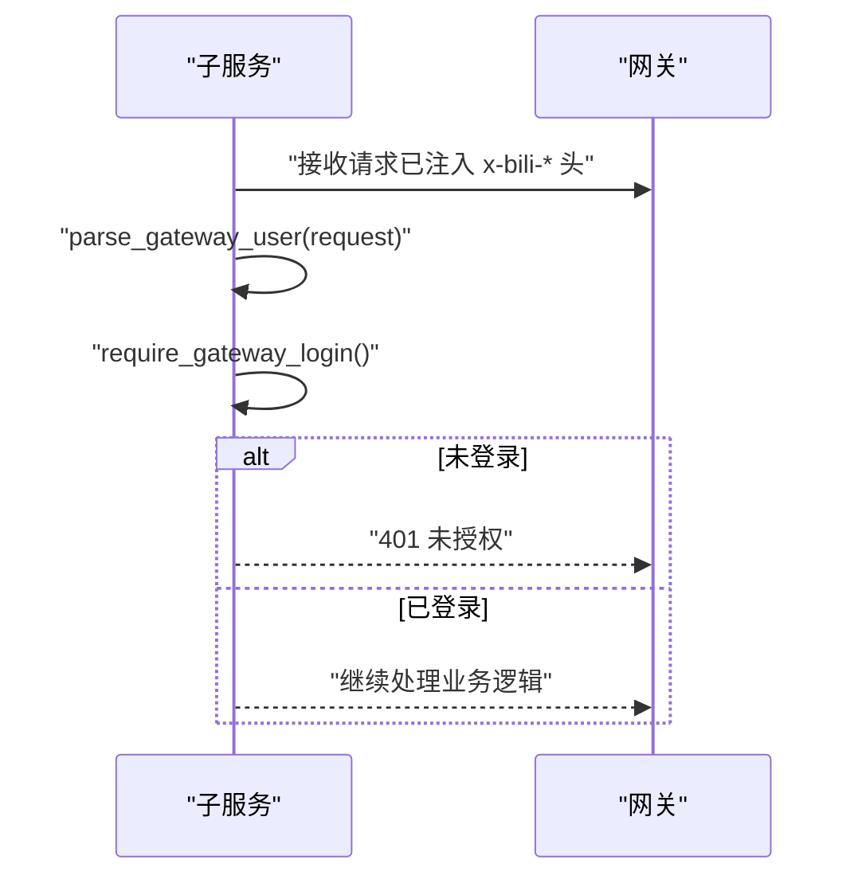
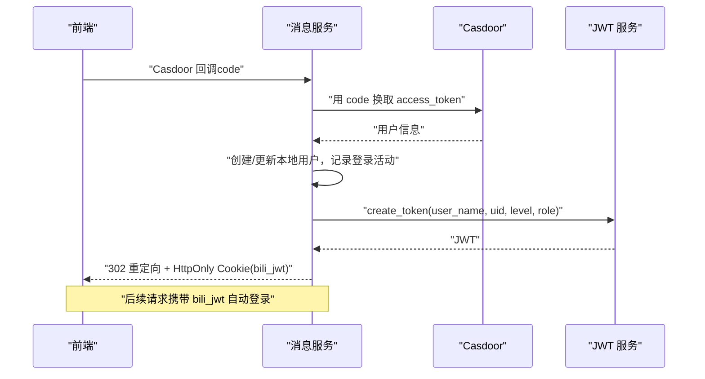
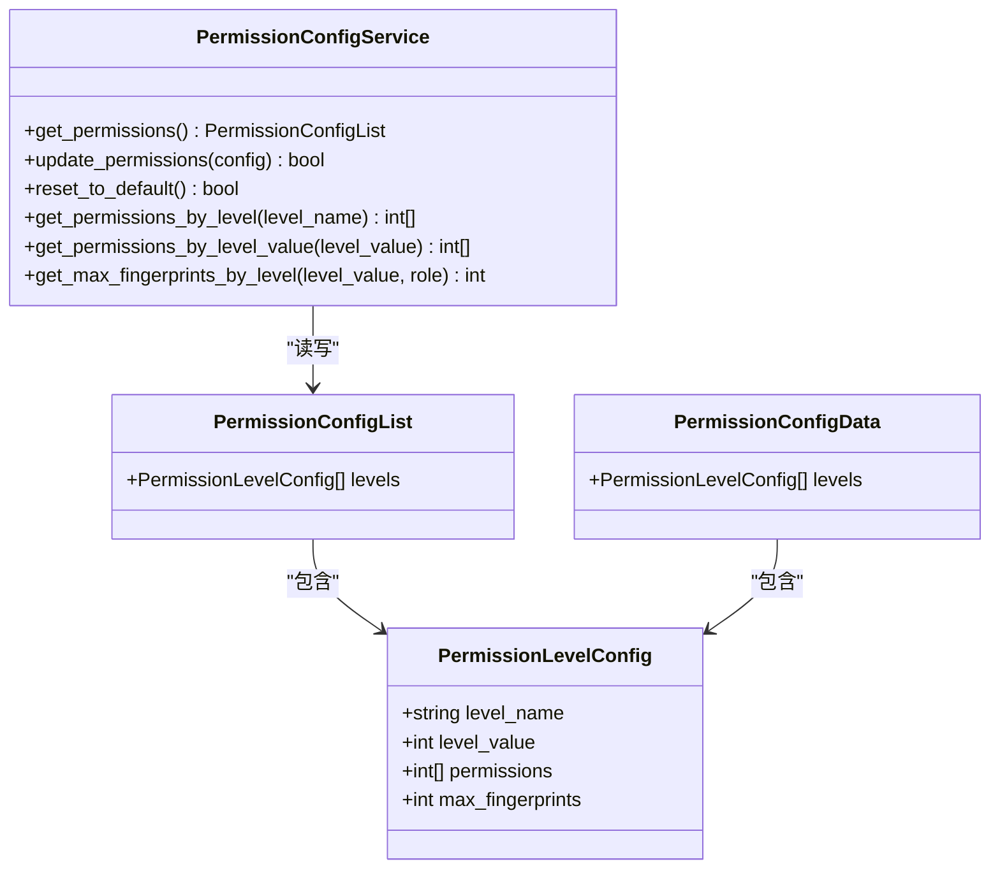
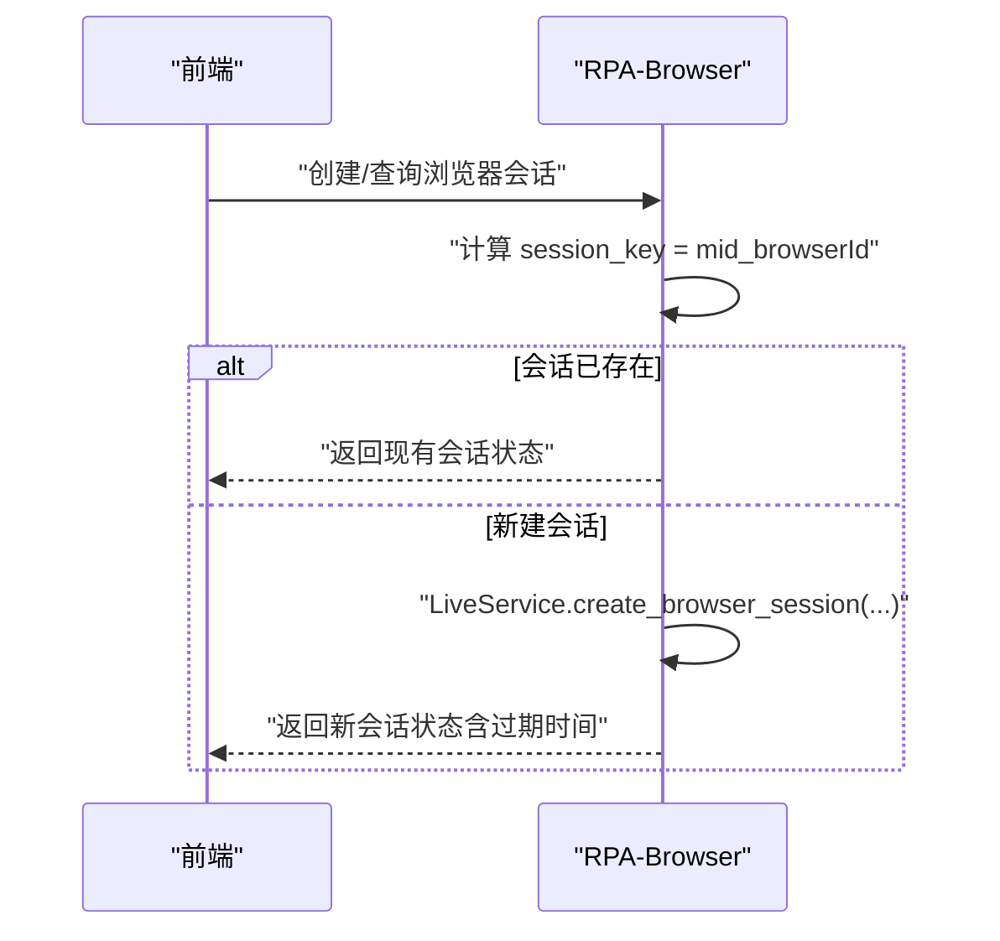
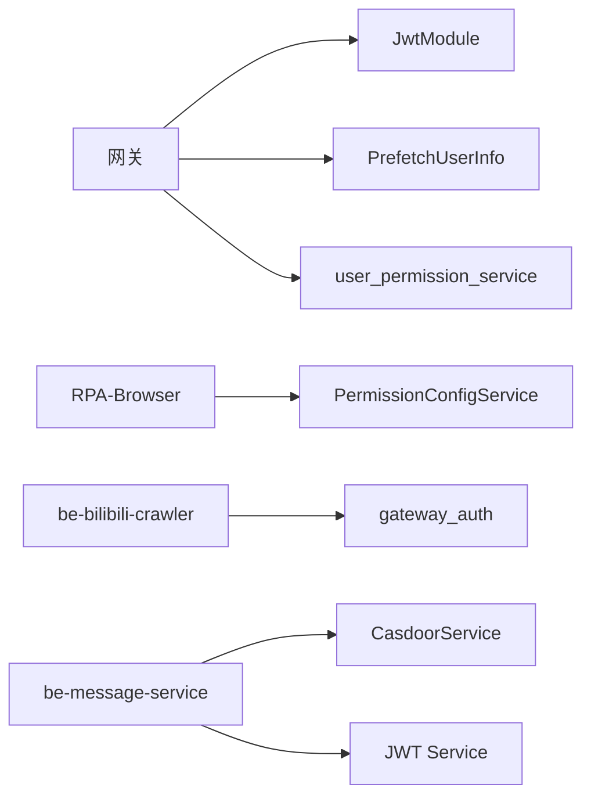

# 访问控制机制

<cite>
**本文引用的文件**
- [gateway_auth.py](file://be-bilibili-crawler/Utils/网关/gateway_auth.py)
- [PrefetchUserInfo.js](file://be-gateway/ExpressServerEnd/MiddleWare/PrefetchUserInfo.js)
- [JwtModule.js](file://be-gateway/ExpressServerEnd/Service/user_permission_module/JwtModule.js)
- [CasdoorService.js](file://be-gateway/ExpressServerEnd/Service/casdoor_module/CasdoorService.js)
- [user_permission_service.js](file://be-gateway/ExpressServerEnd/Service/user_permission_module/user_permission_service.js)
- [permission_router.py](file://RPA-Browser/app/controller/v1/admin/permission_router.py)
- [permission_config_service.py](file://RPA-Browser/app/services/RPA_browser/permission_config_service.py)
- [permission.py](file://RPA-Browser/app/models/system/permission.py)
- [admin_depends.py](file://RPA-Browser/app/utils/depends/admin_depends.py)
- [pptr_user_gateway.py](file://be-message-service/app/api/pptr_user_gateway.py)
- [jwt_service.py](file://be-message-service/app/services/infrastructure/jwt_service.py)
- [casdoor_service.py](file://be-message-service/app/services/user/casdoor_service.py)
</cite>

## 目录
1. [简介](#简介)
2. [项目结构](#项目结构)
3. [核心组件](#核心组件)
4. [架构总览](#架构总览)
5. [详细组件分析](#详细组件分析)
6. [依赖关系分析](#依赖关系分析)
7. [性能考量](#性能考量)
8. [故障排查指南](#故障排查指南)
9. [结论](#结论)
10. [附录](#附录)

## 简介
本文件系统化梳理本仓库的访问控制机制，覆盖身份认证、授权管理与权限控制策略。重点包括：
- JWT Token 验证与签发（含 HttpOnly Cookie 下发）
- Casdoor OAuth 集成与回调处理
- API 网关路由保护（可信用户头注入、黑名单校验）
- 细粒度权限控制（RBAC 模型、资源级限制）
- 会话管理（浏览器会话生命周期）
- 审计日志记录（登录活动、操作审计）

目标是帮助读者理解从前端到网关再到各后端服务的完整鉴权链路，并提供常见问题定位方法。

## 项目结构
本项目采用多服务协作的架构：
- 前端（Vue3）通过 HttpOnly Cookie 或 Authorization 头携带 JWT
- 网关（Express）负责统一鉴权、黑名单检查、将可信用户信息注入下游请求头
- 业务服务（FastAPI/Node/Python）基于网关注入的用户头或本地 JWT 进行二次校验与授权
- 权限配置以 JSON 文件形式存储并动态加载
- Casdoor 作为外部身份源，提供 OAuth 流程与用户信息同步

图表来源
- [PrefetchUserInfo.js:75-110](file://be-gateway/ExpressServerEnd/MiddleWare/PrefetchUserInfo.js#L75-L110)
- [JwtModule.js:133-155](file://be-gateway/ExpressServerEnd/Service/user_permission_module/JwtModule.js#L133-L155)
- [gateway_auth.py:64-121](file://be-bilibili-crawler/Utils/网关/gateway_auth.py#L64-L121)
- [pptr_user_gateway.py:988-1006](file://be-message-service/app/api/pptr_user_gateway.py#L988-L1006)

章节来源
- [PrefetchUserInfo.js:75-110](file://be-gateway/ExpressServerEnd/MiddleWare/PrefetchUserInfo.js#L75-L110)
- [JwtModule.js:133-155](file://be-gateway/ExpressServerEnd/Service/user_permission_module/JwtModule.js#L133-L155)
- [gateway_auth.py:64-121](file://be-bilibili-crawler/Utils/网关/gateway_auth.py#L64-L121)
- [pptr_user_gateway.py:988-1006](file://be-message-service/app/api/pptr_user_gateway.py#L988-L1006)

## 核心组件
- 网关层
  - PrefetchUserInfo：从 Cookie/Authorization 读取 JWT，校验黑名单，解析用户信息并注入可信头
  - JwtModule：JWT 签发、可选/强制校验中间件、Cookie 设置与清除
  - user_permission_service：基于 Trie 的路径匹配与权限映射，实现细粒度路由保护
- 业务服务层
  - RPA-Browser：管理员权限配置（JSON）、角色与细粒度权限依赖、浏览器会话管理
  - be-bilibili-crawler：网关用户头解析与登录态校验
  - be-message-service：Casdoor OAuth 回调、JWT 签发/刷新、登录活动记录
- 身份源
  - Casdoor：OAuth 授权码换取访问令牌、用户信息同步

章节来源
- [PrefetchUserInfo.js:75-110](file://be-gateway/ExpressServerEnd/MiddleWare/PrefetchUserInfo.js#L75-L110)
- [JwtModule.js:133-155](file://be-gateway/ExpressServerEnd/Service/user_permission_module/JwtModule.js#L133-L155)
- [user_permission_service.js:1-46](file://be-gateway/ExpressServerEnd/Service/user_permission_module/user_permission_service.js#L1-L46)
- [permission_router.py:14-76](file://RPA-Browser/app/controller/v1/admin/permission_router.py#L14-L76)
- [permission_config_service.py:15-168](file://RPA-Browser/app/services/RPA_browser/permission_config_service.py#L15-L168)
- [gateway_auth.py:64-121](file://be-bilibili-crawler/Utils/网关/gateway_auth.py#L64-L121)
- [pptr_user_gateway.py:988-1006](file://be-message-service/app/api/pptr_user_gateway.py#L988-L1006)

## 架构总览
下图展示一次受保护的 API 请求在系统中的流转过程：前端携带 JWT → 网关校验与注入 → 子服务解析用户头 → 权限判定 → 返回结果。

图表来源
- [PrefetchUserInfo.js:75-110](file://be-gateway/ExpressServerEnd/MiddleWare/PrefetchUserInfo.js#L75-L110)
- [JwtModule.js:133-155](file://be-gateway/ExpressServerEnd/Service/user_permission_module/JwtModule.js#L133-L155)
- [gateway_auth.py:64-121](file://be-bilibili-crawler/Utils/网关/gateway_auth.py#L64-L121)
- [pptr_user_gateway.py:988-1006](file://be-message-service/app/api/pptr_user_gateway.py#L988-L1006)

## 详细组件分析

### 组件A：网关层鉴权与路由保护
- 功能要点
  - 从 Cookie 或 Authorization 头提取 JWT
  - 黑名单校验（基于 JWT 签名）
  - 解析用户信息并注入可信头（x-bili-*）
  - 提供可选/强制 JWT 校验中间件
  - 基于路径与权限映射的细粒度路由保护（Trie 匹配）
- 关键流程
  - 可选登录中间件：无 Token 允许匿名访问；有 Token 则解析并注入 req.auth
  - 强制登录中间件：无 Token 直接拒绝
  - 路径匹配：根据 URL 模式匹配所需权限集合，结合用户 level 判断是否放行

图表来源
- [PrefetchUserInfo.js:75-110](file://be-gateway/ExpressServerEnd/MiddleWare/PrefetchUserInfo.js#L75-L110)
- [JwtModule.js:133-155](file://be-gateway/ExpressServerEnd/Service/user_permission_module/JwtModule.js#L133-L155)
- [user_permission_service.js:1-46](file://be-gateway/ExpressServerEnd/Service/user_permission_module/user_permission_service.js#L1-L46)

章节来源
- [PrefetchUserInfo.js:75-110](file://be-gateway/ExpressServerEnd/MiddleWare/PrefetchUserInfo.js#L75-L110)
- [JwtModule.js:133-155](file://be-gateway/ExpressServerEnd/Service/user_permission_module/JwtModule.js#L133-L155)
- [user_permission_service.js:1-46](file://be-gateway/ExpressServerEnd/Service/user_permission_module/user_permission_service.js#L1-L46)

### 组件B：子服务登录态校验（be-bilibili-crawler）
- 功能要点
  - 解析网关注入的 x-bili-* 头，构造 GatewayUserInfo
  - 依据 mid 是否为空判断登录态
  - 未登录时抛出 401 并记录告警日志
- 使用方式
  - 在 FastAPI 路由中通过 Depends(require_gateway_login) 强制要求已登录

图表来源
- [gateway_auth.py:64-121](file://be-bilibili-crawler/Utils/网关/gateway_auth.py#L64-L121)

章节来源
- [gateway_auth.py:64-121](file://be-bilibili-crawler/Utils/网关/gateway_auth.py#L64-L121)

### 组件C：Casdoor 集成与 JWT 签发（be-message-service）
- 功能要点
  - 处理 Casdoor OAuth 回调，创建本地用户并记录登录活动
  - 签发本地 JWT，并通过 HttpOnly Cookie 下发
  - 支持刷新 Token 并同步刷新 Casdoor token（best-effort）
  - 获取当前用户在 Casdoor 的完整信息
- 关键流程
  - 回调成功后重定向至前端，并在响应中设置 HttpOnly Cookie
  - 刷新接口返回新 Token，同时尝试刷新 Casdoor 侧 token

图表来源
- [pptr_user_gateway.py:988-1006](file://be-message-service/app/api/pptr_user_gateway.py#L988-L1006)
- [pptr_user_gateway.py:786-814](file://be-message-service/app/api/pptr_user_gateway.py#L786-L814)
- [casdoor_service.py](file://be-message-service/app/services/user/casdoor_service.py)
- [jwt_service.py](file://be-message-service/app/services/infrastructure/jwt_service.py)

章节来源
- [pptr_user_gateway.py:786-814](file://be-message-service/app/api/pptr_user_gateway.py#L786-L814)
- [pptr_user_gateway.py:988-1006](file://be-message-service/app/api/pptr_user_gateway.py#L988-L1006)
- [casdoor_service.py](file://be-message-service/app/services/user/casdoor_service.py)
- [jwt_service.py](file://be-message-service/app/services/infrastructure/jwt_service.py)

### 组件D：RBAC 模型与细粒度权限控制（RPA-Browser）
- 模型设计
  - 权限等级配置包含等级名称、数值、权限列表、最大指纹数等
  - 配置文件以 JSON 存储，支持动态读取与更新
- 权限校验
  - 管理员依赖 require_admin/require_root 进行角色校验
  - 细粒度权限依赖 require_permission(*perms) 进行资源级校验
- 配置管理
  - 提供获取、更新、重置权限配置的 API
  - 默认配置包含多个等级与 root 特殊权限

图表来源
- [permission.py:9-36](file://RPA-Browser/app/models/system/permission.py#L9-L36)
- [permission_config_service.py:15-168](file://RPA-Browser/app/services/RPA_browser/permission_config_service.py#L15-L168)

章节来源
- [permission.py:9-36](file://RPA-Browser/app/models/system/permission.py#L9-L36)
- [permission_config_service.py:15-168](file://RPA-Browser/app/services/RPA_browser/permission_config_service.py#L15-L168)
- [permission_router.py:14-76](file://RPA-Browser/app/controller/v1/admin/permission_router.py#L14-L76)
- [admin_depends.py:39-74](file://RPA-Browser/app/utils/depends/admin_depends.py#L39-L74)

### 组件E：会话管理（浏览器会话）
- 功能要点
  - 基于用户 mid 与 browser_id 生成会话键
  - 检查会话是否存在，避免重复创建
  - 返回会话状态（运行中/过期时间等）
- 安全考虑
  - 依赖 get_auth_info_from_header 确保仅本人可操作自身会话
  - 结合 verify_browser_ownership 防止越权访问他人浏览器实例

图表来源
- [session/router.py:38-114](file://RPA-Browser/app/controller/v1/browser_control/session/router.py#L38-L114)

章节来源
- [session/router.py:38-114](file://RPA-Browser/app/controller/v1/browser_control/session/router.py#L38-L114)

## 依赖关系分析
- 网关对 JWT 模块与黑名单缓存的依赖
- 子服务对网关注入头的强依赖（信任边界）
- 权限配置服务对 JSON 文件的读写依赖
- Casdoor 与 JWT 服务的协同（身份源与本地令牌）

图表来源
- [JwtModule.js:133-155](file://be-gateway/ExpressServerEnd/Service/user_permission_module/JwtModule.js#L133-L155)
- [PrefetchUserInfo.js:75-110](file://be-gateway/ExpressServerEnd/MiddleWare/PrefetchUserInfo.js#L75-L110)
- [user_permission_service.js:1-46](file://be-gateway/ExpressServerEnd/Service/user_permission_module/user_permission_service.js#L1-L46)
- [permission_config_service.py:15-168](file://RPA-Browser/app/services/RPA_browser/permission_config_service.py#L15-L168)
- [gateway_auth.py:64-121](file://be-bilibili-crawler/Utils/网关/gateway_auth.py#L64-L121)
- [casdoor_service.py](file://be-message-service/app/services/user/casdoor_service.py)
- [jwt_service.py](file://be-message-service/app/services/infrastructure/jwt_service.py)

章节来源
- [JwtModule.js:133-155](file://be-gateway/ExpressServerEnd/Service/user_permission_module/JwtModule.js#L133-L155)
- [PrefetchUserInfo.js:75-110](file://be-gateway/ExpressServerEnd/MiddleWare/PrefetchUserInfo.js#L75-L110)
- [user_permission_service.js:1-46](file://be-gateway/ExpressServerEnd/Service/user_permission_module/user_permission_service.js#L1-L46)
- [permission_config_service.py:15-168](file://RPA-Browser/app/services/RPA_browser/permission_config_service.py#L15-L168)
- [gateway_auth.py:64-121](file://be-bilibili-crawler/Utils/网关/gateway_auth.py#L64-L121)

## 性能考量
- 网关层黑名单检查应使用高效缓存（如 Redis），避免每次请求都进行数据库查询
- JWT 解析与签名校验应在网关集中处理，减少子服务负担
- 权限配置 JSON 文件读取可采用内存缓存，降低频繁 IO 开销
- 浏览器会话状态查询应避免阻塞，使用异步与连接池优化

[本节为通用指导，不直接分析具体文件]

## 故障排查指南
- 认证失败（401）
  - 检查前端是否正确设置 HttpOnly Cookie（bili_jwt）或 Authorization 头
  - 确认网关黑名单是否误判（JWT 签名是否在黑名单）
  - 子服务是否正确使用 require_gateway_login 或依赖解析用户头
- 权限不足（403）
  - 检查用户角色与权限配置（levels 与 permissions）
  - 确认管理员依赖 require_admin/require_root 与 require_permission 的使用
  - 核对路径匹配规则与权限映射是否一致
- 越权访问
  - 确保浏览器会话相关接口使用了 verify_browser_ownership 与 get_auth_info_from_header
  - 检查资源归属校验逻辑（如 mid 与资源 ID 的绑定）
- 登录流程异常
  - 查看 Casdoor 回调错误码与描述
  - 检查 JWT 签发与 Cookie 下发是否成功
  - 确认登录活动记录是否写入

章节来源
- [gateway_auth.py:108-121](file://be-bilibili-crawler/Utils/网关/gateway_auth.py#L108-L121)
- [PrefetchUserInfo.js:91-110](file://be-gateway/ExpressServerEnd/MiddleWare/PrefetchUserInfo.js#L91-L110)
- [admin_depends.py:39-74](file://RPA-Browser/app/utils/depends/admin_depends.py#L39-L74)
- [pptr_user_gateway.py:960-1006](file://be-message-service/app/api/pptr_user_gateway.py#L960-L1006)

## 结论
本项目的访问控制机制通过“网关统一鉴权 + 子服务细粒度授权”的分层设计，实现了高内聚、低耦合的安全体系。JWT 与 Casdoor 的结合确保了身份的可信性，RBAC 与资源级权限控制提供了灵活的授权能力。配合会话管理与审计日志，系统能够有效应对认证失败、权限不足与越权访问等常见问题。建议在生产环境中持续优化黑名单缓存、权限配置缓存与日志采集，以提升整体性能与可观测性。

[本节为总结性内容，不直接分析具体文件]

## 附录
- 术语说明
  - JWT：JSON Web Token，用于无状态身份认证
  - RBAC：基于角色的访问控制，通过角色分配权限
  - 细粒度权限：针对具体资源或操作的权限控制
  - HttpOnly Cookie：前端无法通过脚本读取的 Cookie，提升安全性
- 最佳实践
  - 所有敏感操作必须经过网关鉴权与子服务二次校验
  - 权限配置变更需记录审计日志并具备回滚能力
  - 定期清理黑名单与过期会话，避免资源泄漏

[本节为补充信息，不直接分析具体文件]