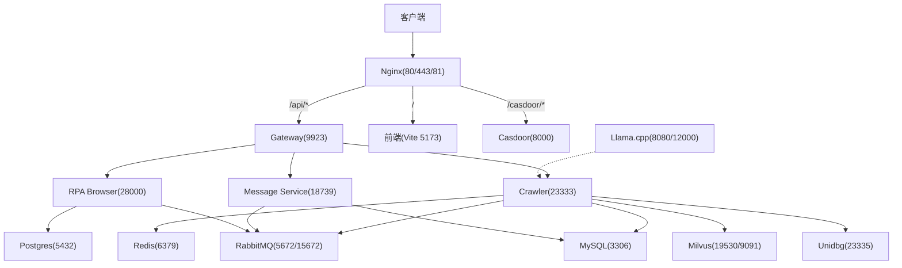
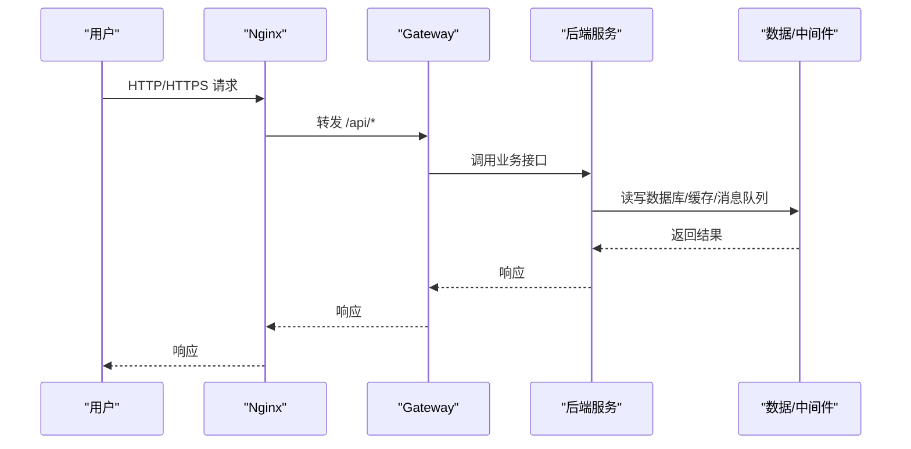
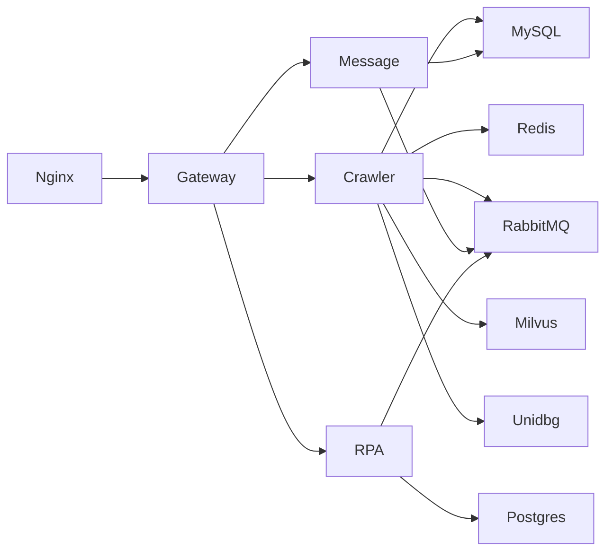

# 防火墙规则配置

<cite>
**本文引用的文件**
- [docker-compose.yml](file://docker-compose.yml)
- [nginx.conf](file://docker_vol/nginx/conf/nginx.conf)
- [Dockerfile.mono](file://Dockerfile.mono)
- [be-gateway Dockerfile](file://be-gateway/Dockerfile)
- [squid.example.conf](file://be-bilibili-crawler/scripts/光猫ip/squid.example.conf)
- [go-proxy-ipv6-pool-auto/docker-compose.yml](file://go-proxy-ipv6-pool-auto/docker-compose.yml)
- [unidbgSpringBoot/docker-compose.yml](file://unidbgSpringBoot/docker-compose.yml)
- [navigation.py](file://RPA-Browser/app/services/execution/actions/navigation.py)
</cite>

## 目录
1. [简介](#简介)
2. [项目结构](#项目结构)
3. [核心组件](#核心组件)
4. [架构总览](#架构总览)
5. [详细组件分析](#详细组件分析)
6. [依赖关系分析](#依赖关系分析)
7. [性能与安全考量](#性能与安全考量)
8. [故障排查指南](#故障排查指南)
9. [结论](#结论)
10. [附录：端口与访问策略清单](#附录端口与访问策略清单)

## 简介
本文件面向生产与开发环境，提供基于当前仓库的防火墙与网络安全策略配置说明。重点覆盖：
- Docker 容器网络隔离与默认桥接网络行为
- 服务端口暴露策略与最小化开放原则
- 外部网络访问限制（Nginx 反向代理、IPv6 代理池）
- 容器间通信权限管理（依赖声明、环境变量、内部域名）
- 安全策略（回环/私有地址拦截、HTTPS、证书挂载）
- 常见网络攻击防护与故障排查方法

## 项目结构
本项目采用多服务编排部署，核心网络边界由以下组件构成：
- Nginx：对外统一入口，监听 80/443/81，转发 API 与前端请求到后端网关
- Gateway（Node.js）：业务网关，负责鉴权、路由与限流等
- Crawler/RPA/Message Service：Python FastAPI 服务，仅通过 docker-compose 内部网络互通
- 中间件与数据层：MySQL、Postgres、Redis、RabbitMQ、Milvus、MinIO、etcd、Casdoor、Llama.cpp
- IPv6 代理池：可选的 Go 代理服务，用于出站流量出口 IP 轮换

图表来源
- [docker-compose.yml:1-380](file://docker-compose.yml#L1-L380)
- [nginx.conf:1-71](file://docker_vol/nginx/conf/nginx.conf#L1-L71)

章节来源
- [docker-compose.yml:1-380](file://docker-compose.yml#L1-L380)
- [nginx.conf:1-71](file://docker_vol/nginx/conf/nginx.conf#L1-L71)

## 核心组件
- 网络隔离
  - 所有服务运行在默认 bridge 网络 fastapi 上，启用 IPv6；容器间通过服务名解析互访
  - 仅 Nginx 暴露 80/443/81 到宿主机；其他服务端口仅在容器网络内可见或通过变量映射到宿主机
- 端口暴露策略
  - 对外：Nginx 80/443/81
  - 对宿主机（按需开启）：MySQL、Redis、RabbitMQ、Milvus、Postgres、Casdoor、Gateway、Crawler、RPA、Message、Llama
  - 内部：服务间通过环境变量与服务名通信，避免直接绑定 0.0.0.0
- 外部访问限制
  - Nginx 仅转发 /api/* 到 Gateway，/ 到前端，/casdoor/* 到 Casdoor，其余路径不暴露
  - 使用 HTTPS 与证书挂载，强制加密传输
- 容器间通信权限
  - 通过 depends_on 控制启动顺序
  - 通过环境变量传递连接信息（如数据库 URL、消息队列地址）
  - 敏感凭据通过环境变量注入，避免硬编码

章节来源
- [docker-compose.yml:1-380](file://docker-compose.yml#L1-L380)
- [nginx.conf:1-71](file://docker_vol/nginx/conf/nginx.conf#L1-L71)

## 架构总览
下图展示从客户端到各服务的请求路径与网络边界，突出 Nginx 作为唯一对外入口，以及内部服务间的依赖关系。

图表来源
- [docker-compose.yml:1-380](file://docker-compose.yml#L1-L380)
- [nginx.conf:1-71](file://docker_vol/nginx/conf/nginx.conf#L1-L71)

## 详细组件分析

### Nginx 反向代理与外部访问控制
- 监听 80/443/81，设置 Host、X-Forwarded-*、x-bili-* 等头部，便于上游识别真实来源
- 路径级转发：
  - /api/* → Gateway(9923)
  - / → 前端 Vite 开发服务器(5173)
  - /casdoor/* → Casdoor(10011)
  - 81 端口 → 特定管理端点(10011)
- 安全建议
  - 生产环境关闭 81 端口或限制来源 IP
  - 为 443 配置有效证书并启用 HSTS
  - 限制 /api/* 的请求频率与大小，结合 Gateway 限流

章节来源
- [nginx.conf:1-71](file://docker_vol/nginx/conf/nginx.conf#L1-L71)

### Gateway（Node.js）与 Python 服务
- Gateway 镜像暴露 9923（prod），开发模式 9926；通过 Nginx 对外暴露
- Python 服务（Crawler/RPA/Message）分别暴露 23333/28000/18739，通常不直接对外，仅内部访问
- 依赖声明确保启动顺序，环境变量传递连接参数，避免硬编码

章节来源
- [be-gateway Dockerfile:1-26](file://be-gateway/Dockerfile#L1-L26)
- [Dockerfile.mono:1-146](file://Dockerfile.mono#L1-L146)
- [docker-compose.yml:1-380](file://docker-compose.yml#L1-L380)

### 中间件与数据层（MySQL/Postgres/Redis/RabbitMQ/Milvus/MinIO/etcd/Casdoor/Llama）
- 数据与中间件服务默认仅内部网络可达；如需远程管理（如 MySQL/Redis/RabbitMQ WebUI），应严格限制来源 IP 或使用 VPN/Tunnel
- Milvus 暴露 19530/9091，仅用于向量检索，不应直接对外
- MinIO 控制台 9001 与 API 9000 需限制访问
- Llama.cpp 暴露 8080/12000，仅限内部调用

章节来源
- [docker-compose.yml:1-380](file://docker-compose.yml#L1-L380)

### IPv6 代理池与出站流量控制
- 独立 compose 定义 IPv6 代理池网络，启用 IPv6 并指定子网
- squid 示例配置演示了：
  - 仅允许 IPv6 出站（拒绝 IPv4）
  - 白名单域名（如 bilibili chat、geetest）
  - CONNECT 方法仅允许 SSL 端口
  - 按目标地址映射出站 IPv6 地址与端口
- 适用场景：爬虫/自动化任务需要稳定且可追踪的出站 IPv6 出口

章节来源
- [go-proxy-ipv6-pool-auto/docker-compose.yml:1-19](file://go-proxy-ipv6-pool-auto/docker-compose.yml#L1-L19)
- [squid.example.conf:1-160](file://be-bilibili-crawler/scripts/光猫ip/squid.example.conf#L1-L160)

### RPA 浏览器安全策略（防 SSRF/内网探测）
- 禁止访问回环地址（127.0.0.1、::1、0.0.0.0）
- 禁止访问私有地址、链路本地地址、多播地址
- 对 IPv4/IPv6 分别进行网段与地址类型检查，阻断潜在 SSRF 利用

章节来源
- [navigation.py:42-69](file://RPA-Browser/app/services/execution/actions/navigation.py#L42-L69)

## 依赖关系分析
- 启动依赖
  - Gateway 依赖 Postgres、Redis、Casdoor
  - Crawler 依赖 MySQL、Redis、RabbitMQ、Unidbg、Milvus、Message Service
  - RPA 依赖 Postgres、Redis、RabbitMQ、Casdoor
  - Message Service 依赖 RabbitMQ、MySQL、Casdoor
- 网络拓扑
  - 所有服务在同一 bridge 网络，通过服务名解析
  - Nginx 作为唯一对外入口，其他服务端口仅在容器网络内可见（除非显式映射到宿主机）

图表来源
- [docker-compose.yml:1-380](file://docker-compose.yml#L1-L380)

章节来源
- [docker-compose.yml:1-380](file://docker-compose.yml#L1-L380)

## 性能与安全考量
- 性能
  - Nginx worker_processes auto，合理设置 worker_connections
  - 数据库与缓存服务资源隔离，避免争用
  - 大模型推理服务（Llama）按需启用 GPU 资源预留
- 安全
  - 最小化端口暴露：仅 Nginx 对外；其他服务通过内部网络访问
  - 强制 HTTPS：Nginx 配置证书与头信息
  - 输入校验与 SSRF 防护：RPA 模块已内置地址安全检查
  - 出站流量控制：通过 IPv6 代理池与 squid ACL 限制目的域与协议
  - 凭据管理：全部通过环境变量注入，避免硬编码

[本节为通用指导，无需具体文件引用]

## 故障排查指南
- 无法访问 /api/*
  - 检查 Nginx 是否将 /api/* 正确转发到 Gateway(9923)
  - 确认 Gateway 容器健康且端口未被占用
  - 查看 Nginx 日志定位上游错误
- 前端页面无法加载
  - 确认 Nginx / 位置块转发到 Vite 5173
  - 检查浏览器控制台 CORS 与 WebSocket 升级头
- 数据库/缓存连接失败
  - 检查对应服务容器状态与环境变量
  - 验证容器网络连通性（ping 服务名）
- RabbitMQ 管理界面不可达
  - 确认 15672 端口是否映射到宿主机及来源 IP 限制
- Llama 服务超时
  - 检查 GPU 资源预留与模型加载状态
  - 调整并发与超时参数

[本节为通用指导，无需具体文件引用]

## 结论
通过 Nginx 统一入口、严格的端口暴露策略、容器间依赖管理与出站流量控制，本项目实现了清晰的网络边界与最小权限访问。配合 RPA 的安全检查与 IPv6 代理池，可有效降低 SSRF、内网探测与非法出站风险。建议在生产环境中进一步收紧端口映射、启用 WAF/限流、完善审计日志与告警机制。

[本节为总结，无需具体文件引用]

## 附录：端口与访问策略清单
- 对外端口（宿主→容器）
  - Nginx: 80/443/81
  - 其他服务端口（按需开启）：MySQL、Redis、RabbitMQ、Milvus、Postgres、Casdoor、Gateway、Crawler、RPA、Message、Llama
- 内部端口（容器间）
  - 服务名解析 + 环境变量连接
- 访问控制要点
  - Nginx 路径级转发（/api/*、/、/casdoor/*）
  - 仅允许必要的外部访问，其余保持内部网络隔离
  - 出站流量通过 IPv6 代理池与 squid ACL 限制

章节来源
- [docker-compose.yml:1-380](file://docker-compose.yml#L1-L380)
- [nginx.conf:1-71](file://docker_vol/nginx/conf/nginx.conf#L1-L71)
- [go-proxy-ipv6-pool-auto/docker-compose.yml:1-19](file://go-proxy-ipv6-pool-auto/docker-compose.yml#L1-L19)
- [squid.example.conf:1-160](file://be-bilibili-crawler/scripts/光猫ip/squid.example.conf#L1-L160)
- [unidbgSpringBoot/docker-compose.yml:1-6](file://unidbgSpringBoot/docker-compose.yml#L1-L6)