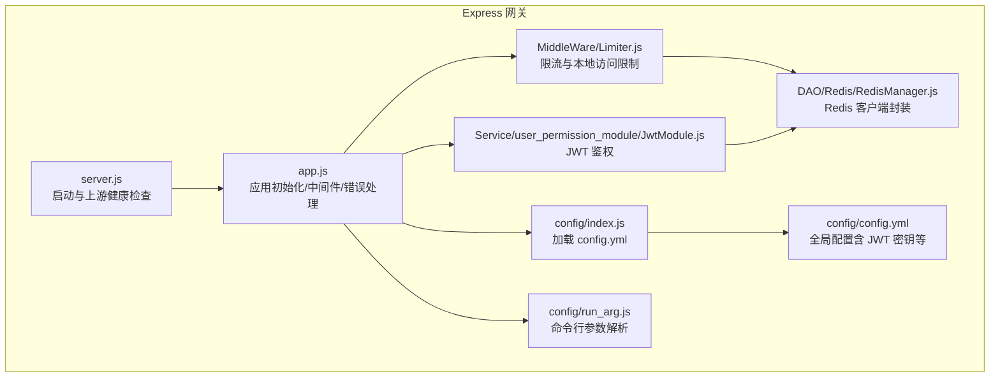
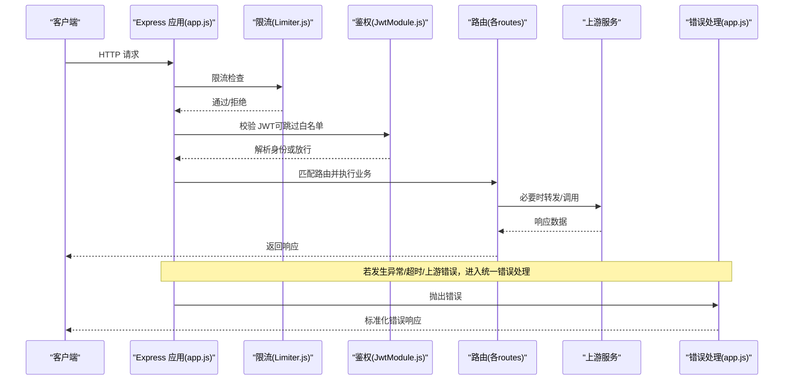
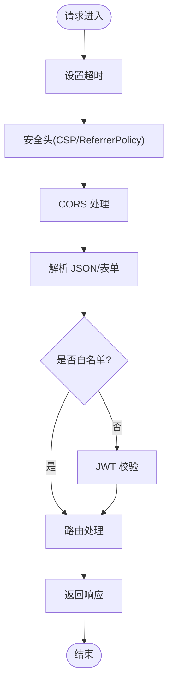
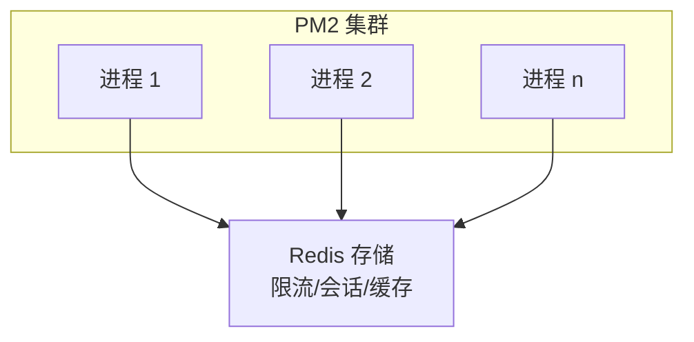
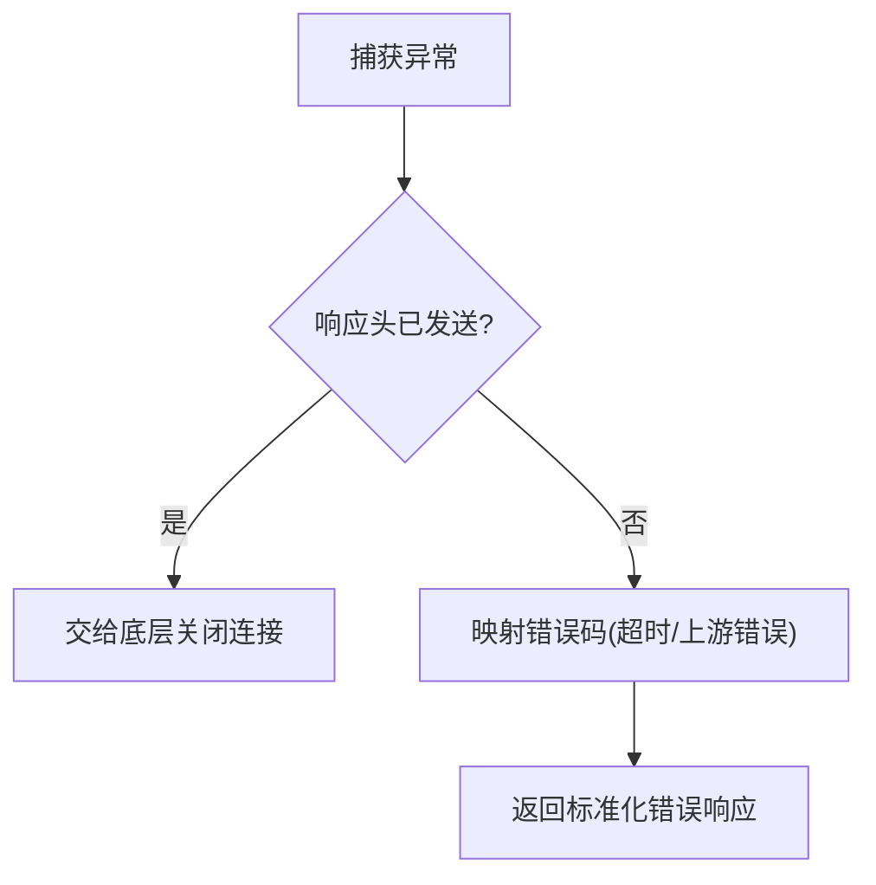
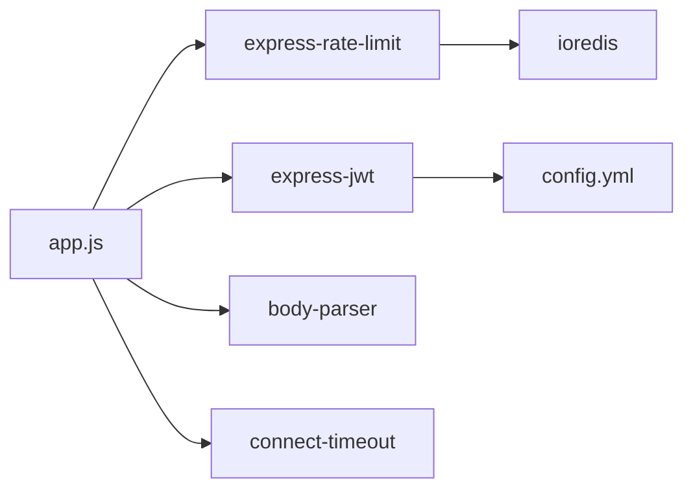

# Express.js 应用性能优化

<cite>
**本文引用的文件**
- [app.js](file://be-gateway/ExpressServerEnd/app.js)
- [server.js](file://be-gateway/ExpressServerEnd/server.js)
- [Limiter.js](file://be-gateway/ExpressServerEnd/MiddleWare/Limiter.js)
- [RedisManager.js](file://be-gateway/ExpressServerEnd/DAO/Redis/RedisManager.js)
- [JwtModule.js](file://be-gateway/ExpressServerEnd/Service/user_permission_module/JwtModule.js)
- [config.yml](file://be-gateway/ExpressServerEnd/config/config.yml)
- [index.js](file://be-gateway/ExpressServerEnd/config/index.js)
- [run_arg.js](file://be-gateway/ExpressServerEnd/config/run_arg.js)
- [package.json](file://be-gateway/package.json)
- [pm2.app.js](file://pm2.app.js)
</cite>

## 目录
1. [简介](#简介)
2. [项目结构](#项目结构)
3. [核心组件](#核心组件)
4. [架构总览](#架构总览)
5. [详细组件分析](#详细组件分析)
6. [依赖关系分析](#依赖关系分析)
7. [性能考量](#性能考量)
8. [故障排查指南](#故障排查指南)
9. [结论](#结论)
10. [附录](#附录)

## 简介
本指南面向基于 Express.js 的网关服务，结合仓库中的实际实现，系统性地阐述 Node.js 事件循环优化、内存管理、中间件与请求处理优化、集群与多进程部署策略，以及常见性能问题的定位与解决。重点覆盖：
- 非阻塞 I/O、流式处理与背压控制
- V8 调优、垃圾回收与大对象处理
- 中间件执行顺序、错误处理与日志中间件优化
- 路由、模板渲染与静态资源优化
- PM2 集群、负载均衡与会话共享
- 内存泄漏检测、CPU 使用率优化与数据库连接池配置

## 项目结构
本项目为多语言微服务集合，其中 Express 网关位于 be-gateway/ExpressServerEnd，负责统一入口、鉴权、限流、代理转发与错误处理；同时提供 Redis 连接管理与运行参数解析等基础设施。

图表来源
- [app.js:1-188](file://be-gateway/ExpressServerEnd/app.js#L1-L188)
- [server.js:1-43](file://be-gateway/ExpressServerEnd/server.js#L1-L43)
- [Limiter.js:1-69](file://be-gateway/ExpressServerEnd/MiddleWare/Limiter.js#L1-L69)
- [RedisManager.js:1-21](file://be-gateway/ExpressServerEnd/DAO/Redis/RedisManager.js#L1-L21)
- [JwtModule.js:1-157](file://be-gateway/ExpressServerEnd/Service/user_permission_module/JwtModule.js#L1-L157)
- [index.js:1-7](file://be-gateway/ExpressServerEnd/config/index.js#L1-L7)
- [config.yml:1-29](file://be-gateway/ExpressServerEnd/config/config.yml#L1-L29)
- [run_arg.js:1-4](file://be-gateway/ExpressServerEnd/config/run_arg.js#L1-L4)

章节来源
- [app.js:1-188](file://be-gateway/ExpressServerEnd/app.js#L1-L188)
- [server.js:1-43](file://be-gateway/ExpressServerEnd/server.js#L1-L43)
- [package.json:1-75](file://be-gateway/package.json#L1-L75)

## 核心组件
- 应用装配与中间件管线：在 app.js 中完成安全头、超时、CORS、JSON/表单解析、JWT 鉴权、路由注册与统一错误处理。
- 启动与健康检查：server.js 在监听前调用上游健康检查，关键服务不可用时拒绝启动。
- 限流与访问控制：Limiter.js 基于 express-rate-limit + RedisStore 实现分布式限流，并提供本地访问限制。
- 鉴权模块：JwtModule.js 从 HttpOnly Cookie 提取 JWT，支持白名单路径与可选登录模式。
- 配置中心：config/index.js 读取 YAML 配置，包含 JWT 密钥、RPC 超时等。
- Redis 客户端：RedisManager.js 封装 ioredis 连接，供限流与后续缓存/会话使用。

章节来源
- [app.js:1-188](file://be-gateway/ExpressServerEnd/app.js#L1-L188)
- [server.js:1-43](file://be-gateway/ExpressServerEnd/server.js#L1-L43)
- [Limiter.js:1-69](file://be-gateway/ExpressServerEnd/MiddleWare/Limiter.js#L1-L69)
- [JwtModule.js:1-157](file://be-gateway/ExpressServerEnd/Service/user_permission_module/JwtModule.js#L1-L157)
- [index.js:1-7](file://be-gateway/ExpressServerEnd/config/index.js#L1-L7)
- [config.yml:1-29](file://be-gateway/ExpressServerEnd/config/config.yml#L1-L29)
- [RedisManager.js:1-21](file://be-gateway/ExpressServerEnd/DAO/Redis/RedisManager.js#L1-L21)

## 架构总览
下图展示一次典型请求从进入网关到返回响应的流程，包括鉴权、限流、路由与错误处理。

图表来源
- [app.js:1-188](file://be-gateway/ExpressServerEnd/app.js#L1-L188)
- [Limiter.js:1-69](file://be-gateway/ExpressServerEnd/MiddleWare/Limiter.js#L1-L69)
- [JwtModule.js:1-157](file://be-gateway/ExpressServerEnd/Service/user_permission_module/JwtModule.js#L1-L157)

## 详细组件分析

### 事件循环与非阻塞 I/O 优化
- 超时与背压
  - 使用 connect-timeout 对请求设置整体超时，避免长连接占用事件循环。
  - 限流器基于 Redis 计数，减少本地内存压力，并通过 keyGenerator 按 IP 维度统计，防止单点滥用。
- 非阻塞 I/O
  - 所有外部依赖（Redis、上游服务、数据库）均通过异步接口调用，避免阻塞主线程。
  - 启动阶段进行上游健康检查，失败则快速退出，避免无效请求进入事件循环。
- 建议实践
  - 将 CPU 密集型任务下沉至 Worker 线程或独立服务，保持请求链路轻量。
  - 大文件/大数据采用流式传输，避免一次性加载到内存。

章节来源
- [app.js:68-117](file://be-gateway/ExpressServerEnd/app.js#L68-L117)
- [Limiter.js:20-51](file://be-gateway/ExpressServerEnd/MiddleWare/Limiter.js#L20-L51)
- [server.js:17-43](file://be-gateway/ExpressServerEnd/server.js#L17-L43)

### 内存管理与 V8 调优
- 内存泄漏防护
  - 避免在全局或闭包中持有大对象引用；确保定时器、事件监听器正确清理。
  - 使用 Redis 存储热点数据与限流计数，降低进程内存占用。
- V8 与 GC 优化
  - 合理设置 Node 启动参数以调整堆大小与 GC 行为（如 --max-old-space-size），根据实例规格与负载调优。
  - 监控堆快照与增长趋势，定位未释放引用。
- 大对象处理
  - 对大响应体启用压缩与分块输出；避免在中间件中构造超大对象。
  - 图片/文件上传走流式处理，及时写入磁盘或对象存储。

章节来源
- [RedisManager.js:1-21](file://be-gateway/ExpressServerEnd/DAO/Redis/RedisManager.js#L1-L21)
- [Limiter.js:20-51](file://be-gateway/ExpressServerEnd/MiddleWare/Limiter.js#L20-L51)

### 中间件性能优化
- 执行顺序
  - 先安全头与超时，再 CORS、解析、鉴权、路由，最后错误处理。该顺序可减少不必要的解析与鉴权开销。
- 鉴权优化
  - 白名单路径跳过 JWT 校验，减少不必要计算。
  - 从 HttpOnly Cookie 读取令牌，避免前端 localStorage 带来的额外风险与开销。
- 限流优化
  - 使用 RedisStore 做分布式计数，key 前缀隔离不同业务场景。
  - 自定义 keyGenerator 可按真实客户端 IP 生成键，提高准确性。
- 日志中间件
  - 开发环境记录请求耗时与入参，生产环境关闭详细日志以减少 I/O 与序列化开销。

图表来源
- [app.js:68-117](file://be-gateway/ExpressServerEnd/app.js#L68-L117)
- [JwtModule.js:86-131](file://be-gateway/ExpressServerEnd/Service/user_permission_module/JwtModule.js#L86-L131)
- [Limiter.js:20-51](file://be-gateway/ExpressServerEnd/MiddleWare/Limiter.js#L20-L51)

章节来源
- [app.js:68-117](file://be-gateway/ExpressServerEnd/app.js#L68-L117)
- [JwtModule.js:1-157](file://be-gateway/ExpressServerEnd/Service/user_permission_module/JwtModule.js#L1-L157)
- [Limiter.js:1-69](file://be-gateway/ExpressServerEnd/MiddleWare/Limiter.js#L1-L69)

### 请求处理优化
- 路由优化
  - 将高频路由前置，减少匹配成本；将无关路由拆分到独立模块，按需加载。
- 模板渲染优化
  - 使用服务端缓存与增量渲染；避免在渲染过程中进行同步阻塞操作。
- 静态文件服务优化
  - 将静态资源交由反向代理（Nginx）或 CDN 托管；应用层仅处理 API。
- 上游调用优化
  - 对上游调用设置超时与重试上限；对慢查询进行降级与熔断。

章节来源
- [app.js:113-117](file://be-gateway/ExpressServerEnd/app.js#L113-L117)
- [server.js:17-43](file://be-gateway/ExpressServerEnd/server.js#L17-L43)

### 集群与多进程优化
- PM2 配置
  - 使用 PM2 以 cluster 模式启动多个工作进程，提升并发能力与容错性。
  - 通过环境变量与配置文件区分开发与生产环境。
- 负载均衡
  - 由 PM2 内部轮询分发请求；对外可通过 Nginx 做四层/七层负载均衡。
- 会话共享
  - 使用 Redis 作为会话与限流的共享存储，保证多进程一致性。

图表来源
- [pm2.app.js:1-11](file://pm2.app.js#L1-L11)
- [Limiter.js:20-51](file://be-gateway/ExpressServerEnd/MiddleWare/Limiter.js#L20-L51)
- [RedisManager.js:1-21](file://be-gateway/ExpressServerEnd/DAO/Redis/RedisManager.js#L1-L21)

章节来源
- [pm2.app.js:1-11](file://pm2.app.js#L1-L11)
- [Limiter.js:20-51](file://be-gateway/ExpressServerEnd/MiddleWare/Limiter.js#L20-L51)
- [RedisManager.js:1-21](file://be-gateway/ExpressServerEnd/DAO/Redis/RedisManager.js#L1-L21)

### 错误处理与健壮性
- 统一错误映射
  - 将超时与上游网络错误映射为合适的 HTTP 状态码（如 504/502），便于前端与网关层识别。
- 权限与校验错误
  - 权限不足与参数校验错误统一返回结构化响应，保持 HTTP 200 但通过 body.code 区分业务状态。
- 生产环境日志
  - 生产环境仅记录必要错误信息，避免敏感信息泄露与过多 I/O。

图表来源
- [app.js:119-185](file://be-gateway/ExpressServerEnd/app.js#L119-L185)

章节来源
- [app.js:119-185](file://be-gateway/ExpressServerEnd/app.js#L119-L185)

## 依赖关系分析
- 运行时依赖
  - express、body-parser、cors、helmet、connect-timeout、express-jwt、express-rate-limit、ioredis、axios/superagent 等。
- 关键耦合
  - 限流模块强依赖 Redis；鉴权模块依赖配置中心的 JWT 密钥；启动流程依赖上游健康检查。
- 潜在风险
  - 若 Redis 不可用，限流失效；需增加降级策略（如本地内存限速）。
  - 上游服务不稳定时，应配合超时、重试与熔断策略。

图表来源
- [package.json:20-63](file://be-gateway/package.json#L20-L63)
- [Limiter.js:1-69](file://be-gateway/ExpressServerEnd/MiddleWare/Limiter.js#L1-L69)
- [JwtModule.js:1-157](file://be-gateway/ExpressServerEnd/Service/user_permission_module/JwtModule.js#L1-L157)
- [config.yml:1-29](file://be-gateway/ExpressServerEnd/config/config.yml#L1-L29)

章节来源
- [package.json:20-63](file://be-gateway/package.json#L20-L63)
- [Limiter.js:1-69](file://be-gateway/ExpressServerEnd/MiddleWare/Limiter.js#L1-L69)
- [JwtModule.js:1-157](file://be-gateway/ExpressServerEnd/Service/user_permission_module/JwtModule.js#L1-L157)
- [config.yml:1-29](file://be-gateway/ExpressServerEnd/config/config.yml#L1-L29)

## 性能考量
- 事件循环
  - 避免长时间同步计算；将 CPU 密集任务移出请求链路。
  - 合理使用 stream 与 backpressure，避免内存峰值过高。
- 内存管理
  - 定期采集堆快照，定位泄漏；减少全局变量与闭包引用。
  - 对大对象进行分片处理或落盘。
- 中间件
  - 精简中间件数量；将日志与调试仅在开发环境开启。
  - 使用白名单跳过不必要的鉴权步骤。
- 请求处理
  - 路由分组与懒加载；静态资源外置。
  - 对上游调用设置合理的超时与重试策略。
- 集群与部署
  - PM2 多进程 + Redis 共享状态；结合 Nginx 做负载均衡与 TLS 终止。
  - 容器化部署时合理设置资源限制与探针。

[本节为通用指导，不直接分析具体文件]

## 故障排查指南
- 常见问题定位
  - 内存泄漏：使用 heapdump 与 Chrome DevTools 分析堆快照，关注未释放的全局引用与定时器。
  - CPU 高占用：使用 perf 或 clinic 工具定位热点函数，减少同步阻塞。
  - 数据库连接池：确认连接数、空闲超时与最大连接数配置，避免连接耗尽。
- 网关层问题
  - 上游超时：检查 connect-timeout 与上游响应时间，必要时增加重试与降级。
  - 限流误杀：核对 Redis 键前缀与 keyGenerator，确保按预期维度限流。
- 日志与监控
  - 开发环境保留详细日志；生产环境仅记录关键指标与错误。
  - 接入 APM 与指标采集，建立告警阈值。

章节来源
- [app.js:68-117](file://be-gateway/ExpressServerEnd/app.js#L68-L117)
- [app.js:119-185](file://be-gateway/ExpressServerEnd/app.js#L119-L185)
- [Limiter.js:20-51](file://be-gateway/ExpressServerEnd/MiddleWare/Limiter.js#L20-L51)

## 结论
通过对事件循环、内存管理、中间件、请求处理与集群部署的系统优化，可显著提升 Express 网关的性能与稳定性。结合仓库中的实际实现，建议在现有基础上持续完善限流降级、上游熔断、监控告警与容量规划，形成闭环的性能治理体系。

[本节为总结性内容，不直接分析具体文件]

## 附录
- 常用命令与脚本
  - 生产/开发启动脚本见 package.json scripts。
  - PM2 配置文件用于进程管理与日志输出。
- 配置项说明
  - config.yml 包含 JWT 密钥、RPC 超时等关键配置，请妥善保管。
  - run_arg.js 解析命令行参数，便于灵活切换环境与端口。

章节来源
- [package.json:6-14](file://be-gateway/package.json#L6-L14)
- [pm2.app.js:1-11](file://pm2.app.js#L1-L11)
- [config.yml:1-29](file://be-gateway/ExpressServerEnd/config/config.yml#L1-L29)
- [run_arg.js:1-4](file://be-gateway/ExpressServerEnd/config/run_arg.js#L1-L4)