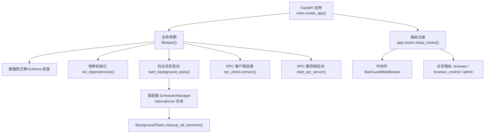
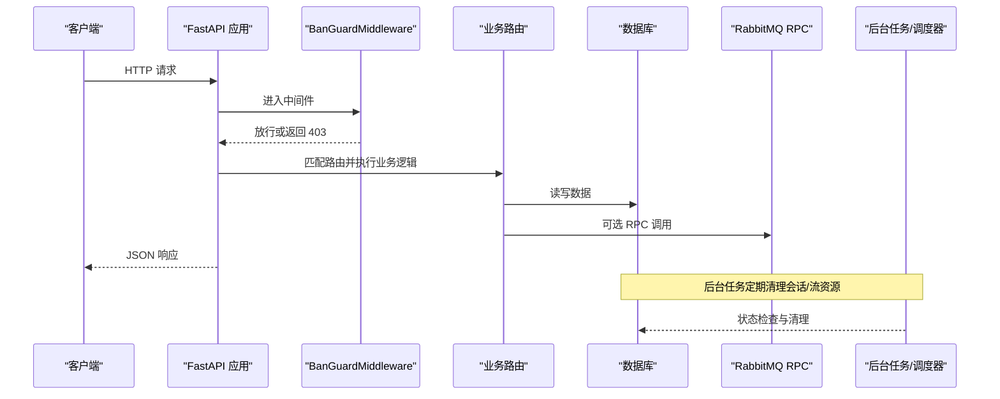
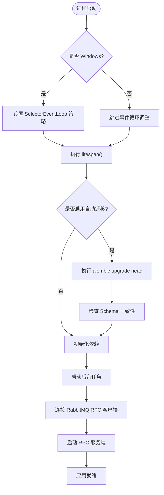
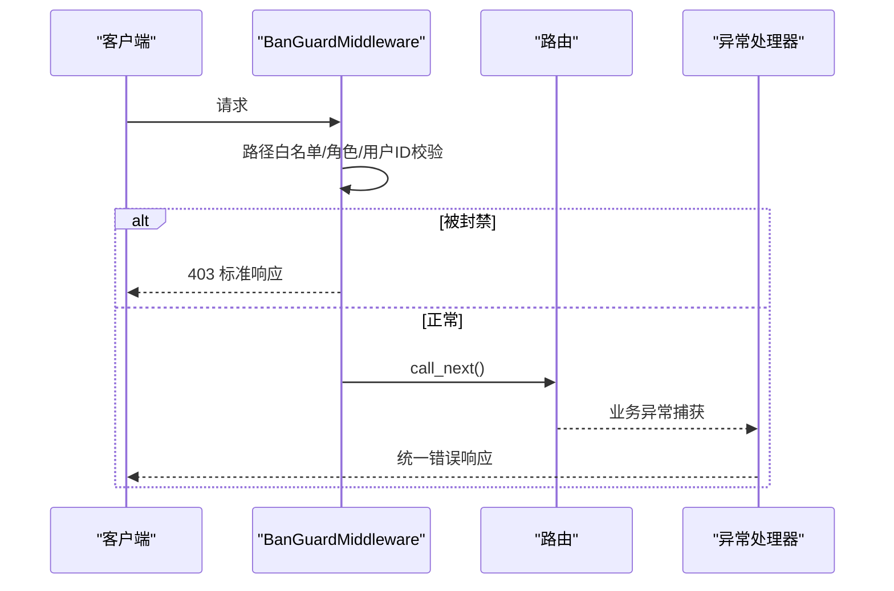
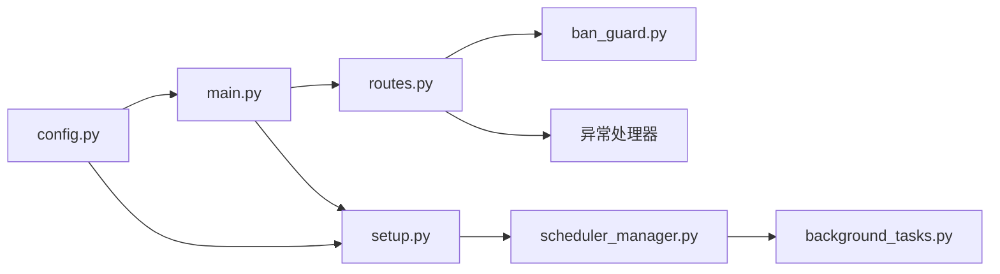

# FastAPI 应用性能优化

<cite>
**本文引用的文件**
- [main.py](file://RPA-Browser/main.py)
- [config.py](file://RPA-Browser/app/config.py)
- [setup.py](file://RPA-Browser/app/setup.py)
- [routes.py](file://RPA-Browser/app/routes.py)
- [ban_guard.py](file://RPA-Browser/app/utils/middlewares/ban_guard.py)
- [scheduler_manager.py](file://RPA-Browser/app/scheduler_manager.py)
- [background_tasks.py](file://RPA-Browser/app/services/RPA_browser/background_tasks.py)
</cite>

## 目录
1. [简介](#简介)
2. [项目结构](#项目结构)
3. [核心组件](#核心组件)
4. [架构总览](#架构总览)
5. [详细组件分析](#详细组件分析)
6. [依赖关系分析](#依赖关系分析)
7. [性能考量](#性能考量)
8. [故障排查指南](#故障排查指南)
9. [结论](#结论)
10. [附录](#附录)

## 简介
本指南面向基于 FastAPI 的 RPA-Browser 服务，围绕异步处理、数据库连接池与缓存、内存管理、CPU 资源分配、请求处理流水线、监控与可观测性、启动时间优化、静态文件与 WebSocket 调优等主题，提供系统化、可落地的性能优化方案。内容结合仓库中的生命周期管理、中间件、后台任务调度器、配置项与异常处理机制，给出最佳实践与排障建议。

## 项目结构
RPA-Browser 采用模块化组织：入口通过 lifespan 完成依赖初始化、迁移校验、后台任务与 RPC 服务启停；路由注册集中管理中间件与异常处理器；配置通过 Settings 统一加载；后台任务由 APScheduler 驱动，定期执行会话清理等维护工作。

图表来源
- [main.py:36-64](file://RPA-Browser/main.py#L36-L64)
- [routes.py:20-47](file://RPA-Browser/app/routes.py#L20-L47)
- [setup.py:26-47](file://RPA-Browser/app/setup.py#L26-L47)
- [scheduler_manager.py:13-192](file://RPA-Browser/app/scheduler_manager.py#L13-L192)
- [background_tasks.py:8-42](file://RPA-Browser/app/services/RPA_browser/background_tasks.py#L8-L42)

章节来源
- [main.py:1-83](file://RPA-Browser/main.py#L1-L83)
- [routes.py:1-48](file://RPA-Browser/app/routes.py#L1-L48)
- [setup.py:1-47](file://RPA-Browser/app/setup.py#L1-L47)

## 核心组件
- 应用生命周期与启动流程：在 lifespan 中完成迁移、依赖注入、后台任务与 RPC 服务的启动与关闭，确保资源有序管理与错误快速暴露。
- 路由与中间件：集中注册封禁拦截中间件与各类异常处理器，保证请求在进入业务前进行安全与一致性校验。
- 后台任务调度：使用 APScheduler 统一管理定时任务（如会话清理），支持间隔与 Cron 触发，并提供装饰器简化注册。
- 配置中心：通过 pydantic-settings 加载多环境配置，包含浏览器会话策略、WebRTC 超时、Alembic 迁移开关等关键性能参数。

章节来源
- [main.py:36-74](file://RPA-Browser/main.py#L36-L74)
- [routes.py:20-47](file://RPA-Browser/app/routes.py#L20-L47)
- [scheduler_manager.py:13-192](file://RPA-Browser/app/scheduler_manager.py#L13-L192)
- [config.py:140-216](file://RPA-Browser/app/config.py#L140-L216)

## 架构总览
下图展示请求从进入 FastAPI 到返回响应的关键路径，以及后台任务对资源的周期性维护。

图表来源
- [routes.py:20-47](file://RPA-Browser/app/routes.py#L20-L47)
- [ban_guard.py:32-76](file://RPA-Browser/app/utils/middlewares/ban_guard.py#L32-L76)
- [background_tasks.py:8-42](file://RPA-Browser/app/services/RPA_browser/background_tasks.py#L8-L42)

## 详细组件分析

### 异步处理优化策略
- 事件循环与平台适配：在 Windows 上切换至 SelectorEventLoop 以提升稳定性，避免默认事件循环带来的兼容性问题。
- 生命周期内异步初始化：迁移、依赖注入、RPC 连接均在 lifespan 中异步完成，减少阻塞并提高启动可控性。
- 后台任务异步化：调度器以 AsyncIOScheduler 运行，任务函数可通过 async_wrapper 将同步代码放入线程池执行，避免阻塞事件循环。

图表来源
- [main.py:17-64](file://RPA-Browser/main.py#L17-L64)
- [setup.py:26-47](file://RPA-Browser/app/setup.py#L26-L47)
- [scheduler_manager.py:174-192](file://RPA-Browser/app/scheduler_manager.py#L174-L192)

章节来源
- [main.py:17-64](file://RPA-Browser/main.py#L17-L64)
- [scheduler_manager.py:174-192](file://RPA-Browser/app/scheduler_manager.py#L174-L192)

### 数据库连接池与缓存策略
- 连接池与迁移：通过 Alembic 在启动时执行升级与 Schema 校验，确保模型与数据库一致，避免运行时异常导致的连接浪费。
- 心跳与长连接：RabbitMQ 连接配置 heartbeat=180，避免长时间处理导致的心跳超时断开，提升 RPC 通道稳定性。
- 缓存建议：封禁状态查询已采用带 TTL 的内存缓存（中间件注释说明），建议在热点读场景引入 Redis 缓存层，降低数据库压力。

章节来源
- [main.py:41-46](file://RPA-Browser/main.py#L41-L46)
- [config.py:156-159](file://RPA-Browser/app/config.py#L156-L159)
- [ban_guard.py:6-9](file://RPA-Browser/app/utils/middlewares/ban_guard.py#L6-L9)

### 内存管理优化
- 对象生命周期管理：通过 lifespan 显式管理依赖、RPC 客户端与服务端的生命周期，确保退出时释放资源。
- 大文件处理：建议对上传/下载使用分块传输与流式处理，避免一次性加载到大内存；结合 Nginx 反向代理限制请求体大小。
- 泄漏预防：后台任务中避免持有全局引用；会话清理任务定期回收闲置/过期资源，防止内存持续增长。

章节来源
- [main.py:50-64](file://RPA-Browser/main.py#L50-L64)
- [background_tasks.py:11-42](file://RPA-Browser/app/services/RPA_browser/background_tasks.py#L11-L42)

### CPU 资源分配优化
- 进程池与线程池：对于 CPU 密集任务，使用进程池隔离以避免 GIL 限制；IO 密集任务保持异步，必要时用 asyncio.to_thread 包装同步代码。
- 并行计算：将重计算任务下沉至独立 Worker 或服务，通过消息队列解耦，避免阻塞主事件循环。
- 调度器优化：合理设置任务间隔与 misfire_grace_time，避免任务堆积与重复执行。

章节来源
- [scheduler_manager.py:38-86](file://RPA-Browser/app/scheduler_manager.py#L38-L86)
- [scheduler_manager.py:174-192](file://RPA-Browser/app/scheduler_manager.py#L174-L192)

### 请求处理流水线优化
- 中间件性能调优：封禁拦截中间件在路径白名单后快速放行，命中封禁时直接返回标准响应，减少不必要的业务开销。
- 路由优化：按层级顺序 include_router，便于统一权限与审计；将高频路由置于靠前位置以减少匹配成本。
- 响应序列化：使用 Pydantic 模型统一响应结构，减少手动拼装；对大对象考虑分页与字段裁剪。

图表来源
- [ban_guard.py:32-76](file://RPA-Browser/app/utils/middlewares/ban_guard.py#L32-L76)
- [routes.py:35-47](file://RPA-Browser/app/routes.py#L35-L47)

章节来源
- [ban_guard.py:22-76](file://RPA-Browser/app/utils/middlewares/ban_guard.py#L22-L76)
- [routes.py:20-47](file://RPA-Browser/app/routes.py#L20-L47)

### 性能监控集成方案
- APM 工具集成：建议在 lifespan 中初始化 APM SDK，记录请求耗时、错误率与依赖调用链。
- 指标收集：为关键操作（迁移、RPC 调用、会话清理）埋点，输出结构化日志与指标。
- 瓶颈分析：结合慢查询日志与中间件耗时统计，定位热点接口与资源竞争点。

[本节为通用指导，不直接分析具体文件]

## 依赖关系分析
- 应用入口依赖路由注册、生命周期与 Uvicorn 服务器。
- 路由依赖中间件与异常处理器，形成统一的请求处理管线。
- 后台任务依赖调度器与业务服务，负责资源维护与清理。
- 配置集中管理，影响迁移、会话策略、WebRTC 超时等关键行为。

图表来源
- [main.py:1-83](file://RPA-Browser/main.py#L1-L83)
- [routes.py:1-48](file://RPA-Browser/app/routes.py#L1-L48)
- [setup.py:1-47](file://RPA-Browser/app/setup.py#L1-L47)
- [scheduler_manager.py:1-192](file://RPA-Browser/app/scheduler_manager.py#L1-L192)
- [background_tasks.py:1-42](file://RPA-Browser/app/services/RPA_browser/background_tasks.py#L1-L42)
- [config.py:1-235](file://RPA-Browser/app/config.py#L1-L235)

章节来源
- [main.py:1-83](file://RPA-Browser/main.py#L1-L83)
- [routes.py:1-48](file://RPA-Browser/app/routes.py#L1-L48)
- [setup.py:1-47](file://RPA-Browser/app/setup.py#L1-L47)
- [scheduler_manager.py:1-192](file://RPA-Browser/app/scheduler_manager.py#L1-L192)
- [background_tasks.py:1-42](file://RPA-Browser/app/services/RPA_browser/background_tasks.py#L1-L42)
- [config.py:1-235](file://RPA-Browser/app/config.py#L1-L235)

## 性能考量
- 启动时间优化
  - 条件执行迁移：仅在开启自动迁移时执行升级与校验，避免冷启动开销。
  - 延迟初始化：非关键依赖（如部分 RPC 客户端）可在首次使用时懒加载。
  - 预编译文档：使用 fastapi_cdn_host 加速 OpenAPI/ReDoc 文档加载。
- 静态文件服务
  - 通过 Nginx 反向代理静态资源，减轻应用负载。
  - 启用缓存头与压缩，减少带宽占用。
- WebSocket 与 WebRTC
  - 配置 WebRTC 空闲超时，及时释放媒体轨道与会话。
  - 使用流式传输与帧生产者，控制内存峰值。
- 中间件与异常处理
  - 白名单快速放行，减少不必要校验。
  - 统一异常处理器收敛错误路径，降低分支复杂度。
- 后台任务
  - 合并清理任务，减少调度复杂度与重复遍历。
  - 生产模式仅执行必要清理，开发模式放宽策略。

[本节为通用指导，不直接分析具体文件]

## 故障排查指南
- 启动失败
  - 迁移失败：检查数据库连接与迁移脚本，确认 alembic_auto_migrate 配置。
  - Schema 不一致：根据提示执行手动迁移后再启动。
- 请求被拦截
  - 检查 x-bili-mid/x-bili-role 请求头是否正确注入。
  - 查看封禁状态缓存与查询逻辑，确认 TTL 与失效策略。
- 后台任务异常
  - 检查调度器状态与任务注册情况，确认 misfire_grace_time 设置。
  - 关注清理任务日志，确认生产模式下会话清理是否生效。

章节来源
- [main.py:41-46](file://RPA-Browser/main.py#L41-L46)
- [ban_guard.py:32-76](file://RPA-Browser/app/utils/middlewares/ban_guard.py#L32-L76)
- [scheduler_manager.py:158-172](file://RPA-Browser/app/scheduler_manager.py#L158-L172)
- [background_tasks.py:31-42](file://RPA-Browser/app/services/RPA_browser/background_tasks.py#L31-L42)

## 结论
通过对生命周期、中间件、后台任务与配置的协同优化，RPA-Browser 能够在高并发与复杂资源管理场景下保持稳定与高效。建议在生产环境中持续采集指标、评估热点路径与资源占用，并结合缓存、流式处理与外部服务解耦进一步提升吞吐与弹性。

[本节为总结性内容，不直接分析具体文件]

## 附录
- 关键配置项参考
  - 自动迁移：alembic_auto_migrate
  - 会话清理：browser_session_* 系列
  - WebRTC 超时：browser_webrtc_idle_timeout
  - 嵌套深度限制：workflow_max_nesting_depth
  - 动作日志：action_log_* 系列

章节来源
- [config.py:190-212](file://RPA-Browser/app/config.py#L190-L212)