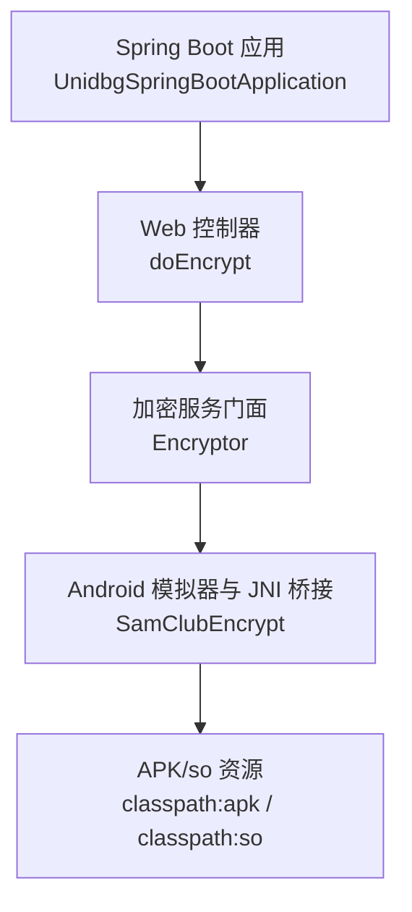
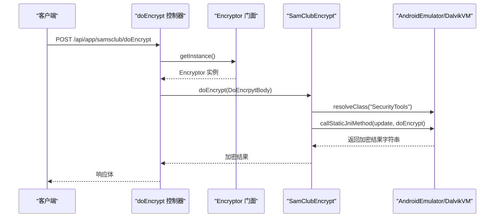
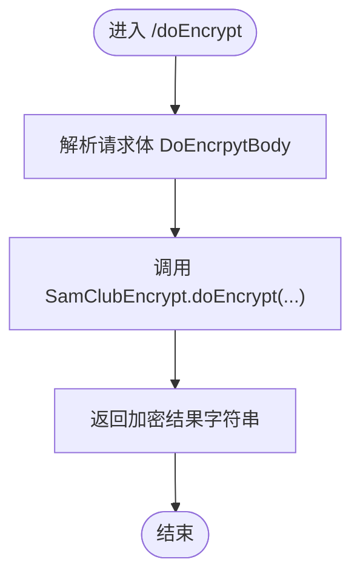
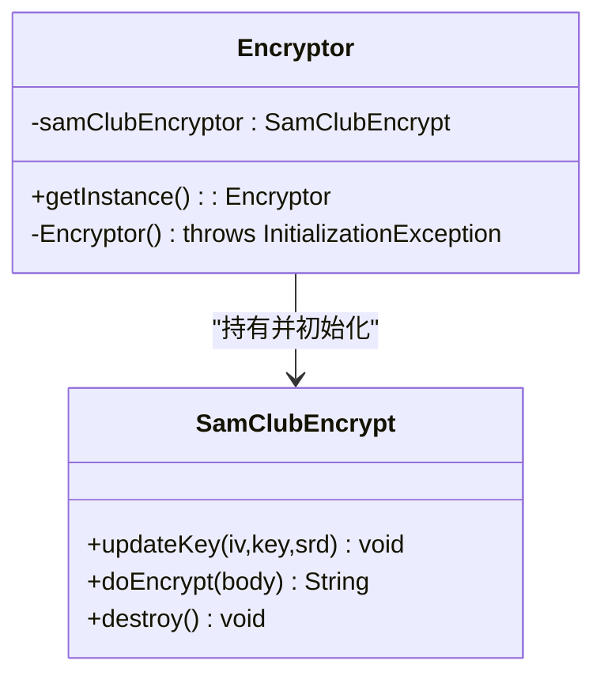
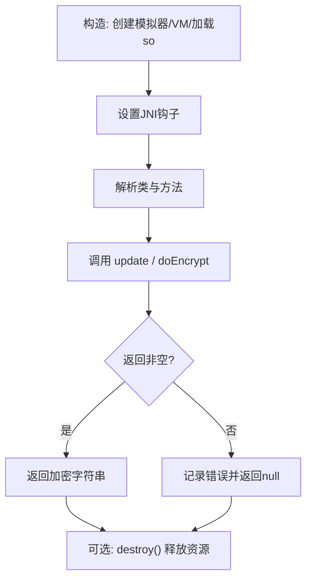
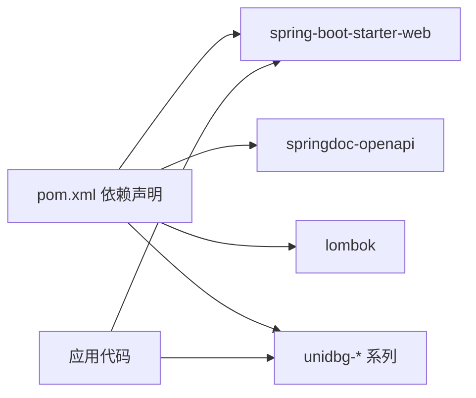

# Spring Boot 应用性能优化

<cite>
**本文引用的文件**
- [pom.xml](file://unidbgSpringBoot/pom.xml)
- [application.properties](file://unidbgSpringBoot/src/main/resources/application.properties)
- [UnidbgSpringBootApplication.java](file://unidbgSpringBoot/src/main/java/guanzhujiaran/unidbgspringboot/UnidbgSpringBootApplication.java)
- [doEncrypt.java](file://unidbgSpringBoot/src/main/java/guanzhujiaran/unidbgspringboot/Controller/api/app/samsclub/doEncrypt.java)
- [SamClubEncrypt.java](file://unidbgSpringBoot/src/main/java/guanzhujiaran/unidbgspringboot/Service/app/samsclub/SamClubEncrypt.java)
- [Encryptor.java](file://unidbgSpringBoot/src/main/java/guanzhujiaran/unidbgspringboot/Service/app/comm/Encryptor.java)
- [DoEncrpytBody.java](file://unidbgSpringBoot/src/main/java/guanzhujiaran/unidbgspringboot/Model/api/app/samsclub/DoEncrpytBody.java)
- [DoEncryptKey.java](file://unidbgSpringBoot/src/main/java/guanzhujiaran/unidbgspringboot/Model/api/app/samsclub/DoEncryptKey.java)
</cite>

## 目录
1. [简介](#简介)
2. [项目结构](#项目结构)
3. [核心组件](#核心组件)
4. [架构总览](#架构总览)
5. [详细组件分析](#详细组件分析)
6. [依赖关系分析](#依赖关系分析)
7. [性能考虑](#性能考虑)
8. [故障排查指南](#故障排查指南)
9. [结论](#结论)
10. [附录](#附录)

## 简介
本指南面向基于 Spring Boot 的应用，聚焦 JVM 参数调优、启动优化、数据库访问优化、API 层优化与并发处理优化，并结合仓库中的 Spring Boot 子工程（unidbgSpringBoot）给出可落地的实践建议。该工程通过 unidbg 在 JVM 内模拟 Android 环境并调用原生加密库，属于 CPU/IO 密集型场景，对线程池、内存与 GC 策略尤为敏感。

## 项目结构
- 构建与依赖：使用 Spring Boot 3.x 与 Maven，引入 spring-boot-starter-web、springdoc-openapi、Lombok 以及 unidbg 系列依赖。
- 应用入口：标准 Spring Boot 主类，无额外自动装配开关。
- 配置：仅包含端口、应用名与 OpenAPI 路径等基础配置。
- 业务模块：提供山姆会员商店 App 的加密接口，封装了 APK/so 资源加载、JNI 钩子与加密流程。

图表来源
- [UnidbgSpringBootApplication.java:6-10](file://unidbgSpringBoot/src/main/java/guanzhujiaran/unidbgspringboot/UnidbgSpringBootApplication.java#L6-L10)
- [doEncrypt.java:10-20](file://unidbgSpringBoot/src/main/java/guanzhujiaran/unidbgspringboot/Controller/api/app/samsclub/doEncrypt.java#L10-L20)
- [Encryptor.java:12-52](file://unidbgSpringBoot/src/main/java/guanzhujiaran/unidbgspringboot/Service/app/comm/Encryptor.java#L12-L52)
- [SamClubEncrypt.java:32-82](file://unidbgSpringBoot/src/main/java/guanzhujiaran/unidbgspringboot/Service/app/samsclub/SamClubEncrypt.java#L32-L82)

章节来源
- [pom.xml:1-133](file://unidbgSpringBoot/pom.xml#L1-L133)
- [application.properties:1-4](file://unidbgSpringBoot/src/main/resources/application.properties#L1-L4)
- [UnidbgSpringBootApplication.java:1-13](file://unidbgSpringBoot/src/main/java/guanzhujiaran/unidbgspringboot/UnidbgSpringBootApplication.java#L1-L13)

## 核心组件
- Web 控制器：对外暴露加密与密钥更新接口，接收请求体并委托给加密服务。
- 加密服务门面：单例管理，懒加载初始化 APK/so 资源，统一暴露加密能力。
- Android 模拟器与 JNI 桥接：创建 AndroidEmulator、DalvikVM，加载 so，设置 JNI 钩子，调用目标方法完成加密。
- 数据模型：入参 DTO 用于传递时间戳、请求体、UUID、Token 等字段；密钥更新 DTO 用于动态替换 IV/KEY/SRD。

章节来源
- [doEncrypt.java:10-34](file://unidbgSpringBoot/src/main/java/guanzhujiaran/unidbgspringboot/Controller/api/app/samsclub/doEncrypt.java#L10-L34)
- [Encryptor.java:12-62](file://unidbgSpringBoot/src/main/java/guanzhujiaran/unidbgspringboot/Service/app/comm/Encryptor.java#L12-L62)
- [SamClubEncrypt.java:12-158](file://unidbgSpringBoot/src/main/java/guanzhujiaran/unidbgspringboot/Service/app/samsclub/SamClubEncrypt.java#L12-L158)
- [DoEncrpytBody.java:1-13](file://unidbgSpringBoot/src/main/java/guanzhujiaran/unidbgspringboot/Model/api/app/samsclub/DoEncrpytBody.java#L1-L13)
- [DoEncryptKey.java:1-11](file://unidbgSpringBoot/src/main/java/guanzhujiaran/unidbgspringboot/Model/api/app/samsclub/DoEncryptKey.java#L1-L11)

## 架构总览
下图展示了从 HTTP 请求到 JNI 加密的完整调用链，突出关键对象与交互顺序。

图表来源
- [doEncrypt.java:16-21](file://unidbgSpringBoot/src/main/java/guanzhujiaran/unidbgspringboot/Controller/api/app/samsclub/doEncrypt.java#L16-L21)
- [Encryptor.java:38-52](file://unidbgSpringBoot/src/main/java/guanzhujiaran/unidbgspringboot/Service/app/comm/Encryptor.java#L38-L52)
- [SamClubEncrypt.java:84-110](file://unidbgSpringBoot/src/main/java/guanzhujiaran/unidbgspringboot/Service/app/samsclub/SamClubEncrypt.java#L84-L110)

## 详细组件分析

### 控制器 doEncrypt
- 职责：接收加密请求与密钥更新请求，委托至加密服务。
- 关键点：
  - 使用静态工厂获取加密器实例，避免重复初始化。
  - 请求体为 JSON，字段包括时间戳、请求体、UUID、Token。
  - 密钥更新接口支持运行时替换 IV/KEY/SRD，便于动态适配。

图表来源
- [doEncrypt.java:16-21](file://unidbgSpringBoot/src/main/java/guanzhujiaran/unidbgspringboot/Controller/api/app/samsclub/doEncrypt.java#L16-L21)
- [DoEncrpytBody.java:5-11](file://unidbgSpringBoot/src/main/java/guanzhujiaran/unidbgspringboot/Model/api/app/samsclub/DoEncrpytBody.java#L5-L11)

章节来源
- [doEncrypt.java:10-34](file://unidbgSpringBoot/src/main/java/guanzhujiaran/unidbgspringboot/Controller/api/app/samsclub/doEncrypt.java#L10-L34)

### 加密服务门面 Encryptor
- 职责：单例管理加密器，懒加载初始化 APK/so 资源，统一对外暴露加密能力。
- 关键点：
  - 使用静态内部类实现线程安全的懒加载单例。
  - 资源路径来自 classpath，缺失时抛出自定义异常并记录日志。
  - 将 SamClubEncrypt 作为唯一能力出口，便于后续扩展其他加密器。

图表来源
- [Encryptor.java:12-62](file://unidbgSpringBoot/src/main/java/guanzhujiaran/unidbgspringboot/Service/app/comm/Encryptor.java#L12-L62)
- [SamClubEncrypt.java:20-30](file://unidbgSpringBoot/src/main/java/guanzhujiaran/unidbgspringboot/Service/app/samsclub/SamClubEncrypt.java#L20-L30)

章节来源
- [Encryptor.java:12-62](file://unidbgSpringBoot/src/main/java/guanzhujiaran/unidbgspringboot/Service/app/comm/Encryptor.java#L12-L62)

### Android 模拟器与 JNI 桥接 SamClubEncrypt
- 职责：创建 AndroidEmulator、DalvikVM，加载 so，设置 JNI 钩子，执行加密。
- 关键点：
  - 构造阶段：创建 32 位模拟器、设置 LibraryResolver、加载 APK/so、显式调用 JNI_OnLoad。
  - 运行阶段：解析目标类与方法，传入参数并获取返回值。
  - 钩子阶段：拦截静态字段与方法调用，注入所需值（如包名、证书信息等）。
  - 资源释放：提供 destroy 方法关闭模拟器，防止资源泄漏。

图表来源
- [SamClubEncrypt.java:32-82](file://unidbgSpringBoot/src/main/java/guanzhujiaran/unidbgspringboot/Service/app/samsclub/SamClubEncrypt.java#L32-L82)
- [SamClubEncrypt.java:84-110](file://unidbgSpringBoot/src/main/java/guanzhujiaran/unidbgspringboot/Service/app/samsclub/SamClubEncrypt.java#L84-L110)
- [SamClubEncrypt.java:112-158](file://unidbgSpringBoot/src/main/java/guanzhujiaran/unidbgspringboot/Service/app/samsclub/SamClubEncrypt.java#L112-L158)

章节来源
- [SamClubEncrypt.java:12-158](file://unidbgSpringBoot/src/main/java/guanzhujiaran/unidbgspringboot/Service/app/samsclub/SamClubEncrypt.java#L12-L158)

### 数据模型
- DoEncrpytBody：承载加密所需的 timestampStr、bodyStr、uuidStr、tokenStr。
- DoEncryptKey：承载运行时更新的 siv、ssk、srd 密钥材料。

章节来源
- [DoEncrpytBody.java:1-13](file://unidbgSpringBoot/src/main/java/guanzhujiaran/unidbgspringboot/Model/api/app/samsclub/DoEncrpytBody.java#L1-L13)
- [DoEncryptKey.java:1-11](file://unidbgSpringBoot/src/main/java/guanzhujiaran/unidbgspringboot/Model/api/app/samsclub/DoEncryptKey.java#L1-L11)

## 依赖关系分析
- 构建依赖：Spring Boot Web Starter、OpenAPI、Lombok、unidbg-api/android/dynarmic/unicorn2。
- 运行时依赖：APK/so 资源位于 classpath，需在部署产物中确保存在。
- 组件耦合：
  - 控制器强依赖 Encryptor 门面。
  - 门面强依赖 SamClubEncrypt。
  - SamClubEncrypt 强依赖 unidbg 提供的 Android 模拟与 JNI 能力。

图表来源
- [pom.xml:21-67](file://unidbgSpringBoot/pom.xml#L21-L67)

章节来源
- [pom.xml:1-133](file://unidbgSpringBoot/pom.xml#L1-L133)

## 性能考虑
以下建议结合当前工程的 CPU/IO 密集特征（Android 模拟器与 JNI 调用）给出，可直接落地到生产部署与运维。

- JVM 参数调优
  - 堆内存：根据容器/主机规格设置初始与最大堆大小，避免频繁 Full GC；启用 G1GC 或 ZGC（JDK 21 可用），开启堆转储以便问题定位。
  - 元空间与直接内存：合理设置 Metaspace，关注 direct memory 使用（NIO/网络栈/本地库可能占用）。
  - 线程与栈：适当调整线程栈大小，避免过深递归或大量短生命周期线程导致上下文切换开销。
  - 监控：启用 JFR/JMX 指标采集，结合 Prometheus/Grafana 观察 GC 停顿、CPU 使用率、线程状态。

- 启动优化
  - 懒加载：当前 Encryptor 采用静态内部类懒加载，避免启动时加载 APK/so，缩短冷启动时间。
  - 条件装配：可按环境启用/禁用 OpenAPI 或调试端点，减少不必要的 Bean 初始化。
  - 预热：在流量高峰前进行“预热”调用，触发必要的类加载与 JIT 编译，降低首请求延迟。

- 数据库访问优化（通用建议）
  - 连接池：合理设置最小/最大连接数、空闲超时、连接泄漏检测；避免连接风暴。
  - 查询优化：使用索引、分页、只取必要字段；避免 N+1 查询；对热点数据引入缓存。
  - 事务边界：缩小事务范围，避免长事务阻塞连接与锁。

- API 层优化
  - 控制器方法：避免在主线程做重计算；对耗时操作异步化；限制请求体大小。
  - DTO 映射：尽量复用对象，减少不必要的拷贝与转换；必要时使用零拷贝方案。
  - 响应压缩：启用 gzip/br 压缩，减少带宽占用；对大响应体考虑分块传输。

- 并发处理优化
  - @Async 与线程池：为 CPU 密集任务配置专用线程池，隔离 IO 与 CPU 任务；设置合理的 core/max queue size。
  - 锁优化：优先使用无锁数据结构或细粒度锁；避免长时间持锁；对热点竞争点进行分段或分片。
  - 背压与限流：在高并发下对上游进行限流与降级，保护后端资源。

- 针对本工程的专项建议
  - 模拟器与 JNI 调用属于高成本操作，应：
    - 复用 SamClubEncrypt 实例（当前已单例化），避免重复创建 VM。
    - 控制并发度，避免同时发起过多 JNI 调用导致系统负载过高。
    - 对 doEncrypt 调用进行排队与限流，必要时引入队列与重试机制。
    - 定期评估是否需要对 APK/so 进行预加载与 JIT 预热。
  - 资源释放：确保异常路径也能调用 destroy，避免模拟器资源泄漏。

[本节为通用指导，不直接分析具体文件]

## 故障排查指南
- 资源未找到
  - 现象：初始化失败，提示缺少 APK/so 文件。
  - 排查：确认 classpath 下资源路径正确且可读取；检查打包产物是否包含 apk/so。
  - 参考位置：初始化逻辑与异常捕获。

- 类解析失败
  - 现象：无法解析目标类（如 SecurityTools），导致加密失败。
  - 排查：确认 so 已正确加载且 JNI_OnLoad 成功；检查类名与签名是否正确。

- 返回值为空
  - 现象：加密结果为 null。
  - 排查：检查输入参数、JNI 钩子返回值；查看日志输出定位异常分支。

- 资源泄漏
  - 现象：进程内存持续增长或句柄耗尽。
  - 排查：确保异常路径也调用 destroy；监控 native 内存与线程数。

章节来源
- [Encryptor.java:20-33](file://unidbgSpringBoot/src/main/java/guanzhujiaran/unidbgspringboot/Service/app/comm/Encryptor.java#L20-L33)
- [SamClubEncrypt.java:32-82](file://unidbgSpringBoot/src/main/java/guanzhujiaran/unidbgspringboot/Service/app/samsclub/SamClubEncrypt.java#L32-L82)
- [SamClubEncrypt.java:84-110](file://unidbgSpringBoot/src/main/java/guanzhujiaran/unidbgspringboot/Service/app/samsclub/SamClubEncrypt.java#L84-L110)
- [SamClubEncrypt.java:147-158](file://unidbgSpringBoot/src/main/java/guanzhujiaran/unidbgspringboot/Service/app/samsclub/SamClubEncrypt.java#L147-L158)

## 结论
本指南围绕 JVM 调优、启动优化、数据库访问、API 层与并发处理给出了系统化建议，并结合仓库中的 Spring Boot 子工程提供了针对性实践。对于以 unidbg 为核心的 JNI 加密场景，重点在于复用模拟器实例、控制并发、合理配置线程池与 JVM，以及完善的资源管理与监控。按上述措施实施后，可有效降低启动时延、提升吞吐与稳定性。

[本节为总结性内容，不直接分析具体文件]

## 附录
- 应用基础配置
  - 端口与应用名、OpenAPI 路径已在配置文件中定义，可按需扩展。
- 构建与镜像
  - 使用 Spring Boot Maven 插件生成镜像，便于容器化部署。

章节来源
- [application.properties:1-4](file://unidbgSpringBoot/src/main/resources/application.properties#L1-L4)
- [pom.xml:69-80](file://unidbgSpringBoot/pom.xml#L69-L80)