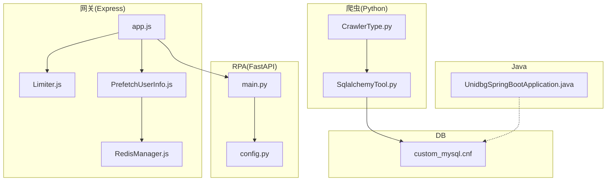
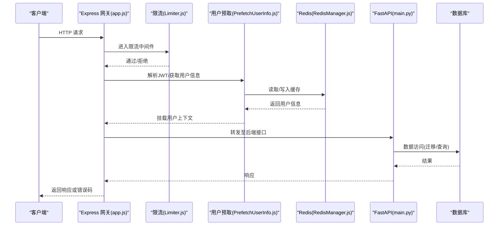
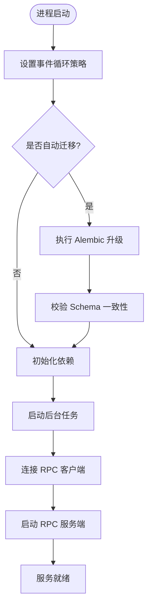
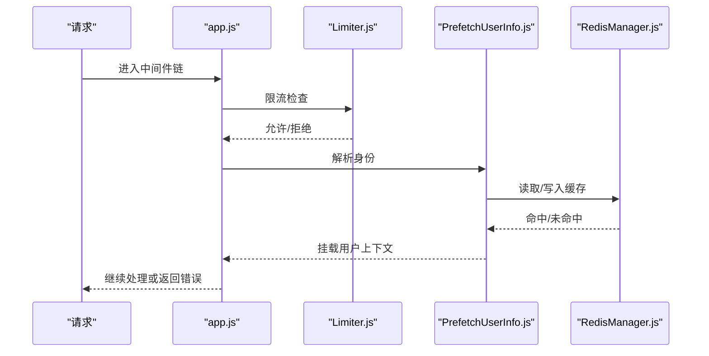
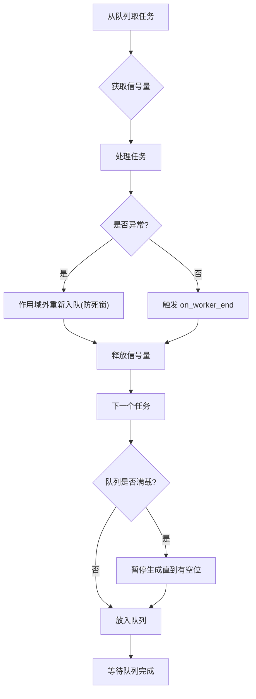
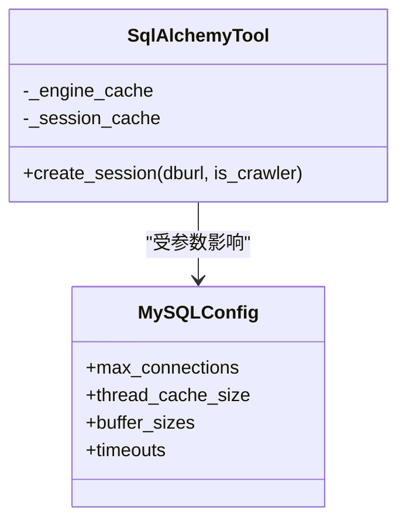
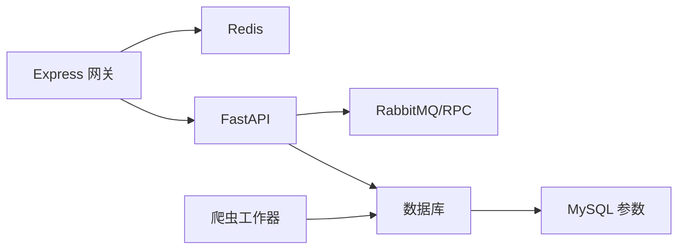

# 应用性能优化

<cite>
**本文引用的文件**
- [RPA-Browser/main.py](file://RPA-Browser/main.py)
- [RPA-Browser/app/config.py](file://RPA-Browser/app/config.py)
- [be-gateway/ExpressServerEnd/app.js](file://be-gateway/ExpressServerEnd/app.js)
- [be-gateway/ExpressServerEnd/MiddleWare/Limiter.js](file://be-gateway/ExpressServerEnd/MiddleWare/Limiter.js)
- [be-gateway/ExpressServerEnd/DAO/Redis/RedisManager.js](file://be-gateway/ExpressServerEnd/DAO/Redis/RedisManager.js)
- [be-gateway/ExpressServerEnd/MiddleWare/PrefetchUserInfo.js](file://be-gateway/ExpressServerEnd/MiddleWare/PrefetchUserInfo.js)
- [be-bilibili-crawler/Service/BaseCrawler/CrawlerType.py](file://be-bilibili-crawler/Service/BaseCrawler/CrawlerType.py)
- [be-bilibili-crawler/Utils/数据库/SqlalchemyTool.py](file://be-bilibili-crawler/Utils/数据库/SqlalchemyTool.py)
- [unidbgSpringBoot/src/main/java/guanzhujiaran/unidbgspringboot/UnidbgSpringBootApplication.java](file://unidbgSpringBoot/src/main/java/guanzhujiaran/unidbgspringboot/UnidbgSpringBootApplication.java)
- [docker_vol/mysql_data/conf.d/custom_mysql.cnf](file://docker_vol/mysql_data/conf.d/custom_mysql.cnf)
</cite>

## 目录
1. [简介](#简介)
2. [项目结构](#项目结构)
3. [核心组件](#核心组件)
4. [架构总览](#架构总览)
5. [详细组件分析](#详细组件分析)
6. [依赖关系分析](#依赖关系分析)
7. [性能考量](#性能考量)
8. [故障排查指南](#故障排查指南)
9. [结论](#结论)
10. [附录](#附录)

## 简介
本指南面向应用层性能优化，覆盖 Python FastAPI、Node.js Express 与 Java Spring Boot 三类服务。重点围绕异步处理优化、内存管理策略、CPU 资源分配与线程池配置、请求处理流水线优化、中间件性能调优、错误处理机制优化、性能监控集成、日志优化策略与调试工具使用展开，并结合仓库中的实际实现给出可落地的建议与图示。

## 项目结构
仓库包含多个子系统：
- RPA-Browser：基于 FastAPI 的浏览器自动化 API，提供生命周期管理、后台任务、RPC 客户端与服务端启动等。
- be-gateway：基于 Express 的网关服务，包含安全中间件、限流、用户信息预取、统一错误处理等。
- be-bilibili-crawler：爬虫相关服务，包含异步工作器、背压控制、数据库连接池等。
- unidbgSpringBoot：Spring Boot 应用入口（示例）。
- docker_vol/mysql_data：MySQL 运行时参数优化配置。

**图表来源**
- [be-gateway/ExpressServerEnd/app.js:33-117](file://be-gateway/ExpressServerEnd/app.js#L33-L117)
- [be-gateway/ExpressServerEnd/MiddleWare/Limiter.js:20-50](file://be-gateway/ExpressServerEnd/MiddleWare/Limiter.js#L20-L50)
- [be-gateway/ExpressServerEnd/MiddleWare/PrefetchUserInfo.js:75-189](file://be-gateway/ExpressServerEnd/MiddleWare/PrefetchUserInfo.js#L75-L189)
- [be-gateway/ExpressServerEnd/DAO/Redis/RedisManager.js:3-17](file://be-gateway/ExpressServerEnd/DAO/Redis/RedisManager.js#L3-L17)
- [RPA-Browser/main.py:36-74](file://RPA-Browser/main.py#L36-L74)
- [RPA-Browser/app/config.py:140-215](file://RPA-Browser/app/config.py#L140-L215)
- [be-bilibili-crawler/Service/BaseCrawler/CrawlerType.py:344-531](file://be-bilibili-crawler/Service/BaseCrawler/CrawlerType.py#L344-L531)
- [be-bilibili-crawler/Utils/数据库/SqlalchemyTool.py:25-47](file://be-bilibili-crawler/Utils/数据库/SqlalchemyTool.py#L25-L47)
- [unidbgSpringBoot/src/main/java/guanzhujiaran/unidbgspringboot/UnidbgSpringBootApplication.java:6-10](file://unidbgSpringBoot/src/main/java/guanzhujiaran/unidbgspringboot/UnidbgSpringBootApplication.java#L6-L10)
- [docker_vol/mysql_data/conf.d/custom_mysql.cnf:1-42](file://docker_vol/mysql_data/conf.d/custom_mysql.cnf#L1-L42)

**章节来源**
- [RPA-Browser/main.py:36-74](file://RPA-Browser/main.py#L36-L74)
- [be-gateway/ExpressServerEnd/app.js:33-117](file://be-gateway/ExpressServerEnd/app.js#L33-L117)
- [be-bilibili-crawler/Service/BaseCrawler/CrawlerType.py:344-531](file://be-bilibili-crawler/Service/BaseCrawler/CrawlerType.py#L344-L531)
- [be-bilibili-crawler/Utils/数据库/SqlalchemyTool.py:25-47](file://be-bilibili-crawler/Utils/数据库/SqlalchemyTool.py#L25-L47)
- [unidbgSpringBoot/src/main/java/guanzhujiaran/unidbgspringboot/UnidbgSpringBootApplication.java:6-10](file://unidbgSpringBoot/src/main/java/guanzhujiaran/unidbgspringboot/UnidbgSpringBootApplication.java#L6-L10)
- [docker_vol/mysql_data/conf.d/custom_mysql.cnf:1-42](file://docker_vol/mysql_data/conf.d/custom_mysql.cnf#L1-L42)

## 核心组件
- FastAPI 应用生命周期与启动流程：在 lifespan 中执行数据库迁移、初始化依赖、启动后台任务与 RPC 服务，确保启动阶段完成必要资源准备并优雅关闭。
- Express 网关中间件链：超时、安全头、跨域、鉴权、路由注册与统一错误处理；结合 Redis 实现分布式限流与用户信息预取缓存。
- 爬虫异步工作器：固定并发池、信号量控制、智能背压与重试入队，避免死锁与资源竞争。
- 数据库连接池：按引擎与会话工厂缓存，减少重复创建开销；配合 MySQL 参数调优降低 OOM 风险。
- Spring Boot 应用入口：标准启动方式，便于后续接入线程池、连接池与监控指标。

**章节来源**
- [RPA-Browser/main.py:36-74](file://RPA-Browser/main.py#L36-L74)
- [be-gateway/ExpressServerEnd/app.js:82-117](file://be-gateway/ExpressServerEnd/app.js#L82-L117)
- [be-gateway/ExpressServerEnd/MiddleWare/Limiter.js:20-50](file://be-gateway/ExpressServerEnd/MiddleWare/Limiter.js#L20-L50)
- [be-gateway/ExpressServerEnd/MiddleWare/PrefetchUserInfo.js:75-189](file://be-gateway/ExpressServerEnd/MiddleWare/PrefetchUserInfo.js#L75-L189)
- [be-bilibili-crawler/Service/BaseCrawler/CrawlerType.py:344-531](file://be-bilibili-crawler/Service/BaseCrawler/CrawlerType.py#L344-L531)
- [be-bilibili-crawler/Utils/数据库/SqlalchemyTool.py:25-47](file://be-bilibili-crawler/Utils/数据库/SqlalchemyTool.py#L25-L47)
- [unidbgSpringBoot/src/main/java/guanzhujiaran/unidbgspringboot/UnidbgSpringBootApplication.java:6-10](file://unidbgSpringBoot/src/main/java/guanzhujiaran/unidbgspringboot/UnidbgSpringBootApplication.java#L6-L10)

## 架构总览
下图展示从网关到后端服务的典型请求路径，以及关键的性能控制点（限流、鉴权、缓存、超时、错误映射）：

**图表来源**
- [be-gateway/ExpressServerEnd/app.js:82-117](file://be-gateway/ExpressServerEnd/app.js#L82-L117)
- [be-gateway/ExpressServerEnd/MiddleWare/Limiter.js:20-50](file://be-gateway/ExpressServerEnd/MiddleWare/Limiter.js#L20-L50)
- [be-gateway/ExpressServerEnd/MiddleWare/PrefetchUserInfo.js:75-189](file://be-gateway/ExpressServerEnd/MiddleWare/PrefetchUserInfo.js#L75-L189)
- [be-gateway/ExpressServerEnd/DAO/Redis/RedisManager.js:3-17](file://be-gateway/ExpressServerEnd/DAO/Redis/RedisManager.js#L3-L17)
- [RPA-Browser/main.py:36-74](file://RPA-Browser/main.py#L36-L74)

## 详细组件分析

### FastAPI 应用层优化（RPA-Browser）
- 异步事件循环与平台适配：在 Windows 上设置合适的 SelectorEventLoop 策略，避免事件循环兼容性问题导致的调度开销。
- 启动阶段串行化：先执行数据库迁移与 Schema 检查，再初始化依赖、启动后台任务与 RPC 服务，保证服务就绪状态一致。
- 配置项集中管理：通过 Settings 集中管理 RabbitMQ、浏览器会话清理、WebRTC 超时、Alembic 迁移等关键参数，便于按环境调优。

**图表来源**
- [RPA-Browser/main.py:17-63](file://RPA-Browser/main.py#L17-L63)
- [RPA-Browser/app/config.py:140-215](file://RPA-Browser/app/config.py#L140-L215)

**章节来源**
- [RPA-Browser/main.py:17-63](file://RPA-Browser/main.py#L17-L63)
- [RPA-Browser/app/config.py:140-215](file://RPA-Browser/app/config.py#L140-L215)

### Express 网关中间件与错误处理优化（be-gateway）
- 中间件顺序与职责分离：超时、安全头、跨域、解析、鉴权、路由注册，最后统一错误处理。
- 分布式限流：基于 Redis 的 rate-limit 存储，支持自定义 key 生成、窗口与阈值，避免单点瓶颈。
- 用户信息预取：优先调用 be-message /identify，失败降级为本地 JWT 解析，并以短 TTL 缓存，提升鉴权链路性能与可用性。
- 错误映射：将超时与上游网络错误映射为明确的 HTTP 状态码（504/502），业务校验错误保持 200 并通过 body.code 区分。

**图表来源**
- [be-gateway/ExpressServerEnd/app.js:82-185](file://be-gateway/ExpressServerEnd/app.js#L82-L185)
- [be-gateway/ExpressServerEnd/MiddleWare/Limiter.js:20-50](file://be-gateway/ExpressServerEnd/MiddleWare/Limiter.js#L20-L50)
- [be-gateway/ExpressServerEnd/MiddleWare/PrefetchUserInfo.js:75-189](file://be-gateway/ExpressServerEnd/MiddleWare/PrefetchUserInfo.js#L75-L189)
- [be-gateway/ExpressServerEnd/DAO/Redis/RedisManager.js:3-17](file://be-gateway/ExpressServerEnd/DAO/Redis/RedisManager.js#L3-L17)

**章节来源**
- [be-gateway/ExpressServerEnd/app.js:82-185](file://be-gateway/ExpressServerEnd/app.js#L82-L185)
- [be-gateway/ExpressServerEnd/MiddleWare/Limiter.js:20-50](file://be-gateway/ExpressServerEnd/MiddleWare/Limiter.js#L20-L50)
- [be-gateway/ExpressServerEnd/MiddleWare/PrefetchUserInfo.js:75-189](file://be-gateway/ExpressServerEnd/MiddleWare/PrefetchUserInfo.js#L75-L189)
- [be-gateway/ExpressServerEnd/DAO/Redis/RedisManager.js:3-17](file://be-gateway/ExpressServerEnd/DAO/Redis/RedisManager.js#L3-L17)

### 爬虫异步工作器与背压控制（be-bilibili-crawler）
- 固定并发池：worker 协程持续从队列取任务，使用信号量控制最大并发，避免资源争用。
- 智能背压：当队列大小达到并发上限时暂停生成新任务，防止内存膨胀与下游过载。
- 重试入队位置：在信号量作用域外重新入队，避免 max_sem=1 时的死锁。
- 结束流程：并行触发插件结束回调，等待队列全部处理完毕，输出统计与清理。

**图表来源**
- [be-bilibili-crawler/Service/BaseCrawler/CrawlerType.py:344-531](file://be-bilibili-crawler/Service/BaseCrawler/CrawlerType.py#L344-L531)

**章节来源**
- [be-bilibili-crawler/Service/BaseCrawler/CrawlerType.py:344-531](file://be-bilibili-crawler/Service/BaseCrawler/CrawlerType.py#L344-L531)

### 数据库连接池与 MySQL 参数优化
- SQLAlchemy 连接池与会话工厂缓存：避免重复创建引擎与会话，减少启动与冷启动开销。
- MySQL 参数调优：限制每连接缓冲区尺寸，防止 OOM；合理设置连接数、超时与包大小，平衡吞吐与稳定性。

**图表来源**
- [be-bilibili-crawler/Utils/数据库/SqlalchemyTool.py:25-47](file://be-bilibili-crawler/Utils/数据库/SqlalchemyTool.py#L25-L47)
- [docker_vol/mysql_data/conf.d/custom_mysql.cnf:1-42](file://docker_vol/mysql_data/conf.d/custom_mysql.cnf#L1-L42)

**章节来源**
- [be-bilibili-crawler/Utils/数据库/SqlalchemyTool.py:25-47](file://be-bilibili-crawler/Utils/数据库/SqlalchemyTool.py#L25-L47)
- [docker_vol/mysql_data/conf.d/custom_mysql.cnf:1-42](file://docker_vol/mysql_data/conf.d/custom_mysql.cnf#L1-L42)

### Spring Boot 应用入口与扩展点
- 标准启动：通过 SpringApplication 启动应用，便于后续接入线程池、连接池、监控与日志框架。
- 扩展建议：在启动后注册健康检查、指标收集（如 Micrometer）、线程池与连接池配置，结合容器资源限制进行容量规划。

**章节来源**
- [unidbgSpringBoot/src/main/java/guanzhujiaran/unidbgspringboot/UnidbgSpringBootApplication.java:6-10](file://unidbgSpringBoot/src/main/java/guanzhujiaran/unidbgspringboot/UnidbgSpringBootApplication.java#L6-L10)

## 依赖关系分析
- 网关对 Redis 的强依赖：限流与用户信息缓存均通过 Redis 实现，需关注连接池与网络延迟。
- FastAPI 对 RabbitMQ/RPC 的依赖：后台任务与 RPC 服务需在启动阶段建立连接，失败时应快速失败并记录日志。
- 爬虫对数据库连接池的依赖：引擎与会话工厂缓存可降低连接创建成本，但需结合 MySQL 参数避免内存压力。

**图表来源**
- [be-gateway/ExpressServerEnd/DAO/Redis/RedisManager.js:3-17](file://be-gateway/ExpressServerEnd/DAO/Redis/RedisManager.js#L3-L17)
- [RPA-Browser/main.py:48-63](file://RPA-Browser/main.py#L48-L63)
- [be-bilibili-crawler/Utils/数据库/SqlalchemyTool.py:25-47](file://be-bilibili-crawler/Utils/数据库/SqlalchemyTool.py#L25-L47)
- [docker_vol/mysql_data/conf.d/custom_mysql.cnf:1-42](file://docker_vol/mysql_data/conf.d/custom_mysql.cnf#L1-L42)

**章节来源**
- [be-gateway/ExpressServerEnd/DAO/Redis/RedisManager.js:3-17](file://be-gateway/ExpressServerEnd/DAO/Redis/RedisManager.js#L3-L17)
- [RPA-Browser/main.py:48-63](file://RPA-Browser/main.py#L48-L63)
- [be-bilibili-crawler/Utils/数据库/SqlalchemyTool.py:25-47](file://be-bilibili-crawler/Utils/数据库/SqlalchemyTool.py#L25-L47)
- [docker_vol/mysql_data/conf.d/custom_mysql.cnf:1-42](file://docker_vol/mysql_data/conf.d/custom_mysql.cnf#L1-L42)

## 性能考量
- 异步处理优化
  - FastAPI：利用 lifespan 串行化启动流程，避免竞态；Windows 下设置合适的事件循环策略。
  - Express：中间件链尽量轻量，避免阻塞操作；鉴权与缓存前置，减少后续处理开销。
  - 爬虫：固定并发池+信号量，背压控制与重试入队位置正确，避免死锁与内存暴涨。
- 内存管理策略
  - MySQL：严格控制 per-connection 缓冲区尺寸，避免 OOM；合理设置连接数与超时。
  - Express：用户信息缓存采用短 TTL，降低内存占用与数据陈旧问题。
  - FastAPI：集中配置浏览器会话清理与 WebRTC 空闲超时，及时释放资源。
- CPU 资源分配与线程池配置
  - 根据容器 CPU 配额调整连接池大小与并发度；数据库连接数不宜超过 CPU 核数的若干倍。
  - 网关限流阈值与窗口需结合 QPS 与下游处理能力设定，避免过度限流或放行过多请求。
- 请求处理流水线优化
  - 中间件顺序：超时→安全→跨域→解析→鉴权→路由→错误处理。
  - 错误映射：将超时与上游错误映射为明确状态码，便于前端与监控识别。
- 中间件性能调优
  - 限流：使用 Redis 作为共享存储，key 粒度按 IP 或业务维度划分。
  - 用户预取：优先远程服务，失败降级本地解析，缓存短 TTL 提升命中率。
- 错误处理机制优化
  - 统一错误处理中间件：区分业务错误与系统错误，保持 HTTP 语义清晰。
  - 上游错误集合：维护常见网络错误码，精准映射状态码。
- 性能监控集成
  - 建议在网关与后端接入指标采集（如请求耗时、错误率、限流拒绝率），结合日志与告警形成闭环。
- 日志优化策略
  - 仅记录必要字段，控制 payload 长度与保留天数；在开发环境开启详细日志，生产环境收敛。
- 调试工具使用
  - 使用浏览器开发者工具与网关日志定位首跳问题；结合数据库慢查询与连接池监控定位后端瓶颈。

[本节为通用指导，不直接分析具体文件]

## 故障排查指南
- 常见问题定位
  - 网关超时：检查 connect-timeout 与上游响应时间，确认限流阈值与队列积压情况。
  - 上游不可达：核对 DNS、主机可达性与协议错误集合，确认状态码映射是否正确。
  - 用户信息缓存失效：检查 Redis 连接与 TTL，必要时延长缓存或增加降级逻辑。
  - 数据库 OOM：核查 per-connection 缓冲区参数与连接数，避免高并发下的内存峰值。
  - 爬虫死锁：确认重试入队在信号量作用域外，避免 max_sem=1 时的阻塞。
- 诊断步骤
  - 观察中间件日志与错误映射，确认请求路径与错误类型。
  - 检查 Redis 命中率与连接池状态，评估缓存有效性。
  - 查看数据库慢查询与连接池指标，定位热点 SQL 与连接泄漏。
  - 对于 FastAPI，检查 lifespan 启动日志与 RPC 连接状态。

**章节来源**
- [be-gateway/ExpressServerEnd/app.js:119-185](file://be-gateway/ExpressServerEnd/app.js#L119-L185)
- [be-gateway/ExpressServerEnd/MiddleWare/PrefetchUserInfo.js:101-189](file://be-gateway/ExpressServerEnd/MiddleWare/PrefetchUserInfo.js#L101-L189)
- [docker_vol/mysql_data/conf.d/custom_mysql.cnf:12-42](file://docker_vol/mysql_data/conf.d/custom_mysql.cnf#L12-L42)
- [be-bilibili-crawler/Service/BaseCrawler/CrawlerType.py:360-368](file://be-bilibili-crawler/Service/BaseCrawler/CrawlerType.py#L360-L368)

## 结论
通过对 FastAPI 生命周期、Express 中间件链与错误处理、爬虫异步工作器与背压、数据库连接池与 MySQL 参数的系统性优化，可在多语言应用中显著提升吞吐、降低延迟与内存占用。建议在生产环境中结合监控与日志形成闭环，持续迭代参数与代码，确保在高负载下的稳定性与可观测性。

[本节为总结，不直接分析具体文件]

## 附录
- 建议的监控指标
  - 网关：QPS、P95/P99 延迟、错误率、限流拒绝率、上游超时率。
  - 后端：请求处理耗时、数据库连接池使用率、缓存命中率、RPC 调用成功率。
  - 数据库：慢查询数量、连接数、缓冲命中率、事务等待时间。
- 建议的日志策略
  - 结构化日志，包含请求 ID、用户标识、关键耗时与错误堆栈摘要。
  - 分级日志：开发环境详细，生产环境收敛；敏感信息脱敏。
- 建议的调试工具
  - 网关：curl/wrk 压测，浏览器 Network 面板，Nginx/网关访问日志。
  - 后端：APM 工具（如 APM、Prometheus+Grafana），数据库慢查询日志，连接池监控。
  - 爬虫：任务队列监控、信号量与队列长度、插件执行耗时。

[本节为补充说明，不直接分析具体文件]