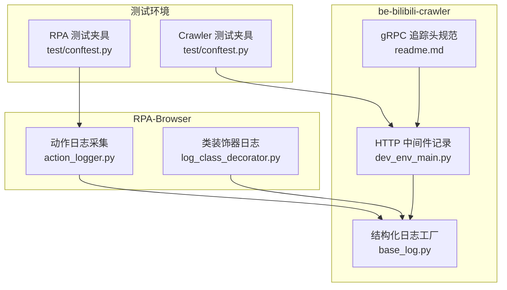
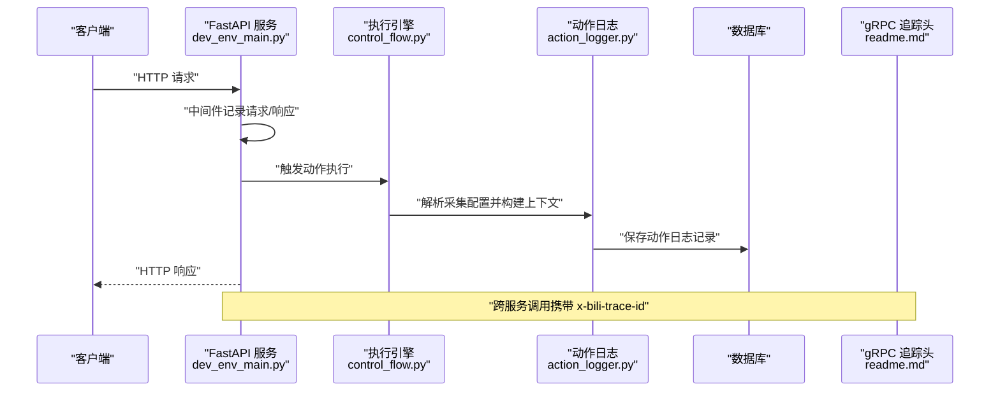
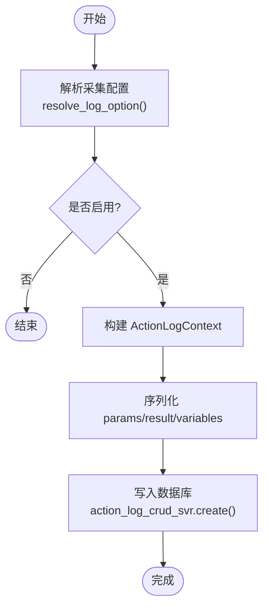
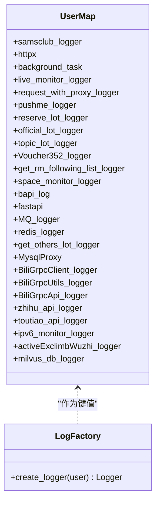
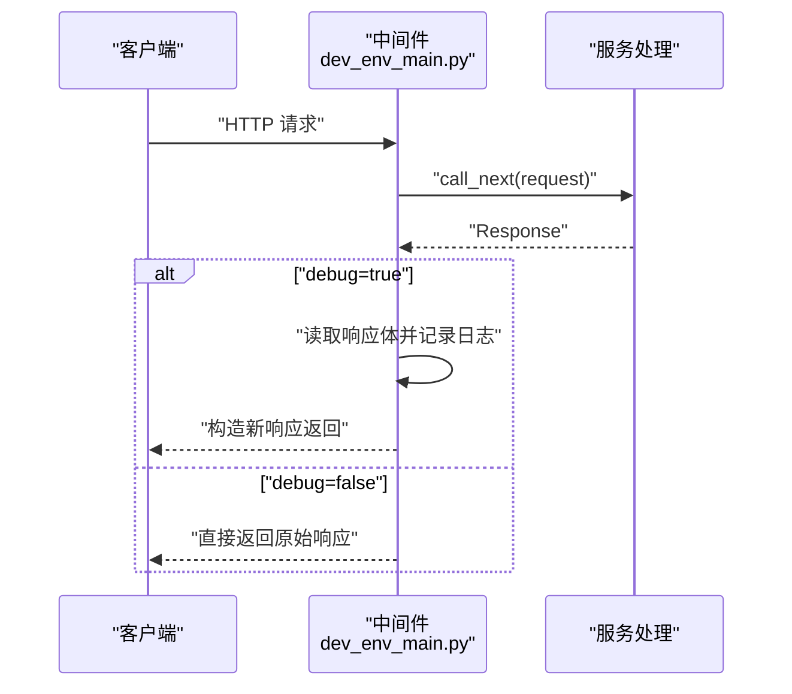
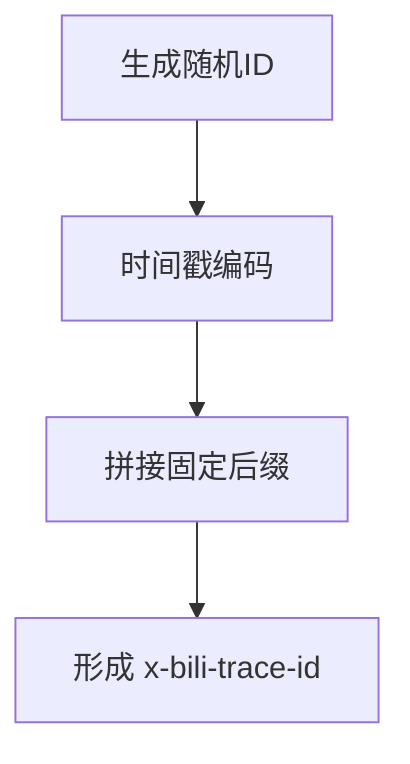
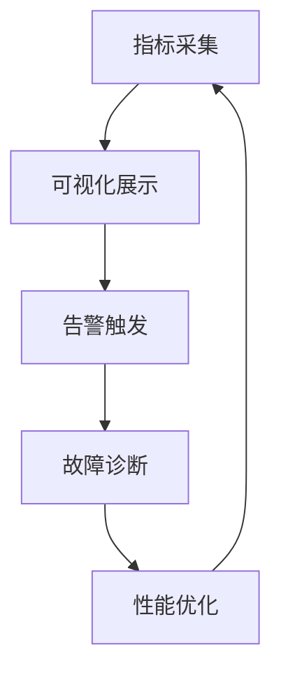
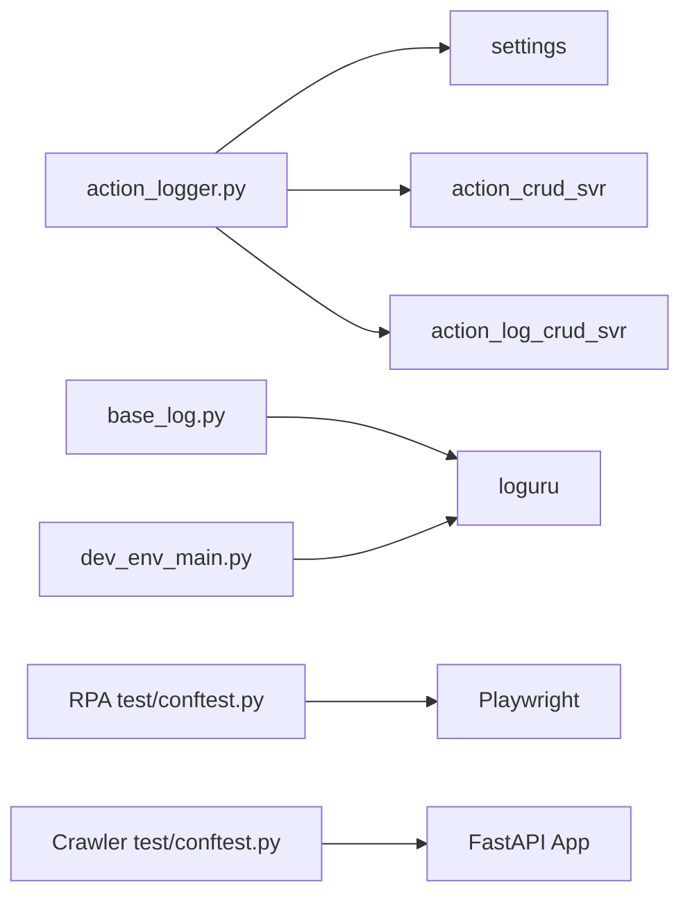

# 性能监控与诊断

<cite>
**本文引用的文件**
- [RPA-Browser/app/services/execution/action_logger.py](file://RPA-Browser/app/services/execution/action_logger.py)
- [RPA-Browser/app/utils/decorator/log_class_decorator.py](file://RPA-Browser/app/utils/decorator/log_class_decorator.py)
- [be-bilibili-crawler/log/base_log.py](file://be-bilibili-crawler/log/base_log.py)
- [be-bilibili-crawler/dev_env_main.py](file://be-bilibili-crawler/dev_env_main.py)
- [be-bilibili-crawler/Service/GrpcModule/Grpc/GrpcProto/readme.md](file://be-bilibili-crawler/Service/GrpcModule/Grpc/GrpcProto/readme.md)
- [RPA-Browser/test/conftest.py](file://RPA-Browser/test/conftest.py)
- [be-bilibili-crawler/test/conftest.py](file://be-bilibili-crawler/test/conftest.py)
</cite>

## 目录
1. [简介](#简介)
2. [项目结构](#项目结构)
3. [核心组件](#核心组件)
4. [架构总览](#架构总览)
5. [详细组件分析](#详细组件分析)
6. [依赖关系分析](#依赖关系分析)
7. [性能考量](#性能考量)
8. [故障诊断指南](#故障诊断指南)
9. [结论](#结论)
10. [附录](#附录)

## 简介
本指南面向本仓库中的多语言微服务（Python FastAPI、Node.js Express、Go 代理等），聚焦“应用性能监控与诊断”的落地实践。内容覆盖：
- 关键性能指标定义、采集与可视化建议
- 分布式追踪实现（链路追踪、请求跟踪、依赖关系分析）
- 日志优化策略（结构化日志、级别控制、聚合分析）
- 性能测试方法（负载、压力、基准）
- 故障诊断工具（CPU/内存/线程剖析）
- 常见问题排查（数据准确性、告警规则、回归检测）

## 项目结构
本项目包含多个子系统，各自具备独立的日志与可观测性能力：
- RPA-Browser：浏览器自动化执行引擎，提供细粒度动作级日志采集与持久化
- be-bilibili-crawler：爬虫后端，提供按模块划分的结构化日志、HTTP 中间件记录、gRPC 链路追踪头生成说明
- Vue3FrontEndDemoExercise：前端工程（本指南不直接分析其代码）
- be-gateway：网关服务（本指南不直接分析其代码）
- be-message-service：消息服务（本指南不直接分析其代码）
- bili-common：公共库（本指南不直接分析其代码）

图表来源
- [RPA-Browser/app/services/execution/action_logger.py:1-295](file://RPA-Browser/app/services/execution/action_logger.py#L1-L295)
- [RPA-Browser/app/utils/decorator/log_class_decorator.py:1-25](file://RPA-Browser/app/utils/decorator/log_class_decorator.py#L1-L25)
- [be-bilibili-crawler/log/base_log.py:1-96](file://be-bilibili-crawler/log/base_log.py#L1-L96)
- [be-bilibili-crawler/dev_env_main.py:63-89](file://be-bilibili-crawler/dev_env_main.py#L63-L89)
- [be-bilibili-crawler/Service/GrpcModule/Grpc/GrpcProto/readme.md:106-151](file://be-bilibili-crawler/Service/GrpcModule/Grpc/GrpcProto/readme.md#L106-L151)
- [RPA-Browser/test/conftest.py:1-75](file://RPA-Browser/test/conftest.py#L1-L75)
- [be-bilibili-crawler/test/conftest.py:1-117](file://be-bilibili-crawler/test/conftest.py#L1-L117)

章节来源
- [RPA-Browser/app/services/execution/action_logger.py:1-295](file://RPA-Browser/app/services/execution/action_logger.py#L1-L295)
- [RPA-Browser/app/utils/decorator/log_class_decorator.py:1-25](file://RPA-Browser/app/utils/decorator/log_class_decorator.py#L1-L25)
- [be-bilibili-crawler/log/base_log.py:1-96](file://be-bilibili-crawler/log/base_log.py#L1-L96)
- [be-bilibili-crawler/dev_env_main.py:63-89](file://be-bilibili-crawler/dev_env_main.py#L63-L89)
- [be-bilibili-crawler/Service/GrpcModule/Grpc/GrpcProto/readme.md:106-151](file://be-bilibili-crawler/Service/GrpcModule/Grpc/GrpcProto/readme.md#L106-L151)
- [RPA-Browser/test/conftest.py:1-75](file://RPA-Browser/test/conftest.py#L1-L75)
- [be-bilibili-crawler/test/conftest.py:1-117](file://be-bilibili-crawler/test/conftest.py#L1-L117)

## 核心组件
- 动作级日志采集（RPA-Browser）
  - 解析生效的采集配置（优先级：执行参数 > 父步骤透传 > 自定义操作DB配置 > 服务端兜底）
  - 将一次 action 执行的上下文与结果落库，失败时写入兜底错误记录
  - 支持参数、结果、变量、页面URL、执行耗时等字段序列化存储
- 结构化日志工厂（be-bilibili-crawler）
  - 基于 loguru 创建按业务域隔离的 Logger，统一轮转、压缩、保留策略
  - 通过 user 绑定与过滤实现分模块日志输出
- HTTP 中间件记录（be-bilibili-crawler）
  - 在调试模式下记录请求IP、方法、路径、状态码与响应体
- gRPC 链路追踪头（be-bilibili-crawler）
  - 定义 x-bili-trace-id 的生成算法，便于跨服务链路追踪
- 类装饰器日志（RPA-Browser）
  - 为类自动添加按类名分割的日志文件，设置轮转与保留策略

章节来源
- [RPA-Browser/app/services/execution/action_logger.py:1-295](file://RPA-Browser/app/services/execution/action_logger.py#L1-L295)
- [be-bilibili-crawler/log/base_log.py:1-96](file://be-bilibili-crawler/log/base_log.py#L1-L96)
- [be-bilibili-crawler/dev_env_main.py:63-89](file://be-bilibili-crawler/dev_env_main.py#L63-L89)
- [RPA-Browser/app/utils/decorator/log_class_decorator.py:1-25](file://RPA-Browser/app/utils/decorator/log_class_decorator.py#L1-L25)
- [be-bilibili-crawler/Service/GrpcModule/Grpc/GrpcProto/readme.md:106-151](file://be-bilibili-crawler/Service/GrpcModule/Grpc/GrpcProto/readme.md#L106-L151)

## 架构总览
下图展示了从请求进入、动作执行到日志落库与链路追踪的关键流程，涵盖 RPA-Browser 的动作日志与 be-bilibili-crawler 的日志/追踪能力。

图表来源
- [be-bilibili-crawler/dev_env_main.py:63-89](file://be-bilibili-crawler/dev_env_main.py#L63-L89)
- [RPA-Browser/app/services/execution/action_logger.py:1-295](file://RPA-Browser/app/services/execution/action_logger.py#L1-L295)
- [be-bilibili-crawler/Service/GrpcModule/Grpc/GrpcProto/readme.md:106-151](file://be-bilibili-crawler/Service/GrpcModule/Grpc/GrpcProto/readme.md#L106-L151)

## 详细组件分析

### 动作级日志采集（RPA-Browser）
- 设计要点
  - 采集配置优先级：执行参数显式 log > 父步骤透传 > 自定义操作DB配置 > 服务端兜底
  - 仅当 enabled=True 或 only_on_error 条件满足时才落库
  - 失败保护：save_action_log 内部吞异常，必要时写入兜底错误记录
- 数据结构与复杂度
  - ActionLogContext：封装 mid、action_id、workflow_id、browser_id、session_id、page、params、variables、started_at 等
  - _to_jsonify/_safe_jsonify：递归序列化，限制深度避免过大对象；时间复杂度近似 O(n)，n 为对象节点数
- 依赖链
  - resolve_log_option -> action_crud_svr（读取自定义操作配置）
  - save_action_log -> action_log_crud_svr.create（写入日志记录）

图表来源
- [RPA-Browser/app/services/execution/action_logger.py:90-118](file://RPA-Browser/app/services/execution/action_logger.py#L90-L118)
- [RPA-Browser/app/services/execution/action_logger.py:144-213](file://RPA-Browser/app/services/execution/action_logger.py#L144-L213)
- [RPA-Browser/app/services/execution/action_logger.py:252-284](file://RPA-Browser/app/services/execution/action_logger.py#L252-L284)

章节来源
- [RPA-Browser/app/services/execution/action_logger.py:1-295](file://RPA-Browser/app/services/execution/action_logger.py#L1-L295)

### 结构化日志工厂（be-bilibili-crawler）
- 设计要点
  - 使用 loguru 创建按业务域隔离的 Logger，统一轮转、压缩、保留策略
  - 通过 user 绑定与 filter 实现分模块日志输出，避免日志串扰
- 适用场景
  - 爬虫各模块（MQ、Redis、gRPC、B站API、空间监控等）独立日志文件
  - 便于集中收集与分析（如 ELK/Loki）

图表来源
- [be-bilibili-crawler/log/base_log.py:11-96](file://be-bilibili-crawler/log/base_log.py#L11-L96)

章节来源
- [be-bilibili-crawler/log/base_log.py:1-96](file://be-bilibili-crawler/log/base_log.py#L1-L96)

### HTTP 中间件记录（be-bilibili-crawler）
- 功能
  - 在调试模式下记录请求 IP、方法、路径、状态码与响应体
- 注意事项
  - 非调试模式直接返回原始响应，避免额外开销
  - 适合开发/测试阶段定位问题，生产环境需谨慎开启

图表来源
- [be-bilibili-crawler/dev_env_main.py:63-89](file://be-bilibili-crawler/dev_env_main.py#L63-L89)

章节来源
- [be-bilibili-crawler/dev_env_main.py:63-89](file://be-bilibili-crawler/dev_env_main.py#L63-L89)

### gRPC 链路追踪头（be-bilibili-crawler）
- 关键点
  - x-bili-trace-id 生成算法：随机ID+时间戳编码+固定后缀，便于跨服务关联
- 用途
  - 在 gRPC 调用中传递 trace-id，配合日志与指标进行链路分析

图表来源
- [be-bilibili-crawler/Service/GrpcModule/Grpc/GrpcProto/readme.md:106-151](file://be-bilibili-crawler/Service/GrpcModule/Grpc/GrpcProto/readme.md#L106-L151)

章节来源
- [be-bilibili-crawler/Service/GrpcModule/Grpc/GrpcProto/readme.md:106-151](file://be-bilibili-crawler/Service/GrpcModule/Grpc/GrpcProto/readme.md#L106-L151)

### 类装饰器日志（RPA-Browser）
- 功能
  - 为类自动添加按类名分割的日志文件，设置轮转与保留策略
- 适用场景
  - 对特定类进行独立日志输出，便于问题定位

章节来源
- [RPA-Browser/app/utils/decorator/log_class_decorator.py:1-25](file://RPA-Browser/app/utils/decorator/log_class_decorator.py#L1-L25)

### 概念总览
以下流程图展示通用的性能监控闭环：指标采集 -> 可视化 -> 告警 -> 诊断 -> 优化。

[无图表来源，因为该图为概念性流程]

## 依赖关系分析
- RPA-Browser 的动作日志依赖：
  - 配置读取：settings.action_log_*（兜底配置）
  - 自定义操作配置：action_crud_svr.get_by_action_id
  - 日志写入：action_log_crud_svr.create
- be-bilibili-crawler 的日志依赖：
  - loguru 作为底层日志框架
  - 环境变量与配置文件驱动日志行为
- 测试夹具依赖：
  - RPA 测试夹具：Playwright 浏览器/上下文/页面共享
  - Crawler 测试夹具：FastAPI app 注册路由与环境变量

图表来源
- [RPA-Browser/app/services/execution/action_logger.py:1-295](file://RPA-Browser/app/services/execution/action_logger.py#L1-L295)
- [be-bilibili-crawler/log/base_log.py:1-96](file://be-bilibili-crawler/log/base_log.py#L1-L96)
- [be-bilibili-crawler/dev_env_main.py:63-89](file://be-bilibili-crawler/dev_env_main.py#L63-L89)
- [RPA-Browser/test/conftest.py:1-75](file://RPA-Browser/test/conftest.py#L1-L75)
- [be-bilibili-crawler/test/conftest.py:1-117](file://be-bilibili-crawler/test/conftest.py#L1-L117)

章节来源
- [RPA-Browser/app/services/execution/action_logger.py:1-295](file://RPA-Browser/app/services/execution/action_logger.py#L1-L295)
- [be-bilibili-crawler/log/base_log.py:1-96](file://be-bilibili-crawler/log/base_log.py#L1-L96)
- [be-bilibili-crawler/dev_env_main.py:63-89](file://be-bilibili-crawler/dev_env_main.py#L63-L89)
- [RPA-Browser/test/conftest.py:1-75](file://RPA-Browser/test/conftest.py#L1-L75)
- [be-bilibili-crawler/test/conftest.py:1-117](file://be-bilibili-crawler/test/conftest.py#L1-L117)

## 性能考量
- 指标定义建议
  - 请求级：QPS、延迟分布（P50/P90/P99）、错误率、超时率
  - 资源级：CPU、内存、GC、磁盘IO、网络IO
  - 业务级：动作成功率、执行耗时、队列堆积、外部依赖延迟
- 采集与可视化
  - 指标：Prometheus/Grafana
  - 日志：ELK/Loki + 结构化字段（trace_id、span_id、user、module）
  - 追踪：OpenTelemetry/Jaeger 或自研 x-bili-trace-id 串联
- 日志优化
  - 分级：DEBUG/INFO/WARN/ERROR，生产默认 INFO 或 WARN
  - 轮转与保留：按大小/时间轮转，保留合理天数
  - 采样：高吞吐场景下对 DEBUG/INFO 采样
- 测试方法
  - 负载测试：Locust/k6/jMeter 模拟并发
  - 压力测试：逐步加压直至瓶颈
  - 基准测试：单接口/单动作基准对比
- 诊断工具
  - CPU：cProfile/py-spy/perf
  - 内存：tracemalloc/memory_profiler/heaptrack
  - 线程：threading/asyncio 调试、py-spy 堆栈

[本节为通用指导，无需具体文件来源]

## 故障诊断指南
- 监控数据准确性
  - 确保 trace_id 在跨服务间正确传递（x-bili-trace-id）
  - 校验指标采集点与业务逻辑一致（如动作成功/失败判定）
- 告警规则配置
  - 基于阈值（延迟、错误率）与趋势（环比/同比）组合
  - 区分业务高峰与异常，避免误报
- 性能回归检测
  - 建立基准用例与回归门禁（CI 中运行）
  - 对比历史分位延迟与错误率
- 常见问题定位
  - 日志缺失：检查 logger 初始化与过滤条件
  - 日志过多：调整级别与采样策略
  - 追踪断裂：确认中间件/客户端是否正确注入/透传 trace_id

章节来源
- [be-bilibili-crawler/log/base_log.py:1-96](file://be-bilibili-crawler/log/base_log.py#L1-L96)
- [be-bilibili-crawler/dev_env_main.py:63-89](file://be-bilibili-crawler/dev_env_main.py#L63-L89)
- [be-bilibili-crawler/Service/GrpcModule/Grpc/GrpcProto/readme.md:106-151](file://be-bilibili-crawler/Service/GrpcModule/Grpc/GrpcProto/readme.md#L106-L151)
- [RPA-Browser/app/services/execution/action_logger.py:1-295](file://RPA-Browser/app/services/execution/action_logger.py#L1-L295)

## 结论
本项目已具备较完善的日志与追踪基础：RPA-Browser 提供动作级细粒度日志与持久化，be-bilibili-crawler 提供结构化日志与 gRPC 追踪头规范。结合统一的指标、可视化与告警体系，可有效支撑性能监控与故障诊断。建议在后续迭代中完善 OpenTelemetry 集成、统一 trace_id 规范、强化基准回归与容量规划。

[本节为总结，无需具体文件来源]

## 附录
- 测试环境准备
  - RPA 测试夹具：共享浏览器/上下文/页面，SQLite 本地数据库
  - Crawler 测试夹具：FastAPI app 注册路由，环境变量注入
- 参考路径
  - [RPA-Browser/test/conftest.py:1-75](file://RPA-Browser/test/conftest.py#L1-L75)
  - [be-bilibili-crawler/test/conftest.py:1-117](file://be-bilibili-crawler/test/conftest.py#L1-L117)

章节来源
- [RPA-Browser/test/conftest.py:1-75](file://RPA-Browser/test/conftest.py#L1-L75)
- [be-bilibili-crawler/test/conftest.py:1-117](file://be-bilibili-crawler/test/conftest.py#L1-L117)