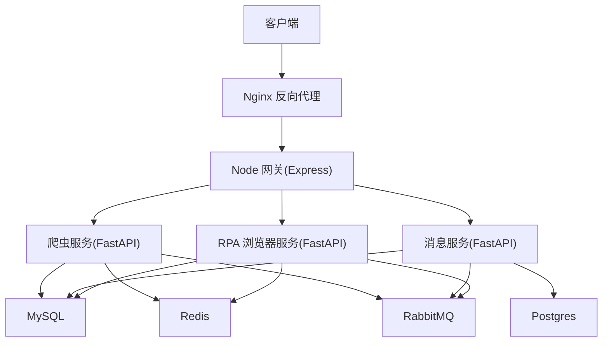
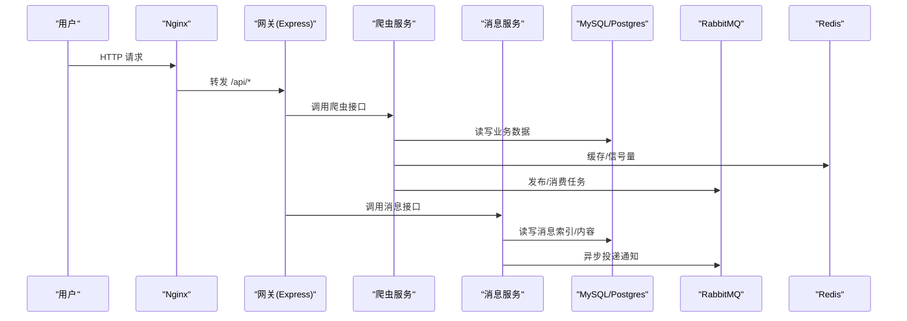
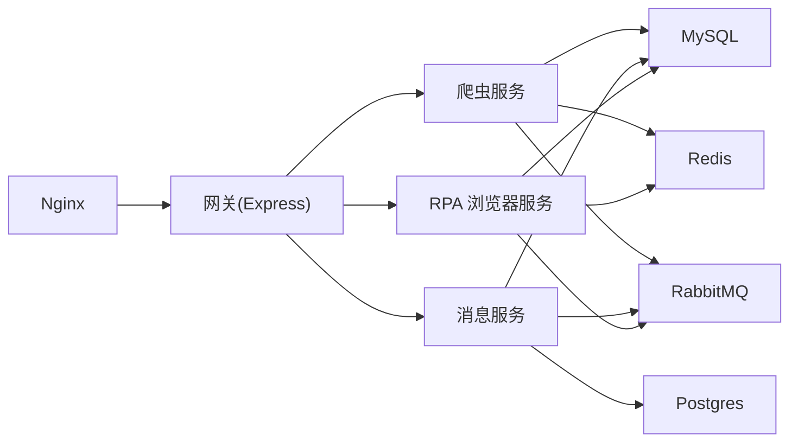

# 性能调优指南

<cite>
**本文引用的文件**
- [docker-compose.yml](file://docker-compose.yml)
- [nginx.conf](file://docker_vol/nginx/conf/nginx.conf)
- [RPA-Browser/app/config.py](file://RPA-Browser/app/config.py)
- [be-bilibili-crawler/CONFIG.py](file://be-bilibili-crawler/CONFIG.py)
- [be-message-service/app/core/config.py](file://be-message-service/app/core/config.py)
- [be-gateway/ExpressServerEnd/MiddleWare/Limiter.js](file://be-gateway/ExpressServerEnd/MiddleWare/Limiter.js)
- [be-gateway/nodejs_backend.config.js](file://be-gateway/nodejs_backend.config.js)
- [be-bilibili-crawler/Service/BaseCrawler/config.py](file://be-bilibili-crawler/Service/BaseCrawler/config.py)
- [be-bilibili-crawler/Service/BaseCrawler/CrawlerType.py](file://be-bilibili-crawler/Service/BaseCrawler/CrawlerType.py)
- [be-bilibili-crawler/Service/MQ/base/MQClient/PrizeExtract.py](file://be-bilibili-crawler/Service/MQ/base/MQClient/PrizeExtract.py)
- [be-bilibili-crawler/scripts/judge_grand_prize/__main__.py](file://be-bilibili-crawler/scripts/judge_grand_prize/__main__.py)
</cite>

## 目录
1. [引言](#引言)
2. [项目结构](#项目结构)
3. [核心组件](#核心组件)
4. [架构总览](#架构总览)
5. [详细组件分析](#详细组件分析)
6. [依赖关系分析](#依赖关系分析)
7. [性能考虑](#性能考虑)
8. [故障排查指南](#故障排查指南)
9. [结论](#结论)
10. [附录](#附录)

## 引言
本指南面向高并发、多服务协作的 BilibiliExplosion 系统，聚焦数据库连接池优化、内存使用优化与 CPU 资源分配策略；覆盖各服务的性能参数调优、缓存策略优化、并发处理优化；提供负载均衡配置、请求限流设置与响应时间优化建议；并给出性能监控指标、瓶颈识别方法与性能测试工具使用指引，帮助解决高并发场景下的性能问题、资源竞争与内存泄漏问题。

## 项目结构
系统采用微服务架构，包含网关（Node/Express）、爬虫服务（Python/FastAPI）、消息服务（Python/FastAPI）、RPA 浏览器服务、MySQL/Postgres/Redis/RabbitMQ、向量检索（Milvus/etcd/minio）以及 Nginx 反向代理等。容器编排通过 docker-compose 统一管理，Nginx 作为入口进行路由与转发。

**图表来源**
- [docker-compose.yml:68-164](file://docker-compose.yml#L68-L164)
- [docker-compose.yml:165-260](file://docker-compose.yml#L165-L260)
- [docker-compose.yml:261-337](file://docker-compose.yml#L261-L337)
- [nginx.conf:9-48](file://docker_vol/nginx/conf/nginx.conf#L9-L48)

**章节来源**
- [docker-compose.yml:1-380](file://docker-compose.yml#L1-L380)
- [nginx.conf:1-71](file://docker_vol/nginx/conf/nginx.conf#L1-L71)

## 核心组件
- 数据库连接池：MySQL/Postgres 异步连接池，含 pool_size、max_overflow、pool_recycle、pool_pre_ping 等关键参数，避免陈旧连接与连接风暴。
- 缓存与限流：Redis 分布式信号量与 rate-limit 中间件，控制外部 API 调用与请求频率。
- 并发与队列：RabbitMQ 消费者/发布者，基于 FastStream；爬虫任务队列与信号量控制；大模型调用速率限制。
- 网关与代理：Nginx 反向代理与 Node 网关限流中间件，统一入口流量治理。
- 资源隔离：不同服务独立容器与资源限制（如爬虫服务内存上限），避免相互影响。

**章节来源**
- [be-bilibili-crawler/CONFIG.py:381-419](file://be-bilibili-crawler/CONFIG.py#L381-L419)
- [be-message-service/app/core/config.py:41-74](file://be-message-service/app/core/config.py#L41-L74)
- [be-bilibili-crawler/Service/MQ/base/MQClient/PrizeExtract.py:93-123](file://be-bilibili-crawler/Service/MQ/base/MQClient/PrizeExtract.py#L93-L123)
- [be-gateway/ExpressServerEnd/MiddleWare/Limiter.js:1-69](file://be-gateway/ExpressServerEnd/MiddleWare/Limiter.js#L1-L69)
- [docker-compose.yml:120-164](file://docker-compose.yml#L120-L164)

## 架构总览
下图展示从客户端到后端服务的关键路径与依赖关系，包括 Nginx、网关、业务服务及数据层。

**图表来源**
- [nginx.conf:30-48](file://docker_vol/nginx/conf/nginx.conf#L30-L48)
- [docker-compose.yml:120-164](file://docker-compose.yml#L120-L164)
- [docker-compose.yml:261-337](file://docker-compose.yml#L261-L337)

## 详细组件分析

### 数据库连接池优化（MySQL/Postgres）
- 爬虫服务（be-bilibili-crawler）
  - 业务连接池与爬虫专用连接池完全隔离，避免爬虫高并发占用导致业务请求阻塞。
  - 关键参数：pool_size=100、max_overflow=40、pool_use_lifo=True、pool_pre_ping=True、pool_recycle=300。
  - 会话配置：expire_on_commit=False、autoflush=False，减少事务开销。
- 消息服务（be-message-service）
  - MySQL 主库连接池较小（pool_size=10, max_overflow=15），适合消息服务负载特征。
  - Postgres（pptr）只读连接池（pool_size=10, max_overflow=20），降低写压力。
  - 防御性逻辑：当 pool_size + max_overflow > 100 时自动降级，防止误配引发 Too many connections。
- RPA 浏览器服务
  - 会话管理器中定义连接池大小与溢出值，用于浏览器上下文管理。

调优建议
- 根据 QPS 与平均延迟调整 pool_size 与 max_overflow，确保连接数不超过数据库最大连接数。
- 保持 pool_recycle < 数据库 wait_timeout，避免陈旧连接错误码（如 MySQL 2013）。
- 启用 pool_pre_ping 在获取连接前探测连通性，提升稳定性。
- 对只读热点查询可考虑引入本地缓存或 Redis 缓存层，减轻数据库压力。

**章节来源**
- [be-bilibili-crawler/CONFIG.py:381-419](file://be-bilibili-crawler/CONFIG.py#L381-L419)
- [be-message-service/app/core/config.py:41-74](file://be-message-service/app/core/config.py#L41-L74)
- [be-message-service/app/core/config.py:351-359](file://be-message-service/app/core/config.py#L351-L359)
- [RPA-Browser/app/utils/depends/session_manager.py:24-25](file://RPA-Browser/app/utils/depends/session_manager.py#L24-L25)

### 内存使用优化
- 容器级内存限制：爬虫服务设置 memory limit 为 5G，避免单实例过度占用。
- LLM 调用跟踪：记录最近调用次数、平均耗时与 token 消耗，便于评估模型调用成本与超时风险。
- 设备内存映射常量：提供不同内存规格对应的字节数，辅助容量规划与压测环境准备。

调优建议
- 结合进程内对象生命周期与缓存 TTL，避免长驻大对象导致内存增长。
- 对批量数据处理采用流式/分页读取，减少一次性加载。
- 监控 RSS/Heap 变化，定位潜在内存泄漏点（如未释放的文件句柄、闭包引用）。

**章节来源**
- [docker-compose.yml:120-125](file://docker-compose.yml#L120-L125)
- [be-bilibili-crawler/Service/llm_service/tracked_llm.py:82-122](file://be-bilibili-crawler/Service/llm_service/tracked_llm.py#L82-L122)
- [be-bilibili-crawler/Utils/GrpcUtils/CONST.py:55-75](file://be-bilibili-crawler/Utils/GrpcUtils/CONST.py#L55-L75)

### CPU 资源分配策略
- 容器部署：通过 docker-compose 为特定服务（如 llama_cpp_gpu_cuda）声明 GPU 设备与数量，实现计算资源隔离。
- 工作进程：Nginx worker_processes auto 与事件连接数合理设置，提高并发处理能力。
- 爬虫并发：每个爬虫类型有独立的 max_sem 与超时策略，避免 CPU 争用。

调优建议
- 将 CPU 密集型任务（如 LLM 推理、视频处理）与 I/O 密集型任务（网络请求、数据库访问）分离部署。
- 根据机器核数与负载曲线调整 Nginx worker_connections 与后端服务进程数。
- 对高 CPU 占用路径添加计时与采样，识别热点函数。

**章节来源**
- [docker-compose.yml:338-356](file://docker-compose.yml#L338-L356)
- [nginx.conf:1-5](file://docker_vol/nginx/conf/nginx.conf#L1-L5)
- [be-bilibili-crawler/Service/BaseCrawler/config.py:93-218](file://be-bilibili-crawler/Service/BaseCrawler/config.py#L93-L218)

### 缓存策略优化
- 分布式信号量：通过 Redis Lua 脚本原子地获取/释放信号量名额，TTL 防死锁，控制大模型提取并发。
- 网关限流：基于 RedisStore 的 express-rate-limit，按 IP 维度限制窗口内请求数，支持自定义 key 生成与跳过策略。
- 浏览器会话缓存：RPA 服务维护 WebRTC 流管理与会话清理策略，减少无效资源占用。

调优建议
- 针对高频读路径增加多级缓存（本地内存 + Redis），注意一致性策略与失效机制。
- 对写放大路径（如评论、私信）采用异步落库与重试补偿，降低同步阻塞。
- 合理设置缓存 TTL 与容量，避免缓存雪崩与穿透。

**章节来源**
- [be-bilibili-crawler/Service/MQ/base/MQClient/PrizeExtract.py:93-123](file://be-bilibili-crawler/Service/MQ/base/MQClient/PrizeExtract.py#L93-L123)
- [be-gateway/ExpressServerEnd/MiddleWare/Limiter.js:1-69](file://be-gateway/ExpressServerEnd/MiddleWare/Limiter.js#L1-L69)
- [RPA-Browser/app/services/RPA_browser/browser_session_pool/session_pool_model.py:152-163](file://RPA-Browser/app/services/RPA_browser/browser_session_pool/session_pool_model.py#L152-L163)

### 并发处理优化
- 爬虫任务队列：固定池模式 worker 持续从队列取任务，使用信号量控制并发，失败重试与超时重入队策略可配置。
- 大模型调用限速：LLM API 配置 requests_per_second，避免下游限流与拥塞。
- 批量并发执行：使用 asyncio.Semaphore 与 gather 控制并发度，统计处理结果与错误计数。

调优建议
- 根据下游服务 QPS 与延迟调整 max_sem，避免打爆上游。
- 对长耗时任务拆分批次，配合退避重试与熔断降级。
- 监控队列堆积与消费者 lag，及时扩容或优化处理逻辑。

**章节来源**
- [be-bilibili-crawler/Service/BaseCrawler/CrawlerType.py:344-361](file://be-bilibili-crawler/Service/BaseCrawler/CrawlerType.py#L344-L361)
- [be-bilibili-crawler/CONFIG.py:211-223](file://be-bilibili-crawler/CONFIG.py#L211-L223)
- [be-bilibili-crawler/scripts/judge_grand_prize/__main__.py:122-158](file://be-bilibili-crawler/scripts/judge_grand_prize/__main__.py#L122-L158)

### 负载均衡与请求限流
- Nginx 反向代理：worker_processes auto，events.worker_connections 合理设置，开启 accept_mutex 减少惊群。
- 网关限流中间件：基于 Redis 的分布式限流，支持窗口时间、请求上限、自定义 key 与成功/失败跳过策略。
- PM2 进程管理：Node 服务以 fork 模式运行，自动重启与等待就绪，提升可用性。

调优建议
- 在多实例部署下，结合健康检查与权重策略做灰度发布。
- 针对不同路由设置差异化限流阈值，保护敏感接口。
- 关注 Nginx error.log 与 upstream 状态，及时调整连接与超时参数。

**章节来源**
- [nginx.conf:1-5](file://docker_vol/nginx/conf/nginx.conf#L1-L5)
- [be-gateway/ExpressServerEnd/MiddleWare/Limiter.js:1-69](file://be-gateway/ExpressServerEnd/MiddleWare/Limiter.js#L1-L69)
- [be-gateway/nodejs_backend.config.js:1-27](file://be-gateway/nodejs_backend.config.js#L1-L27)

### 响应时间优化
- 健康检查端点：消息服务暴露 /health，同时校验 broker 连通性，快速发现不可用节点。
- 日志级别控制：FastStream 与业务日志分级，生产默认 WARNING，降低 IO 开销。
- 连接回收周期：数据库连接池 recycle 与心跳设置，避免空闲连接被服务端断开导致的异常。

调优建议
- 对慢查询进行索引优化与 SQL 改写，减少全表扫描。
- 合并多次小请求为批量操作，降低网络往返。
- 前端侧实施请求去抖与重试策略，提升用户体验。

**章节来源**
- [docker-compose.yml:310-322](file://docker-compose.yml#L310-L322)
- [be-message-service/app/core/config.py:19-28](file://be-message-service/app/core/config.py#L19-L28)
- [be-bilibili-crawler/CONFIG.py:381-392](file://be-bilibili-crawler/CONFIG.py#L381-L392)

## 依赖关系分析

**图表来源**
- [docker-compose.yml:68-164](file://docker-compose.yml#L68-L164)
- [docker-compose.yml:165-260](file://docker-compose.yml#L165-L260)
- [docker-compose.yml:261-337](file://docker-compose.yml#L261-L337)

**章节来源**
- [docker-compose.yml:1-380](file://docker-compose.yml#L1-L380)

## 性能考虑
- 连接池容量与回收策略需与数据库配置匹配，避免 Too many connections 与连接泄漏。
- 分布式信号量与限流中间件应覆盖所有对外调用与敏感接口，防止雪崩。
- 容器资源限制与 GPU 设备声明要与服务实际负载匹配，避免资源争用。
- 日志级别与输出目标在生产环境应保守，减少磁盘 IO 与网络开销。
- 对热点数据与频繁读路径引入缓存，注意一致性与失效策略。
- 对长耗时任务采用异步与队列化，结合重试与熔断机制提升鲁棒性。

[本节为通用指导，不直接分析具体文件]

## 故障排查指南
- 连接风暴：检查数据库连接池配置与防御逻辑，确认 pool_size + max_overflow 是否超过安全余量。
- 限流触发：查看网关限流中间件的 windowMs、limit 与 RedisStore 前缀，确认是否误配导致正常请求被限流。
- 队列堆积：观察 RabbitMQ 队列长度与消费者 lag，必要时扩容消费者或优化处理逻辑。
- 内存泄漏：监控进程内存曲线，定位未释放的大对象或循环引用；结合 GC 日志分析。
- 响应变慢：通过链路追踪与慢查询日志定位瓶颈，优先优化数据库与外部 API 调用。

**章节来源**
- [be-message-service/app/core/config.py:351-359](file://be-message-service/app/core/config.py#L351-L359)
- [be-gateway/ExpressServerEnd/MiddleWare/Limiter.js:20-50](file://be-gateway/ExpressServerEnd/MiddleWare/Limiter.js#L20-L50)
- [be-bilibili-crawler/Service/MQ/base/MQClient/PrizeExtract.py:93-123](file://be-bilibili-crawler/Service/MQ/base/MQClient/PrizeExtract.py#L93-L123)

## 结论
通过对数据库连接池、缓存与限流、并发与队列、负载均衡与响应时间的系统化调优，结合容器资源隔离与健康检查，可有效提升系统在高峰期的稳定性与吞吐能力。建议持续监控关键指标，结合压测与线上反馈迭代优化参数，逐步消除瓶颈与资源竞争问题。

[本节为总结性内容，不直接分析具体文件]

## 附录
- 性能监控指标建议
  - 服务层：QPS、P95/P99 延迟、错误率、线程/协程数、GC 停顿时间。
  - 数据库层：连接数、慢查询数、锁等待、缓冲命中率。
  - 缓存层：命中率、过期键数量、内存使用。
  - 消息层：队列长度、消费延迟、重试次数。
- 瓶颈识别方法
  - APM 链路追踪、火焰图分析、数据库慢查询分析、Redis 监控。
- 性能测试工具
  - 压测：wrk、locust、k6。
  - 监控：Prometheus + Grafana、ELK 日志平台。

[本节为通用指导，不直接分析具体文件]