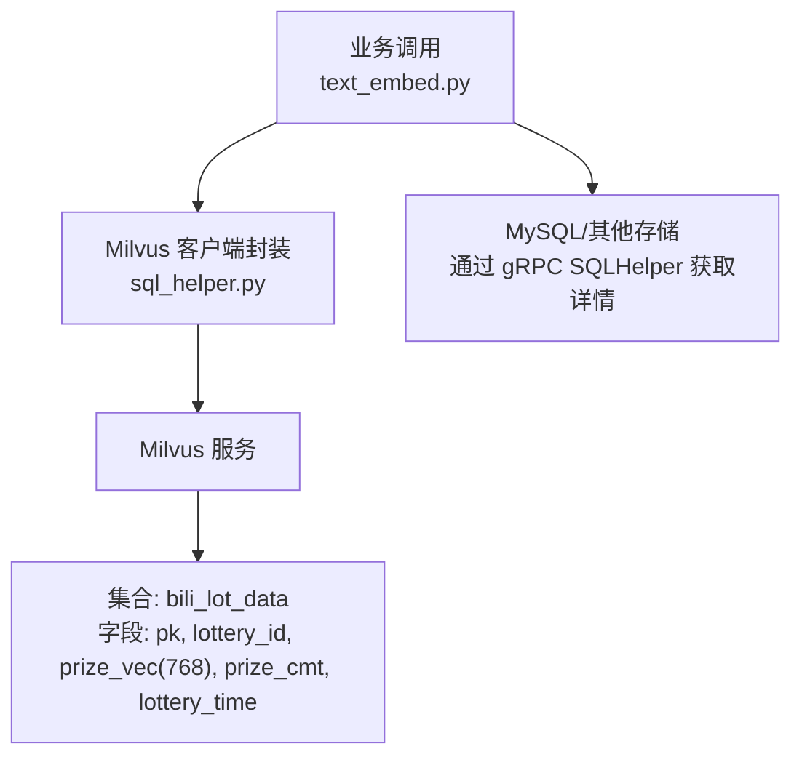
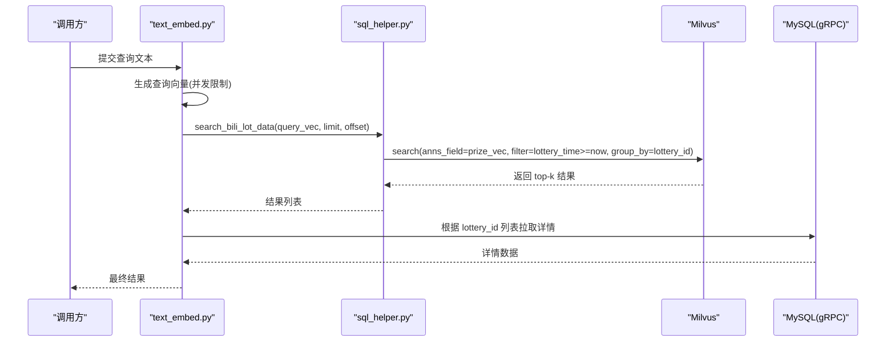
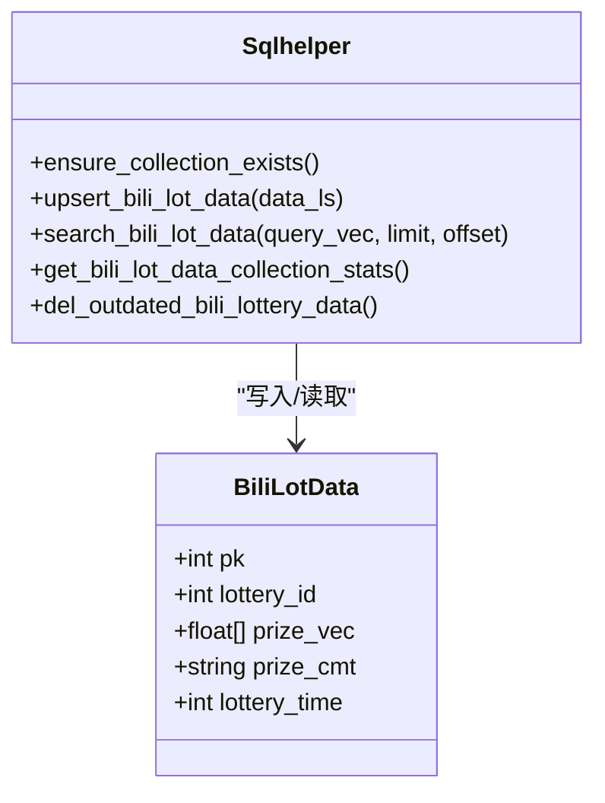
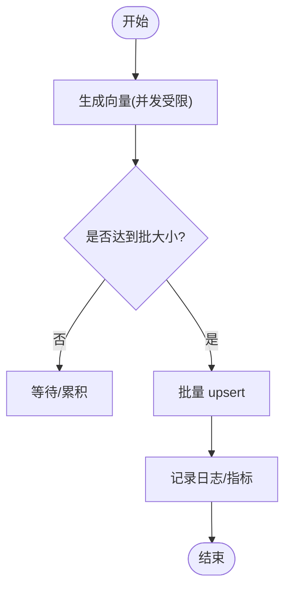
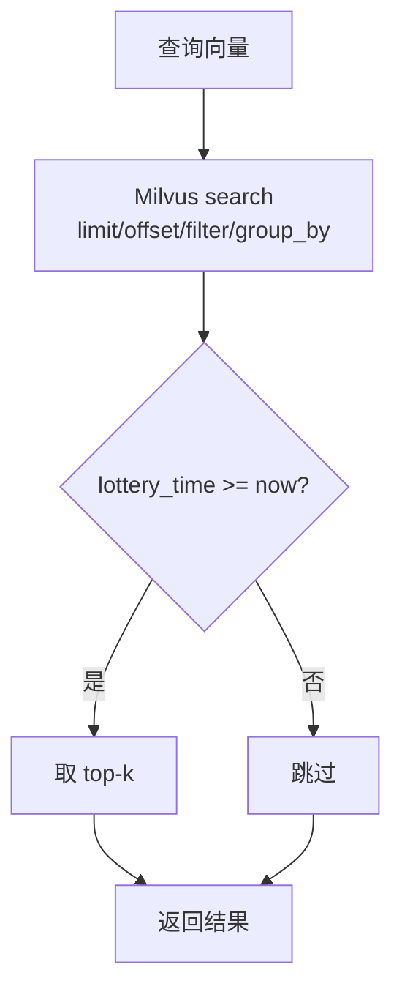
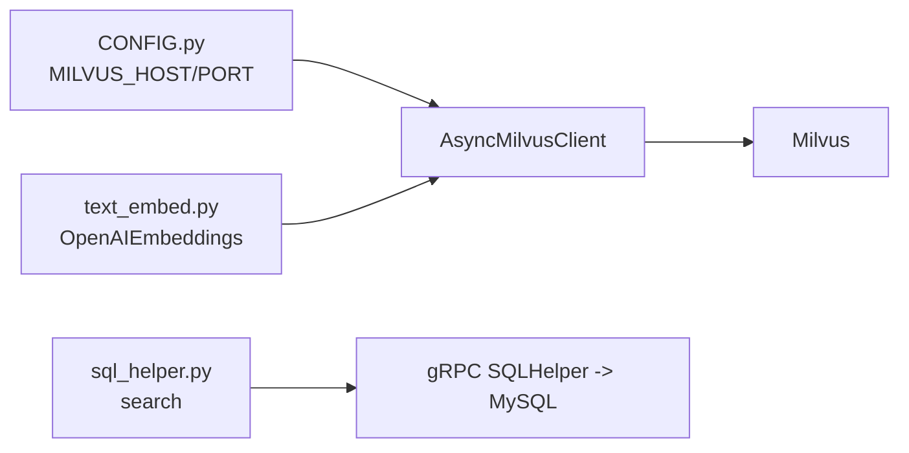

# Milvus 向量数据库优化

<cite>
**本文引用的文件**
- [sql_helper.py](file://be-bilibili-crawler/Service/LangChainCompo/lottery_data_vec_sql/sql_helper.py)
- [biliMilvusModel.py](file://be-bilibili-crawler/Models/lottery_database/milvusModel/biliMilvusModel.py)
- [text_embed.py](file://be-bilibili-crawler/Service/LangChainCompo/text_embed.py)
- [create_collection.py](file://be-bilibili-crawler/scripts/database/同步向量数据库/create_collection.py)
- [CONFIG.py](file://be-bilibili-crawler/CONFIG.py)
- [README.md](file://README.md)
</cite>

## 目录
1. [简介](#简介)
2. [项目结构](#项目结构)
3. [核心组件](#核心组件)
4. [架构总览](#架构总览)
5. [详细组件分析](#详细组件分析)
6. [依赖关系分析](#依赖关系分析)
7. [性能与参数调优](#性能与参数调优)
8. [故障排查指南](#故障排查指南)
9. [结论](#结论)
10. [附录](#附录)

## 简介
本指南面向 B 站抽奖数据的向量检索场景，基于仓库中已有的 Milvus 集成代码，提供从索引选型、维度配置、搜索参数调优到数据导入、批量操作、内存管理、查询计划分析与资源监控的完整优化方案。目标是在大规模向量数据下，兼顾召回质量与低延迟检索，并给出可落地的扩展性建议。

## 项目结构
围绕 Milvus 的关键实现集中在爬虫后端服务中：
- 集合与索引定义、连接管理与 CRUD 封装：[sql_helper.py](file://be-bilibili-crawler/Service/LangChainCompo/lottery_data_vec_sql/sql_helper.py)
- 向量模型定义：[biliMilvusModel.py](file://be-bilibili-crawler/Models/lottery_database/milvusModel/biliMilvusModel.py)
- 文本嵌入生成与写入流程：[text_embed.py](file://be-bilibili-crawler/Service/LangChainCompo/text_embed.py)
- 集合初始化脚本（含字段与可选全文索引）：[create_collection.py](file://be-bilibili-crawler/scripts/database/同步向量数据库/create_collection.py)
- Milvus 连接配置：[CONFIG.py](file://be-bilibili-crawler/CONFIG.py)
- 部署与环境说明（含 Milvus 权限提示）：[README.md](file://README.md)

**图示来源**
- [sql_helper.py:41-90](file://be-bilibili-crawler/Service/LangChainCompo/lottery_data_vec_sql/sql_helper.py#L41-L90)
- [text_embed.py:94-108](file://be-bilibili-crawler/Service/LangChainCompo/text_embed.py#L94-L108)
- [create_collection.py:35-71](file://be-bilibili-crawler/scripts/database/同步向量数据库/create_collection.py#L35-L71)

**章节来源**
- [sql_helper.py:23-178](file://be-bilibili-crawler/Service/LangChainCompo/lottery_data_vec_sql/sql_helper.py#L23-L178)
- [biliMilvusModel.py:1-10](file://be-bilibili-crawler/Models/lottery_database/milvusModel/biliMilvusModel.py#L1-L10)
- [text_embed.py:1-119](file://be-bilibili-crawler/Service/LangChainCompo/text_embed.py#L1-L119)
- [create_collection.py:1-77](file://be-bilibili-crawler/scripts/database/同步向量数据库/create_collection.py#L1-L77)
- [CONFIG.py:225-277](file://be-bilibili-crawler/CONFIG.py#L225-L277)
- [README.md:29-40](file://README.md#L29-L40)

## 核心组件
- Milvus 客户端与集合管理：使用异步客户端创建集合、索引并加载；提供 upsert、search、统计与过期数据清理等能力。
- 向量模型：BiliLotData 包含主键、抽奖 ID、768 维向量、奖项描述与开奖时间。
- 嵌入与写入：通过 OpenAI 兼容的本地 Embedding 服务生成向量，批量 upsert 至 Milvus。
- 搜索流程：将查询文本转为向量后执行近似最近邻搜索，并按抽奖 ID 分组过滤未来时间的结果，再回查 MySQL 获取详情。

**章节来源**
- [sql_helper.py:41-170](file://be-bilibili-crawler/Service/LangChainCompo/lottery_data_vec_sql/sql_helper.py#L41-L170)
- [biliMilvusModel.py:1-10](file://be-bilibili-crawler/Models/lottery_database/milvusModel/biliMilvusModel.py#L1-L10)
- [text_embed.py:22-108](file://be-bilibili-crawler/Service/LangChainCompo/text_embed.py#L22-L108)

## 架构总览
下图展示了从文本到向量、再到检索与结果回查的端到端流程。

**图示来源**
- [text_embed.py:94-108](file://be-bilibili-crawler/Service/LangChainCompo/text_embed.py#L94-L108)
- [sql_helper.py:130-144](file://be-bilibili-crawler/Service/LangChainCompo/lottery_data_vec_sql/sql_helper.py#L130-L144)

## 详细组件分析

### 集合与索引
- 集合字段：pk（主键）、lottery_id、prize_vec（FLOAT_VECTOR，dim=768）、prize_cmt（VARCHAR）、lottery_time（INT64）。
- 当前默认索引：对 prize_vec 使用 FLAT 索引 + COSINE 度量；同时提供 ensure_collection_exists 保证集合存在且已加载。
- 可选增强：在初始化脚本中可为 prize_cmt 启用中文分词以支持全文检索；也可对 lottery_time、lottery_id 建立标量索引以提升过滤效率。

**图示来源**
- [sql_helper.py:23-170](file://be-bilibili-crawler/Service/LangChainCompo/lottery_data_vec_sql/sql_helper.py#L23-L170)
- [biliMilvusModel.py:1-10](file://be-bilibili-crawler/Models/lottery_database/milvusModel/biliMilvusModel.py#L1-L10)

**章节来源**
- [sql_helper.py:41-90](file://be-bilibili-crawler/Service/LangChainCompo/lottery_data_vec_sql/sql_helper.py#L41-L90)
- [create_collection.py:35-71](file://be-bilibili-crawler/scripts/database/同步向量数据库/create_collection.py#L35-L71)

### 数据导入与批量写入
- 写入路径：文本经 Embedding 服务生成 768 维向量后，按批次 upsert 到 Milvus。
- 并发控制：Embedding 调用使用全局锁限流，避免压垮本地推理服务。
- 幂等与去重：主键 pk 由业务规则生成（如 lottery_id * 等级倍数），确保同一奖项不同等级的记录不冲突。

**图示来源**
- [text_embed.py:22-39](file://be-bilibili-crawler/Service/LangChainCompo/text_embed.py#L22-L39)
- [sql_helper.py:122-127](file://be-bilibili-crawler/Service/LangChainCompo/lottery_data_vec_sql/sql_helper.py#L122-L127)

**章节来源**
- [text_embed.py:13-39](file://be-bilibili-crawler/Service/LangChainCompo/text_embed.py#L13-L39)
- [sql_helper.py:122-127](file://be-bilibili-crawler/Service/LangChainCompo/lottery_data_vec_sql/sql_helper.py#L122-L127)

### 相似度搜索与过滤
- 搜索字段：annos_field 为 prize_vec，度量类型 COSINE。
- 过滤条件：lottery_time >= 当前时间戳，仅返回未过期的抽奖结果。
- 分组策略：group_by_field 为 lottery_id，避免同一抽奖重复命中。
- 输出字段：返回 lottery_id、prize_cmt、lottery_time，后续通过 MySQL 拉取更详细信息。

**图示来源**
- [sql_helper.py:130-144](file://be-bilibili-crawler/Service/LangChainCompo/lottery_data_vec_sql/sql_helper.py#L130-L144)

**章节来源**
- [sql_helper.py:130-144](file://be-bilibili-crawler/Service/LangChainCompo/lottery_data_vec_sql/sql_helper.py#L130-L144)

### 过期数据清理
- 删除条件：lottery_time < 当前时间戳，定期清理历史数据，降低存储与检索压力。

**章节来源**
- [sql_helper.py:162-170](file://be-bilibili-crawler/Service/LangChainCompo/lottery_data_vec_sql/sql_helper.py#L162-L170)

## 依赖关系分析
- 配置依赖：Milvus 主机与端口来自 Settings.MILVUS_HOST/MILVUS_PORT。
- 嵌入服务：OpenAI 兼容接口指向本地 LLM 服务地址。
- 数据源：搜索结果通过 gRPC SQLHelper 回查 MySQL 获取详情。

**图示来源**
- [CONFIG.py:225-277](file://be-bilibili-crawler/CONFIG.py#L225-L277)
- [text_embed.py:13-17](file://be-bilibili-crawler/Service/LangChainCompo/text_embed.py#L13-L17)
- [sql_helper.py:130-144](file://be-bilibili-crawler/Service/LangChainCompo/lottery_data_vec_sql/sql_helper.py#L130-L144)

**章节来源**
- [CONFIG.py:225-277](file://be-bilibili-crawler/CONFIG.py#L225-L277)
- [text_embed.py:13-17](file://be-bilibili-crawler/Service/LangChainCompo/text_embed.py#L13-L17)
- [sql_helper.py:130-144](file://be-bilibili-crawler/Service/LangChainCompo/lottery_data_vec_sql/sql_helper.py#L130-L144)

## 性能与参数调优
以下建议结合仓库现有实现与 Milvus 通用实践，针对 B 站抽奖数据规模进行优化。

- 索引类型选择
  - 当前默认：FLAT + COSINE。适合小规模或离线批处理，精确但无加速。
  - 推荐升级：HNSW 或 SCANN 用于在线高吞吐检索。
    - HNSW：在高召回与低延迟间平衡良好，适合中等规模与实时查询。
    - SCANN：在大规模数据上追求更高吞吐与更低延迟，召回略低于 HNSW 但可通过参数调节。
  - 建议：先以 HNSW 作为默认索引，若 QPS 瓶颈明显且可接受微小召回损失，切换至 SCANN。

- 维度配置
  - 当前维度：768。与所用 Embedding 模型一致，无需更改。
  - 注意：若更换 Embedding 模型，需同步调整集合 schema 与索引维度。

- 搜索参数调优
  - metric_type：COSINE（当前已用）。
  - limit/offset：根据前端展示需求设置；当前代码固定 offset=10，可按需改为可调参数。
  - filter：保留 lottery_time >= now，避免命中过期抽奖。
  - group_by_field：lottery_id，避免同一活动重复命中。
  - 建议：在 HNSW/SCANN 下，逐步增大 ef（HNSW）或 nprobe（SCANN）以换取更高召回，观察 P95/P99 延迟变化。

- 数据导入优化
  - 批量 upsert：将多条记录合并为一次请求，减少网络往返。
  - 写入并发：保持 Embedding 调用串行（已有锁），写入阶段可适当提高并发度，但需关注 Milvus 写入队列与磁盘 IO。
  - 预建索引：在大批量导入前完成索引构建，导入后再加载集合。

- 内存与资源管理
  - 集合加载：确保 load_collection 成功，避免冷启动导致的慢查询。
  - 副本数：生产环境建议至少 2 副本，提升可用性与读吞吐。
  - 存储介质：SSD 可显著降低索引构建与查询延迟。
  - 监控：利用 get_collection_stats 与 Milvus 内置指标观察 row_count、内存占用与 CPU 使用率。

- 查询计划与诊断
  - 过滤前置：优先使用强选择性过滤（如 lottery_time）减少候选集。
  - 分组策略：group_by 字段应具有高基数（lottery_id 合适）。
  - 观测点：对比 FLAT/HNSW/SCANN 在不同 limit 下的时延与召回；评估是否需要引入标量索引（如 lottery_time、lottery_id）。

- 扩展性
  - 水平扩展：增加 Milvus DataNode 与 QueryNode 节点，配合副本数提升吞吐。
  - 分片策略：按 lottery_id 范围或哈希分片，均衡热点活动。
  - 读写分离：只读查询走 QueryNode，写入走 DataNode，合理隔离资源。

**章节来源**
- [sql_helper.py:70-86](file://be-bilibili-crawler/Service/LangChainCompo/lottery_data_vec_sql/sql_helper.py#L70-L86)
- [sql_helper.py:130-144](file://be-bilibili-crawler/Service/LangChainCompo/lottery_data_vec_sql/sql_helper.py#L130-L144)
- [create_collection.py:35-71](file://be-bilibili-crawler/scripts/database/同步向量数据库/create_collection.py#L35-L71)

## 故障排查指南
- 无法读写 Milvus
  - 现象：权限错误或写入失败。
  - 处理：参考 README 中的权限修复命令，确保数据目录用户组正确。
- 集合未加载导致慢查询
  - 现象：首次查询延迟极高。
  - 处理：确保 ensure_collection_exists 已调用并完成 load_collection。
- 向量维度不一致
  - 现象：索引创建或查询报错。
  - 处理：核对 Embedding 模型与集合 schema 的 dim=768 一致。
- 搜索结果为空
  - 现象：limit 有效但无命中。
  - 处理：检查 filter 条件（lottery_time >= now）是否过严；确认数据已 upsert 且集合已加载。
- 插入失败或超时
  - 现象：upsert 超时或失败。
  - 处理：降低写入并发，检查 Milvus 负载与磁盘 IO；必要时分批重试。

**章节来源**
- [README.md:119-119](file://README.md#L119-L119)
- [sql_helper.py:92-118](file://be-bilibili-crawler/Service/LangChainCompo/lottery_data_vec_sql/sql_helper.py#L92-L118)
- [sql_helper.py:130-144](file://be-bilibili-crawler/Service/LangChainCompo/lottery_data_vec_sql/sql_helper.py#L130-L144)

## 结论
本项目已具备完整的 Milvus 接入能力，当前采用 FLAT 索引满足小规模场景。面向 B 站抽奖数据的大规模检索，建议：
- 将索引升级为 HNSW 或 SCANN，并结合 COSINE 度量；
- 强化过滤与分组策略，确保仅命中未过期且唯一的活动结果；
- 通过批量写入、副本与分片提升吞吐与可用性；
- 持续监控 row_count、延迟与资源使用，动态调参以平衡召回与时延。

## 附录
- 集合字段与索引建议
  - 向量字段：prize_vec（dim=768），索引类型 HNSW/SCANN，度量 COSINE。
  - 标量字段：lottery_time（过滤）、lottery_id（分组）、pk（主键）。
  - 可选：prize_cmt 启用中文分词以支持全文检索。
- 关键配置位置
  - Milvus 连接：Settings.MILVUS_HOST/MILVUS_PORT。
  - 嵌入服务：OpenAI 兼容地址 CONFIG.llama_url。

**章节来源**
- [sql_helper.py:41-90](file://be-bilibili-crawler/Service/LangChainCompo/lottery_data_vec_sql/sql_helper.py#L41-L90)
- [CONFIG.py:225-277](file://be-bilibili-crawler/CONFIG.py#L225-L277)
- [create_collection.py:35-71](file://be-bilibili-crawler/scripts/database/同步向量数据库/create_collection.py#L35-L71)