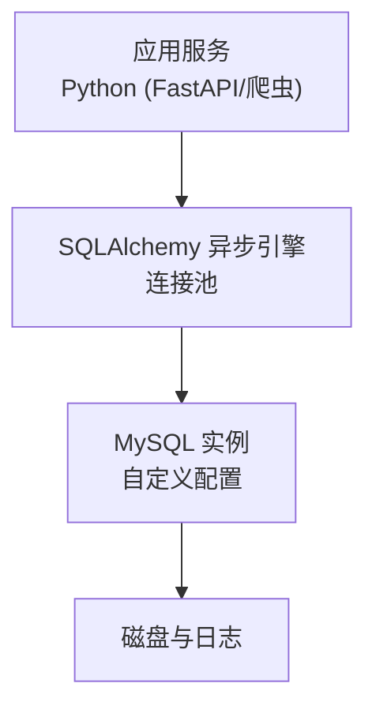
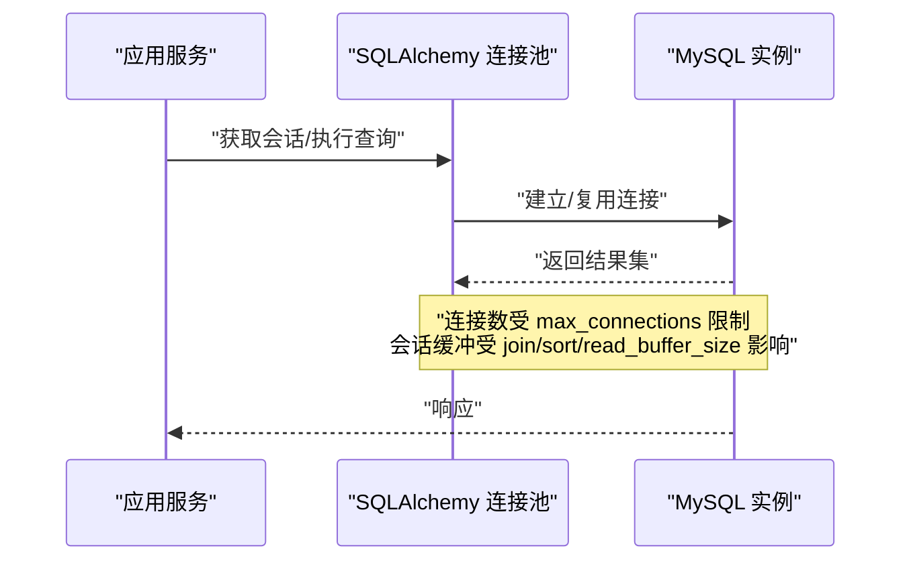
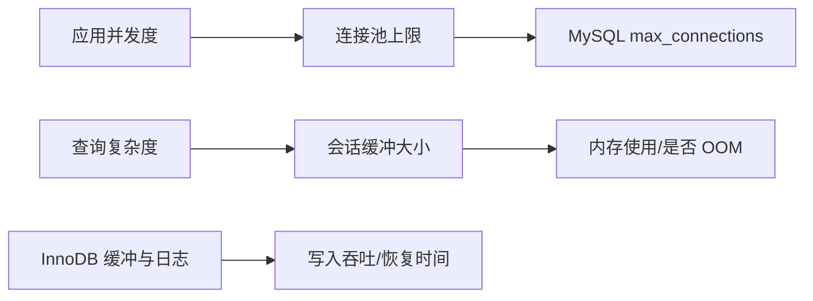

# MySQL 优化

<cite>
**本文引用的文件**
- [custom_mysql.cnf](file://docker_vol/mysql_data/conf.d/custom_mysql.cnf)
- [SqlalchemyTool.py](file://be-bilibili-crawler/Utils/数据库/SqlalchemyTool.py)
- [CONFIG.py](file://be-bilibili-crawler/CONFIG.py)
</cite>

## 目录
1. [简介](#简介)
2. [项目结构](#项目结构)
3. [核心组件](#核心组件)
4. [架构总览](#架构总览)
5. [详细组件分析](#详细组件分析)
6. [依赖关系分析](#依赖关系分析)
7. [性能考量](#性能考量)
8. [故障排查指南](#故障排查指南)
9. [结论](#结论)
10. [附录](#附录)

## 简介
本指南基于仓库中的 MySQL 配置文件 custom_mysql.cnf，面向高并发、内存受限（约 8G）场景，提供连接池参数优化、缓冲区尺寸调优、InnoDB 引擎配置、慢查询与索引策略、分库分表与读写分离建议，以及监控指标、内存优化与锁竞争解决方案。目标是解决连接耗尽、OOM 与查询性能瓶颈等典型问题。

## 项目结构
- MySQL 实例通过 Docker 卷挂载配置文件：docker_vol/mysql_data/conf.d/custom_mysql.cnf
- Python 服务通过 SQLAlchemy 异步引擎访问数据库，连接池由应用层管理
- 当前仓库未包含显式的分库分表或读写分离中间件代码，可在上层网关或服务路由中实现

图表来源
- [custom_mysql.cnf:1-67](file://docker_vol/mysql_data/conf.d/custom_mysql.cnf#L1-L67)
- [SqlalchemyTool.py:25-47](file://be-bilibili-crawler/Utils/数据库/SqlalchemyTool.py#L25-L47)

章节来源
- [custom_mysql.cnf:1-67](file://docker_vol/mysql_data/conf.d/custom_mysql.cnf#L1-L67)
- [SqlalchemyTool.py:25-47](file://be-bilibili-crawler/Utils/数据库/SqlalchemyTool.py#L25-L47)

## 核心组件
- MySQL 服务器配置：连接数、超时、包大小、缓冲区、InnoDB、监控裁剪
- 应用侧连接池：异步引擎与会话工厂的创建与缓存
- 运行时配置对象：集中管理 SQL Alchemy 配置项

章节来源
- [custom_mysql.cnf:1-67](file://docker_vol/mysql_data/conf.d/custom_mysql.cnf#L1-L67)
- [SqlalchemyTool.py:25-47](file://be-bilibili-crawler/Utils/数据库/SqlalchemyTool.py#L25-L47)
- [CONFIG.py:440-487](file://be-bilibili-crawler/CONFIG.py#L440-L487)

## 架构总览
下图展示从应用到 MySQL 的关键路径，并标注与配置相关的要点：连接池上限、会话级缓冲、InnoDB 缓冲与日志、监控开关。

图表来源
- [custom_mysql.cnf:14-24](file://docker_vol/mysql_data/conf.d/custom_mysql.cnf#L14-L24)
- [custom_mysql.cnf:37-42](file://docker_vol/mysql_data/conf.d/custom_mysql.cnf#L37-L42)
- [SqlalchemyTool.py:32-47](file://be-bilibili-crawler/Utils/数据库/SqlalchemyTool.py#L32-L47)

## 详细组件分析

### 连接池参数优化（max_connections、thread_cache_size）
- max_connections=500：控制最大并发连接数，避免线程调度开销过大导致 CPU 抖动
- thread_cache_size=50：缓存已关闭的连接线程，降低频繁建连/销毁的开销
- back_log=100：队列等待连接的上限，突发流量时减少被拒绝的概率
- wait_timeout/interactive_timeout/net_*_timeout/connect_timeout：合理设置超时，释放空闲连接，避免连接泄漏导致的“连接耗尽”

实践建议
- 将应用侧连接池上限设置为不超过 max_connections 的 60%-80%，为系统进程和其他客户端预留空间
- 在高并发短连接场景下适当增大 thread_cache_size；在长连接池化场景下保持默认即可
- 结合业务峰值压测，逐步上调 max_connections，观察 CPU 与上下文切换指标

章节来源
- [custom_mysql.cnf:14-24](file://docker_vol/mysql_data/conf.d/custom_mysql.cnf#L14-L24)

### 缓冲区尺寸调优（join_buffer_size、sort_buffer_size、read_buffer_size）
- join_buffer_size=128K、sort_buffer_size=128K、read_buffer_size=128K、read_rnd_buffer_size=256K：这些是每连接独立分配的内存，默认值过高易引发 OOM
- bulk_insert_buffer_size=4M：批量插入专用缓冲，适合 ETL/数据导入场景
- group_concat_max_len=1048576：限制字符串拼接长度，防止异常大结果占用内存

实践建议
- 优先通过索引和 SQL 改写减少全表扫描与大排序，从而降低对会话缓冲的依赖
- 复杂查询可临时在会话级别提高上述缓冲，避免全局放大带来的风险
- 监控内存使用与慢查询，若发现大量 Sort/MergeJoin 且 IO 升高，再考虑微调

章节来源
- [custom_mysql.cnf:37-42](file://docker_vol/mysql_data/conf.d/custom_mysql.cnf#L37-L42)

### InnoDB 引擎配置（innodb_buffer_pool_size、innodb_redo_log_capacity）
- innodb_buffer_pool_size=256M：在 8G 机器上作为保守起步值，后续根据热点数据集大小与命中率逐步提升
- innodb_buffer_pool_instances=1：实例数与缓冲大小匹配，避免过度切分
- innodb_redo_log_capacity=1G：增大 redo log 容量，降低 checkpoint 频率，提升写入吞吐
- innodb_log_buffer_size=8M、innodb_flush_log_at_trx_commit=2：平衡持久化与性能
- innodb_sort_buffer_size=1M、io_threads=4、lock_wait_timeout=300：优化排序与锁等待行为

实践建议
- 以 buffer pool 命中率 > 99% 为目标，结合 show status 与性能视图评估
- 写入密集型场景可适当增大 redo log 容量与 log buffer，但需权衡恢复时间
- 监控锁等待与死锁，必要时调整 lock_wait_timeout 并结合应用重试/降级

章节来源
- [custom_mysql.cnf:47-57](file://docker_vol/mysql_data/conf.d/custom_mysql.cnf#L47-L57)

### 慢查询分析与定位
当前配置关闭了慢查询日志，便于在生产环境节省 I/O 与内存。建议在以下时机开启并收集样本：
- 上线前压测阶段
- 出现性能回退或告警时
- 定期抽样分析

步骤建议
- 临时开启 slow_query_log，设置合理的 long_query_time（如 1s 或 500ms）
- 采集 top N 慢查询，结合 explain 分析执行计划
- 针对缺失索引、全表扫描、隐式类型转换等问题进行优化
- 优化后关闭慢查询日志，避免长期打开带来额外开销

章节来源
- [custom_mysql.cnf:5-9](file://docker_vol/mysql_data/conf.d/custom_mysql.cnf#L5-L9)

### 索引策略设计
- 主键与唯一索引：确保主键自增或雪花 ID，避免热点更新；为高频过滤列建立合适索引
- 联合索引：按查询条件选择性从高到低排列，覆盖常见查询
- 避免过度索引：写多读少场景谨慎添加索引，关注写入放大
- 覆盖索引：尽量让查询命中索引字段，减少回表
- 定期维护：重建碎片、统计信息更新

说明：本节为通用最佳实践，不直接引用具体代码文件。

### 分库分表方案
仓库未内置分库分表实现，可按如下思路演进：
- 水平分表：按用户 ID/订单号等维度哈希分片，保证同一实体的数据在同一分片
- 垂直分库：按业务域拆分数据库，降低单库压力
- 路由层：在服务层或网关层实现读写路由与分片路由
- 迁移工具：使用 Alembic/自建脚本进行平滑迁移与双写校验

说明：本节为概念性方案，不直接引用具体代码文件。

### 读写分离配置
- 读多写少场景：主库负责写，多个从库承担读流量
- 一致性要求：强一致读必须走主库；最终一致读可走从库
- 延迟处理：对读延迟敏感的场景，增加重试或强制主读
- 监控：关注复制延迟、主从健康状态

说明：本节为概念性方案，不直接引用具体代码文件。

### 应用侧连接池与资源管理
- 异步引擎与会话工厂：通过 create_async_engine 与 async_sessionmaker 创建并缓存，避免重复初始化
- 连接池上限：建议与应用并发度匹配，避免超过 MySQL 的 max_connections
- 会话生命周期：及时提交/关闭会话，减少连接占用
- 错误重试：对瞬时失败（如锁等待超时）做有限重试与退避

章节来源
- [SqlalchemyTool.py:25-47](file://be-bilibili-crawler/Utils/数据库/SqlalchemyTool.py#L25-L47)
- [CONFIG.py:440-487](file://be-bilibili-crawler/CONFIG.py#L440-L487)

## 依赖关系分析
- MySQL 配置决定服务端资源上限与行为（连接、缓冲、InnoDB、监控）
- 应用侧连接池与服务并发度共同决定实际连接占用
- 两者需协同调优，避免“应用侧连接过多 + 服务端缓冲过大”导致 OOM

图表来源
- [custom_mysql.cnf:14-24](file://docker_vol/mysql_data/conf.d/custom_mysql.cnf#L14-L24)
- [custom_mysql.cnf:37-42](file://docker_vol/mysql_data/conf.d/custom_mysql.cnf#L37-L42)
- [custom_mysql.cnf:47-57](file://docker_vol/mysql_data/conf.d/custom_mysql.cnf#L47-L57)

章节来源
- [custom_mysql.cnf:14-57](file://docker_vol/mysql_data/conf.d/custom_mysql.cnf#L14-L57)
- [SqlalchemyTool.py:25-47](file://be-bilibili-crawler/Utils/数据库/SqlalchemyTool.py#L25-L47)

## 性能考量
- 连接耗尽：检查应用连接池上限、连接泄漏、事务未提交；必要时降低并发或扩容
- OOM 问题：重点审查 join/sort/read_buffer_size 等每连接缓冲；优先优化 SQL 与索引
- 查询性能瓶颈：启用慢查询日志采样，定位缺失索引、全表扫描、隐式转换
- InnoDB 性能：关注 buffer pool 命中率、redo log 刷新策略、IO 线程数
- 监控裁剪：performance_schema 关闭可减少内存占用，生产环境按需开启

章节来源
- [custom_mysql.cnf:5-9](file://docker_vol/mysql_data/conf.d/custom_mysql.cnf#L5-L9)
- [custom_mysql.cnf:37-42](file://docker_vol/mysql_data/conf.d/custom_mysql.cnf#L37-L42)
- [custom_mysql.cnf:47-57](file://docker_vol/mysql_data/conf.d/custom_mysql.cnf#L47-L57)

## 故障排查指南
- 连接耗尽
  - 现象：应用报连接池耗尽或 MySQL 拒绝新连接
  - 排查：查看当前连接数、活跃会话、长时间事务；核对应用连接池上限与 max_connections
  - 处置：修复连接泄漏、缩短事务、降低并发或扩容
- OOM
  - 现象：MySQL 进程被 OOM Killer 终止
  - 排查：检查会话缓冲参数、是否存在超大结果集或 group_concat
  - 处置：调小 per-connection 缓冲、优化 SQL、限制结果集大小
- 锁竞争
  - 现象：大量锁等待、事务超时
  - 排查：查看锁等待事件、热点行更新、索引缺失导致锁升级
  - 处置：加索引、拆分事务、调整 lock_wait_timeout、引入重试与降级
- 慢查询
  - 现象：接口 P99 升高
  - 排查：临时开启慢查询日志，采集 top 慢 SQL，explain 分析
  - 处置：补充索引、改写 SQL、分页与批处理

章节来源
- [custom_mysql.cnf:5-9](file://docker_vol/mysql_data/conf.d/custom_mysql.cnf#L5-L9)
- [custom_mysql.cnf:14-24](file://docker_vol/mysql_data/conf.d/custom_mysql.cnf#L14-L24)
- [custom_mysql.cnf:37-42](file://docker_vol/mysql_data/conf.d/custom_mysql.cnf#L37-L42)
- [custom_mysql.cnf:47-57](file://docker_vol/mysql_data/conf.d/custom_mysql.cnf#L47-L57)

## 结论
- 以 custom_mysql.cnf 为基础，先稳态运行，再逐步调优
- 连接池与缓冲参数需与应用并发和查询特征匹配，避免“全局放大”
- 通过慢查询与索引治理，持续降低查询成本
- 在需要时引入分库分表与读写分离，配合监控与演练保障稳定性

## 附录
- 关键参数速查
  - 连接与超时：max_connections、thread_cache_size、back_log、wait_timeout、interactive_timeout、net_read_timeout、net_write_timeout、connect_timeout
  - 包大小：max_allowed_packet
  - 会话缓冲：bulk_insert_buffer_size、join_buffer_size、sort_buffer_size、read_buffer_size、read_rnd_buffer_size、group_concat_max_len
  - InnoDB：innodb_buffer_pool_size、innodb_buffer_pool_instances、innodb_redo_log_capacity、innodb_log_buffer_size、innodb_flush_log_at_trx_commit、innodb_sort_buffer_size、innodb_read_io_threads、innodb_write_io_threads、innodb_thread_concurrency、innodb_lock_wait_timeout
  - 监控与缓存：performance_schema、table_open_cache、table_definition_cache

章节来源
- [custom_mysql.cnf:1-67](file://docker_vol/mysql_data/conf.d/custom_mysql.cnf#L1-L67)