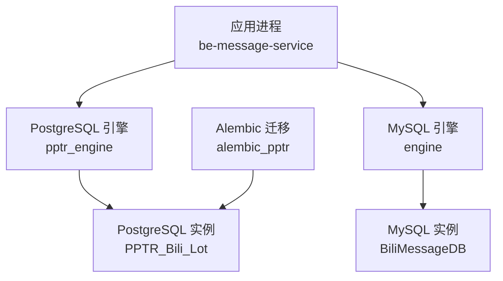
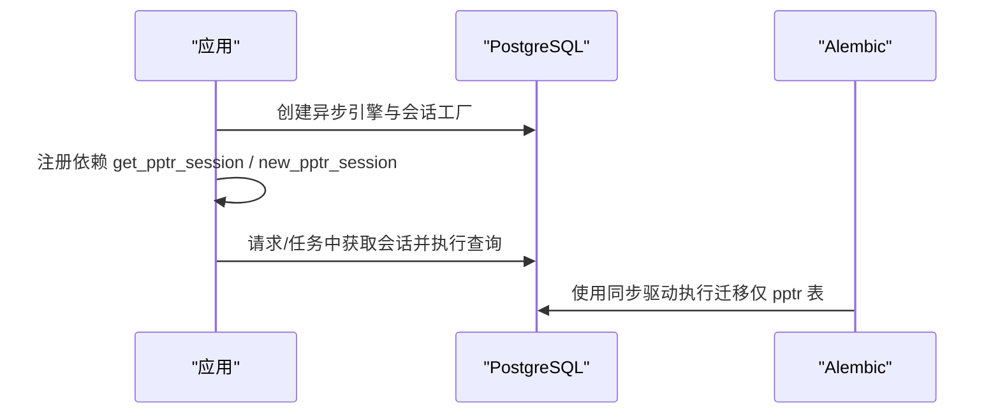
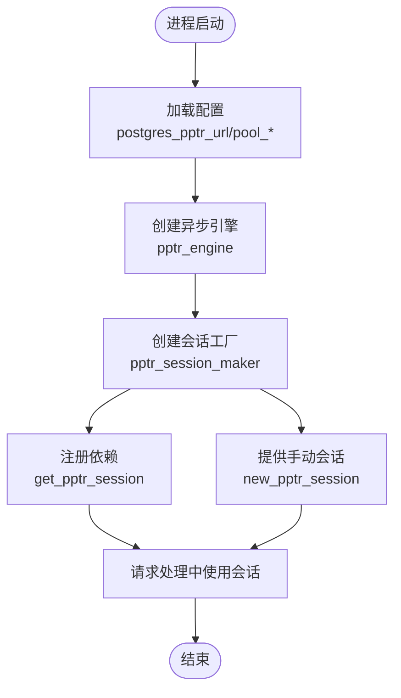
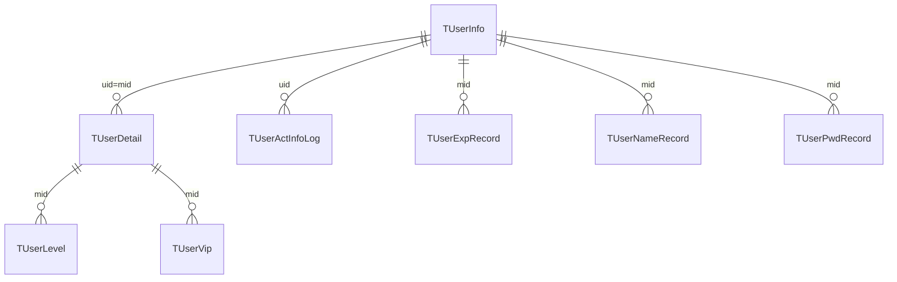
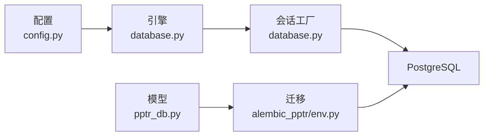

# PostgreSQL 优化

<cite>
**本文引用的文件**
- [be-message-service/app/core/config.py](file://be-message-service/app/core/config.py)
- [be-message-service/app/core/database.py](file://be-message-service/app/core/database.py)
- [be-message-service/app/models/pptr_db.py](file://be-message-service/app/models/pptr_db.py)
- [be-message-service/alembic_pptr/env.py](file://be-message-service/alembic_pptr/env.py)
- [docker-compose.yml](file://docker-compose.yml)
</cite>

## 目录
1. [简介](#简介)
2. [项目结构](#项目结构)
3. [核心组件](#核心组件)
4. [架构总览](#架构总览)
5. [详细组件分析](#详细组件分析)
6. [依赖关系分析](#依赖关系分析)
7. [性能考虑](#性能考虑)
8. [故障排查指南](#故障排查指南)
9. [结论](#结论)
10. [附录](#附录)

## 简介
本指南面向 be-message-service 服务所连接的 PostgreSQL 数据库（PPTR_Bili_Lot，由 be-message 接管），聚焦连接池配置、查询性能调优与索引优化策略，并补充 WAL、VACUUM、统计信息收集、复杂查询优化、分区表设计、备份恢复、并发冲突与死锁检测、以及性能监控等实践建议。文档同时结合代码中的连接池与迁移配置，给出可落地的参数与流程。

## 项目结构
- be-message-service 通过配置模块集中管理数据库连接串与连接池参数，并通过数据库模块创建异步引擎与会话工厂，暴露 FastAPI 依赖注入与手动会话创建能力。
- pptr Postgres 库的模型定义在 models/pptr_db.py，Alembic 独立分支 alembic_pptr 仅纳管 public schema 下的 pptr 表，避免与 MySQL 元数据混淆。
- docker-compose 提供容器化部署环境，便于统一编排数据库与服务。

图表来源
- [be-message-service/app/core/database.py:86-102](file://be-message-service/app/core/database.py#L86-L102)
- [be-message-service/app/core/config.py:60-74](file://be-message-service/app/core/config.py#L60-L74)
- [be-message-service/alembic_pptr/env.py:27-31](file://be-message-service/alembic_pptr/env.py#L27-L31)

章节来源
- [be-message-service/app/core/config.py:41-74](file://be-message-service/app/core/config.py#L41-L74)
- [be-message-service/app/core/database.py:28-46](file://be-message-service/app/core/database.py#L28-L46)
- [be-message-service/app/core/database.py:86-102](file://be-message-service/app/core/database.py#L86-L102)
- [be-message-service/alembic_pptr/env.py:1-90](file://be-message-service/alembic_pptr/env.py#L1-L90)

## 核心组件
- 配置中心：集中声明 PostgreSQL 连接串、schema、连接池大小、溢出、回收周期与回显开关，并提供同步驱动 URL 供 Alembic 使用。
- 数据库层：为 PostgreSQL 创建异步引擎与会话工厂，暴露 FastAPI 依赖 get_pptr_session 与 new_pptr_session，用于请求上下文与非请求上下文的会话管理。
- 模型与迁移：pptr_db 定义用户相关表结构；alembic_pptr/env 限定仅迁移 public schema 下的 pptr 表，确保版本演进安全可控。

章节来源
- [be-message-service/app/core/config.py:60-74](file://be-message-service/app/core/config.py#L60-L74)
- [be-message-service/app/core/config.py:361-371](file://be-message-service/app/core/config.py#L361-L371)
- [be-message-service/app/core/database.py:86-120](file://be-message-service/app/core/database.py#L86-L120)
- [be-message-service/app/models/pptr_db.py:31-290](file://be-message-service/app/models/pptr_db.py#L31-L290)
- [be-message-service/alembic_pptr/env.py:27-50](file://be-message-service/alembic_pptr/env.py#L27-L50)

## 架构总览
be-message-service 对 PostgreSQL 的使用路径如下：
- 启动时读取配置生成 pptr_engine 与 pptr_session_maker。
- 路由或消费者通过 get_pptr_session/new_pptr_session 获取会话执行 SQL。
- Alembic 通过同步驱动连接 Postgres，仅迁移 pptr 表集合。

图表来源
- [be-message-service/app/core/database.py:86-120](file://be-message-service/app/core/database.py#L86-L120)
- [be-message-service/alembic_pptr/env.py:27-83](file://be-message-service/alembic_pptr/env.py#L27-L83)

## 详细组件分析

### 连接池配置与生命周期
- 连接串与 Schema：PostgreSQL 连接串与 schema 在配置中声明，默认指向 PPTR_Bili_Lot 的 public schema。
- 连接池参数：pool_size、max_overflow、pool_recycle、pool_pre_ping、pool_timeout、echo 均通过配置注入到引擎创建过程。
- 会话管理：FastAPI 依赖注入提供自动关闭的会话；非请求上下文可通过 new_pptr_session 手动管理生命周期。
- 健康检查：提供 test_pptr_connection 用于启动自检连通性。

图表来源
- [be-message-service/app/core/config.py:60-74](file://be-message-service/app/core/config.py#L60-L74)
- [be-message-service/app/core/database.py:86-120](file://be-message-service/app/core/database.py#L86-L120)
- [be-message-service/app/core/database.py:175-183](file://be-message-service/app/core/database.py#L175-L183)

章节来源
- [be-message-service/app/core/config.py:60-74](file://be-message-service/app/core/config.py#L60-L74)
- [be-message-service/app/core/database.py:86-120](file://be-message-service/app/core/database.py#L86-L120)
- [be-message-service/app/core/database.py:175-183](file://be-message-service/app/core/database.py#L175-L183)

### 模型与索引现状
- 用户主数据与扩展表：TUserInfo、TUserDetail、TUserLevel、TUserVip 等表已定义主键与外键约束。
- 现有索引：TUserExpRecord 上存在复合索引 idx_exp_record_mid_action_ref_date，覆盖 mid、action_type、ref_date 的查询场景。
- 其他表未显式定义额外索引，需根据实际查询模式评估新增索引。

图表来源
- [be-message-service/app/models/pptr_db.py:34-162](file://be-message-service/app/models/pptr_db.py#L34-L162)
- [be-message-service/app/models/pptr_db.py:164-290](file://be-message-service/app/models/pptr_db.py#L164-L290)

章节来源
- [be-message-service/app/models/pptr_db.py:34-290](file://be-message-service/app/models/pptr_db.py#L34-L290)

### 迁移与环境
- Alembic 仅迁移 pptr 表：env.py 通过 include_object 过滤，确保只将 pptr_db 中定义的表纳入迁移目标。
- 同步驱动：使用 psycopg2 作为 Alembic 的同步驱动，避免异步驱动不兼容问题。
- 目标元数据：target_metadata 指向全局 SQLModel.metadata，但受 include_object 限制。

章节来源
- [be-message-service/alembic_pptr/env.py:1-90](file://be-message-service/alembic_pptr/env.py#L1-L90)

## 依赖关系分析
- 配置依赖：database.py 通过 settings 读取 PostgreSQL 连接串与池参数。
- 模型依赖：pptr_db 中的表结构与约束被 Alembic 识别并迁移。
- 运行依赖：docker-compose 编排服务与数据库，保证网络可达与端口映射。

图表来源
- [be-message-service/app/core/config.py:60-74](file://be-message-service/app/core/config.py#L60-L74)
- [be-message-service/app/core/database.py:86-120](file://be-message-service/app/core/database.py#L86-L120)
- [be-message-service/app/models/pptr_db.py:34-290](file://be-message-service/app/models/pptr_db.py#L34-L290)
- [be-message-service/alembic_pptr/env.py:27-83](file://be-message-service/alembic_pptr/env.py#L27-L83)

章节来源
- [be-message-service/app/core/config.py:60-74](file://be-message-service/app/core/config.py#L60-L74)
- [be-message-service/app/core/database.py:86-120](file://be-message-service/app/core/database.py#L86-L120)
- [be-message-service/app/models/pptr_db.py:34-290](file://be-message-service/app/models/pptr_db.py#L34-L290)
- [be-message-service/alembic_pptr/env.py:27-83](file://be-message-service/alembic_pptr/env.py#L27-L83)

## 性能考虑
以下为针对 PostgreSQL 的通用优化建议，结合 be-message-service 的连接池与模型现状给出落地要点：

- 连接池与并发
  - 合理设置 pool_size 与 max_overflow，避免过大导致连接风暴；当前默认值适合中小规模负载。
  - 启用 pool_pre_ping 防止陈旧连接；pool_recycle 小于服务端超时时间，避免连接失效。
  - 在高并发读场景下，优先复用连接池，减少短连接开销。

- 查询性能
  - 基于查询模式添加或调整索引：例如按 mid、action_type、ref_date 的复合查询已有索引，可覆盖经验记录查询。
  - 避免全表扫描与不必要的 SELECT *，尽量只取必要列。
  - 对高频过滤条件建立合适索引，关注选择性高的列。
  - 使用 EXPLAIN/EXPLAIN ANALYZE 分析慢查询，定位瓶颈。

- 事务与隔离级别
  - 当前 MySQL 侧采用 READ COMMITTED 降低高并发写死锁概率；PostgreSQL 可根据业务需求选择合适隔离级别，必要时使用行级锁与重试机制。

- WAL、VACUUM 与统计信息
  - WAL：根据写入量与恢复目标调整 wal_level、max_wal_senders、wal_buffers、effective_cache_size 等参数，平衡吞吐与持久性。
  - VACUUM：定期执行 VACUUM（或 VACUUM FULL 谨慎使用）清理死元组，避免表膨胀；结合 autovacuum 阈值与频率调优。
  - 统计信息：确保 analyze 及时更新统计信息，提升查询计划质量；对热点表可设置更频繁的 analyze 策略。

- 复杂查询优化
  - 拆分大事务为小批量操作，减少锁竞争与日志压力。
  - 使用 CTE 或临时表组织复杂逻辑，提高可读性与可维护性。
  - 对聚合与排序操作，确保有合适的索引支持，避免内存溢出。

- 分区表设计
  - 对于时间序列或大规模日志表，可按时间范围进行分区，提升查询与维护效率。
  - 分区键选择应匹配常见查询条件，如 ref_date、createdAt 等。

- 备份与恢复
  - 使用 pg_basebackup 或逻辑备份工具（pg_dump/pg_restore）制定周期性备份策略。
  - 结合 WAL 归档实现时间点恢复（PITR），满足 RPO/RTO 要求。
  - 定期演练恢复流程，验证备份有效性。

- 并发冲突与死锁
  - 通过错误码与日志捕获死锁，增加重试与退避策略。
  - 规范事务顺序，避免交叉锁；必要时使用 NOWAIT 或 SKIP LOCKED 优化争用。

- 性能监控
  - 启用 pg_stat_statements 跟踪慢查询与热点 SQL。
  - 监控连接数、缓存命中率、WAL 生成速率、VACUUM 状态等关键指标。
  - 结合系统监控（CPU、内存、磁盘 I/O）综合定位瓶颈。

[本节为通用指导，无需特定文件引用]

## 故障排查指南
- 连接测试
  - 使用 test_pptr_connection 进行启动自检，快速发现网络或认证问题。
- 连接池异常
  - 若出现 Too many connections，检查 pool_size 与 max_overflow 是否误配；当前配置包含防御逻辑，超过阈值会强制降级。
- 迁移失败
  - 确认 alembic_pptr/env 的 include_object 仅包含 pptr 表；检查同步驱动 URL 是否正确替换。
- 慢查询与索引缺失
  - 使用 EXPLAIN 分析执行计划，结合 pg_stat_user_indexes 查看索引使用情况。
- 死锁与锁等待
  - 查询 pg_locks、pg_stat_activity 定位阻塞源；调整事务粒度与锁策略。

章节来源
- [be-message-service/app/core/database.py:175-183](file://be-message-service/app/core/database.py#L175-L183)
- [be-message-service/app/core/config.py:355-359](file://be-message-service/app/core/config.py#L355-L359)
- [be-message-service/alembic_pptr/env.py:27-50](file://be-message-service/alembic_pptr/env.py#L27-L50)

## 结论
be-message-service 对 PostgreSQL 的使用集中在连接池配置、会话管理与模型迁移三个层面。通过合理的连接池参数、针对性的索引设计与完善的 WAL/VACUUM/统计信息策略，可显著提升查询性能与系统稳定性。配合分区表、备份恢复与监控体系，能够支撑高并发与大数据量的业务场景。建议在上线前完成慢查询分析与索引评审，并建立常态化的性能监控与容量规划机制。

[本节为总结性内容，无需特定文件引用]

## 附录
- 环境变量与配置项
  - postgres_pptr_url：PostgreSQL 连接串
  - postgres_pptr_schema：schema（public）
  - postgres_pptr_pool_size：连接池大小
  - postgres_pptr_max_overflow：溢出连接上限
  - postgres_pptr_pool_recycle：连接回收周期
  - postgres_pptr_echo：SQL 回显开关
- 迁移命令参考
  - 使用 alembic_pptr/env 提供的同步驱动执行迁移，确保仅迁移 pptr 表集合。

章节来源
- [be-message-service/app/core/config.py:60-74](file://be-message-service/app/core/config.py#L60-L74)
- [be-message-service/alembic_pptr/env.py:27-83](file://be-message-service/alembic_pptr/env.py#L27-L83)