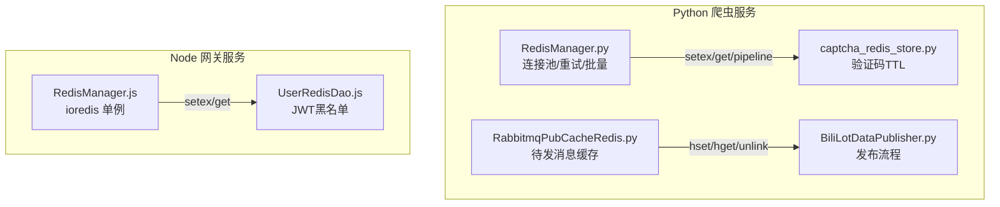
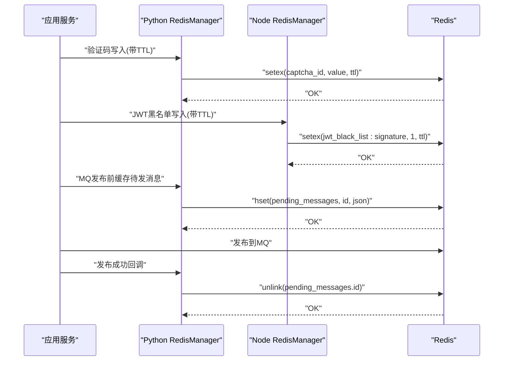
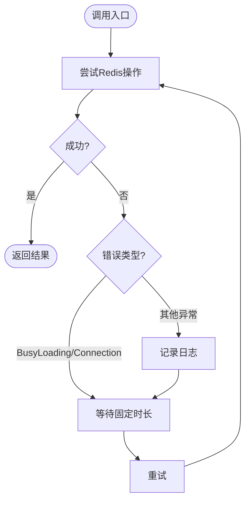
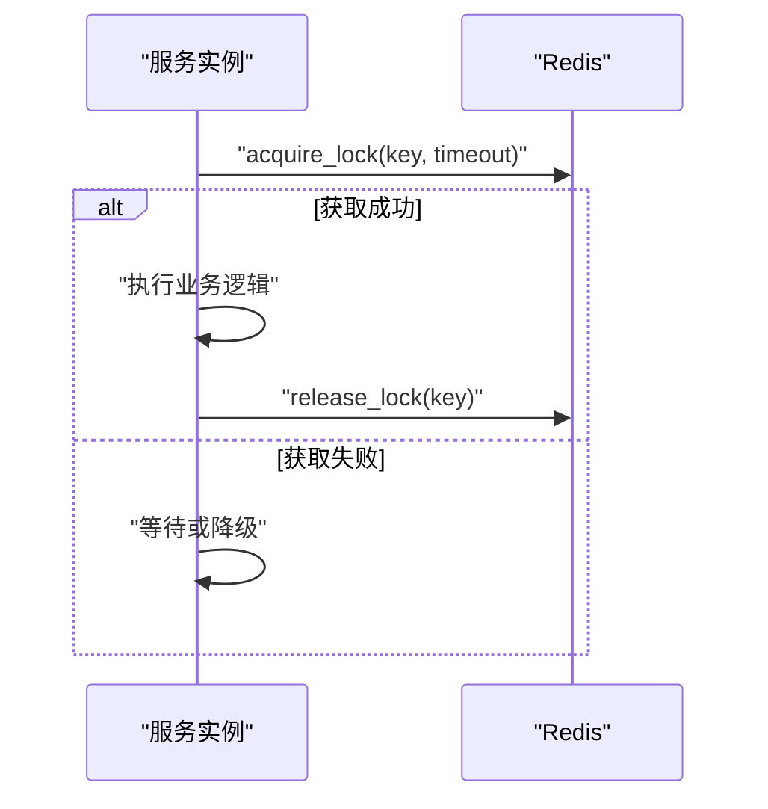
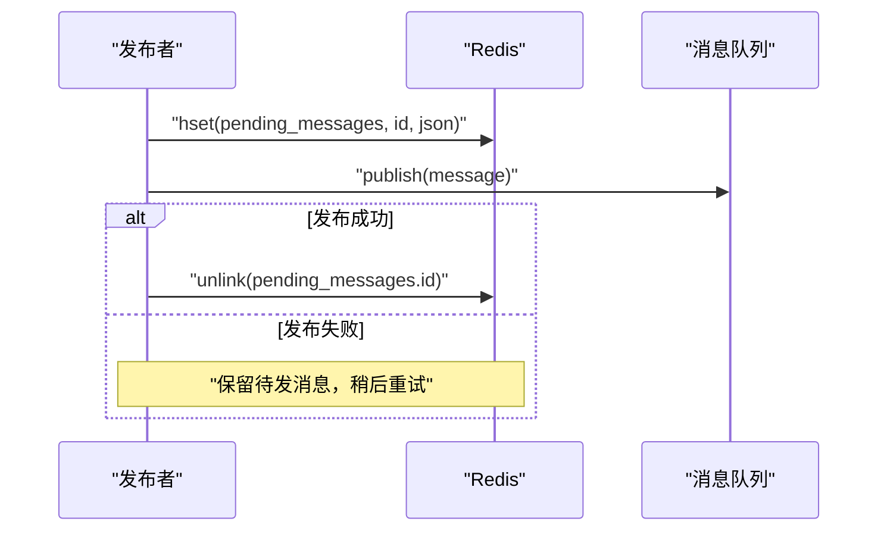
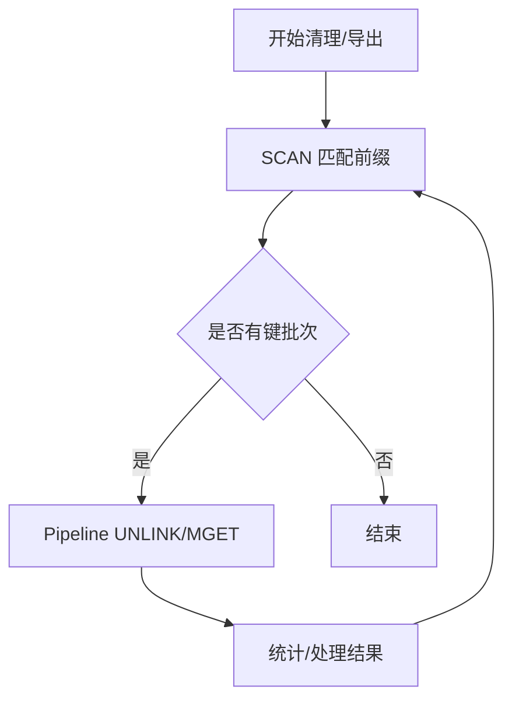
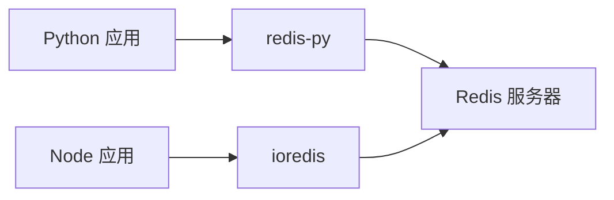

# Redis 优化

<cite>
**本文引用的文件**
- [RedisManager.py](file://be-bilibili-crawler/Utils/redisTool/RedisManager.py)
- [RedisManager.js](file://be-gateway/ExpressServerEnd/DAO/Redis/RedisManager.js)
- [UserRedisDao.js](file://be-gateway/ExpressServerEnd/DAO/UserRedisDao.js)
- [captcha_redis_store.py](file://be-bilibili-crawler/Service/CaptchaGen/captcha_redis_store.py)
- [RabbitmqPubCacheRedis.py](file://be-bilibili-crawler/Service/MQ/utils/RabbitmqPubCacheRedis.py)
- [BiliLotDataPublisher.py](file://be-bilibili-crawler/Service/MQ/base/MQClient/BiliLotDataPublisher.py)
- [package-lock.json](file://be-gateway/package-lock.json)
</cite>

## 目录
1. [简介](#简介)
2. [项目结构](#项目结构)
3. [核心组件](#核心组件)
4. [架构总览](#架构总览)
5. [详细组件分析](#详细组件分析)
6. [依赖分析](#依赖分析)
7. [性能考虑](#性能考虑)
8. [故障排查指南](#故障排查指南)
9. [结论](#结论)
10. [附录](#附录)

## 简介
本指南面向本项目中 Redis 的使用现状，结合现有代码中的连接池、重试与锁、批量操作、过期策略、消息队列缓存等实现，给出可落地的优化建议：包括连接池配置、内存管理与持久化方案、命中率提升、过期策略、集群部署、热点数据缓存、分布式锁、消息队列集成、内存碎片整理与大对象处理、性能监控，以及穿透、雪崩、击穿的治理策略。

## 项目结构
仓库包含多个服务，其中与 Redis 相关的关键位置如下：
- Python 爬虫服务（be-bilibili-crawler）
  - 统一 Redis 客户端封装与连接池管理：[RedisManager.py](file://be-bilibili-crawler/Utils/redisTool/RedisManager.py)
  - 验证码存储与过期：[captcha_redis_store.py](file://be-bilibili-crawler/Service/CaptchaGen/captcha_redis_store.py)
  - MQ 发布前待发消息缓存（防丢）：[RabbitmqPubCacheRedis.py](file://be-bilibili-crawler/Service/MQ/utils/RabbitmqPubCacheRedis.py)、[BiliLotDataPublisher.py](file://be-bilibili-crawler/Service/MQ/base/MQClient/BiliLotDataPublisher.py)
- Node 网关服务（be-gateway）
  - ioredis 单例连接与黑名单缓存：[RedisManager.js](file://be-gateway/ExpressServerEnd/DAO/Redis/RedisManager.js)、[UserRedisDao.js](file://be-gateway/ExpressServerEnd/DAO/UserRedisDao.js)

**图示来源**
- [RedisManager.py:81-209](file://be-bilibili-crawler/Utils/redisTool/RedisManager.py#L81-L209)
- [captcha_redis_store.py:1-23](file://be-bilibili-crawler/Service/CaptchaGen/captcha_redis_store.py#L1-L23)
- [RabbitmqPubCacheRedis.py:1-40](file://be-bilibili-crawler/Service/MQ/utils/RabbitmqPubCacheRedis.py#L1-L40)
- [BiliLotDataPublisher.py:36-72](file://be-bilibili-crawler/Service/MQ/base/MQClient/BiliLotDataPublisher.py#L36-L72)
- [RedisManager.js:1-21](file://be-gateway/ExpressServerEnd/DAO/Redis/RedisManager.js#L1-L21)
- [UserRedisDao.js:1-27](file://be-gateway/ExpressServerEnd/DAO/UserRedisDao.js#L1-L27)

**章节来源**
- [RedisManager.py:81-209](file://be-bilibili-crawler/Utils/redisTool/RedisManager.py#L81-L209)
- [RedisManager.js:1-21](file://be-gateway/ExpressServerEnd/DAO/Redis/RedisManager.js#L1-L21)
- [UserRedisDao.js:1-27](file://be-gateway/ExpressServerEnd/DAO/UserRedisDao.js#L1-L27)
- [captcha_redis_store.py:1-23](file://be-bilibili-crawler/Service/CaptchaGen/captcha_redis_store.py#L1-L23)
- [RabbitmqPubCacheRedis.py:1-40](file://be-bilibili-crawler/Service/MQ/utils/RabbitmqPubCacheRedis.py#L1-L40)
- [BiliLotDataPublisher.py:36-72](file://be-bilibili-crawler/Service/MQ/base/MQClient/BiliLotDataPublisher.py#L36-L72)

## 核心组件
- Python 端 Redis 客户端封装
  - 连接池：基于 redis-py 的 ConnectionPool.from_url，设置 socket_timeout、health_check_interval、retry_on_timeout，最大连接数通过信号量控制。
  - 重试机制：异步/同步双重重试装饰器，对 BusyLoadingError、ConnectionError 进行退避重试；生成器迭代场景支持整体重试。
  - 批量与扫描：提供 SCAN 迭代、UNLINK 批量删除、MGET/HSET 批量写入，避免一次性加载导致内存峰值。
  - 分布式锁：使用 Redis 原生 lock 上下文，配合超时时间防止死锁。
- Node 端 Redis 客户端
  - 基于 ioredis 的单例连接，从环境变量读取 host/port/db/pwd，构建 URL 并创建连接。
  - JWT 黑名单：使用 setex 设置过期时间，get 查询是否拉黑。
- 业务用例
  - 验证码：以 key 为标识，setex 设置 TTL，get 获取后删除。
  - MQ 发布前缓存：将待发消息序列化存入 Hash，发布成功后移除，失败保留以便重试或补偿。

**章节来源**
- [RedisManager.py:81-209](file://be-bilibili-crawler/Utils/redisTool/RedisManager.py#L81-L209)
- [RedisManager.py:212-258](file://be-bilibili-crawler/Utils/redisTool/RedisManager.py#L212-L258)
- [RedisManager.py:292-340](file://be-bilibili-crawler/Utils/redisTool/RedisManager.py#L292-L340)
- [RedisManager.py:535-663](file://be-bilibili-crawler/Utils/redisTool/RedisManager.py#L535-L663)
- [RedisManager.js:1-21](file://be-gateway/ExpressServerEnd/DAO/Redis/RedisManager.js#L1-L21)
- [UserRedisDao.js:10-21](file://be-gateway/ExpressServerEnd/DAO/UserRedisDao.js#L10-L21)
- [captcha_redis_store.py:8-22](file://be-bilibili-crawler/Service/CaptchaGen/captcha_redis_store.py#L8-L22)
- [RabbitmqPubCacheRedis.py:21-40](file://be-bilibili-crawler/Service/MQ/utils/RabbitmqPubCacheRedis.py#L21-L40)
- [BiliLotDataPublisher.py:36-72](file://be-bilibili-crawler/Service/MQ/base/MQClient/BiliLotDataPublisher.py#L36-L72)

## 架构总览
下图展示了 Python 与 Node 服务如何通过各自的 Redis 客户端访问 Redis，并在验证码、MQ 缓存、JWT 黑名单等场景中协作。

**图示来源**
- [captcha_redis_store.py:14-19](file://be-bilibili-crawler/Service/CaptchaGen/captcha_redis_store.py#L14-L19)
- [UserRedisDao.js:10-12](file://be-gateway/ExpressServerEnd/DAO/UserRedisDao.js#L10-L12)
- [RabbitmqPubCacheRedis.py:31-40](file://be-bilibili-crawler/Service/MQ/utils/RabbitmqPubCacheRedis.py#L31-L40)
- [BiliLotDataPublisher.py:54-70](file://be-bilibili-crawler/Service/MQ/base/MQClient/BiliLotDataPublisher.py#L54-L70)

## 详细组件分析

### 连接池与重试
- Python 端
  - 连接池参数：socket_timeout、health_check_interval、retry_on_timeout，最大连接数受信号量限制，避免连接风暴。
  - 重试策略：异步/同步方法均被装饰器包裹，遇到连接错误或加载忙时等待固定时长后重试；生成器迭代异常会重置整个迭代过程并重试。
  - 管道与批量：大量 get/set/hset/mget/zadd 等操作通过 pipeline 执行，减少网络往返。
- Node 端
  - ioredis 单例连接，未显式配置连接池大小与超时，建议补充连接池与超时参数以提升稳定性。

**图示来源**
- [RedisManager.py:62-99](file://be-bilibili-crawler/Utils/redisTool/RedisManager.py#L62-L99)
- [RedisManager.py:20-59](file://be-bilibili-crawler/Utils/redisTool/RedisManager.py#L20-L59)

**章节来源**
- [RedisManager.py:81-209](file://be-bilibili-crawler/Utils/redisTool/RedisManager.py#L81-L209)
- [RedisManager.py:62-99](file://be-bilibili-crawler/Utils/redisTool/RedisManager.py#L62-L99)
- [RedisManager.js:1-21](file://be-gateway/ExpressServerEnd/DAO/Redis/RedisManager.js#L1-L21)

### 过期策略与热点数据缓存
- 验证码：使用 setex 设置 TTL，避免长期占用内存；读取后删除，降低重复请求压力。
- JWT 黑名单：setex 设置过期时间，定期刷新黑名单，避免永久驻留。
- 热点数据建议：
  - 使用 Hash 或 String 缓存高频读的数据，设置合理 TTL。
  - 对超大对象采用分片存储（如按 ID 分段），或使用压缩编码减少内存占用。
  - 结合本地缓存（进程内）做二级缓存，进一步降低 Redis 压力。

**章节来源**
- [captcha_redis_store.py:8-22](file://be-bilibili-crawler/Service/CaptchaGen/captcha_redis_store.py#L8-L22)
- [UserRedisDao.js:10-21](file://be-gateway/ExpressServerEnd/DAO/UserRedisDao.js#L10-L21)

### 分布式锁与并发安全
- Python 端在批量 set/exist 等操作中使用 Redis lock 上下文，设置超时时间，避免长时间持有锁导致阻塞。
- 建议在关键写路径（如更新排行榜、扣减库存）加锁，保证原子性。

**图示来源**
- [RedisManager.py:127-174](file://be-bilibili-crawler/Utils/redisTool/RedisManager.py#L127-L174)

**章节来源**
- [RedisManager.py:127-174](file://be-bilibili-crawler/Utils/redisTool/RedisManager.py#L127-L174)

### 消息队列集成与可靠性
- 发布前将消息序列化并写入 Redis Hash（pending_messages），确保消息不丢失。
- 发布成功后从 Redis 删除对应条目；若发布失败，保留条目供后续重试或补偿。
- 该模式有效缓解 MQ 瞬时不可用导致的消息丢失问题。

**图示来源**
- [RabbitmqPubCacheRedis.py:31-40](file://be-bilibili-crawler/Service/MQ/utils/RabbitmqPubCacheRedis.py#L31-L40)
- [BiliLotDataPublisher.py:54-70](file://be-bilibili-crawler/Service/MQ/base/MQClient/BiliLotDataPublisher.py#L54-L70)

**章节来源**
- [RabbitmqPubCacheRedis.py:21-40](file://be-bilibili-crawler/Service/MQ/utils/RabbitmqPubCacheRedis.py#L21-L40)
- [BiliLotDataPublisher.py:36-72](file://be-bilibili-crawler/Service/MQ/base/MQClient/BiliLotDataPublisher.py#L36-L72)

### 批量操作与内存友好遍历
- 使用 SCAN 迭代键空间，避免 KEYS 命令阻塞主线程。
- 使用 UNLINK 异步删除大键，降低延迟抖动。
- 使用 MGET/HSET 批量读写，减少网络往返。

**图示来源**
- [RedisManager.py:212-258](file://be-bilibili-crawler/Utils/redisTool/RedisManager.py#L212-L258)
- [RedisManager.py:260-288](file://be-bilibili-crawler/Utils/redisTool/RedisManager.py#L260-L288)

**章节来源**
- [RedisManager.py:212-258](file://be-bilibili-crawler/Utils/redisTool/RedisManager.py#L212-L258)
- [RedisManager.py:260-288](file://be-bilibili-crawler/Utils/redisTool/RedisManager.py#L260-L288)

## 依赖分析
- Python 端依赖 redis-py（同步与异步），通过连接池统一管理连接，配合自定义重试与锁。
- Node 端依赖 ioredis，当前为单例连接，未显式配置连接池大小与超时，存在潜在风险。
- 包版本信息可在 package-lock.json 中查看 ioredis 及其子依赖。

**图示来源**
- [RedisManager.py:81-87](file://be-bilibili-crawler/Utils/redisTool/RedisManager.py#L81-L87)
- [RedisManager.js:1-13](file://be-gateway/ExpressServerEnd/DAO/Redis/RedisManager.js#L1-L13)
- [package-lock.json:4795-4816](file://be-gateway/package-lock.json#L4795-L4816)

**章节来源**
- [RedisManager.py:81-87](file://be-bilibili-crawler/Utils/redisTool/RedisManager.py#L81-L87)
- [RedisManager.js:1-13](file://be-gateway/ExpressServerEnd/DAO/Redis/RedisManager.js#L1-L13)
- [package-lock.json:4795-4816](file://be-gateway/package-lock.json#L4795-L4816)

## 性能考虑
- 连接池与超时
  - Python 端已设置 socket_timeout、health_check_interval、retry_on_timeout，建议根据实际 QPS 调整 max_connections。
  - Node 端建议为 ioredis 配置连接池大小、超时与重连策略，避免连接耗尽或长尾延迟。
- 批量与流水线
  - 尽量使用 pipeline 聚合命令，减少 RTT；对大集合使用 SCAN + 分批处理。
- 过期与淘汰
  - 为所有缓存键设置合理 TTL；对热点数据采用短 TTL + 主动刷新策略。
  - 评估 Redis 内存淘汰策略（如 allkeys-lru）与持久化方式（AOF/RDB）对性能的影响。
- 大对象与碎片
  - 大对象分片存储，或使用压缩编码；定期执行 MEMORY ANALYZER 定位碎片，必要时重启或迁移节点。
- 监控
  - 采集命中率、延迟、内存使用、连接数、慢查询等指标，建立告警阈值。

[本节为通用指导，无需特定文件引用]

## 故障排查指南
- 连接错误与加载忙
  - Python 端已捕获 BusyLoadingError 与 ConnectionError 并退避重试；检查 Redis 是否正在加载快照或磁盘 IO 瓶颈。
- 锁超时与死锁
  - 确认 lock 超时设置合理；业务逻辑执行时间不应超过锁超时。
- 消息丢失
  - 检查 pending_messages 是否存在未清理条目；确认发布成功后是否正确 unlink。
- 黑名单失效
  - 检查 JWT 黑名单 TTL 是否过短或过长；确认 setex 与 get 的 key 一致。

**章节来源**
- [RedisManager.py:62-99](file://be-bilibili-crawler/Utils/redisTool/RedisManager.py#L62-L99)
- [RedisManager.py:127-174](file://be-bilibili-crawler/Utils/redisTool/RedisManager.py#L127-L174)
- [RabbitmqPubCacheRedis.py:31-40](file://be-bilibili-crawler/Service/MQ/utils/RabbitmqPubCacheRedis.py#L31-L40)
- [BiliLotDataPublisher.py:54-70](file://be-bilibili-crawler/Service/MQ/base/MQClient/BiliLotDataPublisher.py#L54-L70)
- [UserRedisDao.js:10-21](file://be-gateway/ExpressServerEnd/DAO/UserRedisDao.js#L10-L21)

## 结论
本项目在 Python 端实现了较为完善的 Redis 客户端封装，涵盖连接池、重试、批量操作、分布式锁与过期策略；在 Node 端使用 ioredis 单例连接完成 JWT 黑名单等基础功能。建议进一步完善 Node 端连接池与超时配置，统一监控与告警，并结合业务场景优化热点数据缓存、过期策略与持久化方案，以提升整体稳定性与性能。

[本节为总结，无需特定文件引用]

## 附录
- 热点数据缓存
  - 使用 Hash/String 缓存高频读数据，设置短 TTL 并配合主动刷新。
  - 对超大对象分片存储，或使用压缩编码。
- 分布式锁
  - 在关键写路径加锁，设置合理超时；避免长时间持锁。
- 消息队列集成
  - 发布前缓存待发消息，发布成功后清理；失败保留以便重试或补偿。
- 内存碎片与大对象
  - 定期分析内存碎片，必要时重启或迁移节点；大对象分片存储。
- 性能监控
  - 采集命中率、延迟、内存、连接数、慢查询等指标，建立告警。
- 穿透、雪崩、击穿
  - 穿透：布隆过滤器或空值缓存；校验输入合法性。
  - 雪崩：随机化 TTL，限流与降级。
  - 击穿：互斥锁保护热点键重建，避免并发回源。

[本节为通用指导，无需特定文件引用]