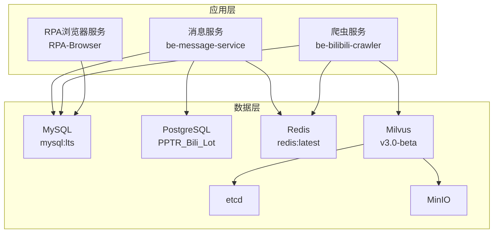
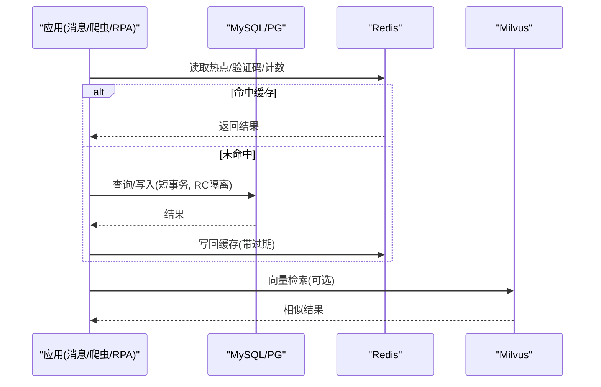
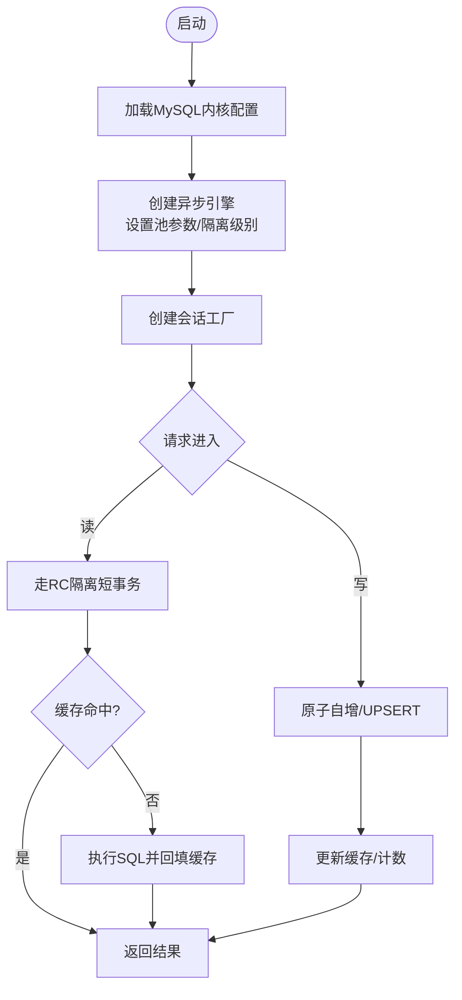
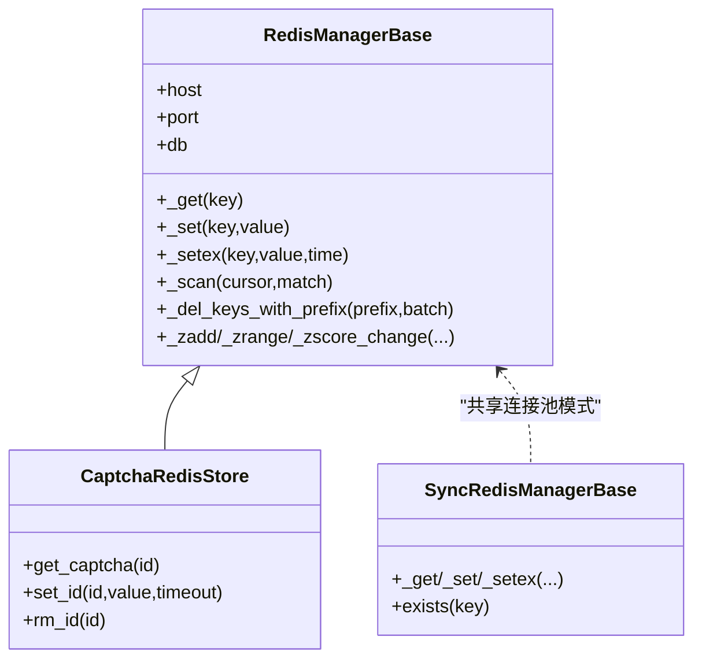
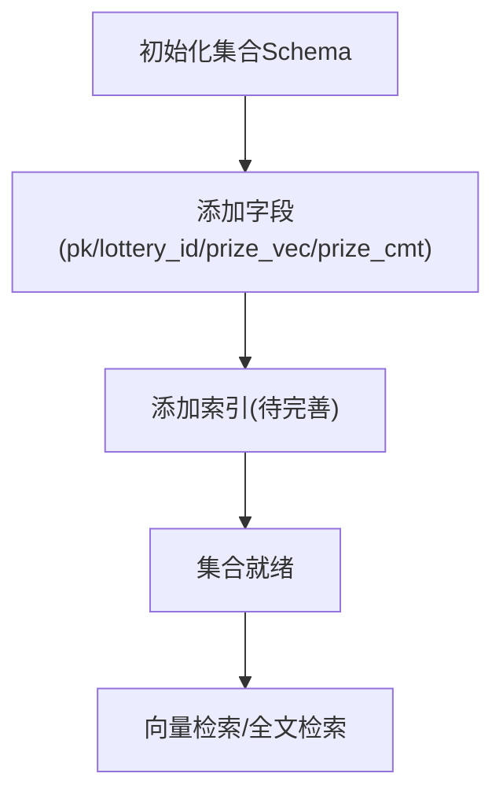
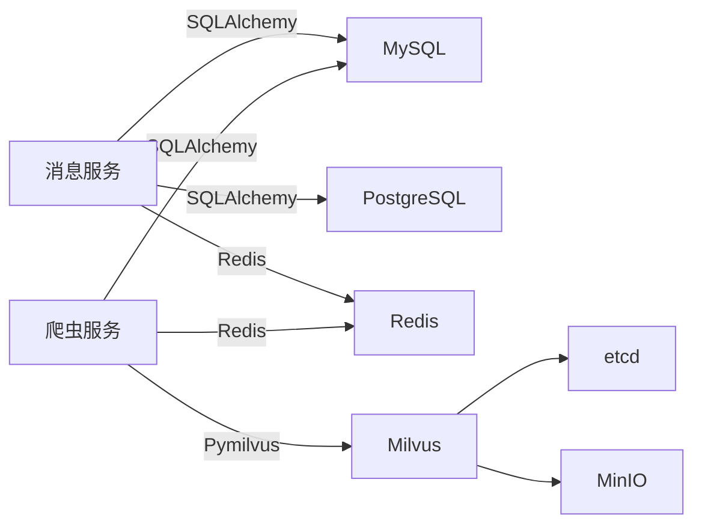

# 数据库优化

<cite>
**本文引用的文件**
- [docker-compose.yml](file://docker-compose.yml)
- [dc-dev.yml](file://dc-dev.yml)
- [custom_mysql.cnf](file://docker_vol/mysql_data/conf.d/custom_mysql.cnf)
- [config.py](file://be-message-service/app/core/config.py)
- [database.py](file://be-message-service/app/core/database.py)
- [RedisManager.py](file://be-bilibili-crawler/Utils/redisTool/RedisManager.py)
- [captcha_redis_store.py](file://be-bilibili-crawler/Service/CaptchaGen/captcha_redis_store.py)
- [SqlalchemyTool.py](file://be-bilibili-crawler/Utils/数据库/SqlalchemyTool.py)
- [session_manager.py](file://RPA-Browser/app/utils/depends/session_manager.py)
- [create_collection.py](file://be-bilibili-crawler/scripts/database/同步向量数据库/create_collection.py)
</cite>

## 目录
1. [简介](#简介)
2. [项目结构](#项目结构)
3. [核心组件](#核心组件)
4. [架构总览](#架构总览)
5. [详细组件分析](#详细组件分析)
6. [依赖关系分析](#依赖关系分析)
7. [性能考量](#性能考量)
8. [故障排查指南](#故障排查指南)
9. [结论](#结论)
10. [附录](#附录)

## 简介
本指南面向本项目中的 MySQL、PostgreSQL、Redis 与 Milvus 四类数据服务，结合仓库中实际配置与代码实现，给出连接池参数优化、查询性能调优、索引策略设计、缓存策略配置、分库分表方案、读写分离建议、备份恢复策略、慢查询分析、监控指标设置与瓶颈识别方法。同时针对高并发场景下的锁竞争、连接耗尽与内存溢出问题提供可落地的解决方案。

## 项目结构
- 容器编排：通过 docker-compose.yml 与 dc-dev.yml 统一编排 MySQL、Redis、Milvus（含 etcd/minio）等基础设施。
- MySQL：使用自定义配置文件 custom_mysql.cnf 进行内核级参数调优；应用侧通过 SQLAlchemy 异步引擎管理连接池与会话。
- PostgreSQL：由 be-message-service 接管 be-gateway 的 Postgres 库，独立引擎与会话工厂。
- Redis：统一的 RedisManagerBase 封装连接池、重试、批量操作、扫描与删除等能力，供验证码、代理池等模块使用。
- Milvus：standalone 模式运行，集合与字段定义在脚本中创建，用于向量检索。

图表来源
- [docker-compose.yml:43-92](file://docker-compose.yml#L43-L92)
- [dc-dev.yml:40-76](file://dc-dev.yml#L40-L76)

章节来源
- [docker-compose.yml:43-92](file://docker-compose.yml#L43-L92)
- [dc-dev.yml:40-76](file://dc-dev.yml#L40-L76)

## 核心组件
- MySQL 配置与连接池
  - 内核参数：关闭不必要日志、限制连接数、调整 InnoDB 缓冲与 IO 线程、降低 per-connection 缓冲区尺寸防止 OOM。
  - 应用连接池：pool_size、max_overflow、pool_recycle、pool_pre_ping、隔离级别 READ COMMITTED。
- PostgreSQL 连接池
  - 独立引擎与会话工厂，只读/读写池大小与回收策略按负载设定。
- Redis 客户端
  - 连接池、超时、重试、批量管道、SCAN 迭代、UNLINK 批量删除、分布式锁。
- Milvus 集合与索引
  - 集合 schema 定义、主键与向量字段、全文分析器、索引参数占位待完善。

章节来源
- [custom_mysql.cnf:1-67](file://docker_vol/mysql_data/conf.d/custom_mysql.cnf#L1-L67)
- [config.py:41-74](file://be-message-service/app/core/config.py#L41-L74)
- [database.py:28-46](file://be-message-service/app/core/database.py#L28-L46)
- [RedisManager.py:187-209](file://be-bilibili-crawler/Utils/redisTool/RedisManager.py#L187-L209)
- [create_collection.py:8-63](file://be-bilibili-crawler/scripts/database/同步向量数据库/create_collection.py#L8-L63)

## 架构总览
下图展示请求从应用到数据层的调用路径，以及关键的性能控制点（连接池、重试、隔离级别、索引）。

图表来源
- [database.py:28-46](file://be-message-service/app/core/database.py#L28-L46)
- [RedisManager.py:212-258](file://be-bilibili-crawler/Utils/redisTool/RedisManager.py#L212-L258)
- [create_collection.py:8-63](file://be-bilibili-crawler/scripts/database/同步向量数据库/create_collection.py#L8-L63)

## 详细组件分析

### MySQL 性能优化与连接池
- 内核参数要点
  - 关闭 binlog/通用日志/慢查询日志以减少 I/O 与内存占用。
  - 限制最大连接数与线程缓存，避免过多线程切换导致 CPU 抖动。
  - 合理设置 wait_timeout/net_*_timeout/connect_timeout，配合应用 pool_recycle 避免陈旧连接。
  - 将 per-connection 缓冲区（join/sort/read/bulk_insert 等）控制在 128K~4M，防止 OOM。
  - InnoDB 缓冲池、redo log、IO 线程与锁等待超时按 8G 服务器黄金配置调优。
  - 关闭 performance_schema，降低 table_open_cache/table_definition_cache。
- 应用连接池与隔离级别
  - pool_pre_ping 避免拿到被服务端断开的连接。
  - pool_recycle < wait_timeout，确保连接生命周期安全。
  - 隔离级别设置为 READ COMMITTED，减少 gap lock 引发的插入死锁风险。
  - 会话自动回滚与异常处理，保障资源释放。

图表来源
- [custom_mysql.cnf:1-67](file://docker_vol/mysql_data/conf.d/custom_mysql.cnf#L1-L67)
- [database.py:28-46](file://be-message-service/app/core/database.py#L28-L46)

章节来源
- [custom_mysql.cnf:1-67](file://docker_vol/mysql_data/conf.d/custom_mysql.cnf#L1-L67)
- [database.py:28-46](file://be-message-service/app/core/database.py#L28-L46)

### PostgreSQL 连接池与迁移
- 独立引擎与会话工厂，支持只读/读写不同池大小。
- 通过 Alembic 分支管理迁移，保证版本演进可控。
- 连接池参数与 MySQL 类似：pool_pre_ping、pool_recycle、pool_timeout。

章节来源
- [config.py:60-74](file://be-message-service/app/core/config.py#L60-L74)
- [database.py:86-102](file://be-message-service/app/core/database.py#L86-L102)

### Redis 缓存与连接池
- 连接池与超时
  - 使用 ConnectionPool.from_url 构建连接池，设置 socket_timeout、health_check_interval、retry_on_timeout。
  - 全局信号量限流，避免突发流量打满连接。
- 重试与容错
  - 装饰器对连接错误、BusyLoadingError 等进行指数退避或固定间隔重试。
- 批量与扫描
  - 使用 pipeline 批量 MGET/MSET/HSET/HGETALL。
  - SCAN 迭代前缀 key，UNLINK 批量删除，避免阻塞。
- 分布式锁
  - 基于 redis.lock 实现简单互斥，保护临界区写入。
- 验证码存储
  - 以 setex 设置过期时间，get/del 完成生命周期管理。

图表来源
- [RedisManager.py:187-209](file://be-bilibili-crawler/Utils/redisTool/RedisManager.py#L187-L209)
- [RedisManager.py:212-258](file://be-bilibili-crawler/Utils/redisTool/RedisManager.py#L212-L258)
- [captcha_redis_store.py:4-23](file://be-bilibili-crawler/Service/CaptchaGen/captcha_redis_store.py#L4-L23)

章节来源
- [RedisManager.py:187-209](file://be-bilibili-crawler/Utils/redisTool/RedisManager.py#L187-L209)
- [RedisManager.py:212-258](file://be-bilibili-crawler/Utils/redisTool/RedisManager.py#L212-L258)
- [captcha_redis_store.py:4-23](file://be-bilibili-crawler/Service/CaptchaGen/captcha_redis_store.py#L4-L23)

### Milvus 向量检索与索引
- 集合 Schema
  - 主键 pk、业务字段 lottery_id、向量字段 prize_vec（dim=768）、文本字段 prize_cmt（启用中文分析器）。
- 索引参数
  - 当前脚本为占位添加索引，需根据实际检索需求选择合适索引类型（如 IVF_FLAT/IVF_SQ8/HNSW 等）与参数。
- 部署与环境
  - standalone 模式，依赖 etcd 与 MinIO，健康检查端口 9091。

图表来源
- [create_collection.py:8-63](file://be-bilibili-crawler/scripts/database/同步向量数据库/create_collection.py#L8-L63)
- [docker-compose.yml:43-67](file://docker-compose.yml#L43-L67)

章节来源
- [create_collection.py:8-63](file://be-bilibili-crawler/scripts/database/同步向量数据库/create_collection.py#L8-L63)
- [docker-compose.yml:43-67](file://docker-compose.yml#L43-L67)

### 分库分表与读写分离
- 私信内容按月分库、库内分表（100 张），路由键 msgkey 取余定位目标表。
- 主库承载元数据（通知、会话、设置等），内容库仅承载大对象，降低单库压力。
- 读写分离建议
  - 读多写少场景：引入只读副本，应用层按路由规则分流。
  - 跨库访问使用全限定名，避免额外连接池开销。

章节来源
- [config.py:41-58](file://be-message-service/app/core/config.py#L41-L58)
- [database.py:1-12](file://be-message-service/app/core/database.py#L1-L12)

### 备份恢复策略
- MySQL
  - 生产环境建议开启 binlog 与定期逻辑备份（mysqldump/xtrabackup），保留至少 7 天。
  - 利用 innodb_redo_log_capacity 与 flush 策略平衡性能与持久化。
- PostgreSQL
  - 使用 pg_basebackup + WAL 归档，或云厂商托管备份。
- Redis
  - AOF 与 RDB 组合，注意快照频率与重写阈值，避免高峰触发。
- Milvus
  - 依赖 MinIO 对象存储，定期备份 collection 元数据与数据段。

[本节为通用指导，不直接分析具体文件]

## 依赖关系分析
- 应用与数据库
  - be-message-service 通过 SQLAlchemy 异步引擎连接 MySQL 与 PostgreSQL，会话工厂统一管理。
  - 爬虫服务通过 SqlalchemyTool 复用 Engine 与会话，避免重复建池导致连接耗尽。
  - 验证码与代理池等模块通过 RedisManagerBase 访问 Redis。
- 外部依赖
  - Milvus 依赖 etcd 与 MinIO，健康检查与端口映射在 compose 中声明。

图表来源
- [database.py:28-46](file://be-message-service/app/core/database.py#L28-L46)
- [SqlalchemyTool.py:11-47](file://be-bilibili-crawler/Utils/数据库/SqlalchemyTool.py#L11-L47)
- [RedisManager.py:187-209](file://be-bilibili-crawler/Utils/redisTool/RedisManager.py#L187-L209)
- [docker-compose.yml:43-92](file://docker-compose.yml#L43-L92)

章节来源
- [database.py:28-46](file://be-message-service/app/core/database.py#L28-L46)
- [SqlalchemyTool.py:11-47](file://be-bilibili-crawler/Utils/数据库/SqlalchemyTool.py#L11-L47)
- [RedisManager.py:187-209](file://be-bilibili-crawler/Utils/redisTool/RedisManager.py#L187-L209)
- [docker-compose.yml:43-92](file://docker-compose.yml#L43-L92)

## 性能考量
- 连接池参数优化
  - MySQL：pool_size=10、max_overflow=15、pool_recycle=300、pool_pre_ping=True、isolation_level="READ COMMITTED"。
  - PostgreSQL：pool_size=10、max_overflow=20、pool_recycle=300。
  - Redis：ConnectionPool 设置 socket_timeout、health_check_interval、retry_on_timeout，全局信号量限流。
- 查询性能调优
  - 使用短事务与原子自增，减少长事务导致的锁竞争。
  - 合理索引：主键、外键、高频过滤列、排序列；避免过度索引影响写性能。
  - 分页与投影：仅拉取必要字段，使用覆盖索引减少回表。
- 索引策略设计
  - MySQL：复合索引遵循最左前缀原则；区分度高的列优先。
  - PostgreSQL：B-tree/GiST/GIN 按需选择；关注统计信息更新。
  - Milvus：根据向量维度与查询延迟要求选择索引类型与参数。
- 缓存策略配置
  - 热点数据缓存（验证码、计数、字典），设置合理 TTL。
  - 缓存穿透/击穿/雪崩防护：空值缓存、随机过期、限流降级。
- 分库分表方案
  - 按月分库+库内分表，路由键稳定且均匀分布。
- 读写分离配置
  - 读多写少场景引入只读副本，应用层按路由规则分流。
- 慢查询分析与监控
  - MySQL：开启慢查询日志（生产建议开启），分析 top SQL；监控连接数、缓冲池命中率、锁等待。
  - PostgreSQL：pg_stat_statements 扩展，监控慢查询与热点语句。
  - Redis：监控内存使用、命令耗时、连接数、持久化状态。
  - Milvus：监控查询延迟、内存与磁盘使用、索引构建进度。
- 高并发问题
  - 锁竞争：RC 隔离减少 gap lock；拆分热点行；使用队列削峰。
  - 连接耗尽：限制 pool_size/max_overflow；进程内 Engine 复用；连接泄漏检测。
  - 内存溢出：降低 per-connection 缓冲区；分批处理；避免一次性加载大量数据。

章节来源
- [config.py:41-74](file://be-message-service/app/core/config.py#L41-L74)
- [database.py:28-46](file://be-message-service/app/core/database.py#L28-L46)
- [RedisManager.py:187-209](file://be-bilibili-crawler/Utils/redisTool/RedisManager.py#L187-L209)
- [custom_mysql.cnf:1-67](file://docker_vol/mysql_data/conf.d/custom_mysql.cnf#L1-L67)

## 故障排查指南
- 连接丢失与断开
  - 现象：Lost connection / MySQL server has gone away。
  - 处理：捕获异常后关闭 session，必要时重建连接；启用 pool_pre_ping 与 pool_recycle。
- 连接耗尽
  - 现象：Too many connections / 连接池耗尽。
  - 处理：检查 pool_size/max_overflow；确认 Engine 复用；排查连接泄漏。
- 缓存异常
  - 现象：Redis 连接错误或 BusyLoading。
  - 处理：重试机制生效；检查连接池与网络；避免大 key 与热 key 集中。
- 向量检索失败
  - 现象：集合不存在或索引未构建。
  - 处理：确认集合创建与索引参数；检查 etcd/MinIO 连通性。

章节来源
- [session_manager.py:83-113](file://RPA-Browser/app/utils/depends/session_manager.py#L83-L113)
- [RedisManager.py:62-78](file://be-bilibili-crawler/Utils/redisTool/RedisManager.py#L62-L78)
- [docker-compose.yml:43-67](file://docker-compose.yml#L43-L67)

## 结论
本项目在 MySQL、PostgreSQL、Redis、Milvus 上形成了较为完善的连接池、缓存与向量检索体系。通过内核参数调优、连接池精细化配置、合理的索引与缓存策略、分库分表与读写分离，能够有效提升吞吐与稳定性。建议在生产环境开启必要的监控与备份，持续跟踪慢查询与资源使用，逐步优化索引与查询，确保在高并发场景下的稳健运行。

## 附录
- 常用命令与工具
  - MySQL：SHOW STATUS/SHOW ENGINE INNODB STATUS；慢查询日志分析。
  - PostgreSQL：pg_stat_statements；EXPLAIN ANALYZE。
  - Redis：INFO、SLOWLOG、MEMORY USAGE。
  - Milvus：集合描述、索引状态、查询延迟监控。
- 环境变量与配置
  - 数据库连接串、池大小、超时、日志级别等通过环境变量注入，便于多环境管理。

[本节为通用指导，不直接分析具体文件]