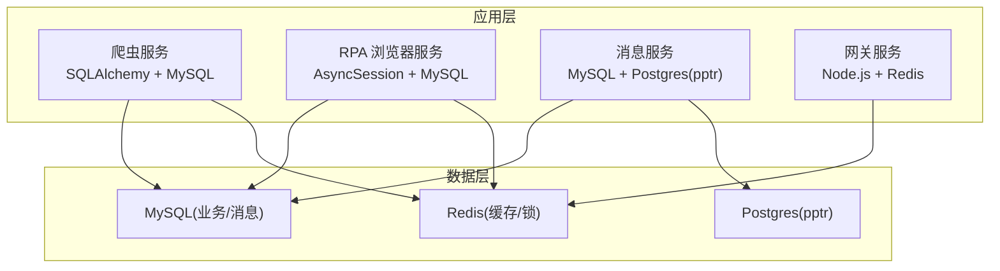
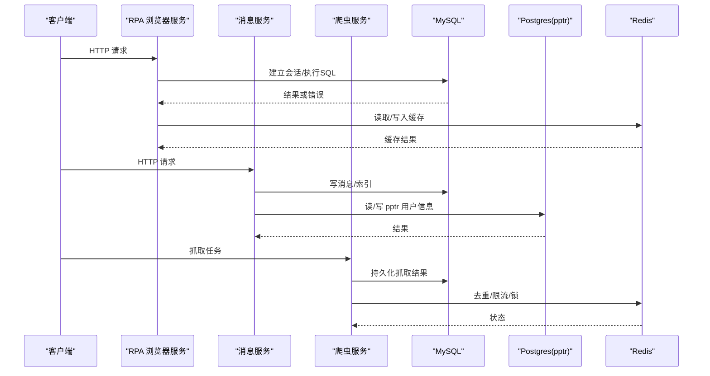
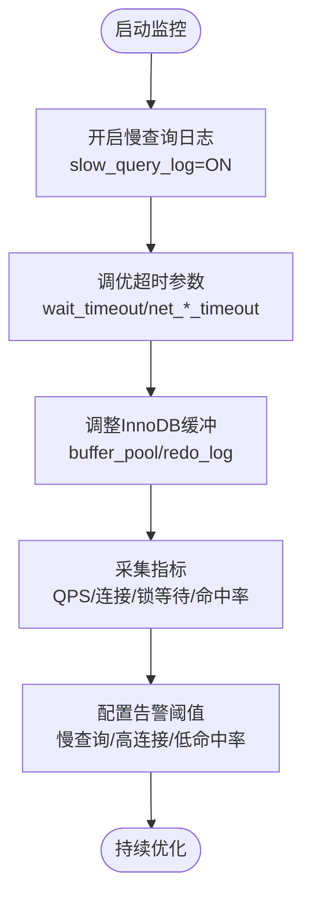
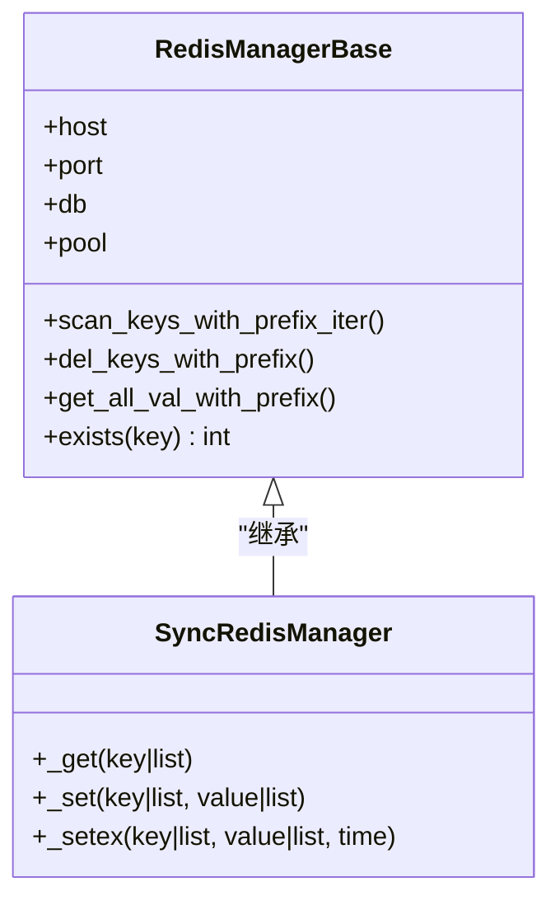
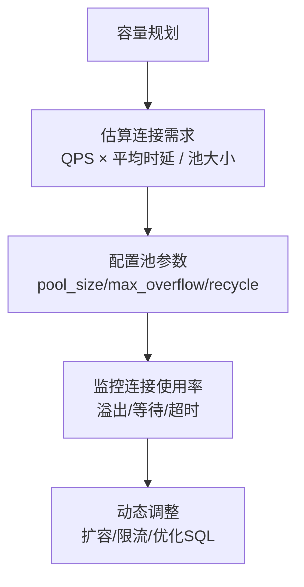
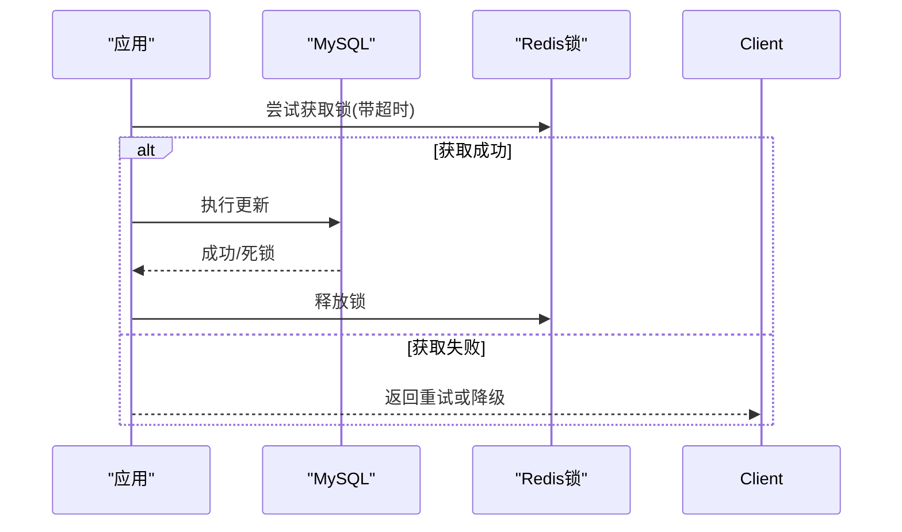
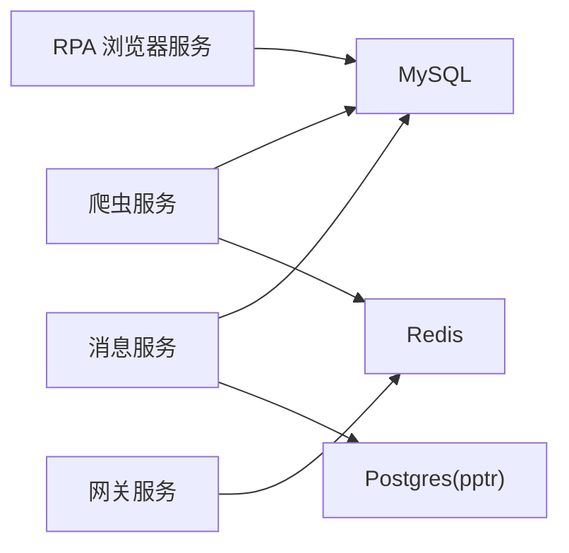
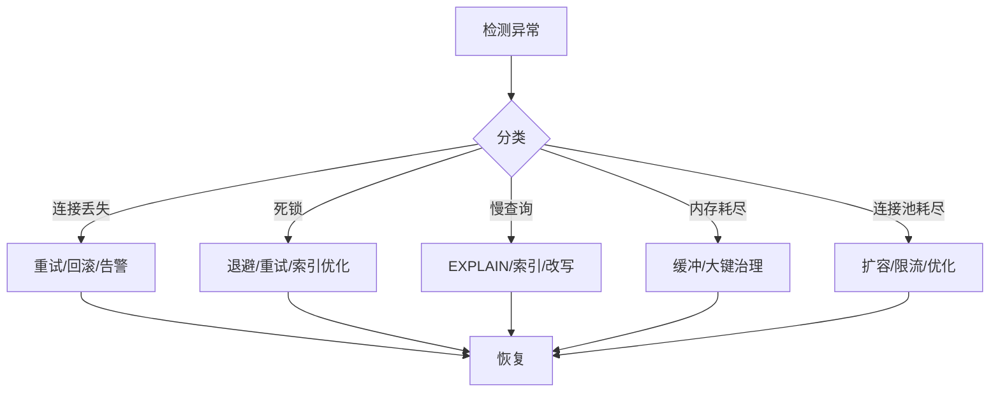

# 数据库监控与诊断

<cite>
**本文引用的文件**
- [custom_mysql.cnf](file://docker_vol/mysql_data/conf.d/custom_mysql.cnf)
- [CONFIG.py](file://be-bilibili-crawler/CONFIG.py)
- [session_manager.py](file://RPA-Browser/app/utils/depends/session_manager.py)
- [config.py](file://be-message-service/app/core/config.py)
- [database.py](file://be-message-service/app/core/database.py)
- [RedisManager.py](file://be-bilibili-crawler/Utils/redisTool/RedisManager.py)
- [RedisManager.js](file://be-gateway/ExpressServerEnd/DAO/Redis/RedisManager.js)
- [Common.py](file://be-bilibili-crawler/Utils/通用/Common.py)
- [handlers.py](file://RPA-Browser/app/exceptions/handlers.py)
</cite>

## 目录
1. [简介](#简介)
2. [项目结构](#项目结构)
3. [核心组件](#核心组件)
4. [架构总览](#架构总览)
5. [详细组件分析](#详细组件分析)
6. [依赖关系分析](#依赖关系分析)
7. [性能考量](#性能考量)
8. [故障排查指南](#故障排查指南)
9. [结论](#结论)
10. [附录](#附录)

## 简介
本指南面向生产环境的数据库监控与诊断，覆盖慢查询分析、性能指标监控、连接池监控、锁等待检测与瓶颈识别，并提供 APM 集成建议、告警规则配置与容量规划方法。结合仓库中 MySQL、PostgreSQL（pptr）与 Redis 的实际实现，给出可落地的排障步骤与优化建议。

## 项目结构
本项目包含多个服务与中间件：
- be-bilibili-crawler：爬虫后端，使用 SQLAlchemy 连接 MySQL，并封装 Redis 客户端用于缓存与分布式锁。
- RPA-Browser：浏览器自动化服务，使用异步 SQLAlchemy 会话管理，具备连接丢失重试与异常处理。
- be-message-service：消息服务，统一走 MySQL（主库 + 私信内容分库分表），并直连 be-gateway 的 Postgres（PPTR_Bili_Lot）。
- be-gateway：网关服务，提供 Node.js 侧 Redis 客户端。
- docker-compose 中的 MySQL 容器通过自定义配置文件调整运行时参数。

图表来源
- [CONFIG.py:381-415](file://be-bilibili-crawler/CONFIG.py#L381-L415)
- [session_manager.py:21-37](file://RPA-Browser/app/utils/depends/session_manager.py#L21-L37)
- [database.py:28-46](file://be-message-service/app/core/database.py#L28-L46)
- [RedisManager.py:120-208](file://be-bilibili-crawler/Utils/redisTool/RedisManager.py#L120-L208)
- [RedisManager.js:1-21](file://be-gateway/ExpressServerEnd/DAO/Redis/RedisManager.js#L1-L21)

章节来源
- [CONFIG.py:381-415](file://be-bilibili-crawler/CONFIG.py#L381-L415)
- [session_manager.py:21-37](file://RPA-Browser/app/utils/depends/session_manager.py#L21-L37)
- [database.py:28-46](file://be-message-service/app/core/database.py#L28-L46)
- [RedisManager.py:120-208](file://be-bilibili-crawler/Utils/redisTool/RedisManager.py#L120-L208)
- [RedisManager.js:1-21](file://be-gateway/ExpressServerEnd/DAO/Redis/RedisManager.js#L1-L21)

## 核心组件
- MySQL 引擎与会话：各服务通过 SQLAlchemy 创建异步引擎，设置连接池大小、溢出、预检查与回收周期，确保在高并发下稳定获取可用连接。
- PostgreSQL（pptr）：消息服务直连 be-gateway 的 Postgres，独立引擎与会话，便于读写接管与版本迁移。
- Redis 客户端：爬虫与服务均使用连接池与超时、健康检查等参数；提供批量操作、SCAN 迭代与分布式锁能力。
- 异常与重试：针对连接丢失、死锁、操作错误进行重试与降级，避免级联失败。

章节来源
- [CONFIG.py:381-415](file://be-bilibili-crawler/CONFIG.py#L381-L415)
- [database.py:28-46](file://be-message-service/app/core/database.py#L28-L46)
- [RedisManager.py:120-208](file://be-bilibili-crawler/Utils/redisTool/RedisManager.py#L120-L208)
- [Common.py:256-346](file://be-bilibili-crawler/Utils/通用/Common.py#L256-L346)
- [handlers.py:150-182](file://RPA-Browser/app/exceptions/handlers.py#L150-L182)

## 架构总览
下图展示请求从应用层到数据层的调用链，以及关键监控点（连接池、慢查询、锁等待、内存使用）。

图表来源
- [session_manager.py:21-37](file://RPA-Browser/app/utils/depends/session_manager.py#L21-L37)
- [database.py:28-46](file://be-message-service/app/core/database.py#L28-L46)
- [RedisManager.py:120-208](file://be-bilibili-crawler/Utils/redisTool/RedisManager.py#L120-L208)

## 详细组件分析

### MySQL 慢查询分析与性能指标监控
- 慢查询日志开关：当前配置关闭了慢查询日志，需在生产环境开启以捕获慢 SQL。
- 连接与超时：wait_timeout、net_read/write_timeout 等影响长事务与大数据传输。
- InnoDB 缓冲与日志：innodb_buffer_pool_size、redo log 容量与 flush 策略直接影响吞吐与一致性。
- 缓冲区尺寸：join/sort/read 等每连接分配参数需控制上限，防止 OOM。
- 监控建议：启用 performance_schema 或在外部采集器（如 Prometheus + mysqld_exporter）收集 QPS、连接数、缓冲命中率、锁等待时间、复制延迟等。

图表来源
- [custom_mysql.cnf:1-67](file://docker_vol/mysql_data/conf.d/custom_mysql.cnf#L1-L67)

章节来源
- [custom_mysql.cnf:1-67](file://docker_vol/mysql_data/conf.d/custom_mysql.cnf#L1-L67)

### PostgreSQL 查询计划查看与优化
- 消息服务直连 be-gateway 的 Postgres（PPTR_Bili_Lot），使用独立引擎与会话。
- 建议通过 EXPLAIN/EXPLAIN ANALYZE 查看查询计划，关注全表扫描、索引缺失、排序与哈希冲突。
- 对热点查询建立合适索引，避免过度索引导致写放大。
- 监控连接池大小与溢出，防止连接耗尽。

章节来源
- [database.py:86-95](file://be-message-service/app/core/database.py#L86-L95)
- [config.py:65-74](file://be-message-service/app/core/config.py#L65-L74)

### Redis 内存使用情况监控
- 连接池与健康检查：设置 socket_timeout、health_check_interval、retry_on_timeout，降低网络抖动影响。
- 批量与迭代：使用 SCAN 迭代键、Pipeline 批量操作，避免一次性加载大集合导致内存峰值。
- 分布式锁：基于 key 的锁与超时，避免长时间持有导致阻塞。
- 监控建议：定期采样 memory info、keyspace、慢命令、阻塞客户端数量；对大键与热键进行治理。

图表来源
- [RedisManager.py:187-319](file://be-bilibili-crawler/Utils/redisTool/RedisManager.py#L187-L319)

章节来源
- [RedisManager.py:120-208](file://be-bilibili-crawler/Utils/redisTool/RedisManager.py#L120-L208)
- [RedisManager.py:187-319](file://be-bilibili-crawler/Utils/redisTool/RedisManager.py#L187-L319)

### 数据库连接池监控与容量规划
- 爬虫服务：为业务与爬虫分别配置独立连接池，隔离高并发爬虫对业务的影响；启用 pool_pre_ping 与 pool_recycle 避免陈旧连接。
- 消息服务：MySQL 与 Postgres 各自独立引擎与会话，限制最大连接数，防止打满数据库连接。
- 网关服务：Node.js Redis 客户端配置最小化重试次数，避免雪崩。
- 容量规划：根据业务 QPS 与平均响应时延估算连接需求；预留安全余量；监控连接池使用率与溢出触发频率。

图表来源
- [CONFIG.py:381-415](file://be-bilibili-crawler/CONFIG.py#L381-L415)
- [database.py:28-46](file://be-message-service/app/core/database.py#L28-L46)
- [RedisManager.js:1-21](file://be-gateway/ExpressServerEnd/DAO/Redis/RedisManager.js#L1-L21)

章节来源
- [CONFIG.py:381-415](file://be-bilibili-crawler/CONFIG.py#L381-L415)
- [database.py:28-46](file://be-message-service/app/core/database.py#L28-L46)
- [RedisManager.js:1-21](file://be-gateway/ExpressServerEnd/DAO/Redis/RedisManager.js#L1-L21)

### 锁等待检测与死锁处理
- MySQL 隔离级别：消息服务采用 READ COMMITTED，降低插入死锁概率。
- 重试与退避：对 OperationalError、Deadlock 等错误进行重试与短暂休眠，避免级联失败。
- 分布式锁：Redis 锁设置超时，避免长时间占用；批量操作使用 Pipeline 减少竞争。
- 监控建议：关注锁等待时间、死锁次数、长事务数量；对热点行/表加索引以减少锁范围。

图表来源
- [database.py:40-46](file://be-message-service/app/core/database.py#L40-L46)
- [Common.py:256-346](file://be-bilibili-crawler/Utils/通用/Common.py#L256-L346)
- [RedisManager.py:120-208](file://be-bilibili-crawler/Utils/redisTool/RedisManager.py#L120-L208)

章节来源
- [database.py:40-46](file://be-message-service/app/core/database.py#L40-L46)
- [Common.py:256-346](file://be-bilibili-crawler/Utils/通用/Common.py#L256-L346)
- [RedisManager.py:120-208](file://be-bilibili-crawler/Utils/redisTool/RedisManager.py#L120-L208)

### 性能瓶颈识别与优化路径
- SQL 层面：开启慢查询日志，定位慢 SQL；添加合适索引；避免 SELECT *；拆分大事务。
- 连接池层面：监控连接使用率与溢出；合理设置 pool_size、max_overflow、recycle。
- 缓存层面：命中率为核心指标；对热点键做本地缓存或分片；避免大值与广播失效。
- 资源层面：监控 CPU、内存、磁盘 I/O；调整 InnoDB 缓冲与日志策略；控制每连接缓冲区尺寸。

章节来源
- [custom_mysql.cnf:1-67](file://docker_vol/mysql_data/conf.d/custom_mysql.cnf#L1-L67)
- [CONFIG.py:381-415](file://be-bilibili-crawler/CONFIG.py#L381-L415)
- [RedisManager.py:120-208](file://be-bilibili-crawler/Utils/redisTool/RedisManager.py#L120-L208)

## 依赖关系分析
- 爬虫服务依赖 MySQL 引擎与会话，并通过 Redis 进行缓存与锁；连接池配置与回收策略保障稳定性。
- 消息服务同时依赖 MySQL 与 Postgres（pptr），各自独立引擎与会话，避免相互影响。
- 网关服务通过 Node.js Redis 客户端访问缓存，配置最小化重试以避免雪崩。

图表来源
- [CONFIG.py:381-415](file://be-bilibili-crawler/CONFIG.py#L381-L415)
- [database.py:28-46](file://be-message-service/app/core/database.py#L28-L46)
- [RedisManager.js:1-21](file://be-gateway/ExpressServerEnd/DAO/Redis/RedisManager.js#L1-L21)

章节来源
- [CONFIG.py:381-415](file://be-bilibili-crawler/CONFIG.py#L381-L415)
- [database.py:28-46](file://be-message-service/app/core/database.py#L28-L46)
- [RedisManager.js:1-21](file://be-gateway/ExpressServerEnd/DAO/Redis/RedisManager.js#L1-L21)

## 性能考量
- 连接池：启用 pool_pre_ping 与 pool_recycle，避免陈旧连接与空闲断开导致的错误。
- 隔离级别：消息服务采用 READ COMMITTED，降低插入死锁概率，适合短事务 OLTP。
- 缓存：使用 SCAN 与 Pipeline 进行批量操作，避免内存峰值；设置合理的超时与健康检查。
- 资源：控制每连接缓冲区尺寸，防止 OOM；调整 InnoDB 缓冲与日志策略以提升吞吐。

章节来源
- [session_manager.py:21-37](file://RPA-Browser/app/utils/depends/session_manager.py#L21-L37)
- [database.py:40-46](file://be-message-service/app/core/database.py#L40-L46)
- [RedisManager.py:120-208](file://be-bilibili-crawler/Utils/redisTool/RedisManager.py#L120-L208)
- [custom_mysql.cnf:31-67](file://docker_vol/mysql_data/conf.d/custom_mysql.cnf#L31-L67)

## 故障排查指南
- 连接丢失：捕获“Lost connection”或“MySQL server has gone away”，记录错误 ID 并提示客户端重试；在会话层进行重试与回滚。
- 死锁与操作错误：对 Deadlock/OperationalError 进行重试与短暂休眠；记录堆栈与上下文，便于定位热点与索引问题。
- 慢查询：开启慢查询日志，结合 EXPLAIN 分析；对高频慢 SQL 进行索引优化或改写。
- 内存耗尽：检查每连接缓冲区尺寸与 InnoDB 缓冲；对大键与广播失效进行治理。
- 连接池耗尽：监控连接使用率与溢出；调整 pool_size、max_overflow；对上游进行限流或降级。

图表来源
- [handlers.py:150-182](file://RPA-Browser/app/exceptions/handlers.py#L150-L182)
- [Common.py:256-346](file://be-bilibili-crawler/Utils/通用/Common.py#L256-L346)
- [custom_mysql.cnf:1-67](file://docker_vol/mysql_data/conf.d/custom_mysql.cnf#L1-L67)

章节来源
- [handlers.py:150-182](file://RPA-Browser/app/exceptions/handlers.py#L150-L182)
- [Common.py:256-346](file://be-bilibili-crawler/Utils/通用/Common.py#L256-L346)
- [custom_mysql.cnf:1-67](file://docker_vol/mysql_data/conf.d/custom_mysql.cnf#L1-L67)

## 结论
通过开启慢查询日志、合理配置连接池与隔离级别、使用 Redis 缓存与分布式锁、实施异常重试与降级策略，可有效提升数据库系统的稳定性与性能。结合监控与告警，持续优化 SQL、索引与资源使用，是保障系统长期健康的关键。

## 附录
- APM 集成建议：接入 APM 工具（如 SkyWalking、OpenTelemetry）采集 SQL 耗时、连接池指标与 Redis 命令耗时；与日志系统联动，快速定位问题。
- 告警规则配置：慢查询阈值、连接数接近上限、Redis 内存使用率、锁等待时间、死锁次数等；设置分级告警与自动恢复策略。
- 容量规划建议：基于 QPS 与时延估算连接需求；预留安全余量；定期压测与容量评估；对热点数据进行分片与缓存治理。