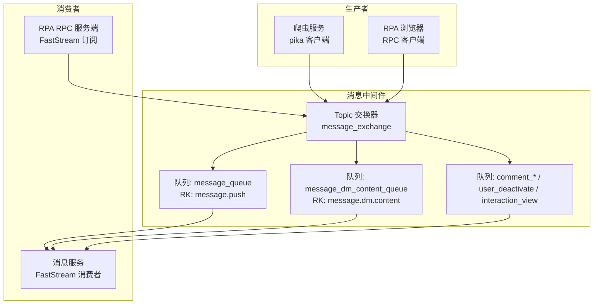
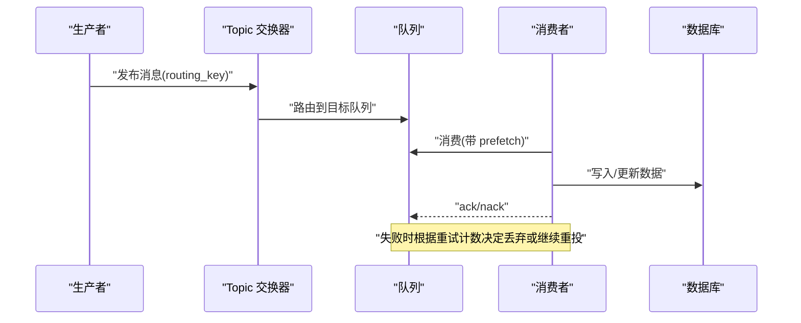
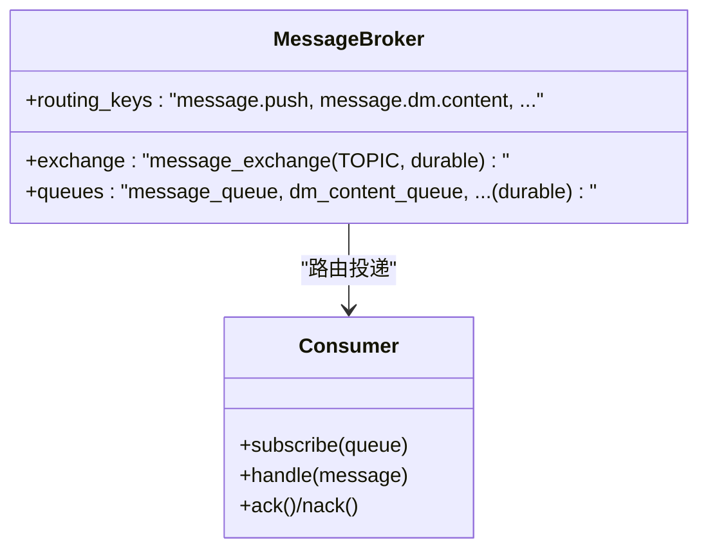
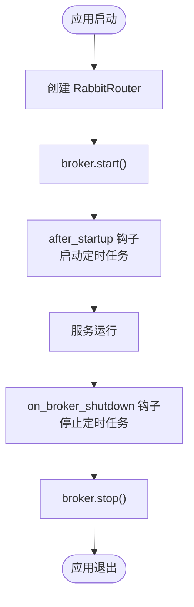
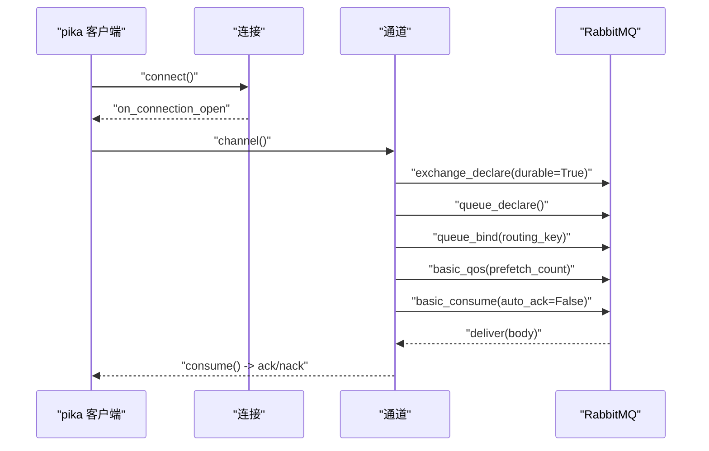
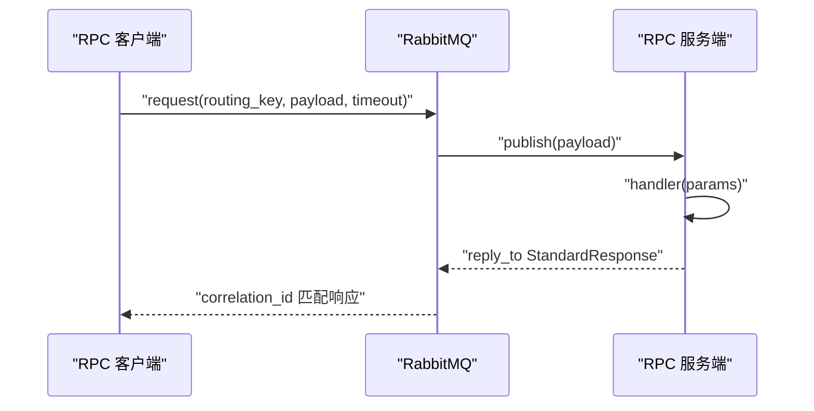
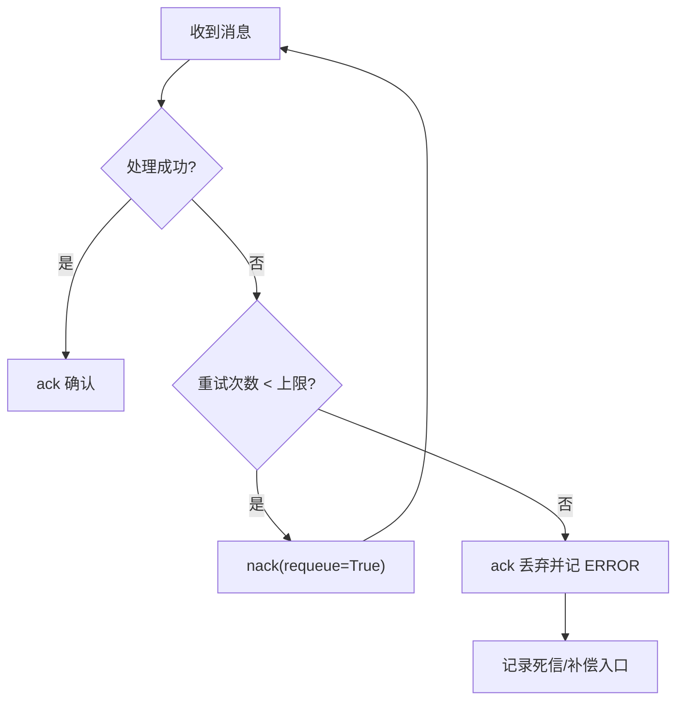
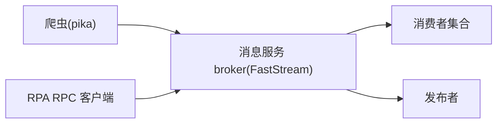

# 消息队列优化

<cite>
**本文引用的文件**
- [BasicAsyncClient.py](file://be-bilibili-crawler/Service/MQ/base/BasicAsyncClient.py)
- [BaseMQModel.py](file://be-bilibili-crawler/Models/MQ/BaseMQModel.py)
- [broker.py](file://be-message-service/app/core/broker.py)
- [router.py](file://be-message-service/app/mq/router.py)
- [rpc_client.py](file://RPA-Browser/app/services/mq/rpc_client.py)
- [rpc_server.py](file://RPA-Browser/app/services/mq/rpc_server.py)
- [config.py](file://RPA-Browser/app/config.py)
- [retry.py](file://be-message-service/app/consumers/retry.py)
- [test_phase_c_scheduler.py](file://be-message-service/tests/test_phase_c_scheduler.py)
</cite>

## 目录
1. [简介](#简介)
2. [项目结构](#项目结构)
3. [核心组件](#核心组件)
4. [架构总览](#架构总览)
5. [详细组件分析](#详细组件分析)
6. [依赖关系分析](#依赖关系分析)
7. [性能考量](#性能考量)
8. [故障排查指南](#故障排查指南)
9. [结论](#结论)
10. [附录](#附录)

## 简介
本指南面向 RabbitMQ 在生产环境中的性能优化，覆盖队列与交换器配置、消费者吞吐调优、生产者效率提升、消息持久化策略、分区与复制、集群部署要点、积压处理、死信队列与优先级管理、监控指标、压测工具与常见故障定位。内容基于仓库中 be-bilibili-crawler、be-message-service、RPA-Browser 等模块的实际实现进行提炼与总结，帮助读者在现有架构基础上实现稳定、高吞吐、低延迟的消息系统。

## 项目结构
仓库中与消息队列相关的关键位置：
- be-bilibili-crawler：提供基于 pika 的异步消费者与同步发送器封装，包含连接、通道、交换器、队列声明、QoS、重试与日志告警。
- be-message-service：基于 FastStream 的 RabbitMQ 路由与消费者注册，集中定义 exchange、routing_key、队列及生命周期钩子；提供重试计数公共工具与测试用例。
- RPA-Browser：通过 RabbitMQ RPC 调用后端服务（FastStream），并配置心跳参数以适配长耗时处理。

图表来源
- [broker.py:34-103](file://be-message-service/app/core/broker.py#L34-L103)
- [router.py:27-36](file://be-message-service/app/mq/router.py#L27-L36)
- [BasicAsyncClient.py:63-107](file://be-bilibili-crawler/Service/MQ/base/BasicAsyncClient.py#L63-L107)
- [rpc_server.py:42-43](file://RPA-Browser/app/services/mq/rpc_server.py#L42-L43)

章节来源
- [broker.py:1-125](file://be-message-service/app/core/broker.py#L1-L125)
- [router.py:1-57](file://be-message-service/app/mq/router.py#L1-L57)
- [BasicAsyncClient.py:1-361](file://be-bilibili-crawler/Service/MQ/base/BasicAsyncClient.py#L1-L361)
- [rpc_client.py:1-25](file://RPA-Browser/app/services/mq/rpc_client.py#L1-L25)
- [rpc_server.py:1-156](file://RPA-Browser/app/services/mq/rpc_server.py#L1-L156)

## 核心组件
- 交换器与队列定义：统一使用 Topic 交换器，按 routing_key 将消息路由到独立队列，保证业务解耦与隔离。
- 消费者框架：FastStream 提供声明式订阅、自动序列化校验、错误包装与响应回发；同时提供重试计数工具。
- 生产者封装：pika 异步/同步客户端封装了连接、通道、交换器与队列声明、QoS 设置、ACK/NACK 与重连逻辑。
- RPC 机制：RPA-Browser 作为 RPC 客户端，消息服务或 RPA 服务端作为 RPC 服务端，基于 RabbitMQ 请求-响应模式。

章节来源
- [broker.py:34-103](file://be-message-service/app/core/broker.py#L34-L103)
- [retry.py:1-30](file://be-message-service/app/consumers/retry.py#L1-L30)
- [BasicAsyncClient.py:63-250](file://be-bilibili-crawler/Service/MQ/base/BasicAsyncClient.py#L63-L250)
- [rpc_client.py:1-25](file://RPA-Browser/app/services/mq/rpc_client.py#L1-L25)
- [rpc_server.py:107-129](file://RPA-Browser/app/services/mq/rpc_server.py#L107-L129)

## 架构总览
消息从生产者进入 Topic 交换器，依据 routing_key 路由至对应队列，消费者订阅队列后进行处理。消息服务内部分流明确：推送、私信落库、评论通知/审核/计数、用户注销、互动浏览统计各自独立队列，避免相互影响。RPA-Browser 通过 RPC 调用后端能力，采用阻塞请求-响应模式，由 FastStream 自动处理 correlation_id 与 reply_to。

图表来源
- [broker.py:34-103](file://be-message-service/app/core/broker.py#L34-L103)
- [BasicAsyncClient.py:202-218](file://be-bilibili-crawler/Service/MQ/base/BasicAsyncClient.py#L202-L218)
- [retry.py:19-27](file://be-message-service/app/consumers/retry.py#L19-L27)

## 详细组件分析

### 组件A：消息服务 Broker 与队列定义
- 统一 Topic 交换器：所有消息经 message_exchange 分发。
- Routing Key 与队列映射：外部推送、私信落库、评论通知/审核/计数、用户注销、互动浏览统计分别绑定独立队列，保障物理隔离与资源隔离。
- 持久化：队列与交换器均声明为 durable=True，确保重启不丢失。

图表来源
- [broker.py:34-103](file://be-message-service/app/core/broker.py#L34-L103)

章节来源
- [broker.py:1-125](file://be-message-service/app/core/broker.py#L1-L125)

### 组件B：FastStream 路由与生命周期
- 单一 broker 实例：供 publisher/RPC/健康检查复用，减少连接数。
- 生命周期钩子：after_startup 启动定时任务，on_broker_shutdown 停止调度器，确保有序启停。
- 日志级别：通过 settings 控制框架日志级别，便于生产调试。

图表来源
- [router.py:27-53](file://be-message-service/app/mq/router.py#L27-L53)

章节来源
- [router.py:1-57](file://be-message-service/app/mq/router.py#L1-L57)

### 组件C：pika 异步消费者与发送器
- 连接与通道：异步连接建立、通道打开、交换器/队列声明、绑定。
- QoS 与并发：prefetch_count 控制未确认消息上限，平衡吞吐与内存占用。
- ACK/NACK：手动确认，失败可重入队；支持取消消费者与优雅关闭。
- 发送器：topic 交换器，durable 声明，支持动态拼接 routing_key。

图表来源
- [BasicAsyncClient.py:109-218](file://be-bilibili-crawler/Service/MQ/base/BasicAsyncClient.py#L109-L218)
- [BasicAsyncClient.py:324-354](file://be-bilibili-crawler/Service/MQ/base/BasicAsyncClient.py#L324-L354)

章节来源
- [BasicAsyncClient.py:63-354](file://be-bilibili-crawler/Service/MQ/base/BasicAsyncClient.py#L63-L354)

### 组件D：RPC 客户端与服务端
- 客户端：单例 RpcClient，注入 amqp_url，发起阻塞请求并等待响应。
- 服务端：FastStream 订阅特定 routing_key，解析参数、执行业务、返回标准响应；异常被安全包装避免超时。
- 心跳：客户端配置 heartbeat=180，适配长耗时处理，避免连接被服务端主动关闭。

图表来源
- [rpc_client.py:1-25](file://RPA-Browser/app/services/mq/rpc_client.py#L1-L25)
- [rpc_server.py:107-129](file://RPA-Browser/app/services/mq/rpc_server.py#L107-L129)
- [config.py:156-159](file://RPA-Browser/app/config.py#L156-L159)

章节来源
- [rpc_client.py:1-25](file://RPA-Browser/app/services/mq/rpc_client.py#L1-L25)
- [rpc_server.py:1-156](file://RPA-Browser/app/services/mq/rpc_server.py#L1-L156)
- [config.py:156-159](file://RPA-Browser/app/config.py#L156-L159)

### 组件E：重试与死信处理
- 重试计数：读取 x-death 头统计重投次数，超过阈值则 ack 丢弃并记录错误，避免无限循环。
- 死信测试：测试用例验证死信重试任务执行后标记已解决，体现死信链路闭环。

图表来源
- [retry.py:19-27](file://be-message-service/app/consumers/retry.py#L19-L27)
- [test_phase_c_scheduler.py:149-159](file://be-message-service/tests/test_phase_c_scheduler.py#L149-L159)

章节来源
- [retry.py:1-30](file://be-message-service/app/consumers/retry.py#L1-L30)
- [test_phase_c_scheduler.py:149-159](file://be-message-service/tests/test_phase_c_scheduler.py#L149-L159)

## 依赖关系分析
- 模块耦合：消息服务通过 router.broker 暴露统一 broker 实例，消费者与发布者共享连接，降低资源开销。
- 外部依赖：pika 用于爬虫侧基础客户端；FastStream 用于消息服务与 RPA RPC 服务端；Pydantic 模型用于参数校验。
- 潜在风险：若多个模块各自创建 broker 实例，会导致连接数膨胀与状态不一致；当前设计通过集中路由与单例规避。

图表来源
- [router.py:27-36](file://be-message-service/app/mq/router.py#L27-L36)
- [BasicAsyncClient.py:303-354](file://be-bilibili-crawler/Service/MQ/base/BasicAsyncClient.py#L303-L354)
- [rpc_client.py:17-25](file://RPA-Browser/app/services/mq/rpc_client.py#L17-L25)

章节来源
- [router.py:1-57](file://be-message-service/app/mq/router.py#L1-L57)
- [BasicAsyncClient.py:303-354](file://be-bilibili-crawler/Service/MQ/base/BasicAsyncClient.py#L303-L354)
- [rpc_client.py:1-25](file://RPA-Browser/app/services/mq/rpc_client.py#L1-L25)

## 性能考量
- 队列与交换器持久化：交换器与队列均设置为 durable=True，确保节点重启后元数据与消息不丢失。
- 预取与背压：消费者设置 prefetch_count，控制未确认消息数量，避免内存溢出与背压问题。
- 批量与压缩：消息体采用紧凑编码（如 msgpack）以减少网络与存储开销。
- 连接复用：统一 broker 实例，避免多连接带来的资源浪费与上下文切换。
- 心跳与超时：RPC 客户端设置合理心跳时间，适配长耗时处理，防止误关闭。
- 重试与死信：基于 x-death 的重试计数，限制重投次数，避免脏数据导致死循环；结合死信队列与补偿任务完成闭环。
- 分区与复制：建议对热点队列启用分片与镜像策略（按业务重要性选择），并结合磁盘与内存水位监控调整。
- 优先级：如需优先级，可在队列声明时启用优先级参数，并在消息属性中设置优先级值；注意权衡性能与复杂度。
- 监控指标：关注队列长度、消息速率、确认率、消费者滞后、错误率、连接数、磁盘与内存使用率。
- 压测工具：可使用 RabbitMQ 官方 perftest 或自定义脚本模拟高吞吐场景，评估不同配置下的表现。

[本节为通用指导，不直接分析具体文件]

## 故障排查指南
- 连接断开与重连：检查 on_connection_closed 回调与 reconnect 逻辑，确认网络与认证配置正确。
- 通道关闭：监听 on_channel_closed，及时清理资源并重建通道。
- 消费者取消：处理 on_consumer_cancelled，确保优雅关闭。
- 消息堆积：观察队列长度与消费者滞后，调整 prefetch 与消费者并行度；必要时扩容消费者实例。
- 重复消费：确保 auto_ack=False 并在业务成功后再 ack；幂等处理是关键。
- 消息丢失：启用 durable 交换器与队列；谨慎使用 immediate 或 TTL；结合事务或确认机制。
- 死信与重试：检查 x-death 头与重试计数逻辑；确认死信队列与补偿任务正常执行。
- RPC 超时：调整心跳与超时参数；检查服务端处理耗时与资源占用。

章节来源
- [BasicAsyncClient.py:127-163](file://be-bilibili-crawler/Service/MQ/base/BasicAsyncClient.py#L127-L163)
- [BasicAsyncClient.py:221-250](file://be-bilibili-crawler/Service/MQ/base/BasicAsyncClient.py#L221-L250)
- [retry.py:19-27](file://be-message-service/app/consumers/retry.py#L19-L27)
- [test_phase_c_scheduler.py:149-159](file://be-message-service/tests/test_phase_c_scheduler.py#L149-L159)

## 结论
通过对交换器与队列的持久化配置、消费者预取与并发控制、生产者编码与连接复用、重试与死信闭环、以及合理的监控与压测，可以在现有架构上显著提升 RabbitMQ 的稳定性和性能。建议在热点场景下引入分片与复制策略，并根据业务特性调整优先级与 TTL 等高级特性。持续监控关键指标，结合压测结果迭代优化，确保系统在高峰期的可靠性与可扩展性。

[本节为总结性内容，不直接分析具体文件]

## 附录
- 配置参考：RPA-Browser 的 RabbitMQ URL 与心跳参数，确保长耗时 RPC 不被中断。
- 路由键规范：统一 topic 前缀，便于管理与扩展。
- 模型与契约：使用 Pydantic 模型进行参数校验，提高健壮性。
- 测试用例：利用集成测试验证发布与消费流程，确保消息最终可达。

章节来源
- [config.py:156-159](file://RPA-Browser/app/config.py#L156-L159)
- [BaseMQModel.py:38-73](file://be-bilibili-crawler/Models/MQ/BaseMQModel.py#L38-L73)
- [test_phase_c_scheduler.py:149-159](file://be-message-service/tests/test_phase_c_scheduler.py#L149-L159)