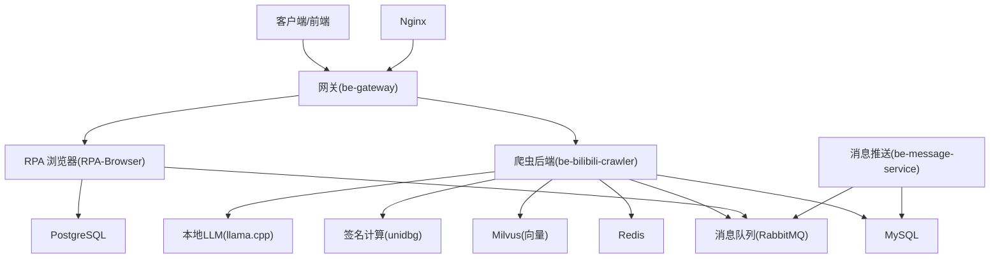
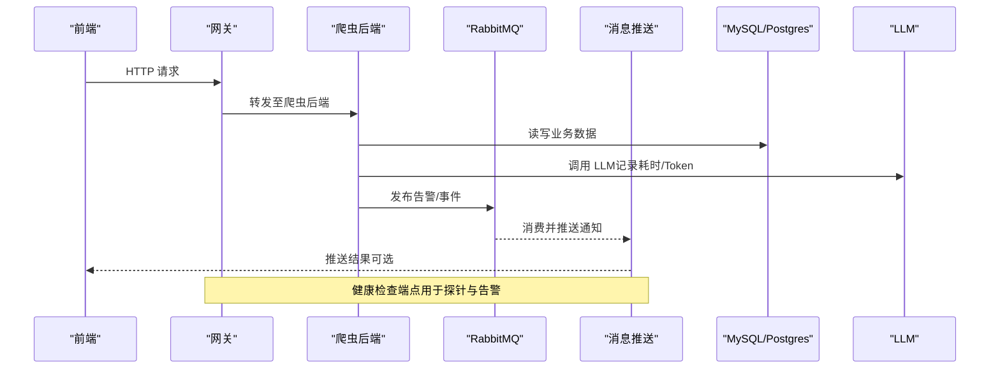
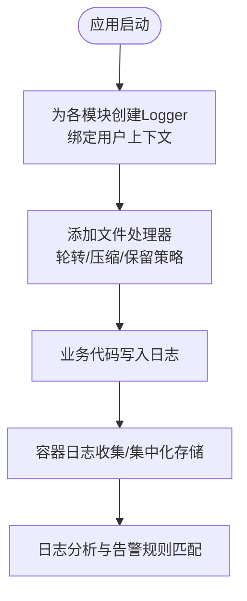
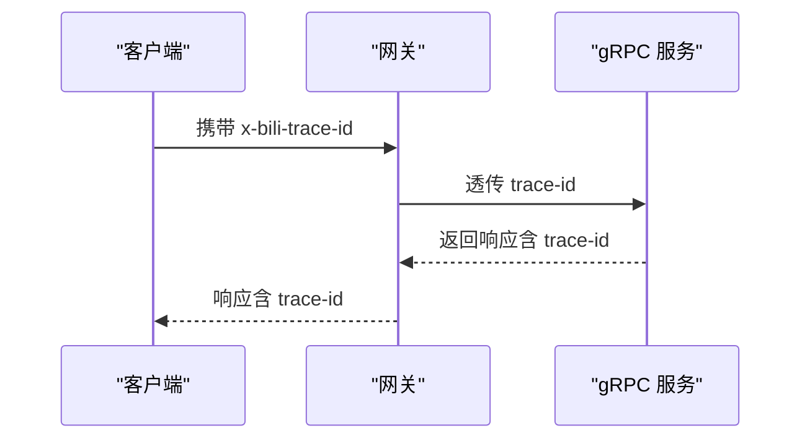
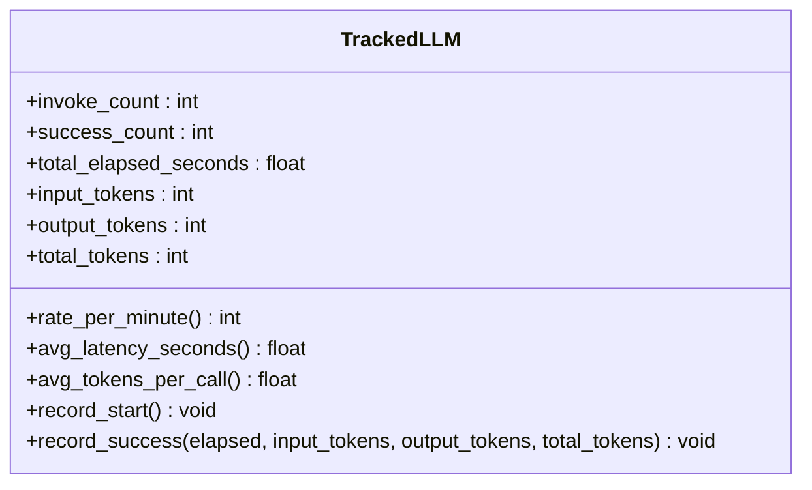
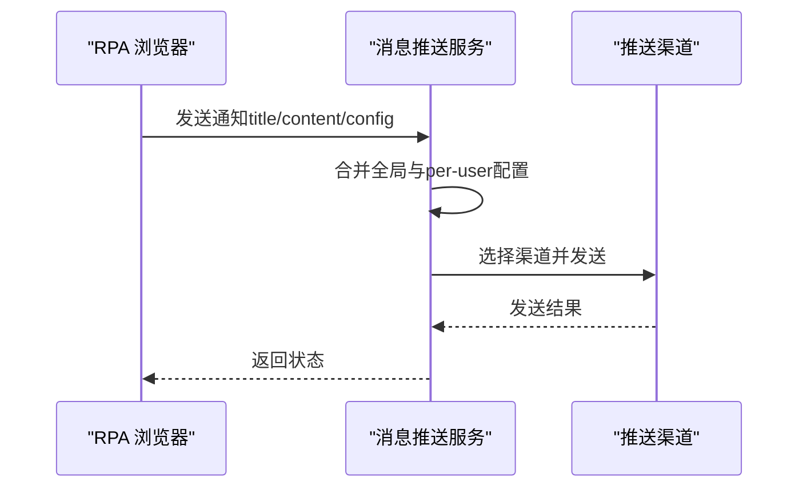
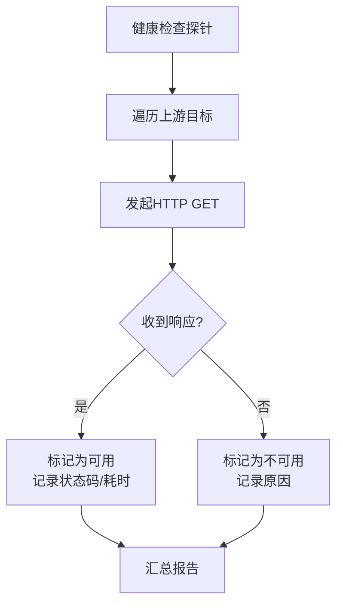
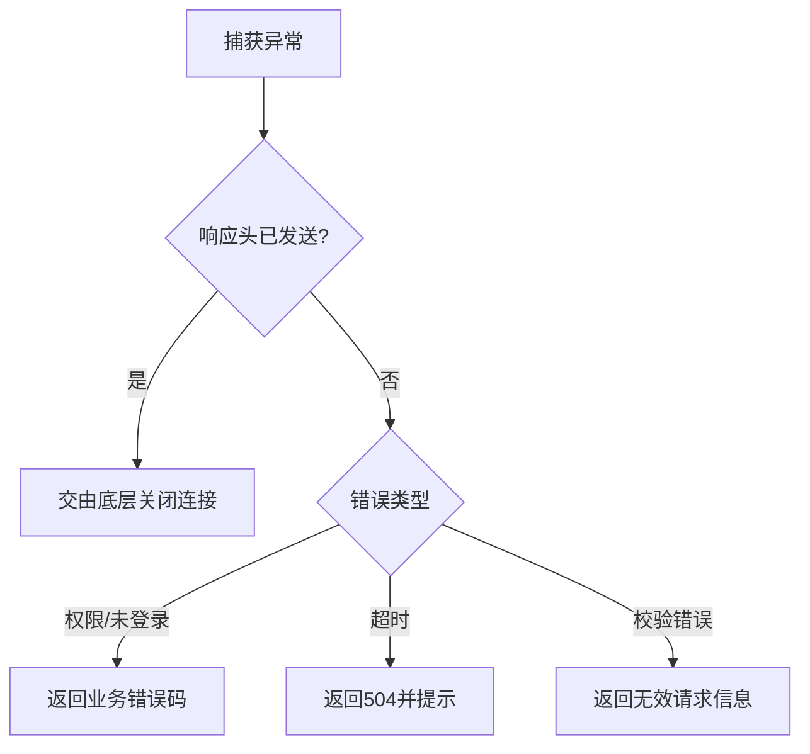
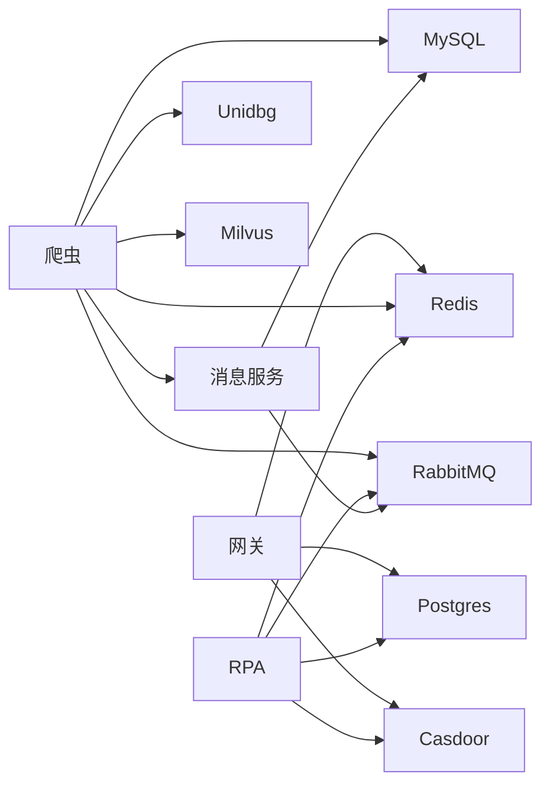

# 监控与故障排查

<cite>
**本文引用的文件**
- [README.md](file://README.md)
- [docker-compose.yml](file://docker-compose.yml)
- [CONFIG.py](file://be-bilibili-crawler/CONFIG.py)
- [base_log.py](file://be-bilibili-crawler/log/base_log.py)
- [CommonRouter.py](file://be-bilibili-crawler/controller/common/CommonRouter.py)
- [config.py](file://be-message-service/app/core/config.py)
- [push_helper.py](file://be-message-service/app/services/message/external/push_helper.py)
- [notification_service.py](file://RPA-Browser/app/services/RPA_browser/browser/notification_service.py)
- [models.py](file://RPA-Browser/app/models/workflow/models.py)
- [upstream_health_service.js](file://be-gateway/ExpressServerEnd/Service/upstream_health_module/upstream_health_service.js)
- [app.js](file://be-gateway/ExpressServerEnd/app.js)
- [DefaultService.gen.ts](file://Vue3FrontEndDemoExercise/src/api/community/hey-api/services/DefaultService.gen.ts)
- [readme.md](file://be-bilibili-crawler/Service/GrpcModule/Grpc/GrpcProto/readme.md)
- [tracked_llm.py](file://be-bilibili-crawler/Service/llm_service/tracked_llm.py)
</cite>

## 目录
1. [简介](#简介)
2. [项目结构](#项目结构)
3. [核心组件](#核心组件)
4. [架构总览](#架构总览)
5. [详细组件分析](#详细组件分析)
6. [依赖关系分析](#依赖关系分析)
7. [性能考量](#性能考量)
8. [故障排查指南](#故障排查指南)
9. [结论](#结论)
10. [附录](#附录)

## 简介
本指南面向“BilibiliExplosion”多微服务系统，提供全链路监控体系搭建、性能指标收集与告警配置、日志采集与分析、APM 工具集成与分布式追踪实现、常见性能问题诊断与瓶颈定位、性能回归分析方法、监控仪表板配置、自动化运维脚本与应急响应流程。目标是帮助团队快速发现异常、定位根因并恢复服务。

## 项目结构
本项目通过 Docker Compose 编排多个微服务与中间件，包括爬虫后端、消息推送服务、RPA 浏览器、网关、数据库、缓存、向量检索、LLM 推理等。各服务通过环境变量与消息队列进行解耦协作，统一通过网关对外暴露能力。

图表来源
- [docker-compose.yml:120-164](file://docker-compose.yml#L120-L164)
- [docker-compose.yml:179-212](file://docker-compose.yml#L179-L212)
- [docker-compose.yml:227-260](file://docker-compose.yml#L227-L260)
- [docker-compose.yml:261-322](file://docker-compose.yml#L261-L322)
- [docker-compose.yml:357-371](file://docker-compose.yml#L357-L371)

章节来源
- [README.md:12-34](file://README.md#L12-L34)
- [docker-compose.yml:1-380](file://docker-compose.yml#L1-L380)

## 核心组件
- 爬虫后端（be-bilibili-crawler）：数据采集、API 暴露、任务调度、外部 LLM 调用、日志与告警。
- 消息推送（be-message-service）：统一推送渠道管理、消息路由、健康检查、分库分表私信内容。
- RPA 浏览器（RPA-Browser）：浏览器自动化、通知推送、工作流执行与日志控制。
- 网关（be-gateway）：请求路由、上游健康检查、错误处理、鉴权与限流。
- 基础设施：MySQL、Redis、RabbitMQ、PostgreSQL、Milvus、Nginx、Casdoor、LLM 推理。

章节来源
- [docker-compose.yml:120-322](file://docker-compose.yml#L120-L322)
- [README.md:12-34](file://README.md#L12-L34)

## 架构总览
下图展示从前端到后端再到数据层的全链路监控点：网关健康检查、服务间调用、消息队列、数据库连接池、向量检索、LLM 调用统计与告警。

图表来源
- [docker-compose.yml:120-164](file://docker-compose.yml#L120-L164)
- [docker-compose.yml:261-322](file://docker-compose.yml#L261-L322)
- [tracked_llm.py:82-122](file://be-bilibili-crawler/Service/llm_service/tracked_llm.py#L82-L122)
- [DefaultService.gen.ts:8-21](file://Vue3FrontEndDemoExercise/src/api/community/hey-api/services/DefaultService.gen.ts#L8-L21)

## 详细组件分析

### 日志采集与分析（爬虫后端）
- 使用 loguru 按模块创建独立 Logger，输出到滚动压缩的日志文件，便于集中收集与检索。
- 支持按用户维度绑定上下文，过滤特定日志，避免日志污染。
- 关键日志通道：FastAPI、MQ、Redis、gRPC、B站 API、IPv6 监控、空间监控、预约/官方/话题抽奖等。

图表来源
- [base_log.py:44-96](file://be-bilibili-crawler/log/base_log.py#L44-L96)

章节来源
- [base_log.py:1-96](file://be-bilibili-crawler/log/base_log.py#L1-L96)

### 分布式追踪与链路标识
- 在 gRPC 协议中定义 x-bili-trace-id 生成算法，包含随机 ID、时间戳编码与子段拼接，用于跨服务链路追踪。
- 建议在网关与下游服务透传该头，配合 APM 工具（如 Jaeger/OpenTelemetry）进行可视化。

图表来源
- [readme.md:106-148](file://be-bilibili-crawler/Service/GrpcModule/Grpc/GrpcProto/readme.md#L106-L148)

章节来源
- [readme.md:106-148](file://be-bilibili-crawler/Service/GrpcModule/Grpc/GrpcProto/readme.md#L106-L148)

### 性能指标收集（LLM 调用）
- 对 LLM 调用进行埋点：记录调用次数、最近一分钟速率、平均耗时、平均 Token 消耗等指标。
- 可用于设置阈值告警（如每分钟调用超限、平均延迟升高、Token 消耗突增）。

图表来源
- [tracked_llm.py:82-122](file://be-bilibili-crawler/Service/llm_service/tracked_llm.py#L82-L122)

章节来源
- [tracked_llm.py:82-122](file://be-bilibili-crawler/Service/llm_service/tracked_llm.py#L82-L122)

### 告警与通知（消息推送服务）
- 全局推送渠道配置通过 JSON 环境变量注入，支持多种渠道（PushMe、PushPlus、邮件、Webhook 等）。
- 支持 per-user 配置覆盖全局配置，合并逻辑防止占位符污染。
- RPA 浏览器在无 per-user 配置时回落到全局 MESSAGE_CONFIG，确保告警可达。

图表来源
- [config.py:330-336](file://be-message-service/app/core/config.py#L330-L336)
- [push_helper.py:12-27](file://be-message-service/app/services/message/external/push_helper.py#L12-L27)
- [notification_service.py:162-191](file://RPA-Browser/app/services/RPA_browser/browser/notification_service.py#L162-L191)

章节来源
- [config.py:1-375](file://be-message-service/app/core/config.py#L1-L375)
- [push_helper.py:1-27](file://be-message-service/app/services/message/external/push_helper.py#L1-L27)
- [notification_service.py:151-191](file://RPA-Browser/app/services/RPA_browser/browser/notification_service.py#L151-L191)

### 健康检查与上游探测（网关）
- 网关提供上游代理服务健康检查，探测目标是否可达，记录状态码与耗时。
- 消息推送服务暴露 /health 端点，结合 docker healthcheck 实现服务存活检测。
- 前端可通过生成的 SDK 调用 /health 进行连通性验证。

图表来源
- [upstream_health_service.js:39-124](file://be-gateway/ExpressServerEnd/Service/upstream_health_module/upstream_health_service.js#L39-L124)
- [docker-compose.yml:310-322](file://docker-compose.yml#L310-L322)
- [DefaultService.gen.ts:8-21](file://Vue3FrontEndDemoExercise/src/api/community/hey-api/services/DefaultService.gen.ts#L8-L21)

章节来源
- [upstream_health_service.js:39-124](file://be-gateway/ExpressServerEnd/Service/upstream_health_module/upstream_health_service.js#L39-L124)
- [docker-compose.yml:310-322](file://docker-compose.yml#L310-L322)
- [DefaultService.gen.ts:8-21](file://Vue3FrontEndDemoExercise/src/api/community/hey-api/services/DefaultService.gen.ts#L8-L21)

### 错误处理与超时（网关）
- 网关错误处理中间件区分权限错误、未登录、超时等场景，统一返回结构化响应。
- 对于上游超时（503/504），返回明确提示以便前端重试或降级。

图表来源
- [app.js:119-161](file://be-gateway/ExpressServerEnd/app.js#L119-L161)

章节来源
- [app.js:119-161](file://be-gateway/ExpressServerEnd/app.js#L119-L161)

### 工作流操作日志控制（RPA）
- 工作流操作可配置是否采集执行日志、记录参数/结果/变量快照、仅失败时记录、负载长度限制与保留天数。
- 便于在生产环境降低日志量，同时保留关键调试信息。

章节来源
- [models.py:255-261](file://RPA-Browser/app/models/workflow/models.py#L255-L261)

### 测试抛错与告警触发（爬虫后端）
- 提供测试接口故意抛出异常并通过消息队列绕过限流直接触发 message-service，用于验证推送链路。
- 全局异常处理器再次尝试推送但受限流保护，避免重复告警风暴。

章节来源
- [CommonRouter.py:67-94](file://be-bilibili-crawler/controller/common/CommonRouter.py#L67-L94)

## 依赖关系分析
- 服务间依赖：网关依赖 Postgres、Redis、Casdoor；爬虫依赖 MySQL、Redis、RabbitMQ、Unidbg、Milvus、Message Service；RPA 依赖 Postgres、Redis、RabbitMQ、Casdoor；消息服务依赖 RabbitMQ、MySQL、Casdoor。
- 中间件健康：etcd、MinIO、Milvus、MySQL、Redis、RabbitMQ、LLM 推理均具备健康检查或重启策略。

图表来源
- [docker-compose.yml:120-322](file://docker-compose.yml#L120-L322)

章节来源
- [docker-compose.yml:120-322](file://docker-compose.yml#L120-L322)

## 性能考量
- 连接池与回收：MySQL 连接池启用 pre-ping 与 recycle，避免陈旧连接导致查询失败；消息服务对 MySQL/Postgres 分别配置池大小与溢出上限，防止资源耗尽。
- 日志级别与落盘：生产默认 WARNING，减少 I/O 压力；开发环境可开启 DEBUG 并写文件便于排查。
- 健康检查间隔与超时：服务健康检查周期与超时合理设置，避免误判与频繁重启。
- LLM 调用限流：通过 requests_per_second 控制外部 LLM 调用频率，避免被限流或打满下游。

章节来源
- [CONFIG.py:381-419](file://be-bilibili-crawler/CONFIG.py#L381-L419)
- [config.py:54-74](file://be-message-service/app/core/config.py#L54-L74)
- [config.py:25-34](file://be-message-service/app/core/config.py#L25-L34)
- [CONFIG.py:211-223](file://be-bilibili-crawler/CONFIG.py#L211-L223)

## 故障排查指南
- 服务不可用
  - 检查网关上游健康检查结果，确认目标地址与网络连通性。
  - 查看消息服务 /health 端点返回状态，确认 broker 连通性。
  - 核对 docker-compose 中服务依赖与健康检查配置。
- 日志缺失或过多
  - 调整 LOG_LEVEL 与 FastStream 日志级别，生产保持 WARNING。
  - 检查工作流操作日志开关与负载长度限制，避免大 payload 影响性能。
- 告警不生效
  - 验证全局 MESSAGE_CONFIG 与 per-user 配置合并逻辑，确保有效字段未被占位符污染。
  - 使用测试抛错接口验证推送链路。
- 性能退化
  - 关注 LLM 调用平均耗时与 Token 消耗，必要时限流或切换模型。
  - 检查数据库连接池与回收策略，避免连接泄漏或过期。
  - 使用分布式追踪头 x-bili-trace-id 定位慢调用链。

章节来源
- [upstream_health_service.js:39-124](file://be-gateway/ExpressServerEnd/Service/upstream_health_module/upstream_health_service.js#L39-L124)
- [docker-compose.yml:310-322](file://docker-compose.yml#L310-L322)
- [config.py:25-34](file://be-message-service/app/core/config.py#L25-L34)
- [models.py:255-261](file://RPA-Browser/app/models/workflow/models.py#L255-L261)
- [push_helper.py:12-27](file://be-message-service/app/services/message/external/push_helper.py#L12-L27)
- [CommonRouter.py:67-94](file://be-bilibili-crawler/controller/common/CommonRouter.py#L67-L94)
- [tracked_llm.py:82-122](file://be-bilibili-crawler/Service/llm_service/tracked_llm.py#L82-L122)
- [CONFIG.py:381-419](file://be-bilibili-crawler/CONFIG.py#L381-L419)
- [readme.md:106-148](file://be-bilibili-crawler/Service/GrpcModule/Grpc/GrpcProto/readme.md#L106-L148)

## 结论
通过统一的日志采集、健康检查、分布式追踪与告警机制，本系统实现了端到端的可观测性与稳定性保障。建议在生产环境中持续优化连接池、日志级别与告警阈值，并结合 APM 工具完善性能指标与可视化仪表板，提升故障定位效率与系统韧性。

## 附录
- 监控仪表板建议
  - 网关：请求量、错误率、超时率、上游可用性。
  - 爬虫：QPS、P95/P99 延迟、数据库连接数、LLM 调用成功率与耗时。
  - 消息服务：队列积压、推送成功率、渠道失败率。
  - 基础设施：MySQL/Redis/Milvus 资源使用率与慢查询。
- 自动化运维脚本
  - 定期执行上游健康检查并输出报告。
  - 基于日志关键字触发告警（如连接池耗尽、LLM 超时）。
  - 自动清理过期日志与临时文件。
- 应急响应流程
  - 一级：服务不可用 → 检查健康检查与依赖 → 重启/扩容。
  - 二级：性能退化 → 查看指标与追踪 → 限流/降级/回滚。
  - 三级：数据异常 → 校验分库分表与迁移 → 修复数据并验证。