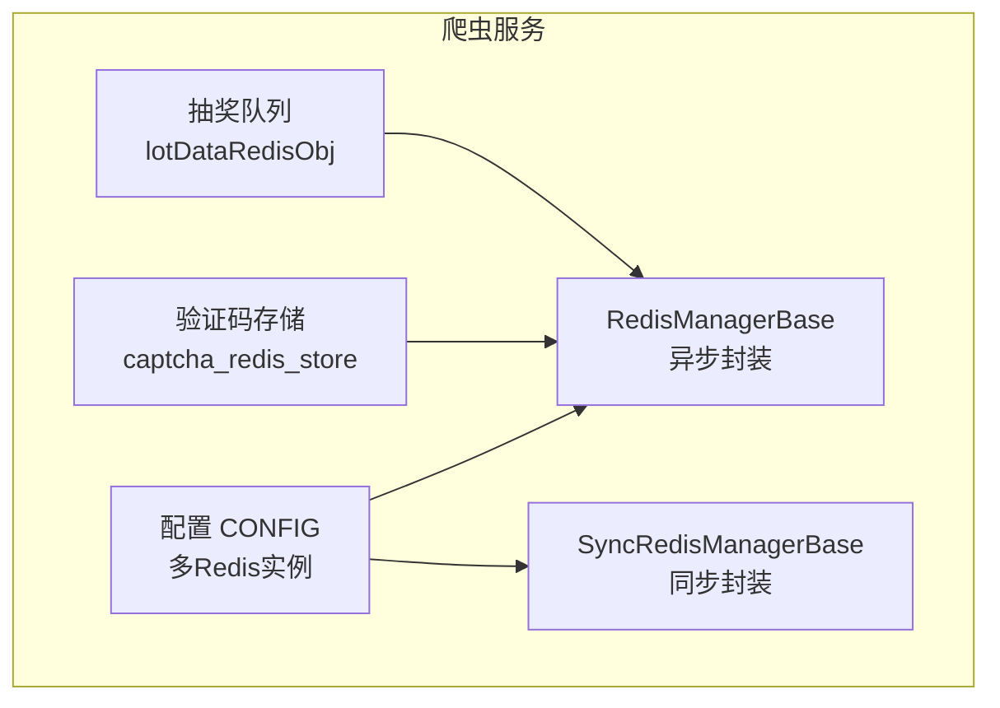
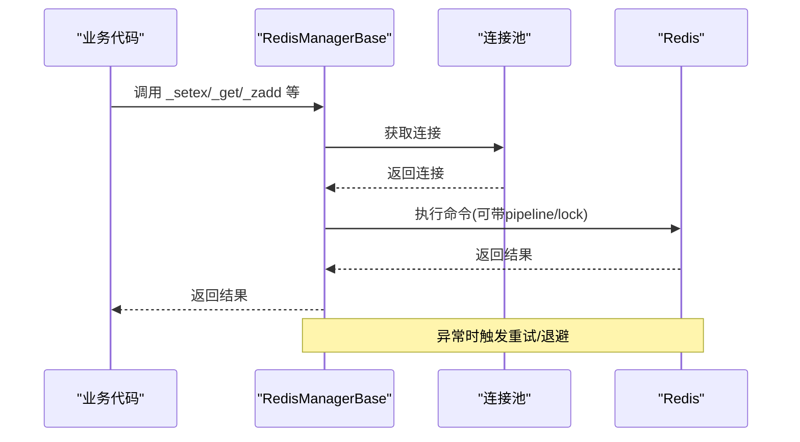
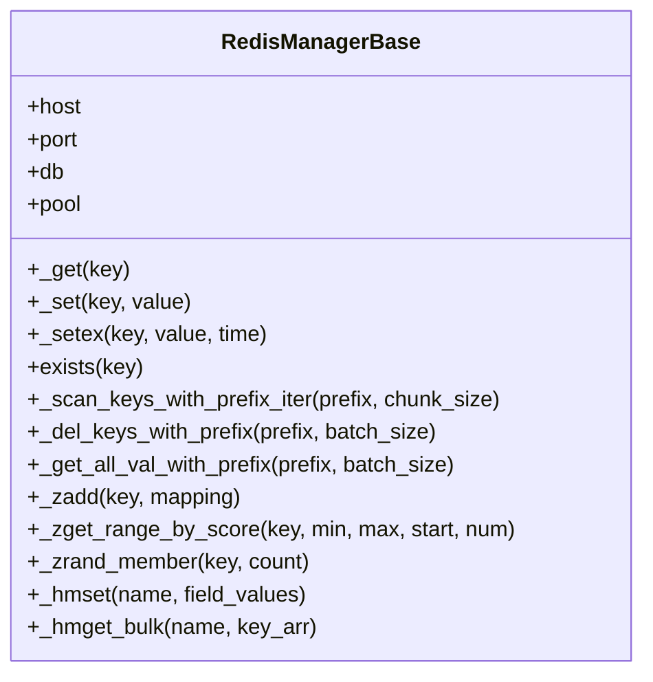
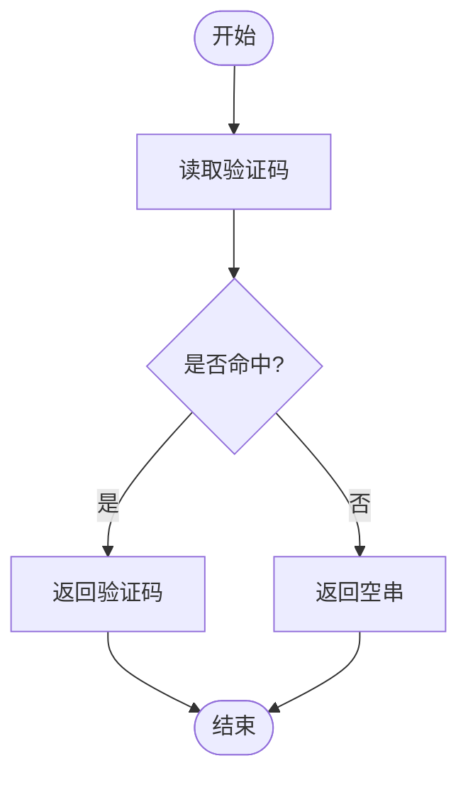
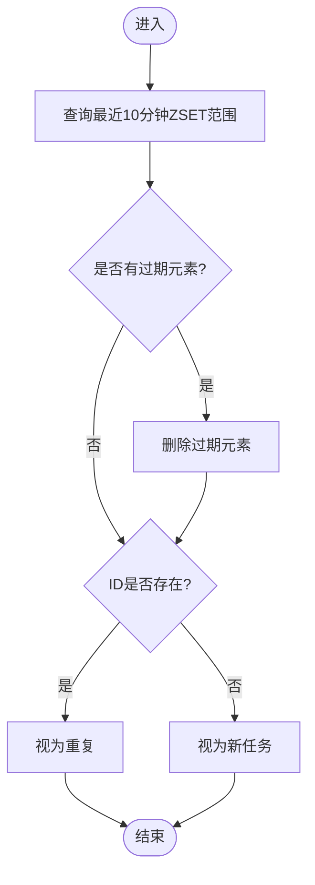
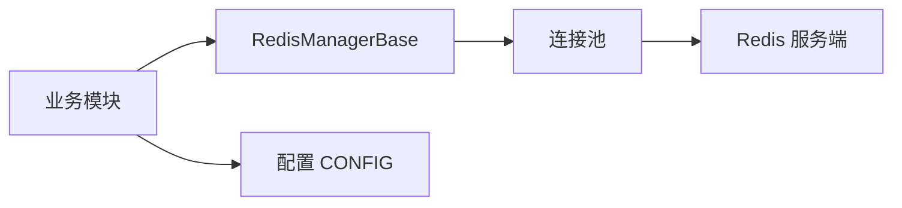

# 缓存策略优化

<cite>
**本文引用的文件**
- [RedisManager.py](file://be-bilibili-crawler/Utils/redisTool/RedisManager.py)
- [CONFIG.py](file://be-bilibili-crawler/CONFIG.py)
- [captcha_redis_store.py](file://be-bilibili-crawler/Service/CaptchaGen/captcha_redis_store.py)
- [lotDataRedisObj.py](file://be-bilibili-crawler/dao/lotDataRedisObj.py)
- [tracked_llm.py](file://be-bilibili-crawler/Service/llm_service/tracked_llm.py)
- [scheduler.py](file://be-message-service/app/tasks/scheduler.py)
</cite>

## 目录
1. [简介](#简介)
2. [项目结构](#项目结构)
3. [核心组件](#核心组件)
4. [架构总览](#架构总览)
5. [详细组件分析](#详细组件分析)
6. [依赖分析](#依赖分析)
7. [性能考虑](#性能考虑)
8. [故障排查指南](#故障排查指南)
9. [结论](#结论)
10. [附录](#附录)

## 简介
本指南围绕仓库中的 Redis 缓存能力，给出面向生产环境的缓存策略优化方案。内容涵盖：
- 缓存架构设计：连接池、超时与重试、批量操作、键空间管理
- 数据一致性保证：分布式锁、过期与删除、写扩散与延迟双删思路
- 缓存穿透防护：布隆过滤器、空值缓存、限流降级
- 键设计与过期策略：命名规范、TTL 配置、分片与热点隔离
- 内存管理：大键拆分、UNLINK、扫描清理、容量规划
- 分布式同步与预热：任务调度、定时重算、启动预热
- 监控指标与性能分析：命中率、延迟、错误率、吞吐
- 典型问题治理：雪崩、击穿、一致性与恢复

## 项目结构
本项目在爬虫服务中集中实现了 Redis 客户端封装与业务对象化访问，并通过配置中心统一管理多库（DB）的 Redis 实例。验证码、抽奖队列等场景分别以独立模块使用统一基类。

图表来源
- [RedisManager.py:187-209](file://be-bilibili-crawler/Utils/redisTool/RedisManager.py#L187-L209)
- [RedisManager.py:102-185](file://be-bilibili-crawler/Utils/redisTool/RedisManager.py#L102-L185)
- [CONFIG.py:360-378](file://be-bilibili-crawler/CONFIG.py#L360-L378)
- [captcha_redis_store.py:1-23](file://be-bilibili-crawler/Service/CaptchaGen/captcha_redis_store.py#L1-L23)
- [lotDataRedisObj.py:1-44](file://be-bilibili-crawler/dao/lotDataRedisObj.py#L1-L44)

章节来源
- [RedisManager.py:1-682](file://be-bilibili-crawler/Utils/redisTool/RedisManager.py#L1-L682)
- [CONFIG.py:360-487](file://be-bilibili-crawler/CONFIG.py#L360-L487)
- [captcha_redis_store.py:1-23](file://be-bilibili-crawler/Service/CaptchaGen/captcha_redis_store.py#L1-L23)
- [lotDataRedisObj.py:1-44](file://be-bilibili-crawler/dao/lotDataRedisObj.py#L1-L44)

## 核心组件
- 统一 Redis 客户端封装
  - 异步/同步双实现，统一连接池、超时、重试、管道与批量操作
  - 提供字符串、集合、有序集合、哈希等常用操作的封装
  - 支持按前缀扫描与批量删除，避免阻塞主线程
- 配置与多实例
  - 通过配置类定义多个 Redis 实例（不同 DB），便于业务隔离
- 业务对象化访问
  - 验证码存储：基于 setex 的带 TTL 存取与删除
  - 抽奖去重队列：基于 ZSET 的时间窗口去重与清理

章节来源
- [RedisManager.py:187-682](file://be-bilibili-crawler/Utils/redisTool/RedisManager.py#L187-L682)
- [CONFIG.py:360-378](file://be-bilibili-crawler/CONFIG.py#L360-L378)
- [captcha_redis_store.py:1-23](file://be-bilibili-crawler/Service/CaptchaGen/captcha_redis_store.py#L1-L23)
- [lotDataRedisObj.py:1-44](file://be-bilibili-crawler/dao/lotDataRedisObj.py#L1-L44)

## 架构总览
下图展示请求从业务侧到 Redis 的关键路径，包括重试、锁、管道与批量操作。

图表来源
- [RedisManager.py:62-99](file://be-bilibili-crawler/Utils/redisTool/RedisManager.py#L62-L99)
- [RedisManager.py:187-209](file://be-bilibili-crawler/Utils/redisTool/RedisManager.py#L187-L209)
- [RedisManager.py:303-339](file://be-bilibili-crawler/Utils/redisTool/RedisManager.py#L303-L339)
- [RedisManager.py:388-531](file://be-bilibili-crawler/Utils/redisTool/RedisManager.py#L388-L531)

## 详细组件分析

### 组件A：RedisManagerBase（异步封装）
- 连接与超时
  - 使用 ConnectionPool 创建连接池，设置 socket_timeout、health_check_interval、retry_on_timeout
  - 统一超时与重试，捕获 BusyLoadingError、ConnectionError 并退避
- 批量与扫描
  - 提供按前缀扫描迭代器、批量 MGET/MSET、UNLINK 批量删除
  - 使用 pipeline 聚合命令，降低网络往返
- 数据结构封装
  - 字符串：get/set/setex
  - 集合：sadd/sismember/srandmember/scard/smembers/srem
  - 有序集合：zadd/zscore/zrange/zrevrangebyscore/zcard/zcount/zincrby/zrandmember/zrem
  - 哈希：hset/hget/hdel/hlen/hgetall
- 并发安全
  - 同步封装中使用 redis lock 包裹批量读写，避免竞态
  - 异步封装通过重试与幂等写入保障稳定性

图表来源
- [RedisManager.py:187-209](file://be-bilibili-crawler/Utils/redisTool/RedisManager.py#L187-L209)
- [RedisManager.py:212-288](file://be-bilibili-crawler/Utils/redisTool/RedisManager.py#L212-L288)
- [RedisManager.py:303-339](file://be-bilibili-crawler/Utils/redisTool/RedisManager.py#L303-L339)
- [RedisManager.py:388-531](file://be-bilibili-crawler/Utils/redisTool/RedisManager.py#L388-L531)
- [RedisManager.py:535-682](file://be-bilibili-crawler/Utils/redisTool/RedisManager.py#L535-L682)

章节来源
- [RedisManager.py:1-682](file://be-bilibili-crawler/Utils/redisTool/RedisManager.py#L1-L682)

### 组件B：验证码存储（captcha_redis_store）
- 键设计：captcha_id:{id}
- 过期策略：setex 设置 TTL（默认 600 秒）
- 读取流程：命中则返回，未命中返回空串
- 删除流程：使用完成后主动删除，释放内存

图表来源
- [captcha_redis_store.py:1-23](file://be-bilibili-crawler/Service/CaptchaGen/captcha_redis_store.py#L1-L23)

章节来源
- [captcha_redis_store.py:1-23](file://be-bilibili-crawler/Service/CaptchaGen/captcha_redis_store.py#L1-L23)

### 组件C：抽奖去重队列（lotDataRedisObj）
- 数据结构：ZSET，成员为动态 ID，分数为时间戳
- 去重逻辑：查询最近 10 分钟内的元素，若存在则判定已处理
- 清理策略：定期清理过期元素，避免内存膨胀

图表来源
- [lotDataRedisObj.py:19-30](file://be-bilibili-crawler/dao/lotDataRedisObj.py#L19-L30)

章节来源
- [lotDataRedisObj.py:1-44](file://be-bilibili-crawler/dao/lotDataRedisObj.py#L1-L44)

### 组件D：配置与多实例（CONFIG）
- 多 Redis 实例：proxyRedis、proxySubRedis、lotDataRedisObj、ipInfoRedisObj、commStorageRedis、rabbitmqCacheRedis
- 统一 URL 构造：包含 host、port、db、pwd
- 建议：按业务域划分 DB，避免热点冲突；对高并发场景启用独立实例或集群分片

章节来源
- [CONFIG.py:360-378](file://be-bilibili-crawler/CONFIG.py#L360-L378)

## 依赖分析
- 组件耦合
  - 业务模块仅依赖 RedisManagerBase 暴露的方法，屏蔽底层连接与重试细节
  - 配置集中管理，便于切换环境或多实例
- 外部依赖
  - redis-py（同步/异步）、连接池、锁、管道
- 潜在风险
  - 全局信号量与连接池大小需根据压测调整，避免资源争用
  - 长事务/大键操作需谨慎，防止阻塞

图表来源
- [RedisManager.py:187-209](file://be-bilibili-crawler/Utils/redisTool/RedisManager.py#L187-L209)
- [CONFIG.py:360-378](file://be-bilibili-crawler/CONFIG.py#L360-L378)

章节来源
- [RedisManager.py:1-682](file://be-bilibili-crawler/Utils/redisTool/RedisManager.py#L1-L682)
- [CONFIG.py:360-487](file://be-bilibili-crawler/CONFIG.py#L360-L487)

## 性能考虑
- 连接与超时
  - 合理设置 socket_timeout、health_check_interval、retry_on_timeout，减少慢请求影响
  - 连接池大小与并发匹配，避免过多上下文切换
- 批量与管道
  - 优先使用 pipeline 聚合命令，减少 RTT
  - 大集合/大哈希拆分为多键或使用 hash 分片
- 扫描与清理
  - 使用 SCAN 迭代器分批处理，避免阻塞
  - 使用 UNLINK 替代 DEL，降低阻塞风险
- 热点与限流
  - 热点键采用本地缓存+远端缓存双层结构
  - 对高频接口增加令牌桶/漏桶限流，保护后端
- 监控与度量
  - 记录命中率、P95/P99 延迟、错误率、QPS
  - 结合应用内统计（如 tracked_llm 的速率与耗时统计）评估系统健康度

[本节为通用指导，不直接分析具体文件]

## 故障排查指南
- 常见问题定位
  - 连接失败/超时：检查网络、认证、连接池耗尽、服务端负载
  - 数据不一致：核对写路径是否使用 setex/TTL，读路径是否做空值缓存
  - 内存飙升：定位大键、未清理的临时键、未设置 TTL 的键
- 恢复策略
  - 自动重试：对连接错误与加载错误进行指数退避重试
  - 快速失败：超过阈值后短路，返回降级响应
  - 热修复：通过开关关闭非关键缓存写入，优先保读
- 监控告警
  - 建立 Redis 指标看板：连接数、内存、命中率、慢查询、错误率
  - 结合业务日志与追踪，定位异常链路

章节来源
- [RedisManager.py:62-99](file://be-bilibili-crawler/Utils/redisTool/RedisManager.py#L62-L99)
- [tracked_llm.py:82-122](file://be-bilibili-crawler/Service/llm_service/tracked_llm.py#L82-L122)

## 结论
本项目提供了稳定、可扩展的 Redis 基础能力，覆盖连接管理、重试、批量操作与常见数据结构封装。在此基础上，建议：
- 完善键设计规范与 TTL 策略，避免内存泄漏与一致性风险
- 引入布隆过滤器与空值缓存，防御穿透与击穿
- 建立完善的监控与告警体系，持续优化性能与稳定性
- 针对热点与突发流量，制定限流、降级与熔断预案

[本节为总结性内容，不直接分析具体文件]

## 附录

### A. 缓存键设计模式
- 命名规范：业务域:实体:标识[:维度]
- 示例
  - 验证码：captcha_id:{id}
  - 抽奖去重：add_dynamic_lottery_queue（ZSET，分数=时间戳）
- 建议
  - 短键名、避免过长字段拼接
  - 对超大对象使用 JSON 序列化并按业务维度拆分

章节来源
- [captcha_redis_store.py:1-23](file://be-bilibili-crawler/Service/CaptchaGen/captcha_redis_store.py#L1-L23)
- [lotDataRedisObj.py:1-44](file://be-bilibili-crawler/dao/lotDataRedisObj.py#L1-L44)

### B. 过期策略与内存管理
- 过期策略
  - 所有用户态缓存必须设置 TTL，避免永久驻留
  - 对热点数据采用“短 TTL + 后台刷新”模式
- 内存管理
  - 使用 UNLINK 批量删除，避免阻塞
  - 使用 SCAN 分批清理过期键
  - 大键拆分与压缩，控制单键体积

章节来源
- [RedisManager.py:212-288](file://be-bilibili-crawler/Utils/redisTool/RedisManager.py#L212-L288)
- [RedisManager.py:599-608](file://be-bilibili-crawler/Utils/redisTool/RedisManager.py#L599-L608)

### C. 分布式缓存同步与预热
- 同步策略
  - 写扩散：更新缓存后通过消息通知其他节点失效或更新
  - 读扩散：按需懒加载，配合版本号或时间戳判断新鲜度
- 预热策略
  - 定时任务批量重算热点数据（如评论热度分），提升冷启动体验

章节来源
- [scheduler.py:94-99](file://be-message-service/app/tasks/scheduler.py#L94-L99)

### D. 缓存穿透、击穿与雪崩防护
- 穿透防护
  - 布隆过滤器拦截不存在键
  - 空值缓存（短 TTL）
- 击穿防护
  - 互斥锁保护重建热点键
  - 热点键加随机抖动 TTL，避免同时过期
- 雪崩防护
  - 多级缓存（本地+远端）
  - 限流与降级，避免瞬时放大
  - 分散过期时间，避免大规模同时失效

[本节为通用指导，不直接分析具体文件]

### E. 监控指标与性能分析
- 关键指标
  - 命中率、P95/P99 延迟、错误率、QPS、连接数、内存使用
- 分析方法
  - 结合应用层统计（如调用次数、平均耗时、token 消耗）评估整体性能
  - 对慢查询与热点键进行专项优化

章节来源
- [tracked_llm.py:82-122](file://be-bilibili-crawler/Service/llm_service/tracked_llm.py#L82-L122)