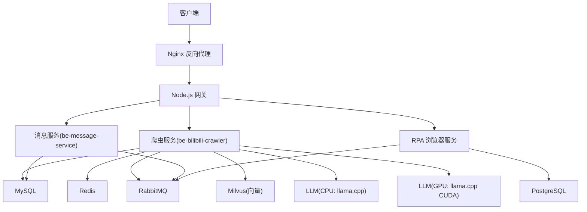
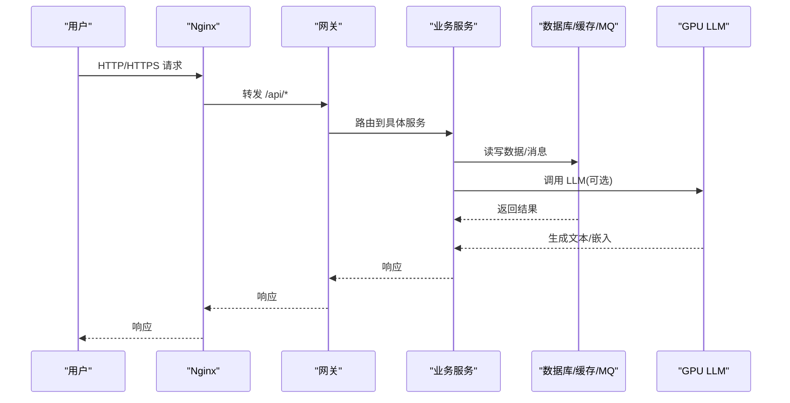
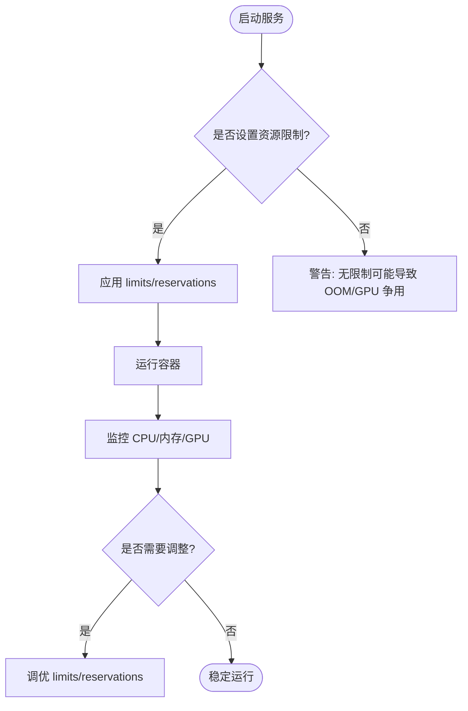
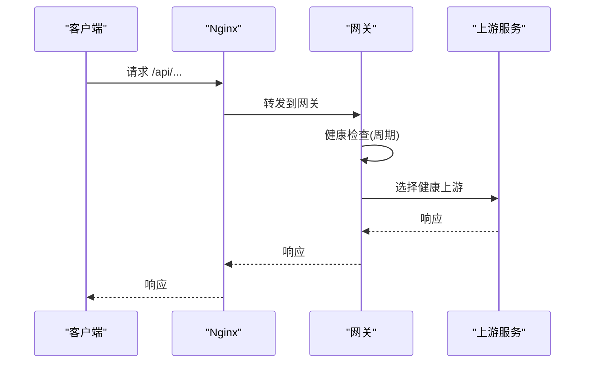
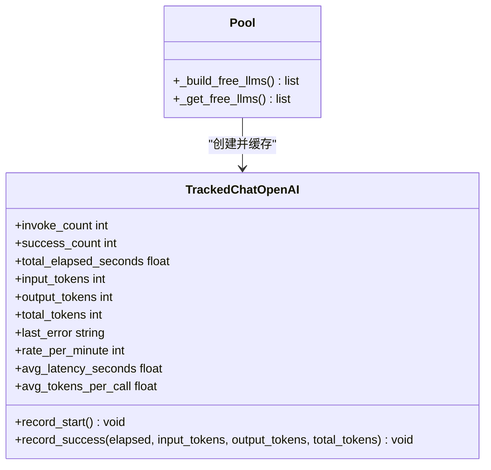
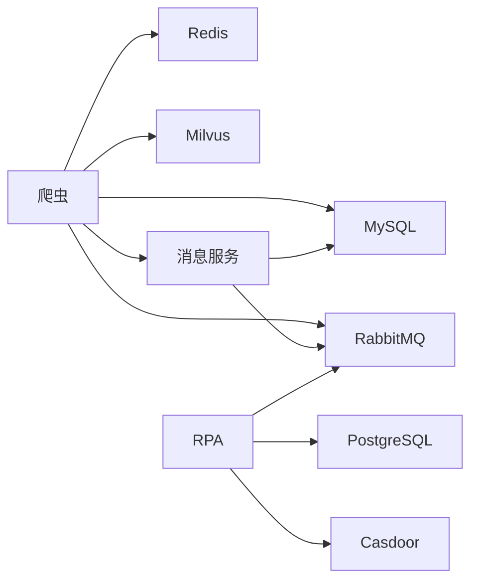

# 资源分配优化

<cite>
**本文引用的文件**
- [docker-compose.yml](file://docker-compose.yml)
- [Dockerfile.mono](file://Dockerfile.mono)
- [nginx.conf](file://docker_vol/nginx/conf/nginx.conf)
- [CONFIG.py](file://be-bilibili-crawler/CONFIG.py)
- [pool.py](file://be-bilibili-crawler/Service/llm_service/pool.py)
- [tracked_llm.py](file://be-bilibili-crawler/Service/llm_service/tracked_llm.py)
- [upstream_health_service.js](file://be-gateway/ExpressServerEnd/Service/upstream_health_module/upstream_health_service.js)
- [nodejs_backend.config.js](file://be-gateway/nodejs_backend.config.js)
- [FastapiLifespan.py](file://be-bilibili-crawler/Utils/FastAPI/FastapiLifespan.py)
- [RedisManager.py](file://be-bilibili-crawler/Utils/redisTool/RedisManager.py)
- [CONST.py](file://be-bilibili-crawler/Utils/GrpcUtils/CONST.py)
</cite>

## 目录
1. [简介](#简介)
2. [项目结构](#项目结构)
3. [核心组件](#核心组件)
4. [架构总览](#架构总览)
5. [详细组件分析](#详细组件分析)
6. [依赖关系分析](#依赖关系分析)
7. [性能考量](#性能考量)
8. [故障排查指南](#故障排查指南)
9. [结论](#结论)
10. [附录](#附录)

## 简介
本指南面向微服务与容器化部署环境，聚焦系统资源分配优化：包括 Docker 容器资源限制、CPU/内存分配策略、服务间隔离、负载均衡配置、弹性伸缩策略；并覆盖 GPU 资源（LLM 服务）、存储卷优化、网络带宽管理。同时提供资源监控工具使用、性能基准测试方法与容量规划建议，帮助解决资源争用、OOM 与性能退化问题。

## 项目结构
本项目采用多服务编排，关键资源相关配置集中在以下位置：
- 容器编排与资源限制：docker-compose.yml
- 镜像构建与运行端口：Dockerfile.mono
- 反向代理与请求路由：nginx.conf
- LLM 服务与 GPU 资源：docker-compose.yml 中的 llama_cpp_gpu_cuda
- 健康检查与上游探测：be-gateway 的健康检查模块
- 应用内限流与指标：be-bilibili-crawler 的 LLM 池与追踪对象
- 数据库与缓存连接参数：各服务的 docker-compose 环境变量与 Redis 连接参数

**图示来源**
- [docker-compose.yml:120-164](file://docker-compose.yml#L120-L164)
- [docker-compose.yml:227-260](file://docker-compose.yml#L227-L260)
- [docker-compose.yml:261-322](file://docker-compose.yml#L261-L322)
- [docker-compose.yml:323-356](file://docker-compose.yml#L323-L356)
- [nginx.conf:1-71](file://docker_vol/nginx/conf/nginx.conf#L1-L71)

**章节来源**
- [docker-compose.yml:1-380](file://docker-compose.yml#L1-L380)
- [Dockerfile.mono:1-146](file://Dockerfile.mono#L1-L146)
- [nginx.conf:1-71](file://docker_vol/nginx/conf/nginx.conf#L1-L71)

## 核心组件
- 容器资源限制与隔离
  - 通过 docker-compose 的 deploy.resources.limits 为关键服务设置内存上限，避免 OOM 扩散。
  - GPU 服务通过 resources.reservations.devices 声明 nvidia 驱动与 gpu 能力，确保独占或共享 GPU 资源。
- 负载均衡与反向代理
  - Nginx 作为统一入口，按路径将请求转发到网关与 Casdoor，支持 WebSocket 升级以适配前端开发模式。
  - 网关具备上游健康检查能力，可动态感知后端可用性。
- LLM 服务与 GPU 分配
  - CPU 版与 CUDA 版两个镜像分别暴露不同端口，CUDA 版通过环境变量加载模型并绑定 GPU。
- 存储卷与数据持久化
  - MySQL、PostgreSQL、Redis、RabbitMQ、Milvus 等数据目录均挂载至宿主机目录，便于备份与扩容。
- 网络与带宽管理
  - 启用 IPv6 网络，合理映射端口；通过 Nginx 控制并发连接数与代理头，减少无效开销。

**章节来源**
- [docker-compose.yml:120-164](file://docker-compose.yml#L120-L164)
- [docker-compose.yml:323-356](file://docker-compose.yml#L323-L356)
- [nginx.conf:1-71](file://docker_vol/nginx/conf/nginx.conf#L1-L71)

## 架构总览
下图展示从客户端到各后端服务的数据流与资源边界，标注了关键资源限制点与健康检查点。

**图示来源**
- [nginx.conf:30-48](file://docker_vol/nginx/conf/nginx.conf#L30-L48)
- [docker-compose.yml:179-212](file://docker-compose.yml#L179-L212)
- [docker-compose.yml:120-164](file://docker-compose.yml#L120-L164)
- [docker-compose.yml:323-356](file://docker-compose.yml#L323-L356)

## 详细组件分析

### 容器资源限制与隔离
- 内存限制
  - 爬虫服务设置了内存上限，防止突发流量导致宿主 OOM。
- GPU 资源预留
  - CUDA 版 LLM 服务通过设备预留声明 GPU，确保运行时可用显存与计算资源。
- 进程隔离
  - 每个服务独立容器，端口与环境变量隔离，降低相互影响。

**图示来源**
- [docker-compose.yml:120-164](file://docker-compose.yml#L120-L164)
- [docker-compose.yml:323-356](file://docker-compose.yml#L323-L356)

**章节来源**
- [docker-compose.yml:120-164](file://docker-compose.yml#L120-L164)
- [docker-compose.yml:323-356](file://docker-compose.yml#L323-L356)

### 负载均衡与反向代理
- Nginx 配置要点
  - worker_processes auto 与 worker_connections 控制并发。
  - /api 路径转发到网关，/casdoor 转发到认证服务，静态资源与前端开发服务器也通过代理处理。
  - 支持 WebSocket 升级，保障前端 HMR 与实时通信。
- 网关上游健康检查
  - 定期探测所有上游服务，输出健康状态与耗时，辅助快速定位不可用节点。

**图示来源**
- [nginx.conf:1-71](file://docker_vol/nginx/conf/nginx.conf#L1-L71)
- [upstream_health_service.js:93-124](file://be-gateway/ExpressServerEnd/Service/upstream_health_module/upstream_health_service.js#L93-L124)

**章节来源**
- [nginx.conf:1-71](file://docker_vol/nginx/conf/nginx.conf#L1-L71)
- [upstream_health_service.js:93-124](file://be-gateway/ExpressServerEnd/Service/upstream_health_module/upstream_health_service.js#L93-L124)

### LLM 服务与 GPU 资源分配
- 双镜像策略
  - CPU 版与 CUDA 版分离部署，按需切换或并行运行。
- 模型加载与缓存
  - 通过环境变量指定模型与下载源，缓存目录挂载到宿主机以提升冷启动速度。
- 应用内限流与指标
  - 云端 LLM 实例使用令牌桶限流，避免触发上游 429。
  - 追踪对象记录调用次数、成功率、平均延迟与 token 消耗，用于容量规划与告警。

**图示来源**
- [pool.py:29-66](file://be-bilibili-crawler/Service/llm_service/pool.py#L29-L66)
- [tracked_llm.py:82-122](file://be-bilibili-crawler/Service/llm_service/tracked_llm.py#L82-L122)

**章节来源**
- [docker-compose.yml:323-356](file://docker-compose.yml#L323-L356)
- [pool.py:29-66](file://be-bilibili-crawler/Service/llm_service/pool.py#L29-L66)
- [tracked_llm.py:82-122](file://be-bilibili-crawler/Service/llm_service/tracked_llm.py#L82-L122)

### 存储卷优化
- 数据目录挂载
  - MySQL、PostgreSQL、Redis、RabbitMQ、Milvus 数据目录均持久化到宿主机，便于备份与迁移。
- 日志与缓存
  - Nginx 日志与 LLM 模型缓存目录挂载，避免容器重建丢失。
- 命名卷
  - Node.js 的 node_modules 使用命名卷，提升构建与重启效率。

**章节来源**
- [docker-compose.yml:68-109](file://docker-compose.yml#L68-L109)
- [docker-compose.yml:165-178](file://docker-compose.yml#L165-L178)
- [docker-compose.yml:357-371](file://docker-compose.yml#L357-L371)

### 网络与带宽管理
- IPv6 支持
  - 默认网络启用 IPv6，便于未来扩展。
- 端口映射与代理头
  - 明确映射端口，设置 X-Forwarded-* 头，保证后端正确识别协议与真实 IP。
- 并发控制
  - Nginx worker_connections 限制并发连接，避免过载。

**章节来源**
- [docker-compose.yml:375-380](file://docker-compose.yml#L375-L380)
- [nginx.conf:1-71](file://docker_vol/nginx/conf/nginx.conf#L1-L71)

### 弹性伸缩策略
- 水平扩展
  - 对无状态服务（如网关、爬虫、消息服务）可通过增加副本实现水平扩展；需配合外部负载均衡器与共享存储。
- 垂直扩缩容
  - 根据监控指标调整 limits.memory 与 CPU 配额；GPU 服务可按需求增减 GPU 数量。
- 自动伸缩
  - 基于 Prometheus 与 KEDA/Helm 的 autoscaler 可实现按 QPS/CPU/自定义指标自动扩缩容。

[本节为概念性内容，不直接分析具体文件]

## 依赖关系分析
- 服务依赖
  - 爬虫依赖 MySQL、Redis、RabbitMQ、Milvus、消息服务。
  - 消息服务依赖 RabbitMQ、MySQL、Casdoor。
  - RPA 依赖 PostgreSQL、Redis、RabbitMQ、Casdoor。
- 外部依赖
  - LLM 服务依赖本地模型与 GPU 驱动；云端 LLM 依赖 API 限流与鉴权。

**图示来源**
- [docker-compose.yml:120-164](file://docker-compose.yml#L120-L164)
- [docker-compose.yml:227-260](file://docker-compose.yml#L227-L260)
- [docker-compose.yml:261-322](file://docker-compose.yml#L261-L322)

**章节来源**
- [docker-compose.yml:120-164](file://docker-compose.yml#L120-L164)
- [docker-compose.yml:227-260](file://docker-compose.yml#L227-L260)
- [docker-compose.yml:261-322](file://docker-compose.yml#L261-L322)

## 性能考量
- 容器资源
  - 为高负载服务设置合理的 memory limit，避免 OOM；为 GPU 服务预留足够显存。
- 数据库与缓存
  - 合理设置连接池大小与超时；Redis 开启健康检查与重试，提高稳定性。
- 网络与代理
  - Nginx 并发与超时参数需结合业务峰值调优；保持代理头完整，减少重定向与重复请求。
- LLM 服务
  - 使用令牌桶限流保护上游；监控平均延迟与 token 消耗，评估成本与吞吐。
- 构建与缓存
  - 利用多阶段构建与 uv 缓存层，减少构建时间；node_modules 使用命名卷加速重启。

**章节来源**
- [docker-compose.yml:120-164](file://docker-compose.yml#L120-L164)
- [docker-compose.yml:323-356](file://docker-compose.yml#L323-L356)
- [RedisManager.py:206-206](file://be-bilibili-crawler/Utils/redisTool/RedisManager.py#L206-L206)
- [nginx.conf:1-71](file://docker_vol/nginx/conf/nginx.conf#L1-L71)
- [pool.py:29-66](file://be-bilibili-crawler/Service/llm_service/pool.py#L29-L66)
- [Dockerfile.mono:1-146](file://Dockerfile.mono#L1-L146)

## 故障排查指南
- 资源争用
  - 观察容器 CPU/内存使用率，若接近 limit，考虑提升配额或水平扩展。
  - GPU 服务显存不足时，检查模型大小与批处理大小，必要时拆分请求。
- OOM 问题
  - 确认 memory limit 是否过低；检查是否存在内存泄漏或大对象堆积；对爬虫与 LLM 服务重点排查。
- 性能退化
  - 检查数据库连接池与慢查询；Redis 命中率与键空间膨胀；Nginx 并发与超时配置。
  - 使用网关健康检查与上游探测快速定位不可用节点。
- 监控与诊断
  - 使用服务 /health 端点与网关健康检查脚本进行自动化巡检。
  - 收集 LLM 调用指标（延迟、token 消耗、失败率），结合限流策略优化。

**章节来源**
- [upstream_health_service.js:93-124](file://be-gateway/ExpressServerEnd/Service/upstream_health_module/upstream_health_service.js#L93-L124)
- [FastapiLifespan.py:28-208](file://be-bilibili-crawler/Utils/FastAPI/FastapiLifespan.py#L28-L208)
- [RedisManager.py:206-206](file://be-bilibili-crawler/Utils/redisTool/RedisManager.py#L206-L206)
- [CONFIG.py:211-222](file://be-bilibili-crawler/CONFIG.py#L211-L222)

## 结论
通过容器资源限制、GPU 预留、反向代理与上游健康检查、应用内限流与指标采集，本项目实现了较为完善的资源隔离与可观测性。建议在生产环境中引入自动化监控与弹性伸缩，持续优化容量规划与成本。

[本节为总结性内容，不直接分析具体文件]

## 附录
- 容量规划方法
  - 基于历史峰值 QPS 与 P99 延迟，估算所需 CPU/内存/GPU 配额。
  - 对数据库与缓存进行压测，确定连接池与缓冲大小。
- 基准测试建议
  - 使用标准压测工具对网关与关键接口进行压力测试，记录吞吐与延迟分布。
  - 对 LLM 服务进行并发与批处理测试，评估显存占用与生成速度。
- 常用命令与工具
  - 查看容器资源使用：docker stats
  - 查看 GPU 使用：nvidia-smi
  - 健康检查：curl http://host:port/health

[本节为通用指导，不直接分析具体文件]