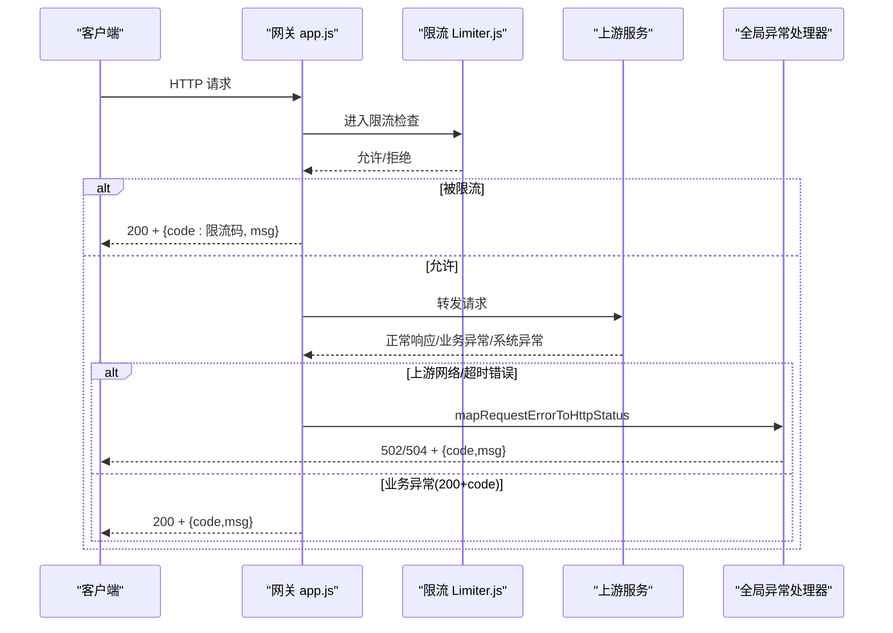
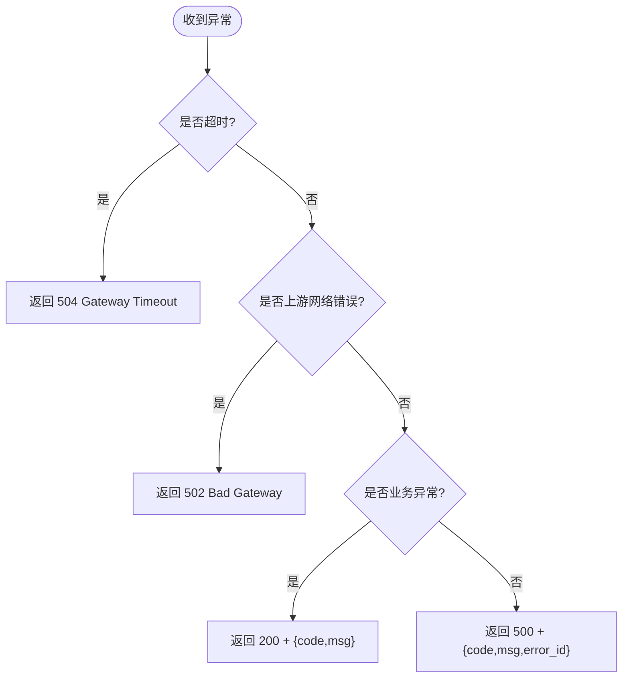
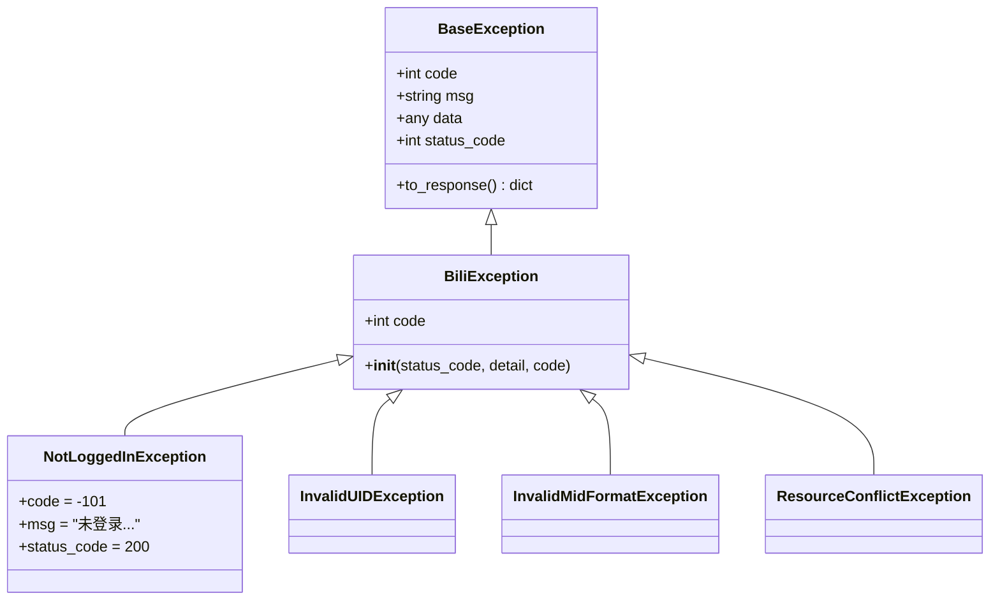
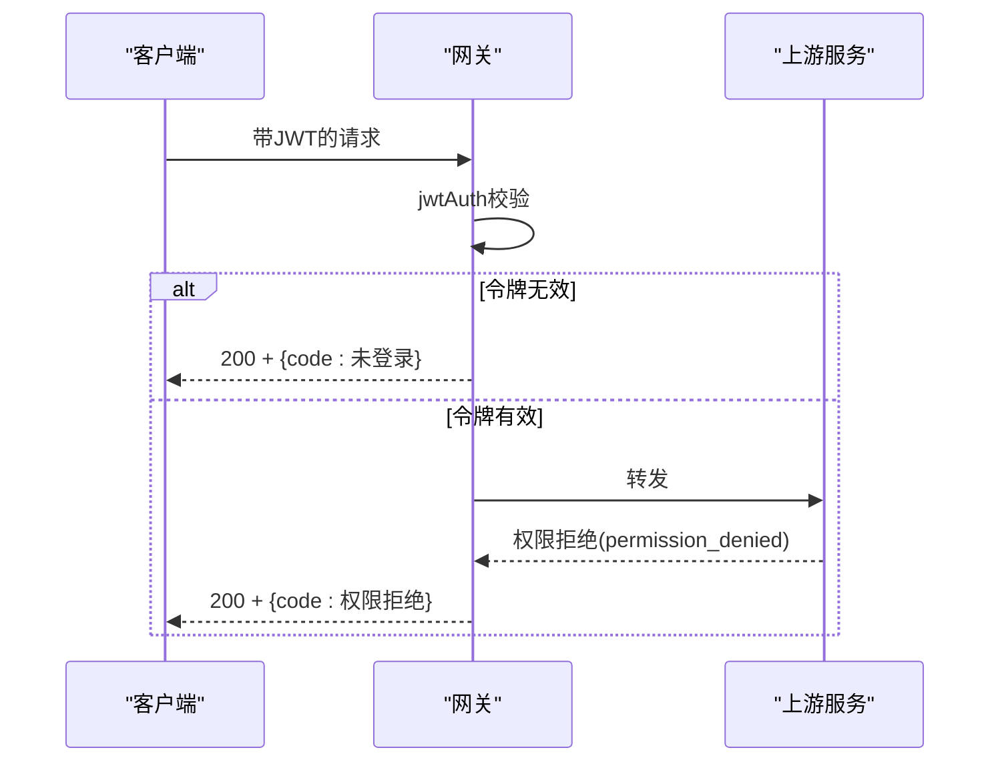
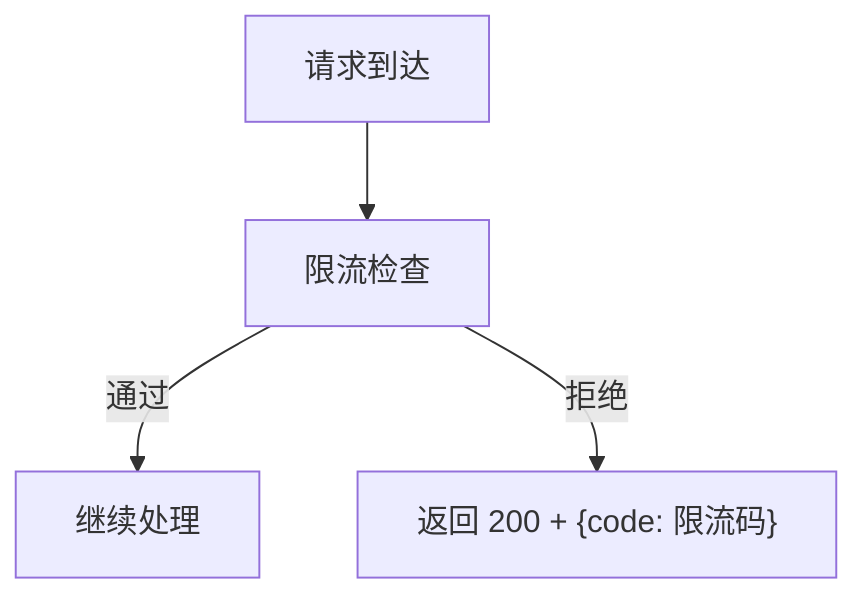
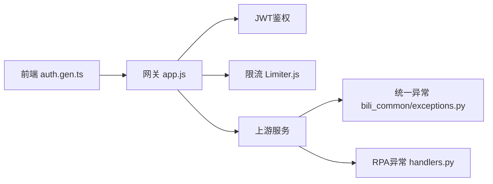

# API接口异常排查

<cite>
**本文引用的文件**
- [be-gateway/ExpressServerEnd/app.js](file://be-gateway/ExpressServerEnd/app.js)
- [be-gateway/ExpressServerEnd/MiddleWare/Limiter.js](file://be-gateway/ExpressServerEnd/MiddleWare/Limiter.js)
- [RPA-Browser/app/exceptions/handlers.py](file://RPA-Browser/app/exceptions/handlers.py)
- [bili-common/bili_common/exceptions.py](file://bili-common/bili_common/exceptions.py)
- [be-bilibili-crawler/Utils/网关/gateway_auth.py](file://be-bilibili-crawler/Utils/网关/gateway_auth.py)
- [be-message-service/app/exceptions.py](file://be-message-service/app/exceptions.py)
- [Vue3FrontEndDemoExercise/src/api/browser/hey-api/core/auth.gen.ts](file://Vue3FrontEndDemoExercise/src/api/browser/hey-api/core/auth.gen.ts)
</cite>

## 目录
1. [简介](#简介)
2. [项目结构](#项目结构)
3. [核心组件](#核心组件)
4. [架构总览](#架构总览)
5. [详细组件分析](#详细组件分析)
6. [依赖关系分析](#依赖关系分析)
7. [性能与稳定性](#性能与稳定性)
8. [故障排查指南](#故障排查指南)
9. [结论](#结论)
10. [附录](#附录)

## 简介
本手册面向API网关、后端服务与前端客户端的联调与排障，聚焦HTTP状态码含义、请求超时、响应格式错误、认证失败、路由错误、上游调用失败、参数校验错误、权限拒绝等典型场景的诊断与解决。同时提供限流熔断、降级处理、版本兼容性、性能分析与日志追踪、客户端调试工具的使用建议，帮助快速定位并解决问题。

## 项目结构
本项目采用“网关 + 多后端服务 + 前端”的分层架构：
- 网关（Node/Express）：统一入口，负责鉴权、限流、超时控制、上游转发与错误归一化。
- 后端服务（Python/FastAPI）：业务实现，统一异常体系，返回标准响应体。
- 前端（Vue3）：统一携带认证头，统一处理响应体中的业务码。

```mermaid
graph TB
Client["浏览器/客户端"] --> GW["网关 Express<br/>app.js"]
GW --> Auth["JWT鉴权<br/>JwtModule"]
GW --> Limiter["限流中间件<br/>Limiter.js"]
GW --> Upstream["上游服务<br/>be-bilibili-crawler / be-message-service / RPA-Browser"]
Upstream --> DB["数据库/缓存/消息队列"]
Client <--|标准响应 {code,msg,data}| GW
```

**图示来源**
- [be-gateway/ExpressServerEnd/app.js:1-188](file://be-gateway/ExpressServerEnd/app.js#L1-L188)
- [be-gateway/ExpressServerEnd/MiddleWare/Limiter.js:1-69](file://be-gateway/ExpressServerEnd/MiddleWare/Limiter.js#L1-L69)

**章节来源**
- [be-gateway/ExpressServerEnd/app.js:1-188](file://be-gateway/ExpressServerEnd/app.js#L1-L188)
- [be-gateway/ExpressServerEnd/MiddleWare/Limiter.js:1-69](file://be-gateway/ExpressServerEnd/MiddleWare/Limiter.js#L1-L69)

## 核心组件
- 网关错误映射与统一响应：将超时、上游网络错误映射为合适的HTTP状态码，并将业务类错误以HTTP 200 + body.code表达。
- 后端统一异常体系：FastAPI侧通过公共模块注册统一处理器，保证所有服务对外契约一致。
- 认证与权限：网关JWT鉴权；后端网关登录态校验；未登录按业务码返回。
- 限流：基于Redis的分布式限流，支持自定义窗口、阈值与键生成策略。
- 前端认证头：自动生成Bearer或Basic头，便于网关/后端识别身份。

**章节来源**
- [be-gateway/ExpressServerEnd/app.js:33-188](file://be-gateway/ExpressServerEnd/app.js#L33-L188)
- [bili-common/bili_common/exceptions.py:1-273](file://bili-common/bili_common/exceptions.py#L1-L273)
- [RPA-Browser/app/exceptions/handlers.py:1-183](file://RPA-Browser/app/exceptions/handlers.py#L1-L183)
- [be-bilibili-crawler/Utils/网关/gateway_auth.py:95-121](file://be-bilibili-crawler/Utils/网关/gateway_auth.py#L95-L121)
- [Vue3FrontEndDemoExercise/src/api/browser/hey-api/core/auth.gen.ts:1-48](file://Vue3FrontEndDemoExercise/src/api/browser/hey-api/core/auth.gen.ts#L1-L48)

## 架构总览
下图展示一次请求从客户端到网关、再到上游服务的完整流程，以及各类异常在链路中的处理位置。



**图示来源**
- [be-gateway/ExpressServerEnd/app.js:33-188](file://be-gateway/ExpressServerEnd/app.js#L33-L188)
- [be-gateway/ExpressServerEnd/MiddleWare/Limiter.js:20-51](file://be-gateway/ExpressServerEnd/MiddleWare/Limiter.js#L20-L51)

## 详细组件分析

### 网关错误映射与超时处理
- 超时：connect-timeout或代理proxyTimeout触发时，统一返回HTTP 504，并在body中附带超时信息。
- 上游网络错误：如连接拒绝、DNS解析失败、协议错误、响应无效等，统一返回HTTP 502。
- 业务异常：保持HTTP 200，通过body.code区分（如未登录、权限拒绝、参数校验失败）。



**图示来源**
- [be-gateway/ExpressServerEnd/app.js:33-66](file://be-gateway/ExpressServerEnd/app.js#L33-L66)
- [be-gateway/ExpressServerEnd/app.js:119-188](file://be-gateway/ExpressServerEnd/app.js#L119-L188)

**章节来源**
- [be-gateway/ExpressServerEnd/app.js:33-66](file://be-gateway/ExpressServerEnd/app.js#L33-L66)
- [be-gateway/ExpressServerEnd/app.js:119-188](file://be-gateway/ExpressServerEnd/app.js#L119-L188)

### 后端统一异常体系（FastAPI）
- 业务异常：继承BaseException，HTTP 200 + {code,msg,data}，禁止将业务异常status_code设为非200。
- HTTP异常：保留原HTTP状态码（如404/405），但响应体仍为统一契约。
- 参数校验失败：固定HTTP 400，并附带校验明细。
- 未捕获异常：HTTP 500 + error_id，DEV环境data包含traceback，生产仅返回error_id。



**图示来源**
- [bili-common/bili_common/exceptions.py:30-119](file://bili-common/bili_common/exceptions.py#L30-L119)
- [bili-common/bili_common/exceptions.py:121-273](file://bili-common/bili_common/exceptions.py#L121-L273)

**章节来源**
- [bili-common/bili_common/exceptions.py:1-273](file://bili-common/bili_common/exceptions.py#L1-L273)
- [RPA-Browser/app/exceptions/handlers.py:1-183](file://RPA-Browser/app/exceptions/handlers.py#L1-L183)

### 认证与权限
- 网关JWT鉴权：未登录或令牌非法时，返回HTTP 200 + 业务码（未登录）。
- 后端网关登录态校验：缺失有效登录态时抛出401，由后端统一处理器包装为标准响应。
- 权限拒绝：网关内标记permission_denied，返回HTTP 200 + 业务码（权限拒绝）。



**图示来源**
- [be-gateway/ExpressServerEnd/app.js:119-161](file://be-gateway/ExpressServerEnd/app.js#L119-L161)
- [be-bilibili-crawler/Utils/网关/gateway_auth.py:95-121](file://be-bilibili-crawler/Utils/网关/gateway_auth.py#L95-L121)

**章节来源**
- [be-gateway/ExpressServerEnd/app.js:119-161](file://be-gateway/ExpressServerEnd/app.js#L119-L161)
- [be-bilibili-crawler/Utils/网关/gateway_auth.py:95-121](file://be-bilibili-crawler/Utils/网关/gateway_auth.py#L95-L121)

### 限流与熔断
- 限流：基于Redis的分布式限流，支持自定义窗口、阈值、键生成器，超限返回HTTP 200 + 业务码（限流码）。
- 熔断：当前网关未内置熔断逻辑，可通过上游健康检查与重试策略配合实现；建议在网关层增加断路器（如基于错误率/延迟阈值）以实现自动熔断与恢复。



**图示来源**
- [be-gateway/ExpressServerEnd/MiddleWare/Limiter.js:20-51](file://be-gateway/ExpressServerEnd/MiddleWare/Limiter.js#L20-L51)

**章节来源**
- [be-gateway/ExpressServerEnd/MiddleWare/Limiter.js:1-69](file://be-gateway/ExpressServerEnd/MiddleWare/Limiter.js#L1-L69)

### 参数校验与响应格式
- 参数校验失败：HTTP 400 + {code: 400, msg, data: 校验明细}。
- 响应格式：统一{code,msg,data}，业务异常HTTP 200，协议异常使用真实HTTP状态码（4xx/5xx）。

**章节来源**
- [bili-common/bili_common/exceptions.py:167-184](file://bili-common/bili_common/exceptions.py#L167-L184)
- [RPA-Browser/app/exceptions/handlers.py:43-55](file://RPA-Browser/app/exceptions/handlers.py#L43-L55)

### 前端认证头与调试
- 前端自动生成Authorization头（Bearer或Basic），确保网关/后端能正确识别身份。
- 调试建议：
  - 使用浏览器开发者工具的Network面板查看请求头、响应头与响应体。
  - 关注HTTP状态码与body.code的组合，优先根据body.code判断业务问题。
  - 对超时与上游错误，结合网关日志与上游服务日志进行关联排查。

**章节来源**
- [Vue3FrontEndDemoExercise/src/api/browser/hey-api/core/auth.gen.ts:1-48](file://Vue3FrontEndDemoExercise/src/api/browser/hey-api/core/auth.gen.ts#L1-L48)

## 依赖关系分析
- 网关依赖JWT鉴权、限流中间件、超时控制、错误映射。
- 后端依赖统一异常处理器，保证各服务对外契约一致。
- 前端依赖生成的认证工具，确保请求头正确携带。



**图示来源**
- [be-gateway/ExpressServerEnd/app.js:1-188](file://be-gateway/ExpressServerEnd/app.js#L1-L188)
- [bili-common/bili_common/exceptions.py:1-273](file://bili-common/bili_common/exceptions.py#L1-L273)
- [RPA-Browser/app/exceptions/handlers.py:1-183](file://RPA-Browser/app/exceptions/handlers.py#L1-L183)
- [Vue3FrontEndDemoExercise/src/api/browser/hey-api/core/auth.gen.ts:1-48](file://Vue3FrontEndDemoExercise/src/api/browser/hey-api/core/auth.gen.ts#L1-L48)

**章节来源**
- [be-gateway/ExpressServerEnd/app.js:1-188](file://be-gateway/ExpressServerEnd/app.js#L1-L188)
- [bili-common/bili_common/exceptions.py:1-273](file://bili-common/bili_common/exceptions.py#L1-L273)
- [RPA-Browser/app/exceptions/handlers.py:1-183](file://RPA-Browser/app/exceptions/handlers.py#L1-L183)
- [Vue3FrontEndDemoExercise/src/api/browser/hey-api/core/auth.gen.ts:1-48](file://Vue3FrontEndDemoExercise/src/api/browser/hey-api/core/auth.gen.ts#L1-L48)

## 性能与稳定性
- 超时配置：网关设置connect-timeout与proxyTimeout，避免长时间阻塞。
- 限流策略：基于Redis的分布式限流，防止突发流量压垮上游。
- 错误分类：将协议层错误（502/504）与业务错误（200+code）区分，便于监控与告警。
- 降级建议：当上游错误率或延迟超过阈值时，可启用熔断与降级（返回缓存或默认值），保护系统整体可用性。
- 性能分析：结合网关请求耗时日志与上游服务指标（QPS、P95/P99延迟、错误率）定位瓶颈。

[本节为通用指导，不直接分析具体文件]

## 故障排查指南

### HTTP状态码含义与定位
- 200 + {code: 业务码}：业务异常（未登录、权限拒绝、参数校验失败等）。
- 400：参数校验失败，查看data中的校验明细。
- 404：资源不存在或路由未匹配，检查路径与方法。
- 502：上游不可达或响应无效，检查上游服务健康与网络。
- 504：请求超时，检查上游处理耗时与网关超时配置。
- 500：服务器内部错误，查看error_id与日志堆栈。

**章节来源**
- [be-gateway/ExpressServerEnd/app.js:119-188](file://be-gateway/ExpressServerEnd/app.js#L119-L188)
- [bili-common/bili_common/exceptions.py:167-232](file://bili-common/bili_common/exceptions.py#L167-L232)

### 请求超时
- 现象：网关返回504，body中可能包含超时时长。
- 排查：
  - 检查上游服务处理耗时与资源占用（CPU/内存/IO）。
  - 调整网关超时时间或优化上游逻辑。
  - 查看网关日志与上游服务日志，确认是否为慢查询或外部依赖导致。

**章节来源**
- [be-gateway/ExpressServerEnd/app.js:33-66](file://be-gateway/ExpressServerEnd/app.js#L33-L66)
- [be-gateway/ExpressServerEnd/app.js:133-148](file://be-gateway/ExpressServerEnd/app.js#L133-L148)

### 响应格式错误
- 现象：前端无法解析响应体或字段缺失。
- 排查：
  - 确认后端统一异常处理器已注册，返回{code,msg,data}。
  - 检查业务代码是否直接抛出裸异常或未遵循统一契约。
  - 使用浏览器Network面板查看实际响应体。

**章节来源**
- [bili-common/bili_common/exceptions.py:235-250](file://bili-common/bili_common/exceptions.py#L235-L250)
- [RPA-Browser/app/exceptions/handlers.py:17-68](file://RPA-Browser/app/exceptions/handlers.py#L17-L68)

### 认证失败
- 现象：返回未登录或权限拒绝。
- 排查：
  - 检查前端是否正确携带Authorization头。
  - 检查网关JWT鉴权是否通过。
  - 检查后端网关登录态校验是否成功。

**章节来源**
- [Vue3FrontEndDemoExercise/src/api/browser/hey-api/core/auth.gen.ts:29-48](file://Vue3FrontEndDemoExercise/src/api/browser/hey-api/core/auth.gen.ts#L29-L48)
- [be-gateway/ExpressServerEnd/app.js:119-161](file://be-gateway/ExpressServerEnd/app.js#L119-L161)
- [be-bilibili-crawler/Utils/网关/gateway_auth.py:95-121](file://be-bilibili-crawler/Utils/网关/gateway_auth.py#L95-L121)

### 路由错误
- 现象：404或方法不允许。
- 排查：
  - 检查路由注册与路径匹配。
  - 确认HTTP方法与路径一致。
  - 查看网关路由表与上游服务路由定义。

**章节来源**
- [bili-common/bili_common/exceptions.py:137-164](file://bili-common/bili_common/exceptions.py#L137-L164)

### 上游服务调用失败
- 现象：502或上游错误。
- 排查：
  - 检查上游服务健康与日志。
  - 检查网络连接、DNS解析、证书与代理配置。
  - 调整重试与超时策略，必要时启用熔断。

**章节来源**
- [be-gateway/ExpressServerEnd/app.js:33-66](file://be-gateway/ExpressServerEnd/app.js#L33-L66)
- [be-gateway/ExpressServerEnd/app.js:163-172](file://be-gateway/ExpressServerEnd/app.js#L163-L172)

### 参数校验错误
- 现象：400 + 校验明细。
- 排查：
  - 检查请求参数类型、必填项与格式。
  - 查看data中的校验错误列表，逐项修正。

**章节来源**
- [bili-common/bili_common/exceptions.py:167-184](file://bili-common/bili_common/exceptions.py#L167-L184)
- [RPA-Browser/app/exceptions/handlers.py:43-55](file://RPA-Browser/app/exceptions/handlers.py#L43-L55)

### 权限拒绝
- 现象：返回权限拒绝的业务码。
- 排查：
  - 检查用户角色与资源权限配置。
  - 确认网关权限中间件是否放行。
  - 查看上游服务权限校验逻辑。

**章节来源**
- [be-gateway/ExpressServerEnd/app.js:125-132](file://be-gateway/ExpressServerEnd/app.js#L125-L132)

### 限流与熔断
- 限流：检查限流配置（窗口、阈值、键生成），确认是否误伤正常流量。
- 熔断：建议在上游健康检查基础上引入断路器，依据错误率/延迟阈值自动熔断与恢复。

**章节来源**
- [be-gateway/ExpressServerEnd/MiddleWare/Limiter.js:20-51](file://be-gateway/ExpressServerEnd/MiddleWare/Limiter.js#L20-L51)

### 版本兼容性
- 建议：
  - 在网关层做版本路由（/api/v1、/api/v2），逐步迁移旧接口。
  - 后端保持向后兼容，新增字段可选，废弃字段保留过渡期。
  - 前端根据版本选择对应SDK或适配层。

[本节为通用指导，不直接分析具体文件]

### 接口性能分析
- 指标：QPS、P95/P99延迟、错误率、上游依赖耗时。
- 工具：网关请求耗时日志、上游服务APM、数据库慢查询日志。
- 优化：缓存热点数据、异步处理长任务、优化SQL与索引、调整并发与线程池。

[本节为通用指导，不直接分析具体文件]

### 错误日志追踪
- 关键：使用error_id关联请求与日志，便于跨服务追踪。
- 实践：
  - 网关记录请求ID与上游错误。
  - 后端统一异常处理器输出error_id与堆栈。
  - 前端记录错误ID并上报监控平台。

**章节来源**
- [bili-common/bili_common/exceptions.py:187-232](file://bili-common/bili_common/exceptions.py#L187-L232)
- [RPA-Browser/app/exceptions/handlers.py:70-147](file://RPA-Browser/app/exceptions/handlers.py#L70-L147)

### 客户端调试工具
- 浏览器开发者工具：Network面板查看请求/响应、Headers、Payload。
- Postman/cURL：构造请求验证接口行为。
- 日志采集：记录error_id与关键上下文，便于问题复现。

[本节为通用指导，不直接分析具体文件]

## 结论
通过统一的异常体系、明确的HTTP状态码约定、完善的限流与超时控制，以及前后端一致的响应格式，能够显著提升API的可观测性与可维护性。建议在生产环境中持续完善监控告警、熔断降级与性能优化，确保系统在复杂场景下的稳定性与用户体验。

[本节为总结，不直接分析具体文件]

## 附录
- 常见业务码参考：未登录、权限拒绝、参数校验失败、服务不可用、内部错误等。
- 推荐实践：
  - 所有业务异常使用HTTP 200 + body.code。
  - 协议层错误使用真实HTTP状态码（4xx/5xx）。
  - 统一响应体{code,msg,data}，便于前端统一处理。
  - 使用error_id进行全链路追踪。

[本节为补充说明，不直接分析具体文件]