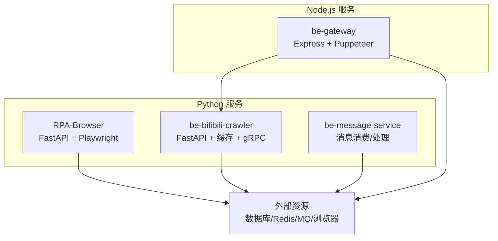
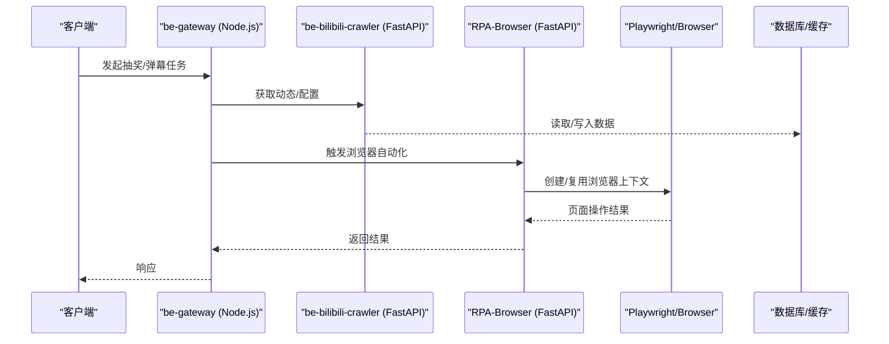
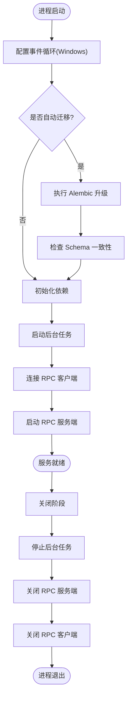
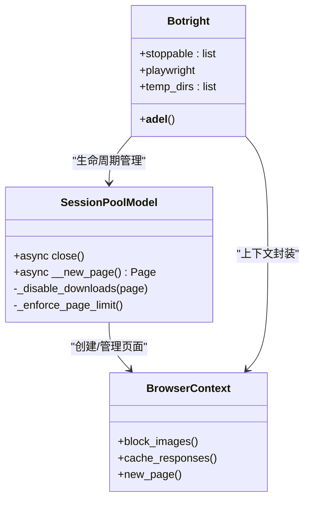
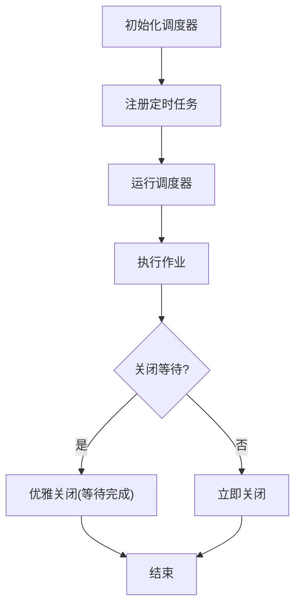
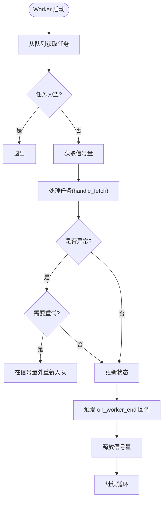
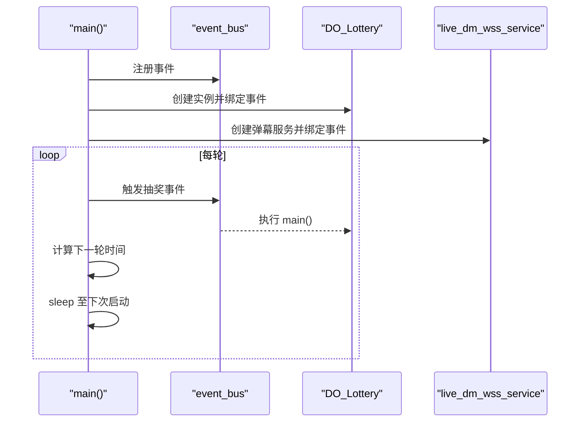
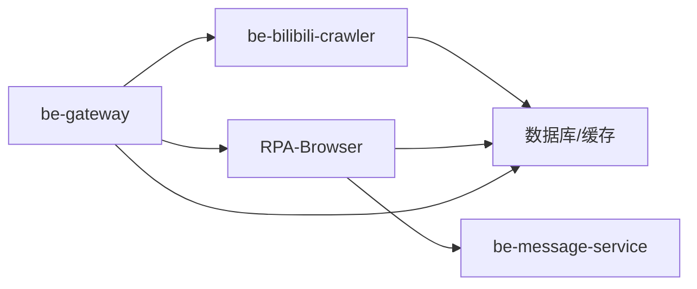

# 内存和性能问题排查

<cite>
**本文引用的文件**
- [RPA-Browser/main.py](file://RPA-Browser/main.py)
- [be-bilibili-crawler/main.py](file://be-bilibili-crawler/main.py)
- [be-gateway/index.js](file://be-gateway/index.js)
- [RPA-Browser/app/scheduler_manager.py](file://RPA-Browser/app/scheduler_manager.py)
- [RPA-Browser/botright/botright.py](file://RPA-Browser/botright/botright.py)
- [RPA-Browser/botright/playwright_mock/browser.py](file://RPA-Browser/botright/playwright_mock/browser.py)
- [RPA-Browser/app/services/RPA_browser/browser_session_pool/session_pool_model.py](file://RPA-Browser/app/services/RPA_browser/browser_session_pool/session_pool_model.py)
- [be-bilibili-crawler/Service/BaseCrawler/CrawlerType.py](file://be-bilibili-crawler/Service/BaseCrawler/CrawlerType.py)
- [be-bilibili-crawler/Utils/GrpcUtils/CONST.py](file://be-bilibili-crawler/Utils/GrpcUtils/CONST.py)
</cite>

## 目录
1. [简介](#简介)
2. [项目结构](#项目结构)
3. [核心组件](#核心组件)
4. [架构总览](#架构总览)
5. [详细组件分析](#详细组件分析)
6. [依赖关系分析](#依赖关系分析)
7. [性能与内存优化建议](#性能与内存优化建议)
8. [故障排查指南](#故障排查指南)
9. [结论](#结论)
10. [附录](#附录)

## 简介
本指南面向本项目中的 Python（FastAPI、Playwright 浏览器自动化、异步任务调度）与 Node.js（Express/Puppeteer 网关）服务，提供系统化的内存泄漏检测、CPU 使用率过高、线程阻塞、GC 频繁等问题的分析方法与实践方案。结合浏览器自动化、爬虫并发、消息处理等典型场景，给出可操作的定位步骤、工具链与调优策略，帮助快速定位瓶颈并提升稳定性与吞吐。

## 项目结构
- RPA-Browser：基于 FastAPI + Playwright 的浏览器自动化服务，包含会话池、定时任务、RPC 客户端与服务端、生命周期管理。
- be-bilibili-crawler：基于 FastAPI 的爬虫数据服务，集成缓存、中间件、异常上报、gRPC 模块与后台任务。
- be-gateway：Node.js 入口，聚合 Puppeteer 抽奖与直播弹幕等流程，通过事件总线协调多实例。
- Vue3FrontEndDemoExercise：前端工程（与本指南关联度较低）。
- 其他：消息服务、通用库、Go IPv6 代理、Java Unidbg 等。

**图表来源**
- [RPA-Browser/main.py:36-63](file://RPA-Browser/main.py#L36-L63)
- [be-bilibili-crawler/main.py:48-60](file://be-bilibili-crawler/main.py#L48-L60)
- [be-gateway/index.js:176-357](file://be-gateway/index.js#L176-L357)

**章节来源**
- [RPA-Browser/main.py:1-83](file://RPA-Browser/main.py#L1-L83)
- [be-bilibili-crawler/main.py:1-119](file://be-bilibili-crawler/main.py#L1-L119)
- [be-gateway/index.js:1-361](file://be-gateway/index.js#L1-L361)

## 核心组件
- 应用生命周期与启动：RPA-Browser 在 lifespan 中执行迁移、初始化依赖、启动后台任务、连接 RPC 客户端与服务端；crawler 服务启用内存缓存与路由注册。
- 浏览器会话与上下文：Botright 封装 Playwright，管理浏览器实例、页面数量限制、下载禁用、响应缓存与图片拦截，确保资源释放。
- 任务调度与并发：RPA-Browser 使用 AsyncIOScheduler 管理定时任务；crawler 使用固定 worker 模型与信号量控制并发，避免死锁。
- 网关编排：be-gateway 通过事件总线驱动多个抽奖实例，循环触发任务并计算下一轮时间。

**章节来源**
- [RPA-Browser/main.py:36-63](file://RPA-Browser/main.py#L36-L63)
- [be-bilibili-crawler/main.py:48-60](file://be-bilibili-crawler/main.py#L48-L60)
- [RPA-Browser/botright/botright.py:161-194](file://RPA-Browser/botright/botright.py#L161-L194)
- [RPA-Browser/botright/playwright_mock/browser.py:77-117](file://RPA-Browser/botright/playwright_mock/browser.py#L77-L117)
- [RPA-Browser/app/scheduler_manager.py:13-33](file://RPA-Browser/app/scheduler_manager.py#L13-L33)
- [be-bilibili-crawler/Service/BaseCrawler/CrawlerType.py:344-361](file://be-bilibili-crawler/Service/BaseCrawler/CrawlerType.py#L344-L361)
- [be-gateway/index.js:176-357](file://be-gateway/index.js#L176-L357)

## 架构总览
下图展示请求从网关到后端服务的调用路径，以及浏览器会话的生命周期管理与资源回收。

**图表来源**
- [be-gateway/index.js:176-357](file://be-gateway/index.js#L176-L357)
- [be-bilibili-crawler/main.py:48-60](file://be-bilibili-crawler/main.py#L48-L60)
- [RPA-Browser/main.py:36-63](file://RPA-Browser/main.py#L36-L63)
- [RPA-Browser/botright/botright.py:161-194](file://RPA-Browser/botright/botright.py#L161-L194)

## 详细组件分析

### RPA-Browser 应用生命周期与资源管理
- 启动阶段：Windows 事件循环适配、Alembic 升级与 Schema 校验、依赖初始化、后台任务启动、RPC 客户端连接与 RPC 服务端启动。
- 关闭阶段：停止后台任务、关闭 RPC 服务端与客户端，保证资源有序释放。
- 风险点：若迁移失败或依赖未就绪，可能导致后续请求阻塞或资源泄漏。

**图表来源**
- [RPA-Browser/main.py:17-63](file://RPA-Browser/main.py#L17-L63)

**章节来源**
- [RPA-Browser/main.py:17-63](file://RPA-Browser/main.py#L17-L63)

### 浏览器会话池与上下文管理
- 会话关闭：强制关闭时关闭浏览器生成器，记录反馈并标记已关闭。
- 新页面创建：创建前检查页面数量上限，禁用下载功能，记录当前页面总数。
- 上下文清理：析构时遍历可停止对象，逐个关闭浏览器实例，停止 Playwright 引擎，清理临时目录。

**图表来源**
- [RPA-Browser/app/services/RPA_browser/browser_session_pool/session_pool_model.py:269-305](file://RPA-Browser/app/services/RPA_browser/browser_session_pool/session_pool_model.py#L269-L305)
- [RPA-Browser/botright/botright.py:161-194](file://RPA-Browser/botright/botright.py#L161-L194)
- [RPA-Browser/botright/playwright_mock/browser.py:77-117](file://RPA-Browser/botright/playwright_mock/browser.py#L77-L117)

**章节来源**
- [RPA-Browser/app/services/RPA_browser/browser_session_pool/session_pool_model.py:269-305](file://RPA-Browser/app/services/RPA_browser/browser_session_pool/session_pool_model.py#L269-L305)
- [RPA-Browser/botright/botright.py:161-194](file://RPA-Browser/botright/botright.py#L161-L194)
- [RPA-Browser/botright/playwright_mock/browser.py:77-117](file://RPA-Browser/botright/playwright_mock/browser.py#L77-L117)

### 定时任务调度器
- 单例模式：全局唯一调度器实例，避免重复创建导致资源浪费。
- 关闭策略：支持等待任务完成后再关闭，防止中断正在执行的作业。
- 同步包装：将同步函数包装为异步，便于在异步环境中安全执行。

**图表来源**
- [RPA-Browser/app/scheduler_manager.py:13-33](file://RPA-Browser/app/scheduler_manager.py#L13-L33)
- [RPA-Browser/app/scheduler_manager.py:164-188](file://RPA-Browser/app/scheduler_manager.py#L164-L188)

**章节来源**
- [RPA-Browser/app/scheduler_manager.py:13-33](file://RPA-Browser/app/scheduler_manager.py#L13-L33)
- [RPA-Browser/app/scheduler_manager.py:164-188](file://RPA-Browser/app/scheduler_manager.py#L164-L188)

### 爬虫 Worker 并发模型
- 固定池模式：worker 持续从队列取任务，使用信号量控制并发数。
- 重试与入队：失败且需重试时在信号量作用域外重新入队，避免 max_sem=1 时的死锁。
- 统计与清理：运行结束时统一触发插件回调，进行统计报告与资源清理。

**图表来源**
- [be-bilibili-crawler/Service/BaseCrawler/CrawlerType.py:344-361](file://be-bilibili-crawler/Service/BaseCrawler/CrawlerType.py#L344-L361)

**章节来源**
- [be-bilibili-crawler/Service/BaseCrawler/CrawlerType.py:344-361](file://be-bilibili-crawler/Service/BaseCrawler/CrawlerType.py#L344-L361)

### Node.js 网关任务编排
- 事件驱动：通过事件总线注册并触发抽奖与弹幕服务。
- 循环调度：每轮结束后计算下一轮时间，延迟启动以避免资源竞争。
- 错误恢复：网络或解析失败时记录日志并重试。

**图表来源**
- [be-gateway/index.js:176-357](file://be-gateway/index.js#L176-L357)

**章节来源**
- [be-gateway/index.js:176-357](file://be-gateway/index.js#L176-L357)

## 依赖关系分析
- 服务间耦合：
  - be-gateway 依赖 be-bilibili-crawler 获取动态与配置。
  - RPA-Browser 通过 RPC 与 be-message-service 交互，提供资源详情。
- 外部依赖：
  - 数据库、缓存、消息队列、浏览器内核（Chromium/Playwright）。
- 潜在环路与风险：
  - 若 RPC 超时或 MQ 积压，可能引发上游请求堆积与内存增长。
  - 浏览器上下文未及时关闭会导致句柄泄漏与内存膨胀。

**图表来源**
- [be-gateway/index.js:176-357](file://be-gateway/index.js#L176-L357)
- [RPA-Browser/main.py:36-63](file://RPA-Browser/main.py#L36-L63)
- [be-bilibili-crawler/main.py:48-60](file://be-bilibili-crawler/main.py#L48-L60)

**章节来源**
- [be-gateway/index.js:176-357](file://be-gateway/index.js#L176-L357)
- [RPA-Browser/main.py:36-63](file://RPA-Browser/main.py#L36-L63)
- [be-bilibili-crawler/main.py:48-60](file://be-bilibili-crawler/main.py#L48-L60)

## 性能与内存优化建议

### Python 进程监控与内存泄漏检测
- 推荐工具：
  - tracemalloc：定位分配热点，识别持续增长的对象。
  - objgraph：可视化引用图，查找强引用导致的泄漏。
  - py-spy/pyinstrument：采样式 CPU 火焰图与热点函数定位。
  - memory_profiler：逐行内存占用分析。
- 实践要点：
  - 在长驻服务中定期采集快照，对比增量变化。
  - 关注浏览器上下文、Page、Response 等重型对象的显式释放。
  - 对批量数据处理采用流式/分块方式，避免一次性加载。

**章节来源**
- [RPA-Browser/botright/botright.py:161-194](file://RPA-Browser/botright/botright.py#L161-L194)
- [RPA-Browser/app/services/RPA_browser/browser_session_pool/session_pool_model.py:269-305](file://RPA-Browser/app/services/RPA_browser/browser_session_pool/session_pool_model.py#L269-L305)

### Node.js 内存分析与 GC 调优
- 推荐工具：
  - node --inspect + Chrome DevTools：堆快照、Allocation instrumentation。
  - clinic.js / 0x：火焰图与热点分析。
  - PM2 生态：配合 pm2 monit/pm2 logs 观察内存曲线。
- 实践要点：
  - 避免全局大对象累积，及时释放定时器与事件监听。
  - 合理设置 V8 堆大小与 GC 参数（如 --max-old-space-size）。
  - 对 Puppeteer 实例进行池化与生命周期管理，避免频繁创建销毁。

**章节来源**
- [be-gateway/index.js:176-357](file://be-gateway/index.js#L176-L357)

### 浏览器自动化内存管理
- 关键策略：
  - 限制页面数量，避免过多 Tab 导致内存暴涨。
  - 禁用不必要的功能（下载、图片），减少渲染开销。
  - 使用响应缓存与拦截，降低网络与解析压力。
  - 确保析构时关闭所有浏览器实例与临时目录。
- 参考实现：
  - 页面创建前检查上限，记录当前页面数。
  - 析构时遍历可停止对象，逐个关闭并清理。

**章节来源**
- [RPA-Browser/app/services/RPA_browser/browser_session_pool/session_pool_model.py:291-305](file://RPA-Browser/app/services/RPA_browser/browser_session_pool/session_pool_model.py#L291-L305)
- [RPA-Browser/botright/botright.py:179-194](file://RPA-Browser/botright/botright.py#L179-L194)
- [RPA-Browser/botright/playwright_mock/browser.py:88-95](file://RPA-Browser/botright/playwright_mock/browser.py#L88-L95)

### 爬虫性能调优与并发控制
- 并发模型：
  - 使用信号量控制最大并发，避免 I/O 风暴。
  - 失败重试在信号量外重新入队，防止死锁。
- 资源利用：
  - 合理设置抓取间隔与速率限制，降低目标站压力。
  - 使用缓存与去重，减少重复请求。
- 监控指标：
  - 成功率、超时率、重试次数、队列长度、worker 利用率。

**章节来源**
- [be-bilibili-crawler/Service/BaseCrawler/CrawlerType.py:344-361](file://be-bilibili-crawler/Service/BaseCrawler/CrawlerType.py#L344-L361)

### 消息处理效率提升
- 建议：
  - 消费者侧增加背压与限流，避免瞬时峰值导致内存飙升。
  - 批处理与幂等设计，减少重复处理与存储压力。
  - 监控队列堆积与消费延迟，及时调整并行度。

[本节为通用建议，不直接分析具体文件]

## 故障排查指南

### 内存泄漏排查
- 现象：进程内存持续增长，GC 频繁但无法回落。
- 步骤：
  - Python：使用 tracemalloc 与 objgraph 对比快照，定位未释放对象。
  - Node.js：使用 heap snapshot 与 Allocation timeline 查找增长源。
  - 浏览器：检查页面数量上限与上下文关闭逻辑，确认无悬挂 Page/Context。
- 参考位置：
  - 会话关闭与页面创建逻辑。
  - 析构清理与临时目录清理。

**章节来源**
- [RPA-Browser/app/services/RPA_browser/browser_session_pool/session_pool_model.py:269-305](file://RPA-Browser/app/services/RPA_browser/browser_session_pool/session_pool_model.py#L269-L305)
- [RPA-Browser/botright/botright.py:179-194](file://RPA-Browser/botright/botright.py#L179-L194)

### CPU 使用率过高
- 现象：单核或多核长期高占用，请求延迟上升。
- 步骤：
  - Python：使用 py-spy 采样，定位热点函数与阻塞点。
  - Node.js：使用 0x 生成火焰图，识别同步阻塞或密集计算。
  - 浏览器：减少渲染负载（禁用图片、缓存响应），优化脚本执行。
- 参考位置：
  - 中间件耗时统计与异常上报。
  - 网关循环与事件触发频率。

**章节来源**
- [be-bilibili-crawler/main.py:63-91](file://be-bilibili-crawler/main.py#L63-L91)
- [be-gateway/index.js:272-357](file://be-gateway/index.js#L272-L357)

### 线程/协程阻塞
- 现象：请求排队、超时增多，队列堆积。
- 步骤：
  - 检查信号量与队列长度，确认是否存在死锁或过度竞争。
  - 审查重试逻辑是否在正确的作用域内执行。
  - 评估 I/O 密集型任务的拆分与批处理策略。
- 参考位置：
  - Worker 模型与信号量使用。

**章节来源**
- [be-bilibili-crawler/Service/BaseCrawler/CrawlerType.py:344-361](file://be-bilibili-crawler/Service/BaseCrawler/CrawlerType.py#L344-L361)

### GC 频繁
- 现象：短生命周期对象过多，新生代 GC 频繁。
- 步骤：
  - Node.js：调整 V8 堆大小，减少临时大对象创建。
  - Python：避免在热点路径中创建大型列表/字典，改用生成器或流式处理。
  - 浏览器：启用响应缓存，减少重复解析。
- 参考位置：
  - 网关循环与文件读写。
  - 浏览器上下文缓存与拦截。

**章节来源**
- [be-gateway/index.js:47-170](file://be-gateway/index.js#L47-L170)
- [RPA-Browser/botright/playwright_mock/browser.py:88-95](file://RPA-Browser/botright/playwright_mock/browser.py#L88-L95)

### 浏览器自动化相关
- 常见问题：
  - 页面过多导致内存爆炸。
  - 下载与图片渲染带来额外开销。
  - 上下文未关闭导致句柄泄漏。
- 解决策略：
  - 严格限制页面数量，及时关闭无用页面。
  - 禁用下载与图片，启用缓存。
  - 确保析构时清理所有资源。

**章节来源**
- [RPA-Browser/app/services/RPA_browser/browser_session_pool/session_pool_model.py:291-305](file://RPA-Browser/app/services/RPA_browser/browser_session_pool/session_pool_model.py#L291-L305)
- [RPA-Browser/botright/botright.py:179-194](file://RPA-Browser/botright/botright.py#L179-L194)

## 结论
通过对 RPA-Browser、be-bilibili-crawler 与 be-gateway 的关键路径进行分析，明确了浏览器会话管理、任务调度与并发控制的核心风险点。结合 Python 与 Node.js 的监控与诊断工具，可在实际生产环境中快速定位内存泄漏、CPU 瓶颈与阻塞问题。建议在浏览器自动化场景中强化页面与上下文的生命周期管理，在爬虫与消息处理中引入合理的并发与背压机制，并通过持续监控与压测验证优化效果。

## 附录

### 常用命令与工具清单
- Python：
  - python -m tracemalloc
  - pip install py-spy && py-spy top/dump
  - pip install memory_profiler && mprof run/call
- Node.js：
  - node --inspect app.js
  - npm i -g 0x && 0x app.js
  - pm2 monit / pm2 logs
- 浏览器：
  - Playwright 调试：PWDEBUG=1
  - Chromium 标志：--disable-extensions --disable-gpu --no-sandbox

[本节为通用建议，不直接分析具体文件]