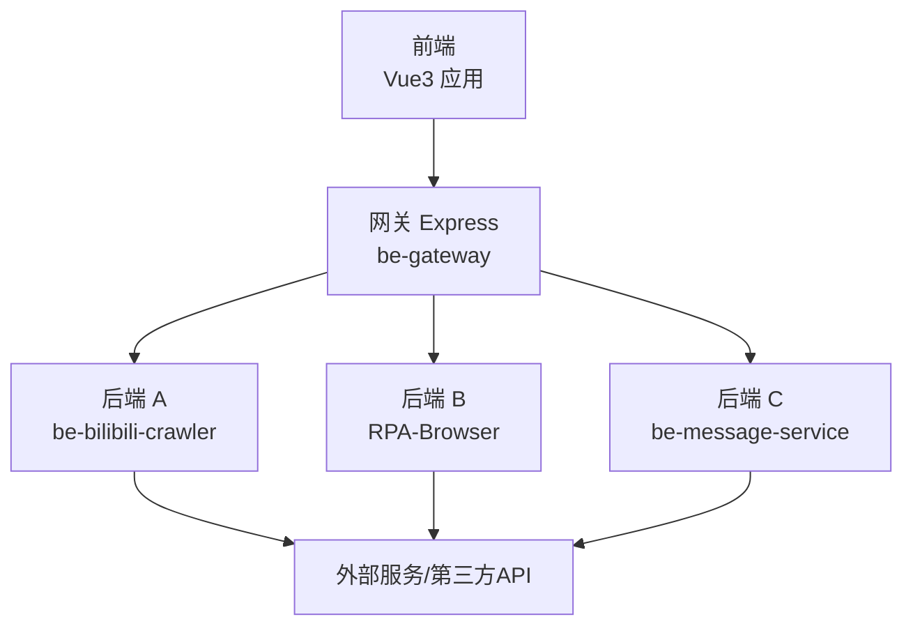
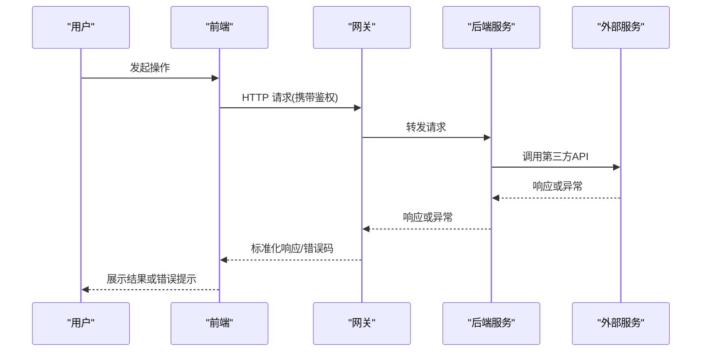
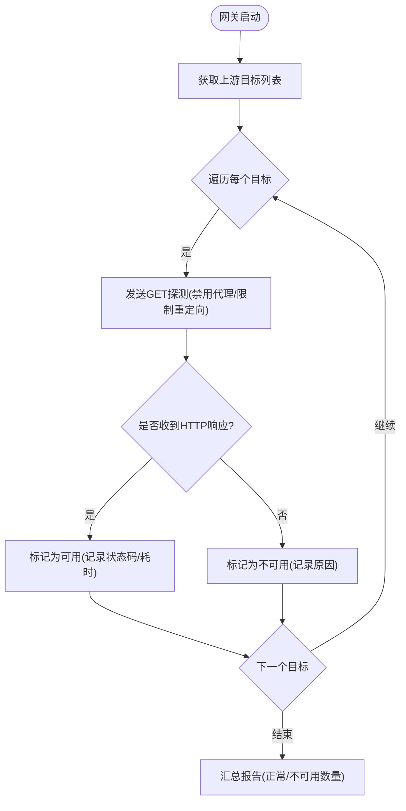
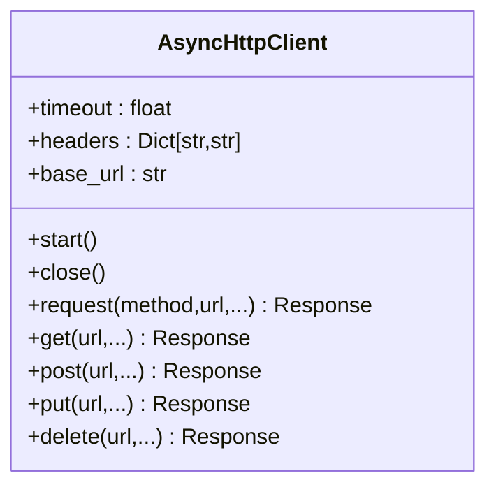
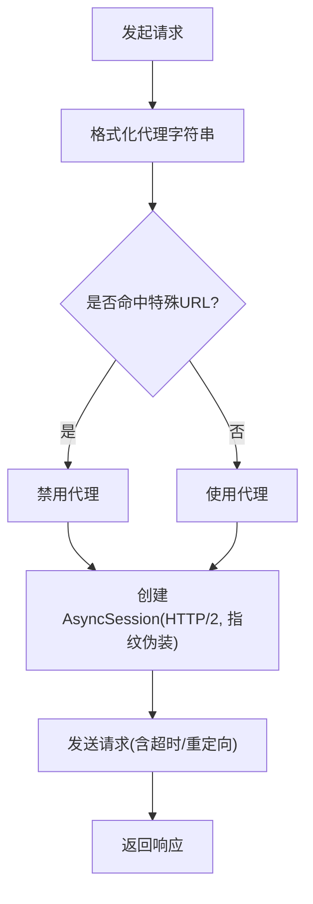
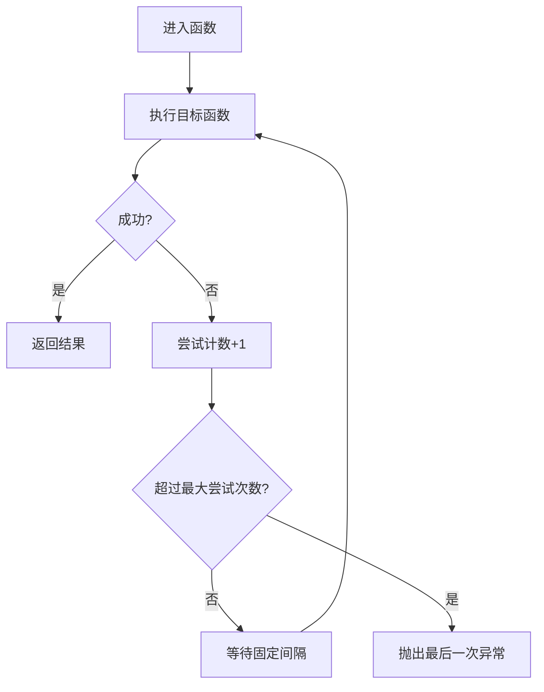
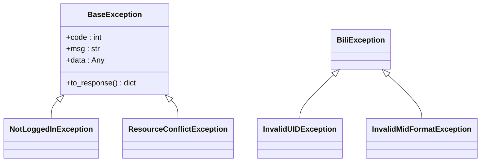
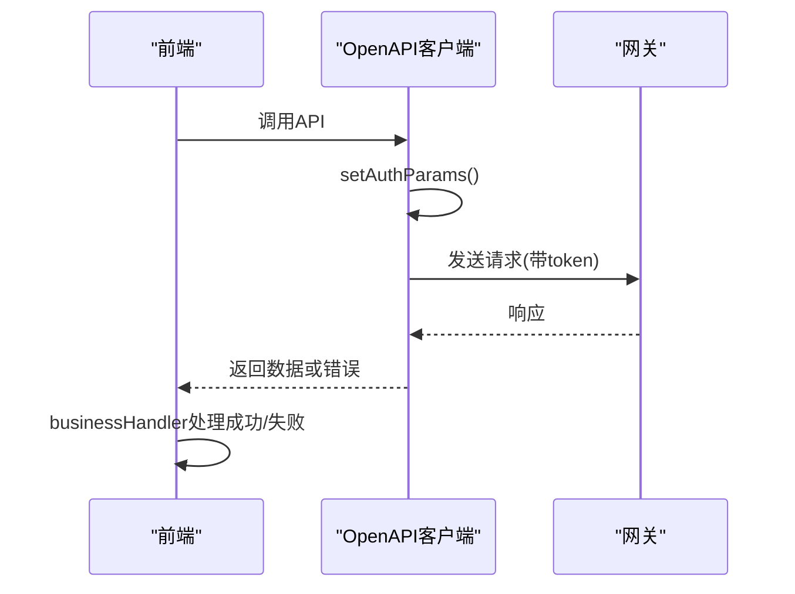
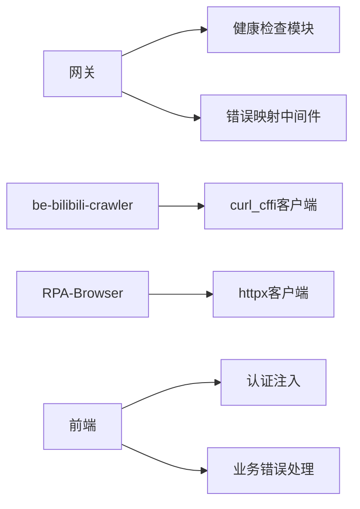

# 外部服务集成问题排查

<cite>
**本文引用的文件**
- [be-gateway/ExpressServerEnd/app.js](file://be-gateway/ExpressServerEnd/app.js)
- [be-gateway/ExpressServerEnd/Service/upstream_health_module/upstream_health_service.js](file://be-gateway/ExpressServerEnd/Service/upstream_health_module/upstream_health_service.js)
- [RPA-Browser/app/utils/http/httpx_client.py](file://RPA-Browser/app/utils/http/httpx_client.py)
- [RPA-Browser/app/services/execution/actions/fetch_external_data.py](file://RPA-Browser/app/services/execution/actions/fetch_external_data.py)
- [be-bilibili-crawler/Utils/代理/SealedRequests.py](file://be-bilibili-crawler/Utils/代理/SealedRequests.py)
- [be-bilibili-crawler/Utils/通用/Common.py](file://be-bilibili-crawler/Utils/通用/Common.py)
- [bili-common/bili_common/exceptions.py](file://bili-common/bili_common/exceptions.py)
- [Vue3FrontEndDemoExercise/src/api/community/hey-api/services/DefaultService.gen.ts](file://Vue3FrontEndDemoExercise/src/api/community/hey-api/services/DefaultService.gen.ts)
- [Vue3FrontEndDemoExercise/src/api/community/hey-api/client/utils.gen.ts](file://Vue3FrontEndDemoExercise/src/api/community/hey-api/client/utils.gen.ts)
- [Vue3FrontEndDemoExercise/src/utils/businessHandler.ts](file://Vue3FrontEndDemoExercise/src/utils/businessHandler.ts)
</cite>

## 目录
1. [简介](#简介)
2. [项目结构](#项目结构)
3. [核心组件](#核心组件)
4. [架构总览](#架构总览)
5. [详细组件分析](#详细组件分析)
6. [依赖关系分析](#依赖关系分析)
7. [性能与稳定性](#性能与稳定性)
8. [故障排查指南](#故障排查指南)
9. [结论](#结论)
10. [附录](#附录)

## 简介
本手册面向“外部服务集成”的排障与加固，覆盖第三方 API 调用失败、代理服务连接异常、AI 服务响应超时、认证令牌过期等典型问题。结合仓库中网关、HTTP 客户端、重试与熔断、健康检查、统一异常处理等实现，提供可操作的诊断步骤与改进建议，帮助快速定位并解决问题。

## 项目结构
本项目由多个子系统组成：
- be-gateway：Express 网关，负责路由转发、上游健康检查、超时与错误码映射、CORS/安全头配置。
- RPA-Browser：Python FastAPI 服务，封装 httpx 异步 HTTP 客户端，提供抓取外部数据的能力。
- be-bilibili-crawler：Python 爬虫与服务，包含自定义 HTTP 客户端（基于 curl_cffi）、SSL 指纹模拟、代理格式化工具、重试装饰器。
- Vue3FrontEndDemoExercise：前端，自动生成 OpenAPI 客户端，统一注入认证参数，业务层统一错误处理。
- bili-common：公共异常与响应契约，统一对外返回 {code, msg, data}。

**图表来源**
- [be-gateway/ExpressServerEnd/app.js:33-117](file://be-gateway/ExpressServerEnd/app.js#L33-L117)
- [be-gateway/ExpressServerEnd/Service/upstream_health_module/upstream_health_service.js:14-36](file://be-gateway/ExpressServerEnd/Service/upstream_health_module/upstream_health_service.js#L14-L36)

**章节来源**
- [be-gateway/ExpressServerEnd/app.js:33-117](file://be-gateway/ExpressServerEnd/app.js#L33-L117)
- [be-gateway/ExpressServerEnd/Service/upstream_health_module/upstream_health_service.js:14-36](file://be-gateway/ExpressServerEnd/Service/upstream_health_module/upstream_health_service.js#L14-L36)

## 核心组件
- 网关错误映射与健康检查：将网络/超时错误映射为 502/504，启动时探测上游可达性。
- Python HTTP 客户端：httpx 异步封装与 curl_cffi 异步会话，支持代理、超时、重定向、浏览器指纹伪装。
- 重试机制：通用重试装饰器，固定退避间隔，记录尝试次数与最终异常。
- 统一异常契约：FastAPI 全局异常处理器，保证对外返回 {code, msg, data}，区分业务异常与协议异常。
- 前端认证注入与错误处理：OpenAPI 客户端自动注入 token，业务层统一捕获并提示。

**章节来源**
- [be-gateway/ExpressServerEnd/app.js:35-66](file://be-gateway/ExpressServerEnd/app.js#L35-L66)
- [be-gateway/ExpressServerEnd/Service/upstream_health_module/upstream_health_service.js:47-122](file://be-gateway/ExpressServerEnd/Service/upstream_health_module/upstream_health_service.js#L47-L122)
- [RPA-Browser/app/utils/http/httpx_client.py:15-122](file://RPA-Browser/app/utils/http/httpx_client.py#L15-L122)
- [be-bilibili-crawler/Utils/代理/SealedRequests.py:218-382](file://be-bilibili-crawler/Utils/代理/SealedRequests.py#L218-L382)
- [be-bilibili-crawler/Utils/通用/Common.py:318-345](file://be-bilibili-crawler/Utils/通用/Common.py#L318-L345)
- [bili-common/bili_common/exceptions.py:122-250](file://bili-common/bili_common/exceptions.py#L122-L250)
- [Vue3FrontEndDemoExercise/src/api/community/hey-api/client/utils.gen.ts:152-186](file://Vue3FrontEndDemoExercise/src/api/community/hey-api/client/utils.gen.ts#L152-L186)
- [Vue3FrontEndDemoExercise/src/utils/businessHandler.ts:106-193](file://Vue3FrontEndDemoExercise/src/utils/businessHandler.ts#L106-L193)

## 架构总览
网关作为统一入口，对上游服务进行健康检查与请求转发；后端通过统一的 HTTP 客户端访问第三方服务；前端通过生成的客户端注入认证信息并统一处理错误。

**图表来源**
- [be-gateway/ExpressServerEnd/app.js:119-184](file://be-gateway/ExpressServerEnd/app.js#L119-L184)
- [RPA-Browser/app/utils/http/httpx_client.py:68-122](file://RPA-Browser/app/utils/http/httpx_client.py#L68-L122)
- [be-bilibili-crawler/Utils/代理/SealedRequests.py:308-382](file://be-bilibili-crawler/Utils/代理/SealedRequests.py#L308-L382)
- [Vue3FrontEndDemoExercise/src/api/community/hey-api/client/utils.gen.ts:152-186](file://Vue3FrontEndDemoExercise/src/api/community/hey-api/client/utils.gen.ts#L152-L186)

## 详细组件分析

### 网关错误映射与健康检查
- 错误映射：将 ETIMEDOUT/ESOCKETTIMEDOUT 映射为 504，其他上游网络错误映射为 502，便于监控与告警。
- 健康检查：启动时对上游目标发送 GET 探测，忽略非 2xx 状态码，仅连接失败视为不可用。

**图表来源**
- [be-gateway/ExpressServerEnd/Service/upstream_health_module/upstream_health_service.js:47-122](file://be-gateway/ExpressServerEnd/Service/upstream_health_module/upstream_health_service.js#L47-L122)

**章节来源**
- [be-gateway/ExpressServerEnd/app.js:35-66](file://be-gateway/ExpressServerEnd/app.js#L35-L66)
- [be-gateway/ExpressServerEnd/app.js:119-184](file://be-gateway/ExpressServerEnd/app.js#L119-L184)
- [be-gateway/ExpressServerEnd/Service/upstream_health_module/upstream_health_service.js:47-122](file://be-gateway/ExpressServerEnd/Service/upstream_health_module/upstream_health_service.js#L47-L122)

### Python HTTP 客户端（RPA-Browser）
- 使用 httpx.AsyncClient 封装 GET/POST/PUT/DELETE，支持上下文管理、默认超时、随机指纹头。
- 全局单例客户端，可按需创建临时客户端以覆盖超时。

**图表来源**
- [RPA-Browser/app/utils/http/httpx_client.py:15-122](file://RPA-Browser/app/utils/http/httpx_client.py#L15-L122)

**章节来源**
- [RPA-Browser/app/utils/http/httpx_client.py:15-122](file://RPA-Browser/app/utils/http/httpx_client.py#L15-L122)
- [RPA-Browser/app/utils/http/httpx_client.py:236-305](file://RPA-Browser/app/utils/http/httpx_client.py#L236-L305)

### Python HTTP 客户端（be-bilibili-crawler）
- 基于 curl_cffi 的 AsyncSession，支持 HTTP/2、浏览器指纹伪装、代理格式化。
- 针对特定 URL（如验证码接口）跳过代理，避免被拦截。
- SSL 工厂可定制密码套件与 ALPN，增强兼容性。

**图表来源**
- [be-bilibili-crawler/Utils/代理/SealedRequests.py:218-382](file://be-bilibili-crawler/Utils/代理/SealedRequests.py#L218-L382)

**章节来源**
- [be-bilibili-crawler/Utils/代理/SealedRequests.py:22-85](file://be-bilibili-crawler/Utils/代理/SealedRequests.py#L22-L85)
- [be-bilibili-crawler/Utils/代理/SealedRequests.py:218-382](file://be-bilibili-crawler/Utils/代理/SealedRequests.py#L218-L382)

### 重试机制
- 通用重试装饰器：固定间隔重试，记录每次失败日志，达到上限后抛出最后一次异常。
- 适用于不稳定网络或第三方限流场景。

**图表来源**
- [be-bilibili-crawler/Utils/通用/Common.py:318-345](file://be-bilibili-crawler/Utils/通用/Common.py#L318-L345)

**章节来源**
- [be-bilibili-crawler/Utils/通用/Common.py:318-345](file://be-bilibili-crawler/Utils/通用/Common.py#L318-L345)

### 统一异常契约（bili-common）
- 业务异常：HTTP 200 + {code, msg, data}，用于未登录、资源冲突等业务场景。
- HTTP 异常：保留原 status_code，body 仍为统一契约。
- 参数校验失败：HTTP 400 + {code: 400, msg, data}。
- 未捕获异常：HTTP 500 + {code: 500, msg, data}，DEV 环境附带 traceback。

**图表来源**
- [bili-common/bili_common/exceptions.py:33-119](file://bili-common/bili_common/exceptions.py#L33-L119)

**章节来源**
- [bili-common/bili_common/exceptions.py:122-250](file://bili-common/bili_common/exceptions.py#L122-L250)

### 前端认证注入与错误处理
- 自动生成客户端在请求前注入 token（header/query/cookie），避免重复设置。
- 业务层统一处理成功/失败分支，显示通知或回调。

**图表来源**
- [Vue3FrontEndDemoExercise/src/api/community/hey-api/client/utils.gen.ts:152-186](file://Vue3FrontEndDemoExercise/src/api/community/hey-api/client/utils.gen.ts#L152-L186)
- [Vue3FrontEndDemoExercise/src/utils/businessHandler.ts:106-193](file://Vue3FrontEndDemoExercise/src/utils/businessHandler.ts#L106-L193)

**章节来源**
- [Vue3FrontEndDemoExercise/src/api/community/hey-api/client/utils.gen.ts:152-186](file://Vue3FrontEndDemoExercise/src/api/community/hey-api/client/utils.gen.ts#L152-L186)
- [Vue3FrontEndDemoExercise/src/utils/businessHandler.ts:106-193](file://Vue3FrontEndDemoExercise/src/utils/businessHandler.ts#L106-L193)

## 依赖关系分析
- 网关依赖上游服务地址配置，健康检查模块读取配置并探测连通性。
- 后端 HTTP 客户端依赖代理配置与超时策略，部分场景禁用代理以提升稳定性。
- 前端依赖生成客户端与业务处理器，确保认证与错误处理一致性。

**图表来源**
- [be-gateway/ExpressServerEnd/Service/upstream_health_module/upstream_health_service.js:14-36](file://be-gateway/ExpressServerEnd/Service/upstream_health_module/upstream_health_service.js#L14-L36)
- [be-gateway/ExpressServerEnd/app.js:35-66](file://be-gateway/ExpressServerEnd/app.js#L35-L66)
- [be-bilibili-crawler/Utils/代理/SealedRequests.py:218-382](file://be-bilibili-crawler/Utils/代理/SealedRequests.py#L218-L382)
- [RPA-Browser/app/utils/http/httpx_client.py:15-122](file://RPA-Browser/app/utils/http/httpx_client.py#L15-L122)
- [Vue3FrontEndDemoExercise/src/api/community/hey-api/client/utils.gen.ts:152-186](file://Vue3FrontEndDemoExercise/src/api/community/hey-api/client/utils.gen.ts#L152-L186)
- [Vue3FrontEndDemoExercise/src/utils/businessHandler.ts:106-193](file://Vue3FrontEndDemoExercise/src/utils/businessHandler.ts#L106-L193)

**章节来源**
- [be-gateway/ExpressServerEnd/Service/upstream_health_module/upstream_health_service.js:14-36](file://be-gateway/ExpressServerEnd/Service/upstream_health_module/upstream_health_service.js#L14-L36)
- [be-gateway/ExpressServerEnd/app.js:35-66](file://be-gateway/ExpressServerEnd/app.js#L35-L66)
- [be-bilibili-crawler/Utils/代理/SealedRequests.py:218-382](file://be-bilibili-crawler/Utils/代理/SealedRequests.py#L218-L382)
- [RPA-Browser/app/utils/http/httpx_client.py:15-122](file://RPA-Browser/app/utils/http/httpx_client.py#L15-L122)
- [Vue3FrontEndDemoExercise/src/api/community/hey-api/client/utils.gen.ts:152-186](file://Vue3FrontEndDemoExercise/src/api/community/hey-api/client/utils.gen.ts#L152-L186)
- [Vue3FrontEndDemoExercise/src/utils/businessHandler.ts:106-193](file://Vue3FrontEndDemoExercise/src/utils/businessHandler.ts#L106-L193)

## 性能与稳定性
- 超时控制：网关设置全局超时；Python 客户端支持单次传输与请求总超时；种子任务通过环境变量调整并发与超时，避免数据库连接池耗尽。
- 重试策略：固定间隔重试，适合短暂抖动；对于幂等请求可考虑指数退避。
- 健康检查：启动时并行探测上游，快速发现不可用服务。
- 并发控制：限制同时在途请求数，保护下游资源。

**章节来源**
- [be-gateway/ExpressServerEnd/app.js:83-83](file://be-gateway/ExpressServerEnd/app.js#L83-L83)
- [RPA-Browser/app/utils/http/httpx_client.py:21-38](file://RPA-Browser/app/utils/http/httpx_client.py#L21-L38)
- [be-bilibili-crawler/Utils/代理/SealedRequests.py:249-267](file://be-bilibili-crawler/Utils/代理/SealedRequests.py#L249-L267)
- [be-bilibili-crawler/Utils/通用/Common.py:318-345](file://be-bilibili-crawler/Utils/通用/Common.py#L318-L345)

## 故障排查指南

### 第三方 API 调用失败
- 现象：后端返回 502/504，或业务 code 表示失败。
- 排查步骤：
  - 检查网关错误映射是否将网络错误映射为 502/504。
  - 查看上游健康检查结果，确认目标地址是否可达。
  - 在后端 HTTP 客户端中检查代理配置、超时设置、重定向行为。
  - 对第三方 API 增加重试与降级逻辑。

**章节来源**
- [be-gateway/ExpressServerEnd/app.js:35-66](file://be-gateway/ExpressServerEnd/app.js#L35-L66)
- [be-gateway/ExpressServerEnd/Service/upstream_health_module/upstream_health_service.js:47-122](file://be-gateway/ExpressServerEnd/Service/upstream_health_module/upstream_health_service.js#L47-L122)
- [RPA-Browser/app/utils/http/httpx_client.py:68-122](file://RPA-Browser/app/utils/http/httpx_client.py#L68-L122)
- [be-bilibili-crawler/Utils/代理/SealedRequests.py:308-382](file://be-bilibili-crawler/Utils/代理/SealedRequests.py#L308-L382)

### 代理服务连接异常
- 现象：DNS 解析失败、连接拒绝、代理超时。
- 排查步骤：
  - 验证代理地址与端口是否正确，是否支持所需协议（HTTP/SOCKS）。
  - 检查 Python 客户端中的代理格式化函数是否正确转换。
  - 对特定 URL 禁用代理（如验证码接口），避免被拦截。
  - 使用健康检查模块探测上游代理目标。

**章节来源**
- [be-bilibili-crawler/Utils/代理/SealedRequests.py:98-104](file://be-bilibili-crawler/Utils/代理/SealedRequests.py#L98-L104)
- [be-bilibili-crawler/Utils/代理/SealedRequests.py:345-351](file://be-bilibili-crawler/Utils/代理/SealedRequests.py#L345-L351)
- [be-gateway/ExpressServerEnd/Service/upstream_health_module/upstream_health_service.js:47-91](file://be-gateway/ExpressServerEnd/Service/upstream_health_module/upstream_health_service.js#L47-L91)

### AI 服务响应超时
- 现象：请求长时间无响应，触发网关或客户端超时。
- 排查步骤：
  - 调整网关全局超时与后端客户端超时。
  - 对长耗时任务启用重试与降级（返回缓存或占位数据）。
  - 监控上游服务负载与延迟，必要时扩容或限流。

**章节来源**
- [be-gateway/ExpressServerEnd/app.js:83-83](file://be-gateway/ExpressServerEnd/app.js#L83-L83)
- [RPA-Browser/app/utils/http/httpx_client.py:21-38](file://RPA-Browser/app/utils/http/httpx_client.py#L21-L38)
- [be-bilibili-crawler/Utils/通用/Common.py:318-345](file://be-bilibili-crawler/Utils/通用/Common.py#L318-L345)

### 认证令牌过期
- 现象：前端请求被拒绝，返回未登录或权限不足。
- 排查步骤：
  - 检查前端是否在请求前注入 token（header/query/cookie）。
  - 确认后端是否校验 token 并返回统一业务异常。
  - 在前端业务层捕获未登录错误，引导重新登录。

**章节来源**
- [Vue3FrontEndDemoExercise/src/api/community/hey-api/client/utils.gen.ts:152-186](file://Vue3FrontEndDemoExercise/src/api/community/hey-api/client/utils.gen.ts#L152-L186)
- [bili-common/bili_common/exceptions.py:64-74](file://bili-common/bili_common/exceptions.py#L64-L74)
- [Vue3FrontEndDemoExercise/src/utils/businessHandler.ts:106-193](file://Vue3FrontEndDemoExercise/src/utils/businessHandler.ts#L106-L193)

### 网络连通性测试
- 方法：使用健康检查模块对上游目标发送 GET 探测，忽略非 2xx 状态码。
- 扩展：可在网关启动时定期执行，或在运维脚本中手动触发。

**章节来源**
- [be-gateway/ExpressServerEnd/Service/upstream_health_module/upstream_health_service.js:47-122](file://be-gateway/ExpressServerEnd/Service/upstream_health_module/upstream_health_service.js#L47-L122)

### SSL 证书验证
- 现状：Python 客户端默认 verify=True，但部分调用关闭验证（verify=False）。
- 建议：生产环境启用证书验证，配置 CA 包或使用系统信任链；对自签名证书明确指定路径。

**章节来源**
- [be-bilibili-crawler/Utils/代理/SealedRequests.py:249-267](file://be-bilibili-crawler/Utils/代理/SealedRequests.py#L249-L267)
- [be-bilibili-crawler/Utils/代理/SealedRequests.py:355-378](file://be-bilibili-crawler/Utils/代理/SealedRequests.py#L355-L378)

### 代理配置检查
- 方法：检查代理格式化函数输出，确认协议与地址正确；对特定 URL 禁用代理。
- 建议：集中管理代理配置，支持按域名或路径切换。

**章节来源**
- [be-bilibili-crawler/Utils/代理/SealedRequests.py:98-104](file://be-bilibili-crawler/Utils/代理/SealedRequests.py#L98-L104)
- [be-bilibili-crawler/Utils/代理/SealedRequests.py:345-351](file://be-bilibili-crawler/Utils/代理/SealedRequests.py#L345-L351)

### 超时重试机制
- 现有：固定间隔重试，记录尝试次数与最终异常。
- 建议：根据错误类型选择不同策略（网络错误重试，业务错误不重试）；引入指数退避与最大重试次数。

**章节来源**
- [be-bilibili-crawler/Utils/通用/Common.py:318-345](file://be-bilibili-crawler/Utils/通用/Common.py#L318-L345)

### 外部服务监控
- 方法：网关健康检查模块输出各上游服务的状态与耗时；可在监控系统采集这些指标。
- 扩展：增加慢请求告警、错误率阈值告警。

**章节来源**
- [be-gateway/ExpressServerEnd/Service/upstream_health_module/upstream_health_service.js:98-122](file://be-gateway/ExpressServerEnd/Service/upstream_health_module/upstream_health_service.js#L98-L122)

### 熔断降级
- 现状：未发现内置熔断器。
- 建议：在网关或后端增加熔断逻辑（如基于错误率或延迟阈值），触发后快速失败或返回降级数据。

[本节为概念性建议，不直接分析具体文件]

### 故障转移
- 现状：健康检查仅检测连通性，未实现自动切换。
- 建议：维护多目标列表，当主目标不可用时切换到备用目标，并记录切换事件。

[本节为概念性建议，不直接分析具体文件]

### 签名计算失败
- 现象：第三方 API 返回签名错误。
- 排查：检查请求头、参数顺序、编码方式；对敏感接口禁用代理并使用稳定网络。

[本节为通用指导，不直接分析具体文件]

### 加密解密异常
- 现象：数据无法解密或解密后格式错误。
- 排查：确认密钥版本、算法参数、填充模式；前后端保持一致。

[本节为通用指导，不直接分析具体文件]

### 数据格式不兼容
- 现象：JSON 解析失败或字段缺失。
- 排查：使用统一响应契约 {code, msg, data}；在前端严格校验数据结构。

**章节来源**
- [bili-common/bili_common/exceptions.py:122-250](file://bili-common/bili_common/exceptions.py#L122-L250)
- [Vue3FrontEndDemoExercise/src/utils/businessHandler.ts:106-193](file://Vue3FrontEndDemoExercise/src/utils/businessHandler.ts#L106-L193)

## 结论
通过网关健康检查、统一错误映射、Python HTTP 客户端的代理与超时控制、重试机制以及前端认证注入与错误处理，项目已具备较完善的外部服务集成基础。建议进一步增强熔断降级、故障转移与监控告警能力，提升系统在复杂网络环境下的稳定性与可观测性。

## 附录
- 健康检查接口：前端可通过 /health 检查服务存活与依赖（如 RabbitMQ）状态。

**章节来源**
- [Vue3FrontEndDemoExercise/src/api/community/hey-api/services/DefaultService.gen.ts:8-21](file://Vue3FrontEndDemoExercise/src/api/community/hey-api/services/DefaultService.gen.ts#L8-L21)