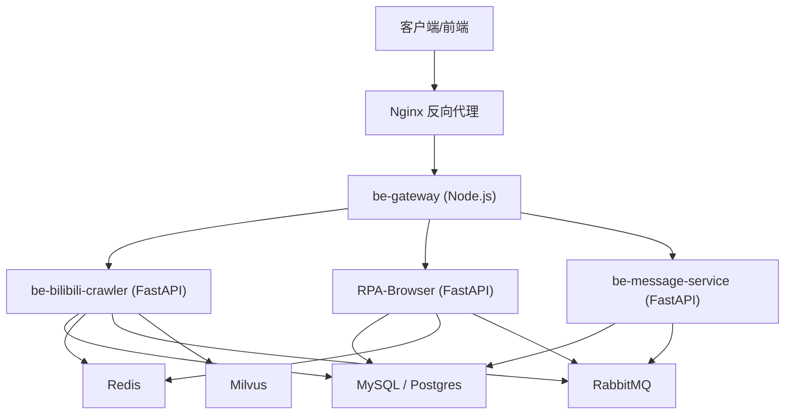
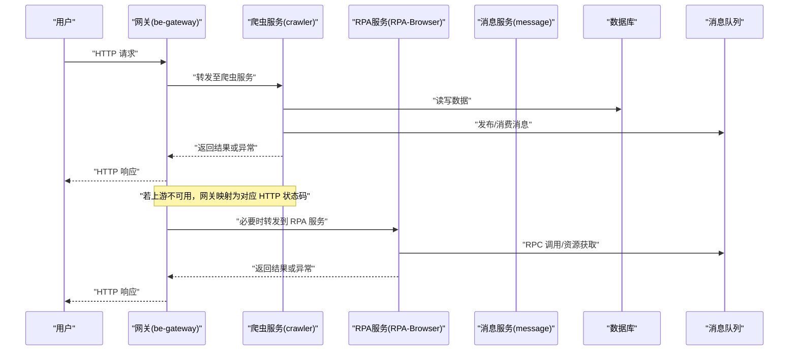
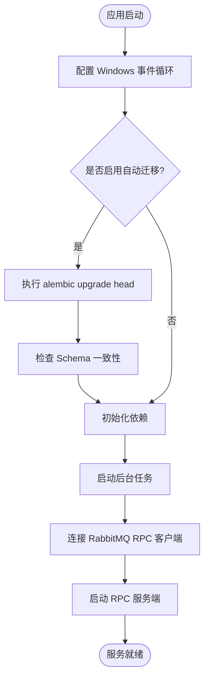
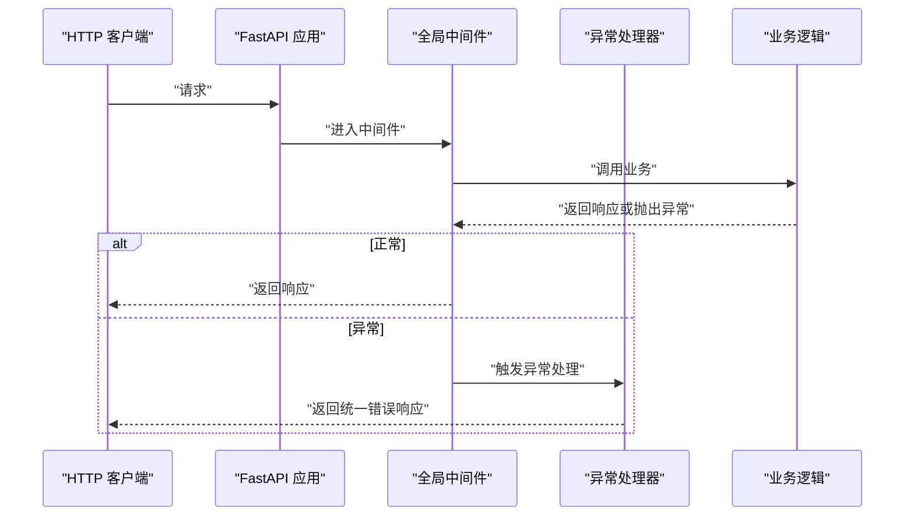
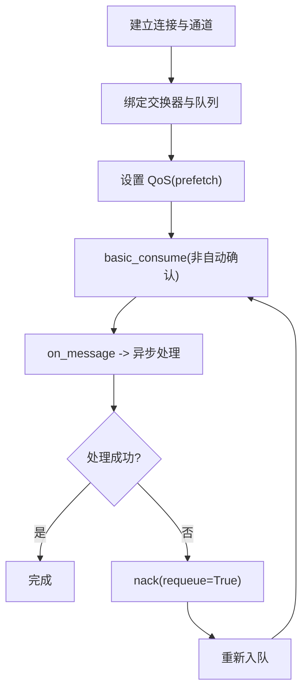
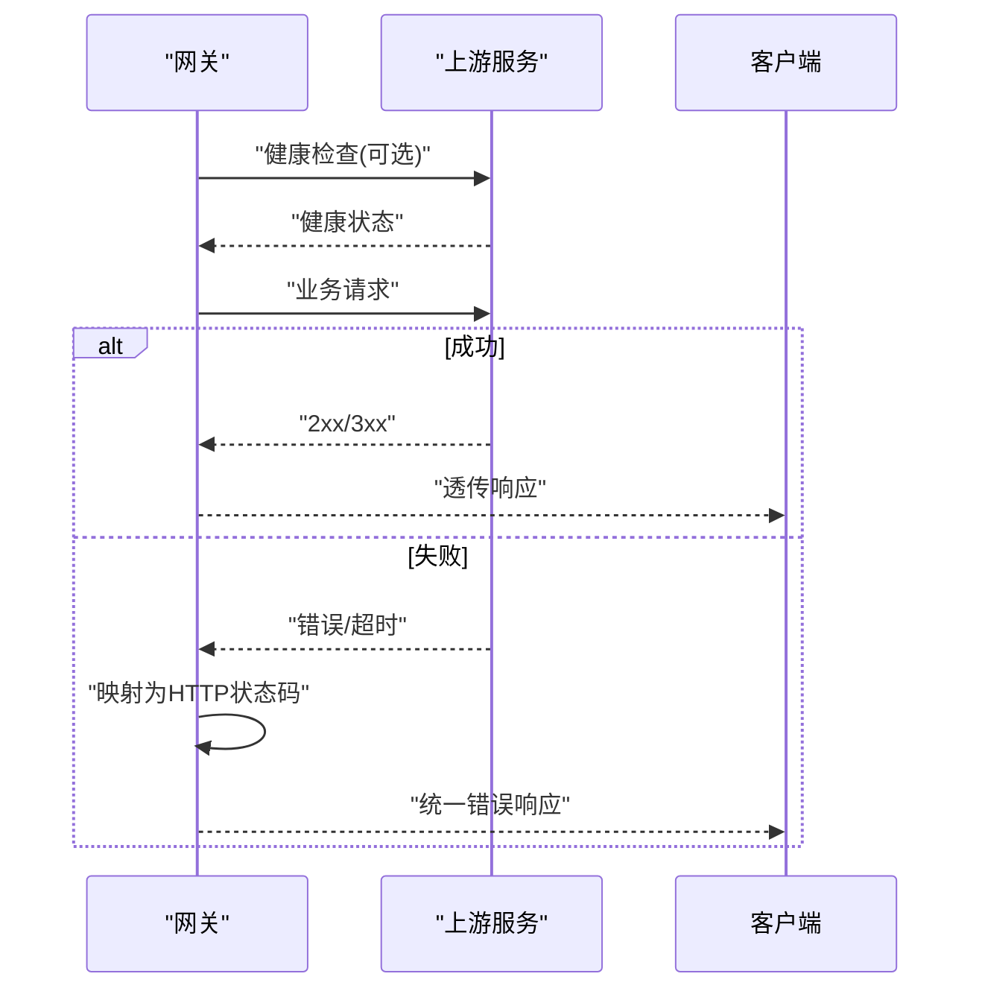
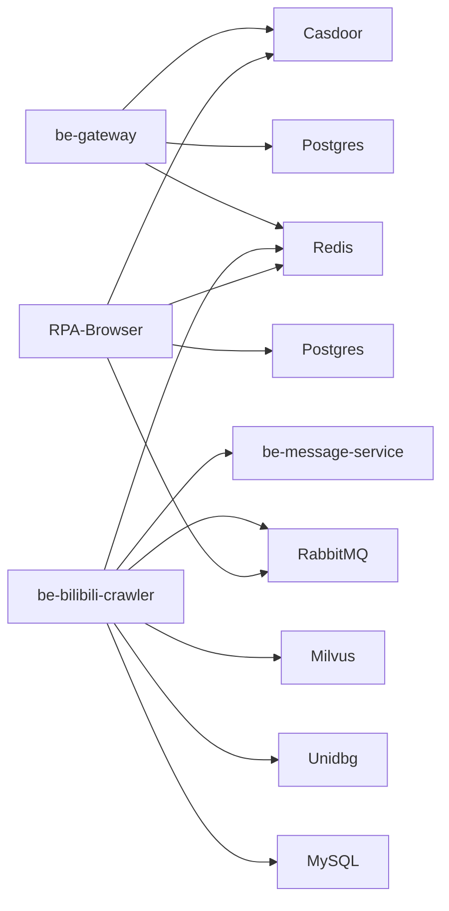

# 故障排查手册

<cite>
**本文引用的文件**
- [RPA-Browser/main.py](file://RPA-Browser/main.py)
- [RPA-Browser/app/config.py](file://RPA-Browser/app/config.py)
- [RPA-Browser/app/exceptions/handlers.py](file://RPA-Browser/app/exceptions/handlers.py)
- [be-bilibili-crawler/main.py](file://be-bilibili-crawler/main.py)
- [be-bilibili-crawler/CONFIG.py](file://be-bilibili-crawler/CONFIG.py)
- [be-bilibili-crawler/Service/MQ/base/BasicAsyncClient.py](file://be-bilibili-crawler/Service/MQ/base/BasicAsyncClient.py)
- [be-gateway/index.js](file://be-gateway/index.js)
- [be-gateway/ExpressServerEnd/app.js](file://be-gateway/ExpressServerEnd/app.js)
- [be-gateway/ExpressServerEnd/Service/upstream_health_module/upstream_health_service.js](file://be-gateway/ExpressServerEnd/Service/upstream_health_module/upstream_health_service.js)
- [docker-compose.yml](file://docker-compose.yml)
- [Vue3FrontEndDemoExercise/src/api/community/hey-api/services/DefaultService.gen.ts](file://Vue3FrontEndDemoExercise/src/api/community/hey-api/services/DefaultService.gen.ts)
</cite>

## 目录
1. [简介](#简介)
2. [项目结构](#项目结构)
3. [核心组件](#核心组件)
4. [架构总览](#架构总览)
5. [详细组件分析](#详细组件分析)
6. [依赖关系分析](#依赖关系分析)
7. [性能与容量规划](#性能与容量规划)
8. [故障排查指南](#故障排查指南)
9. [结论](#结论)
10. [附录：常用命令与检查清单](#附录：常用命令与检查清单)

## 简介
本手册面向生产与运维人员，聚焦分布式系统（RPA Browser、爬虫服务 be-bilibili-crawler、消息服务 be-message-service、网关 be-gateway、数据库/缓存/队列等）的常见故障定位与恢复。内容覆盖启动失败、连接超时、内存溢出、数据库连接问题、消息队列阻塞、API 异常等典型场景，提供从快速恢复到根因分析的完整流程，并配套调试工具使用、性能分析方法与可视化流程图。

## 项目结构
系统由多个容器化服务组成，通过 docker-compose 编排，关键服务包括：
- RPA-Browser：浏览器自动化 API（FastAPI），负责浏览器资源管理与 RPC 调用
- be-bilibili-crawler：爬虫数据服务（FastAPI），对接 MySQL/Redis/RabbitMQ/Milvus/LLM 等
- be-message-service：消息通知服务（FastAPI），统一推送与事件处理
- be-gateway：Node.js 网关，聚合上游服务并提供鉴权与路由
- 基础设施：MySQL、Postgres、Redis、RabbitMQ、Milvus、Nginx、Casdoor、Llama 等

图表来源
- [docker-compose.yml:120-164](file://docker-compose.yml#L120-L164)
- [docker-compose.yml:227-260](file://docker-compose.yml#L227-L260)
- [docker-compose.yml:261-322](file://docker-compose.yml#L261-L322)
- [docker-compose.yml:179-212](file://docker-compose.yml#L179-L212)

章节来源
- [docker-compose.yml:1-380](file://docker-compose.yml#L1-L380)

## 核心组件
- RPA-Browser：应用生命周期中执行 Alembic 迁移、初始化依赖、启动后台任务、连接 RabbitMQ RPC 客户端与服务端，暴露浏览器控制接口
- be-bilibili-crawler：注册路由、全局日志中间件、统一异常处理器、缓存初始化；配置多数据源连接池与 RabbitMQ 消费者
- be-message-service：健康检查端点校验 broker 连通性，统一推送渠道配置
- be-gateway：上游健康检查、请求错误映射为 HTTP 状态码、统一错误响应格式

章节来源
- [RPA-Browser/main.py:36-63](file://RPA-Browser/main.py#L36-L63)
- [be-bilibili-crawler/main.py:48-60](file://be-bilibili-crawler/main.py#L48-L60)
- [be-bilibili-crawler/main.py:63-112](file://be-bilibili-crawler/main.py#L63-L112)
- [be-gateway/ExpressServerEnd/app.js:163-185](file://be-gateway/ExpressServerEnd/app.js#L163-L185)
- [docker-compose.yml:310-322](file://docker-compose.yml#L310-L322)

## 架构总览
下图展示一次典型请求从网关到后端服务的调用链，以及异常时的错误传播路径。

图表来源
- [be-gateway/ExpressServerEnd/app.js:163-185](file://be-gateway/ExpressServerEnd/app.js#L163-L185)
- [RPA-Browser/main.py:50-63](file://RPA-Browser/main.py#L50-L63)
- [be-bilibili-crawler/Service/MQ/base/BasicAsyncClient.py:210-218](file://be-bilibili-crawler/Service/MQ/base/BasicAsyncClient.py#L210-L218)

## 详细组件分析

### RPA-Browser 启动与异常处理
- 启动流程：Windows 事件循环设置 → Alembic 自动迁移与 Schema 一致性检查 → 初始化依赖 → 启动后台任务 → 连接 RabbitMQ RPC 客户端 → 启动 RPC 服务端
- 异常处理：区分数据库连接丢失、自定义业务异常与未知异常；开发模式返回详细错误信息，生产模式仅返回必要字段；数据库连接丢失返回 503 并建议重试

图表来源
- [RPA-Browser/main.py:17-63](file://RPA-Browser/main.py#L17-L63)

章节来源
- [RPA-Browser/main.py:36-63](file://RPA-Browser/main.py#L36-L63)
- [RPA-Browser/app/exceptions/handlers.py:99-147](file://RPA-Browser/app/exceptions/handlers.py#L99-L147)
- [RPA-Browser/app/exceptions/handlers.py:150-182](file://RPA-Browser/app/exceptions/handlers.py#L150-L182)

### be-bilibili-crawler 中间件与异常处理
- 全局中间件：记录请求耗时、IP、方法、路径、状态码与响应体（调试模式）
- 全局异常处理器：捕获未处理异常，记录堆栈，推送告警，返回统一错误响应
- 配置中心：集中管理 MySQL/Redis/RabbitMQ/LLM 等连接参数与连接池策略

图表来源
- [be-bilibili-crawler/main.py:63-112](file://be-bilibili-crawler/main.py#L63-L112)

章节来源
- [be-bilibili-crawler/main.py:48-60](file://be-bilibili-crawler/main.py#L48-L60)
- [be-bilibili-crawler/main.py:63-112](file://be-bilibili-crawler/main.py#L63-L112)
- [be-bilibili-crawler/CONFIG.py:330-419](file://be-bilibili-crawler/CONFIG.py#L330-L419)

### 消息队列消费者与 QoS
- 消费者建立 channel，设置 QoS（prefetch_count），开始消费消息，注册取消回调
- 消息接收后异步处理，支持 nack/requeue 与重试计数（见 message-service 的重试工具）

图表来源
- [be-bilibili-crawler/Service/MQ/base/BasicAsyncClient.py:198-218](file://be-bilibili-crawler/Service/MQ/base/BasicAsyncClient.py#L198-L218)

章节来源
- [be-bilibili-crawler/Service/MQ/base/BasicAsyncClient.py:198-218](file://be-bilibili-crawler/Service/MQ/base/BasicAsyncClient.py#L198-L218)

### 网关上游健康检查与错误映射
- 对上游服务进行并发健康检查，输出每个目标的状态与耗时
- 将上游请求错误映射为合适的 HTTP 状态码，统一错误响应格式

图表来源
- [be-gateway/ExpressServerEnd/Service/upstream_health_module/upstream_health_service.js:93-124](file://be-gateway/ExpressServerEnd/Service/upstream_health_module/upstream_health_service.js#L93-L124)
- [be-gateway/ExpressServerEnd/app.js:163-185](file://be-gateway/ExpressServerEnd/app.js#L163-L185)

章节来源
- [be-gateway/ExpressServerEnd/Service/upstream_health_module/upstream_health_service.js:93-124](file://be-gateway/ExpressServerEnd/Service/upstream_health_module/upstream_health_service.js#L93-L124)
- [be-gateway/ExpressServerEnd/app.js:163-185](file://be-gateway/ExpressServerEnd/app.js#L163-L185)

## 依赖关系分析
- 服务间依赖：网关依赖 Casdoor、Postgres、Redis；爬虫依赖 MySQL、Redis、RabbitMQ、Unidbg、Milvus、Message Service；RPA 依赖 Postgres、Redis、RabbitMQ、Casdoor
- 健康检查：message-service 的 /health 同时校验 broker 连通性，返回 204 表示正常
- 环境变量：各服务通过 docker-compose 注入数据库、缓存、队列、外部服务地址与凭据

图表来源
- [docker-compose.yml:120-164](file://docker-compose.yml#L120-L164)
- [docker-compose.yml:227-260](file://docker-compose.yml#L227-L260)
- [docker-compose.yml:261-322](file://docker-compose.yml#L261-L322)
- [docker-compose.yml:179-212](file://docker-compose.yml#L179-L212)

章节来源
- [docker-compose.yml:1-380](file://docker-compose.yml#L1-L380)

## 性能与容量规划
- 数据库连接池：爬虫服务为业务与爬虫分别配置独立连接池，避免高并发爬虫占用业务连接；启用 pool_pre_ping 与 pool_recycle 防止陈旧连接
- 消息队列：消费者设置 prefetch 限制并发，避免内存暴涨；结合重试计数避免死循环
- 资源限制：crawler 容器限制内存上限，避免 OOM；合理设置 RabbitMQ heartbeat 避免长耗时任务被断开
- 缓存与向量：Redis 用于热点数据与速率限制；Milvus 用于向量检索，需关注磁盘与内存使用

章节来源
- [be-bilibili-crawler/CONFIG.py:381-419](file://be-bilibili-crawler/CONFIG.py#L381-L419)
- [be-bilibili-crawler/Service/MQ/base/BasicAsyncClient.py:202-218](file://be-bilibili-crawler/Service/MQ/base/BasicAsyncClient.py#L202-L218)
- [docker-compose.yml:120-164](file://docker-compose.yml#L120-L164)

## 故障排查指南

### 通用诊断步骤
- 确认服务存活与健康：
  - 使用 message-service 的 /health 端点验证 broker 连通性（返回 204 表示正常）
  - 使用网关的上游健康检查模块批量探测上游服务状态
- 查看日志：
  - 爬虫服务：全局中间件在调试模式下记录请求耗时与响应体；异常处理器记录堆栈并推送告警
  - RPA 服务：异常处理器区分数据库连接丢失与业务异常，生产模式仅返回必要字段
- 检查配置与环境变量：
  - 各服务通过 docker-compose 注入数据库、缓存、队列、外部服务地址与凭据；核对 .env 或环境变量是否正确

章节来源
- [Vue3FrontEndDemoExercise/src/api/community/hey-api/services/DefaultService.gen.ts:8-20](file://Vue3FrontEndDemoExercise/src/api/community/hey-api/services/DefaultService.gen.ts#L8-L20)
- [be-gateway/ExpressServerEnd/Service/upstream_health_module/upstream_health_service.js:93-124](file://be-gateway/ExpressServerEnd/Service/upstream_health_module/upstream_health_service.js#L93-L124)
- [be-bilibili-crawler/main.py:63-112](file://be-bilibili-crawler/main.py#L63-L112)
- [RPA-Browser/app/exceptions/handlers.py:99-147](file://RPA-Browser/app/exceptions/handlers.py#L99-L147)

### 启动失败
- 症状：RPA 服务启动时报错 alembic 迁移失败或 Schema 不一致
- 可能原因：数据库连接失败、迁移脚本错误或版本不匹配
- 排查步骤：
  - 检查数据库连接字符串与凭据（RPA 服务 mysql_browser_info_url）
  - 确认自动迁移开关 alembic_auto_migrate 与目标版本 alembic_upgrade_target
  - 查看启动日志中的具体错误信息
- 临时恢复：关闭自动迁移，手动执行迁移后再启动
- 根本解决：修复迁移脚本或对齐模型与数据库 Schema

章节来源
- [RPA-Browser/main.py:41-46](file://RPA-Browser/main.py#L41-L46)
- [RPA-Browser/app/config.py:205-207](file://RPA-Browser/app/config.py#L205-L207)

### 连接超时
- 症状：网关请求上游服务超时或返回错误状态码
- 可能原因：上游服务不可用、网络不通、防火墙/安全组限制、上游资源耗尽
- 排查步骤：
  - 使用网关健康检查模块检测所有上游目标状态与耗时
  - 检查 docker-compose 中服务间的 depends_on 与端口映射
  - 查看网关错误映射逻辑，确认错误类型与状态码
- 临时恢复：重启不可用的上游服务或扩容
- 根本解决：优化上游性能、调整超时与重试策略、完善健康检查

章节来源
- [be-gateway/ExpressServerEnd/Service/upstream_health_module/upstream_health_service.js:93-124](file://be-gateway/ExpressServerEnd/Service/upstream_health_module/upstream_health_service.js#L93-L124)
- [be-gateway/ExpressServerEnd/app.js:163-185](file://be-gateway/ExpressServerEnd/app.js#L163-L185)
- [docker-compose.yml:179-212](file://docker-compose.yml#L179-L212)

### 内存溢出（OOM）
- 症状：容器被系统杀死或进程崩溃
- 可能原因：爬虫高并发导致连接池过大、消息堆积导致内存增长、浏览器实例过多
- 排查步骤：
  - 检查 crawler 容器的内存限制（deploy.resources.limits.memory）
  - 调整数据库连接池大小与溢出策略（pool_size、max_overflow、pool_recycle）
  - 降低消息消费者 prefetch 数量，避免一次性加载过多消息
  - 检查浏览器上下文页面数限制与清理策略
- 临时恢复：提高容器内存限制或减少并发
- 根本解决：优化并发度、引入背压机制、拆分任务与批处理

章节来源
- [docker-compose.yml:120-164](file://docker-compose.yml#L120-L164)
- [be-bilibili-crawler/CONFIG.py:381-419](file://be-bilibili-crawler/CONFIG.py#L381-L419)
- [be-bilibili-crawler/Service/MQ/base/BasicAsyncClient.py:202-218](file://be-bilibili-crawler/Service/MQ/base/BasicAsyncClient.py#L202-L218)
- [RPA-Browser/app/config.py:196-198](file://RPA-Browser/app/config.py#L196-L198)

### 数据库连接问题
- 症状：请求返回 503，提示“数据库连接丢失”
- 可能原因：MySQL 连接被回收、网络抖动、连接池配置不当
- 排查步骤：
  - 查看 RPA 服务的数据库异常处理器，确认是否识别“Lost connection”或“MySQL server has gone away”
  - 检查爬虫服务的连接池配置（pool_pre_ping、pool_recycle）
  - 核对数据库服务端口与凭据
- 临时恢复：重启数据库或增加连接池大小
- 根本解决：调整 wait_timeout 与 pool_recycle，确保连接有效性与回收周期匹配

章节来源
- [RPA-Browser/app/exceptions/handlers.py:150-182](file://RPA-Browser/app/exceptions/handlers.py#L150-L182)
- [be-bilibili-crawler/CONFIG.py:381-419](file://be-bilibili-crawler/CONFIG.py#L381-L419)

### 消息队列阻塞
- 症状：消息积压、消费者处理缓慢、重试次数增多
- 可能原因：消费者处理能力不足、下游依赖慢、消息格式错误导致反复失败
- 排查步骤：
  - 检查消费者 QoS 与 prefetch 设置，适当降低并发
  - 查看重试计数工具，判断是否出现死循环重投
  - 检查队列绑定与路由键是否正确
- 临时恢复：扩容消费者实例或暂停生产者
- 根本解决：优化消费者逻辑、引入死信队列与告警、修正消息格式

章节来源
- [be-bilibili-crawler/Service/MQ/base/BasicAsyncClient.py:202-218](file://be-bilibili-crawler/Service/MQ/base/BasicAsyncClient.py#L202-L218)
- [be-message-service/app/consumers/retry.py:1-30](file://be-message-service/app/consumers/retry.py#L1-L30)

### API 接口异常
- 症状：网关返回统一错误响应，包含错误码与消息
- 可能原因：上游服务异常、参数校验失败、权限不足
- 排查步骤：
  - 查看网关错误映射逻辑，确认错误类型与状态码
  - 检查上游服务日志与异常处理器
  - 使用前端生成的健康检查接口验证服务可用性
- 临时恢复：重试或降级
- 根本解决：修复上游逻辑、完善输入校验与权限控制

章节来源
- [be-gateway/ExpressServerEnd/app.js:163-185](file://be-gateway/ExpressServerEnd/app.js#L163-L185)
- [Vue3FrontEndDemoExercise/src/api/community/hey-api/services/DefaultService.gen.ts:8-20](file://Vue3FrontEndDemoExercise/src/api/community/hey-api/services/DefaultService.gen.ts#L8-L20)

### 调试工具与性能分析
- 日志与监控：
  - 爬虫服务：调试模式开启响应体记录，便于定位慢请求与异常
  - RPA 服务：异常处理器区分错误类型，生产模式仅返回必要字段
- 健康检查：
  - message-service 的 /health 校验 broker 连通性
  - 网关健康检查模块批量探测上游服务
- 性能分析：
  - 观察数据库连接池指标与消息队列消费速率
  - 使用浏览器上下文页面数限制与清理策略避免资源泄漏

章节来源
- [be-bilibili-crawler/main.py:63-112](file://be-bilibili-crawler/main.py#L63-L112)
- [RPA-Browser/app/exceptions/handlers.py:99-147](file://RPA-Browser/app/exceptions/handlers.py#L99-L147)
- [Vue3FrontEndDemoExercise/src/api/community/hey-api/services/DefaultService.gen.ts:8-20](file://Vue3FrontEndDemoExercise/src/api/community/hey-api/services/DefaultService.gen.ts#L8-L20)
- [be-gateway/ExpressServerEnd/Service/upstream_health_module/upstream_health_service.js:93-124](file://be-gateway/ExpressServerEnd/Service/upstream_health_module/upstream_health_service.js#L93-L124)

## 结论
通过统一的异常处理、健康检查与配置管理，系统具备较强的可观测性与可恢复性。针对常见故障，建议优先采用“快速恢复 + 根因分析”的双轨策略：先恢复服务可用性，再逐步定位与修复根本问题。持续优化连接池、消息队列与资源限制，可有效降低故障概率与影响范围。

## 附录：常用命令与检查清单
- 服务健康检查
  - 访问 message-service 的 /health 端点，确认返回 204
  - 运行网关上游健康检查，查看各目标状态与耗时
- 日志查看
  - 爬虫服务：开启调试模式，查看请求耗时与响应体
  - RPA 服务：查看异常处理器输出的错误类型与堆栈
- 配置核对
  - 检查 docker-compose 中各服务的环境变量与端口映射
  - 确认数据库、缓存、队列的连接字符串与凭据正确

章节来源
- [Vue3FrontEndDemoExercise/src/api/community/hey-api/services/DefaultService.gen.ts:8-20](file://Vue3FrontEndDemoExercise/src/api/community/hey-api/services/DefaultService.gen.ts#L8-L20)
- [be-gateway/ExpressServerEnd/Service/upstream_health_module/upstream_health_service.js:93-124](file://be-gateway/ExpressServerEnd/Service/upstream_health_module/upstream_health_service.js#L93-L124)
- [be-bilibili-crawler/main.py:63-112](file://be-bilibili-crawler/main.py#L63-L112)
- [docker-compose.yml:120-164](file://docker-compose.yml#L120-L164)