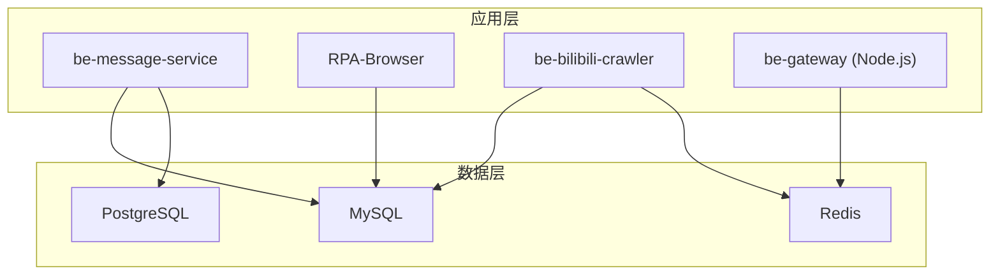
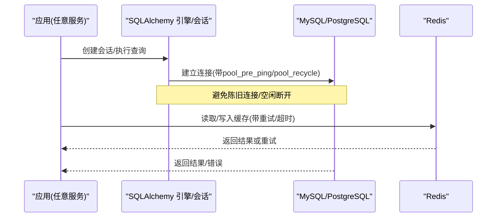
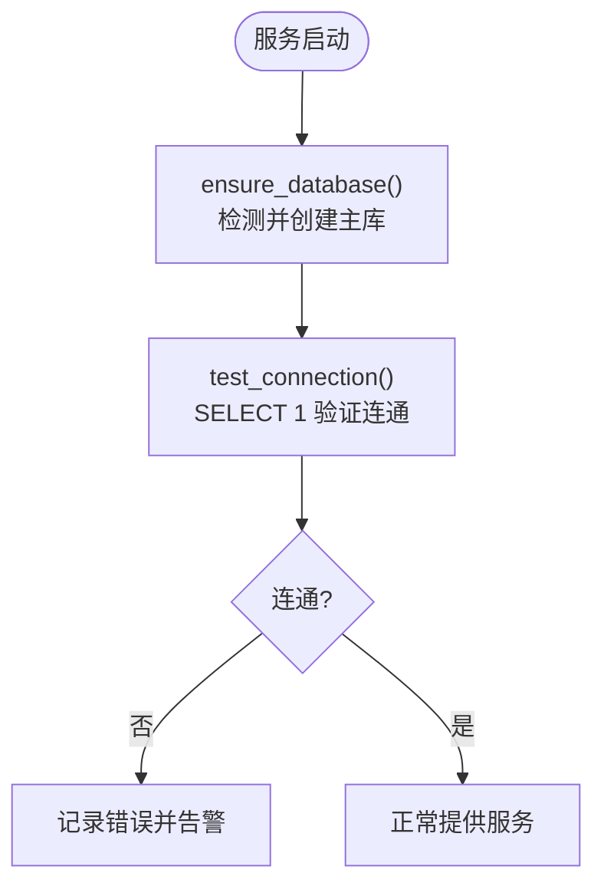
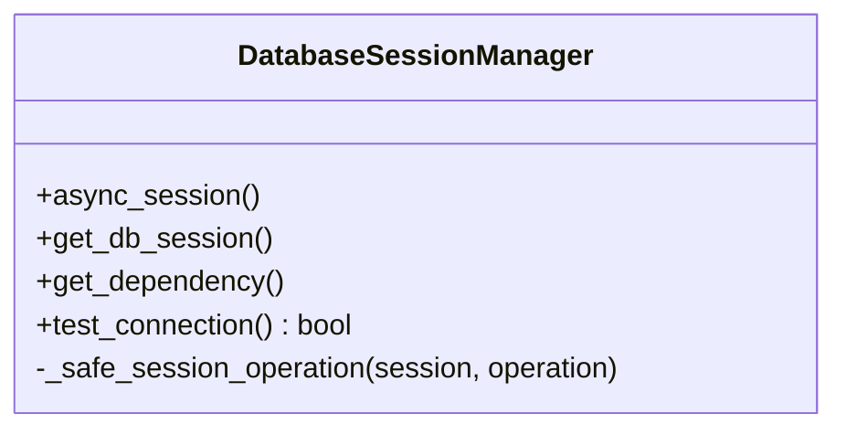
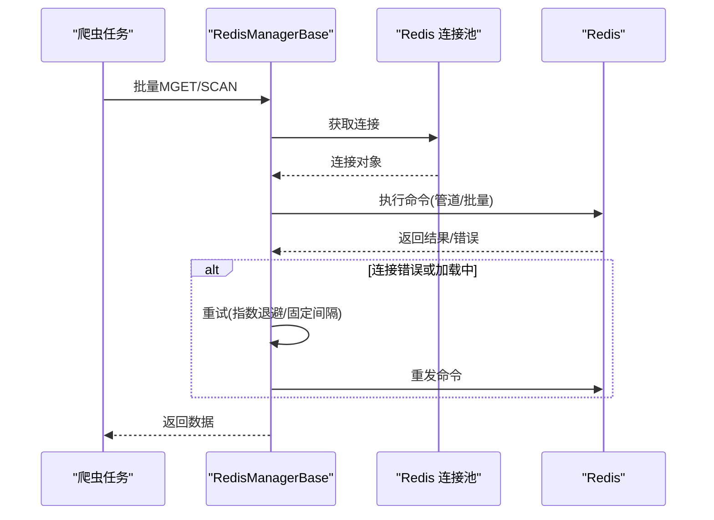
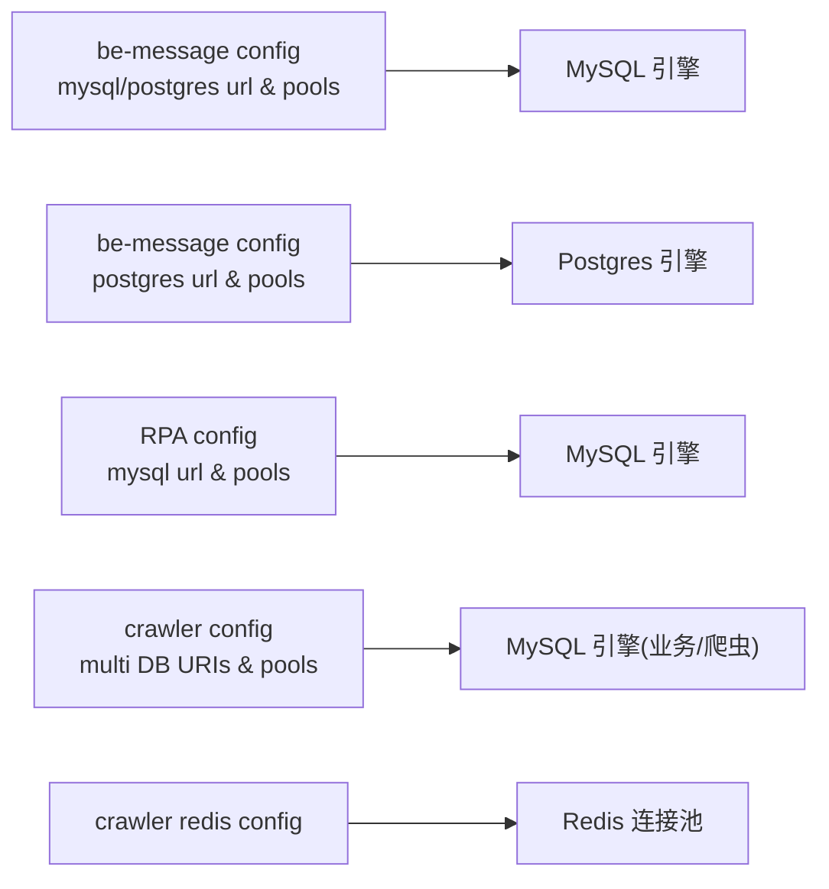

# 数据库连接问题排查

<cite>
**本文引用的文件**
- [be-message-service/app/core/config.py](file://be-message-service/app/core/config.py)
- [be-message-service/app/core/database.py](file://be-message-service/app/core/database.py)
- [RPA-Browser/app/utils/depends/session_manager.py](file://RPA-Browser/app/utils/depends/session_manager.py)
- [be-bilibili-crawler/CONFIG.py](file://be-bilibili-crawler/CONFIG.py)
- [be-bilibili-crawler/Utils/redisTool/RedisManager.py](file://be-bilibili-crawler/Utils/redisTool/RedisManager.py)
- [be-gateway/nodejs_backend.config.js](file://be-gateway/nodejs_backend.config.js)
</cite>

## 目录
1. [简介](#简介)
2. [项目结构](#项目结构)
3. [核心组件](#核心组件)
4. [架构总览](#架构总览)
5. [详细组件分析](#详细组件分析)
6. [依赖关系分析](#依赖关系分析)
7. [性能考量](#性能考量)
8. [故障排查指南](#故障排查指南)
9. [结论](#结论)
10. [附录](#附录)

## 简介
本手册面向生产与开发环境中的数据库连接问题，覆盖 MySQL、PostgreSQL、Redis 三类中间件的连接超时、连接池耗尽、权限不足等典型问题的诊断与修复。结合仓库中实际配置与实现，提供连接字符串校验、SSL/证书配置要点、网络连通性检查、慢查询与锁等待定位、主从同步异常排查、以及容量规划与优化建议，帮助快速恢复服务并降低风险。

## 项目结构
本项目包含多个后端服务，均涉及数据库与缓存接入：
- be-message-service：消息与通知服务，使用 MySQL（主库）与 PostgreSQL（pptr 库），并提供启动自检与自动建库能力。
- RPA-Browser：浏览器自动化服务，使用 MySQL（会话/元数据）。
- be-bilibili-crawler：爬虫服务，使用多 MySQL 实例/库与 Redis（多 DB 分片）。
- be-gateway：Node.js 网关，通过 PM2 管理进程，间接访问数据库与缓存。

图表来源
- [be-message-service/app/core/config.py:41-74](file://be-message-service/app/core/config.py#L41-L74)
- [be-message-service/app/core/database.py:28-95](file://be-message-service/app/core/database.py#L28-L95)
- [RPA-Browser/app/utils/depends/session_manager.py:21-37](file://RPA-Browser/app/utils/depends/session_manager.py#L21-L37)
- [be-bilibili-crawler/CONFIG.py:330-415](file://be-bilibili-crawler/CONFIG.py#L330-L415)
- [be-bilibili-crawler/Utils/redisTool/RedisManager.py:111-208](file://be-bilibili-crawler/Utils/redisTool/RedisManager.py#L111-L208)
- [be-gateway/nodejs_backend.config.js:1-27](file://be-gateway/nodejs_backend.config.js#L1-L27)

章节来源
- [be-message-service/app/core/config.py:41-74](file://be-message-service/app/core/config.py#L41-L74)
- [be-message-service/app/core/database.py:28-95](file://be-message-service/app/core/database.py#L28-L95)
- [RPA-Browser/app/utils/depends/session_manager.py:21-37](file://RPA-Browser/app/utils/depends/session_manager.py#L21-L37)
- [be-bilibili-crawler/CONFIG.py:330-415](file://be-bilibili-crawler/CONFIG.py#L330-L415)
- [be-bilibili-crawler/Utils/redisTool/RedisManager.py:111-208](file://be-bilibili-crawler/Utils/redisTool/RedisManager.py#L111-L208)
- [be-gateway/nodejs_backend.config.js:1-27](file://be-gateway/nodejs_backend.config.js#L1-L27)

## 核心组件
- 连接与引擎
  - be-message-service：MySQL 异步引擎与会话工厂；PostgreSQL 只读/接管读写引擎；启动时确保主库存在并提供连接测试。
  - RPA-Browser：基于 URL 的 MySQL 异步引擎，设置连接池大小、溢出、回收周期与预 ping。
  - be-bilibili-crawler：集中化的 SQLAlchemy 引擎配置（业务与爬虫双池隔离），并生成多库连接串。
- 缓存
  - be-bilibili-crawler：Redis 连接池与重试封装，支持 SCAN、管道、批量操作与错误重试。
- 进程管理
  - be-gateway：PM2 配置文件，定义应用脚本、运行模式与重启策略。

章节来源
- [be-message-service/app/core/database.py:28-95](file://be-message-service/app/core/database.py#L28-L95)
- [RPA-Browser/app/utils/depends/session_manager.py:21-37](file://RPA-Browser/app/utils/depends/session_manager.py#L21-L37)
- [be-bilibili-crawler/CONFIG.py:381-415](file://be-bilibili-crawler/CONFIG.py#L381-L415)
- [be-bilibili-crawler/Utils/redisTool/RedisManager.py:111-208](file://be-bilibili-crawler/Utils/redisTool/RedisManager.py#L111-L208)
- [be-gateway/nodejs_backend.config.js:1-27](file://be-gateway/nodejs_backend.config.js#L1-L27)

## 架构总览
下图展示各服务对数据库与缓存的连接路径及关键配置点。

图表来源
- [be-message-service/app/core/database.py:28-46](file://be-message-service/app/core/database.py#L28-L46)
- [RPA-Browser/app/utils/depends/session_manager.py:21-37](file://RPA-Browser/app/utils/depends/session_manager.py#L21-L37)
- [be-bilibili-crawler/Utils/redisTool/RedisManager.py:81-87](file://be-bilibili-crawler/Utils/redisTool/RedisManager.py#L81-L87)

## 详细组件分析

### MySQL 连接与连接池（be-message-service）
- 连接串与参数
  - 使用异步驱动，设置字符集、隔离级别为 READ COMMITTED，减少高并发插入死锁概率。
  - 启用 pool_pre_ping 与 pool_recycle，避免服务端静默断开的陈旧连接导致错误。
- 会话管理
  - 提供 FastAPI 依赖注入获取会话，非请求上下文提供手动会话创建方法。
- 启动自检
  - ensure_database：若主库不存在则自动创建，避免运维手工建库。
  - test_connection：启动时探测 MySQL 连通性。

图表来源
- [be-message-service/app/core/database.py:123-172](file://be-message-service/app/core/database.py#L123-L172)
- [be-message-service/app/core/config.py:41-58](file://be-message-service/app/core/config.py#L41-L58)

章节来源
- [be-message-service/app/core/database.py:28-95](file://be-message-service/app/core/database.py#L28-L95)
- [be-message-service/app/core/database.py:123-172](file://be-message-service/app/core/database.py#L123-L172)
- [be-message-service/app/core/config.py:41-58](file://be-message-service/app/core/config.py#L41-L58)

### PostgreSQL 连接（be-message-service）
- 独立引擎与会话工厂，用于 pptr 库（PPTR_Bili_Lot），可读写由 be-message 接管。
- 同样启用 pool_pre_ping 与 pool_recycle，保障连接健康。

章节来源
- [be-message-service/app/core/database.py:86-120](file://be-message-service/app/core/database.py#L86-L120)
- [be-message-service/app/core/config.py:60-74](file://be-message-service/app/core/config.py#L60-L74)

### RPA-Browser MySQL 连接与会话
- 引擎配置：设置池大小、溢出、回收周期、预 ping、超时与字符集。
- 会话管理器：在会话生命周期内捕获连接丢失并进行有限次重试，提升稳定性。

图表来源
- [RPA-Browser/app/utils/depends/session_manager.py:21-37](file://RPA-Browser/app/utils/depends/session_manager.py#L21-L37)
- [RPA-Browser/app/utils/depends/session_manager.py:50-116](file://RPA-Browser/app/utils/depends/session_manager.py#L50-L116)
- [RPA-Browser/app/utils/depends/session_manager.py:143-152](file://RPA-Browser/app/utils/depends/session_manager.py#L143-L152)

章节来源
- [RPA-Browser/app/utils/depends/session_manager.py:21-37](file://RPA-Browser/app/utils/depends/session_manager.py#L21-L37)
- [RPA-Browser/app/utils/depends/session_manager.py:50-116](file://RPA-Browser/app/utils/depends/session_manager.py#L50-L116)
- [RPA-Browser/app/utils/depends/session_manager.py:143-152](file://RPA-Browser/app/utils/depends/session_manager.py#L143-L152)

### be-bilibili-crawler 数据库与 Redis 连接
- 数据库
  - 集中化构建多库连接串（proxy_db、bilidb、bili_reserve、dyndetail、samsclub）。
  - 业务与爬虫两套独立的 SQLAlchemy 引擎池，避免爬虫高并发抢占业务连接。
  - 统一启用 pool_pre_ping 与 pool_recycle，防止陈旧连接与空闲断开。
- Redis
  - 连接池与客户端工厂，设置 socket_timeout 与健康检查。
  - 批量扫描、管道、UNLINK/MGET/HSET 等操作封装，配合重试装饰器处理 BusyLoadingError 与 ConnectionError。

图表来源
- [be-bilibili-crawler/CONFIG.py:330-415](file://be-bilibili-crawler/CONFIG.py#L330-L415)
- [be-bilibili-crawler/Utils/redisTool/RedisManager.py:81-87](file://be-bilibili-crawler/Utils/redisTool/RedisManager.py#L81-L87)
- [be-bilibili-crawler/Utils/redisTool/RedisManager.py:212-258](file://be-bilibili-crawler/Utils/redisTool/RedisManager.py#L212-L258)
- [be-bilibili-crawler/Utils/redisTool/RedisManager.py:292-340](file://be-bilibili-crawler/Utils/redisTool/RedisManager.py#L292-L340)

章节来源
- [be-bilibili-crawler/CONFIG.py:330-415](file://be-bilibili-crawler/CONFIG.py#L330-L415)
- [be-bilibili-crawler/Utils/redisTool/RedisManager.py:81-87](file://be-bilibili-crawler/Utils/redisTool/RedisManager.py#L81-L87)
- [be-bilibili-crawler/Utils/redisTool/RedisManager.py:212-258](file://be-bilibili-crawler/Utils/redisTool/RedisManager.py#L212-L258)
- [be-bilibili-crawler/Utils/redisTool/RedisManager.py:292-340](file://be-bilibili-crawler/Utils/redisTool/RedisManager.py#L292-L340)

### be-gateway 进程管理
- PM2 配置定义了 Express 应用的脚本、工作目录、运行模式与自动重启策略，便于稳定运行与故障自愈。

章节来源
- [be-gateway/nodejs_backend.config.js:1-27](file://be-gateway/nodejs_backend.config.js#L1-L27)

## 依赖关系分析
- 配置到连接的映射
  - be-message-service：mysql_message_url、postgres_pptr_url 分别对应 MySQL 与 Postgres 引擎。
  - RPA-Browser：mysql_browser_info_url 对应 MySQL 引擎。
  - be-bilibili-crawler：DataBaseConfig 动态拼装多库 URI；RedisManagerBase 使用统一连接池。
- 连接池安全边界
  - be-message-service：对 mysql_pool_size + max_overflow 做上限保护，防止误配导致 Too many connections。
  - be-bilibili-crawler：业务与爬虫分离池，避免互相影响。

图表来源
- [be-message-service/app/core/config.py:41-74](file://be-message-service/app/core/config.py#L41-L74)
- [be-message-service/app/core/config.py:351-359](file://be-message-service/app/core/config.py#L351-L359)
- [RPA-Browser/app/utils/depends/session_manager.py:21-37](file://RPA-Browser/app/utils/depends/session_manager.py#L21-L37)
- [be-bilibili-crawler/CONFIG.py:330-415](file://be-bilibili-crawler/CONFIG.py#L330-L415)
- [be-bilibili-crawler/Utils/redisTool/RedisManager.py:111-208](file://be-bilibili-crawler/Utils/redisTool/RedisManager.py#L111-L208)

章节来源
- [be-message-service/app/core/config.py:41-74](file://be-message-service/app/core/config.py#L41-L74)
- [be-message-service/app/core/config.py:351-359](file://be-message-service/app/core/config.py#L351-L359)
- [RPA-Browser/app/utils/depends/session_manager.py:21-37](file://RPA-Browser/app/utils/depends/session_manager.py#L21-L37)
- [be-bilibili-crawler/CONFIG.py:330-415](file://be-bilibili-crawler/CONFIG.py#L330-L415)
- [be-bilibili-crawler/Utils/redisTool/RedisManager.py:111-208](file://be-bilibili-crawler/Utils/redisTool/RedisManager.py#L111-L208)

## 性能考量
- 连接池参数
  - pool_size 与 max_overflow 需根据实例 CPU 与数据库最大连接数评估，避免超过限制。
  - pool_recycle 应小于数据库 wait_timeout，防止空闲连接被服务端断开后继续使用。
  - pool_pre_ping 开启以在取连接前探测有效性。
- 隔离级别
  - be-message-service 使用 READ COMMITTED，降低高并发插入死锁概率。
- Redis 连接
  - 合理设置 socket_timeout 与健康检查间隔，避免阻塞与假存活。
  - 使用管道与批量操作减少 RTT。
- 爬虫与业务池隔离
  - 将爬虫与业务引擎池分离，避免突发抓取占用全部连接导致业务抖动。

[本节为通用指导，不直接分析具体文件]

## 故障排查指南

### 连接超时
- 症状
  - 应用侧出现连接超时或“服务器已关闭”类错误；Redis 出现连接错误并触发重试。
- 排查步骤
  - 核对连接串：主机、端口、用户名、密码、数据库名、字符集是否正确。
  - 检查网络连通性：从应用容器/主机 telnet 或 nc 连通目标端口。
  - 确认防火墙/安全组放行。
  - 查看数据库服务端日志与连接数、wait_timeout 配置。
  - 对于 Redis，确认密码、DB 号、socket_timeout 与健康检查配置。
- 相关实现参考
  - MySQL 引擎与连接参数：[be-message-service/app/core/database.py:28-46](file://be-message-service/app/core/database.py#L28-L46)、[RPA-Browser/app/utils/depends/session_manager.py:21-37](file://RPA-Browser/app/utils/depends/session_manager.py#L21-L37)
  - Redis 连接与重试：[be-bilibili-crawler/Utils/redisTool/RedisManager.py:81-87](file://be-bilibili-crawler/Utils/redisTool/RedisManager.py#L81-L87)、[be-bilibili-crawler/Utils/redisTool/RedisManager.py:62-78](file://be-bilibili-crawler/Utils/redisTool/RedisManager.py#L62-L78)

章节来源
- [be-message-service/app/core/database.py:28-46](file://be-message-service/app/core/database.py#L28-L46)
- [RPA-Browser/app/utils/depends/session_manager.py:21-37](file://RPA-Browser/app/utils/depends/session_manager.py#L21-L37)
- [be-bilibili-crawler/Utils/redisTool/RedisManager.py:81-87](file://be-bilibili-crawler/Utils/redisTool/RedisManager.py#L81-L87)
- [be-bilibili-crawler/Utils/redisTool/RedisManager.py:62-78](file://be-bilibili-crawler/Utils/redisTool/RedisManager.py#L62-L78)

### 连接池耗尽
- 症状
  - 大量请求排队或报错“Too many connections”；连接池无法获取连接。
- 排查步骤
  - 检查 pool_size 与 max_overflow 是否过大或过小；确认数据库 max_connections。
  - 确认 pool_recycle 与数据库 wait_timeout 的关系。
  - 区分业务与爬虫池是否相互影响（crawler 已隔离）。
  - 观察应用日志中连接获取超时与释放情况。
- 相关实现参考
  - 连接池上限保护：[be-message-service/app/core/config.py:351-359](file://be-message-service/app/core/config.py#L351-L359)
  - 业务与爬虫池隔离：[be-bilibili-crawler/CONFIG.py:381-415](file://be-bilibili-crawler/CONFIG.py#L381-L415)

章节来源
- [be-message-service/app/core/config.py:351-359](file://be-message-service/app/core/config.py#L351-L359)
- [be-bilibili-crawler/CONFIG.py:381-415](file://be-bilibili-crawler/CONFIG.py#L381-L415)

### 权限不足
- 症状
  - 登录失败、拒绝访问、无权限访问某库/表。
- 排查步骤
  - 核对账号权限：是否具备所需库/表的 SELECT/INSERT/UPDATE/DELETE 权限。
  - 检查连接串中的用户名、密码与主机白名单。
  - 对于 be-message-service，确认 ensure_database 是否能成功创建主库（需要足够权限）。
- 相关实现参考
  - 自动建库逻辑：[be-message-service/app/core/database.py:123-159](file://be-message-service/app/core/database.py#L123-L159)

章节来源
- [be-message-service/app/core/database.py:123-159](file://be-message-service/app/core/database.py#L123-L159)

### SSL 证书配置
- 说明
  - 当前仓库未显式配置数据库 SSL 连接参数；如需启用 SSL，应在连接串中添加相应参数或在驱动层配置证书路径与校验规则。
- 建议
  - 在连接串中加入 ssl_ca、ssl_cert、ssl_key 等参数（依驱动而定）。
  - 确保应用能访问证书文件路径，并在容器中正确挂载。
  - 先在不强制校验的环境下验证连通性，再逐步启用严格校验。

[本节为通用指导，不直接分析具体文件]

### 慢查询分析
- 建议方法
  - 开启慢查询日志（MySQL slow_query_log），设定阈值并定期分析。
  - 使用 EXPLAIN 分析执行计划，关注全表扫描、索引缺失、临时表与文件排序。
  - 针对热点查询进行改写或引入缓存。
- 在本项目中的应用
  - 可通过调整 echo 输出 SQL（仅开发环境）辅助定位；生产建议通过数据库侧慢查询日志与监控工具分析。

[本节为通用指导，不直接分析具体文件]

### 锁等待问题
- 现象
  - 事务长时间等待锁，出现锁等待超时或死锁。
- 排查步骤
  - 查看数据库锁等待视图（如 InnoDB 锁信息），定位持有锁的事务。
  - 缩短事务粒度，避免长事务；拆分大事务为小批次。
  - 在高并发写场景下，考虑合适的隔离级别（本项目 MySQL 使用 READ COMMITTED 以降低插入死锁概率）。
- 相关实现参考
  - 隔离级别设置：[be-message-service/app/core/database.py:40-46](file://be-message-service/app/core/database.py#L40-L46)

章节来源
- [be-message-service/app/core/database.py:40-46](file://be-message-service/app/core/database.py#L40-L46)

### 主从同步异常
- 现象
  - 从库延迟、复制中断、位点不一致。
- 排查步骤
  - 检查主从状态（SHOW SLAVE STATUS / SHOW REPLICA STATUS），关注 Last_Error、Seconds_Behind_Master。
  - 排查大事务、DDL 操作、网络抖动导致的复制中断。
  - 必要时重置复制或使用 pt-table-checksum 校验一致性。
- 建议
  - 控制大事务与批量操作窗口；在网络不稳定时增加重试与限流。

[本节为通用指导，不直接分析具体文件]

### Redis 连接与性能问题
- 常见问题
  - 连接超时、BusyLoadingError、键空间过大导致扫描缓慢。
- 排查步骤
  - 检查 Redis 连接串、密码、DB 号与 socket_timeout。
  - 使用 SCAN 而非 KEYS，分批处理键空间；使用管道与批量命令减少 RTT。
  - 对异常进行重试与退避，避免雪崩。
- 相关实现参考
  - 连接与重试：[be-bilibili-crawler/Utils/redisTool/RedisManager.py:62-78](file://be-bilibili-crawler/Utils/redisTool/RedisManager.py#L62-L78)
  - 批量扫描与删除：[be-bilibili-crawler/Utils/redisTool/RedisManager.py:212-258](file://be-bilibili-crawler/Utils/redisTool/RedisManager.py#L212-L258)
  - 批量获取与写入：[be-bilibili-crawler/Utils/redisTool/RedisManager.py:292-340](file://be-bilibili-crawler/Utils/redisTool/RedisManager.py#L292-L340)

章节来源
- [be-bilibili-crawler/Utils/redisTool/RedisManager.py:62-78](file://be-bilibili-crawler/Utils/redisTool/RedisManager.py#L62-L78)
- [be-bilibili-crawler/Utils/redisTool/RedisManager.py:212-258](file://be-bilibili-crawler/Utils/redisTool/RedisManager.py#L212-L258)
- [be-bilibili-crawler/Utils/redisTool/RedisManager.py:292-340](file://be-bilibili-crawler/Utils/redisTool/RedisManager.py#L292-L340)

## 结论
本手册基于仓库实际配置与实现，总结了 MySQL、PostgreSQL、Redis 的连接问题定位与修复方法。通过合理的连接串配置、连接池参数调优、SSL 证书部署、网络连通性检查、慢查询与锁等待分析、主从同步排查，以及容量规划与优化建议，可有效提升系统稳定性与性能。建议在上线前完成连接测试与压力测试，持续监控连接数、慢查询与缓存命中率，及时扩容与优化。

[本节为总结性内容，不直接分析具体文件]

## 附录

### 连接字符串格式与关键参数
- MySQL
  - 示例格式：mysql+aiomysql://用户:密码@主机:端口/库名?charset=utf8mb4&autocommit=true
  - 关键参数：charset、autocommit、pool_pre_ping、pool_recycle、isolation_level
- PostgreSQL
  - 示例格式：postgresql+asyncpg://用户:密码@主机:端口/库名
  - 关键参数：pool_pre_ping、pool_recycle
- Redis
  - 示例格式：redis://:密码@主机:端口/DB号
  - 关键参数：socket_timeout、health_check_interval、retry_on_timeout

[本节为通用指导，不直接分析具体文件]

### 容量规划建议
- 连接池
  - 根据 QPS、平均响应时间与数据库最大连接数估算 pool_size 与 max_overflow。
  - 保持 pool_recycle < wait_timeout，预留余量。
- 数据库
  - 监控连接数、慢查询、锁等待、磁盘 IO 与 CPU。
  - 对热点表加合适索引，避免全表扫描。
- Redis
  - 监控内存使用、键数量、命中率与慢命令。
  - 使用 SCAN、管道与批量操作，避免大键与热键。

[本节为通用指导，不直接分析具体文件]