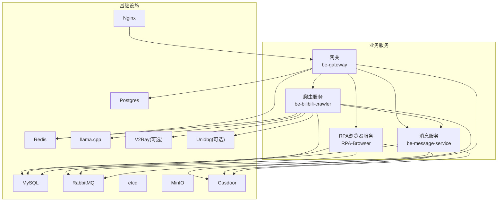
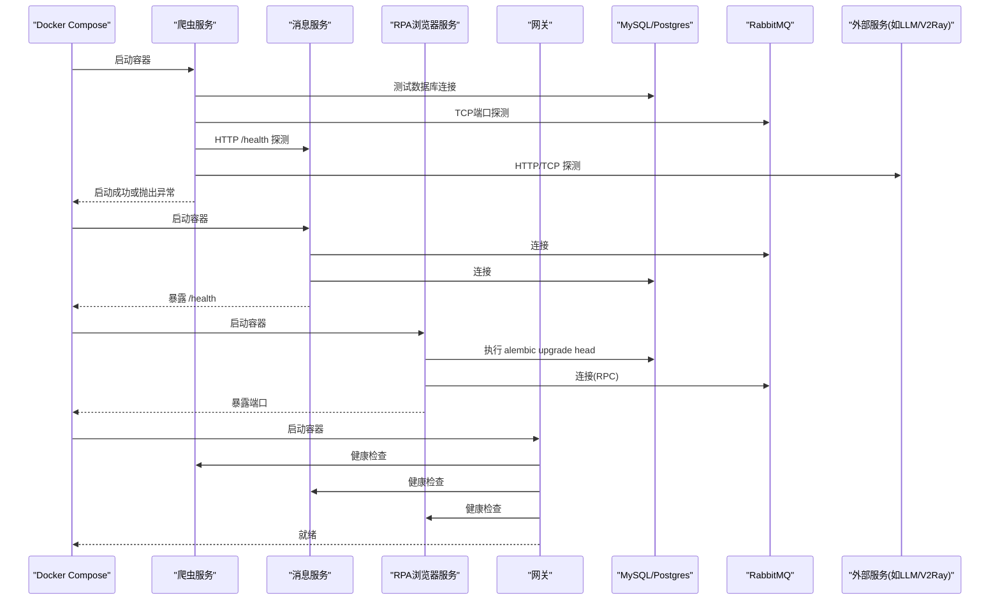
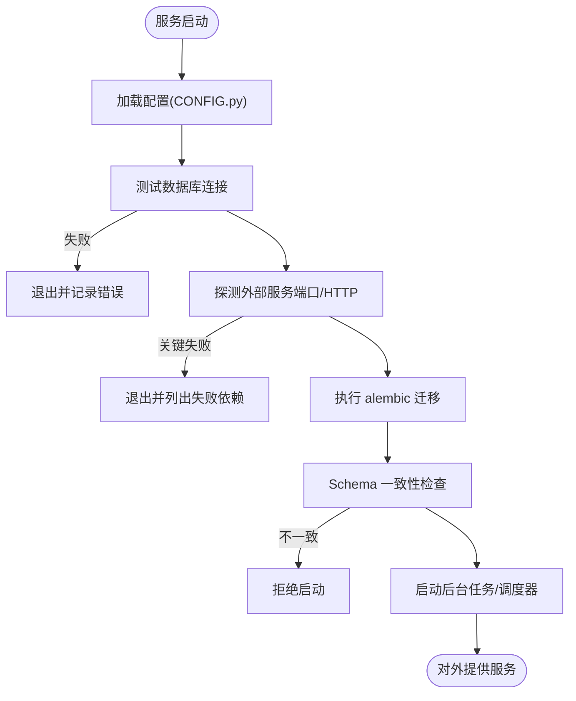
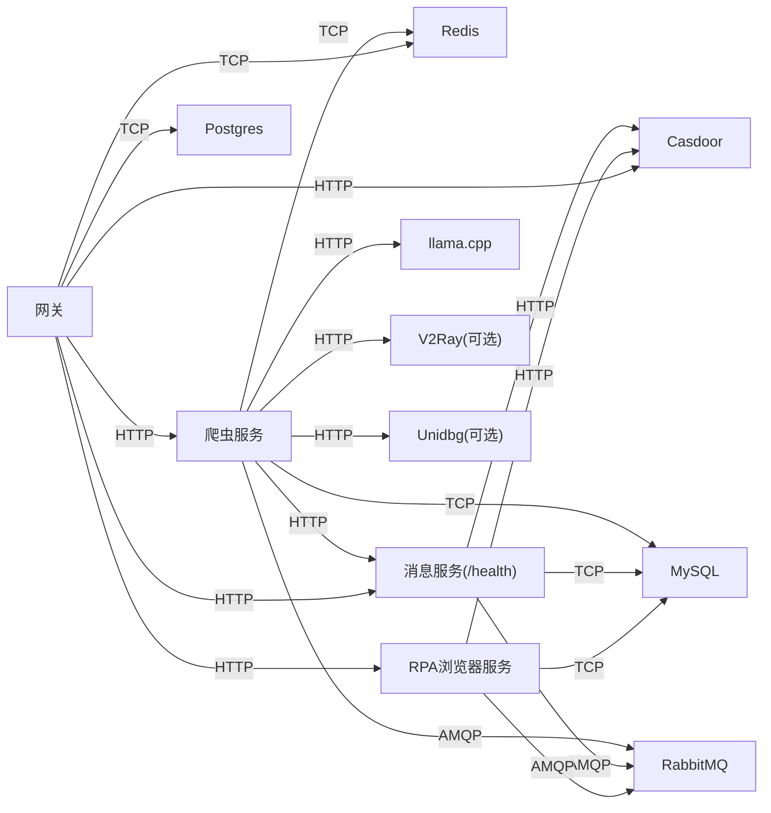

# 服务启动问题排查

<cite>
**本文引用的文件**
- [docker-compose.yml](file://docker-compose.yml)
- [be-bilibili-crawler/main.py](file://be-bilibili-crawler/main.py)
- [be-bilibili-crawler/CONFIG.py](file://be-bilibili-crawler/CONFIG.py)
- [be-bilibili-crawler/Utils/FastAPI/FastapiLifespan.py](file://be-bilibili-crawler/Utils/FastAPI/FastapiLifespan.py)
- [RPA-Browser/main.py](file://RPA-Browser/main.py)
- [RPA-Browser/app/config.py](file://RPA-Browser/app/config.py)
- [be-gateway/index.js](file://be-gateway/index.js)
- [be-gateway/ExpressServerEnd/Service/upstream_health_module/upstream_health_service.js](file://be-gateway/ExpressServerEnd/Service/upstream_health_module/upstream_health_service.js)
- [be-gateway/ExpressServerEnd/Service/mq/rpc_client.js](file://be-gateway/ExpressServerEnd/Service/mq/rpc_client.js)
</cite>

## 目录
1. [简介](#简介)
2. [项目结构](#项目结构)
3. [核心组件](#核心组件)
4. [架构总览](#架构总览)
5. [详细组件分析](#详细组件分析)
6. [依赖关系分析](#依赖关系分析)
7. [性能与稳定性考虑](#性能与稳定性考虑)
8. [故障排查指南](#故障排查指南)
9. [结论](#结论)
10. [附录](#附录)

## 简介
本指南面向微服务集群（爬虫服务、消息服务、RPA浏览器服务、API网关）的启动失败问题，提供系统化的诊断步骤与解决方案。重点覆盖端口冲突、依赖服务不可用、配置文件错误、环境变量缺失、Docker容器启动失败、数据库连接超时、消息队列连接异常等典型场景；并提供日志分析方法、健康检查机制与快速恢复技巧。

## 项目结构
本项目通过 docker-compose 编排多个服务与基础设施：
- 基础设施：MySQL、Redis、RabbitMQ、Postgres、Milvus（etcd+minio）、Casdoor、Nginx、llama.cpp 等
- 业务服务：
  - be-bilibili-crawler（爬虫服务，FastAPI，端口由环境变量映射）
  - be-message-service（消息服务，FastAPI，暴露 /health 健康端点）
  - RPA-Browser（RPA浏览器服务，FastAPI，启动时执行迁移并拉起RPC）
  - be-gateway（Node.js 网关，聚合上游服务与健康检查）

图表来源
- [docker-compose.yml:120-310](file://docker-compose.yml#L120-L310)

章节来源
- [docker-compose.yml:1-380](file://docker-compose.yml#L1-L380)

## 核心组件
- 爬虫服务（be-bilibili-crawler）
  - 入口：main.py 启动 FastAPI 应用，注册路由与缓存
  - 启动期校验：在 lifespan 中检测数据库、外部服务连通性，执行 alembic 迁移与 schema 一致性检查，再启动后台任务
  - 关键配置：CONFIG.py 集中管理 MySQL/Redis/RabbitMQ/Milvus/LLM/代理等配置
- 消息服务（be-message-service）
  - 提供 /health 健康端点，用于被其他服务探测
  - 依赖 RabbitMQ、MySQL、Casdoor
- RPA浏览器服务（RPA-Browser）
  - 入口：main.py 定义 lifespan，启动前执行 alembic 迁移与 schema 检查，初始化依赖，启动 RPC 服务端
  - 配置：app/config.py 管理数据库、RabbitMQ、代理、迁移开关等
- 网关（be-gateway）
  - Node.js 服务，负责上游服务健康检查、RPC 调用、业务编排
  - 提供上游健康检查模块，统一输出各上游可用性

章节来源
- [be-bilibili-crawler/main.py:1-119](file://be-bilibili-crawler/main.py#L1-L119)
- [be-bilibili-crawler/Utils/FastAPI/FastapiLifespan.py:20-62](file://be-bilibili-crawler/Utils/FastAPI/FastapiLifespan.py#L20-L62)
- [be-bilibili-crawler/CONFIG.py:225-277](file://be-bilibili-crawler/CONFIG.py#L225-L277)
- [RPA-Browser/main.py:36-74](file://RPA-Browser/main.py#L36-L74)
- [RPA-Browser/app/config.py:140-215](file://RPA-Browser/app/config.py#L140-L215)
- [be-gateway/ExpressServerEnd/Service/upstream_health_module/upstream_health_service.js:93-124](file://be-gateway/ExpressServerEnd/Service/upstream_health_module/upstream_health_service.js#L93-L124)

## 架构总览
下图展示启动阶段的关键交互：服务启动 -> 依赖探测 -> 迁移/初始化 -> 对外暴露接口。

图表来源
- [be-bilibili-crawler/Utils/FastAPI/FastapiLifespan.py:20-62](file://be-bilibili-crawler/Utils/FastAPI/FastapiLifespan.py#L20-L62)
- [be-bilibili-crawler/Utils/FastAPI/FastapiLifespan.py:183-251](file://be-bilibili-crawler/Utils/FastAPI/FastapiLifespan.py#L183-L251)
- [RPA-Browser/main.py:36-74](file://RPA-Browser/main.py#L36-L74)
- [docker-compose.yml:120-310](file://docker-compose.yml#L120-L310)

## 详细组件分析

### 爬虫服务（be-bilibili-crawler）
- 启动流程
  - 加载配置（CONFIG.py），构建数据库 URI、RabbitMQ URL、外部服务地址
  - lifespan 中依次执行：
    - 数据库连接测试
    - 外部服务端口/HTTP 连通性检测（含 message-service /health）
    - 执行 alembic 迁移与 schema 一致性检查
    - 启动后台任务与调度器
- 常见启动失败原因
  - 环境变量缺失或不正确（MYSQL_HOST/PORT/USER/PASSWORD、REDIS_*、RABBITMQ_*、MESSAGE_SERVICE_* 等）
  - 依赖服务未就绪（MySQL/Redis/RabbitMQ/Milvus/LLM/Message Service）
  - 数据库迁移失败或 schema 不一致
  - 端口冲突导致 uvicorn 无法绑定
- 健康检查与排障
  - 使用 /health 或自定义探针验证消息服务可用
  - 查看启动日志中的“关键依赖服务未启动”提示，定位具体失败项

图表来源
- [be-bilibili-crawler/Utils/FastAPI/FastapiLifespan.py:20-62](file://be-bilibili-crawler/Utils/FastAPI/FastapiLifespan.py#L20-L62)
- [be-bilibili-crawler/Utils/FastAPI/FastapiLifespan.py:183-251](file://be-bilibili-crawler/Utils/FastAPI/FastapiLifespan.py#L183-L251)
- [be-bilibili-crawler/CONFIG.py:225-277](file://be-bilibili-crawler/CONFIG.py#L225-L277)

章节来源
- [be-bilibili-crawler/main.py:1-119](file://be-bilibili-crawler/main.py#L1-L119)
- [be-bilibili-crawler/CONFIG.py:225-277](file://be-bilibili-crawler/CONFIG.py#L225-L277)
- [be-bilibili-crawler/Utils/FastAPI/FastapiLifespan.py:20-62](file://be-bilibili-crawler/Utils/FastAPI/FastapiLifespan.py#L20-L62)

### 消息服务（be-message-service）
- 启动要点
  - 暴露 /health 健康端点，返回 204 表示存活且 broker 连接正常
  - 依赖 RabbitMQ、MySQL、Casdoor
- 常见问题
  - RabbitMQ 连接失败（认证/网络/端口）
  - MySQL 连接失败（URI/权限/网络）
  - Casdoor 配置错误（endpoint/client_id/secret/organization/application）
- 健康检查
  - 通过 curl 访问 /health 判断服务状态

章节来源
- [docker-compose.yml:261-322](file://docker-compose.yml#L261-L322)

### RPA浏览器服务（RPA-Browser）
- 启动流程
  - 启动前执行 alembic 迁移与 schema 检查
  - 初始化依赖，启动后台任务
  - 连接 RabbitMQ RPC 客户端，启动 RPC 服务端
- 常见问题
  - 数据库迁移失败或 schema 不一致
  - RabbitMQ RPC 连接失败（URL/心跳参数）
  - 代理配置不正确导致外网请求失败
- 健康检查
  - 监听端口（默认 28000），可通过 HTTP 接口验证

章节来源
- [RPA-Browser/main.py:36-74](file://RPA-Browser/main.py#L36-L74)
- [RPA-Browser/app/config.py:140-215](file://RPA-Browser/app/config.py#L140-L215)

### 网关（be-gateway）
- 功能
  - 对上游服务进行健康检查，汇总结果
  - 通过 RabbitMQ RPC 调用后端能力
- 常见问题
  - 上游服务不可用（爬虫/消息/RPA）
  - RabbitMQ RPC 通道建立失败或响应超时
- 健康检查
  - 使用内置的上游健康检查模块，输出每个上游的状态与耗时

章节来源
- [be-gateway/ExpressServerEnd/Service/upstream_health_module/upstream_health_service.js:93-124](file://be-gateway/ExpressServerEnd/Service/upstream_health_module/upstream_health_service.js#L93-L124)
- [be-gateway/ExpressServerEnd/Service/mq/rpc_client.js:30-164](file://be-gateway/ExpressServerEnd/Service/mq/rpc_client.js#L30-L164)

## 依赖关系分析
- 爬虫服务强依赖：MySQL、Redis、RabbitMQ、Milvus、llama.cpp、message-service（/health）
- 消息服务强依赖：RabbitMQ、MySQL、Casdoor
- RPA浏览器服务强依赖：MySQL、RabbitMQ、Casdoor
- 网关依赖：Postgres、Redis、Casdoor，以及上游爬虫/消息/RPA服务

图表来源
- [docker-compose.yml:120-310](file://docker-compose.yml#L120-L310)
- [be-bilibili-crawler/Utils/FastAPI/FastapiLifespan.py:183-251](file://be-bilibili-crawler/Utils/FastAPI/FastapiLifespan.py#L183-L251)

章节来源
- [docker-compose.yml:120-310](file://docker-compose.yml#L120-L310)

## 性能与稳定性考虑
- 数据库连接池
  - 爬虫服务配置了连接池预检查与回收周期，避免陈旧连接导致的断连
- 心跳与超时
  - RabbitMQ 连接使用心跳参数，避免长耗时处理导致连接关闭
- 健康检查
  - 消息服务提供 /health，爬虫服务在启动时主动探测，确保关键依赖就绪
- 资源限制
  - Docker Compose 为爬虫服务设置内存上限，避免 OOM

章节来源
- [be-bilibili-crawler/CONFIG.py:381-415](file://be-bilibili-crawler/CONFIG.py#L381-L415)
- [RPA-Browser/app/config.py:156-159](file://RPA-Browser/app/config.py#L156-L159)
- [docker-compose.yml:120-164](file://docker-compose.yml#L120-L164)

## 故障排查指南

### 通用排查步骤
- 确认端口映射与环境变量
  - 检查 docker-compose.yml 中各服务的 ports 映射与 depends_on
  - 核对 .env 或 compose 中传入的环境变量是否完整（如 MYSQL_PASSWORD、RABBITMQ_USER/PASSWORD、CASDOOR_* 等）
- 查看容器日志
  - 使用 docker logs 查看对应服务启动阶段的错误堆栈与关键提示
- 健康检查
  - 消息服务：curl http://localhost:18739/health
  - 网关：查看上游健康检查输出，定位不可用的上游
- 依赖连通性
  - 爬虫服务会在启动时探测 MySQL/Redis/RabbitMQ/Milvus/LLM/message-service 等，若失败会直接终止并打印失败列表

章节来源
- [docker-compose.yml:120-310](file://docker-compose.yml#L120-L310)
- [be-bilibili-crawler/Utils/FastAPI/FastapiLifespan.py:183-251](file://be-bilibili-crawler/Utils/FastAPI/FastapiLifespan.py#L183-L251)

### 端口冲突
- 症状
  - 服务启动后立即退出，或端口占用报错
- 排查
  - 检查宿主机端口是否被其他进程占用
  - 核对 docker-compose.yml 中 ports 映射是否与预期一致
  - 调整端口映射或停止冲突进程后重启
- 参考
  - 各服务端口映射见 docker-compose.yml 对应 service

章节来源
- [docker-compose.yml:120-310](file://docker-compose.yml#L120-L310)

### 依赖服务不可用
- 症状
  - 启动时报“关键依赖服务未启动”，或健康检查失败
- 排查
  - 根据失败列表逐项检查：
    - MySQL/Postgres：网络可达、账号密码、库是否存在
    - Redis：网络可达、密码是否正确
    - RabbitMQ：AMQP 端口可达、用户/密码、vhost
    - Milvus：etcd/minio 就绪
    - llama.cpp/V2Ray/Unidbg：HTTP/TCP 可达
    - message-service：/health 返回 204
- 修复
  - 先启动基础设施，再启动业务服务；必要时调整 depends_on 或 healthcheck

章节来源
- [be-bilibili-crawler/Utils/FastAPI/FastapiLifespan.py:183-251](file://be-bilibili-crawler/Utils/FastAPI/FastapiLifespan.py#L183-L251)
- [docker-compose.yml:1-119](file://docker-compose.yml#L1-L119)

### 配置文件错误与环境变量缺失
- 症状
  - 启动即崩溃，或运行时出现配置解析错误
- 排查
  - 爬虫服务：检查 CONFIG.py 读取的环境变量（MYSQL_*、REDIS_*、RABBITMQ_*、MESSAGE_SERVICE_*、LLAMA_*、PROXY_SERVER 等）
  - RPA浏览器服务：检查 app/config.py 所需环境变量（mysql_browser_info_url、rabbitmq_url、proxy_server_url 等）
  - 网关：检查 DB、REDIS、CASDOOR_*、BILI_CRAWLER_URI、RPA_SERVICE_URI、MESSAGE_SERVICE_URI 等
- 修复
  - 补齐 .env 或 compose environment，确保值类型与格式正确

章节来源
- [be-bilibili-crawler/CONFIG.py:225-277](file://be-bilibili-crawler/CONFIG.py#L225-L277)
- [RPA-Browser/app/config.py:140-215](file://RPA-Browser/app/config.py#L140-L215)
- [docker-compose.yml:179-226](file://docker-compose.yml#L179-L226)

### Docker 容器启动失败
- 症状
  - 容器反复重启或启动后立即退出
- 排查
  - 查看容器日志定位具体异常
  - 检查镜像构建上下文与目标（crawler/rpa/message）
  - 检查 volumes 挂载是否覆盖运行数据（如 Chrome 应用目录）
- 修复
  - 修正依赖服务状态、环境变量、端口映射；必要时清理卷数据后重建

章节来源
- [docker-compose.yml:120-310](file://docker-compose.yml#L120-L310)

### 数据库连接超时
- 症状
  - 启动时报数据库连接失败或超时
- 排查
  - 检查 MySQL/Postgres 容器是否就绪
  - 核对 URI、用户名、密码、端口映射
  - 检查防火墙/网络策略
- 修复
  - 确保数据库服务先于业务服务启动；调整连接超时与重试策略

章节来源
- [be-bilibili-crawler/Utils/FastAPI/FastapiLifespan.py:64-90](file://be-bilibili-crawler/Utils/FastAPI/FastapiLifespan.py#L64-L90)
- [docker-compose.yml:68-178](file://docker-compose.yml#L68-L178)

### 消息队列连接异常
- 症状
  - 无法连接 RabbitMQ，或 RPC 调用失败
- 排查
  - 检查 AMQP 端口可达性与认证信息
  - 网关侧 RPC 客户端建立通道与消费 amq.rabbitmq.reply-to 是否正常
- 修复
  - 修正 RABBITMQ_* 环境变量；确保 exchange/queue 存在；调整心跳与超时

章节来源
- [be-bilibili-crawler/CONFIG.py:422-433](file://be-bilibili-crawler/CONFIG.py#L422-L433)
- [be-gateway/ExpressServerEnd/Service/mq/rpc_client.js:30-164](file://be-gateway/ExpressServerEnd/Service/mq/rpc_client.js#L30-L164)

### 日志分析方法
- 爬虫服务
  - 启动阶段日志包含数据库连接、外部服务探测、迁移与 schema 检查结果
  - 关注“关键依赖服务未启动”和失败列表
- 消息服务
  - 通过 /health 快速判断存活与 broker 连接状态
- RPA浏览器服务
  - 启动日志包含迁移执行、RPC 服务端启动结果
- 网关
  - 上游健康检查输出每个上游的目标、状态码、耗时与路由信息

章节来源
- [be-bilibili-crawler/Utils/FastAPI/FastapiLifespan.py:183-251](file://be-bilibili-crawler/Utils/FastAPI/FastapiLifespan.py#L183-L251)
- [be-gateway/ExpressServerEnd/Service/upstream_health_module/upstream_health_service.js:93-124](file://be-gateway/ExpressServerEnd/Service/upstream_health_module/upstream_health_service.js#L93-L124)

### 健康检查机制
- 消息服务：/health 返回 204 表示存活且 broker 连接正常
- 爬虫服务：启动时主动探测 message-service /health
- 网关：周期性检查上游服务，输出可用性报告

章节来源
- [docker-compose.yml:261-322](file://docker-compose.yml#L261-L322)
- [be-bilibili-crawler/Utils/FastAPI/FastapiLifespan.py:183-251](file://be-bilibili-crawler/Utils/FastAPI/FastapiLifespan.py#L183-L251)
- [be-gateway/ExpressServerEnd/Service/upstream_health_module/upstream_health_service.js:93-124](file://be-gateway/ExpressServerEnd/Service/upstream_health_module/upstream_health_service.js#L93-L124)

### 快速恢复技巧
- 一键重启依赖
  - 先重启基础设施（MySQL/Redis/RabbitMQ/Postgres/Casdoor），再重启业务服务
- 跳过非关键依赖
  - 开发环境可临时关闭非必要外部服务探测（如 V2Ray/Unidbg），优先保证核心链路
- 回滚迁移
  - 若 alembic 迁移失败，回退到上一个稳定版本并修复脚本后重试

章节来源
- [docker-compose.yml:120-310](file://docker-compose.yml#L120-L310)
- [be-bilibili-crawler/Utils/FastAPI/FastapiLifespan.py:20-62](file://be-bilibili-crawler/Utils/FastAPI/FastapiLifespan.py#L20-L62)

## 结论
通过统一的启动期依赖探测、健康检查与迁移校验，本项目的微服务能够在部署时尽早暴露配置与依赖问题。建议在生产环境中保持严格的依赖顺序与环境变量管理，结合日志与健康端点进行持续监控与快速恢复。

## 附录
- 常用命令
  - 查看容器日志：docker logs <container_name>
  - 健康检查：curl http://localhost:18739/health
  - 重启服务：docker compose restart <service>
- 关键环境变量清单（示例）
  - 爬虫服务：MYSQL_*、REDIS_*、RABBITMQ_*、MESSAGE_SERVICE_*、LLAMA_*、PROXY_SERVER
  - 消息服务：RABBITMQ_URL、MYSQL_MESSAGE_URL、POSTGRES_PPTR_URL、CASDOOR_*、GEOIP_MMDB_DIR
  - RPA浏览器服务：mysql_browser_info_url、rabbitmq_url、proxy_server_url、controller_base_path
  - 网关：DB、REDIS_*、CASDOOR_*、BILI_CRAWLER_URI、RPA_SERVICE_URI、MESSAGE_SERVICE_URI

章节来源
- [docker-compose.yml:120-310](file://docker-compose.yml#L120-L310)
- [be-bilibili-crawler/CONFIG.py:225-277](file://be-bilibili-crawler/CONFIG.py#L225-L277)
- [RPA-Browser/app/config.py:140-215](file://RPA-Browser/app/config.py#L140-L215)