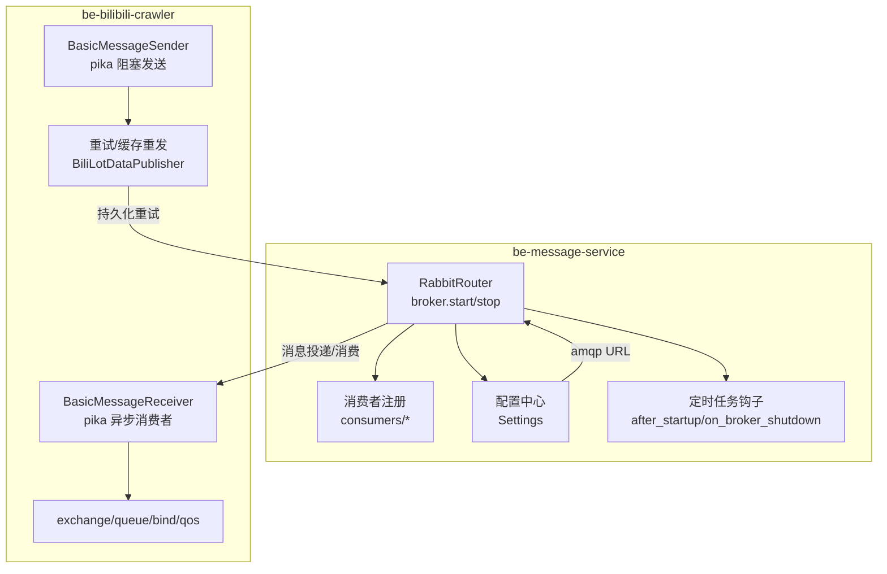
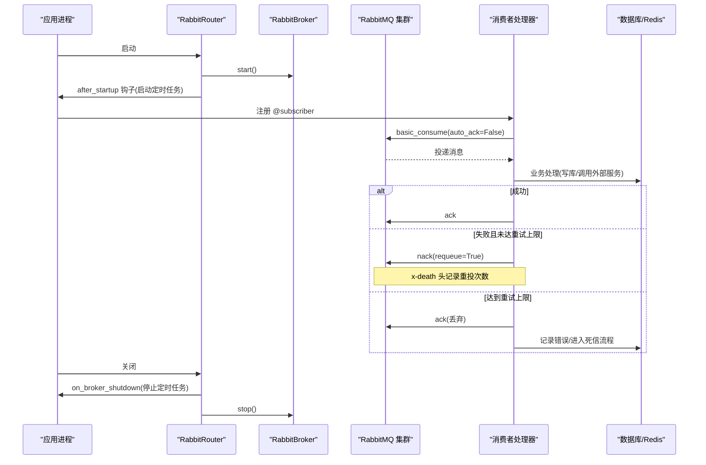
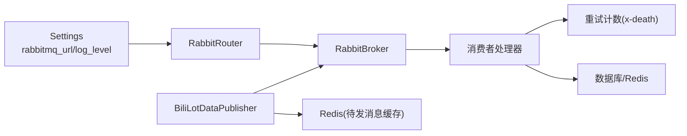

# 消息队列问题排查

<cite>
**本文引用的文件**
- [be-message-service/app/mq/router.py](file://be-message-service/app/mq/router.py)
- [be-message-service/app/core/config.py](file://be-message-service/app/core/config.py)
- [be-message-service/app/consumers/retry.py](file://be-message-service/app/consumers/retry.py)
- [be-bilibili-crawler/Service/MQ/base/BasicAsyncClient.py](file://be-bilibili-crawler/Service/MQ/base/BasicAsyncClient.py)
- [be-bilibili-crawler/Models/MQ/BaseMQModel.py](file://be-bilibili-crawler/Models/MQ/BaseMQModel.py)
- [be-bilibili-crawler/Service/MQ/base/MQClient/BiliLotDataPublisher.py](file://be-bilibili-crawler/Service/MQ/base/MQClient/BiliLotDataPublisher.py)
- [be-message-service/tests/test_phase_c_scheduler.py](file://be-message-service/tests/test_phase_c_scheduler.py)
</cite>

## 目录
1. [简介](#简介)
2. [项目结构](#项目结构)
3. [核心组件](#核心组件)
4. [架构总览](#架构总览)
5. [详细组件分析](#详细组件分析)
6. [依赖关系分析](#依赖关系分析)
7. [性能与容量规划](#性能与容量规划)
8. [故障排查指南](#故障排查指南)
9. [结论](#结论)
10. [附录](#附录)

## 简介
本指南面向生产环境中的消息队列问题排查，聚焦 RabbitMQ 连接失败、消息积压、消费者处理异常、队列阻塞等典型场景。结合仓库中 be-message-service（FastStream + FastAPI）与 be-bilibili-crawler（pika 异步客户端）的实际实现，给出可操作的诊断步骤与修复建议，覆盖消息确认机制、重试策略、死信队列处理、内存与磁盘空间监控、消息追踪、性能调优与集群故障转移等关键主题。

## 项目结构
- be-message-service：基于 FastStream 的 RabbitMQ 消费者/发布者统一入口，集中管理 broker 生命周期、订阅路由与定时任务钩子；配置项集中在 Settings。
- be-bilibili-crawler：提供 pika 异步消费者基类与发布器，封装连接、通道、交换、队列声明与绑定、QoS 设置、消费与手动确认、重连逻辑；并提供基于 Redis 的重试/缓存重发能力。

图表来源
- [be-message-service/app/mq/router.py:1-57](file://be-message-service/app/mq/router.py#L1-L57)
- [be-message-service/app/core/config.py:19-34](file://be-message-service/app/core/config.py#L19-L34)
- [be-bilibili-crawler/Service/MQ/base/BasicAsyncClient.py:63-233](file://be-bilibili-crawler/Service/MQ/base/BasicAsyncClient.py#L63-L233)
- [be-bilibili-crawler/Service/MQ/base/MQClient/BiliLotDataPublisher.py:311-346](file://be-bilibili-crawler/Service/MQ/base/MQClient/BiliLotDataPublisher.py#L311-L346)

章节来源
- [be-message-service/app/mq/router.py:1-57](file://be-message-service/app/mq/router.py#L1-L57)
- [be-message-service/app/core/config.py:19-34](file://be-message-service/app/core/config.py#L19-L34)
- [be-bilibili-crawler/Service/MQ/base/BasicAsyncClient.py:63-233](file://be-bilibili-crawler/Service/MQ/base/BasicAsyncClient.py#L63-L233)
- [be-bilibili-crawler/Service/MQ/base/MQClient/BiliLotDataPublisher.py:311-346](file://be-bilibili-crawler/Service/MQ/base/MQClient/BiliLotDataPublisher.py#L311-L346)

## 核心组件
- RabbitRouter（FastStream）：统一管理 broker 生命周期，合并 lifespan，启动后执行定时任务，关闭前停止调度器，避免在 broker 关闭后仍尝试投递。
- Settings：集中管理 RabbitMQ 连接串、日志级别、数据库连接池等运行时参数，包含对连接池上限的安全保护。
- BasicMessageReceiver（pika）：异步消费者基类，负责连接、通道、交换、队列声明与绑定、QoS、手动 ack/nack、取消回调与重连。
- BasicMessageSender（pika）：阻塞式发送器，声明 exchange 并发送消息。
- 重试计数工具：通过读取 x-death 头统计 requeue 次数，避免无限重试导致队列打转。
- 重试/缓存重发：将失败消息持久化到 Redis，按策略恢复投递，成功后清理缓存。

章节来源
- [be-message-service/app/mq/router.py:1-57](file://be-message-service/app/mq/router.py#L1-L57)
- [be-message-service/app/core/config.py:19-34](file://be-message-service/app/core/config.py#L19-L34)
- [be-bilibili-crawler/Service/MQ/base/BasicAsyncClient.py:63-233](file://be-bilibili-crawler/Service/MQ/base/BasicAsyncClient.py#L63-L233)
- [be-message-service/app/consumers/retry.py:1-31](file://be-message-service/app/consumers/retry.py#L1-L31)
- [be-bilibili-crawler/Service/MQ/base/MQClient/BiliLotDataPublisher.py:311-346](file://be-bilibili-crawler/Service/MQ/base/MQClient/BiliLotDataPublisher.py#L311-L346)

## 架构总览

图表来源
- [be-message-service/app/mq/router.py:1-57](file://be-message-service/app/mq/router.py#L1-L57)
- [be-message-service/app/consumers/retry.py:1-31](file://be-message-service/app/consumers/retry.py#L1-L31)

## 详细组件分析

### RabbitRouter 与生命周期
- 单一 broker 实例供 publisher/RPC/健康检查复用，避免多连接导致的资源浪费与状态不一致。
- 通过 after_startup 与 on_broker_shutdown 钩子确保定时任务在 broker 可用时运行，并在关闭前安全停止。

章节来源
- [be-message-service/app/mq/router.py:1-57](file://be-message-service/app/mq/router.py#L1-L57)

### 配置与连接参数
- RabbitMQ 连接串、FastStream 日志级别、应用日志级别、运行环境等均在 Settings 中定义，便于环境变量覆盖。
- 连接池大小与安全上限保护，防止误配导致数据库连接风暴。

章节来源
- [be-message-service/app/core/config.py:19-34](file://be-message-service/app/core/config.py#L19-L34)
- [be-message-service/app/core/config.py:351-359](file://be-message-service/app/core/config.py#L351-L359)

### 消费者重试与死信
- 使用 x-death 头统计 requeue 次数，超过默认上限则 ack 丢弃并记录错误，避免“永远失败”的消息污染队列。
- 测试用例验证了死信重试任务可将死信标记为已解决，体现死信闭环能力。

章节来源
- [be-message-service/app/consumers/retry.py:1-31](file://be-message-service/app/consumers/retry.py#L1-L31)
- [be-message-service/tests/test_phase_c_scheduler.py:149-159](file://be-message-service/tests/test_phase_c_scheduler.py#L149-L159)

### pika 异步消费者基类
- 自动声明 exchange/queue/bind，设置 QoS，手动 ack/nack，支持取消回调与断线重连。
- 注意 prefetch_count 需根据机器 FD 限制与处理能力调优，过大可能导致文件描述符耗尽。

章节来源
- [be-bilibili-crawler/Service/MQ/base/BasicAsyncClient.py:63-233](file://be-bilibili-crawler/Service/MQ/base/BasicAsyncClient.py#L63-L233)

### 路由键与 Topic 模式
- 消费者侧在 topic 模式下自动追加通配符后缀，发布端可通过 get_publish_routing_key 动态拼接完整 routing key，保证路由一致性。

章节来源
- [be-bilibili-crawler/Models/MQ/BaseMQModel.py:38-73](file://be-bilibili-crawler/Models/MQ/BaseMQModel.py#L38-L73)

### 重试与缓存重发
- 失败消息持久化到 Redis，具备幂等 ID；当 broker 不可用或网络抖动时，按策略恢复投递，成功后清理缓存，降低消息丢失风险。

章节来源
- [be-bilibili-crawler/Service/MQ/base/MQClient/BiliLotDataPublisher.py:311-346](file://be-bilibili-crawler/Service/MQ/base/MQClient/BiliLotDataPublisher.py#L311-L346)

## 依赖关系分析

图表来源
- [be-message-service/app/core/config.py:19-34](file://be-message-service/app/core/config.py#L19-L34)
- [be-message-service/app/mq/router.py:1-57](file://be-message-service/app/mq/router.py#L1-L57)
- [be-message-service/app/consumers/retry.py:1-31](file://be-message-service/app/consumers/retry.py#L1-L31)
- [be-bilibili-crawler/Service/MQ/base/MQClient/BiliLotDataPublisher.py:311-346](file://be-bilibili-crawler/Service/MQ/base/MQClient/BiliLotDataPublisher.py#L311-L346)

## 性能与容量规划
- 预取与背压：合理设置 prefetch_count，避免消费者过载；结合业务耗时评估单条处理时间，控制并发度。
- 连接与通道：共享 broker 实例，减少连接数；避免频繁创建/销毁 channel。
- 日志级别：生产环境降低框架日志级别，聚焦 ERROR/CRITICAL，减少 I/O 压力。
- 分片与扩容：消息量增长时优先水平扩展消费者实例，配合队列分区与路由键粒度优化。
- 存储与磁盘：关注 RabbitMQ 数据目录与索引占用，启用合适的持久化策略与磁盘水位告警。

[本节为通用指导，不直接分析具体文件]

## 故障排查指南

### 一、RabbitMQ 连接失败
- 现象：启动时报连接错误、心跳超时、频繁重连。
- 排查要点：
  - 核对 rabbitmq_url 是否正确，网络可达性与认证信息。
  - 观察 router 生命周期：是否在 after_startup 之前尝试投递。
  - 检查 pika 客户端重连逻辑与异常日志。
- 修复建议：
  - 修正连接串、防火墙/安全组策略。
  - 调整心跳与超时参数，必要时增加重试退避。
  - 若使用 pika 异步客户端，确认事件循环与回调未被阻塞。

章节来源
- [be-message-service/app/mq/router.py:1-57](file://be-message-service/app/mq/router.py#L1-L57)
- [be-bilibili-crawler/Service/MQ/base/BasicAsyncClient.py:109-145](file://be-bilibili-crawler/Service/MQ/base/BasicAsyncClient.py#L109-L145)

### 二、消息积压
- 现象：队列长度持续增长，消费延迟升高。
- 排查要点：
  - 检查消费者是否开启 auto_ack=False 且未及时 ack。
  - 查看 prefetch_count 是否过小导致吞吐不足。
  - 确认下游依赖（数据库、外部 API）是否成为瓶颈。
- 修复建议：
  - 提升消费者并行度，优化处理逻辑，拆分热点队列。
  - 适当增大 prefetch_count，但需评估 FD 与内存占用。
  - 引入限流与降级，避免雪崩。

章节来源
- [be-bilibili-crawler/Service/MQ/base/BasicAsyncClient.py:202-219](file://be-bilibili-crawler/Service/MQ/base/BasicAsyncClient.py#L202-L219)

### 三、消费者处理异常
- 现象：消息反复重投、错误日志增多。
- 排查要点：
  - 使用重试计数工具读取 x-death 头，判断是否已达重试上限。
  - 区分临时性错误（网络抖动、DB 锁）与永久性错误（脏数据）。
- 修复建议：
  - 临时错误：nack(requeue=True)，让 MQ 重投自愈。
  - 永久错误：达到上限后 ack 丢弃，并落库记录错误，转入死信处理。

章节来源
- [be-message-service/app/consumers/retry.py:1-31](file://be-message-service/app/consumers/retry.py#L1-L31)

### 四、队列阻塞
- 现象：生产者无法投递，或消费者长时间无响应。
- 排查要点：
  - 检查队列是否设置了 TTL、最大长度、死信交换机等约束。
  - 观察消费者是否卡住（如长事务、外部接口超时）。
  - 确认 QoS 与批量提交策略是否合理。
- 修复建议：
  - 调整队列策略，避免无限堆积；必要时拆分队列。
  - 优化消费者事务边界，缩短单次处理时长。
  - 引入超时与熔断，快速失败并回退。

[本节为通用指导，不直接分析具体文件]

### 五、消息确认机制与顺序保证
- 确认机制：
  - 使用 manual ack，确保业务完成后再确认；失败时使用 nack(requeue=True)。
  - 对于幂等性要求高的场景，结合消息 ID 去重。
- 顺序保证：
  - 单队列内顺序由消费者串行或加锁保证；跨消费者顺序需通过路由键与分片策略控制。
  - 避免在消费者内部进行跨消息的全局锁竞争。

章节来源
- [be-bilibili-crawler/Service/MQ/base/BasicAsyncClient.py:230-250](file://be-bilibili-crawler/Service/MQ/base/BasicAsyncClient.py#L230-L250)

### 六、重试策略与死信队列
- 重试策略：
  - 基于 x-death 头的统一重试计数，避免无限重投。
  - 对瞬时错误采用指数退避与最大重试次数控制。
- 死信队列：
  - 达到重试上限的消息进入死信表/队列，定期重试或人工干预。
  - 测试覆盖了死信重试任务将死信标记为已解决的流程。

章节来源
- [be-message-service/app/consumers/retry.py:1-31](file://be-message-service/app/consumers/retry.py#L1-L31)
- [be-message-service/tests/test_phase_c_scheduler.py:149-159](file://be-message-service/tests/test_phase_c_scheduler.py#L149-L159)

### 七、内存与磁盘空间监控
- 内存：
  - 监控消费者内存增长，避免大对象常驻内存。
  - 合理设置 prefetch_count，防止一次性拉取过多消息。
- 磁盘：
  - 监控 RabbitMQ 数据目录与索引占用，设置磁盘水位告警。
  - 对非关键消息考虑非持久化，降低磁盘压力。

[本节为通用指导，不直接分析具体文件]

### 八、消息追踪与可观测性
- 建议在消息头中携带 trace_id、target_path、ack_origin 等字段，便于链路追踪。
- 结合日志与指标（投递量、消费延迟、错误率）建立看板，快速定位瓶颈。

[本节为通用指导，不直接分析具体文件]

### 九、性能调优
- 生产者：
  - 批量发送与压缩（如 msgpack），减少网络开销。
  - 使用缓存重发机制，提高容错能力。
- 消费者：
  - 调整并发度与 prefetch_count，匹配下游处理能力。
  - 避免在消费者中进行重型同步 IO。

章节来源
- [be-bilibili-crawler/Service/MQ/base/BasicAsyncClient.py:97-107](file://be-bilibili-crawler/Service/MQ/base/BasicAsyncClient.py#L97-L107)
- [be-bilibili-crawler/Service/MQ/base/MQClient/BiliLotDataPublisher.py:311-346](file://be-bilibili-crawler/Service/MQ/base/MQClient/BiliLotDataPublisher.py#L311-L346)

### 十、集群故障转移
- 高可用：
  - 使用镜像队列或 Raft 集群（取决于版本与部署方式），确保节点故障时服务不中断。
  - 客户端应支持多地址与自动重连。
- 切换策略：
  - 在 broker 重启或主从切换期间，利用重试与缓存重发保障消息不丢失。
  - 监控连接状态与延迟，及时告警。

[本节为通用指导，不直接分析具体文件]

### 十一、消息丢失、重复消费与顺序保证
- 消息丢失：
  - 生产者侧使用缓存重发与幂等 ID，确保投递成功。
  - 消费者侧手动 ack，确保业务完成后才确认。
- 重复消费：
  - 消费者实现幂等处理，基于消息 ID 去重。
  - 对写库操作使用唯一约束或幂等写入。
- 顺序保证：
  - 通过路由键与队列分片控制顺序范围，避免全局锁。

章节来源
- [be-bilibili-crawler/Service/MQ/base/MQClient/BiliLotDataPublisher.py:311-346](file://be-bilibili-crawler/Service/MQ/base/MQClient/BiliLotDataPublisher.py#L311-L346)
- [be-bilibili-crawler/Service/MQ/base/BasicAsyncClient.py:230-250](file://be-bilibili-crawler/Service/MQ/base/BasicAsyncClient.py#L230-L250)

## 结论
通过统一的 broker 生命周期管理、标准化的重试计数与死信处理、以及可靠的缓存重发机制，本仓库实现了较为健壮的消息队列体系。生产环境中应重点关注连接稳定性、消费者吞吐与背压、死信闭环与可观测性建设，结合集群高可用策略与容量规划，确保消息系统的可靠性与可扩展性。

## 附录
- 常用命令与指标：
  - 队列长度、消息速率、消费者数量、磁盘水位、内存使用。
- 推荐实践：
  - 所有消费者使用 manual ack；失败先重试，再入死信。
  - 严格区分临时错误与永久错误，避免无限重投。
  - 在生产环境降低框架日志级别，聚焦关键错误。

[本节为通用指导，不直接分析具体文件]