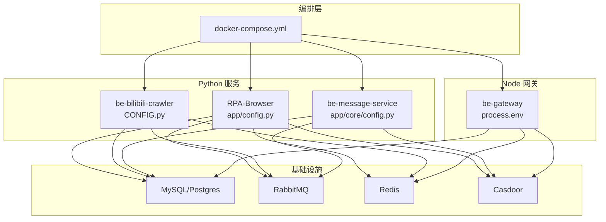
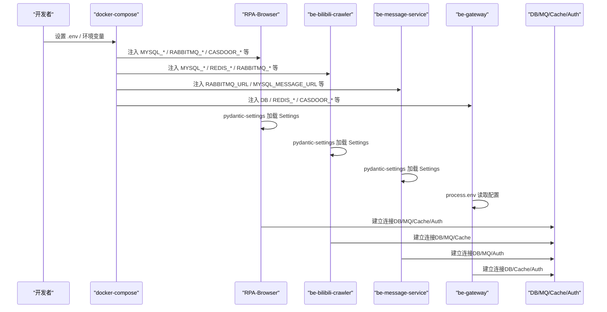
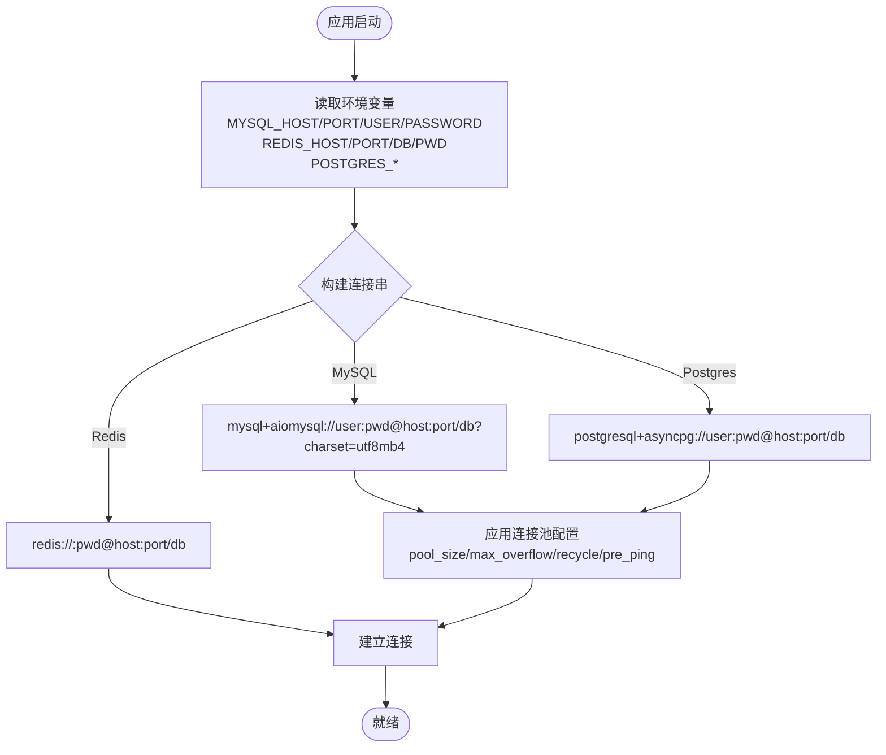
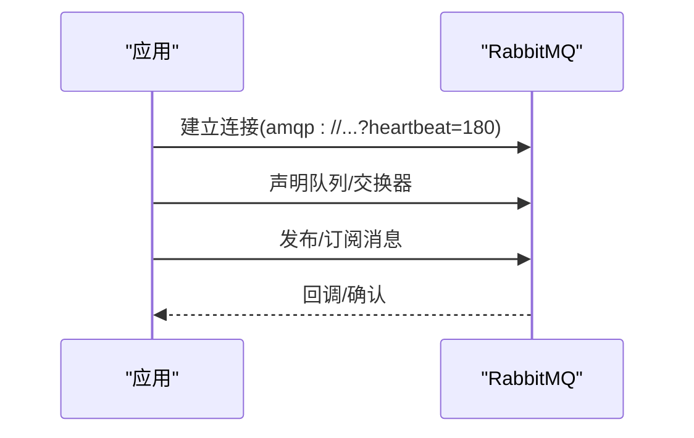
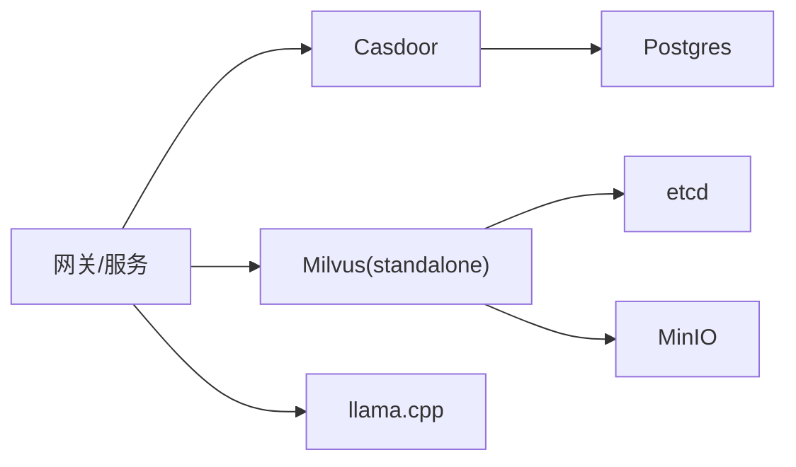
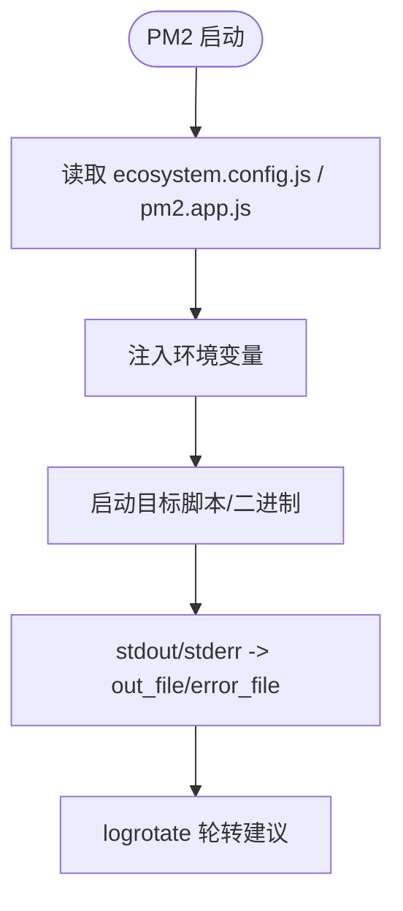
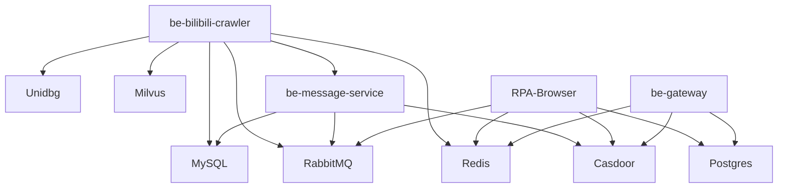

# 环境配置管理

<cite>
**本文引用的文件**
- [docker-compose.yml](file://docker-compose.yml)
- [RPA-Browser/app/config.py](file://RPA-Browser/app/config.py)
- [be-bilibili-crawler/CONFIG.py](file://be-bilibili-crawler/CONFIG.py)
- [be-message-service/app/core/config.py](file://be-message-service/app/core/config.py)
- [pm2.app.js](file://pm2.app.js)
- [be-bilibili-crawler/ecosystem.config.js](file://be-bilibili-crawler/ecosystem.config.js)
- [be-gateway/ExpressServerEnd/DAO/Redis/RedisManager.js](file://be-gateway/ExpressServerEnd/DAO/Redis/RedisManager.js)
- [be-gateway/ExpressServerEnd/config/casdoor_config.js](file://be-gateway/ExpressServerEnd/config/casdoor_config.js)
</cite>

## 目录
1. [简介](#简介)
2. [项目结构](#项目结构)
3. [核心组件](#核心组件)
4. [架构总览](#架构总览)
5. [详细组件分析](#详细组件分析)
6. [依赖关系分析](#依赖关系分析)
7. [性能与资源建议](#性能与资源建议)
8. [故障排查指南](#故障排查指南)
9. [结论](#结论)
10. [附录：环境变量清单与环境模板](#附录环境变量清单与环境模板)

## 简介
本文件面向多服务后端（Python/Node/Go）的统一环境配置管理，覆盖 .env 环境变量、数据库连接、消息队列、第三方服务集成与安全密钥管理；提供开发/测试/生产环境的配置模板与最佳实践；并给出 PM2 进程管理、日志轮转与资源监控的配置建议。重点解决环境变量注入、配置热更新与敏感信息保护等工程问题。

## 项目结构
本项目采用容器化编排（docker-compose）统一注入环境变量，各服务通过 pydantic-settings 或 process.env 读取配置。关键入口如下：
- 容器编排与环境变量注入：docker-compose.yml
- Python 服务配置加载：
  - RPA-Browser：app/config.py
  - be-bilibili-crawler：CONFIG.py
  - be-message-service：app/core/config.py
- Node 网关：process.env 直接读取（Redis、Casdoor 等）
- PM2 进程管理：pm2.app.js、ecosystem.config.js

图表来源
- [docker-compose.yml:68-178](file://docker-compose.yml#L68-L178)
- [docker-compose.yml:179-226](file://docker-compose.yml#L179-L226)
- [docker-compose.yml:227-309](file://docker-compose.yml#L227-L309)

章节来源
- [docker-compose.yml:1-380](file://docker-compose.yml#L1-L380)

## 核心组件
- 环境变量加载机制
  - Python 服务使用 pydantic-settings 的 BaseSettings，支持从 .env 文件与环境变量双重加载，并按优先级合并。
  - Node 服务通过 process.env 直接读取。
- 配置项分组
  - 数据库连接：MySQL、Postgres、Redis
  - 消息队列：RabbitMQ
  - 第三方服务：Casdoor、向量库（Milvus）、LLM 服务、代理/V2Ray
  - 安全密钥：JWT、Casdoor 凭证、推送渠道 Token
- 运行期行为开关
  - 日志级别、是否开发模式、自动迁移、健康检查等

章节来源
- [RPA-Browser/app/config.py:140-216](file://RPA-Browser/app/config.py#L140-L216)
- [be-bilibili-crawler/CONFIG.py:225-277](file://be-bilibili-crawler/CONFIG.py#L225-L277)
- [be-message-service/app/core/config.py:5-40](file://be-message-service/app/core/config.py#L5-L40)
- [be-gateway/ExpressServerEnd/DAO/Redis/RedisManager.js:1-21](file://be-gateway/ExpressServerEnd/DAO/Redis/RedisManager.js#L1-L21)

## 架构总览
下图展示环境变量在 docker-compose 中注入到各服务的流程，以及服务对配置的读取路径。

图表来源
- [docker-compose.yml:120-164](file://docker-compose.yml#L120-L164)
- [docker-compose.yml:179-226](file://docker-compose.yml#L179-L226)
- [docker-compose.yml:227-309](file://docker-compose.yml#L227-L309)
- [RPA-Browser/app/config.py:166-174](file://RPA-Browser/app/config.py#L166-L174)
- [be-bilibili-crawler/CONFIG.py:269-274](file://be-bilibili-crawler/CONFIG.py#L269-L274)
- [be-message-service/app/core/config.py:338-342](file://be-message-service/app/core/config.py#L338-L342)

## 详细组件分析

### 数据库连接配置
- MySQL（业务与消息库）
  - 由 docker-compose 注入主机名、端口、用户名与密码，服务侧拼接为 SQLAlchemy 异步连接串。
  - 连接池参数（pool_size、max_overflow、recycle、pre_ping）在服务配置中集中定义，避免连接泄漏与陈旧连接问题。
- Postgres（PPTR 数据）
  - 由 docker-compose 注入用户、密码、主机名，服务侧以 asyncpg 连接。
- Redis
  - 通过 host/port/db/pwd 组合成 redis:// URL，供缓存与会话使用。

图表来源
- [be-bilibili-crawler/CONFIG.py:330-379](file://be-bilibili-crawler/CONFIG.py#L330-L379)
- [be-message-service/app/core/config.py:41-74](file://be-message-service/app/core/config.py#L41-L74)
- [be-gateway/ExpressServerEnd/DAO/Redis/RedisManager.js:1-21](file://be-gateway/ExpressServerEnd/DAO/Redis/RedisManager.js#L1-L21)

章节来源
- [be-bilibili-crawler/CONFIG.py:330-419](file://be-bilibili-crawler/CONFIG.py#L330-L419)
- [be-message-service/app/core/config.py:41-74](file://be-message-service/app/core/config.py#L41-L74)
- [be-gateway/ExpressServerEnd/DAO/Redis/RedisManager.js:1-21](file://be-gateway/ExpressServerEnd/DAO/Redis/RedisManager.js#L1-L21)

### 消息队列配置（RabbitMQ）
- 连接方式
  - Python 服务通过 amqp://... 连接，包含心跳参数以避免长耗时任务导致连接关闭。
  - Node 网关通过 Redis 进行限流/缓存，不直接消费 MQ。
- 队列与路由
  - 爬虫服务定义了队列名枚举，便于统一管理。

图表来源
- [be-bilibili-crawler/CONFIG.py:422-433](file://be-bilibili-crawler/CONFIG.py#L422-L433)
- [be-message-service/app/core/config.py:19-24](file://be-message-service/app/core/config.py#L19-L24)
- [docker-compose.yml:94-109](file://docker-compose.yml#L94-L109)

章节来源
- [be-bilibili-crawler/CONFIG.py:422-433](file://be-bilibili-crawler/CONFIG.py#L422-L433)
- [be-message-service/app/core/config.py:19-24](file://be-message-service/app/core/config.py#L19-L24)
- [docker-compose.yml:94-109](file://docker-compose.yml#L94-L109)

### 第三方服务集成配置
- Casdoor（OAuth2/OIDC）
  - 网关与服务端均通过环境变量注入 endpoint、client_id、client_secret、organization、application、certificate 等。
  - 证书中的换行符需正确转换以便 PEM 解析。
- Milvus（向量检索）
  - 通过 etcd/minio 支撑，standalone 服务暴露 19530 端口，服务侧通过环境变量 HOST/PORT 访问。
- LLM 服务
  - 支持外部 OpenAI 兼容 API 列表与本地 llama.cpp 服务，按优先级调用。

图表来源
- [docker-compose.yml:165-226](file://docker-compose.yml#L165-L226)
- [docker-compose.yml:323-356](file://docker-compose.yml#L323-L356)
- [be-gateway/ExpressServerEnd/config/casdoor_config.js:1-13](file://be-gateway/ExpressServerEnd/config/casdoor_config.js#L1-L13)
- [be-message-service/app/core/config.py:301-328](file://be-message-service/app/core/config.py#L301-L328)

章节来源
- [docker-compose.yml:165-226](file://docker-compose.yml#L165-L226)
- [docker-compose.yml:323-356](file://docker-compose.yml#L323-L356)
- [be-gateway/ExpressServerEnd/config/casdoor_config.js:1-13](file://be-gateway/ExpressServerEnd/config/casdoor_config.js#L1-L13)
- [be-message-service/app/core/config.py:301-328](file://be-message-service/app/core/config.py#L301-L328)

### 安全密钥管理
- JWT
  - 各服务维护独立的 secret、算法与过期时间，确保跨服务鉴权一致性。
- Casdoor 凭证
  - client_id/client_secret/organization/application/certificate 等通过环境变量注入，禁止硬编码。
- 推送渠道 Token
  - 通过统一的 MESSAGE_CONFIG JSON 注入，避免分散散落的环境变量。

章节来源
- [be-message-service/app/core/config.py:301-336](file://be-message-service/app/core/config.py#L301-L336)
- [RPA-Browser/app/config.py:140-216](file://RPA-Browser/app/config.py#L140-L216)
- [be-bilibili-crawler/CONFIG.py:225-277](file://be-bilibili-crawler/CONFIG.py#L225-L277)

### PM2 进程管理与日志
- PM2 配置
  - 根级 pm2.app.js 用于管理 Go 二进制进程；crawler 子项目 ecosystem.config.js 用于 Python FastAPI 进程。
- 日志输出
  - 默认将 stdout/stderr 重定向至 /dev/null，生产环境建议改为文件输出并结合 logrotate 轮转。
- 环境变量注入
  - 可通过 env 字段注入 LANG 等运行时环境变量。

图表来源
- [pm2.app.js:1-11](file://pm2.app.js#L1-L11)
- [be-bilibili-crawler/ecosystem.config.js:1-14](file://be-bilibili-crawler/ecosystem.config.js#L1-L14)

章节来源
- [pm2.app.js:1-11](file://pm2.app.js#L1-L11)
- [be-bilibili-crawler/ecosystem.config.js:1-14](file://be-bilibili-crawler/ecosystem.config.js#L1-L14)

## 依赖关系分析
- 服务间依赖
  - be-bilibili-crawler 依赖 MySQL、Redis、RabbitMQ、Unidbg、Milvus、Message Service。
  - be-message-service 依赖 RabbitMQ、MySQL、Casdoor。
  - RPA-Browser 依赖 Postgres、Redis、RabbitMQ、Casdoor。
  - be-gateway 依赖 Postgres、Redis、Casdoor。
- 配置耦合点
  - 所有服务通过 docker-compose 统一注入环境变量，降低配置漂移风险。
  - 共享推送渠道配置（MESSAGE_CONFIG）保证通知策略一致。

图表来源
- [docker-compose.yml:120-164](file://docker-compose.yml#L120-L164)
- [docker-compose.yml:179-226](file://docker-compose.yml#L179-L226)
- [docker-compose.yml:227-309](file://docker-compose.yml#L227-L309)

章节来源
- [docker-compose.yml:120-309](file://docker-compose.yml#L120-L309)

## 性能与资源建议
- 连接池调优
  - MySQL/Postgres：根据实例规格调整 pool_size、max_overflow、pool_recycle，启用 pre_ping 避免陈旧连接。
  - Redis：合理设置 db 分片，避免热点 key 冲突。
- 日志与可观测性
  - 生产环境建议仅输出 WARNING 及以上日志，结合结构化日志与集中收集。
  - 对长耗时任务（如 MQ 消费者）适当增大心跳与超时。
- 资源限制
  - 通过 docker-compose deploy.resources 限制内存/CPU，避免单服务占用过多资源。

[本节为通用指导，无需特定文件引用]

## 故障排查指南
- 常见问题
  - 数据库连接失败：检查 MYSQL_HOST/PORT/USER/PASSWORD 是否正确，连接池上限是否过大导致 Too many connections。
  - RabbitMQ 连接断开：确认 heartbeat 参数与服务端一致，网络可达。
  - Casdoor 证书错误：确认 certificate 中的换行符已正确转换。
  - Redis 连接失败：检查 REDIS_HOST/PORT/DB/PWD 与防火墙策略。
- 定位方法
  - 查看服务健康检查端点（如 /health）。
  - 检查容器日志与 PM2 输出文件。
  - 使用 docker exec 进入容器验证连通性。

章节来源
- [be-message-service/app/core/config.py:351-360](file://be-message-service/app/core/config.py#L351-L360)
- [docker-compose.yml:310-322](file://docker-compose.yml#L310-L322)

## 结论
通过 docker-compose 统一注入环境变量，配合 pydantic-settings 与 process.env 的强类型配置模型，实现了跨语言、跨服务的一致配置管理。建议在 CI/CD 中校验 .env 完整性，在生产环境严格隔离敏感信息，并通过日志与监控保障稳定性。

[本节为总结性内容，无需特定文件引用]

## 附录：环境变量清单与环境模板

### 环境变量清单（按服务分类）
- 公共与基础设施
  - ENV_TZ：时区
  - MYSQL_PASSWORD、POSTGRES_PASSWORD、POSTGRES_USER、POSTGRES_HOST
  - REDIS_HOST、REDIS_PORT、REDIS_PWD、REDIS_DB
  - RABBITMQ_USER、RABBITMQ_PASSWORD、RABBITMQ_HOST、RABBITMQ_PORT
  - CASDOOR_ENDPOINT、CASDOOR_CLIENT_ID、CASDOOR_CLIENT_SECRET、CASDOOR_ORGANIZATION、CASDOOR_APPLICATION、CASDOOR_CERTIFICATE、CASDOOR_ADMIN_*
  - MILVUS_HOST、MILVUS_PORT
  - LLAMA_PORT、LLAMA_ARG_*
- be-bilibili-crawler
  - MYSQL_HOST、MYSQL_PORT、MYSQL_USER、MYSQL_PASSWORD
  - REDIS_HOST、REDIS_PORT、REDIS_PWD
  - RABBITMQ_HOST、RABBITMQ_PORT、RABBITMQ_USER、RABBITMQ_PASSWORD
  - UNIDBG_HOST、UNIDBG_PORT
  - V2RAY_HOST、V2RAY_PORT
  - PROXY_SERVER、SHOW_LOG、IS_DEV
  - MESSAGE_SERVICE_HOST、MESSAGE_SERVICE_PORT
  - MESSAGE_CONFIG（JSON）
  - llm_apis（JSON 数组）
- be-message-service
  - RABBITMQ_URL
  - LOG_LEVEL、APP_ENV、LOG_FILE_DIR
  - MYSQL_MESSAGE_URL、dm_content_db_prefix、dm_content_table_prefix、dm_content_table_count
  - postgres_pptr_url、postgres_pptr_schema
  - GEOIP_MMDB_DIR
  - JWT_SECRET、JWT_ALGORITHM、JWT_EXPIRES_SECONDS
  - CASDOOR_*（同上）
  - MESSAGE_CONFIG（JSON）
- RPA-Browser
  - mysql_browser_info_url
  - controller_base_path
  - proxy_server_url
  - GEMINI_API_KEY
  - RABBITMQ_URL
  - MESSAGE_CONFIG（JSON）
  - SERVER_NAME、SERVER_ADDRESS
- be-gateway（Node）
  - DB（Postgres 连接串）
  - REDIS_HOST、REDIS_PORT、REDIS_PWD、REDIS_DB
  - BILI_CRAWLER_URI、RPA_SERVICE_URI、MESSAGE_SERVICE_URI
  - CASDOOR_*（同上）

章节来源
- [docker-compose.yml:68-178](file://docker-compose.yml#L68-L178)
- [docker-compose.yml:179-226](file://docker-compose.yml#L179-L226)
- [docker-compose.yml:227-309](file://docker-compose.yml#L227-L309)
- [be-bilibili-crawler/CONFIG.py:225-277](file://be-bilibili-crawler/CONFIG.py#L225-L277)
- [be-message-service/app/core/config.py:5-40](file://be-message-service/app/core/config.py#L5-L40)
- [RPA-Browser/app/config.py:140-216](file://RPA-Browser/app/config.py#L140-L216)
- [be-gateway/ExpressServerEnd/DAO/Redis/RedisManager.js:1-21](file://be-gateway/ExpressServerEnd/DAO/Redis/RedisManager.js#L1-L21)

### 环境模板（示例）
- 开发环境（.env.dev）
  - 开启调试日志、宽松的连接池与队列参数
  - 使用本地或容器内基础服务地址
- 测试环境（.env.test）
  - 隔离的数据库与队列实例
  - 固定随机种子与测试账号
- 生产环境（.env.prod）
  - 最小化日志输出、严格的连接池与超时
  - 使用专用域名与证书、强密码与密钥轮换

[本节为模板说明，不包含具体代码内容]

### 最佳实践
- 环境变量注入
  - 优先通过 docker-compose environment 注入，避免在镜像中固化敏感信息。
  - 使用 pydantic-settings 的 env_file 指定不同环境的 .env 文件。
- 配置热更新
  - 对于非关键配置（如日志级别），可在服务重启后生效；关键配置（如数据库连接）不建议热更。
  - 通过配置中心或动态配置接口实现灰度更新（可选）。
- 敏感信息保护
  - 严禁将密钥提交至版本库；使用环境变量或密钥管理服务。
  - 对证书中的换行符进行规范化处理，避免解析失败。

[本节为通用指导，无需特定文件引用]