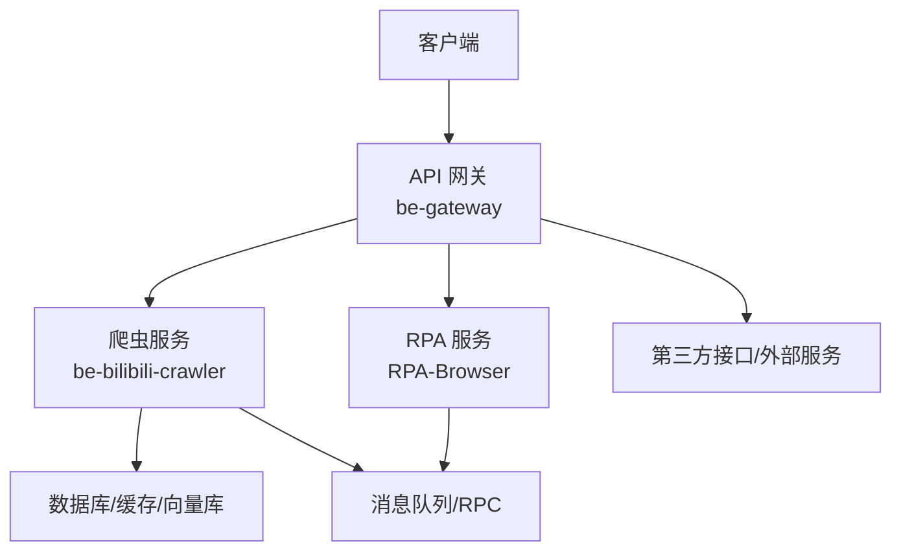
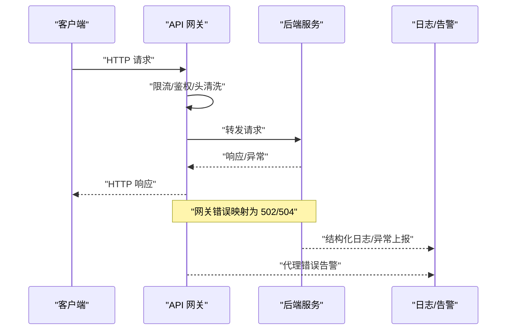
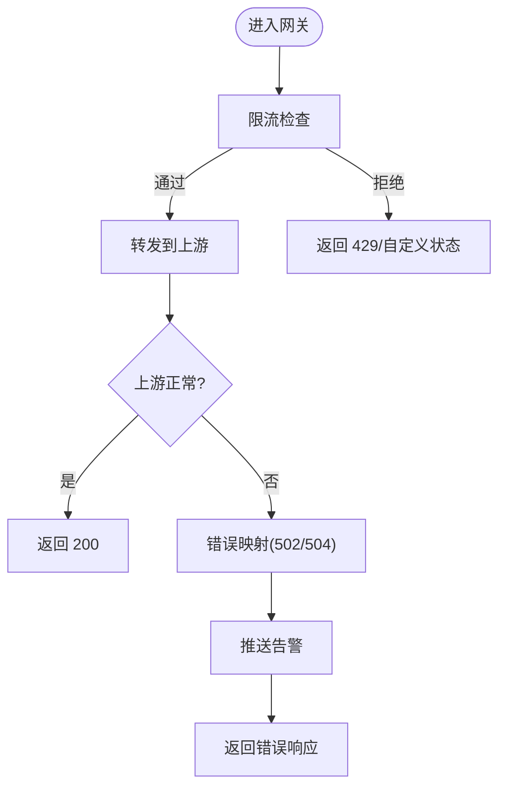
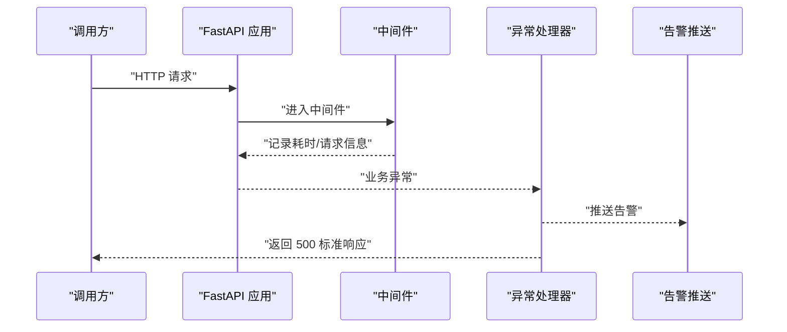
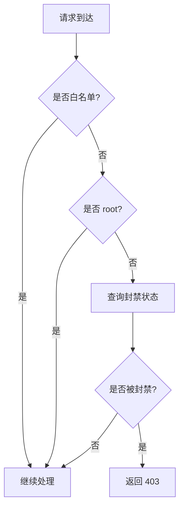
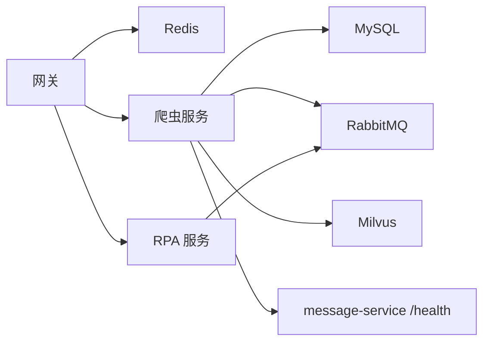

# API 接口监控

<cite>
**本文引用的文件**
- [RPA-Browser/main.py](file://RPA-Browser/main.py)
- [be-bilibili-crawler/main.py](file://be-bilibili-crawler/main.py)
- [be-bilibili-crawler/Utils/FastAPI/FastapiLifespan.py](file://be-bilibili-crawler/Utils/FastAPI/FastapiLifespan.py)
- [be-bilibili-crawler/log/base_log.py](file://be-bilibili-crawler/log/base_log.py)
- [be-gateway/ExpressServerEnd/app.js](file://be-gateway/ExpressServerEnd/app.js)
- [be-gateway/ExpressServerEnd/MiddleWare/Limiter.js](file://be-gateway/ExpressServerEnd/MiddleWare/Limiter.js)
- [be-gateway/ExpressServerEnd/Controller/ProxyHelper.js](file://be-gateway/ExpressServerEnd/Controller/ProxyHelper.js)
- [RPA-Browser/app/utils/middlewares/ban_guard.py](file://RPA-Browser/app/utils/middlewares/ban_guard.py)
- [be-bilibili-crawler/controller/common/CommonRouter.py](file://be-bilibili-crawler/controller/common/CommonRouter.py)
</cite>

## 目录
1. [简介](#简介)
2. [项目结构](#项目结构)
3. [核心组件](#核心组件)
4. [架构总览](#架构总览)
5. [详细组件分析](#详细组件分析)
6. [依赖关系分析](#依赖关系分析)
7. [性能考量](#性能考量)
8. [故障排查指南](#故障排查指南)
9. [结论](#结论)
10. [附录](#附录)

## 简介
本文件面向本仓库的 API 接口监控体系，覆盖 HTTP API 的性能监控、错误率监控与响应时间监控；说明接口调用统计、请求链路追踪与异常请求监控；涵盖 API 网关监控、微服务间调用监控与第三方接口调用监控；并提供接口性能基准测试建议、容量规划与限流策略配置；最后给出超时、错误处理与性能优化问题的解决思路。

## 项目结构
本项目包含多个子系统：
- RPA-Browser：基于 FastAPI 的浏览器自动化服务，提供生命周期管理、路由注册与 RPC 客户端/服务端启动。
- be-bilibili-crawler：基于 FastAPI 的爬虫与数据服务，提供全局中间件日志、统一异常处理与健康检查等能力。
- be-gateway：基于 Express 的网关层，负责限流、上游转发、错误映射与告警推送。
- be-message-service：消息与通知服务（在本文档中作为被探测的健康端点）。
- Vue3FrontEndDemoExercise：前端工程（与本监控文档关联度较低）。

**图示来源**
- [be-gateway/ExpressServerEnd/app.js:33-66](file://be-gateway/ExpressServerEnd/app.js#L33-L66)
- [be-bilibili-crawler/main.py:48-60](file://be-bilibili-crawler/main.py#L48-L60)
- [RPA-Browser/main.py:36-74](file://RPA-Browser/main.py#L36-L74)

**章节来源**
- [RPA-Browser/main.py:36-74](file://RPA-Browser/main.py#L36-L74)
- [be-bilibili-crawler/main.py:48-60](file://be-bilibili-crawler/main.py#L48-L60)
- [be-gateway/ExpressServerEnd/app.js:33-66](file://be-gateway/ExpressServerEnd/app.js#L33-L66)

## 核心组件
- 网关层（be-gateway）
  - 限流：基于 Redis 的速率限制，支持按 IP 或自定义 key 生成器进行限流。
  - 错误映射：将上游网络错误映射为 502/504，并记录日志与推送告警。
  - 代理错误处理：在转发失败时发送系统级告警，返回标准错误响应。
- 爬虫服务（be-bilibili-crawler）
  - 全局中间件：记录请求耗时、IP、方法、路径、状态码与响应体（调试模式）。
  - 统一异常处理：捕获未处理异常，记录堆栈并推送告警，返回标准错误响应。
  - 健康检查与依赖探测：启动时检测数据库、Redis、MQ、Milvus、message-service 等关键依赖连通性。
- RPA 服务（RPA-Browser）
  - 生命周期：自动迁移、Schema 校验、后台任务与 RPC 连接管理。
  - 封禁拦截中间件：对被封禁用户直接返回 403，白名单路径放行。
- 日志体系（be-bilibili-crawler）
  - 多 logger 分类输出，支持异步写入、轮转与保留策略，便于集中采集与分析。

**章节来源**
- [be-gateway/ExpressServerEnd/MiddleWare/Limiter.js:1-69](file://be-gateway/ExpressServerEnd/MiddleWare/Limiter.js#L1-L69)
- [be-gateway/ExpressServerEnd/app.js:33-66](file://be-gateway/ExpressServerEnd/app.js#L33-L66)
- [be-gateway/ExpressServerEnd/Controller/ProxyHelper.js:40-133](file://be-gateway/ExpressServerEnd/Controller/ProxyHelper.js#L40-L133)
- [be-bilibili-crawler/main.py:63-112](file://be-bilibili-crawler/main.py#L63-L112)
- [be-bilibili-crawler/Utils/FastAPI/FastapiLifespan.py:20-61](file://be-bilibili-crawler/Utils/FastAPI/FastapiLifespan.py#L20-L61)
- [RPA-Browser/app/utils/middlewares/ban_guard.py:1-76](file://RPA-Browser/app/utils/middlewares/ban_guard.py#L1-L76)
- [be-bilibili-crawler/log/base_log.py:44-96](file://be-bilibili-crawler/log/base_log.py#L44-L96)

## 架构总览
下图展示从客户端到网关再到后端服务的请求链路，以及监控与告警的关键节点。

**图示来源**
- [be-gateway/ExpressServerEnd/app.js:33-66](file://be-gateway/ExpressServerEnd/app.js#L33-L66)
- [be-gateway/ExpressServerEnd/Controller/ProxyHelper.js:40-133](file://be-gateway/ExpressServerEnd/Controller/ProxyHelper.js#L40-L133)
- [be-bilibili-crawler/main.py:63-112](file://be-bilibili-crawler/main.py#L63-L112)

## 详细组件分析

### 网关监控与限流（be-gateway）
- 限流策略
  - 使用 Redis 存储计数，支持窗口大小、上限、key 生成器（默认 IP）、成功/失败跳过策略。
  - 可通过函数参数定制行为，如 skip、requestWasSuccessful 等。
- 错误映射与告警
  - 将 ETIMEDOUT/ESOCKETTIMEDOUT 映射为 504，其他上游错误映射为 502。
  - 代理错误时发送系统级告警（PushMe/PushPlus），并返回标准 JSON 响应。
- 请求链路追踪
  - 建议在网关层增加请求 ID 注入与透传，结合后端日志实现端到端追踪。

**图示来源**
- [be-gateway/ExpressServerEnd/MiddleWare/Limiter.js:1-69](file://be-gateway/ExpressServerEnd/MiddleWare/Limiter.js#L1-L69)
- [be-gateway/ExpressServerEnd/app.js:33-66](file://be-gateway/ExpressServerEnd/app.js#L33-L66)
- [be-gateway/ExpressServerEnd/Controller/ProxyHelper.js:40-133](file://be-gateway/ExpressServerEnd/Controller/ProxyHelper.js#L40-L133)

**章节来源**
- [be-gateway/ExpressServerEnd/MiddleWare/Limiter.js:1-69](file://be-gateway/ExpressServerEnd/MiddleWare/Limiter.js#L1-L69)
- [be-gateway/ExpressServerEnd/app.js:33-66](file://be-gateway/ExpressServerEnd/app.js#L33-L66)
- [be-gateway/ExpressServerEnd/Controller/ProxyHelper.js:40-133](file://be-gateway/ExpressServerEnd/Controller/ProxyHelper.js#L40-L133)

### 爬虫服务监控（be-bilibili-crawler）
- 性能监控
  - 全局中间件记录请求耗时、IP、方法、路径、状态码与响应体（调试模式）。
  - 可结合日志收集平台（如 ELK）进行聚合分析。
- 错误率监控
  - 统一异常处理器捕获所有未处理异常，记录堆栈并推送告警，返回标准错误响应。
- 依赖健康检查
  - 启动时检测 MySQL、Redis、RabbitMQ、Milvus、message-service 等关键依赖连通性，关键依赖失败则拒绝启动。
- 接口调用统计
  - 提供获取 LLM 实例统计的接口，可用于观测调用次数、成功率、平均耗时与 token 消耗。

**图示来源**
- [be-bilibili-crawler/main.py:63-112](file://be-bilibili-crawler/main.py#L63-L112)
- [be-bilibili-crawler/Utils/FastAPI/FastapiLifespan.py:20-61](file://be-bilibili-crawler/Utils/FastAPI/FastapiLifespan.py#L20-L61)
- [be-bilibili-crawler/controller/common/CommonRouter.py:34-65](file://be-bilibili-crawler/controller/common/CommonRouter.py#L34-L65)

**章节来源**
- [be-bilibili-crawler/main.py:63-112](file://be-bilibili-crawler/main.py#L63-L112)
- [be-bilibili-crawler/Utils/FastAPI/FastapiLifespan.py:20-61](file://be-bilibili-crawler/Utils/FastAPI/FastapiLifespan.py#L20-L61)
- [be-bilibili-crawler/controller/common/CommonRouter.py:34-65](file://be-bilibili-crawler/controller/common/CommonRouter.py#L34-L65)

### RPA 服务监控（RPA-Browser）
- 生命周期管理
  - 启动时执行数据库迁移与 Schema 一致性校验，确保服务可用。
  - 启动后台任务与 RPC 客户端/服务端，保障跨服务通信。
- 封禁拦截
  - 对被封禁用户直接返回 403，白名单路径（/docs、/health 等）放行。
  - 身份取自网关注入的请求头，root 角色不受影响。

**图示来源**
- [RPA-Browser/app/utils/middlewares/ban_guard.py:1-76](file://RPA-Browser/app/utils/middlewares/ban_guard.py#L1-L76)
- [RPA-Browser/main.py:36-74](file://RPA-Browser/main.py#L36-L74)

**章节来源**
- [RPA-Browser/app/utils/middlewares/ban_guard.py:1-76](file://RPA-Browser/app/utils/middlewares/ban_guard.py#L1-L76)
- [RPA-Browser/main.py:36-74](file://RPA-Browser/main.py#L36-L74)

### 日志与告警（be-bilibili-crawler）
- 多 logger 分类输出，支持异步写入、轮转与保留策略。
- 关键日志包括 fastapi、MQ、redis、bapi、ipv6_monitor 等，便于问题定位与指标采集。

**章节来源**
- [be-bilibili-crawler/log/base_log.py:44-96](file://be-bilibili-crawler/log/base_log.py#L44-L96)

## 依赖关系分析
- 网关依赖
  - Redis：用于限流计数存储。
  - 上游服务：爬虫服务、RPA 服务等。
  - 告警通道：PushMe/PushPlus。
- 爬虫服务依赖
  - 数据库：MySQL（多库）。
  - 缓存/消息：Redis、RabbitMQ。
  - 向量库：Milvus。
  - 健康端点：message-service /health。
- RPA 服务依赖
  - 数据库：Alembic 迁移与 Schema 校验。
  - 消息队列：RPC 客户端/服务端。

**图示来源**
- [be-gateway/ExpressServerEnd/MiddleWare/Limiter.js:1-69](file://be-gateway/ExpressServerEnd/MiddleWare/Limiter.js#L1-L69)
- [be-bilibili-crawler/Utils/FastAPI/FastapiLifespan.py:183-251](file://be-bilibili-crawler/Utils/FastAPI/FastapiLifespan.py#L183-L251)
- [RPA-Browser/main.py:36-74](file://RPA-Browser/main.py#L36-L74)

**章节来源**
- [be-gateway/ExpressServerEnd/MiddleWare/Limiter.js:1-69](file://be-gateway/ExpressServerEnd/MiddleWare/Limiter.js#L1-L69)
- [be-bilibili-crawler/Utils/FastAPI/FastapiLifespan.py:183-251](file://be-bilibili-crawler/Utils/FastAPI/FastapiLifespan.py#L183-L251)
- [RPA-Browser/main.py:36-74](file://RPA-Browser/main.py#L36-L74)

## 性能考量
- 接口性能监控
  - 爬虫服务中间件已记录请求耗时与响应体（调试模式），建议在生产环境仅记录必要字段以减少开销。
  - 建议在网关层增加请求 ID 与耗时指标，便于端到端追踪。
- 错误率监控
  - 统一异常处理器与网关错误映射确保错误可观测与告警。
  - 建议接入指标采集（如 Prometheus）与可视化看板（如 Grafana）。
- 响应时间监控
  - 结合日志与指标，分析 P50/P90/P99 延迟分布，识别慢接口。
- 接口调用统计
  - 提供 LLM 统计接口，可用于观测调用次数、成功率、平均耗时与 token 消耗。
- 容量规划
  - 根据 QPS 峰值与延迟目标，评估网关与后端服务的水平扩展能力。
  - 限流阈值需结合业务高峰与下游承载能力动态调整。
- 限流策略配置
  - 网关使用 Redis 限流，可按 IP 或业务维度设置窗口与上限。
  - 建议对不同接口设置差异化限流策略，保护核心接口。

[本节为通用指导，不直接分析具体文件]

## 故障排查指南
- 接口超时
  - 网关将超时映射为 504，检查上游服务负载与网络状况。
  - 调整网关超时配置与重试策略（如有）。
- 错误处理
  - 爬虫服务统一异常处理器会记录堆栈并推送告警，检查告警通道与日志。
  - 网关代理错误会推送告警并返回标准错误响应，检查上游连通性与错误码映射。
- 性能优化
  - 减少响应体大小，避免在中间件中读取完整响应体（生产环境）。
  - 启用连接池、缓存热点数据、异步化 IO 操作。
  - 针对慢接口进行 SQL 优化与索引调整。

**章节来源**
- [be-gateway/ExpressServerEnd/app.js:33-66](file://be-gateway/ExpressServerEnd/app.js#L33-L66)
- [be-gateway/ExpressServerEnd/Controller/ProxyHelper.js:40-133](file://be-gateway/ExpressServerEnd/Controller/ProxyHelper.js#L40-L133)
- [be-bilibili-crawler/main.py:63-112](file://be-bilibili-crawler/main.py#L63-L112)

## 结论
本项目的 API 监控体系已在网关层与服务层实现了基础的性能、错误率与响应时间监控，并通过统一异常处理与告警推送提升了可观测性。建议进一步完善请求链路追踪、指标采集与可视化看板，结合容量规划与限流策略，持续提升系统的稳定性与性能。

[本节为总结，不直接分析具体文件]

## 附录
- 健康检查
  - 爬虫服务启动时检测 message-service /health，确保消息服务可用。
  - 建议在网关层暴露健康检查端点，便于负载均衡与健康探针。
- 日志规范
  - 使用分类 logger，统一格式与级别，便于集中采集与分析。
- 监控指标建议
  - QPS、错误率、P95/P99 延迟、上游超时率、限流触发率。

[本节为补充说明，不直接分析具体文件]