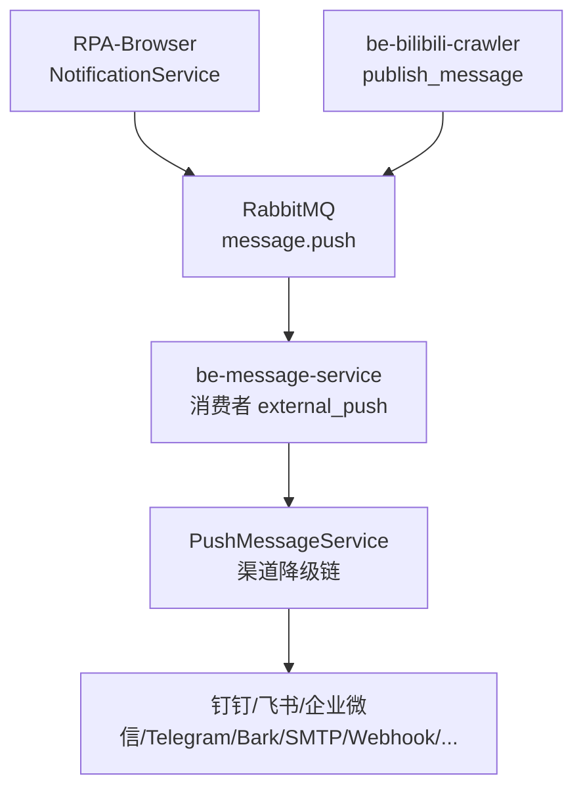
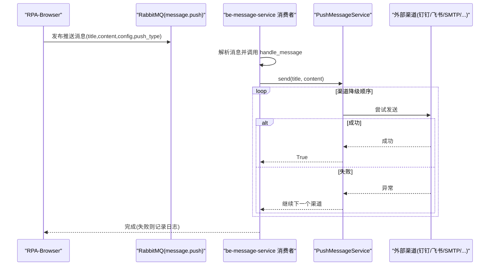
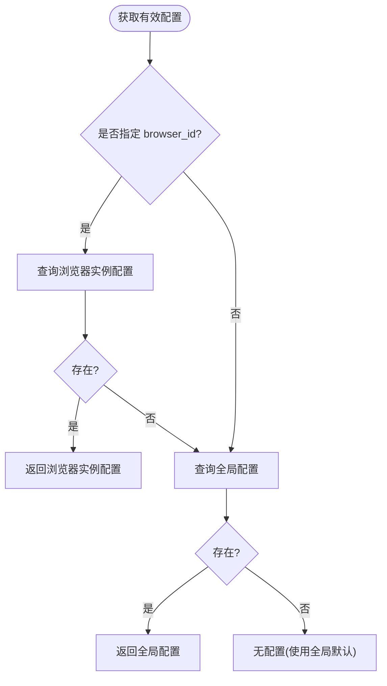
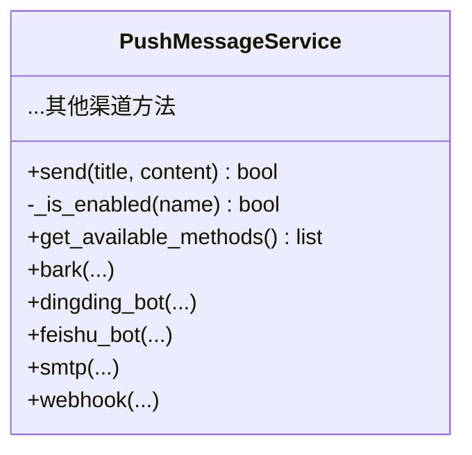
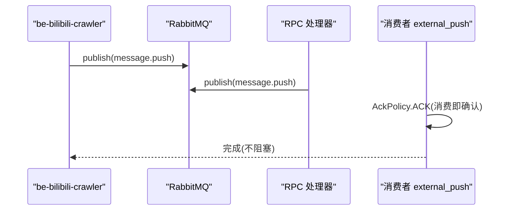
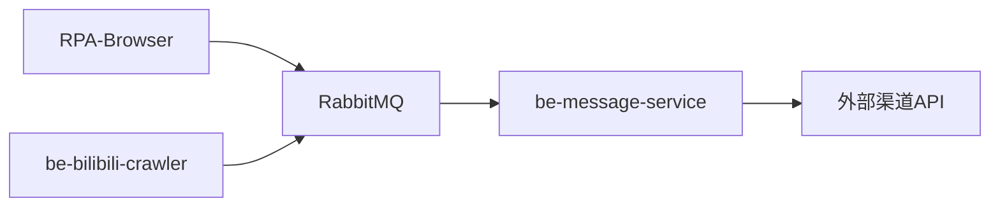

# 告警与通知

<cite>
**本文引用的文件**
- [be-message-service/app/services/message/external/push.py](file://be-message-service/app/services/message/external/push.py)
- [be-message-service/app/mq/consumers/external_push.py](file://be-message-service/app/mq/consumers/external_push.py)
- [be-message-service/app/mq/rpc_external_push.py](file://be-message-service/app/mq/rpc_external_push.py)
- [RPA-Browser/app/services/RPA_browser/browser/notification_service.py](file://RPA-Browser/app/services/RPA_browser/browser/notification_service.py)
- [RPA-Browser/app/models/notify/models.py](file://RPA-Browser/app/models/notify/models.py)
- [RPA-Browser/app/config.py](file://RPA-Browser/app/config.py)
- [be-bilibili-crawler/Service/MQ/message/message_pub.py](file://be-bilibili-crawler/Service/MQ/message/message_pub.py)
- [be-bilibili-crawler/controller/common/CommonRouter.py](file://be-bilibili-crawler/controller/common/CommonRouter.py)
</cite>

## 目录
1. [简介](#简介)
2. [项目结构](#项目结构)
3. [核心组件](#核心组件)
4. [架构总览](#架构总览)
5. [详细组件分析](#详细组件分析)
6. [依赖关系分析](#依赖关系分析)
7. [性能与可靠性](#性能与可靠性)
8. [故障排查指南](#故障排查指南)
9. [结论](#结论)
10. [附录：告警规则、阈值与分组建议](#附录：告警规则阈值与分组建议)

## 简介
本系统提供跨服务的统一告警与通知能力，覆盖监控告警触发、多渠道通知发送（邮件、短信、钉钉、飞书等）、告警降级与兜底策略。通过消息队列解耦生产与消费，保证高吞吐与高可用；通过渠道降级链提升送达率；通过配置管理实现灵活的告警模板与渠道开关。

## 项目结构
- RPA-Browser：业务侧负责读取用户级通知配置并发起推送请求，支持按浏览器实例维度选择配置。
- be-message-service：统一的推送执行服务，订阅消息队列，按渠道降级顺序依次尝试发送，失败即丢弃（不重投），避免风暴放大。
- be-bilibili-crawler：示例生产者，演示如何绕过第三方限流直接投递到 message-service 队列，确保测试告警必达。

**图表来源**
- [RPA-Browser/app/services/RPA_browser/browser/notification_service.py:161-191](file://RPA-Browser/app/services/RPA_browser/browser/notification_service.py#L161-L191)
- [be-bilibili-crawler/Service/MQ/message/message_pub.py:45-62](file://be-bilibili-crawler/Service/MQ/message/message_pub.py#L45-L62)
- [be-message-service/app/mq/consumers/external_push.py:20-27](file://be-message-service/app/mq/consumers/external_push.py#L20-L27)
- [be-message-service/app/services/message/external/push.py:664-708](file://be-message-service/app/services/message/external/push.py#L664-L708)

**章节来源**
- [RPA-Browser/app/services/RPA_browser/browser/notification_service.py:161-191](file://RPA-Browser/app/services/RPA_browser/browser/notification_service.py#L161-L191)
- [be-bilibili-crawler/Service/MQ/message/message_pub.py:45-62](file://be-bilibili-crawler/Service/MQ/message/message_pub.py#L45-L62)
- [be-message-service/app/mq/consumers/external_push.py:20-27](file://be-message-service/app/mq/consumers/external_push.py#L20-L27)
- [be-message-service/app/services/message/external/push.py:664-708](file://be-message-service/app/services/message/external/push.py#L664-L708)

## 核心组件
- 通知配置模型与CRUD：用于存储用户级或全局的通知渠道参数，支持按浏览器实例隔离。
- 统一推送服务：集中实现所有外部渠道的发送逻辑，并提供降级顺序与错误处理。
- 消息队列路由：生产者将告警消息投递至队列，消费者异步分发到各渠道，失败不重试。

**章节来源**
- [RPA-Browser/app/models/notify/models.py:13-106](file://RPA-Browser/app/models/notify/models.py#L13-L106)
- [RPA-Browser/app/config.py:13-138](file://RPA-Browser/app/config.py#L13-L138)
- [be-message-service/app/services/message/external/push.py:160-708](file://be-message-service/app/services/message/external/push.py#L160-L708)

## 架构总览

**图表来源**
- [be-bilibili-crawler/Service/MQ/message/message_pub.py:45-62](file://be-bilibili-crawler/Service/MQ/message/message_pub.py#L45-L62)
- [be-message-service/app/mq/consumers/external_push.py:20-27](file://be-message-service/app/mq/consumers/external_push.py#L20-L27)
- [be-message-service/app/services/message/external/push.py:664-708](file://be-message-service/app/services/message/external/push.py#L664-L708)

## 详细组件分析

### 通知配置与优先级
- 支持为每个用户创建“全局”或“浏览器实例特定”的通知配置。
- 查询时优先返回浏览器实例配置，否则回退到全局配置。
- 配置项包含各渠道所需密钥与参数，便于灵活启用/禁用渠道。

**图表来源**
- [RPA-Browser/app/services/RPA_browser/browser/notification_service.py:24-90](file://RPA-Browser/app/services/RPA_browser/browser/notification_service.py#L24-L90)

**章节来源**
- [RPA-Browser/app/services/RPA_browser/browser/notification_service.py:24-90](file://RPA-Browser/app/services/RPA_browser/browser/notification_service.py#L24-L90)
- [RPA-Browser/app/models/notify/models.py:13-106](file://RPA-Browser/app/models/notify/models.py#L13-L106)

### 统一推送服务与渠道降级
- 渠道列表与优先级：内置多类渠道（PushMe、PushPlus、SMTP、Telegram、Bark、钉钉、飞书、Server酱、PushDeer、企微机器人/应用、Gotify、Ntfy、WxPusher、Webhook 等）。
- 降级策略：按固定顺序尝试已启用的渠道，任一成功即停止；全部失败抛出异常，由消费者记录并结束。
- 发送语义：每个渠道在真正失败时抛异常；send() 负责降级与聚合错误信息。

**图表来源**
- [be-message-service/app/services/message/external/push.py:160-708](file://be-message-service/app/services/message/external/push.py#L160-L708)

**章节来源**
- [be-message-service/app/services/message/external/push.py:59-83](file://be-message-service/app/services/message/external/push.py#L59-L83)
- [be-message-service/app/services/message/external/push.py:628-708](file://be-message-service/app/services/message/external/push.py#L628-L708)

### 消息队列与消费者
- 生产者：RPA-Browser 与 be-bilibili-crawler 均通过消息队列投递推送消息。
- 消费者：external_push 消费者以 ACK 模式消费，失败不重投，避免重复推送与风暴放大。
- RPC 通道：提供 RPC 接口将 HTTP 请求转换为队列消息，非阻塞地触发推送。

**图表来源**
- [be-bilibili-crawler/Service/MQ/message/message_pub.py:45-62](file://be-bilibili-crawler/Service/MQ/message/message_pub.py#L45-L62)
- [be-message-service/app/mq/rpc_external_push.py:45-76](file://be-message-service/app/mq/rpc_external_push.py#L45-L76)
- [be-message-service/app/mq/consumers/external_push.py:20-27](file://be-message-service/app/mq/consumers/external_push.py#L20-L27)

**章节来源**
- [be-bilibili-crawler/Service/MQ/message/message_pub.py:45-62](file://be-bilibili-crawler/Service/MQ/message/message_pub.py#L45-L62)
- [be-message-service/app/mq/rpc_external_push.py:45-76](file://be-message-service/app/mq/rpc_external_push.py#L45-L76)
- [be-message-service/app/mq/consumers/external_push.py:20-27](file://be-message-service/app/mq/consumers/external_push.py#L20-L27)

### 告警触发与测试用例
- 示例：在公共路由中故意抛出异常并发布测试告警，验证 message-service 链路是否正常。
- 设计要点：直接投递到 message 队列，绕过第三方限流/去重，确保每次调用都能触发推送。

**章节来源**
- [be-bilibili-crawler/controller/common/CommonRouter.py:67-94](file://be-bilibili-crawler/controller/common/CommonRouter.py#L67-L94)

## 依赖关系分析
- RPA-Browser 依赖本地配置与数据库中的通知配置，并通过 push_msg.send 将消息投递到消息队列。
- be-bilibili-crawler 通过 MQ 直接发布消息，作为独立的生产者。
- be-message-service 依赖 RabbitMQ 与外部渠道 API，内部通过 PushMessageService 统一管理发送逻辑。

**图表来源**
- [RPA-Browser/app/services/RPA_browser/browser/notification_service.py:161-191](file://RPA-Browser/app/services/RPA_browser/browser/notification_service.py#L161-L191)
- [be-bilibili-crawler/Service/MQ/message/message_pub.py:45-62](file://be-bilibili-crawler/Service/MQ/message/message_pub.py#L45-L62)
- [be-message-service/app/services/message/external/push.py:664-708](file://be-message-service/app/services/message/external/push.py#L664-L708)

**章节来源**
- [RPA-Browser/app/services/RPA_browser/browser/notification_service.py:161-191](file://RPA-Browser/app/services/RPA_browser/browser/notification_service.py#L161-L191)
- [be-bilibili-crawler/Service/MQ/message/message_pub.py:45-62](file://be-bilibili-crawler/Service/MQ/message/message_pub.py#L45-L62)
- [be-message-service/app/services/message/external/push.py:664-708](file://be-message-service/app/services/message/external/push.py#L664-L708)

## 性能与可靠性
- 异步与共享客户端：HTTP 层使用共享 httpx.AsyncClient，减少连接开销。
- 降级链：按优先级顺序尝试多个渠道，提高送达率。
- 失败不重投：消费者采用 ACK 模式，失败即丢弃，避免风暴与重复推送。
- 超时控制：HTTP 请求设置合理超时，防止长尾阻塞。

[本节为通用指导，不直接分析具体文件]

## 故障排查指南
- 渠道不可用：检查对应渠道的配置字段是否齐全（如钉钉 token/secret、飞书 fskey、SMTP 服务器/邮箱/密码等）。
- 全部渠道失败：查看最后一条异常信息与日志，定位是哪个渠道失败以及原因。
- 未收到通知：确认是否存在可用的已启用渠道；若无，需至少配置一个渠道。
- 测试告警不生效：确认生产者是否正确投递到 message 队列，消费者是否正常运行。

**章节来源**
- [be-message-service/app/services/message/external/push.py:628-708](file://be-message-service/app/services/message/external/push.py#L628-L708)
- [be-message-service/app/mq/consumers/external_push.py:20-27](file://be-message-service/app/mq/consumers/external_push.py#L20-L27)

## 结论
本系统通过“配置驱动 + 消息队列 + 渠道降级”的设计，实现了高可靠、可扩展的告警与通知能力。结合用户级与全局配置，既能满足个性化需求，又能保障兜底可达性。建议在告警治理中配合阈值与分组策略，进一步降低噪音与误报。

## 附录：告警规则、阈值与分组建议
- 阈值设置
  - 基于时间窗口的计数阈值（例如 N 分钟内超过 M 次）触发告警。
  - 动态阈值联动：当举报/异常达到阈值时，仅加入审核队列或标记待处理，避免立即下架或升级影响业务。
- 告警去重
  - 同一资源 ID 在短时间窗口内合并为一次告警。
  - 渠道级去重：对第三方渠道（如 PushMe）进行限流与去重，避免被限流导致丢失。
- 告警分组
  - 按业务域/模块/环境分组，减少分散通知。
  - 标题前缀增加来源标签，便于区分不同服务或实例。
- 多渠道模板
  - 邮件：HTML/纯文本模板，支持变量替换。
  - 即时通讯：钉钉/飞书/企微/Telegram 等，适配富文本与卡片。
  - Webhook：自定义 JSON/表单，便于对接内部系统。
- 效果评估
  - 统计指标：送达率、失败率、平均耗时、渠道成功率。
  - 分析方法：按渠道/业务域/时间段聚合，识别瓶颈与问题渠道。
  - 改进措施：调整阈值、优化模板、切换更稳定的渠道。

[本节为概念性内容，不直接分析具体文件]