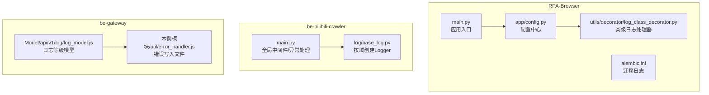
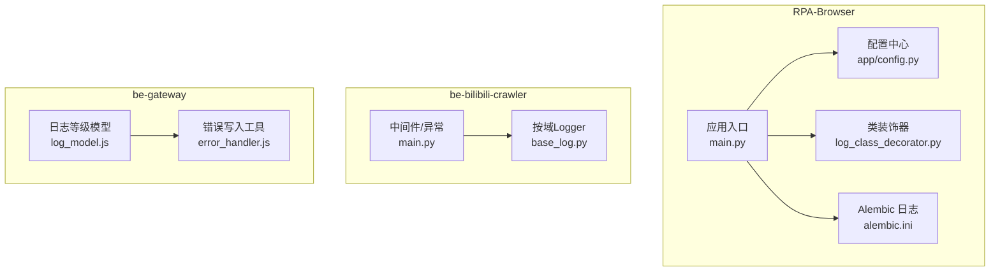
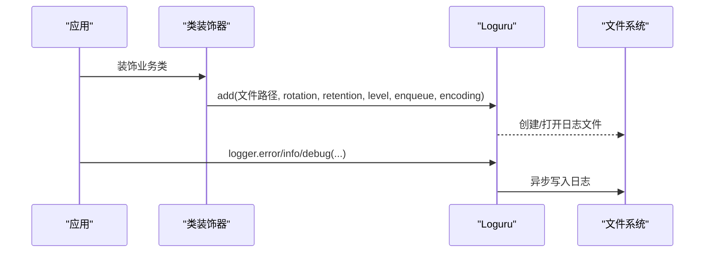
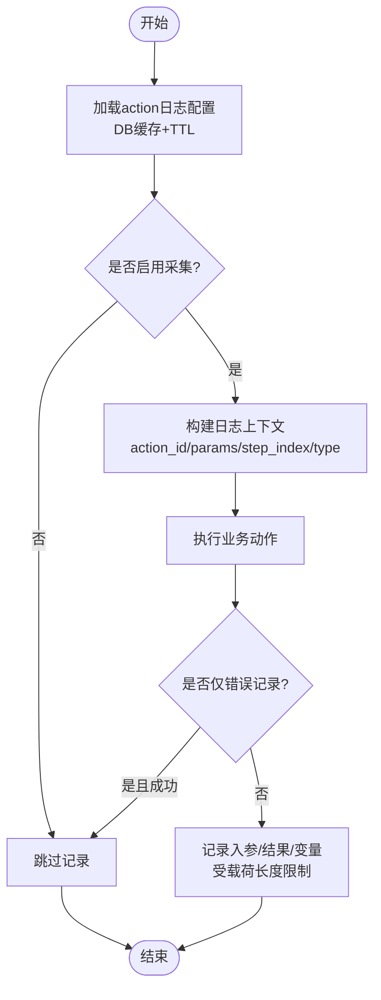
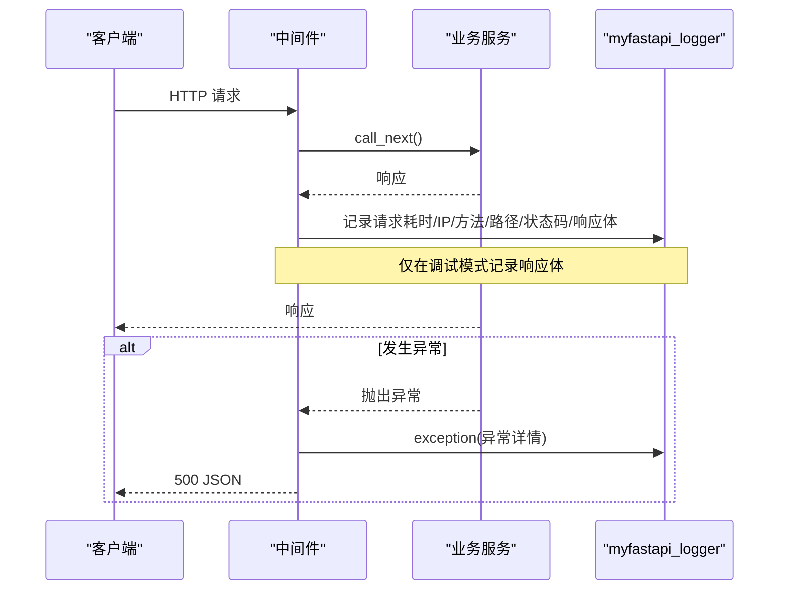
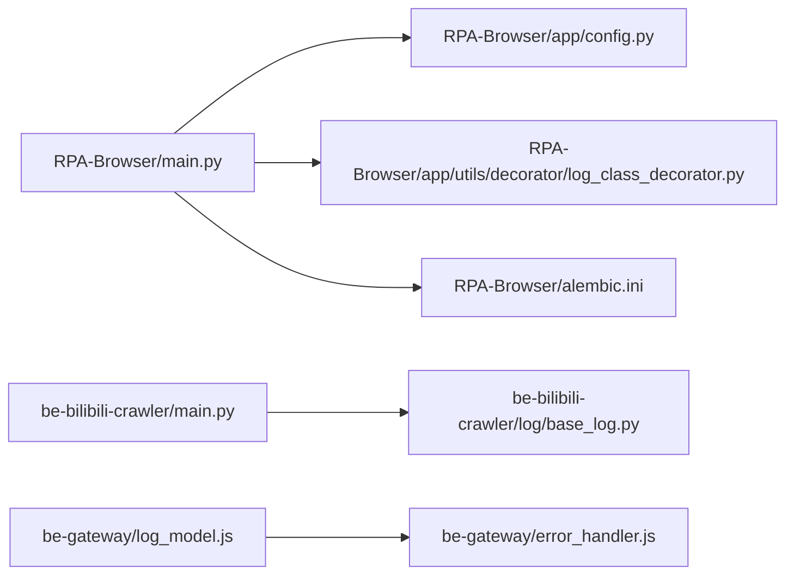

# 应用日志管理

<cite>
**本文引用的文件**
- [RPA-Browser/app/config.py](file://RPA-Browser/app/config.py)
- [RPA-Browser/app/utils/decorator/log_class_decorator.py](file://RPA-Browser/app/utils/decorator/log_class_decorator.py)
- [RPA-Browser/main.py](file://RPA-Browser/main.py)
- [RPA-Browser/alembic.ini](file://RPA-Browser/alembic.ini)
- [be-bilibili-crawler/log/base_log.py](file://be-bilibili-crawler/log/base_log.py)
- [be-bilibili-crawler/main.py](file://be-bilibili-crawler/main.py)
- [be-gateway/ExpressServerEnd/Model/api/v1/log/log_model.js](file://be-gateway/ExpressServerEnd/Model/api/v1/log/log_model.js)
- [be-gateway/木偶模块/util/error_handler.js](file://be-gateway/木偶模块/util/error_handler.js)
- [RPA-Browser/app/services/execution/action_logger.py](file://RPA-Browser/app/services/execution/action_logger.py)
- [RPA-Browser/app/models/workflow/models.py](file://RPA-Browser/app/models/workflow/models.py)
- [RPA-Browser/app/services/execution/actions/control_flow.py](file://RPA-Browser/app/services/execution/actions/control_flow.py)
</cite>

## 目录
1. [简介](#简介)
2. [项目结构](#项目结构)
3. [核心组件](#核心组件)
4. [架构总览](#架构总览)
5. [详细组件分析](#详细组件分析)
6. [依赖关系分析](#依赖关系分析)
7. [性能考虑](#性能考虑)
8. [故障排查指南](#故障排查指南)
9. [结论](#结论)
10. [附录](#附录)

## 简介
本文件面向多服务工程（Python FastAPI、Node.js Express）的日志体系，统一说明各服务的日志配置、格式规范、级别策略与轮转策略；重点阐述 Loguru 的使用方式与自定义处理器配置，覆盖结构化日志输出、日志轮转与文件管理、日志收集与分析集成建议，以及存储优化、敏感信息脱敏与安全合规实践。

## 项目结构
- RPA-Browser（Python/FastAPI）：使用 Loguru 作为统一日志框架，提供类装饰器自动为每个业务类生成独立日志文件，支持按大小轮转与保留期；通过配置集中管理路径与默认行为。
- be-bilibili-crawler（Python/FastAPI）：基于 Loguru 创建“用户维度”的独立 Logger，按业务域拆分日志文件，启用异步写入与压缩保留。
- be-gateway（Node.js/Express）：定义日志等级枚举，并提供错误记录工具将错误追加到本地日志文件。
- 数据库迁移（Alembic）：在 RPA-Browser 中通过 alembic.ini 配置标准 Python logging 输出至控制台。

图表来源
- [RPA-Browser/app/config.py:1-235](file://RPA-Browser/app/config.py#L1-L235)
- [RPA-Browser/app/utils/decorator/log_class_decorator.py:1-25](file://RPA-Browser/app/utils/decorator/log_class_decorator.py#L1-L25)
- [RPA-Browser/main.py:1-83](file://RPA-Browser/main.py#L1-L83)
- [RPA-Browser/alembic.ini:121-150](file://RPA-Browser/alembic.ini#L121-L150)
- [be-bilibili-crawler/log/base_log.py:1-96](file://be-bilibili-crawler/log/base_log.py#L1-L96)
- [be-bilibili-crawler/main.py:1-119](file://be-bilibili-crawler/main.py#L1-L119)
- [be-gateway/ExpressServerEnd/Model/api/v1/log/log_model.js:1-10](file://be-gateway/ExpressServerEnd/Model/api/v1/log/log_model.js#L1-L10)
- [be-gateway/木偶模块/util/error_handler.js:1-13](file://be-gateway/木偶模块/util/error_handler.js#L1-L13)

章节来源
- [RPA-Browser/app/config.py:1-235](file://RPA-Browser/app/config.py#L1-L235)
- [RPA-Browser/app/utils/decorator/log_class_decorator.py:1-25](file://RPA-Browser/app/utils/decorator/log_class_decorator.py#L1-L25)
- [RPA-Browser/main.py:1-83](file://RPA-Browser/main.py#L1-L83)
- [RPA-Browser/alembic.ini:121-150](file://RPA-Browser/alembic.ini#L121-L150)
- [be-bilibili-crawler/log/base_log.py:1-96](file://be-bilibili-crawler/log/base_log.py#L1-L96)
- [be-bilibili-crawler/main.py:1-119](file://be-bilibili-crawler/main.py#L1-L119)
- [be-gateway/ExpressServerEnd/Model/api/v1/log/log_model.js:1-10](file://be-gateway/ExpressServerEnd/Model/api/v1/log/log_model.js#L1-L10)
- [be-gateway/木偶模块/util/error_handler.js:1-13](file://be-gateway/木偶模块/util/error_handler.js#L1-L13)

## 核心组件
- RPA-Browser 日志
  - 配置中心：集中管理日志目录、运行模式、默认保留天数等。
  - 类装饰器：为被装饰类自动添加 Loguru 处理器，按类名生成独立日志文件，设置轮转与保留策略。
  - 应用入口：启动生命周期中初始化依赖、后台任务与 RPC，统一使用 Loguru 输出。
  - Alembic：通过 alembic.ini 将 SQL 与迁移日志输出到控制台。
- be-bilibili-crawler 日志
  - 按业务域创建独立 Logger，绑定唯一标识，过滤后写入各自文件，开启异步写入、压缩与保留期。
  - 应用入口：根据配置决定是否关闭默认日志输出并仅保留错误到控制台；中间件与异常处理统一记录请求耗时、IP、方法与响应体（调试模式）。
- be-gateway 日志
  - 定义日志等级枚举，便于前端或上层系统统一理解。
  - 错误处理工具：将错误时间戳、调用栈与消息追加到本地 log.txt。

章节来源
- [RPA-Browser/app/config.py:1-235](file://RPA-Browser/app/config.py#L1-L235)
- [RPA-Browser/app/utils/decorator/log_class_decorator.py:1-25](file://RPA-Browser/app/utils/decorator/log_class_decorator.py#L1-L25)
- [RPA-Browser/main.py:1-83](file://RPA-Browser/main.py#L1-L83)
- [RPA-Browser/alembic.ini:121-150](file://RPA-Browser/alembic.ini#L121-L150)
- [be-bilibili-crawler/log/base_log.py:1-96](file://be-bilibili-crawler/log/base_log.py#L1-L96)
- [be-bilibili-crawler/main.py:1-119](file://be-bilibili-crawler/main.py#L1-L119)
- [be-gateway/ExpressServerEnd/Model/api/v1/log/log_model.js:1-10](file://be-gateway/ExpressServerEnd/Model/api/v1/log/log_model.js#L1-L10)
- [be-gateway/木偶模块/util/error_handler.js:1-13](file://be-gateway/木偶模块/util/error_handler.js#L1-L13)

## 架构总览
下图展示三个服务的日志采集点与流向：Python 服务通过 Loguru 输出到文件，Node.js 服务将错误写入本地文件；所有服务均遵循统一的日志等级约定，便于后续接入日志收集与分析平台。

图表来源
- [RPA-Browser/app/config.py:1-235](file://RPA-Browser/app/config.py#L1-L235)
- [RPA-Browser/app/utils/decorator/log_class_decorator.py:1-25](file://RPA-Browser/app/utils/decorator/log_class_decorator.py#L1-L25)
- [RPA-Browser/main.py:1-83](file://RPA-Browser/main.py#L1-L83)
- [RPA-Browser/alembic.ini:121-150](file://RPA-Browser/alembic.ini#L121-L150)
- [be-bilibili-crawler/log/base_log.py:1-96](file://be-bilibili-crawler/log/base_log.py#L1-L96)
- [be-bilibili-crawler/main.py:1-119](file://be-bilibili-crawler/main.py#L1-L119)
- [be-gateway/ExpressServerEnd/Model/api/v1/log/log_model.js:1-10](file://be-gateway/ExpressServerEnd/Model/api/v1/log/log_model.js#L1-L10)
- [be-gateway/木偶模块/util/error_handler.js:1-13](file://be-gateway/木偶模块/util/error_handler.js#L1-L13)

## 详细组件分析

### RPA-Browser：Loguru 类级日志与轮转策略
- 类装饰器为每个被装饰类动态添加一个文件处理器，输出到 app/config 指定的 logs 目录，文件名以类名命名。
- 轮转策略：按文件大小触发轮转（例如 10 MB），保留期固定（例如 30 天），启用异步写入与 UTF-8 编码。
- 日志级别：默认 ERROR，适合生产环境减少噪音。
- 配置中心：集中定义日志目录路径与默认保留天数等参数，便于统一治理。

图表来源
- [RPA-Browser/app/utils/decorator/log_class_decorator.py:1-25](file://RPA-Browser/app/utils/decorator/log_class_decorator.py#L1-L25)
- [RPA-Browser/app/config.py:219-235](file://RPA-Browser/app/config.py#L219-L235)

章节来源
- [RPA-Browser/app/utils/decorator/log_class_decorator.py:1-25](file://RPA-Browser/app/utils/decorator/log_class_decorator.py#L1-L25)
- [RPA-Browser/app/config.py:1-235](file://RPA-Browser/app/config.py#L1-L235)

### RPA-Browser：操作执行日志采集（Action 维度）
- 支持按 action 维度控制是否采集日志、记录入参/结果/变量、仅错误时记录、载荷长度限制与保留天数。
- 解析优先级：子步骤可继承父步骤透传的采集配置，也可被自身参数覆盖；内置操作回落服务端兜底值。
- 缓存机制：对数据库读取的配置进行短期缓存，降低频繁查询开销。

图表来源
- [RPA-Browser/app/services/execution/action_logger.py:65-96](file://RPA-Browser/app/services/execution/action_logger.py#L65-L96)
- [RPA-Browser/app/models/workflow/models.py:255-289](file://RPA-Browser/app/models/workflow/models.py#L255-L289)
- [RPA-Browser/app/services/execution/actions/control_flow.py:257-274](file://RPA-Browser/app/services/execution/actions/control_flow.py#L257-L274)

章节来源
- [RPA-Browser/app/services/execution/action_logger.py:65-96](file://RPA-Browser/app/services/execution/action_logger.py#L65-L96)
- [RPA-Browser/app/models/workflow/models.py:255-289](file://RPA-Browser/app/models/workflow/models.py#L255-L289)
- [RPA-Browser/app/services/execution/actions/control_flow.py:257-274](file://RPA-Browser/app/services/execution/actions/control_flow.py#L257-L274)

### be-bilibili-crawler：按域 Logger 与全局中间件/异常处理
- 按域创建独立 Logger，绑定唯一 user_uq_value，通过 filter 精确路由到对应文件，避免串扰。
- 轮转与保留：按大小轮转、压缩归档、保留若干天；异步写入提升吞吐。
- 全局中间件：在调试模式下记录请求耗时、客户端 IP、方法、路径、状态码与响应体；非调试模式直接返回原始响应。
- 异常处理：统一捕获异常，记录详细信息并通过推送渠道告警。

图表来源
- [be-bilibili-crawler/log/base_log.py:44-60](file://be-bilibili-crawler/log/base_log.py#L44-L60)
- [be-bilibili-crawler/main.py:63-112](file://be-bilibili-crawler/main.py#L63-L112)

章节来源
- [be-bilibili-crawler/log/base_log.py:1-96](file://be-bilibili-crawler/log/base_log.py#L1-L96)
- [be-bilibili-crawler/main.py:1-119](file://be-bilibili-crawler/main.py#L1-L119)

### be-gateway：日志等级与错误写入
- 日志等级模型：定义 debug/info/warn/error/critical 数值映射，便于跨层统一。
- 错误写入工具：将错误时间戳、调用栈与消息追加到本地 log.txt，便于快速定位问题。

章节来源
- [be-gateway/ExpressServerEnd/Model/api/v1/log/log_model.js:1-10](file://be-gateway/ExpressServerEnd/Model/api/v1/log/log_model.js#L1-L10)
- [be-gateway/木偶模块/util/error_handler.js:1-13](file://be-gateway/木偶模块/util/error_handler.js#L1-L13)

## 依赖关系分析
- RPA-Browser
  - main.py 依赖配置中心与生命周期管理，统一使用 Loguru。
  - 类装饰器依赖配置中心的路径常量，确保日志落盘位置一致。
  - Alembic 通过 alembic.ini 配置控制台日志，便于迁移过程可观测。
- be-bilibili-crawler
  - base_log.py 提供按域 Logger，供 main.py 的中间件与异常处理复用。
  - main.py 根据配置开关默认日志输出，并在调试模式记录详细请求信息。
- be-gateway
  - 日志等级模型与错误写入工具解耦，便于扩展更多输出目标。

图表来源
- [RPA-Browser/main.py:1-83](file://RPA-Browser/main.py#L1-L83)
- [RPA-Browser/app/config.py:1-235](file://RPA-Browser/app/config.py#L1-L235)
- [RPA-Browser/app/utils/decorator/log_class_decorator.py:1-25](file://RPA-Browser/app/utils/decorator/log_class_decorator.py#L1-L25)
- [RPA-Browser/alembic.ini:121-150](file://RPA-Browser/alembic.ini#L121-L150)
- [be-bilibili-crawler/main.py:1-119](file://be-bilibili-crawler/main.py#L1-L119)
- [be-bilibili-crawler/log/base_log.py:1-96](file://be-bilibili-crawler/log/base_log.py#L1-L96)
- [be-gateway/ExpressServerEnd/Model/api/v1/log/log_model.js:1-10](file://be-gateway/ExpressServerEnd/Model/api/v1/log/log_model.js#L1-L10)
- [be-gateway/木偶模块/util/error_handler.js:1-13](file://be-gateway/木偶模块/util/error_handler.js#L1-L13)

章节来源
- [RPA-Browser/main.py:1-83](file://RPA-Browser/main.py#L1-L83)
- [RPA-Browser/app/config.py:1-235](file://RPA-Browser/app/config.py#L1-L235)
- [RPA-Browser/app/utils/decorator/log_class_decorator.py:1-25](file://RPA-Browser/app/utils/decorator/log_class_decorator.py#L1-L25)
- [RPA-Browser/alembic.ini:121-150](file://RPA-Browser/alembic.ini#L121-L150)
- [be-bilibili-crawler/main.py:1-119](file://be-bilibili-crawler/main.py#L1-L119)
- [be-bilibili-crawler/log/base_log.py:1-96](file://be-bilibili-crawler/log/base_log.py#L1-L96)
- [be-gateway/ExpressServerEnd/Model/api/v1/log/log_model.js:1-10](file://be-gateway/ExpressServerEnd/Model/api/v1/log/log_model.js#L1-L10)
- [be-gateway/木偶模块/util/error_handler.js:1-13](file://be-gateway/木偶模块/util/error_handler.js#L1-L13)

## 性能考虑
- 异步写入：Loguru 的 enqueue=True 将日志写入放入队列，降低主线程阻塞，提高吞吐。
- 轮转与压缩：按大小轮转并压缩归档，减少磁盘占用与 I/O 压力。
- 保留策略：合理设置 retention，避免历史日志无限增长。
- 按需记录：在 be-bilibili-crawler 中可通过配置关闭默认日志输出，仅保留错误，减少 IO。
- 缓存配置：RPA-Browser 的操作日志配置采用短期缓存，降低数据库访问频率。

[本节为通用性能指导，不直接分析具体文件]

## 故障排查指南
- RPA-Browser
  - 检查类装饰器是否正确添加处理器，确认日志目录存在且可写。
  - 核对轮转与保留策略是否符合预期，避免磁盘爆满。
  - 操作日志未记录时，检查 action 配置与缓存失效逻辑。
- be-bilibili-crawler
  - 若未看到请求日志，确认中间件是否在调试模式；检查 myfastapi_logger 是否已正确创建并绑定。
  - 异常未推送时，检查异常处理器与推送通道配置。
- be-gateway
  - 错误未写入文件时，检查 error_handler 的目标路径权限与磁盘空间。
  - 日志等级不一致时，对照 log_model.js 的枚举定义进行对齐。

章节来源
- [RPA-Browser/app/utils/decorator/log_class_decorator.py:1-25](file://RPA-Browser/app/utils/decorator/log_class_decorator.py#L1-L25)
- [RPA-Browser/app/services/execution/action_logger.py:65-96](file://RPA-Browser/app/services/execution/action_logger.py#L65-L96)
- [be-bilibili-crawler/main.py:63-112](file://be-bilibili-crawler/main.py#L63-L112)
- [be-gateway/木偶模块/util/error_handler.js:1-13](file://be-gateway/木偶模块/util/error_handler.js#L1-L13)

## 结论
本项目在多服务环境下实现了统一的日志体系：Python 侧基于 Loguru 提供高性能、可配置的日志能力，Node.js 侧提供基础日志等级与错误写入；通过类装饰器与按域 Logger 实现细粒度隔离，结合轮转与保留策略保障存储可控。建议在容器化环境中将日志输出到 stdout/stderr，由编排平台统一收集，并结合结构化字段与脱敏规则提升可观测性与安全性。

[本节为总结性内容，不直接分析具体文件]

## 附录

### 日志级别规范
- Python（Loguru）：默认使用内置级别（DEBUG/INFO/WARNING/ERROR/CRITICAL），RPA-Browser 类级处理器默认 ERROR，crawler 按域 WARNING。
- Node.js：定义 debug/info/warn/error/critical 数值映射，便于跨层统一。

章节来源
- [RPA-Browser/app/utils/decorator/log_class_decorator.py:16-23](file://RPA-Browser/app/utils/decorator/log_class_decorator.py#L16-L23)
- [be-bilibili-crawler/log/base_log.py:47-59](file://be-bilibili-crawler/log/base_log.py#L47-L59)
- [be-gateway/ExpressServerEnd/Model/api/v1/log/log_model.js:1-10](file://be-gateway/ExpressServerEnd/Model/api/v1/log/log_model.js#L1-L10)

### 结构化日志与字段建议
- 建议包含：时间戳、服务名、实例标识、请求ID、用户ID、模块/类名、级别、消息、堆栈（错误时）、关键业务键。
- RPA-Browser 操作日志：action_id、params/result/variables（受载荷长度限制）、仅错误标志、保留天数。
- crawler 中间件：请求耗时、客户端 IP、方法、路径、状态码、响应体（调试模式）。

章节来源
- [RPA-Browser/app/models/workflow/models.py:255-289](file://RPA-Browser/app/models/workflow/models.py#L255-L289)
- [be-bilibili-crawler/main.py:63-112](file://be-bilibili-crawler/main.py#L63-L112)

### 日志轮转策略与文件管理
- RPA-Browser：按类名生成独立日志文件，10 MB 轮转，保留 30 天。
- crawler：按域生成日志文件，10 MB 轮转，压缩归档，保留 15 天。
- 建议：统一日志根目录、按服务/域分文件夹、定期清理过期文件。

章节来源
- [RPA-Browser/app/utils/decorator/log_class_decorator.py:16-23](file://RPA-Browser/app/utils/decorator/log_class_decorator.py#L16-L23)
- [be-bilibili-crawler/log/base_log.py:47-59](file://be-bilibili-crawler/log/base_log.py#L47-L59)

### 日志收集与分析集成
- 推荐将 Python 日志输出到 stdout/stderr，由 Docker/K8s 收集到 ELK/Loki 等平台。
- Node.js 日志可同样输出到标准流，或使用统一日志库聚合。
- 建议引入结构化 JSON 格式，便于检索与指标提取。

[本节为通用集成建议，不直接分析具体文件]

### 存储优化与敏感信息脱敏
- 存储优化：启用异步写入、合理轮转与保留、压缩归档、限制 payload 长度。
- 敏感信息脱敏：对 IP、手机号、邮箱、令牌等关键字段进行掩码或哈希；在中间件或格式化阶段统一处理。
- 安全合规：最小化记录敏感数据，审计日志不可篡改，访问控制与加密存储。

[本节为通用安全与合规建议，不直接分析具体文件]