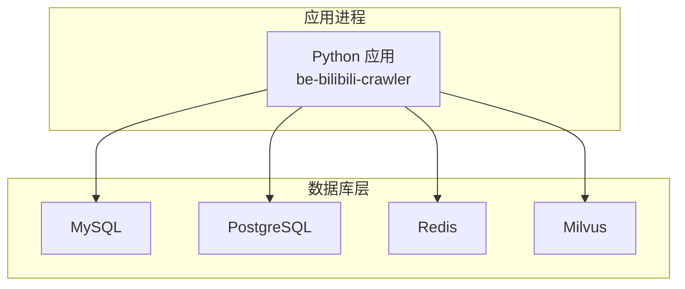
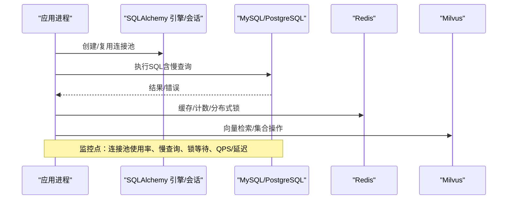
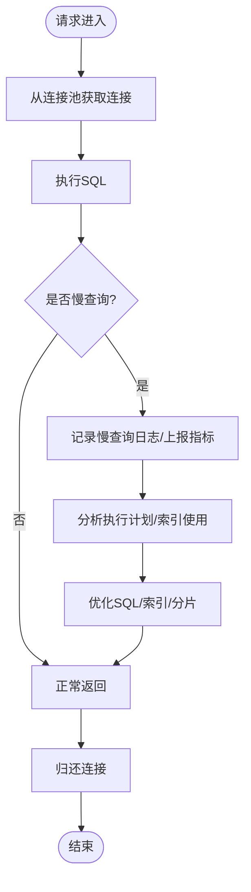
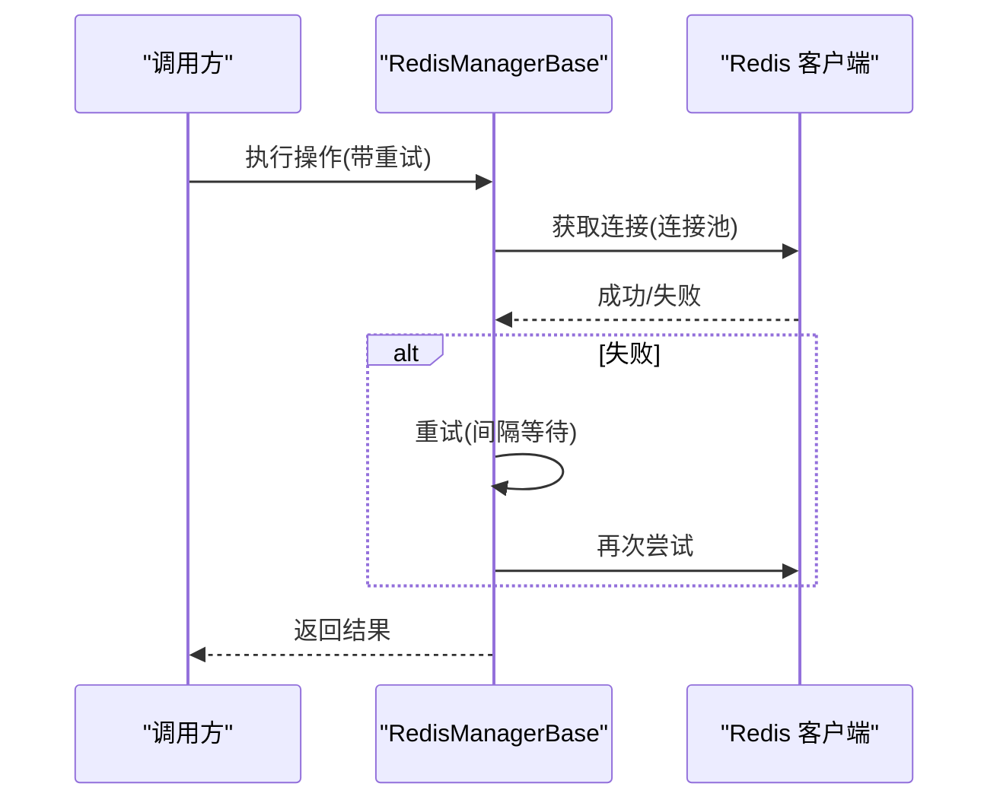
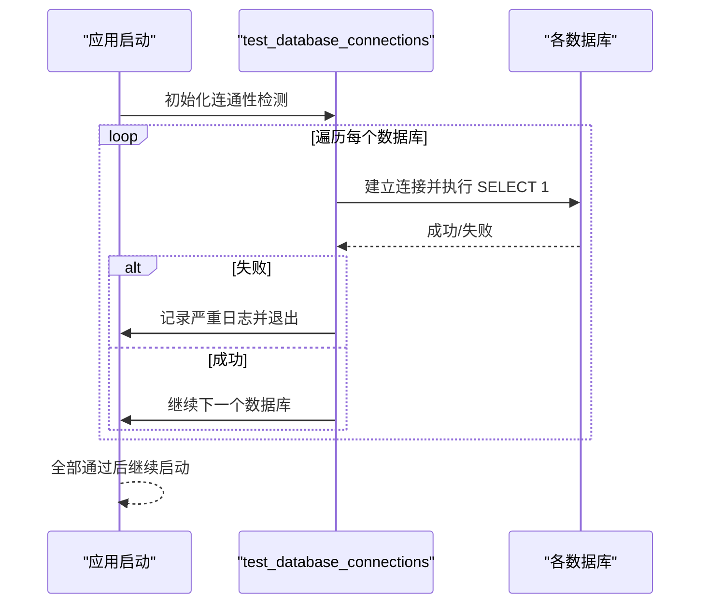
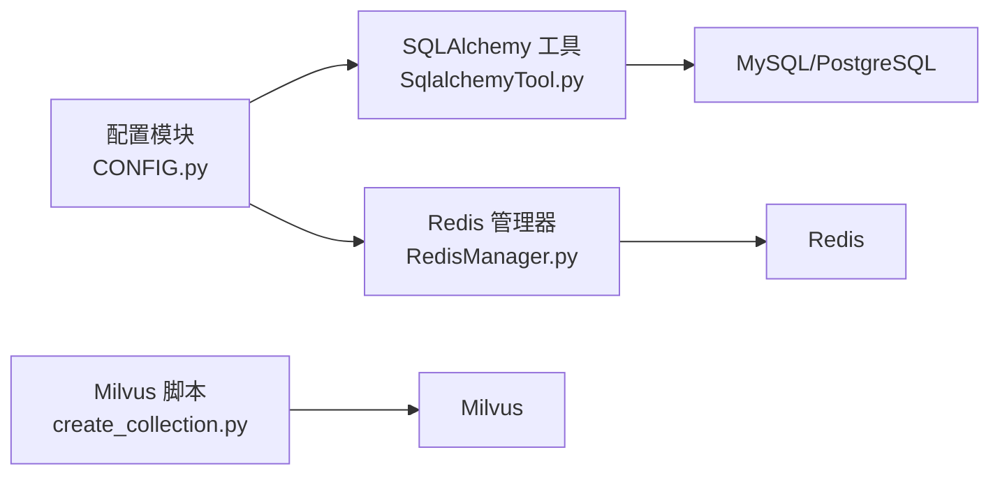

# 数据库监控

<cite>
**本文引用的文件**
- [docker-compose.yml](file://docker-compose.yml)
- [CONFIG.py](file://be-bilibili-crawler/CONFIG.py)
- [FastapiLifespan.py](file://be-bilibili-crawler/Utils/FastAPI/FastapiLifespan.py)
- [SqlalchemyTool.py](file://be-bilibili-crawler/Utils/数据库/SqlalchemyTool.py)
- [sqlHelperBase.py](file://be-bilibili-crawler/dao/base/sqlHelperBase.py)
- [RedisManager.py](file://be-bilibili-crawler/Utils/redisTool/RedisManager.py)
- [create_collection.py](file://be-bilibili-crawler/scripts/database/同步向量数据库/create_collection.py)
- [sql_helper.py](file://be-bilibili-crawler/Service/LangChainCompo/lottery_data_vec_sql/sql_helper.py)
</cite>

## 目录
1. [简介](#简介)
2. [项目结构](#项目结构)
3. [核心组件](#核心组件)
4. [架构总览](#架构总览)
5. [详细组件分析](#详细组件分析)
6. [依赖关系分析](#依赖关系分析)
7. [性能考虑](#性能考虑)
8. [故障诊断指南](#故障诊断指南)
9. [结论](#结论)
10. [附录](#附录)

## 简介
本文件面向 MySQL、PostgreSQL、Redis 与 Milvus 的监控与优化，覆盖慢查询监控、连接池监控、数据库锁监控、指标采集、执行计划与索引使用监控、告警规则、容量规划与故障诊断。文档基于仓库中现有实现进行梳理，并给出可落地的监控与优化建议。

## 项目结构
- 容器编排：通过 docker-compose 统一启动 MySQL、Redis、Milvus 等中间件，暴露健康检查端口与数据卷挂载点，便于外部监控系统采集指标与日志。
- Python 后端（爬虫服务）：集中配置数据库连接、连接池参数、Redis 客户端封装、Milvus 集合创建脚本等。
- 其他服务：RPA-Browser、be-message-service、be-gateway 等与本仓库的数据库监控主题关联度较低，本文聚焦爬虫服务的数据库相关实现。

图表来源
- [docker-compose.yml:43-92](file://docker-compose.yml#L43-L92)

章节来源
- [docker-compose.yml:43-92](file://docker-compose.yml#L43-L92)

## 核心组件
- 数据库连接与连接池
  - 多库 URI 构造与连接池参数集中管理，区分业务与爬虫专用连接池，避免相互影响。
  - 进程内按 (dburl, is_crawler) 缓存 Engine 与会话工厂，防止重复创建连接池导致连接耗尽。
- Redis 客户端封装
  - 提供异步/同步两种管理器，内置重试、管道、批量操作、扫描迭代等能力，保障高并发下的稳定性。
- Milvus 向量库
  - 提供集合创建脚本与客户端辅助，用于向量检索场景。
- 启动期连通性检测
  - 启动时逐一测试各数据库连接，失败即快速失败，便于早期发现配置或网络问题。

章节来源
- [CONFIG.py:330-419](file://be-bilibili-crawler/CONFIG.py#L330-L419)
- [SqlalchemyTool.py:11-48](file://be-bilibili-crawler/Utils/数据库/SqlalchemyTool.py#L11-L48)
- [RedisManager.py:187-210](file://be-bilibili-crawler/Utils/redisTool/RedisManager.py#L187-L210)
- [create_collection.py:3-4](file://be-bilibili-crawler/scripts/database/同步向量数据库/create_collection.py#L3-L4)
- [FastapiLifespan.py:64-90](file://be-bilibili-crawler/Utils/FastAPI/FastapiLifespan.py#L64-L90)

## 架构总览
下图展示了应用与各数据库之间的调用关系及关键监控点：连接池、慢查询、锁等待、指标采集与告警。

图表来源
- [CONFIG.py:381-419](file://be-bilibili-crawler/CONFIG.py#L381-L419)
- [SqlalchemyTool.py:18-48](file://be-bilibili-crawler/Utils/数据库/SqlalchemyTool.py#L18-L48)
- [RedisManager.py:187-210](file://be-bilibili-crawler/Utils/redisTool/RedisManager.py#L187-L210)
- [create_collection.py:67](file://be-bilibili-crawler/scripts/database/同步向量数据库/create_collection.py#L67)

## 详细组件分析

### MySQL/PostgreSQL 连接池与慢查询监控
- 连接池配置
  - 业务与爬虫分别维护独立连接池，包含 pool_size、max_overflow、pool_pre_ping、pool_recycle 等关键参数，避免陈旧连接与连接泄漏。
  - 进程内缓存 Engine/Session，确保同一 dburl 只创建一个连接池实例，降低资源消耗。
- 慢查询监控
  - 建议在数据库侧开启慢查询日志，并结合外部采集器（如 Prometheus + mysqld_exporter / postgres_exporter）收集 QPS、延迟、锁等待、缓冲池命中率等指标。
  - 在应用侧可通过 SQLAlchemy echo 输出 SQL 语句（开发环境），配合日志系统定位热点 SQL。
- 执行计划与索引使用
  - 对慢查询使用 EXPLAIN/EXPLAIN ANALYZE 分析执行计划，关注全表扫描、临时表、文件排序、回表等。
  - 结合索引统计信息（如 InnoDB 索引基数、命中次数）评估索引有效性，必要时调整索引策略。

图表来源
- [CONFIG.py:381-419](file://be-bilibili-crawler/CONFIG.py#L381-L419)
- [SqlalchemyTool.py:18-48](file://be-bilibili-crawler/Utils/数据库/SqlalchemyTool.py#L18-L48)

章节来源
- [CONFIG.py:381-419](file://be-bilibili-crawler/CONFIG.py#L381-L419)
- [SqlalchemyTool.py:18-48](file://be-bilibili-crawler/Utils/数据库/SqlalchemyTool.py#L18-L48)

### Redis 监控与锁监控
- 连接池与重试
  - 异步/同步管理器均使用连接池，设置 socket_timeout、health_check_interval、retry_on_timeout 等参数，增强鲁棒性。
  - 提供通用重试装饰器，针对连接错误、BusyLoadingError 等进行指数退避式重试。
- 批量与管道
  - 支持 pipeline、MGET/MSET、UNLINK 批量删除、SCAN 迭代等，减少网络往返与内存峰值。
- 锁监控
  - 使用 Redis 分布式锁保护临界区，结合超时时间避免死锁；监控锁获取耗时与竞争情况。
- 指标采集
  - 通过 redis_exporter 采集 key 数量、内存使用、命令耗时、阻塞命令等指标；结合告警规则识别异常增长或热点键。

图表来源
- [RedisManager.py:62-78](file://be-bilibili-crawler/Utils/redisTool/RedisManager.py#L62-L78)
- [RedisManager.py:187-210](file://be-bilibili-crawler/Utils/redisTool/RedisManager.py#L187-L210)

章节来源
- [RedisManager.py:62-78](file://be-bilibili-crawler/Utils/redisTool/RedisManager.py#L62-L78)
- [RedisManager.py:187-210](file://be-bilibili-crawler/Utils/redisTool/RedisManager.py#L187-L210)

### Milvus 向量库监控
- 集合与索引
  - 通过脚本创建集合与索引，建议为向量字段建立合适的索引类型（如 IVF_FLAT、HNSW），并根据数据规模调参。
- 查询性能
  - 监控搜索延迟、召回率、CPU/内存占用；对热点查询进行缓存或预计算。
- 指标采集
  - 通过 Milvus 内置监控端点或 exporter 采集节点状态、查询/插入吞吐、磁盘使用等指标。

章节来源
- [create_collection.py:3-4](file://be-bilibili-crawler/scripts/database/同步向量数据库/create_collection.py#L3-L4)
- [create_collection.py:67](file://be-bilibili-crawler/scripts/database/同步向量数据库/create_collection.py#L67)
- [sql_helper.py:5](file://be-bilibili-crawler/Service/LangChainCompo/lottery_data_vec_sql/sql_helper.py#L5)

### 启动期数据库连通性检测
- 启动时遍历所有数据库 URI，尝试建立连接并执行简单查询，失败则记录严重日志并退出，便于快速定位配置或网络问题。

图表来源
- [FastapiLifespan.py:64-90](file://be-bilibili-crawler/Utils/FastAPI/FastapiLifespan.py#L64-L90)

章节来源
- [FastapiLifespan.py:64-90](file://be-bilibili-crawler/Utils/FastAPI/FastapiLifespan.py#L64-L90)

## 依赖关系分析
- 配置依赖
  - 数据库 URI 由配置模块集中生成，区分业务与爬虫连接池，避免相互干扰。
- 运行时依赖
  - SQLAlchemy 异步引擎与会话工厂被多个 DAO 复用，Redis 客户端统一管理连接池与重试。
- 外部依赖
  - MySQL/PostgreSQL/Redis/Milvus 通过 docker-compose 编排，暴露健康检查端口，便于外部监控集成。

图表来源
- [CONFIG.py:330-419](file://be-bilibili-crawler/CONFIG.py#L330-L419)
- [SqlalchemyTool.py:18-48](file://be-bilibili-crawler/Utils/数据库/SqlalchemyTool.py#L18-L48)
- [RedisManager.py:187-210](file://be-bilibili-crawler/Utils/redisTool/RedisManager.py#L187-L210)
- [create_collection.py:67](file://be-bilibili-crawler/scripts/database/同步向量数据库/create_collection.py#L67)

章节来源
- [CONFIG.py:330-419](file://be-bilibili-crawler/CONFIG.py#L330-L419)
- [SqlalchemyTool.py:18-48](file://be-bilibili-crawler/Utils/数据库/SqlalchemyTool.py#L18-L48)
- [RedisManager.py:187-210](file://be-bilibili-crawler/Utils/redisTool/RedisManager.py#L187-L210)
- [create_collection.py:67](file://be-bilibili-crawler/scripts/database/同步向量数据库/create_collection.py#L67)

## 性能考虑
- 连接池调优
  - 根据并发量与数据库承载能力调整 pool_size 与 max_overflow；启用 pool_pre_ping 避免陈旧连接；合理设置 pool_recycle 小于服务端 wait_timeout。
- 慢查询治理
  - 开启慢查询日志，定期分析 TOP N 慢查询；优化 SQL、补充索引、拆分大事务、避免 N+1 查询。
- Redis 优化
  - 使用 pipeline 与批量命令减少 RTT；对大 Key 进行拆分或迁移；监控内存碎片与持久化开销。
- Milvus 优化
  - 选择合适的索引类型与参数；控制单次查询的 topK 与过滤条件；对热点数据进行缓存。
- 指标与告警
  - 采集 QPS、延迟、错误率、连接数、锁等待、内存/CPU/磁盘使用；设置阈值告警与趋势预警。

[本节为通用指导，不直接分析具体文件]

## 故障诊断指南
- 连接失败
  - 启动期连通性检测失败会记录严重日志并退出；检查环境变量、网络连通性与数据库服务状态。
- 连接泄漏
  - 观察连接池使用率与活跃连接数；确认会话是否正确关闭；避免长事务持有连接过久。
- 慢查询与锁等待
  - 通过慢查询日志与数据库监控定位热点 SQL 与锁冲突；必要时加索引或重构查询。
- Redis 异常
  - 连接错误与 BusyLoadingError 会触发重试；监控连接池大小与命令耗时；排查大 Key 与热点键。
- Milvus 异常
  - 检查集合与索引创建是否成功；监控节点健康与资源使用；对查询失败进行重试与降级。

章节来源
- [FastapiLifespan.py:64-90](file://be-bilibili-crawler/Utils/FastAPI/FastapiLifespan.py#L64-L90)
- [RedisManager.py:62-78](file://be-bilibili-crawler/Utils/redisTool/RedisManager.py#L62-L78)

## 结论
本项目在数据库连接池、Redis 客户端封装与 Milvus 集合管理方面具备良好基础。建议在此基础上完善慢查询监控、连接池与锁监控、指标采集与告警规则，形成闭环的数据库可观测体系，持续提升稳定性与性能。

[本节为总结性内容，不直接分析具体文件]

## 附录
- 监控指标建议
  - MySQL/PostgreSQL：QPS、延迟分布、慢查询数、连接数、缓冲池命中率、锁等待时间、复制延迟。
  - Redis：内存使用、key 数量、命令耗时、阻塞命令、持久化开销、主从延迟。
  - Milvus：节点健康、查询/插入吞吐、延迟、磁盘使用、索引构建进度。
- 告警规则示例
  - 慢查询数突增、连接池耗尽、Redis 内存超限、Milvus 节点不可用、复制延迟过高。
- 容量规划建议
  - 根据业务峰值与增长趋势预估连接数、存储与计算资源；预留冗余以应对突发流量。

[本节为通用指导，不直接分析具体文件]