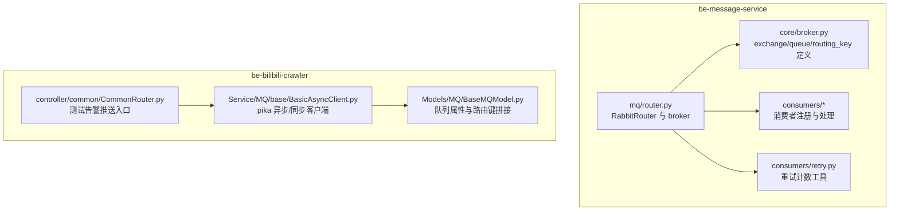
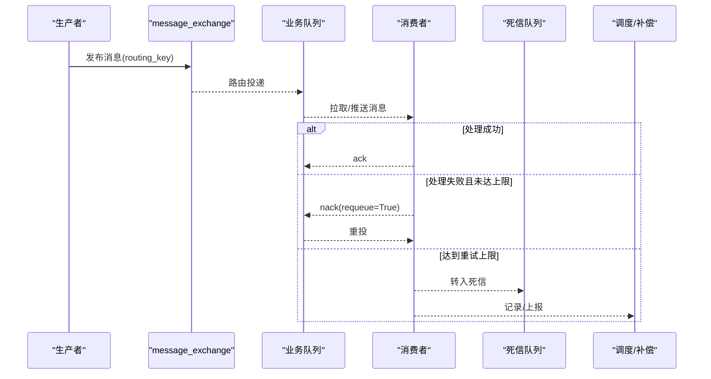
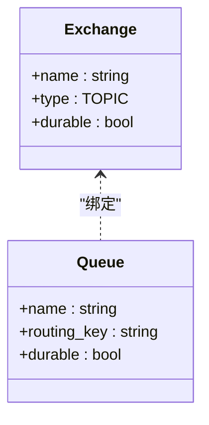
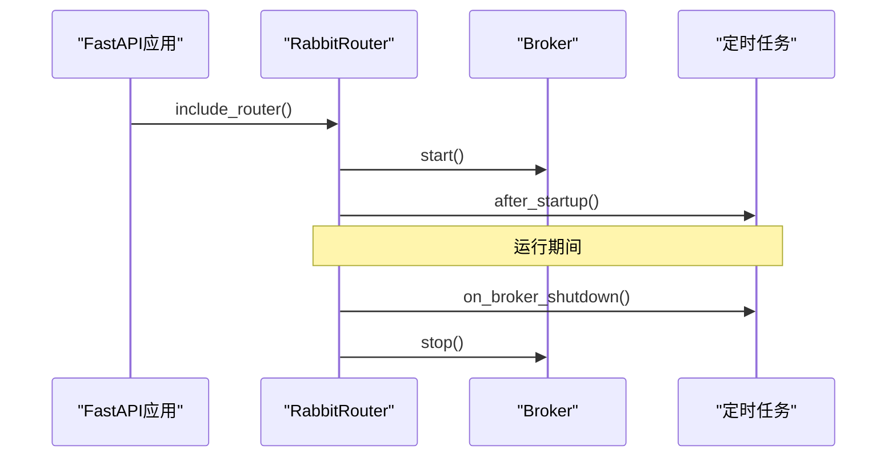
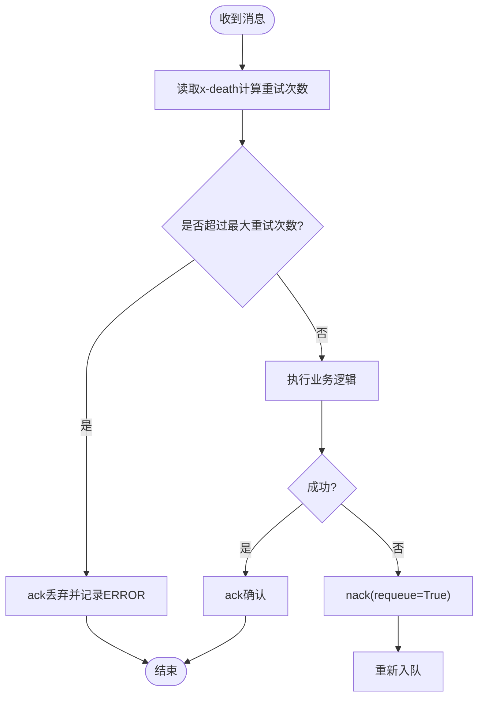
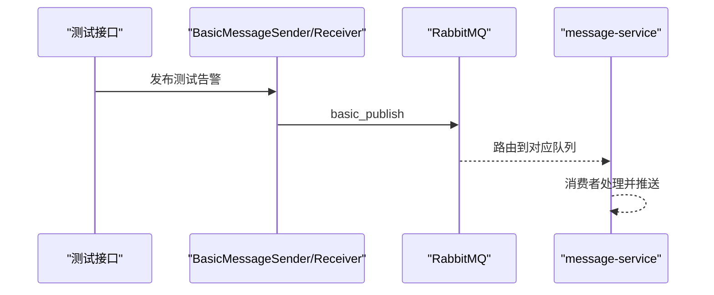
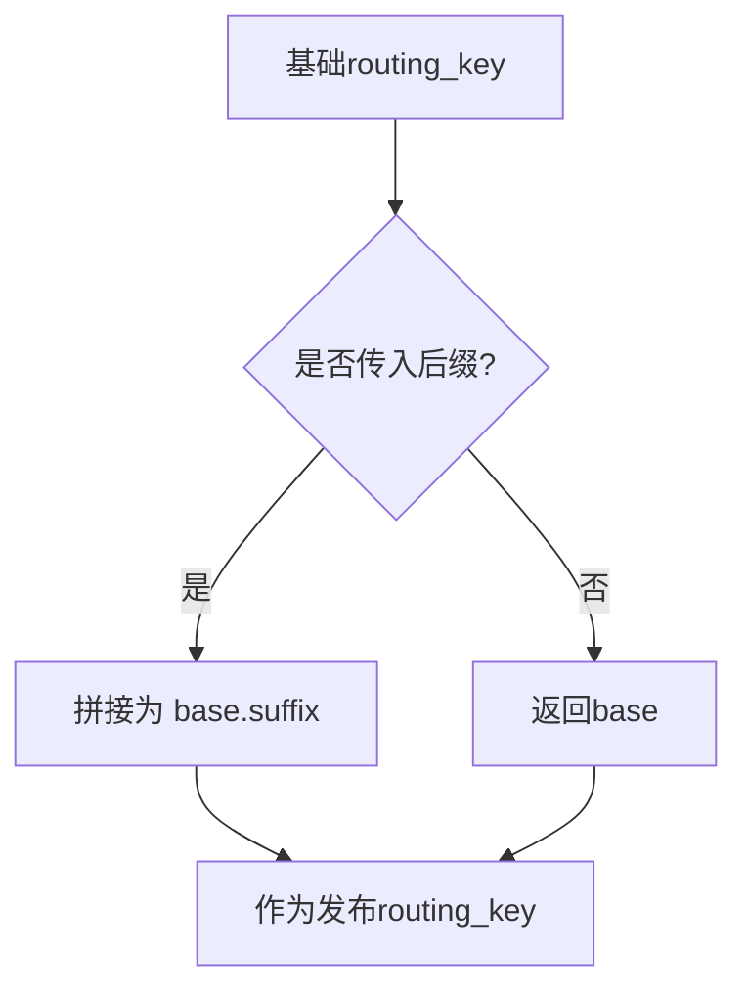
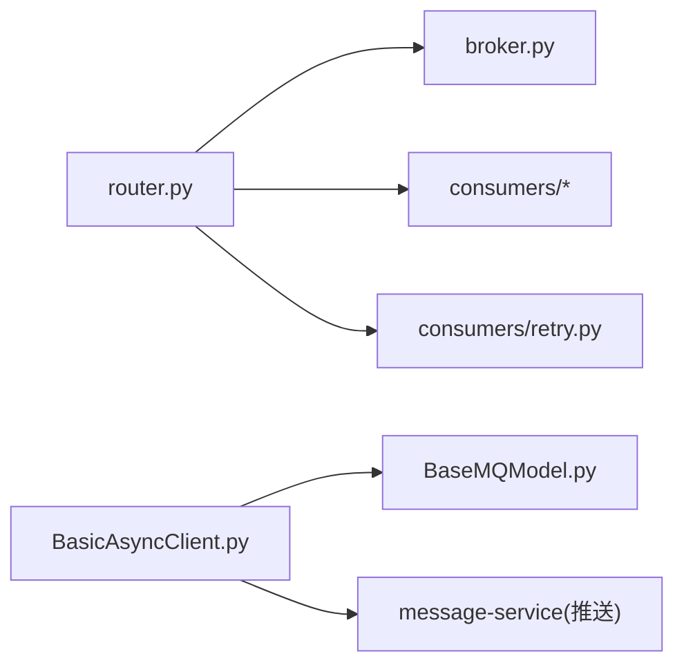

# 消息队列监控

<cite>
**本文引用的文件**
- [be-message-service/app/core/broker.py](file://be-message-service/app/core/broker.py)
- [be-message-service/app/mq/router.py](file://be-message-service/app/mq/router.py)
- [be-message-service/app/consumers/retry.py](file://be-message-service/app/consumers/retry.py)
- [be-bilibili-crawler/Service/MQ/base/BasicAsyncClient.py](file://be-bilibili-crawler/Service/MQ/base/BasicAsyncClient.py)
- [be-bilibili-crawler/controller/common/CommonRouter.py](file://be-bilibili-crawler/controller/common/CommonRouter.py)
- [be-bilibili-crawler/Models/MQ/BaseMQModel.py](file://be-bilibili-crawler/Models/MQ/BaseMQModel.py)
- [be-message-service/tests/test_phase_c_scheduler.py](file://be-message-service/tests/test_phase_c_scheduler.py)
</cite>

## 目录
1. [简介](#简介)
2. [项目结构](#项目结构)
3. [核心组件](#核心组件)
4. [架构总览](#架构总览)
5. [详细组件分析](#详细组件分析)
6. [依赖关系分析](#依赖关系分析)
7. [性能考量](#性能考量)
8. [故障排查指南](#故障排查指南)
9. [结论](#结论)
10. [附录](#附录)

## 简介
本文件面向 RabbitMQ 消息队列的监控与运维，覆盖生产者、消费者与队列健康状态的全链路监控。重点包括：
- 积压与队列长度监控
- 消息处理延迟监控
- 健康检查与死信队列监控
- 重试机制监控
- 告警配置建议
- 性能调优与常见问题（消息丢失、重复消费、队列阻塞）定位方法

## 项目结构
本项目在两个服务中涉及消息队列：
- be-message-service：基于 FastStream 的 MQ 路由、队列定义、消费者注册与定时任务钩子
- be-bilibili-crawler：基于 pika 的异步/同步客户端封装，提供发布与消费基础能力

图表来源
- [be-message-service/app/mq/router.py:1-57](file://be-message-service/app/mq/router.py#L1-L57)
- [be-message-service/app/core/broker.py:1-125](file://be-message-service/app/core/broker.py#L1-L125)
- [be-bilibili-crawler/Service/MQ/base/BasicAsyncClient.py:63-361](file://be-bilibili-crawler/Service/MQ/base/BasicAsyncClient.py#L63-L361)
- [be-bilibili-crawler/Models/MQ/BaseMQModel.py:38-73](file://be-bilibili-crawler/Models/MQ/BaseMQModel.py#L38-L73)
- [be-bilibili-crawler/controller/common/CommonRouter.py:67-94](file://be-bilibili-crawler/controller/common/CommonRouter.py#L67-L94)

章节来源
- [be-message-service/app/mq/router.py:1-57](file://be-message-service/app/mq/router.py#L1-L57)
- [be-message-service/app/core/broker.py:1-125](file://be-message-service/app/core/broker.py#L1-L125)
- [be-bilibili-crawler/Service/MQ/base/BasicAsyncClient.py:63-361](file://be-bilibili-crawler/Service/MQ/base/BasicAsyncClient.py#L63-L361)
- [be-bilibili-crawler/Models/MQ/BaseMQModel.py:38-73](file://be-bilibili-crawler/Models/MQ/BaseMQModel.py#L38-L73)
- [be-bilibili-crawler/controller/common/CommonRouter.py:67-94](file://be-bilibili-crawler/controller/common/CommonRouter.py#L67-L94)

## 核心组件
- 统一 Broker 与路由：通过 RabbitRouter 创建并管理 broker 生命周期，集中注册消费者，并提供 publisher/RPC/健康检查共享连接
- 队列与交换器：集中定义 exchange、routing_key 与 queue，保证生产与消费一致
- 消费者与重试：消费者按业务拆分，统一的重试计数工具避免无限重投
- 客户端封装：提供 pika 异步/同步客户端，支持 QoS、自动重连、错误告警

章节来源
- [be-message-service/app/mq/router.py:1-57](file://be-message-service/app/mq/router.py#L1-L57)
- [be-message-service/app/core/broker.py:1-125](file://be-message-service/app/core/broker.py#L1-L125)
- [be-message-service/app/consumers/retry.py:1-31](file://be-message-service/app/consumers/retry.py#L1-L31)
- [be-bilibili-crawler/Service/MQ/base/BasicAsyncClient.py:63-361](file://be-bilibili-crawler/Service/MQ/base/BasicAsyncClient.py#L63-L361)

## 架构总览
消息从生产者进入 exchange，经 routing_key 路由到独立队列，消费者订阅队列进行处理；失败时根据策略重投或进入死信；定时任务可补偿或重试。

图表来源
- [be-message-service/app/core/broker.py:34-103](file://be-message-service/app/core/broker.py#L34-L103)
- [be-message-service/app/consumers/retry.py:1-31](file://be-message-service/app/consumers/retry.py#L1-L31)

## 详细组件分析

### 队列与路由定义（be-message-service）
- 使用单一 TOPIC exchange 按 routing_key 分流到独立队列，确保各业务解耦
- 关键队列包括外部渠道推送、私信内容落库、评论通知/审核/计数、用户注销、浏览统计等
- 所有队列持久化，保障重启后不丢消息

图表来源
- [be-message-service/app/core/broker.py:34-103](file://be-message-service/app/core/broker.py#L34-L103)

章节来源
- [be-message-service/app/core/broker.py:1-125](file://be-message-service/app/core/broker.py#L1-L125)

### 消费者注册与生命周期（be-message-service）
- RabbitRouter 统一管理 broker 生命周期，启动时开启 broker，停止前关闭调度器
- 消费者通过装饰器注册，集中导入触发副作用完成绑定
- 健康检查复用同一 broker 实例，避免多连接

图表来源
- [be-message-service/app/mq/router.py:1-57](file://be-message-service/app/mq/router.py#L1-L57)

章节来源
- [be-message-service/app/mq/router.py:1-57](file://be-message-service/app/mq/router.py#L1-L57)

### 重试与死信监控（be-message-service）
- 统一读取 x-death 头统计重投次数，超过阈值则 ack 丢弃并记录错误，避免死循环
- 测试用例验证死信重试任务可将死信标记为已解决

图表来源
- [be-message-service/app/consumers/retry.py:1-31](file://be-message-service/app/consumers/retry.py#L1-L31)
- [be-message-service/tests/test_phase_c_scheduler.py:149-159](file://be-message-service/tests/test_phase_c_scheduler.py#L149-L159)

章节来源
- [be-message-service/app/consumers/retry.py:1-31](file://be-message-service/app/consumers/retry.py#L1-L31)
- [be-message-service/tests/test_phase_c_scheduler.py:149-159](file://be-message-service/tests/test_phase_c_scheduler.py#L149-L159)

### 生产者客户端与告警（be-bilibili-crawler）
- 提供异步/同步客户端，支持 QoS、自动重连、异常告警
- 测试接口绕过限流直接发布消息，用于验证 message-service 推送链路

图表来源
- [be-bilibili-crawler/Service/MQ/base/BasicAsyncClient.py:303-361](file://be-bilibili-crawler/Service/MQ/base/BasicAsyncClient.py#L303-L361)
- [be-bilibili-crawler/controller/common/CommonRouter.py:67-94](file://be-bilibili-crawler/controller/common/CommonRouter.py#L67-L94)

章节来源
- [be-bilibili-crawler/Service/MQ/base/BasicAsyncClient.py:63-361](file://be-bilibili-crawler/Service/MQ/base/BasicAsyncClient.py#L63-L361)
- [be-bilibili-crawler/controller/common/CommonRouter.py:67-94](file://be-bilibili-crawler/controller/common/CommonRouter.py#L67-L94)

### 路由键与队列属性（be-bilibili-crawler）
- 提供 MQPropBase 动态拼接路由键，便于发布者按场景扩展
- 消费者端 topic 模式自动追加通配符，简化绑定

图表来源
- [be-bilibili-crawler/Models/MQ/BaseMQModel.py:38-73](file://be-bilibili-crawler/Models/MQ/BaseMQModel.py#L38-L73)

章节来源
- [be-bilibili-crawler/Models/MQ/BaseMQModel.py:38-73](file://be-bilibili-crawler/Models/MQ/BaseMQModel.py#L38-L73)

## 依赖关系分析
- be-message-service 内部：router 管理 broker，broker 定义队列与交换器，consumers 注册处理器，retry 提供通用重试能力
- be-bilibili-crawler 内部：客户端封装依赖配置与日志，测试接口通过客户端发布消息
- 跨服务：crawler 通过 message-service 提供的推送通道进行告警与通知

图表来源
- [be-message-service/app/mq/router.py:1-57](file://be-message-service/app/mq/router.py#L1-L57)
- [be-message-service/app/core/broker.py:1-125](file://be-message-service/app/core/broker.py#L1-L125)
- [be-bilibili-crawler/Service/MQ/base/BasicAsyncClient.py:63-361](file://be-bilibili-crawler/Service/MQ/base/BasicAsyncClient.py#L63-L361)
- [be-bilibili-crawler/Models/MQ/BaseMQModel.py:38-73](file://be-bilibili-crawler/Models/MQ/BaseMQModel.py#L38-L73)

章节来源
- [be-message-service/app/mq/router.py:1-57](file://be-message-service/app/mq/router.py#L1-L57)
- [be-message-service/app/core/broker.py:1-125](file://be-message-service/app/core/broker.py#L1-L125)
- [be-bilibili-crawler/Service/MQ/base/BasicAsyncClient.py:63-361](file://be-bilibili-crawler/Service/MQ/base/BasicAsyncClient.py#L63-L361)
- [be-bilibili-crawler/Models/MQ/BaseMQModel.py:38-73](file://be-bilibili-crawler/Models/MQ/BaseMQModel.py#L38-L73)

## 性能考量
- 预取与背压：消费者设置合理的 prefetch_count，避免内存与文件描述符溢出
- 队列隔离：不同业务使用独立队列，避免热点竞争
- 重试上限：通过 x-death 限制重投次数，防止慢病态消息拖垮队列
- 持久化：队列与交换器持久化，降低重启影响
- 连接复用：统一 broker 实例，减少连接开销

[本节为通用指导，无需特定文件引用]

## 故障排查指南
- 消息积压与队列长度
  - 观察队列长度与消费速率，识别瓶颈队列
  - 检查消费者是否卡住或频繁失败
- 消息处理延迟
  - 结合生产时间与消费时间戳，评估端到端延迟
  - 关注重试导致的二次放大
- 健康检查
  - 通过健康端点探测 broker 连通性
- 死信队列监控
  - 定期巡检死信数量与类型，定位脏数据或代码缺陷
- 重试机制监控
  - 统计重试次数分布，识别高频失败消息
- 常见问题
  - 消息丢失：确认队列持久化、消费者 ack 策略与重试上限
  - 重复消费：幂等设计、去重键、合理重试
  - 队列阻塞：调整 prefetch、扩容消费者、优化处理逻辑

章节来源
- [be-message-service/app/core/broker.py:1-125](file://be-message-service/app/core/broker.py#L1-L125)
- [be-message-service/app/consumers/retry.py:1-31](file://be-message-service/app/consumers/retry.py#L1-L31)
- [be-bilibili-crawler/Service/MQ/base/BasicAsyncClient.py:63-361](file://be-bilibili-crawler/Service/MQ/base/BasicAsyncClient.py#L63-L361)

## 结论
通过统一的 broker 与队列定义、集中的消费者注册、标准化的重试与死信策略，以及客户端的健壮性与告警能力，系统具备完善的消息队列监控与排障基础。建议在生产环境持续采集队列长度、重试次数、延迟与健康指标，并结合告警与自动化补偿提升稳定性。

[本节为总结，无需特定文件引用]

## 附录
- 告警配置建议
  - 队列长度阈值：当某队列长度超过阈值持续 N 分钟，触发告警
  - 重试次数阈值：单条消息重试次数超过默认上限，立即告警
  - 健康检查：健康端点连续失败 N 次，触发严重告警
  - 死信增长：死信队列持续增长，触发告警并联动补偿任务
- 性能调优建议
  - 调整 prefetch 与并发度，平衡吞吐与资源占用
  - 热点队列拆分或分片，避免单点瓶颈
  - 对慢消费者实施隔离与降级
- 监控指标清单
  - 队列长度、入队速率、出队速率、平均/分位延迟
  - 重试次数、失败率、死信数量
  - 连接数、频道数、内存与磁盘使用

[本节为通用指导，无需特定文件引用]