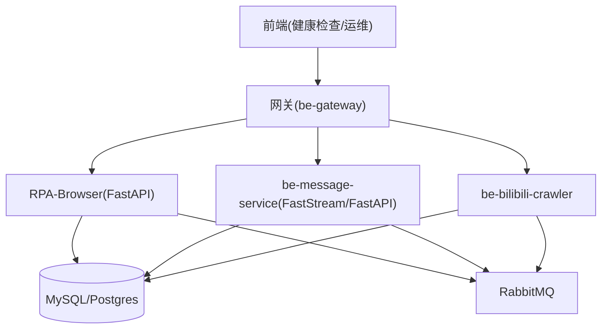
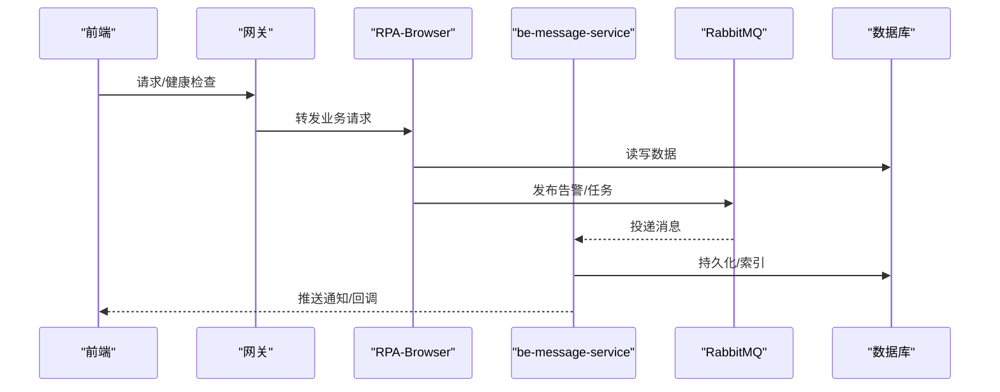
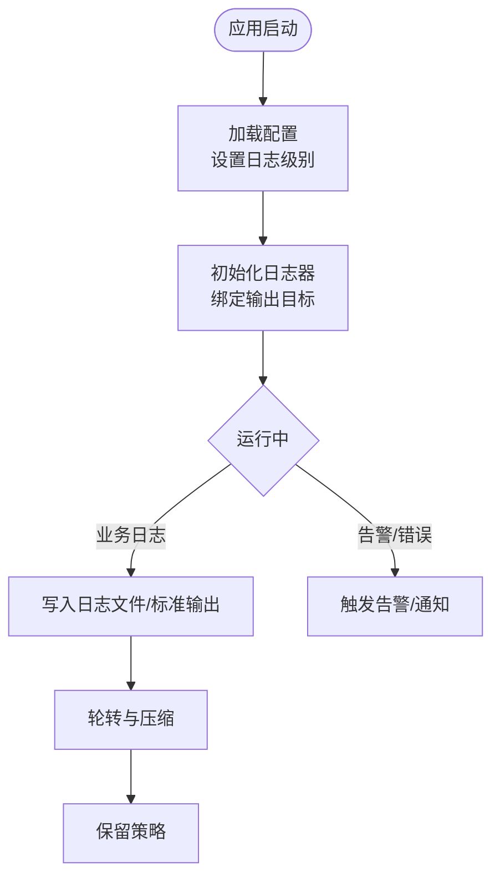
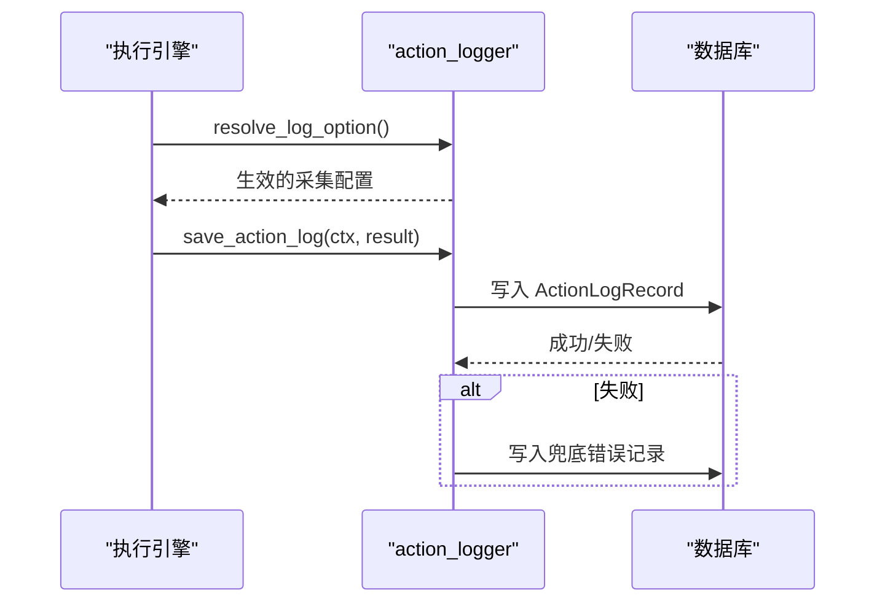
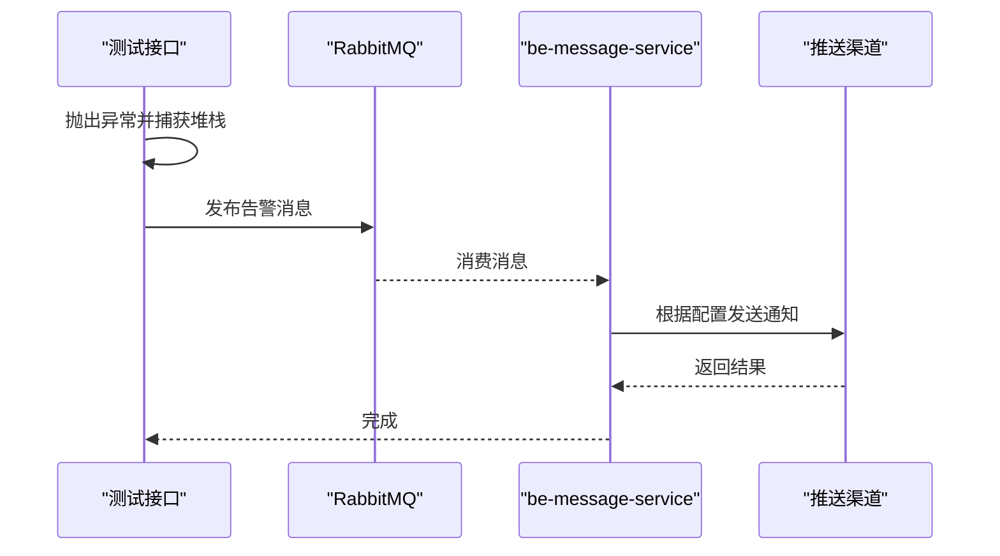
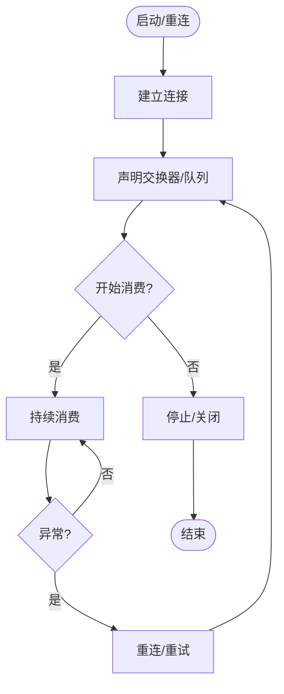
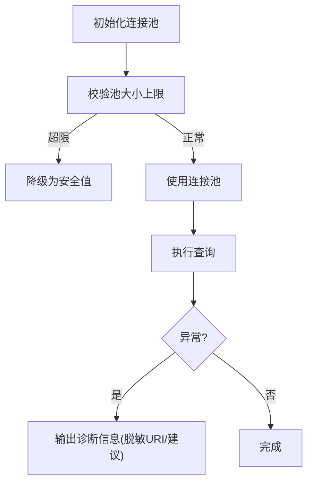
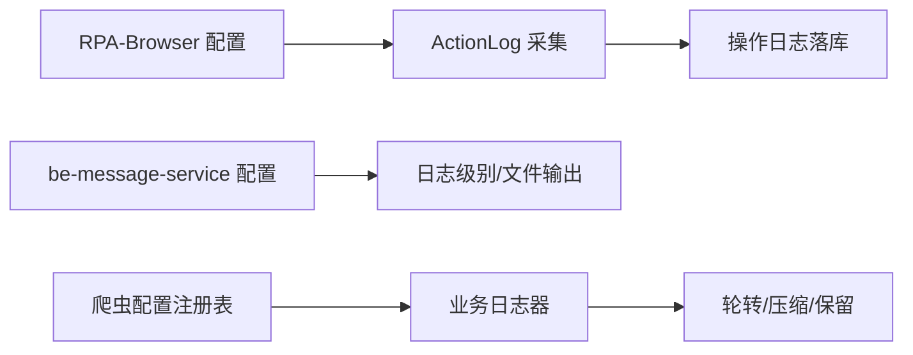

# 监控与日志管理

<cite>
**本文引用的文件**
- [RPA-Browser/app/config.py](file://RPA-Browser/app/config.py)
- [be-bilibili-crawler/log/base_log.py](file://be-bilibili-crawler/log/base_log.py)
- [be-bilibili-crawler/Service/BaseCrawler/config.py](file://be-bilibili-crawler/Service/BaseCrawler/config.py)
- [be-message-service/app/core/config.py](file://be-message-service/app/core/config.py)
- [RPA-Browser/app/services/execution/action_logger.py](file://RPA-Browser/app/services/execution/action_logger.py)
- [be-bilibili-crawler/controller/common/CommonRouter.py](file://be-bilibili-crawler/controller/common/CommonRouter.py)
- [be-gateway/ExpressServerEnd/Model/api/v1/log/log_model.js](file://be-gateway/ExpressServerEnd/Model/api/v1/log/log_model.js)
- [be-bilibili-crawler/Service/MQ/base/BasicAsyncClient.py](file://be-bilibili-crawler/Service/MQ/base/BasicAsyncClient.py)
- [Vue3FrontEndDemoExercise/src/api/community/hey-api/services/DefaultService.gen.ts](file://Vue3FrontEndDemoExercise/src/api/community/hey-api/services/DefaultService.gen.ts)
</cite>

## 目录
1. [简介](#简介)
2. [项目结构](#项目结构)
3. [核心组件](#核心组件)
4. [架构总览](#架构总览)
5. [详细组件分析](#详细组件分析)
6. [依赖关系分析](#依赖关系分析)
7. [性能考量](#性能考量)
8. [故障排查指南](#故障排查指南)
9. [结论](#结论)
10. [附录](#附录)

## 简介
本指南面向多服务系统（RPA-Browser、be-bilibili-crawler、be-message-service、be-gateway、前端等）的监控与日志管理，覆盖：
- 应用日志收集、结构化日志格式与日志级别配置
- 各服务日志输出位置、日志轮转策略与日志分析工具使用建议
- 系统性能监控、数据库查询监控、消息队列状态监控与 API 接口监控
- 告警规则配置、异常通知机制与故障诊断方法
- 日志存储优化、性能影响评估与日志安全合规

## 项目结构
本项目采用多语言微服务架构：
- Python FastAPI 服务（RPA-Browser、be-message-service）
- Python 爬虫服务（be-bilibili-crawler）
- Node.js 网关服务（be-gateway）
- Vue3 前端（用于健康检查与运维交互）

图表来源
- [RPA-Browser/app/config.py:140-215](file://RPA-Browser/app/config.py#L140-L215)
- [be-message-service/app/core/config.py:19-79](file://be-message-service/app/core/config.py#L19-L79)
- [be-bilibili-crawler/Service/BaseCrawler/config.py:48-84](file://be-bilibili-crawler/Service/BaseCrawler/config.py#L48-L84)
- [be-gateway/ExpressServerEnd/Model/api/v1/log/log_model.js:1-10](file://be-gateway/ExpressServerEnd/Model/api/v1/log/log_model.js#L1-L10)

章节来源
- [RPA-Browser/app/config.py:140-215](file://RPA-Browser/app/config.py#L140-L215)
- [be-message-service/app/core/config.py:19-79](file://be-message-service/app/core/config.py#L19-L79)
- [be-bilibili-crawler/Service/BaseCrawler/config.py:48-84](file://be-bilibili-crawler/Service/BaseCrawler/config.py#L48-L84)
- [be-gateway/ExpressServerEnd/Model/api/v1/log/log_model.js:1-10](file://be-gateway/ExpressServerEnd/Model/api/v1/log/log_model.js#L1-L10)

## 核心组件
- 统一日志框架与分级
  - be-bilibili-crawler 通过 loguru 创建按业务域隔离的 logger，并启用异步写入、按大小轮转与压缩保留。
  - be-message-service 通过环境变量控制 FastStream 内部日志级别与业务日志级别（默认生产 WARNING）。
  - RPA-Browser 使用 loguru 并在启动时记录加载的配置信息。
- 浏览器操作日志采集
  - RPA-Browser 提供 action_logger，支持按执行参数、父上下文、自定义动作配置与服务端兜底优先级解析是否采集及字段范围，并将结果落库；失败不阻塞业务。
- 告警与通知
  - be-bilibili-crawler 提供测试抛错接口，直接发布到 message 队列以绕过限流，确保 message-service 能收到告警。
  - be-message-service 集中管理推送渠道配置（PushChannelConfig），支持多种通知通道。
- 健康检查与可观测性
  - 前端调用 /health 进行存活探测（含 RabbitMQ 连通性）。
  - be-message-service 暴露 HTTP 健康检查路由。

章节来源
- [be-bilibili-crawler/log/base_log.py:44-96](file://be-bilibili-crawler/log/base_log.py#L44-L96)
- [be-message-service/app/core/config.py:21-34](file://be-message-service/app/core/config.py#L21-L34)
- [RPA-Browser/app/config.py:1-10](file://RPA-Browser/app/config.py#L1-L10)
- [RPA-Browser/app/services/execution/action_logger.py:90-118](file://RPA-Browser/app/services/execution/action_logger.py#L90-L118)
- [be-bilibili-crawler/controller/common/CommonRouter.py:67-94](file://be-bilibili-crawler/controller/common/CommonRouter.py#L67-L94)
- [Vue3FrontEndDemoExercise/src/api/community/hey-api/services/DefaultService.gen.ts:8-21](file://Vue3FrontEndDemoExercise/src/api/community/hey-api/services/DefaultService.gen.ts#L8-L21)

## 架构总览

图表来源
- [RPA-Browser/app/config.py:156-180](file://RPA-Browser/app/config.py#L156-L180)
- [be-message-service/app/core/config.py:19-39](file://be-message-service/app/core/config.py#L19-L39)
- [be-bilibili-crawler/controller/common/CommonRouter.py:74-94](file://be-bilibili-crawler/controller/common/CommonRouter.py#L74-L94)
- [Vue3FrontEndDemoExercise/src/api/community/hey-api/services/DefaultService.gen.ts:8-21](file://Vue3FrontEndDemoExercise/src/api/community/hey-api/services/DefaultService.gen.ts#L8-L21)

## 详细组件分析

### 日志系统与级别配置
- be-bilibili-crawler
  - 使用 loguru 为每个业务域创建独立 logger，输出至脚本目录下的 error_*.log，按 10MB 轮转、zip 压缩、保留 15 天，仅记录 WARNING 及以上。
  - 通过 UserMap 枚举区分不同模块日志，便于过滤与检索。
- be-message-service
  - 通过环境变量 FASTSTREAM_LOG_LEVEL 控制框架日志级别；LOG_LEVEL 控制业务日志级别（默认 WARNING，生产压日志量）。
  - 开发环境可将 WARNING 及以上同时写入 LOG_FILE_DIR 下文件，生产不写文件。
- RPA-Browser
  - 启动时加载 Settings 并记录日志，便于定位配置问题。
- be-gateway
  - 定义 LogLevel 常量（debug/info/warn/error/critical），可用于中间件或路由层统一打点。

图表来源
- [be-bilibili-crawler/log/base_log.py:44-60](file://be-bilibili-crawler/log/base_log.py#L44-L60)
- [be-message-service/app/core/config.py:21-34](file://be-message-service/app/core/config.py#L21-L34)
- [RPA-Browser/app/config.py:215-216](file://RPA-Browser/app/config.py#L215-L216)
- [be-gateway/ExpressServerEnd/Model/api/v1/log/log_model.js:1-10](file://be-gateway/ExpressServerEnd/Model/api/v1/log/log_model.js#L1-L10)

章节来源
- [be-bilibili-crawler/log/base_log.py:44-96](file://be-bilibili-crawler/log/base_log.py#L44-L96)
- [be-message-service/app/core/config.py:21-34](file://be-message-service/app/core/config.py#L21-L34)
- [RPA-Browser/app/config.py:215-216](file://RPA-Browser/app/config.py#L215-L216)
- [be-gateway/ExpressServerEnd/Model/api/v1/log/log_model.js:1-10](file://be-gateway/ExpressServerEnd/Model/api/v1/log/log_model.js#L1-L10)

### 浏览器操作日志采集（Action Log）
- 采集决策优先级
  1) 执行参数中的 log 选项
  2) 父操作透传的采集配置
  3) 自定义动作（ca_xxx）在数据库上的 log_* 配置
  4) 服务端兜底配置（settings.action_log_default_enabled 等）
- 落库与容错
  - 将执行上下文、参数、结果、变量、错误信息等序列化后写入 ActionLogRecord。
  - 保存失败会尝试写入“保存失败”的兜底记录，绝不影响业务执行。
- 性能与安全
  - 对 params/result/variables 做 JSON 序列化限制与深度保护，避免过大负载。
  - 可通过 retention_days 控制保留周期，降低存储压力。

图表来源
- [RPA-Browser/app/services/execution/action_logger.py:90-118](file://RPA-Browser/app/services/execution/action_logger.py#L90-L118)
- [RPA-Browser/app/services/execution/action_logger.py:144-213](file://RPA-Browser/app/services/execution/action_logger.py#L144-L213)
- [RPA-Browser/app/services/execution/action_logger.py:216-239](file://RPA-Browser/app/services/execution/action_logger.py#L216-L239)

章节来源
- [RPA-Browser/app/services/execution/action_logger.py:90-239](file://RPA-Browser/app/services/execution/action_logger.py#L90-L239)
- [RPA-Browser/app/config.py:209-212](file://RPA-Browser/app/config.py#L209-L212)

### 告警与通知链路
- 测试告警接口
  - 故意抛出运行时异常，捕获堆栈后通过 publish_message 发送到 message 队列，绕过外部推送限流，确保 message-service 收到。
- 推送渠道配置
  - RPA-Browser 与 be-message-service 共用 PushChannelConfig，支持多种渠道（Bark、钉钉、飞书、企业微信、邮件、Webhook 等）。
- 健康检查
  - 前端调用 /health 验证服务与 RabbitMQ 连通性。

图表来源
- [be-bilibili-crawler/controller/common/CommonRouter.py:74-94](file://be-bilibili-crawler/controller/common/CommonRouter.py#L74-L94)
- [RPA-Browser/app/config.py:13-137](file://RPA-Browser/app/config.py#L13-L137)
- [be-message-service/app/core/config.py:330-336](file://be-message-service/app/core/config.py#L330-L336)
- [Vue3FrontEndDemoExercise/src/api/community/hey-api/services/DefaultService.gen.ts:8-21](file://Vue3FrontEndDemoExercise/src/api/community/hey-api/services/DefaultService.gen.ts#L8-L21)

章节来源
- [be-bilibili-crawler/controller/common/CommonRouter.py:67-94](file://be-bilibili-crawler/controller/common/CommonRouter.py#L67-L94)
- [RPA-Browser/app/config.py:13-137](file://RPA-Browser/app/config.py#L13-L137)
- [be-message-service/app/core/config.py:330-336](file://be-message-service/app/core/config.py#L330-L336)
- [Vue3FrontEndDemoExercise/src/api/community/hey-api/services/DefaultService.gen.ts:8-21](file://Vue3FrontEndDemoExercise/src/api/community/hey-api/services/DefaultService.gen.ts#L8-L21)

### 消息队列监控
- 连接与生命周期
  - BasicMessageSender/BasicAsyncClient 维护连接、通道、交换器声明与停止流程，关键节点记录 CRITICAL 日志。
- 健康检查联动
  - 前端 /health 包含 RabbitMQ 连通性检测，结合服务日志可快速定位 MQ 问题。

图表来源
- [be-bilibili-crawler/Service/MQ/base/BasicAsyncClient.py:292-333](file://be-bilibili-crawler/Service/MQ/base/BasicAsyncClient.py#L292-L333)
- [Vue3FrontEndDemoExercise/src/api/community/hey-api/services/DefaultService.gen.ts:8-21](file://Vue3FrontEndDemoExercise/src/api/community/hey-api/services/DefaultService.gen.ts#L8-L21)

章节来源
- [be-bilibili-crawler/Service/MQ/base/BasicAsyncClient.py:292-333](file://be-bilibili-crawler/Service/MQ/base/BasicAsyncClient.py#L292-L333)
- [Vue3FrontEndDemoExercise/src/api/community/hey-api/services/DefaultService.gen.ts:8-21](file://Vue3FrontEndDemoExercise/src/api/community/hey-api/services/DefaultService.gen.ts#L8-L21)

### 数据库查询监控
- 连接池与回退
  - be-message-service 配置 MySQL/Postgres 连接池大小、溢出与回收时间，并提供同步驱动 URL 供离线迁移使用。
  - 防御性校验：若连接池上限超过安全阈值，自动降级，防止打满数据库。
- 诊断辅助
  - be-bilibili-crawler 在数据库连接异常时输出已配置的 URI（脱敏）与排查建议，便于快速定位。

图表来源
- [be-message-service/app/core/config.py:41-79](file://be-message-service/app/core/config.py#L41-L79)
- [be-message-service/app/core/config.py:351-360](file://be-message-service/app/core/config.py#L351-L360)
- [be-bilibili-crawler/Utils/通用/Common.py:134-170](file://be-bilibili-crawler/Utils/通用/Common.py#L134-L170)

章节来源
- [be-message-service/app/core/config.py:41-79](file://be-message-service/app/core/config.py#L41-L79)
- [be-message-service/app/core/config.py:351-360](file://be-message-service/app/core/config.py#L351-L360)
- [be-bilibili-crawler/Utils/通用/Common.py:134-170](file://be-bilibili-crawler/Utils/通用/Common.py#L134-L170)

### API 接口监控
- 健康检查
  - 前端通过 /health 探测服务与 MQ 连通性，作为基础可用性指标。
- 日志级别
  - 网关侧定义 LogLevel，可在中间件或路由层统一记录请求/响应日志，配合日志聚合平台进行分析。

章节来源
- [Vue3FrontEndDemoExercise/src/api/community/hey-api/services/DefaultService.gen.ts:8-21](file://Vue3FrontEndDemoExercise/src/api/community/hey-api/services/DefaultService.gen.ts#L8-L21)
- [be-gateway/ExpressServerEnd/Model/api/v1/log/log_model.js:1-10](file://be-gateway/ExpressServerEnd/Model/api/v1/log/log_model.js#L1-L10)

## 依赖关系分析
- 配置依赖
  - RPA-Browser 通过 pydantic-settings 加载 .env.prod/.env.dev，注入全局 settings，包括 RabbitMQ、JWT、浏览器会话与工作流限制等。
  - be-message-service 通过环境变量控制日志级别、数据库连接、ID 生成策略与推送渠道。
  - be-bilibili-crawler 通过集中式 CrawlerConfig 注册表为各爬虫注入独立 logger 与插件。
- 日志依赖
  - be-bilibili-crawler 的 base_log 为多个业务模块提供独立 logger，并通过 filter 实现按用户/模块隔离。
  - RPA-Browser 的 action_logger 依赖 settings 与数据库 CRUD 服务，保证采集配置与落库解耦。

图表来源
- [RPA-Browser/app/config.py:140-215](file://RPA-Browser/app/config.py#L140-L215)
- [be-message-service/app/core/config.py:21-34](file://be-message-service/app/core/config.py#L21-L34)
- [be-bilibili-crawler/Service/BaseCrawler/config.py:48-84](file://be-bilibili-crawler/Service/BaseCrawler/config.py#L48-L84)
- [be-bilibili-crawler/log/base_log.py:44-60](file://be-bilibili-crawler/log/base_log.py#L44-L60)
- [RPA-Browser/app/services/execution/action_logger.py:90-118](file://RPA-Browser/app/services/execution/action_logger.py#L90-L118)

章节来源
- [RPA-Browser/app/config.py:140-215](file://RPA-Browser/app/config.py#L140-L215)
- [be-message-service/app/core/config.py:21-34](file://be-message-service/app/core/config.py#L21-L34)
- [be-bilibili-crawler/Service/BaseCrawler/config.py:48-84](file://be-bilibili-crawler/Service/BaseCrawler/config.py#L48-L84)
- [be-bilibili-crawler/log/base_log.py:44-60](file://be-bilibili-crawler/log/base_log.py#L44-L60)
- [RPA-Browser/app/services/execution/action_logger.py:90-118](file://RPA-Browser/app/services/execution/action_logger.py#L90-L118)

## 性能考量
- 日志写入性能
  - 使用异步写入（enqueue=True）与按大小轮转（rotation="10MB"）、压缩（compression="zip"）减少 I/O 开销与磁盘占用。
  - 仅记录 WARNING 及以上，降低生产环境日志量。
- 采集成本
  - 操作日志采集失败不阻塞业务，且对 payload 长度与序列化深度进行限制，避免大对象导致的内存与 CPU 压力。
- 连接池保护
  - 对数据库连接池上限进行防御性校验，防止误配导致连接风暴。
- 消息队列
  - 心跳与重连策略保障长耗时任务稳定性；关键生命周期事件记录 CRITICAL 日志便于快速发现异常。

[本节为通用指导，不直接分析具体文件]

## 故障排查指南
- 日志定位
  - be-bilibili-crawler：按业务域查看 error_{module}_log.log，过滤特定 user 标识。
  - be-message-service：根据 LOG_LEVEL 调整输出，生产默认 WARNING；开发环境可开启文件输出。
  - RPA-Browser：查看启动日志确认配置加载；操作日志通过数据库查询 ActionLogRecord。
- 常见问题
  - 数据库连接失败：参考 be-bilibili-crawler 的诊断输出，核对主机、端口、用户名与密码。
  - 消息队列不可用：通过 /health 与健康检查逻辑定位 MQ 连通性问题。
  - 告警未送达：检查 message-service 推送渠道配置与消息队列消费情况。
- 建议步骤
  1) 确认服务健康检查通过
  2) 拉取对应服务的日志（stderr 或文件）
  3) 检查数据库连接与连接池配置
  4) 检查 MQ 连接与消费者状态
  5) 复现问题并抓取堆栈与上下文

章节来源
- [be-bilibili-crawler/log/base_log.py:44-60](file://be-bilibili-crawler/log/base_log.py#L44-L60)
- [be-message-service/app/core/config.py:21-34](file://be-message-service/app/core/config.py#L21-L34)
- [be-bilibili-crawler/Utils/通用/Common.py:134-170](file://be-bilibili-crawler/Utils/通用/Common.py#L134-L170)
- [Vue3FrontEndDemoExercise/src/api/community/hey-api/services/DefaultService.gen.ts:8-21](file://Vue3FrontEndDemoExercise/src/api/community/hey-api/services/DefaultService.gen.ts#L8-L21)

## 结论
本项目的监控与日志体系围绕“结构化、可配置、可观测”的目标构建：
- 通过 loguru 与 pydantic-settings 实现跨服务的统一日志与配置管理
- 以 action_logger 为核心实现细粒度操作日志采集与落库
- 借助 message-service 与 RabbitMQ 形成可靠的告警与通知链路
- 通过健康检查与连接池保护提升系统可观测性与鲁棒性

在生产环境中，建议：
- 保持日志级别为 WARNING，按需开启文件输出
- 合理设置轮转与保留策略，平衡可追溯与存储成本
- 定期巡检 /health 与关键日志，结合告警规则实现主动运维

[本节为总结性内容，不直接分析具体文件]

## 附录
- 日志级别对照
  - debug < info < warn < error < critical
- 关键环境变量
  - LOG_LEVEL：业务日志级别（be-message-service）
  - FASTSTREAM_LOG_LEVEL：FastStream 框架日志级别
  - APP_ENV：运行环境（development/production）
  - LOG_FILE_DIR：开发环境日志文件目录
  - MESSAGE_CONFIG：全局推送渠道配置（JSON）
- 健康检查
  - GET /health：验证服务与 RabbitMQ 连通性

[本节为补充说明，不直接分析具体文件]