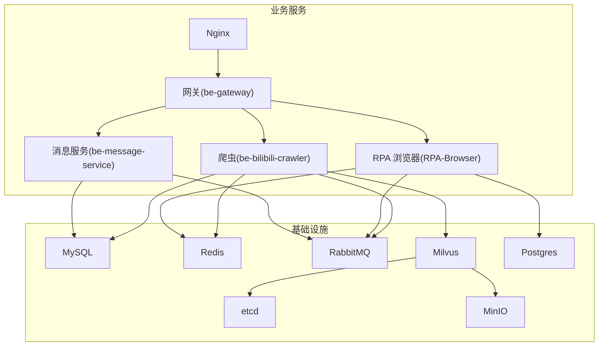
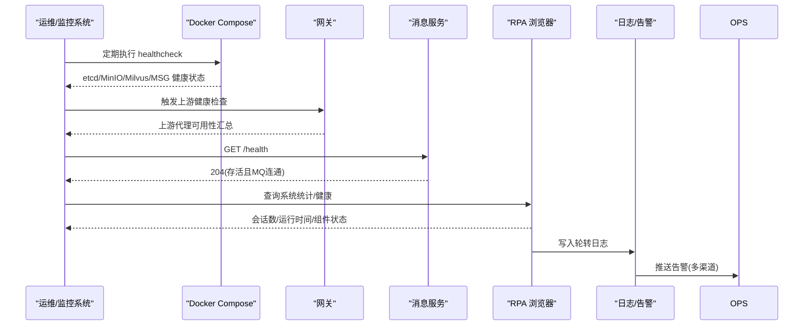
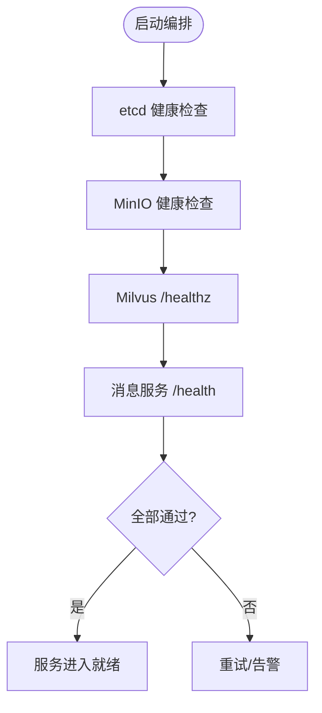
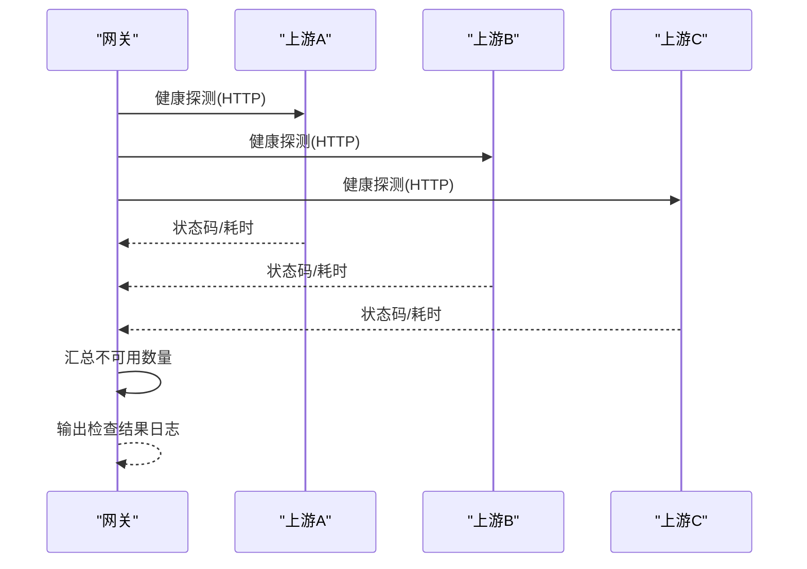
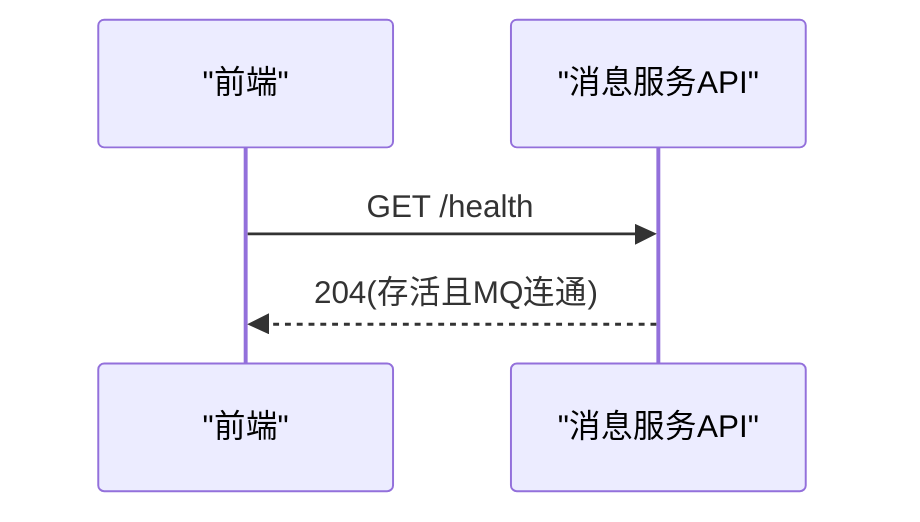
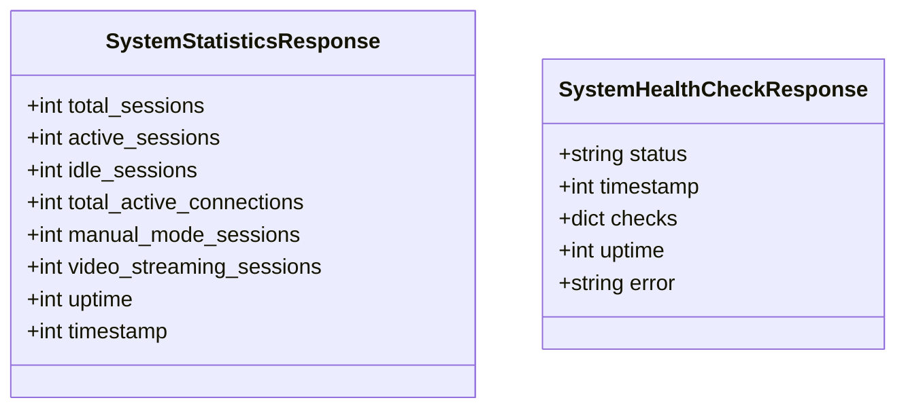
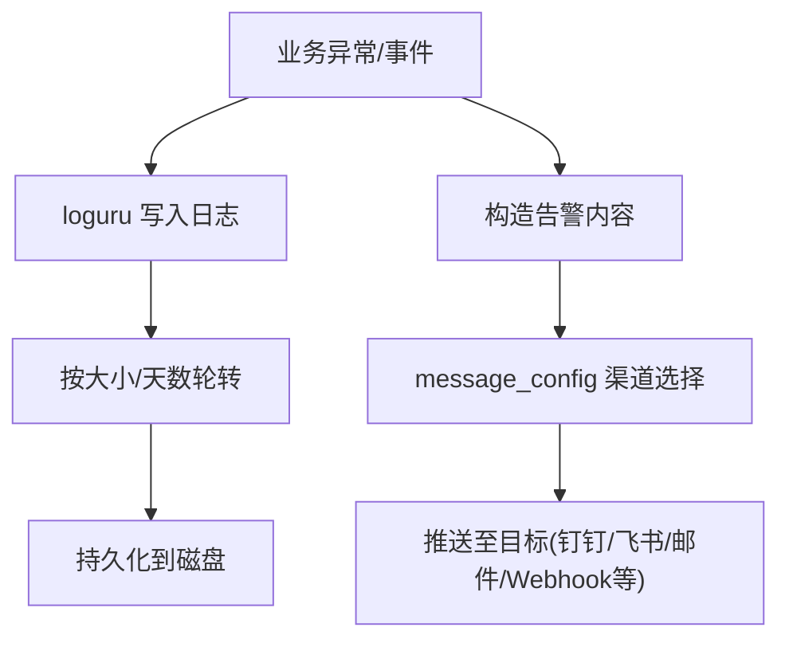
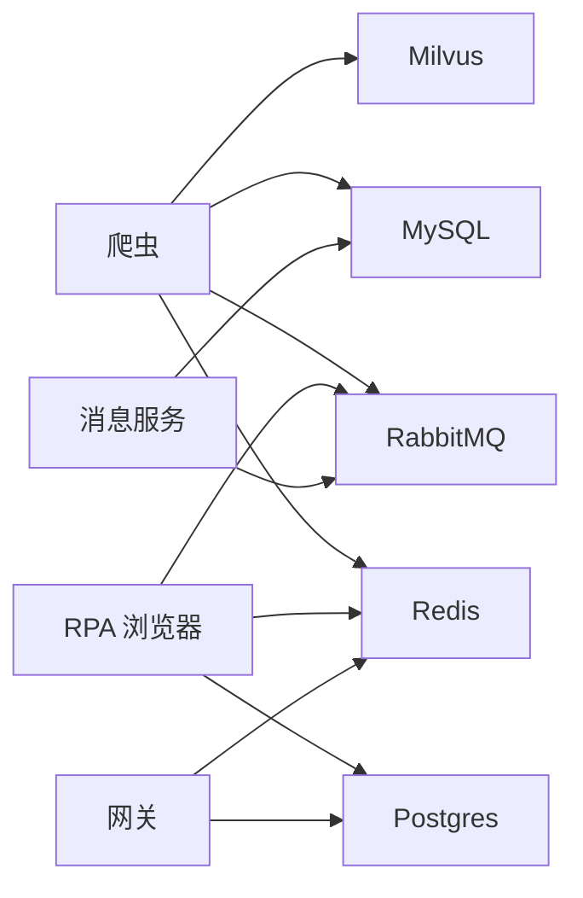

# 系统监控

<cite>
**本文引用的文件**
- [docker-compose.yml](file://docker-compose.yml)
- [RPA-Browser/app/config.py](file://RPA-Browser/app/config.py)
- [be-bilibili-crawler/CONFIG.py](file://be-bilibili-crawler/CONFIG.py)
- [RPA-Browser/app/models/runtime/control.py](file://RPA-Browser/app/models/runtime/control.py)
- [be-gateway/ExpressServerEnd/Service/upstream_health_module/upstream_health_service.js](file://be-gateway/ExpressServerEnd/Service/upstream_health_module/upstream_health_service.js)
- [Vue3FrontEndDemoExercise/src/api/community/hey-api/services/DefaultService.gen.ts](file://Vue3FrontEndDemoExercise/src/api/community/hey-api/services/DefaultService.gen.ts)
- [be-bilibili-crawler/Service/GrpcModule/GrpcSrc/监控up动态/bili_dynamic_monitor.py](file://be-bilibili-crawler/Service/GrpcModule/GrpcSrc/监控up动态/bili_dynamic_monitor.py)
- [RPA-Browser/app/utils/decorator/log_class_decorator.py](file://RPA-Browser/app/utils/decorator/log_class_decorator.py)
</cite>

## 目录
1. [简介](#简介)
2. [项目结构](#项目结构)
3. [核心组件](#核心组件)
4. [架构总览](#架构总览)
5. [详细组件分析](#详细组件分析)
6. [依赖关系分析](#依赖关系分析)
7. [性能考量](#性能考量)
8. [故障排查指南](#故障排查指南)
9. [结论](#结论)
10. [附录](#附录)

## 简介
本指南面向容器化环境下的系统监控，覆盖服务健康检查、资源使用监控（CPU、内存、磁盘、网络）、日志与指标采集、告警配置、数据存储与历史分析，以及监控对系统性能的影响控制。本项目通过 Docker Compose 编排多服务（MySQL、Redis、RabbitMQ、Milvus、Nginx、网关、消息服务、爬虫、RPA 浏览器等），并在关键服务中内置健康检查端点与上游连通性检测；同时提供统一的推送渠道配置用于告警通知。

## 项目结构
- 容器编排：docker-compose.yml 定义了所有服务的启动参数、端口映射、数据卷挂载、重启策略与健康检查。
- 服务配置：各服务通过环境变量或配置文件加载运行参数，如 RPA-Browser 的 Settings、爬虫的 CONFIG。
- 健康检查：
  - 容器级：etcd、MinIO、Milvus、message-service 等通过 healthcheck 探测存活。
  - 应用级：message-service 暴露 /health 校验 broker 连通；网关提供上游代理服务健康检查能力。
- 日志与告警：统一通过 message_config 推送渠道（Bark、钉钉、飞书、企业微信、邮件、Webhook 等）发送告警；部分模块按大小与保留期轮转日志。

图表来源
- [docker-compose.yml:1-380](file://docker-compose.yml#L1-L380)

章节来源
- [docker-compose.yml:1-380](file://docker-compose.yml#L1-L380)

## 核心组件
- 容器健康检查
  - etcd：使用 etcdctl endpoint health 探测。
  - MinIO：HTTP 健康端点探测。
  - Milvus：/healthz 探测。
  - message-service：/health 返回 204 表示存活且 RabbitMQ 连接正常。
- 应用健康检查
  - 网关：周期性对所有上游代理服务进行健康检查并汇总结果。
  - 前端：调用 /health 接口验证服务与 MQ 连通性。
- 指标与日志
  - 日志轮转与保留：基于 loguru 的日志装饰器实现按大小与天数轮转。
  - 统一推送告警：通过 message_config 集中管理多渠道告警配置。
- 资源限制
  - 容器资源限制：例如爬虫服务设置 memory limit，避免占用过多宿主资源。

章节来源
- [docker-compose.yml:14-18](file://docker-compose.yml#L14-L18)
- [docker-compose.yml:34-38](file://docker-compose.yml#L34-L38)
- [docker-compose.yml:54-59](file://docker-compose.yml#L54-L59)
- [docker-compose.yml:310-322](file://docker-compose.yml#L310-L322)
- [be-gateway/ExpressServerEnd/Service/upstream_health_module/upstream_health_service.js:93-124](file://be-gateway/ExpressServerEnd/Service/upstream_health_module/upstream_health_service.js#L93-L124)
- [Vue3FrontEndDemoExercise/src/api/community/hey-api/services/DefaultService.gen.ts:8-20](file://Vue3FrontEndDemoExercise/src/api/community/hey-api/services/DefaultService.gen.ts#L8-L20)
- [RPA-Browser/app/utils/decorator/log_class_decorator.py:6-25](file://RPA-Browser/app/utils/decorator/log_class_decorator.py#L6-L25)
- [docker-compose.yml:121-125](file://docker-compose.yml#L121-L125)

## 架构总览
下图展示了监控相关的关键交互：容器编排层负责基础服务健康检查；网关层聚合上游服务健康状态；消息服务提供 /health 探针；RPA 浏览器暴露系统统计与健康响应模型；日志与告警通过统一推送渠道输出。

图表来源
- [docker-compose.yml:14-18](file://docker-compose.yml#L14-L18)
- [docker-compose.yml:34-38](file://docker-compose.yml#L34-L38)
- [docker-compose.yml:54-59](file://docker-compose.yml#L54-L59)
- [docker-compose.yml:310-322](file://docker-compose.yml#L310-L322)
- [be-gateway/ExpressServerEnd/Service/upstream_health_module/upstream_health_service.js:93-124](file://be-gateway/ExpressServerEnd/Service/upstream_health_module/upstream_health_service.js#L93-L124)
- [RPA-Browser/app/models/runtime/control.py:295-351](file://RPA-Browser/app/models/runtime/control.py#L295-L351)
- [RPA-Browser/app/utils/decorator/log_class_decorator.py:6-25](file://RPA-Browser/app/utils/decorator/log_class_decorator.py#L6-L25)

## 详细组件分析

### 容器健康检查与探针
- etcd：使用 etcdctl endpoint health 命令探测集群健康。
- MinIO：通过 HTTP 健康端点判断对象存储是否可用。
- Milvus：/healthz 端点返回服务就绪状态。
- message-service：/health 仅当 broker 连通时返回 204，便于上层编排快速判定。

图表来源
- [docker-compose.yml:14-18](file://docker-compose.yml#L14-L18)
- [docker-compose.yml:34-38](file://docker-compose.yml#L34-L38)
- [docker-compose.yml:54-59](file://docker-compose.yml#L54-L59)
- [docker-compose.yml:310-322](file://docker-compose.yml#L310-L322)

章节来源
- [docker-compose.yml:14-18](file://docker-compose.yml#L14-L18)
- [docker-compose.yml:34-38](file://docker-compose.yml#L34-L38)
- [docker-compose.yml:54-59](file://docker-compose.yml#L54-L59)
- [docker-compose.yml:310-322](file://docker-compose.yml#L310-L322)

### 网关上游代理服务健康检查
- 网关周期性并发探测所有上游代理服务，记录耗时与路由信息，汇总不可用数量并输出告警日志。
- 该机制可用于集成外部监控系统（如 Prometheus + Alertmanager）以触发告警。

图表来源
- [be-gateway/ExpressServerEnd/Service/upstream_health_module/upstream_health_service.js:93-124](file://be-gateway/ExpressServerEnd/Service/upstream_health_module/upstream_health_service.js#L93-L124)

章节来源
- [be-gateway/ExpressServerEnd/Service/upstream_health_module/upstream_health_service.js:93-124](file://be-gateway/ExpressServerEnd/Service/upstream_health_module/upstream_health_service.js#L93-L124)

### 消息服务健康检查与前端联动
- 前端通过生成的 SDK 调用 /health 接口，若返回 204 则代表服务存活且 MQ 连接正常。
- 该接口可作为负载均衡器或编排系统的存活探针。

图表来源
- [Vue3FrontEndDemoExercise/src/api/community/hey-api/services/DefaultService.gen.ts:8-20](file://Vue3FrontEndDemoExercise/src/api/community/hey-api/services/DefaultService.gen.ts#L8-L20)

章节来源
- [Vue3FrontEndDemoExercise/src/api/community/hey-api/services/DefaultService.gen.ts:8-20](file://Vue3FrontEndDemoExercise/src/api/community/hey-api/services/DefaultService.gen.ts#L8-L20)

### RPA 浏览器系统统计与健康
- 系统统计响应包含总会话数、活跃/闲置会话、活跃连接数、运行时间与时间戳等。
- 健康检查响应包含整体状态、组件检查结果、运行时间与错误信息。

图表来源
- [RPA-Browser/app/models/runtime/control.py:295-351](file://RPA-Browser/app/models/runtime/control.py#L295-L351)

章节来源
- [RPA-Browser/app/models/runtime/control.py:295-351](file://RPA-Browser/app/models/runtime/control.py#L295-L351)

### 日志轮转与告警推送
- 日志装饰器为每个类添加独立日志文件，按大小与保留期轮转，降低磁盘占用。
- 统一推送渠道配置在多个服务中保持一致，便于跨服务告警聚合。

图表来源
- [RPA-Browser/app/utils/decorator/log_class_decorator.py:6-25](file://RPA-Browser/app/utils/decorator/log_class_decorator.py#L6-L25)
- [RPA-Browser/app/config.py:13-138](file://RPA-Browser/app/config.py#L13-L138)
- [be-bilibili-crawler/CONFIG.py:14-138](file://be-bilibili-crawler/CONFIG.py#L14-L138)

章节来源
- [RPA-Browser/app/utils/decorator/log_class_decorator.py:6-25](file://RPA-Browser/app/utils/decorator/log_class_decorator.py#L6-L25)
- [RPA-Browser/app/config.py:13-138](file://RPA-Browser/app/config.py#L13-L138)
- [be-bilibili-crawler/CONFIG.py:14-138](file://be-bilibili-crawler/CONFIG.py#L14-L138)

### 资源使用监控与告警建议
- CPU/内存：建议在编排层结合容器资源限制（如 memory limits）与宿主机监控（cgroups/内核指标）进行阈值告警。
- 磁盘：关注日志轮转与数据卷容量，设置磁盘使用率告警。
- 网络：监控容器间通信延迟与丢包，结合网关健康检查与上游服务响应耗时评估网络质量。
- 指标采集：可将上述健康检查与日志输出接入 Prometheus/Grafana 或 ELK 栈，形成可视化看板与告警规则。

[本节为通用指导，不直接分析具体文件]

## 依赖关系分析
- 服务间依赖：
  - 爬虫依赖 MySQL、Redis、RabbitMQ、Unidbg、Milvus。
  - RPA 浏览器依赖 Postgres、Redis、RabbitMQ、Casdoor。
  - 消息服务依赖 RabbitMQ、MySQL、Casdoor。
  - 网关依赖 Postgres、Redis、Casdoor。
- 健康检查依赖：
  - 容器健康检查依赖对应服务的健康端点或命令行工具。
  - 网关健康检查依赖上游代理服务可达性。

图表来源
- [docker-compose.yml:120-164](file://docker-compose.yml#L120-L164)
- [docker-compose.yml:165-178](file://docker-compose.yml#L165-L178)
- [docker-compose.yml:179-212](file://docker-compose.yml#L179-L212)
- [docker-compose.yml:227-260](file://docker-compose.yml#L227-L260)
- [docker-compose.yml:261-309](file://docker-compose.yml#L261-L309)

章节来源
- [docker-compose.yml:120-164](file://docker-compose.yml#L120-L164)
- [docker-compose.yml:165-178](file://docker-compose.yml#L165-L178)
- [docker-compose.yml:179-212](file://docker-compose.yml#L179-L212)
- [docker-compose.yml:227-260](file://docker-compose.yml#L227-L260)
- [docker-compose.yml:261-309](file://docker-compose.yml#L261-L309)

## 性能考量
- 健康检查频率与超时：合理设置 healthcheck 的 interval、timeout、retries，避免频繁探测导致负载上升。
- 日志轮转策略：按大小与保留期轮转日志，防止磁盘写放大与空间耗尽。
- 资源限制：为高资源消耗服务（如爬虫）设置 memory limits，保障整体稳定性。
- 指标采集开销：将指标采集与告警逻辑异步化，避免阻塞主流程。

[本节为通用指导，不直接分析具体文件]

## 故障排查指南
- 容器健康失败：
  - 检查对应服务的 healthcheck 配置与端口映射。
  - 查看容器日志与数据卷挂载是否正确。
- 网关上游不可用：
  - 使用网关提供的健康检查函数定位不可用上游与服务路由。
  - 检查上游服务端口、防火墙与网络策略。
- 消息服务不可用：
  - 访问 /health 确认返回 204；否则检查 RabbitMQ 连接与认证。
- 日志与告警：
  - 确认日志轮转配置生效，磁盘空间充足。
  - 检查 message_config 渠道配置（URL、Token、密钥）是否正确。

章节来源
- [docker-compose.yml:14-18](file://docker-compose.yml#L14-L18)
- [docker-compose.yml:34-38](file://docker-compose.yml#L34-L38)
- [docker-compose.yml:54-59](file://docker-compose.yml#L54-L59)
- [docker-compose.yml:310-322](file://docker-compose.yml#L310-L322)
- [be-gateway/ExpressServerEnd/Service/upstream_health_module/upstream_health_service.js:93-124](file://be-gateway/ExpressServerEnd/Service/upstream_health_module/upstream_health_service.js#L93-L124)
- [RPA-Browser/app/utils/decorator/log_class_decorator.py:6-25](file://RPA-Browser/app/utils/decorator/log_class_decorator.py#L6-L25)

## 结论
本项目通过容器编排与应用层健康检查构建了基础的监控体系，配合统一推送渠道实现了告警通知。建议在此基础上引入更完善的指标采集（Prometheus/Grafana）与日志分析（ELK/Loki），完善 CPU、内存、磁盘、网络等维度的监控与告警策略，并结合数据保留策略优化存储成本与查询性能。

[本节为总结性内容，不直接分析具体文件]

## 附录
- 监控部署建议
  - 指标采集：在各服务中暴露标准指标端点（如 /metrics），由 Prometheus 抓取。
  - 日志收集：将容器 stdout/stderr 与本地日志文件统一收集至日志平台。
  - 告警规则：基于阈值与趋势设置告警，避免误报与告警风暴。
- 数据保留策略
  - 指标数据：按时间窗口滚动存储（如 30 天热数据、90 天冷数据）。
  - 日志数据：按大小与天数轮转，归档至对象存储。
- 监控告警优化
  - 分级告警：区分警告、严重、致命等级。
  - 去重与抑制：对重复告警进行合并与抑制。
  - 自愈策略：对可恢复问题自动重试或重启。

[本节为通用指导，不直接分析具体文件]