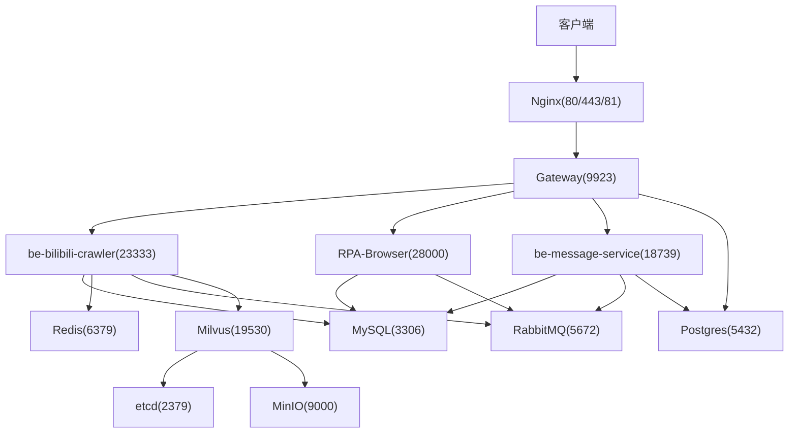
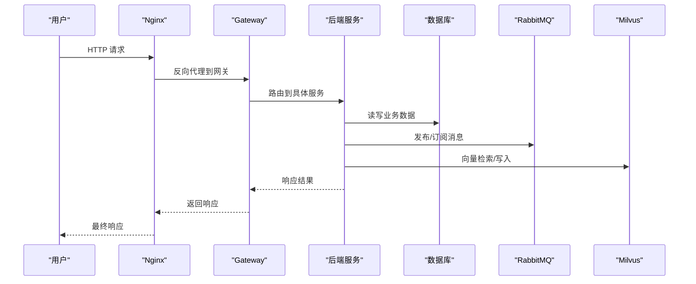
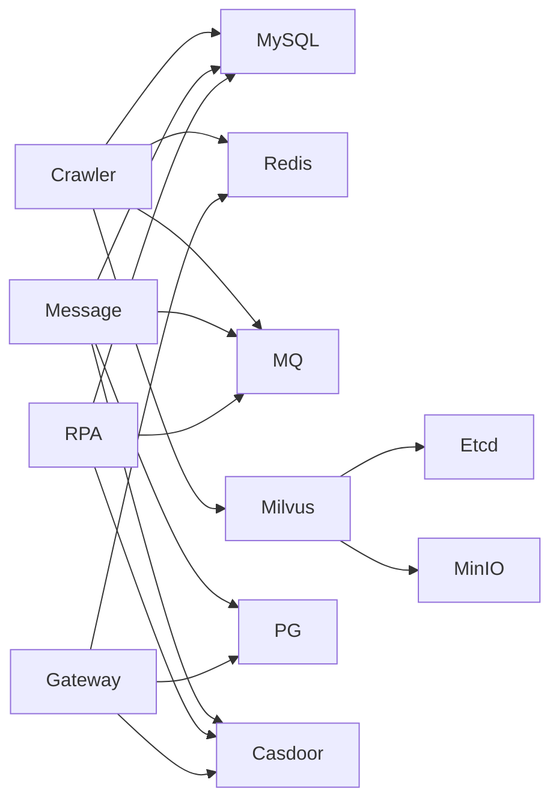

# 部署运维

<cite>
**本文引用的文件**
- [docker-compose.yml](file://docker-compose.yml)
- [dc-dev.yml](file://dc-dev.yml)
- [Dockerfile.mono](file://Dockerfile.mono)
- [custom_mysql.cnf](file://docker_vol/mysql_data/conf.d/custom_mysql.cnf)
- [nginx.conf](file://docker_vol/nginx/conf/nginx.conf)
</cite>

## 目录
1. [简介](#简介)
2. [项目结构](#项目结构)
3. [核心组件](#核心组件)
4. [架构总览](#架构总览)
5. [详细组件分析](#详细组件分析)
6. [依赖关系分析](#依赖关系分析)
7. [性能与调优](#性能与调优)
8. [故障排查指南](#故障排查指南)
9. [结论](#结论)
10. [附录](#附录)

## 简介
本指南面向生产环境，提供基于 Docker Compose 的完整编排、环境配置、监控日志、备份恢复、安全加固、扩容与性能调优方案。系统包含 MySQL、Redis、RabbitMQ、Milvus（etcd + MinIO）、PostgreSQL、Nginx、Casdoor、消息服务、爬虫服务、RPA 浏览器服务、网关以及可选的本地 LLM 推理服务。文档聚焦可操作的生产实践与排障要点，帮助快速落地并稳定运行。

## 项目结构
- 编排与镜像
  - docker-compose.yml：定义全部服务、端口映射、环境变量、数据卷、健康检查与依赖关系。
  - dc-dev.yml：开发/测试环境的精简编排，便于快速启动核心中间件与服务。
  - Dockerfile.mono：多阶段构建，统一 Python 基础镜像与 uv 缓存策略，产出 crawler、rpa、message 三个目标镜像。
- 中间件与存储
  - MySQL：业务主库，挂载自定义配置与数据目录。
  - Redis：缓存与会话等。
  - RabbitMQ：消息队列与管理界面。
  - Milvus：向量检索，依赖 etcd 与 MinIO。
  - PostgreSQL：PPTR 相关数据。
  - Nginx：反向代理与静态资源入口。
  - Casdoor：统一认证。
- 应用服务
  - be-bilibili-crawler：爬虫与数据处理服务。
  - be-message-service：消息与通知服务。
  - RPA-Browser：浏览器自动化服务。
  - gateway：Node.js 网关。
  - llama_cpp / llama_cpp_gpu_cuda：可选的本地 LLM 推理服务。

**图表来源**
- [docker-compose.yml:1-380](file://docker-compose.yml#L1-L380)

**章节来源**
- [docker-compose.yml:1-380](file://docker-compose.yml#L1-L380)
- [dc-dev.yml:1-213](file://dc-dev.yml#L1-L213)
- [Dockerfile.mono:1-146](file://Dockerfile.mono#L1-L146)

## 核心组件
- 中间件
  - MySQL：通过挂载配置文件 custom_mysql.cnf 调整连接、超时、InnoDB 缓冲与监控开关，降低内存占用并提升稳定性。
  - Redis：默认配置，建议在生产中开启持久化与内存淘汰策略。
  - RabbitMQ：启用管理界面，使用环境变量设置默认用户与密码；生产建议限制访问与启用 TLS。
  - Milvus：standalone 模式，依赖 etcd 与 MinIO；etcd 已设置自动压缩与配额，MinIO 暴露控制台端口用于对象存储管理。
  - PostgreSQL：为 PPTR 与部分服务提供数据源。
  - Nginx：统一入口，转发 API、前端与 Casdoor 管理面板。
  - Casdoor：集中式身份认证，与网关和消息服务共享配置。
- 应用服务
  - be-bilibili-crawler：爬虫与数据处理，依赖 MySQL、Redis、RabbitMQ、Milvus、LLM 等。
  - be-message-service：消息、通知与事件处理，依赖 RabbitMQ、MySQL、PostgreSQL、Casdoor。
  - RPA-Browser：浏览器自动化，依赖 MySQL、RabbitMQ、Casdoor。
  - gateway：Node.js 网关，聚合后端接口，对接 Casdoor 与外部服务。
  - llama_cpp / llama_cpp_gpu_cuda：可选本地模型推理，支持 CPU/GPU 两种镜像。

**章节来源**
- [docker-compose.yml:1-380](file://docker-compose.yml#L1-L380)
- [custom_mysql.cnf:1-67](file://docker_vol/mysql_data/conf.d/custom_mysql.cnf#L1-L67)

## 架构总览
- 请求路径
  - 客户端 → Nginx → Gateway → 各后端服务（Crawler/RPA/Message）。
- 数据流
  - 业务写入 MySQL/PostgreSQL，热点数据落 Redis，异步任务经 RabbitMQ 消费。
  - 向量检索走 Milvus（etcd 元数据 + MinIO 对象存储）。
  - 认证统一由 Casdoor 提供，网关与消息服务集成 OAuth2。
- 可观测性
  - Nginx 访问日志与错误日志。
  - 各服务通过环境变量控制日志级别与输出方式。
  - RabbitMQ Management 提供队列与节点监控。

**图表来源**
- [docker-compose.yml:1-380](file://docker-compose.yml#L1-L380)

**章节来源**
- [docker-compose.yml:1-380](file://docker-compose.yml#L1-L380)

## 详细组件分析

### MySQL 部署与优化
- 部署要点
  - 容器名 fastapi-mysql，端口映射宿主机 MYSQL_PORT。
  - 数据与配置分别挂载至 docker_vol/mysql_data/data 与 conf.d。
  - 时区与环境变量 TZ 统一。
- 关键参数（来自 custom_mysql.cnf）
  - 关闭 Binlog、慢查询与通用日志，降低 IO 与内存压力。
  - 连接与超时：max_connections=500，wait_timeout 与 net_*_timeout 合理设置。
  - InnoDB：innodb_buffer_pool_size 与 redo log 容量按内存规模调整。
  - 缓冲区尺寸：join/sort/read buffer 控制在 KB~MB 级，避免 OOM。
  - 监控裁剪：performance_schema 关闭，table_open_cache 与 table_definition_cache 适度下调。
- 生产建议
  - 根据实际 QPS 与并发连接数评估 max_connections。
  - 定期清理历史数据与索引碎片，必要时分库分表。
  - 开启二进制日志与定时全量+增量备份策略（需结合业务容忍度）。

**章节来源**
- [docker-compose.yml:68-81](file://docker-compose.yml#L68-L81)
- [custom_mysql.cnf:1-67](file://docker_vol/mysql_data/conf.d/custom_mysql.cnf#L1-L67)

### Redis 部署与优化
- 部署要点
  - 容器名 fastapi-redis，端口映射 REDIS_PORT。
  - 数据目录挂载至 docker_vol/redis/data。
- 生产建议
  - 启用 AOF/RDB 持久化，合理设置过期策略与内存上限。
  - 限制最大客户端连接数，配置安全密码与网络白名单。
  - 监控内存命中率与慢查询，必要时拆分 key 空间。

**章节来源**
- [docker-compose.yml:82-93](file://docker-compose.yml#L82-L93)

### RabbitMQ 部署与优化
- 部署要点
  - 容器名 fastapi-rabbitmq，启用 management 插件，暴露 5672 与 15672。
  - 通过环境变量设置默认用户与密码，日志与数据持久化。
- 生产建议
  - 启用 TLS 加密，限制管理界面访问 IP。
  - 设置队列 TTL、死信队列与限流策略，防止消息堆积。
  - 监控消费者速率与队列长度，按需水平扩展消费者实例。

**章节来源**
- [docker-compose.yml:94-109](file://docker-compose.yml#L94-L109)

### Milvus（etcd + MinIO）部署与优化
- 部署要点
  - etcd：设置自动压缩模式与保留条数，配额限制，快照计数。
  - MinIO：对象存储，控制台端口 9001，数据目录持久化。
  - Milvus standalone：依赖 etcd 与 MinIO，暴露 19530 与 9091。
- 生产建议
  - 根据向量规模调整 etcd 配额与快照策略。
  - MinIO 启用版本控制与生命周期规则，定期归档冷数据。
  - 监控 Milvus 健康端点与磁盘使用率，及时扩缩容。

**章节来源**
- [docker-compose.yml:2-67](file://docker-compose.yml#L2-L67)

### PostgreSQL 部署
- 部署要点
  - 容器名 postgres，数据目录持久化，环境变量设置用户与密码。
- 生产建议
  - 针对 PPTR 与消息服务的读多写少场景，考虑只读副本与连接池。
  - 定期 vacuum 与统计信息更新，监控慢查询。

**章节来源**
- [docker-compose.yml:165-178](file://docker-compose.yml#L165-L178)

### Nginx 反向代理
- 部署要点
  - 监听 80/443/81，证书目录与站点 HTML 目录挂载。
  - 将 /api 转发至网关，/casdoor 转发至管理面板，/ 转发前端开发服务器或静态资源。
- 生产建议
  - 启用 gzip、HTTP/2 与缓存策略，合理设置 worker_processes 与 connections。
  - 记录访问日志与错误日志，配合日志分析工具进行流量与异常分析。

**章节来源**
- [docker-compose.yml:357-371](file://docker-compose.yml#L357-L371)
- [nginx.conf:1-71](file://docker_vol/nginx/conf/nginx.conf#L1-L71)

### 应用服务（Crawler、RPA、Message、Gateway）
- 构建与运行
  - 多阶段镜像：crawler/rpa/message 共用 base 层，uv 缓存加速依赖安装。
  - 环境变量注入数据库、消息队列、向量库与认证服务地址。
- 健康检查
  - 消息服务提供 /health 端点，结合 Compose healthcheck 实现自动重启。
- 生产建议
  - 为高负载服务设置资源限制与副本数，结合滚动升级。
  - 统一日志格式与采集策略，接入集中式日志平台。

**章节来源**
- [docker-compose.yml:120-337](file://docker-compose.yml#L120-L337)
- [Dockerfile.mono:1-146](file://Dockerfile.mono#L1-L146)

## 依赖关系分析
- 服务间依赖
  - Crawler 依赖 MySQL、Redis、RabbitMQ、Milvus、LLM。
  - Message 依赖 RabbitMQ、MySQL、PostgreSQL、Casdoor。
  - RPA 依赖 MySQL、RabbitMQ、Casdoor。
  - Gateway 依赖 Postgres、Redis、Casdoor。
- 中间件依赖
  - Milvus 依赖 etcd 与 MinIO。
  - Nginx 作为统一入口，不直接依赖业务数据库。

**图表来源**
- [docker-compose.yml:1-380](file://docker-compose.yml#L1-L380)

**章节来源**
- [docker-compose.yml:1-380](file://docker-compose.yml#L1-L380)

## 性能与调优
- MySQL
  - 依据内存与并发调整 innodb_buffer_pool_size、redo log 容量与连接数。
  - 关闭不必要的监控与日志，减少内存与 IO 开销。
  - 对热点查询建立合适索引，避免大事务与长事务。
- Redis
  - 设置内存上限与淘汰策略，避免 OOM。
  - 使用 pipeline 与批量操作减少 RTT。
- RabbitMQ
  - 合理设置队列大小与消费者并发，避免背压。
  - 启用消息确认与重试机制，防止丢失。
- Milvus
  - 调整 etcd 配额与快照频率，MinIO 对象生命周期管理。
  - 监控向量索引构建与查询延迟，必要时分片扩容。
- Nginx
  - 启用 gzip、HTTP/2、缓存与连接复用。
  - 合理设置 worker 数量与连接上限，避免瓶颈。
- 应用服务
  - 为高负载服务设置资源限制与副本，使用滚动升级。
  - 统一日志级别与采样策略，降低 I/O 压力。

[本节为通用指导，无需特定文件引用]

## 故障排查指南
- 常见问题定位
  - 服务无法启动：检查健康检查端点与依赖服务连通性。
  - 数据库连接失败：核对环境变量与端口映射，查看 MySQL/PG 日志。
  - 消息堆积：查看 RabbitMQ 队列长度与消费者状态，必要时扩容消费者。
  - 向量检索异常：检查 Milvus 健康端点与 etcd/MinIO 状态。
  - 前端/网关不通：检查 Nginx 配置与上游服务端口。
- 日志与监控
  - Nginx 访问与错误日志位于 docker_vol/nginx/logs。
  - 各服务日志可通过 Compose logs 查看，生产建议接入集中式日志平台。
  - RabbitMQ Management 提供队列与节点指标。
- 恢复与回滚
  - 数据库：定期全量备份与增量备份，演练恢复流程。
  - 镜像：使用固定版本标签，灰度发布与快速回滚。
  - 配置：变更前备份配置文件，变更后验证健康检查。

**章节来源**
- [docker-compose.yml:14-67](file://docker-compose.yml#L14-L67)
- [docker-compose.yml:310-322](file://docker-compose.yml#L310-L322)
- [docker-compose.yml:357-371](file://docker-compose.yml#L357-L371)

## 结论
本指南提供了基于 Docker Compose 的完整部署与运维方案，覆盖中间件配置、服务编排、监控日志、备份恢复与安全加固。生产环境应结合业务规模进行容量规划与性能调优，建立完善的监控告警与灾备机制，确保系统稳定与可扩展。

[本节为总结，无需特定文件引用]

## 附录
- 环境变量清单（示例）
  - 数据库：MYSQL_PASSWORD、POSTGRES_USER、POSTGRES_PASSWORD、POSTGRES_HOST。
  - 缓存与消息：REDIS_PORT、RABBITMQ_USER、RABBITMQ_PASSWORD、RABBITMQ_WEBUI_PORT。
  - 向量库：MILVUS_PORT。
  - 网关与前端：NODEJS_PPTR_PORT、CASDOOR_ENDPOINT、CASDOOR_CLIENT_ID 等。
  - 服务端口：FASTAPI_PORT、MESSAGE_SERVICE_PORT、RPA_BROWSER_PORT、LLAMA_PORT。
- 常用命令
  - 启动：docker compose up -d
  - 查看日志：docker compose logs -f <service>
  - 健康检查：curl http://localhost:<port>/health
  - 停止：docker compose down
- 备份脚本建议
  - MySQL：mysqldump 全量 + binlog 增量（若开启）。
  - Redis：AOF/RDB 快照定时拷贝。
  - MinIO：对象存储版本化与生命周期规则。
  - Milvus：etcd 快照与 MinIO 对象归档。

[本节为补充说明，无需特定文件引用]