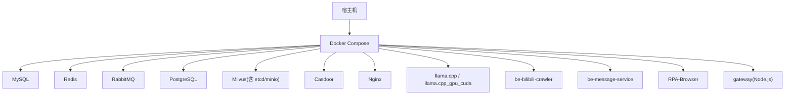
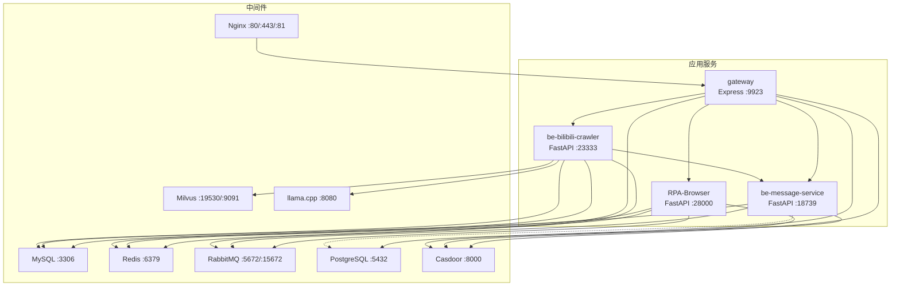
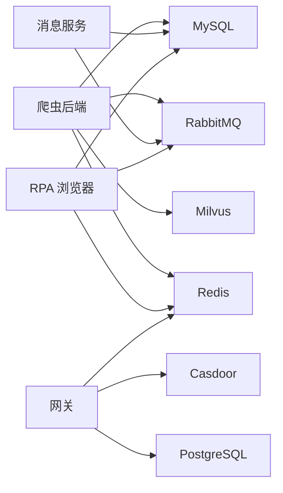

# 快速开始

<cite>
**本文引用的文件**
- [docker-compose.yml](file://docker-compose.yml)
- [dc-dev.yml](file://dc-dev.yml)
- [Dockerfile.mono](file://Dockerfile.mono)
- [README.md](file://README.md)
- [be-bilibili-crawler/main.py](file://be-bilibili-crawler/main.py)
- [be-message-service/app/main.py](file://be-message-service/app/main.py)
- [RPA-Browser/main.py](file://RPA-Browser/main.py)
- [be-bilibili-crawler/CONFIG.py](file://be-bilibili-crawler/CONFIG.py)
</cite>

## 目录
1. [简介](#简介)
2. [项目结构](#项目结构)
3. [核心组件](#核心组件)
4. [架构总览](#架构总览)
5. [详细组件分析](#详细组件分析)
6. [依赖关系分析](#依赖关系分析)
7. [性能与资源建议](#性能与资源建议)
8. [故障排查指南](#故障排查指南)
9. [结论](#结论)
10. [附录：常用命令与端口](#附录：常用命令与端口)

## 简介
本指南面向首次接触 BilibiliExplosion 的用户，目标是帮助你在最短时间内完成环境搭建、一键启动系统，并进行基本操作（如启动爬虫任务、查看采集数据、发送测试消息）。系统采用 Docker Compose 编排，包含 MySQL、Redis、RabbitMQ、PostgreSQL、Milvus、Casdoor、Nginx、LLM 推理服务以及多个后端微服务（爬虫、消息推送、RPA 浏览器、网关等）。

## 项目结构
仓库通过 docker-compose 统一编排多服务，关键编排定义位于根目录的 docker-compose.yml；开发模式可使用 dc-dev.yml 精简启动。Python 后端镜像基于多阶段构建（Dockerfile.mono），分别产出 crawler、rpa、message 三个运行目标。

图表来源
- [docker-compose.yml:1-380](file://docker-compose.yml#L1-L380)
- [Dockerfile.mono:1-146](file://Dockerfile.mono#L1-L146)

章节来源
- [README.md:36-52](file://README.md#L36-L52)
- [docker-compose.yml:1-380](file://docker-compose.yml#L1-L380)
- [Dockerfile.mono:1-146](file://Dockerfile.mono#L1-L146)

## 核心组件
- 爬虫后端（be-bilibili-crawler）：提供数据采集与数据查询 API，依赖 MySQL、Redis、RabbitMQ、Milvus、Unidbg、Message Service。
- 消息服务（be-message-service）：统一消息推送与私信/通知/事件聚合，依赖 RabbitMQ、MySQL、Casdoor、可选 Postgres（只读）。
- RPA 浏览器（RPA-Browser）：基于 Playwright 的自动化能力，依赖 MySQL、Redis、RabbitMQ、Casdoor。
- 网关（gateway）：Node.js Express 网关，负责前端路由、账号与抽奖业务，依赖 PostgreSQL、Redis、Casdoor。
- 基础设施：MySQL、Redis、RabbitMQ、PostgreSQL、Milvus（etcd+minio）、Casdoor、Nginx、LLM（llama.cpp/CUDA）。

章节来源
- [docker-compose.yml:68-164](file://docker-compose.yml#L68-L164)
- [docker-compose.yml:165-226](file://docker-compose.yml#L165-L226)
- [docker-compose.yml:227-337](file://docker-compose.yml#L227-L337)
- [docker-compose.yml:357-371](file://docker-compose.yml#L357-L371)

## 架构总览
下图展示了主要服务之间的依赖与通信关系，包括数据库、消息队列、向量检索、认证与网关入口。

图表来源
- [docker-compose.yml:68-164](file://docker-compose.yml#L68-L164)
- [docker-compose.yml:165-226](file://docker-compose.yml#L165-L226)
- [docker-compose.yml:227-337](file://docker-compose.yml#L227-L337)
- [docker-compose.yml:357-371](file://docker-compose.yml#L357-L371)

## 详细组件分析

### 环境准备与一键启动
- 安装 Docker 与 Docker Compose（确保版本支持多阶段构建与 healthcheck）。
- 克隆仓库并初始化子模块（若使用 git submodule 管理的服务）。
- 在仓库根目录执行：
  - 生产一键启动：docker compose up -d
  - 开发精简启动：docker compose -f dc-dev.yml up -d（仅包含必要服务）
- 首次启动会拉取镜像、创建数据卷并自动迁移数据库（部分服务会在启动时执行 alembic upgrade head）。

章节来源
- [README.md:54-110](file://README.md#L54-L110)
- [docker-compose.yml:1-380](file://docker-compose.yml#L1-L380)
- [dc-dev.yml:1-213](file://dc-dev.yml#L1-L213)

### 环境变量配置要点
- 所有服务通过 docker-compose 的环境变量注入连接信息（如 MySQL、Redis、RabbitMQ、PostgreSQL、Casdoor、Milvus、LLM 等）。
- 推送渠道统一通过 MESSAGE_CONFIG（JSON）在各服务间共享，避免重复配置。
- 常见变量示例（以容器内服务名为主）：
  - 数据库：MYSQL_HOST/MYSQL_PORT/MYSQL_USER/MYSQL_PASSWORD；POSTGRES_USER/POSTGRES_PASSWORD
  - 缓存：REDIS_HOST/REDIS_PORT/REDIS_PWD
  - 消息：RABBITMQ_HOST/RABBITMQ_PORT/RABBITMQ_USER/RABBITMQ_PASSWORD
  - 认证：CASDOOR_ENDPOINT/CASDOOR_CLIENT_ID/CASDOOR_CLIENT_SECRET 等
  - 向量：MILVUS_HOST/MILVUS_PORT
  - 推理：LLAMA_HOST/LLAMA_PORT
  - 日志与调试：LOG_LEVEL、SHOW_LOG、IS_DEV、ENV_TZ

章节来源
- [docker-compose.yml:68-164](file://docker-compose.yml#L68-L164)
- [docker-compose.yml:165-226](file://docker-compose.yml#L165-L226)
- [docker-compose.yml:227-337](file://docker-compose.yml#L227-L337)
- [be-bilibili-crawler/CONFIG.py:225-277](file://be-bilibili-crawler/CONFIG.py#L225-L277)

### 服务启动顺序与依赖关系
- 基础中间件优先启动：MySQL、Redis、RabbitMQ、PostgreSQL、Milvus（etcd/minio）、Casdoor。
- 应用服务按依赖拉起：
  - be-bilibili-crawler：依赖 MySQL、Redis、RabbitMQ、Unidbg、Milvus、Message Service
  - be-message-service：依赖 RabbitMQ、MySQL、Casdoor（可选 Postgres 只读）
  - RPA-Browser：依赖 MySQL、Redis、RabbitMQ、Casdoor
  - gateway：依赖 PostgreSQL、Redis、Casdoor
- 健康检查：
  - Milvus：/healthz
  - MinIO：/minio/health/live
  - Message Service：/health（同时校验 broker 连通性）

章节来源
- [docker-compose.yml:1-67](file://docker-compose.yml#L1-L67)
- [docker-compose.yml:68-164](file://docker-compose.yml#L68-L164)
- [docker-compose.yml:165-226](file://docker-compose.yml#L165-L226)
- [docker-compose.yml:227-337](file://docker-compose.yml#L227-L337)
- [be-message-service/app/main.py:227-239](file://be-message-service/app/main.py#L227-L239)

### 基本使用示例
- 启动爬虫任务
  - 通过网关或爬虫后端提供的接口提交任务（具体路由见各服务控制器）。
  - 任务经 RabbitMQ 分发，爬虫后端消费并写入 MySQL/Milvus。
- 查看采集数据
  - 访问爬虫后端的数据查询接口（如动态/抽奖统计等），或通过网关聚合页面查看。
- 发送测试消息
  - 调用消息服务的推送接口（/api/v1/message/push 或相关路由），或使用统一消息设置进行触发。
  - 可通过 RabbitMQ Management UI（默认端口映射到宿主机的 RABBITMQ_WEBUI_PORT）观察队列与消息流转。

提示：以上为通用流程说明，具体请求参数与路由前缀请参考各服务文档与 OpenAPI。

章节来源
- [be-bilibili-crawler/main.py:48-60](file://be-bilibili-crawler/main.py#L48-L60)
- [be-message-service/app/main.py:218-264](file://be-message-service/app/main.py#L218-L264)
- [docker-compose.yml:94-109](file://docker-compose.yml#L94-L109)

### 开发模式与调试技巧
- 开发模式启动：
  - 使用 dc-dev.yml 精简启动必要服务，减少资源占用。
  - 源码热更新：compose 中挂载源码目录（如 ./be-bilibili-crawler:/app），便于本地修改即时生效。
- 调试建议：
  - 调整日志等级：LOG_LEVEL（消息服务）、SHOW_LOG（爬虫服务）、FASTSTREAM_LOG_LEVEL（框架日志）。
  - 查看容器日志：docker compose logs <service>
  - 健康检查：访问 /health（消息服务）或 /healthz（Milvus）确认服务就绪。
  - 数据库迁移：部分服务在启动时自动执行 alembic upgrade head，若失败请检查数据库连接与权限。

章节来源
- [dc-dev.yml:1-213](file://dc-dev.yml#L1-L213)
- [docker-compose.yml:120-164](file://docker-compose.yml#L120-L164)
- [docker-compose.yml:261-322](file://docker-compose.yml#L261-L322)
- [be-message-service/app/main.py:172-199](file://be-message-service/app/main.py#L172-L199)

## 依赖关系分析
- 耦合度与内聚性：
  - 爬虫与消息服务通过 RabbitMQ 解耦，提升可扩展性。
  - 各服务对数据库/缓存/消息队列的依赖清晰，便于独立扩展与替换。
- 外部依赖：
  - Milvus（向量检索）、Casdoor（认证）、Nginx（反向代理）、LLM（推理）。
- 潜在循环依赖：
  - 通过 Compose depends_on 与服务健康检查避免启动顺序问题；无代码级循环依赖。

图表来源
- [docker-compose.yml:68-164](file://docker-compose.yml#L68-L164)
- [docker-compose.yml:165-226](file://docker-compose.yml#L165-L226)
- [docker-compose.yml:227-337](file://docker-compose.yml#L227-L337)

章节来源
- [docker-compose.yml:1-380](file://docker-compose.yml#L1-L380)

## 性能与资源建议
- 内存限制：爬虫服务在 compose 中设置了 memory limit（5G），可根据实际负载调整。
- 连接池：爬虫后端配置了 SQLAlchemy 连接池参数（pool_size、max_overflow、pool_recycle），避免连接泄漏与超时。
- 日志级别：生产环境建议将 LOG_LEVEL 设为 WARNING，减少 I/O 开销。
- 向量库：Milvus 需要足够磁盘空间与 CPU，必要时可单独部署并扩容。

章节来源
- [docker-compose.yml:120-164](file://docker-compose.yml#L120-L164)
- [be-bilibili-crawler/CONFIG.py:381-419](file://be-bilibili-crawler/CONFIG.py#L381-L419)

## 故障排查指南
- 启动失败
  - 检查依赖服务是否就绪：MySQL、Redis、RabbitMQ、PostgreSQL、Milvus、Casdoor。
  - 查看健康端点：/health（消息服务）、/healthz（Milvus）、MinIO 健康检查。
  - 查看容器日志：docker compose logs <service>
- 连接问题
  - 网络隔离：确保容器在同一 Compose 网络，服务名解析正确。
  - 端口冲突：检查宿主机端口是否被占用（如 80、443、3306、5432、6379、5672、19530）。
  - 权限问题：Milvus 数据目录需正确权限（参考 README 注意事项）。
- 数据库迁移失败
  - 检查数据库连接字符串与用户权限。
  - 手动执行迁移脚本（如 alembic upgrade head）并查看错误输出。
- 消息队列异常
  - 通过 RabbitMQ Management UI 检查队列状态与消费者连接。
  - 调整心跳与超时参数（如 heartbeat=180）。

章节来源
- [README.md:116-121](file://README.md#L116-L121)
- [docker-compose.yml:14-19](file://docker-compose.yml#L14-L19)
- [docker-compose.yml:34-38](file://docker-compose.yml#L34-L38)
- [docker-compose.yml:54-59](file://docker-compose.yml#L54-L59)
- [be-message-service/app/main.py:84-158](file://be-message-service/app/main.py#L84-L158)

## 结论
通过 Docker Compose 一键编排，BilibiliExplosion 提供了开箱即用的数据采集、消息推送、RPA 自动化与网关能力。新用户只需完成环境准备与基础配置，即可快速启动并验证核心功能。建议在开发阶段使用 dc-dev.yml 精简启动，在生产环境完善环境变量与安全策略后全量部署。

## 附录：常用命令与端口
- 常用命令
  - 一键启动：docker compose up -d
  - 开发启动：docker compose -f dc-dev.yml up -d
  - 查看日志：docker compose logs -f <service>
  - 停止服务：docker compose down
- 关键端口（宿主机映射）
  - Nginx：80/443/81
  - MySQL：3306
  - Redis：6379
  - RabbitMQ：5672（AMQP）、15672（Management UI）
  - PostgreSQL：5432
  - Milvus：19530（gRPC）、9091（健康）
  - Casdoor：8000
  - 爬虫后端：23333
  - 消息服务：18739
  - RPA 浏览器：28000
  - 网关：9923
  - LLM（CPU/GPU）：8080/12000

章节来源
- [docker-compose.yml:68-164](file://docker-compose.yml#L68-L164)
- [docker-compose.yml:165-226](file://docker-compose.yml#L165-L226)
- [docker-compose.yml:227-337](file://docker-compose.yml#L227-L337)
- [docker-compose.yml:357-371](file://docker-compose.yml#L357-L371)