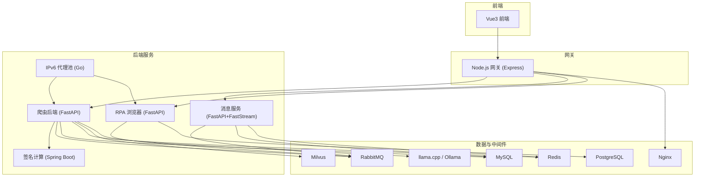
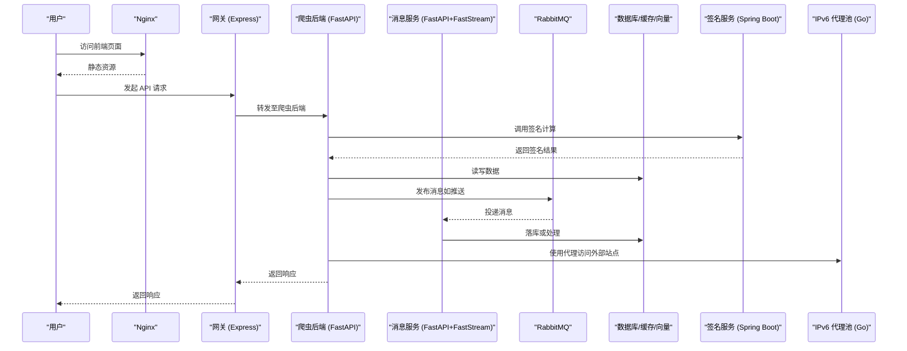
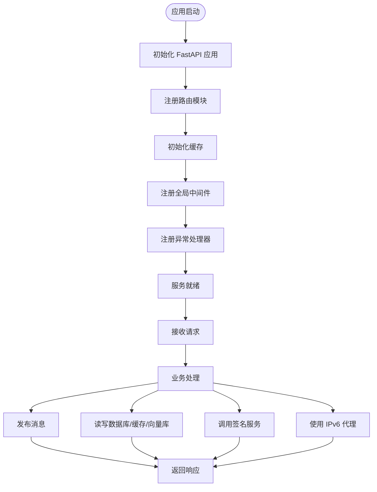
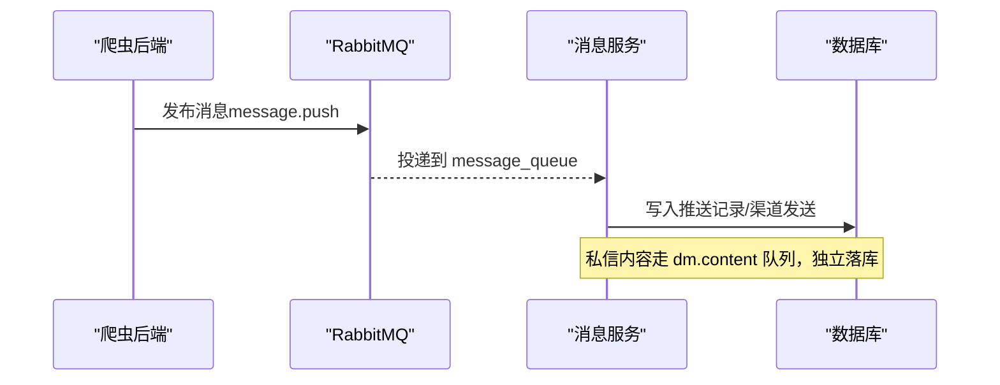
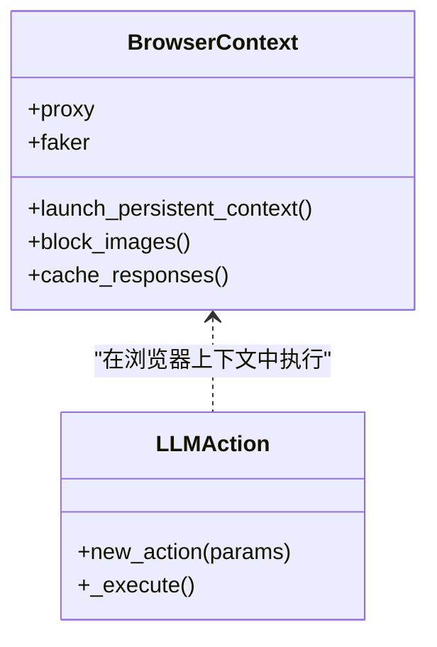
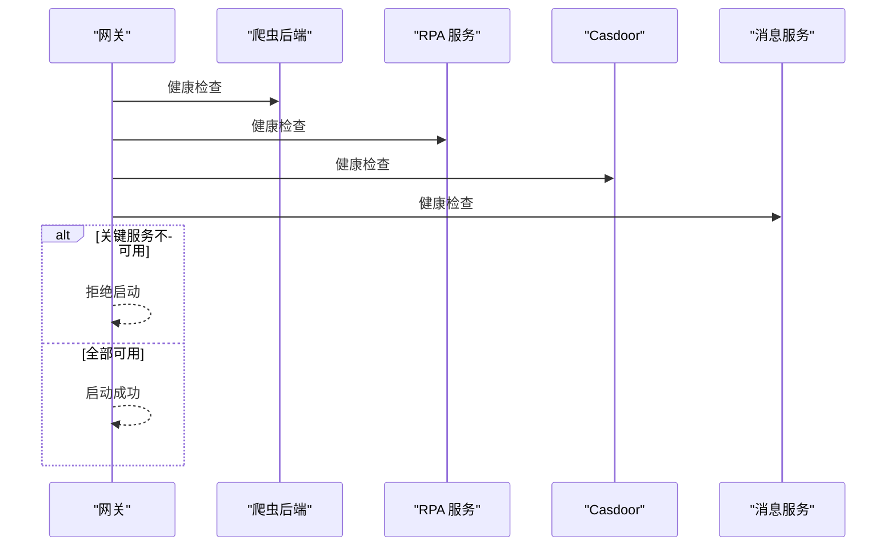
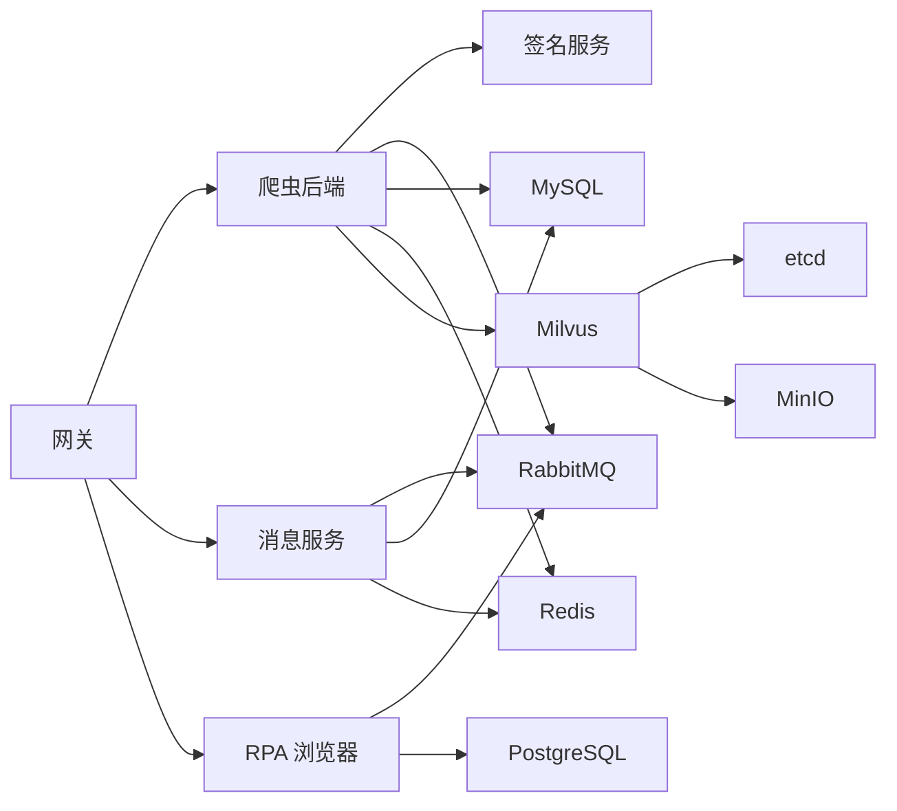

# 技术栈概览

<cite>
**本文引用的文件**
- [README.md](file://README.md)
- [docker-compose.yml](file://docker-compose.yml)
- [be-bilibili-crawler/main.py](file://be-bilibili-crawler/main.py)
- [RPA-Browser/main.py](file://RPA-Browser/main.py)
- [go-proxy-ipv6-pool-auto/go-proxy-ipv6-pool/main.go](file://go-proxy-ipv6-pool-auto/go-proxy-ipv6-pool/main.go)
- [unidbgSpringBoot/pom.xml](file://unidbgSpringBoot/pom.xml)
- [Vue3FrontEndDemoExercise/package.json](file://Vue3FrontEndDemoExercise/package.json)
- [be-gateway/ExpressServerEnd/server.js](file://be-gateway/ExpressServerEnd/server.js)
- [be-gateway/ExpressServerEnd/Service/upstream_health_module/upstream_health_service.js](file://be-gateway/ExpressServerEnd/Service/upstream_health_module/upstream_health_service.js)
- [be-bilibili-crawler/CONFIG.py](file://be-bilibili-crawler/CONFIG.py)
- [be-bilibili-crawler/Service/MQ/message/message_pub.py](file://be-bilibili-crawler/Service/MQ/message/message_pub.py)
- [be-message-service/app/core/broker.py](file://be-message-service/app/core/broker.py)
</cite>

## 目录
1. [简介](#简介)
2. [项目结构](#项目结构)
3. [核心组件](#核心组件)
4. [架构总览](#架构总览)
5. [详细组件分析](#详细组件分析)
6. [依赖关系分析](#依赖关系分析)
7. [性能考量](#性能考量)
8. [故障排查指南](#故障排查指南)
9. [结论](#结论)
10. [附录](#附录)

## 简介
本项目是一个面向 B 站（及山姆会员店等）的数据采集与自动化系统，采用多语言微服务架构：Python FastAPI 后端服务、Vue3 前端应用、Node.js 网关服务、Java Spring Boot 签名计算服务、Go IPv6 代理池管理。通过 Docker Compose 统一编排中间件与服务，实现一键部署与扩展。

- 后端：FastAPI（高性能异步 I/O）、消息服务（FastStream + RabbitMQ）、RPA 浏览器自动化（Playwright/Patchright）
- 前端：Vue3 + Vite + TypeScript + TailwindCSS + Pinia
- 网关：Node.js Express 反向代理与健康检查
- 签名计算：Java Spring Boot + unidbg
- 代理池：Go HTTP/SOCKS5 代理，自动 IPv6 地址轮换
- 数据层：MySQL、PostgreSQL、Redis、Milvus（向量检索）
- 消息队列：RabbitMQ（FastStream）
- AI 推理：llama.cpp / Ollama（本地大模型）

**章节来源**
- [README.md:1-35](file://README.md#L1-L35)

## 项目结构
仓库以 monorepo 形式聚合多个子工程，并通过 docker-compose 统一编排基础设施与业务服务。关键目录与职责如下：
- be-bilibili-crawler：核心爬虫后端与数据 API（FastAPI）
- be-message-service：统一消息推送服务（FastAPI + FastStream）
- RPA-Browser：RPA 浏览器自动化服务（FastAPI + Playwright）
- Vue3FrontEndDemoExercise：Vue3 前端应用
- be-gateway：Node.js 网关（Express），负责路由转发与上游健康检查
- unidbgSpringBoot：Java Spring Boot 签名计算服务
- go-proxy-ipv6-pool-auto：Go IPv6 代理池（HTTP/SOCKS5）
- docker-compose.yml：统一编排 MySQL、Redis、RabbitMQ、Milvus、Postgres、Nginx、各服务与 LLM

**图表来源**
- [docker-compose.yml:1-380](file://docker-compose.yml#L1-L380)

**章节来源**
- [docker-compose.yml:1-380](file://docker-compose.yml#L1-L380)
- [README.md:12-52](file://README.md#L12-L52)

## 核心组件
- 爬虫后端（FastAPI）：提供抽奖数据、IP 信息、验证码、背景任务、MQ 接口等；集成缓存、日志、异常上报；通过环境变量配置数据库、缓存、消息队列、签名服务、向量库与 LLM。
- 消息服务（FastAPI + FastStream）：统一推送渠道（PushMe、钉钉、飞书、企业微信等）与站内信/私信落库；基于 RabbitMQ TOPIC exchange 按 routing_key 分流。
- RPA 浏览器（FastAPI + Playwright）：浏览器自动化执行引擎，支持 Action 编排、LLM 动作、RPC 调用与资源管理；启动时执行迁移并连接 MQ RPC。
- 网关（Node.js Express）：反向代理到各后端服务，启动前进行上游健康检查，拒绝关键服务不可用时的启动。
- 签名计算（Java Spring Boot + unidbg）：提供 B 站签名算法能力，供爬虫服务调用。
- IPv6 代理池（Go）：提供 HTTP/SOCKS5 代理，自动分配随机 IPv6 地址，支持网络参数设置。
- 前端（Vue3）：基于 Vite 构建，使用 TypeScript、Tailwind、Pinia、ECharts、GraphQL 等。

**章节来源**
- [be-bilibili-crawler/main.py:1-119](file://be-bilibili-crawler/main.py#L1-L119)
- [be-message-service/app/core/broker.py:1-25](file://be-message-service/app/core/broker.py#L1-L25)
- [RPA-Browser/main.py:1-83](file://RPA-Browser/main.py#L1-L83)
- [be-gateway/ExpressServerEnd/server.js:1-43](file://be-gateway/ExpressServerEnd/server.js#L1-L43)
- [unidbgSpringBoot/pom.xml:1-133](file://unidbgSpringBoot/pom.xml#L1-L133)
- [go-proxy-ipv6-pool-auto/go-proxy-ipv6-pool/main.go:1-110](file://go-proxy-ipv6-pool-auto/go-proxy-ipv6-pool/main.go#L1-L110)
- [Vue3FrontEndDemoExercise/package.json:1-95](file://Vue3FrontEndDemoExercise/package.json#L1-L95)

## 架构总览
系统采用“前端 -> 网关 -> 微服务 -> 中间件”的分层架构。网关统一入口，负责鉴权、限流、路由转发与上游健康检查；微服务之间通过 HTTP 与 RabbitMQ 进行同步/异步通信；数据持久化由 MySQL、PostgreSQL、Redis、Milvus 承担；AI 推理通过 llama.cpp/Ollama 提供本地大模型能力；IPv6 代理池为爬虫与 RPA 提供高可用出口。

**图表来源**
- [be-gateway/ExpressServerEnd/server.js:1-43](file://be-gateway/ExpressServerEnd/server.js#L1-L43)
- [be-bilibili-crawler/main.py:1-119](file://be-bilibili-crawler/main.py#L1-L119)
- [be-bilibili-crawler/Service/MQ/message/message_pub.py:1-43](file://be-bilibili-crawler/Service/MQ/message/message_pub.py#L1-L43)
- [be-message-service/app/core/broker.py:1-25](file://be-message-service/app/core/broker.py#L1-L25)
- [unidbgSpringBoot/pom.xml:1-133](file://unidbgSpringBoot/pom.xml#L1-L133)
- [go-proxy-ipv6-pool-auto/go-proxy-ipv6-pool/main.go:1-110](file://go-proxy-ipv6-pool-auto/go-proxy-ipv6-pool/main.go#L1-L110)

## 详细组件分析

### 爬虫后端（FastAPI）
- 启动与路由：初始化 FastAPI 应用，注册各模块路由（抽奖数据、统计、IP 信息、背景任务、MQ、验证码、山姆 Club、专栏等）。
- 生命周期与缓存：使用 lifespan 管理生命周期，启用内存缓存。
- 全局中间件与异常处理：记录请求耗时、IP、方法、路径、状态码与响应体（调试模式），统一异常捕获并推送告警。
- 配置中心：集中管理数据库 URI、Redis、RabbitMQ、签名服务、向量库、LLM 等配置项，支持环境变量覆盖。

**图表来源**
- [be-bilibili-crawler/main.py:1-119](file://be-bilibili-crawler/main.py#L1-L119)
- [be-bilibili-crawler/CONFIG.py:225-277](file://be-bilibili-crawler/CONFIG.py#L225-L277)

**章节来源**
- [be-bilibili-crawler/main.py:1-119](file://be-bilibili-crawler/main.py#L1-L119)
- [be-bilibili-crawler/CONFIG.py:1-487](file://be-bilibili-crawler/CONFIG.py#L1-L487)

### 消息服务（FastAPI + FastStream）
- 消息模型：定义统一的 RabbitMQ exchange/queue，按 routing_key 区分推送与私信内容落库。
- 消费者与生产者：复用 broker 定义，避免重复绑定；HTTP 接口与消费者共享同一套队列配置。
- 解耦设计：将站内信与第三方推送分离，确保私信内容落库的独立性与可靠性。

**图表来源**
- [be-bilibili-crawler/Service/MQ/message/message_pub.py:1-43](file://be-bilibili-crawler/Service/MQ/message/message_pub.py#L1-L43)
- [be-message-service/app/core/broker.py:1-25](file://be-message-service/app/core/broker.py#L1-L25)

**章节来源**
- [be-bilibili-crawler/Service/MQ/message/message_pub.py:1-43](file://be-bilibili-crawler/Service/MQ/message/message_pub.py#L1-L43)
- [be-message-service/app/core/broker.py:1-25](file://be-message-service/app/core/broker.py#L1-L25)

### RPA 浏览器（FastAPI + Playwright）
- 生命周期：启动时执行 Alembic 迁移与 Schema 校验，初始化依赖，启动后台任务，连接 RabbitMQ RPC 客户端，启动 RPA 资源 RPC 服务端。
- 浏览器上下文：基于 Playwright 创建持久化上下文，注入代理、指纹伪装、缓存与拦截策略。
- 动作执行：支持 LLM 动作、变量传递、超时控制与结果封装。

**图表来源**
- [RPA-Browser/main.py:1-83](file://RPA-Browser/main.py#L1-L83)
- [RPA-Browser/botright/playwright_mock/browser.py:28-117](file://RPA-Browser/botright/playwright_mock/browser.py#L28-L117)
- [RPA-Browser/app/services/execution/actions/llm.py:66-109](file://RPA-Browser/app/services/execution/actions/llm.py#L66-L109)

**章节来源**
- [RPA-Browser/main.py:1-83](file://RPA-Browser/main.py#L1-L83)
- [RPA-Browser/botright/playwright_mock/browser.py:28-117](file://RPA-Browser/botright/playwright_mock/browser.py#L28-L117)

### 网关（Node.js Express）
- 启动流程：启动前阻塞检查上游服务连通性，非关键服务不可用时仅警告，关键服务（消息服务）不可用时拒绝启动。
- 健康检查：维护上游目标列表，与反向代理配置保持一致，便于统一管理与排障。

**图表来源**
- [be-gateway/ExpressServerEnd/server.js:1-43](file://be-gateway/ExpressServerEnd/server.js#L1-L43)
- [be-gateway/ExpressServerEnd/Service/upstream_health_module/upstream_health_service.js:1-37](file://be-gateway/ExpressServerEnd/Service/upstream_health_module/upstream_health_service.js#L1-L37)

**章节来源**
- [be-gateway/ExpressServerEnd/server.js:1-43](file://be-gateway/ExpressServerEnd/server.js#L1-L43)
- [be-gateway/ExpressServerEnd/Service/upstream_health_module/upstream_health_service.js:1-37](file://be-gateway/ExpressServerEnd/Service/upstream_health_module/upstream_health_service.js#L1-L37)

### 签名计算（Java Spring Boot + unidbg）
- 技术选型：Spring Boot 提供 Web 能力，unidbg 模拟 Android 环境执行原生代码，生成签名。
- 构建与镜像：通过 Maven 插件打包并生成容器镜像，便于部署与扩展。

**章节来源**
- [unidbgSpringBoot/pom.xml:1-133](file://unidbgSpringBoot/pom.xml#L1-L133)

### IPv6 代理池（Go）
- 功能：提供 HTTP 与 SOCKS5 代理服务，动态分配随机 IPv6 地址，设置内核参数以支持非本地绑定。
- 运行模式：并行启动监控与两个代理服务，等待结束。

**章节来源**
- [go-proxy-ipv6-pool-auto/go-proxy-ipv6-pool/main.go:1-110](file://go-proxy-ipv6-pool-auto/go-proxy-ipv6-pool/main.go#L1-L110)

### 前端（Vue3）
- 技术栈：Vue3、Vite、TypeScript、TailwindCSS、Pinia、ECharts、GraphQL、i18n、编辑器组件等。
- 构建脚本：开发、构建、类型检查、预览、GraphQL 代码生成等。

**章节来源**
- [Vue3FrontEndDemoExercise/package.json:1-95](file://Vue3FrontEndDemoExercise/package.json#L1-L95)

## 依赖关系分析
- 服务间依赖：网关依赖所有上游服务；爬虫后端依赖 MySQL、Redis、RabbitMQ、签名服务、向量库与 LLM；消息服务依赖 RabbitMQ 与 MySQL；RPA 依赖 PostgreSQL、Redis、RabbitMQ、Casdoor。
- 中间件依赖：Milvus 依赖 etcd 与 MinIO；Nginx 作为反向代理与静态资源服务。
- 配置依赖：各服务通过环境变量注入连接信息与功能开关，保证可移植性与可配置性。

**图表来源**
- [docker-compose.yml:1-380](file://docker-compose.yml#L1-L380)

**章节来源**
- [docker-compose.yml:1-380](file://docker-compose.yml#L1-L380)

## 性能考量
- 异步 I/O：FastAPI 基于 Starlette 与 uvloop，提升并发处理能力；RabbitMQ 用于异步解耦与削峰填谷。
- 连接池与缓存：SQLAlchemy 连接池配置合理大小与回收周期，减少连接抖动；内存缓存降低热点查询压力。
- 向量检索：Milvus 提供高效相似度检索，适合大规模文本/特征匹配场景。
- 代理池：IPv6 代理池提供多样化出口，降低被封风险，提高抓取成功率。
- 容器化：Docker Compose 统一管理资源与依赖，便于水平扩展与弹性伸缩。

[本节为通用指导，不直接分析具体文件]

## 故障排查指南
- 网关启动失败：检查上游服务健康检查结果，确认关键服务（消息服务）是否可达。
- 消息投递失败：确认 RabbitMQ 连接与 exchange/queue 绑定是否正确，检查 routing_key 与队列名。
- 数据库连接异常：检查环境变量中的数据库 URL、用户名、密码与端口；验证连接池配置与超时设置。
- Milvus 读写报错：调整数据卷权限（如 chown 999:999），确保 etcd 与 MinIO 健康。
- LLM 服务不可用：检查 llama.cpp/Ollama 容器状态与模型加载情况，确认端口映射与环境变量。

**章节来源**
- [be-gateway/ExpressServerEnd/server.js:1-43](file://be-gateway/ExpressServerEnd/server.js#L1-L43)
- [be-bilibili-crawler/Service/MQ/message/message_pub.py:1-43](file://be-bilibili-crawler/Service/MQ/message/message_pub.py#L1-L43)
- [be-bilibili-crawler/CONFIG.py:330-415](file://be-bilibili-crawler/CONFIG.py#L330-L415)
- [docker-compose.yml:1-380](file://docker-compose.yml#L1-L380)

## 结论
本项目通过多语言微服务与容器化编排，实现了数据采集、自动化、消息推送与智能判定的全链路闭环。FastAPI 的高性能异步特性、Vue3 的响应式体验、RabbitMQ 的可靠消息机制、Milvus 的向量检索能力以及 Go IPv6 代理池的稳定出口，共同构成了可扩展、易维护的技术底座。未来可继续优化连接池、缓存策略与消息重试机制，进一步提升系统稳定性与吞吐能力。

[本节为总结性内容，不直接分析具体文件]

## 附录
- 安装与部署：参考 README 中的 submodule 初始化、uv 环境准备、各子工程安装方式与 Docker Compose 一键部署说明。
- 环境变量：各服务通过环境变量注入数据库、缓存、消息队列、签名服务、向量库、LLM 与推送渠道配置，便于不同环境切换。
- 常用命令：开发启动、构建镜像、查看日志、健康检查等。

**章节来源**
- [README.md:54-121](file://README.md#L54-L121)
- [docker-compose.yml:1-380](file://docker-compose.yml#L1-L380)