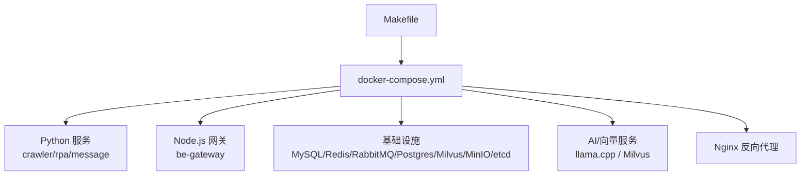
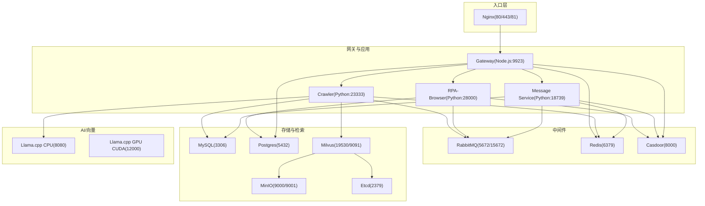
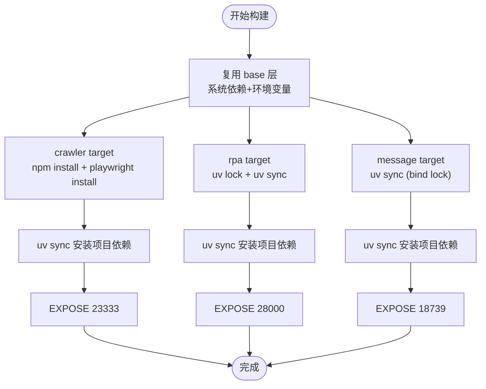
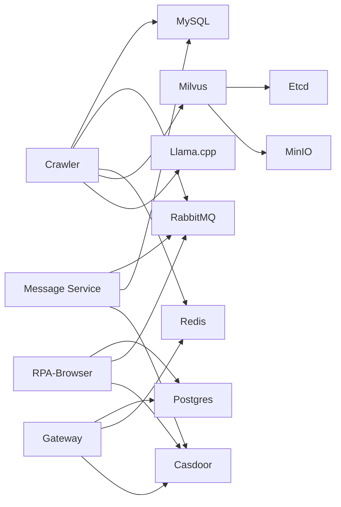
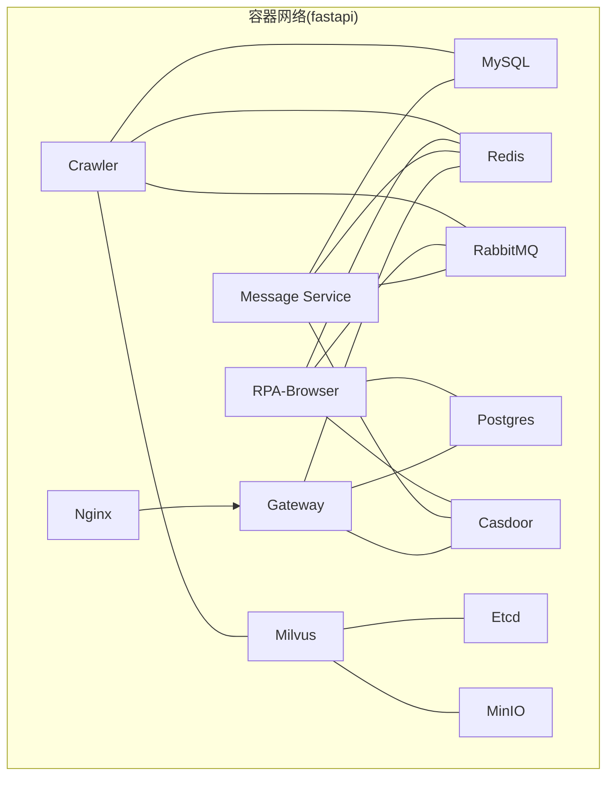

# 容器化架构设计

<cite>
**本文引用的文件**
- [docker-compose.yml](file://docker-compose.yml)
- [Dockerfile.mono](file://Dockerfile.mono)
- [be-gateway/Dockerfile](file://be-gateway/Dockerfile)
- [go-proxy-ipv6-pool-auto/docker-compose.yml](file://go-proxy-ipv6-pool-auto/docker-compose.yml)
- [unidbgSpringBoot/docker-compose.yml](file://unidbgSpringBoot/docker-compose.yml)
- [.github/workflows/docker-publish.yml](file://.github/workflows/docker-publish.yml)
- [Makefile](file://Makefile)
</cite>

## 目录
1. [简介](#简介)
2. [项目结构](#项目结构)
3. [核心组件](#核心组件)
4. [架构总览](#架构总览)
5. [详细组件分析](#详细组件分析)
6. [依赖关系分析](#依赖关系分析)
7. [性能与资源管理](#性能与资源管理)
8. [健康检查、重启策略与日志收集](#健康检查重启策略与日志收集)
9. [网络拓扑与数据持久化](#网络拓扑与数据持久化)
10. [最佳实践与故障排查](#最佳实践与故障排查)
11. [结论](#结论)

## 简介
本文件为 BilibiliExplosion 项目的容器化架构设计文档，围绕 Docker Compose 编排、多阶段镜像构建、服务依赖与网络、数据卷与环境变量管理、资源限制与健康检查、日志收集方案以及部署最佳实践进行系统化说明。目标是帮助读者在不深入代码细节的前提下，理解并掌握该项目的容器化运行方式与运维要点。

## 项目结构
本项目采用“单体仓库 + 多服务”的容器化组织方式：
- 根级 docker-compose.yml 统一编排所有服务（数据库、缓存、消息队列、向量检索、网关、业务服务等）。
- Python 服务通过共享基础镜像的多阶段构建（Dockerfile.mono）产出 crawler、rpa、message 三个目标镜像。
- Node.js 网关服务使用独立 Dockerfile，提供 dev/prod 两个构建目标。
- Go 代理与 Java 服务以独立 compose 或镜像形式集成到整体生态中。
- Makefile 提供常用运维命令（启动、停止、查看日志等）。

**图表来源**
- [docker-compose.yml:1-380](file://docker-compose.yml#L1-L380)
- [Makefile:20-60](file://Makefile#L20-L60)

**章节来源**
- [docker-compose.yml:1-380](file://docker-compose.yml#L1-L380)
- [Makefile:1-71](file://Makefile#L1-L71)

## 核心组件
- 应用服务
  - be-bilibili-crawler：爬虫与数据处理后端（Python FastAPI），依赖 MySQL、Redis、RabbitMQ、Milvus、unidbg、消息服务。
  - rpa-browser：浏览器自动化与 RPA 服务（Python FastAPI），依赖 Postgres、Redis、RabbitMQ、Casdoor。
  - be-message-service：消息推送与通知服务（Python FastAPI），依赖 RabbitMQ、MySQL、Casdoor。
  - gateway：Node.js 网关，聚合路由、鉴权、代理等能力，依赖 Postgres、Redis、Casdoor。
- 基础设施
  - etcd、minio、milvus：向量检索与对象存储。
  - mysql、postgres：结构化数据存储。
  - redis：缓存与会话。
  - rabbitmq：消息队列与 RPC。
  - casdoor：统一认证与授权。
  - nginx：静态资源与反向代理入口。
- AI/向量
  - llama.cpp：本地大模型推理服务（CPU/GPU 两种镜像）。
  - milvus：向量数据库。

**章节来源**
- [docker-compose.yml:1-380](file://docker-compose.yml#L1-L380)

## 架构总览
下图展示了容器间的主要通信路径与数据流向，包括前端入口、网关、各业务服务、消息总线、数据库与向量检索等。

**图表来源**
- [docker-compose.yml:1-380](file://docker-compose.yml#L1-L380)

## 详细组件分析

### 多阶段构建与镜像优化（Python 三服务）
- 共享基础镜像 base：基于 uv 官方 slim 镜像，配置阿里云源、安装公共系统依赖（g++/gcc/make/nodejs/npm/curl/pkg-config/libssl-dev/git 及图形库等），设置环境变量（PYTHONPATH、UV_*、Playwright 跳过下载等）。
- 三目标镜像：
  - crawler：安装 Node 依赖、安装 Playwright chromium、uv sync 安装 Python 依赖，暴露 23333。
  - rpa：生成并锁定依赖、uv sync 安装 Python 依赖，暴露 28000。
  - message：仅依赖绑定安装、拷贝源码后 uv sync，暴露 18739。
- 构建优化点：
  - 使用 --mount=type=cache 缓存 uv 包索引与已安装包，减少重复构建时间。
  - 将 lock 与 pyproject 作为 bind mount 参与构建，源码变更不破坏依赖层缓存。
  - 统一 PYTHONPATH 与 PATH，便于 uvicorn 直接启动。

**图表来源**
- [Dockerfile.mono:1-146](file://Dockerfile.mono#L1-L146)

**章节来源**
- [Dockerfile.mono:1-146](file://Dockerfile.mono#L1-L146)

### Node.js 网关服务构建
- 双阶段构建：dev 与 prod，均使用 node:24-alpine，配置 npm 镜像源，安装依赖后分别执行开发/生产命令。
- 在 docker-compose 中通过 build.target=prod 指定生产镜像。

**章节来源**
- [be-gateway/Dockerfile:1-26](file://be-gateway/Dockerfile#L1-L26)
- [docker-compose.yml:179-212](file://docker-compose.yml#L179-L212)

### Go 代理与 Java 服务集成
- Go 代理：独立 compose 定义，启用 IPv6 网段，暴露 3128。
- Java 服务（unidbg）：通过外部镜像 fastapi-unidbg 接入主 compose，暴露 23335。

**章节来源**
- [go-proxy-ipv6-pool-auto/docker-compose.yml:1-19](file://go-proxy-ipv6-pool-auto/docker-compose.yml#L1-L19)
- [docker-compose.yml:110-119](file://docker-compose.yml#L110-L119)
- [unidbgSpringBoot/docker-compose.yml:1-6](file://unidbgSpringBoot/docker-compose.yml#L1-L6)

### 服务依赖与启动顺序
- 关键依赖链：
  - crawler → mysql, redis, rabbitmq, unidbg, milvus, message-service
  - rpa-browser → postgres, redis, rabbitmq, casdoor
  - message-service → rabbitmq, mysql, casdoor
  - gateway → postgres, redis, casdoor
- 通过 depends_on 声明启动顺序；部分服务具备 healthcheck，确保就绪后再被依赖。

**章节来源**
- [docker-compose.yml:120-164](file://docker-compose.yml#L120-L164)
- [docker-compose.yml:227-309](file://docker-compose.yml#L227-L309)
- [docker-compose.yml:179-212](file://docker-compose.yml#L179-L212)

### 环境变量与配置管理
- 集中式环境变量：通过 ${VAR} 占位符注入（如 MYSQL_PASSWORD、ENV_TZ、RABBITMQ_USER 等），便于不同环境切换。
- 服务内配置：
  - 数据库连接串（mysql+aiomysql/postgresql+asyncpg）
  - 消息队列 URL（amqp://...）
  - 第三方服务地址（CASDOOR_ENDPOINT、MESSAGE_SERVICE_URI、BILI_CRAWLER_URI 等）
  - 功能开关与日志等级（SHOW_LOG、LOG_LEVEL、IS_DEV）
- 注意：敏感信息建议通过 .env 或密钥管理服务注入，避免硬编码。

**章节来源**
- [docker-compose.yml:68-119](file://docker-compose.yml#L68-L119)
- [docker-compose.yml:131-164](file://docker-compose.yml#L131-L164)
- [docker-compose.yml:194-212](file://docker-compose.yml#L194-L212)
- [docker-compose.yml:246-307](file://docker-compose.yml#L246-L307)

## 依赖关系分析
- 耦合度：
  - 应用服务与中间件（MySQL/Redis/RabbitMQ）强耦合，需保证中间件可用。
  - 向量检索链路（Milvus→etcd/minio）解耦良好，可通过健康检查保障。
- 间接依赖：
  - Nginx 仅作为入口，对上游服务无直接依赖。
  - LLM 服务可插拔，通过环境变量切换 CPU/GPU 实例。

**图表来源**
- [docker-compose.yml:1-380](file://docker-compose.yml#L1-L380)

**章节来源**
- [docker-compose.yml:1-380](file://docker-compose.yml#L1-L380)

## 性能与资源管理
- 内存限制：
  - crawler 显式设置 memory limit 5G，避免占用过多宿主内存。
- CPU 配额：
  - 当前未显式设置 CPU 配额，可在生产环境按服务重要性添加 cpus 限制。
- 存储分配：
  - 数据卷挂载至 docker_vol 下对应目录，便于备份与扩容。
  - 命名卷用于 node_modules 与 Chrome 应用缓存，避免覆盖源码。
- 构建缓存：
  - 使用 uv 缓存与 npm 缓存加速构建；GitHub Actions 中使用 GHCR 缓存。

**章节来源**
- [docker-compose.yml:120-164](file://docker-compose.yml#L120-L164)
- [docker-compose.yml:179-212](file://docker-compose.yml#L179-L212)
- [docker-compose.yml:372-380](file://docker-compose.yml#L372-L380)
- [.github/workflows/docker-publish.yml:52-61](file://.github/workflows/docker-publish.yml#L52-L61)

## 健康检查、重启策略与日志收集
- 健康检查：
  - etcd：etcdctl endpoint health
  - minio：HTTP 健康端点
  - milvus：HTTP 健康端点
  - message-service：自定义 /health 校验 broker 连通性
- 重启策略：
  - 多数服务使用 restart: unless-stopped，保证异常退出时自动恢复。
- 日志收集：
  - 各服务默认输出到容器 stdout/stderr，可通过 docker-compose logs 查看。
  - 部分服务挂载日志目录（如 nginx、rabbitmq），便于集中采集与分析。
  - 可结合 goaccess 镜像对 Nginx 访问日志进行分析（见 docker_vol/goaccess）。

**章节来源**
- [docker-compose.yml:14-18](file://docker-compose.yml#L14-L18)
- [docker-compose.yml:34-38](file://docker-compose.yml#L34-L38)
- [docker-compose.yml:54-59](file://docker-compose.yml#L54-L59)
- [docker-compose.yml:310-322](file://docker-compose.yml#L310-L322)
- [docker-compose.yml:357-371](file://docker-compose.yml#L357-L371)
- [docker_vol/goaccess/Dockerfile:1-5](file://docker_vol/goaccess/Dockerfile#L1-L5)

## 网络拓扑与数据持久化
- 网络：
  - 默认 bridge 网络，名称 fastapi，启用 IPv6。
  - 通过 extra_hosts 将 host.docker.internal 映射到宿主机网关，便于容器访问宿主机服务。
- 端口映射：
  - 对外暴露 Nginx(80/443/81)、各服务端口（由环境变量控制），便于开发与调试。
- 数据持久化：
  - MySQL/Postgres/Redis/RabbitMQ/Milvus/MinIO 等数据目录均挂载至 docker_vol 下对应路径。
  - 命名卷 be-gateway_node_modules 与 rpa_browser_chrome 用于隔离易变数据。

**图表来源**
- [docker-compose.yml:372-380](file://docker-compose.yml#L372-L380)
- [docker-compose.yml:1-380](file://docker-compose.yml#L1-L380)

**章节来源**
- [docker-compose.yml:1-380](file://docker-compose.yml#L1-L380)

## 最佳实践与故障排查
- 最佳实践
  - 使用多阶段构建与只读基础镜像，减小镜像体积并提升安全性。
  - 通过环境变量集中管理配置，避免硬编码；敏感信息使用密钥管理。
  - 为关键服务配置健康检查与重启策略，提高可用性。
  - 使用命名卷与数据目录挂载，确保数据持久化与迁移便利。
  - 利用 Makefile 统一运维操作，降低误操作风险。
- 故障排查
  - 服务无法启动：检查 depends_on 与 healthcheck；确认环境变量与端口冲突。
  - 数据库连接失败：验证连接串、用户名密码、网络可达性与权限。
  - 消息队列问题：查看 RabbitMQ 日志与队列状态，确认用户与权限。
  - 向量检索异常：检查 etcd/minio 健康状态与 Milvus 日志。
  - 日志定位：使用 docker-compose logs -f <service> 实时查看；结合挂载日志目录分析。

**章节来源**
- [Makefile:20-60](file://Makefile#L20-L60)
- [docker-compose.yml:1-380](file://docker-compose.yml#L1-L380)

## 结论
本项目通过统一的 Docker Compose 编排与多阶段镜像构建，实现了 Python、Node.js、Go、Java 等多语言服务的容器化协同。借助健康检查、资源限制与数据卷持久化，系统在可维护性与稳定性方面具备良好基础。建议在后续迭代中进一步完善 CPU 配额、日志集中化与监控告警体系，以提升生产环境的可观测性与弹性伸缩能力。