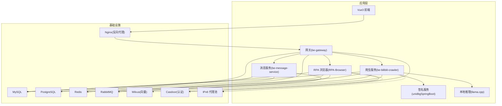
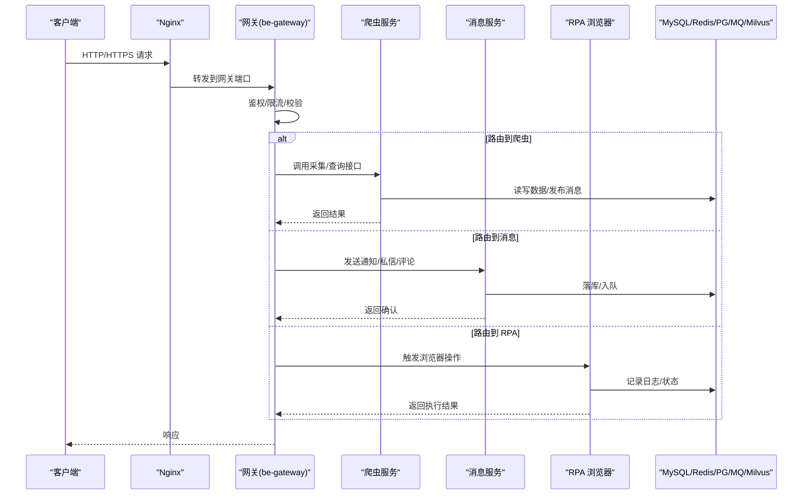
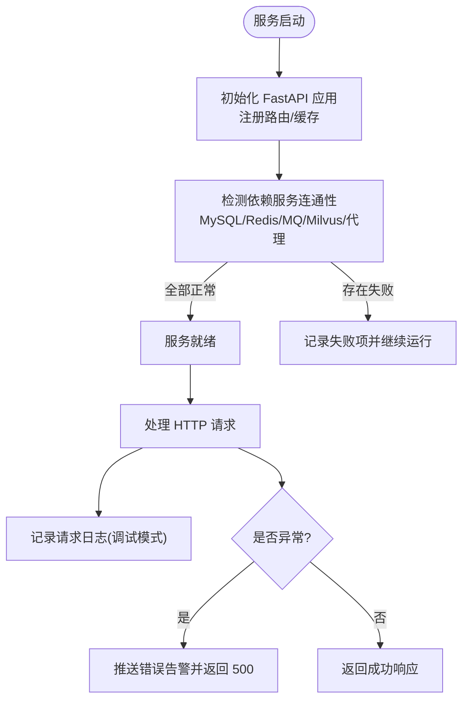
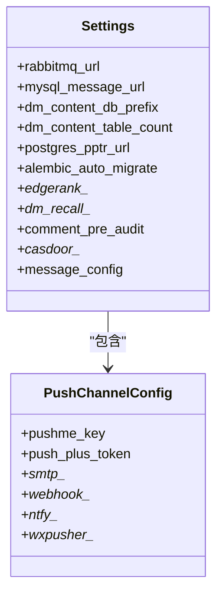
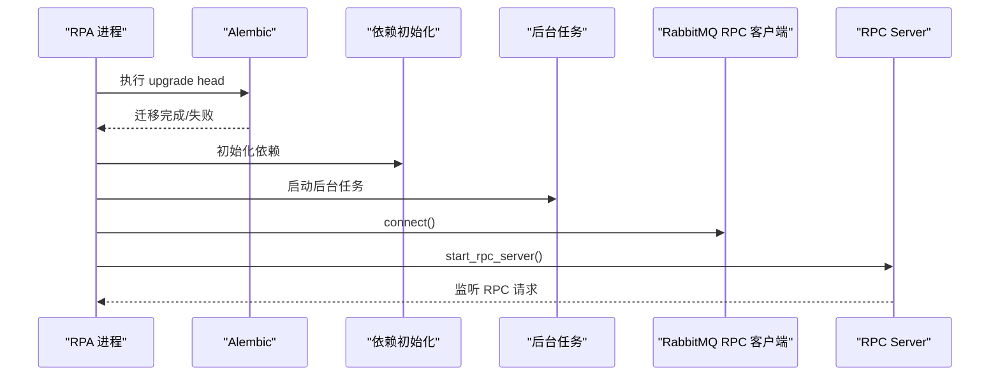
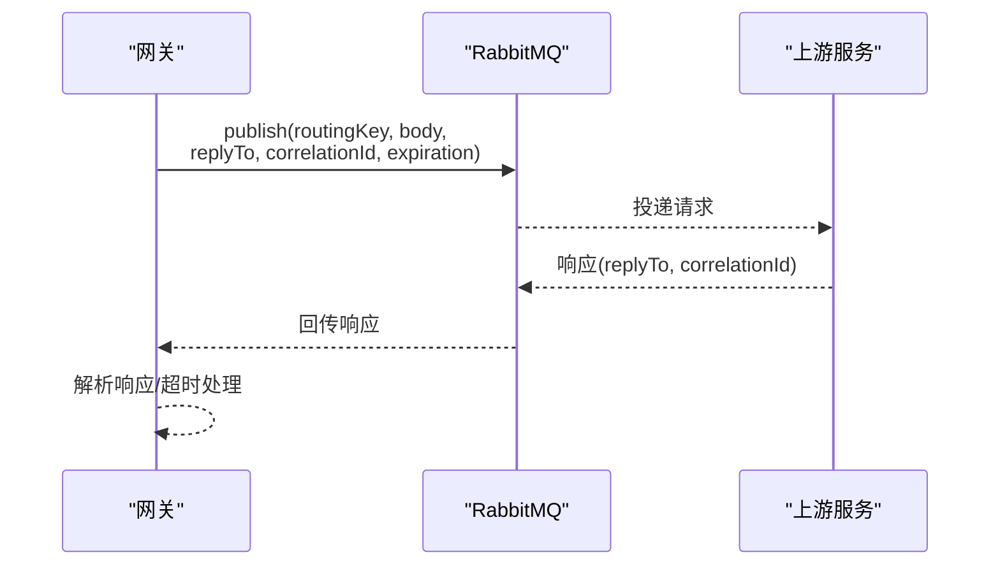
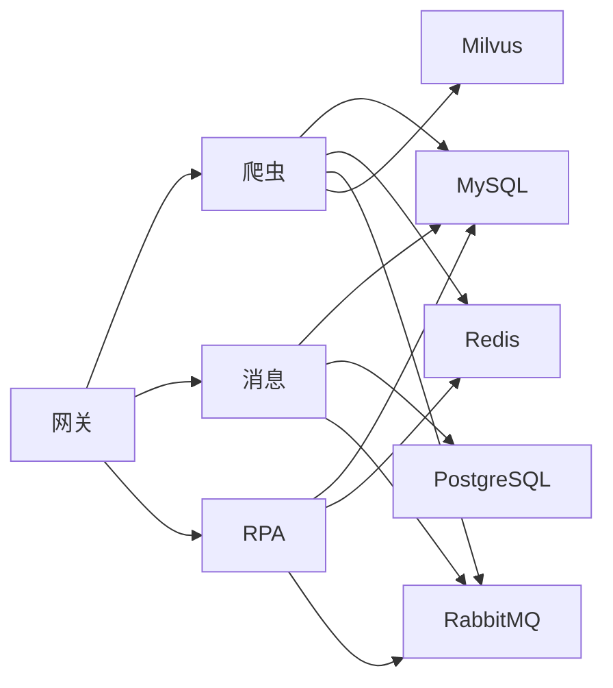

# 微服务架构设计

<cite>
**本文引用的文件**
- [docker-compose.yml](file://docker-compose.yml)
- [README.md](file://README.md)
- [be-bilibili-crawler/main.py](file://be-bilibili-crawler/main.py)
- [be-bilibili-crawler/CONFIG.py](file://be-bilibili-crawler/CONFIG.py)
- [RPA-Browser/main.py](file://RPA-Browser/main.py)
- [RPA-Browser/app/config.py](file://RPA-Browser/app/config.py)
- [be-message-service/app/core/config.py](file://be-message-service/app/core/config.py)
- [be-gateway/package.json](file://be-gateway/package.json)
- [be-gateway/ExpressServerEnd/Service/upstream_health_module/upstream_health_service.js](file://be-gateway/ExpressServerEnd/Service/upstream_health_module/upstream_health_service.js)
- [be-gateway/ExpressServerEnd/Service/mq/rpc_client.js](file://be-gateway/ExpressServerEnd/Service/mq/rpc_client.js)
- [RPA-Browser/app/services/mq/rpc_client.py](file://RPA-Browser/app/services/mq/rpc_client.py)
- [be-bilibili-crawler/Utils/FastAPI/FastapiLifespan.py](file://be-bilibili-crawler/Utils/FastAPI/FastapiLifespan.py)
</cite>

## 目录
1. [引言](#引言)
2. [项目结构](#项目结构)
3. [核心组件](#核心组件)
4. [架构总览](#架构总览)
5. [详细组件分析](#详细组件分析)
6. [依赖关系分析](#依赖关系分析)
7. [性能与扩展性](#性能与扩展性)
8. [故障排查指南](#故障排查指南)
9. [结论](#结论)
10. [附录](#附录)

## 引言
本设计文档面向 BilibiliExplosion 项目的微服务拆分与部署，聚焦爬虫服务、消息服务、RPA 浏览器服务、API 网关的职责边界、独立部署策略、资源隔离、容器编排（Docker Compose）、服务发现与健康检查、负载均衡与生命周期管理。文档基于仓库中的 docker-compose 编排、各服务入口与配置、以及网关健康检查与 RPC 客户端实现进行系统化梳理，并提供架构图、数据流图与排障建议，帮助读者快速理解并运维该系统。

## 项目结构
本项目采用多语言微服务聚合：
- be-bilibili-crawler：Python/FastAPI 爬虫后端与数据 API
- be-message-service：Python/FastAPI + FastStream 统一消息推送
- RPA-Browser：Python/FastAPI + Playwright 浏览器自动化服务
- be-gateway：Node.js/Express 前端网关与账号/抽奖后端
- unidbgSpringBoot：Java/Spring Boot 签名计算服务
- go-proxy-ipv6-pool-auto：Go 自动 IPv6 代理池
- bili-common：Python 公共库（被多个 Python 服务复用）
- 中间件：MySQL、Redis、PostgreSQL、RabbitMQ、Milvus、etcd、MinIO、Nginx、Casdoor、llama.cpp

图表来源
- [docker-compose.yml:120-310](file://docker-compose.yml#L120-L310)
- [README.md:14-34](file://README.md#L14-L34)

章节来源
- [README.md:1-52](file://README.md#L1-L52)
- [docker-compose.yml:1-380](file://docker-compose.yml#L1-L380)

## 核心组件
- 爬虫服务（be-bilibili-crawler）
  - 职责：B站及第三方数据采集、数据处理、统计、验证码、后台任务、向量检索、消息发布等
  - 关键入口：FastAPI 启动、路由注册、全局异常处理、缓存初始化
  - 依赖：MySQL、Redis、RabbitMQ、Milvus、unidbg、llama.cpp、外部代理
- 消息服务（be-message-service）
  - 职责：统一消息推送、系统通知、事件提醒、私信索引与会话、消息设置、EdgeRank 推荐排序、评论审核等
  - 关键配置：RabbitMQ、MySQL（主库+私信内容分库分表）、PPTR Postgres（只读/接管）、Alembic 迁移、GeoIP、JWT/Casdoor
- RPA 浏览器服务（RPA-Browser）
  - 职责：浏览器自动化、工作流执行、页面交互、截图/录制、RPC 调用上游业务方法、资源详情获取
  - 关键流程：启动时执行 Alembic 迁移、初始化依赖、启动后台任务、连接 RabbitMQ RPC、启动 RPC Server
- API 网关（be-gateway）
  - 职责：统一入口、鉴权（Casdoor）、限流、请求转发、队列管理、上游服务健康检查、部分业务逻辑
  - 依赖：PostgreSQL、Redis、RabbitMQ、Casdoor、上游服务 URI（爬虫/RPA/消息）

章节来源
- [be-bilibili-crawler/main.py:48-60](file://be-bilibili-crawler/main.py#L48-L60)
- [be-message-service/app/core/config.py:19-79](file://be-message-service/app/core/config.py#L19-L79)
- [RPA-Browser/main.py:36-63](file://RPA-Browser/main.py#L36-L63)
- [be-gateway/package.json:20-62](file://be-gateway/package.json#L20-L62)

## 架构总览
整体采用“网关 + 多微服务 + 中间件”的解耦架构：
- 网关负责鉴权、限流、路由转发与上游健康检查
- 爬虫服务专注数据采集与处理，通过消息与存储完成异步化与持久化
- 消息服务作为统一消息中心，提供推送、通知、私信、评论、推荐等能力
- RPA 浏览器服务提供浏览器自动化能力，并通过 RPC 与爬虫服务协作
- 中间件包括 MySQL、Redis、PostgreSQL、RabbitMQ、Milvus、etcd、MinIO、Casdoor、Nginx、llama.cpp

图表来源
- [docker-compose.yml:179-212](file://docker-compose.yml#L179-L212)
- [docker-compose.yml:120-164](file://docker-compose.yml#L120-L164)
- [docker-compose.yml:227-260](file://docker-compose.yml#L227-L260)
- [docker-compose.yml:261-322](file://docker-compose.yml#L261-L322)

## 详细组件分析

### 爬虫服务（be-bilibili-crawler）
- 启动与路由
  - FastAPI 应用创建、CDN 文档补丁、路由挂载、内存缓存初始化
  - 全局中间件记录请求耗时、IP、路径、状态码与响应体（调试模式）
  - 全局异常处理器捕获异常、记录日志并推送告警
- 配置与依赖
  - 集中式 Settings：数据库、Redis、RabbitMQ、Unidbg、Milvus、Message Service、LLM、代理等
  - 推送渠道配置模型与解析，支持 JSON 环境变量注入
  - 连接池与爬虫专用连接池隔离，避免高并发影响业务
- 健康检查与连通性测试
  - 启动阶段检测各服务端口/HTTP 端点连通性
  - 实际通过代理发起请求验证出口 IPv6 是否可用

图表来源
- [be-bilibili-crawler/main.py:48-112](file://be-bilibili-crawler/main.py#L48-L112)
- [be-bilibili-crawler/Utils/FastAPI/FastapiLifespan.py:156-240](file://be-bilibili-crawler/Utils/FastAPI/FastapiLifespan.py#L156-L240)
- [be-bilibili-crawler/CONFIG.py:225-277](file://be-bilibili-crawler/CONFIG.py#L225-L277)

章节来源
- [be-bilibili-crawler/main.py:1-119](file://be-bilibili-crawler/main.py#L1-L119)
- [be-bilibili-crawler/CONFIG.py:14-277](file://be-bilibili-crawler/CONFIG.py#L14-L277)
- [be-bilibili-crawler/Utils/FastAPI/FastapiLifespan.py:156-240](file://be-bilibili-crawler/Utils/FastAPI/FastapiLifespan.py#L156-L240)

### 消息服务（be-message-service）
- 配置与数据模型
  - RabbitMQ 连接与日志级别、业务日志等级、运行环境
  - MySQL 主库与私信内容分库分表（按月分库、库内 100 张表）
  - PPTR Postgres 直连（只读/接管），Alembic 自动迁移
  - GeoIP 属地库、EdgeRank 推荐权重与召回策略、私信策略、评论审核阈值
  - JWT/Casdoor 集成、管理员 token 获取、证书换行符处理
- 健康检查
  - /health 端点同时校验 broker 连通性，未连接返回 503
  - Docker Compose healthcheck 探测该端点

图表来源
- [be-message-service/app/core/config.py:1-375](file://be-message-service/app/core/config.py#L1-L375)

章节来源
- [be-message-service/app/core/config.py:19-375](file://be-message-service/app/core/config.py#L19-L375)
- [docker-compose.yml:261-322](file://docker-compose.yml#L261-L322)

### RPA 浏览器服务（RPA-Browser）
- 启动流程
  - Windows 事件循环适配
  - 启动时执行 Alembic 迁移并校验 Schema
  - 初始化依赖、启动后台任务
  - 连接 RabbitMQ RPC 客户端、启动 RPC Server
- 配置要点
  - 浏览器会话清理策略、页面数量限制、WebRTC 空闲超时
  - 工作流嵌套深度限制、动作日志采集与保留策略
  - 全局推送渠道配置兜底、服务器标识、代理地址
  - RabbitMQ URL（heartbeat=180）用于 HTTP Action 调用上游业务方法

图表来源
- [RPA-Browser/main.py:36-63](file://RPA-Browser/main.py#L36-L63)
- [RPA-Browser/app/config.py:140-215](file://RPA-Browser/app/config.py#L140-L215)
- [RPA-Browser/app/services/mq/rpc_client.py:1-24](file://RPA-Browser/app/services/mq/rpc_client.py#L1-L24)

章节来源
- [RPA-Browser/main.py:1-83](file://RPA-Browser/main.py#L1-L83)
- [RPA-Browser/app/config.py:13-215](file://RPA-Browser/app/config.py#L13-L215)
- [RPA-Browser/app/services/mq/rpc_client.py:1-24](file://RPA-Browser/app/services/mq/rpc_client.py#L1-L24)

### API 网关（be-gateway）
- 角色与职责
  - 统一入口、鉴权（Casdoor）、限流、请求转发、队列管理
  - 上游服务健康检查、日志与监控
- 健康检查机制
  - 对上游代理服务进行批量健康检查，输出每个目标的状态、耗时、路由信息
  - 汇总不可用数量，便于运维定位
- RPC 客户端
  - 使用 amqplib 向 RabbitMQ 发布请求消息，设置 replyTo、correlationId、expiration
  - 等待响应或超时，封装 RpcTimeoutError/RpcTransportError

图表来源
- [be-gateway/ExpressServerEnd/Service/mq/rpc_client.js:142-164](file://be-gateway/ExpressServerEnd/Service/mq/rpc_client.js#L142-L164)
- [be-gateway/ExpressServerEnd/Service/upstream_health_module/upstream_health_service.js:93-124](file://be-gateway/ExpressServerEnd/Service/upstream_health_module/upstream_health_service.js#L93-L124)

章节来源
- [be-gateway/package.json:20-62](file://be-gateway/package.json#L20-L62)
- [be-gateway/ExpressServerEnd/Service/upstream_health_module/upstream_health_service.js:93-124](file://be-gateway/ExpressServerEnd/Service/upstream_health_module/upstream_health_service.js#L93-L124)
- [be-gateway/ExpressServerEnd/Service/mq/rpc_client.js:142-164](file://be-gateway/ExpressServerEnd/Service/mq/rpc_client.js#L142-L164)

## 依赖关系分析
- 服务间依赖
  - 网关依赖：PostgreSQL、Redis、Casdoor、上游服务 URI（爬虫/RPA/消息）
  - 爬虫依赖：MySQL、Redis、RabbitMQ、Milvus、Unidbg、llama.cpp、代理
  - 消息服务依赖：RabbitMQ、MySQL（主库+私信内容分库）、PPTR Postgres、Casdoor
  - RPA 依赖：MySQL、Redis、RabbitMQ、Casdoor、上游 RPC（爬虫）
- 容器编排与资源隔离
  - 通过 docker-compose 定义服务、端口映射、环境变量、卷挂载、健康检查、depends_on
  - 爬虫服务设置内存限制（5G），其他服务按需要调整
  - 命名卷保存 node_modules、Chrome 应用等运行时数据
- 服务发现与负载均衡
  - 容器网络内通过服务名（如 rabbitmq、mysql、be-message-service）进行服务发现
  - 网关通过配置的上游 URI 直接访问；如需水平扩展可在网关层做轮询/加权策略

图表来源
- [docker-compose.yml:120-322](file://docker-compose.yml#L120-L322)

章节来源
- [docker-compose.yml:120-322](file://docker-compose.yml#L120-L322)

## 性能与扩展性
- 连接池与资源隔离
  - 爬虫服务区分业务与爬虫专用连接池，避免高并发采集阻塞业务请求
  - 消息服务对 MySQL/PG 连接池大小与溢出进行限制，防止打满数据库
- 异步与消息驱动
  - 使用 RabbitMQ 进行异步解耦，提升吞吐与容错
  - 消息服务支持定时任务与批量处理（如已投递标记、活跃度判定）
- 推荐算法与召回
  - EdgeRank 多维度打分与多路召回，兼顾热门、社交、话题、地理、协同过滤
  - 匿名随机扰动与个性化因子增强体验
- 可扩展性建议
  - 网关层增加负载均衡与熔断降级
  - 爬虫与 RPA 服务水平扩展，结合队列分区与消费者组
  - 数据库读写分离与分库分表策略完善（私信内容已按月分库分表）

[本节为通用指导，不直接分析具体文件]

## 故障排查指南
- 健康检查
  - 消息服务 /health 端点：若 Broker 未连接返回 503，可通过 Docker healthcheck 探测
  - 网关上游健康检查：批量检测上游服务可用性，输出不可用原因与路由
- 连通性测试
  - 爬虫服务启动阶段检测各服务端口/HTTP 端点连通性
  - 通过代理实际请求验证 IPv6 出口是否正常
- 常见错误
  - Milvus 无法读写：检查数据卷权限（chown 999:999）
  - WSL2 网络问题：重启 winnat
  - 数据库连接过多：检查连接池配置上限（消息服务内置保护）

章节来源
- [docker-compose.yml:310-322](file://docker-compose.yml#L310-L322)
- [be-gateway/ExpressServerEnd/Service/upstream_health_module/upstream_health_service.js:93-124](file://be-gateway/ExpressServerEnd/Service/upstream_health_module/upstream_health_service.js#L93-L124)
- [be-bilibili-crawler/Utils/FastAPI/FastapiLifespan.py:156-240](file://be-bilibili-crawler/Utils/FastAPI/FastapiLifespan.py#L156-L240)
- [README.md:116-121](file://README.md#L116-L121)

## 结论
BilibiliExplosion 采用清晰的微服务拆分与容器编排，实现了爬虫、消息、RPA 浏览器与网关的职责解耦。通过 RabbitMQ 异步化、MySQL/PG/Redis/Milvus 等多存储支撑、Casdoor 统一鉴权与 Nginx 反向代理，系统在可维护性与扩展性方面具备良好基础。建议在网关层引入更完善的负载均衡与熔断策略，并在爬虫与 RPA 侧加强水平扩展与资源隔离，进一步提升稳定性与吞吐能力。

[本节为总结，不直接分析具体文件]

## 附录
- 部署命令
  - 本地启动 IPv6 代理池：pm2 start pm2.app.js
  - Docker 一键部署：docker compose up -d
- 版本与依赖
  - Python uv 管理依赖、npm 管理 Node 依赖、Maven 管理 Java 构建
  - 多阶段镜像构建（Dockerfile.mono）支持 crawler/rpa/message 目标

章节来源
- [README.md:71-110](file://README.md#L71-L110)
- [docker-compose.yml:152-164](file://docker-compose.yml#L152-L164)