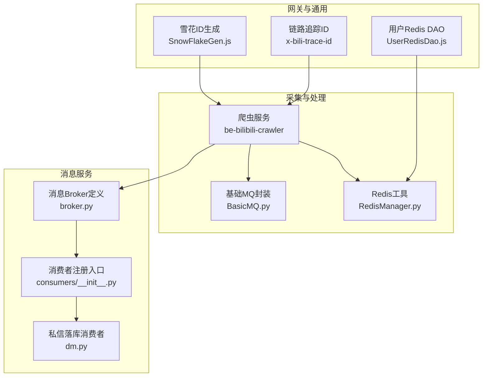
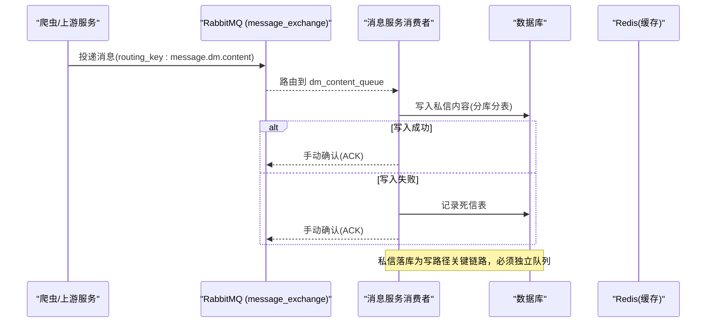
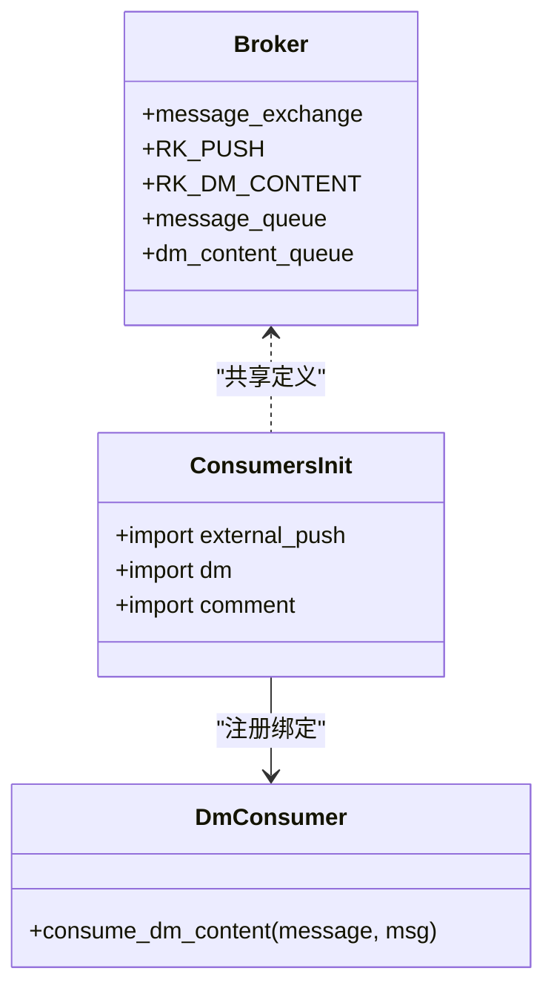
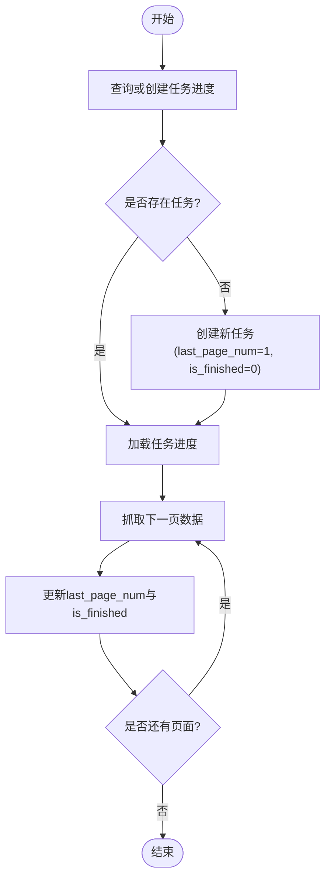
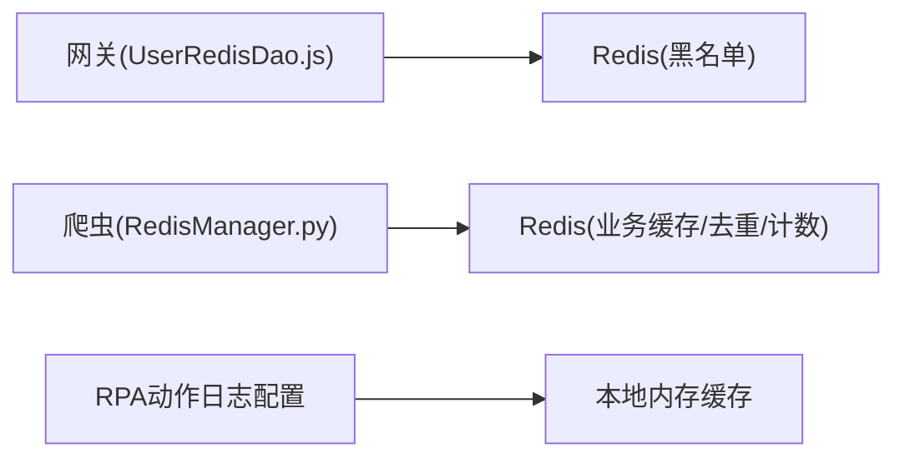
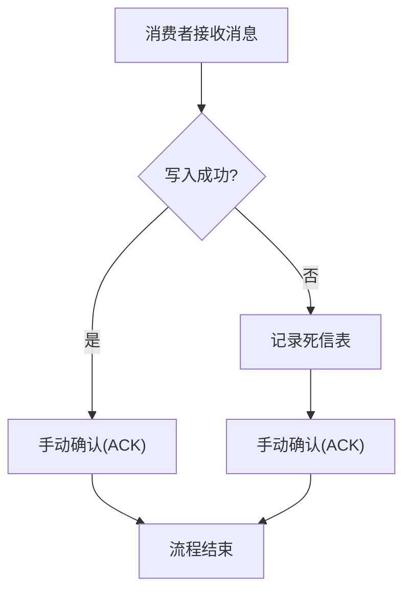
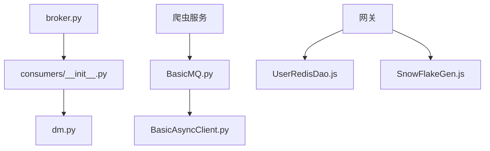

# 数据流设计

<cite>
**本文引用的文件**
- [broker.py](file://be-message-service/app/core/broker.py)
- [consumers/__init__.py](file://be-message-service/app/mq/consumers/__init__.py)
- [dm.py](file://be-message-service/app/mq/consumers/dm.py)
- [RedisManager.py](file://be-bilibili-crawler/Utils/redisTool/RedisManager.py)
- [UserRedisDao.js](file://be-gateway/ExpressServerEnd/DAO/UserRedisDao.js)
- [SnowFlakeGen.js](file://be-gateway/ExpressServerEnd/Tool/SnowFlakeGen.js)
- [GrpcProto/readme.md](file://be-bilibili-crawler/Service/GrpcModule/Grpc/GrpcProto/readme.md)
- [BasicMQ.py](file://be-bilibili-crawler/Service/MQ/base/BasicMQ.py)
- [BasicAsyncClient.py](file://be-bilibili-crawler/Service/MQ/base/BasicAsyncClient.py)
- [SqlHelper.py](file://be-bilibili-crawler/Service/samsclub/Sql/SqlHelper.py)
- [models.py](file://be-bilibili-crawler/Service/samsclub/Sql/models.py)
- [alembic_manager.py](file://be-bilibili-crawler/Utils/FastAPI/alembic_manager.py)
- [action_logger.py](file://RPA-Browser/app/services/execution/action_logger.py)
</cite>

## 目录
1. [引言](#引言)
2. [项目结构](#项目结构)
3. [核心组件](#核心组件)
4. [架构总览](#架构总览)
5. [详细组件分析](#详细组件分析)
6. [依赖关系分析](#依赖关系分析)
7. [性能考量](#性能考量)
8. [故障排查指南](#故障排查指南)
9. [结论](#结论)
10. [附录](#附录)

## 引言
本文件面向 BilibiliExplosion 项目的“数据采集到存储”的完整数据流，覆盖爬虫采集、消息驱动异步处理、清洗转换与持久化、一致性保障、缓存策略、监控追踪以及备份恢复等关键主题。文档以仓库现有实现为依据，给出端到端的数据流转视图、关键路径时序图、类/模块关系图与流程图，帮助读者快速理解并优化系统。

## 项目结构
本项目由多个子系统协作完成：
- be-bilibili-crawler：爬虫与数据处理服务，负责抓取、解析、清洗、入库及与消息中间件交互。
- be-message-service：消息服务，基于 FastStream/RabbitMQ 提供统一的消息路由与消费者，承担站内信、私信内容落库、评论审核/计数/通知、用户注销、浏览统计等异步任务。
- be-gateway：网关与前端支撑服务，包含鉴权黑名单缓存、雪花ID生成等能力。
- RPA-Browser：浏览器自动化与执行引擎，提供动作日志配置与缓存机制。
- Vue3FrontEndDemoExercise：前端展示层（与本数据流文档关联度较低）。

图表来源
- [broker.py:1-125](file://be-message-service/app/core/broker.py#L1-L125)
- [consumers/__init__.py:1-28](file://be-message-service/app/mq/consumers/__init__.py#L1-L28)
- [dm.py:1-25](file://be-message-service/app/mq/consumers/dm.py#L1-L25)
- [RedisManager.py:1-682](file://be-bilibili-crawler/Utils/redisTool/RedisManager.py#L1-L682)
- [UserRedisDao.js:1-27](file://be-gateway/ExpressServerEnd/DAO/UserRedisDao.js#L1-L27)
- [SnowFlakeGen.js:36-132](file://be-gateway/ExpressServerEnd/Tool/SnowFlakeGen.js#L36-L132)
- [GrpcProto/readme.md:106-148](file://be-bilibili-crawler/Service/GrpcModule/Grpc/GrpcProto/readme.md#L106-L148)

章节来源
- [broker.py:1-125](file://be-message-service/app/core/broker.py#L1-L125)
- [consumers/__init__.py:1-28](file://be-message-service/app/mq/consumers/__init__.py#L1-L28)
- [dm.py:1-25](file://be-message-service/app/mq/consumers/dm.py#L1-L25)
- [RedisManager.py:1-682](file://be-bilibili-crawler/Utils/redisTool/RedisManager.py#L1-L682)
- [UserRedisDao.js:1-27](file://be-gateway/ExpressServerEnd/DAO/UserRedisDao.js#L1-L27)
- [SnowFlakeGen.js:36-132](file://be-gateway/ExpressServerEnd/Tool/SnowFlakeGen.js#L36-L132)
- [GrpcProto/readme.md:106-148](file://be-bilibili-crawler/Service/GrpcModule/Grpc/GrpcProto/readme.md#L106-L148)

## 核心组件
- 消息路由与队列定义：统一在 broker.py 中声明 TOPIC exchange 与各 routing_key 对应的独立队列，确保推送、私信内容、评论审核/计数/通知、用户注销、浏览统计等解耦。
- 消费者注册与处理：consumers/__init__.py 集中注册各消费者；dm.py 作为私信内容落库的关键消费者，采用手动确认（MANUAL ack）策略，失败写入转死信表后确认，避免坏消息无限重试。
- Redis 工具与缓存：RedisManager.py 提供连接池、批量操作、扫描迭代、去重集合、有序集合等能力，并内置重试与超时控制；UserRedisDao.js 用于网关侧 JWT 黑名单缓存。
- 爬虫任务进度与持久化：samsclub SqlHelper.py 与 models.py 定义了任务进度模型与查询/更新逻辑，支持重置未完成任务、获取未完成任务等。
- 链路追踪与ID：GrpcProto/readme.md 定义了 x-bili-trace-id 生成算法；SnowFlakeGen.js 提供分布式唯一ID生成。

章节来源
- [broker.py:1-125](file://be-message-service/app/core/broker.py#L1-L125)
- [consumers/__init__.py:1-28](file://be-message-service/app/mq/consumers/__init__.py#L1-L28)
- [dm.py:1-25](file://be-message-service/app/mq/consumers/dm.py#L1-L25)
- [RedisManager.py:1-682](file://be-bilibili-crawler/Utils/redisTool/RedisManager.py#L1-L682)
- [UserRedisDao.js:1-27](file://be-gateway/ExpressServerEnd/DAO/UserRedisDao.js#L1-L27)
- [SqlHelper.py:220-350](file://be-bilibili-crawler/Service/samsclub/Sql/SqlHelper.py#L220-L350)
- [models.py:1-30](file://be-bilibili-crawler/Service/samsclub/Sql/models.py#L1-L30)
- [GrpcProto/readme.md:106-148](file://be-bilibili-crawler/Service/GrpcModule/Grpc/GrpcProto/readme.md#L106-L148)
- [SnowFlakeGen.js:36-132](file://be-gateway/ExpressServerEnd/Tool/SnowFlakeGen.js#L36-L132)

## 架构总览
数据流从爬虫采集开始，经过清洗与转换，通过消息中间件进行异步解耦，再由消息服务消费者将数据持久化至数据库或缓存。关键特性包括：
- 生产者-消费者模式：爬虫或服务端接口作为生产者，消息服务消费者作为消费者，按 routing_key 路由到独立队列。
- 批量与削峰：Redis 有序集合与集合用于去重与计数；消息队列缓冲突发流量。
- 一致性保障：手动确认（MANUAL ack）、失败转死信表、数据库事务与迁移校验。
- 多级缓存：网关 JWT 黑名单、Redis 热点数据缓存、本地内存缓存（如动作日志配置）。
- 监控追踪：x-bili-trace-id 贯穿调用链，便于全链路追踪与问题定位。

图表来源
- [broker.py:1-125](file://be-message-service/app/core/broker.py#L1-L125)
- [dm.py:1-25](file://be-message-service/app/mq/consumers/dm.py#L1-L25)

章节来源
- [broker.py:1-125](file://be-message-service/app/core/broker.py#L1-L125)
- [dm.py:1-25](file://be-message-service/app/mq/consumers/dm.py#L1-L25)

## 详细组件分析

### 消息路由与消费者（私信内容落库）
- 路由定义：broker.py 统一声明 message_exchange（TOPIC）与各 routing_key 对应队列，确保私信内容、外部推送、评论相关任务物理隔离。
- 消费者注册：consumers/__init__.py 集中导入各消费者模块，触发副作用式注册。
- 私信落库：dm.py 使用 MANUAL ack，成功写入分片后确认，失败则记录死信表后确认，避免阻塞与重复消费。

图表来源
- [broker.py:1-125](file://be-message-service/app/core/broker.py#L1-L125)
- [consumers/__init__.py:1-28](file://be-message-service/app/mq/consumers/__init__.py#L1-L28)
- [dm.py:1-25](file://be-message-service/app/mq/consumers/dm.py#L1-L25)

章节来源
- [broker.py:1-125](file://be-message-service/app/core/broker.py#L1-L125)
- [consumers/__init__.py:1-28](file://be-message-service/app/mq/consumers/__init__.py#L1-L28)
- [dm.py:1-25](file://be-message-service/app/mq/consumers/dm.py#L1-L25)

### 爬虫任务进度与持久化
- 任务进度模型：models.py 定义 crawl_task_progress 表结构，包含分类ID、页码、完成状态、时间戳等字段。
- 任务管理：SqlHelper.py 提供重置已完成任务、查询未完成任务、创建或获取任务进度等方法，保证任务可恢复与幂等。

图表来源
- [models.py:1-30](file://be-bilibili-crawler/Service/samsclub/Sql/models.py#L1-L30)
- [SqlHelper.py:220-350](file://be-bilibili-crawler/Service/samsclub/Sql/SqlHelper.py#L220-L350)

章节来源
- [models.py:1-30](file://be-bilibili-crawler/Service/samsclub/Sql/models.py#L1-L30)
- [SqlHelper.py:220-350](file://be-bilibili-crawler/Service/samsclub/Sql/SqlHelper.py#L220-L350)

### 缓存策略（多级缓存）
- 网关侧缓存：UserRedisDao.js 维护 JWT 黑名单键空间，支持设置过期时间与存在性检查。
- 爬虫侧缓存：RedisManager.py 提供连接池、批量读写、SCAN 迭代、集合去重、有序集合排名与随机选择等能力，并内置重试与超时控制。
- 本地内存缓存：RPA-Browser 的动作日志配置采用进程内缓存，支持失效与优先级解析。

图表来源
- [UserRedisDao.js:1-27](file://be-gateway/ExpressServerEnd/DAO/UserRedisDao.js#L1-L27)
- [RedisManager.py:1-682](file://be-bilibili-crawler/Utils/redisTool/RedisManager.py#L1-L682)
- [action_logger.py:65-123](file://RPA-Browser/app/services/execution/action_logger.py#L65-L123)

章节来源
- [UserRedisDao.js:1-27](file://be-gateway/ExpressServerEnd/DAO/UserRedisDao.js#L1-L27)
- [RedisManager.py:1-682](file://be-bilibili-crawler/Utils/redisTool/RedisManager.py#L1-L682)
- [action_logger.py:65-123](file://RPA-Browser/app/services/execution/action_logger.py#L65-L123)

### 数据一致性与补偿机制
- 手动确认与死信表：私信内容消费者采用 MANUAL ack，失败写入死信表后确认，避免消息丢失与无限重试。
- 数据库迁移与一致性校验：启动时进行 Schema 一致性检查，关键差异会阻塞启动，非关键差异仅告警。
- 任务幂等与可恢复：任务进度表支持重置与查询未完成任务，确保中断后可继续。

图表来源
- [dm.py:1-25](file://be-message-service/app/mq/consumers/dm.py#L1-L25)
- [alembic_manager.py:149-177](file://be-bilibili-crawler/Utils/FastAPI/alembic_manager.py#L149-L177)
- [SqlHelper.py:220-350](file://be-bilibili-crawler/Service/samsclub/Sql/SqlHelper.py#L220-L350)

章节来源
- [dm.py:1-25](file://be-message-service/app/mq/consumers/dm.py#L1-L25)
- [alembic_manager.py:149-177](file://be-bilibili-crawler/Utils/FastAPI/alembic_manager.py#L149-L177)
- [SqlHelper.py:220-350](file://be-bilibili-crawler/Service/samsclub/Sql/SqlHelper.py#L220-L350)

### 监控与追踪
- 链路追踪ID：x-bili-trace-id 生成算法在 GrpcProto/readme.md 中定义，贯穿跨服务调用，便于全链路追踪。
- 指标与告警：结合日志与消息队列的确认/拒绝信息，可在运维侧收集吞吐、延迟、错误率等指标并设置阈值告警。

章节来源
- [GrpcProto/readme.md:106-148](file://be-bilibili-crawler/Service/GrpcModule/Grpc/GrpcProto/readme.md#L106-L148)

### 备份与灾难恢复
- 数据库迁移：Alembic 在线迁移脚本在 env.py 中配置，支持在线运行迁移并在事务中执行，降低停机风险。
- 任务恢复：爬虫任务进度表支持重置与查询未完成任务，便于断点续抓。
- 建议策略：定期全量/增量备份数据库与缓存快照；对关键队列启用持久化与镜像；制定回滚预案与演练计划。

章节来源
- [alembic_pptr/env.py:68-89](file://be-message-service/alembic_pptr/env.py#L68-L89)
- [SqlHelper.py:220-350](file://be-bilibili-crawler/Service/samsclub/Sql/SqlHelper.py#L220-L350)

## 依赖关系分析
- 消息服务内部依赖：broker.py 被 consumers 与 API 复用，避免重复定义导致绑定不一致；consumers/__init__.py 通过导入触发消费者注册。
- 爬虫与消息：BasicMQ.py 提供基础 RabbitMQ 客户端封装；BasicAsyncClient.py 实现 QoS 与消费回调，确保可靠消费。
- 缓存与网关：UserRedisDao.js 依赖 RedisManager 的连接管理能力；SnowFlakeGen.js 提供全局唯一ID，减少冲突。

图表来源
- [broker.py:1-125](file://be-message-service/app/core/broker.py#L1-L125)
- [consumers/__init__.py:1-28](file://be-message-service/app/mq/consumers/__init__.py#L1-L28)
- [dm.py:1-25](file://be-message-service/app/mq/consumers/dm.py#L1-L25)
- [BasicMQ.py:1-53](file://be-bilibili-crawler/Service/MQ/base/BasicMQ.py#L1-L53)
- [BasicAsyncClient.py:198-233](file://be-bilibili-crawler/Service/MQ/base/BasicAsyncClient.py#L198-L233)
- [UserRedisDao.js:1-27](file://be-gateway/ExpressServerEnd/DAO/UserRedisDao.js#L1-L27)
- [SnowFlakeGen.js:36-132](file://be-gateway/ExpressServerEnd/Tool/SnowFlakeGen.js#L36-L132)

章节来源
- [broker.py:1-125](file://be-message-service/app/core/broker.py#L1-L125)
- [consumers/__init__.py:1-28](file://be-message-service/app/mq/consumers/__init__.py#L1-L28)
- [dm.py:1-25](file://be-message-service/app/mq/consumers/dm.py#L1-L25)
- [BasicMQ.py:1-53](file://be-bilibili-crawler/Service/MQ/base/BasicMQ.py#L1-L53)
- [BasicAsyncClient.py:198-233](file://be-bilibili-crawler/Service/MQ/base/BasicAsyncClient.py#L198-L233)
- [UserRedisDao.js:1-27](file://be-gateway/ExpressServerEnd/DAO/UserRedisDao.js#L1-L27)
- [SnowFlakeGen.js:36-132](file://be-gateway/ExpressServerEnd/Tool/SnowFlakeGen.js#L36-L132)

## 性能考量
- 消息队列：使用独立队列与 TOPIC 交换器，避免热点路由争用；合理设置 prefetch_count 与队列持久化。
- Redis 批处理：利用 pipeline 与 SCAN 迭代，避免大 key 与内存峰值；有序集合用于计数与排行榜。
- 数据库：分库分表与月度分片提升写入吞吐；迁移在线执行减少停机影响。
- 重试与超时：Redis 操作内置重试与超时控制，提高鲁棒性。

[本节为通用指导，不直接分析具体文件]

## 故障排查指南
- 消息未消费：检查 routing_key 与队列绑定是否正确；确认消费者已注册且 broker 连接正常。
- 私信落库失败：查看消费者 MANUAL ack 与死信表记录；核对分库分表路由与目标表结构。
- 任务卡住：查询 crawl_task_progress 表，重置未完成任务或修正 last_page_num。
- 缓存异常：检查 Redis 连接池与重试逻辑；确认 JWT 黑名单键是否过期。

章节来源
- [dm.py:1-25](file://be-message-service/app/mq/consumers/dm.py#L1-L25)
- [SqlHelper.py:220-350](file://be-bilibili-crawler/Service/samsclub/Sql/SqlHelper.py#L220-L350)
- [RedisManager.py:1-682](file://be-bilibili-crawler/Utils/redisTool/RedisManager.py#L1-L682)
- [UserRedisDao.js:1-27](file://be-gateway/ExpressServerEnd/DAO/UserRedisDao.js#L1-L27)

## 结论
BilibiliExplosion 的数据流以消息驱动为核心，通过独立队列与手动确认机制保障私信内容落库等关键路径的可靠性；配合 Redis 多级缓存与数据库迁移校验，实现高吞吐与一致性平衡。建议在后续演进中完善指标采集与告警体系，强化备份与灾难恢复演练，持续提升系统韧性与可观测性。

[本节为总结性内容，不直接分析具体文件]

## 附录
- 术语说明：
  - 手动确认（MANUAL ack）：消费者显式确认消息，失败时可记录死信表并确认，避免重复消费。
  - 分库分表：按时间或维度拆分数据库与表，提升写入与查询性能。
  - 链路追踪ID：跨服务调用的唯一标识，便于问题定位与性能分析。

[本节为补充说明，不直接分析具体文件]