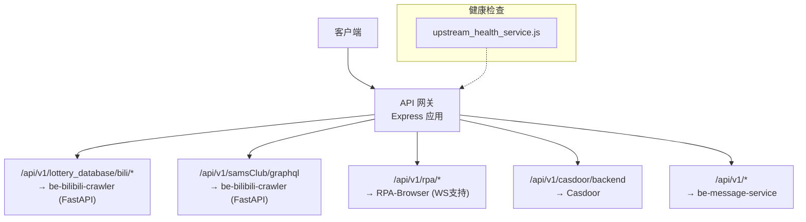
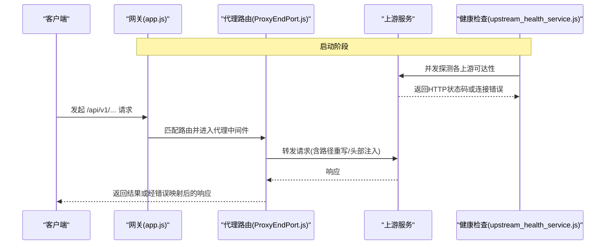
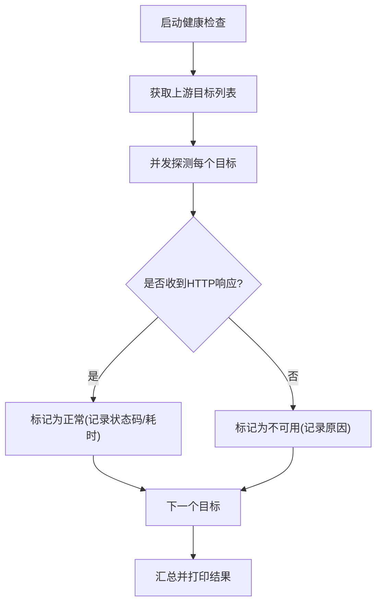
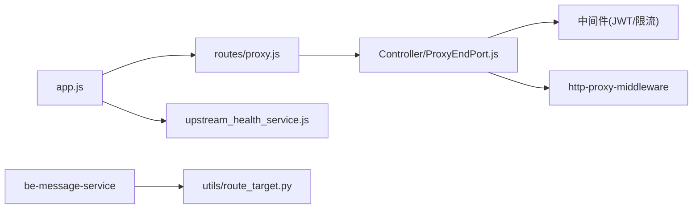

# 服务发现与路由机制

<cite>
**本文引用的文件**
- [app.js](file://be-gateway/ExpressServerEnd/app.js)
- [proxy.js](file://be-gateway/ExpressServerEnd/routes/proxy.js)
- [ProxyEndPort.js](file://be-gateway/ExpressServerEnd/Controller/ProxyEndPort.js)
- [upstream_health_service.js](file://be-gateway/ExpressServerEnd/Service/upstream_health_module/upstream_health_service.js)
- [config.yml](file://be-gateway/ExpressServerEnd/config/config.yml)
- [index.js](file://be-gateway/ExpressServerEnd/config/index.js)
- [JwtModule.js](file://be-gateway/ExpressServerEnd/Service/user_permission_module/JwtModule.js)
- [Limiter.js](file://be-gateway/ExpressServerEnd/MiddleWare/Limiter.js)
- [route_target.py](file://be-message-service/app/utils/route_target.py)
- [user.py](file://be-message-service/app/dependencies/user.py)
</cite>

## 目录
1. [简介](#简介)
2. [项目结构](#项目结构)
3. [核心组件](#核心组件)
4. [架构总览](#架构总览)
5. [详细组件分析](#详细组件分析)
6. [依赖关系分析](#依赖关系分析)
7. [性能考量](#性能考量)
8. [故障排查指南](#故障排查指南)
9. [结论](#结论)
10. [附录](#附录)

## 简介
本文件面向 BilibiliExplosion 项目的“服务发现与路由机制”，聚焦 API 网关（be-gateway）的路由配置、请求转发策略、动态路由注册、负载均衡与健康检查，以及服务间通信协议选择（HTTP/REST、gRPC、WebSocket）。文档同时说明前端路由跳转目标解析、参数转换逻辑，并提供可操作的配置示例与故障转移方案，最后给出性能优化建议与监控指标收集策略。

## 项目结构
网关以 Express 为入口，集中管理跨域、鉴权、限流、超时与错误映射；通过 http-proxy-middleware 将不同路径前缀转发到后端服务（爬虫、RPA、消息服务、Casdoor）。健康检查模块在启动时探测上游可达性，辅助运维定位不可用服务。消息服务提供前端路由名解析工具，用于统一生成可点击链接。



图表来源
- [app.js:113-117](file://be-gateway/ExpressServerEnd/app.js#L113-L117)
- [ProxyEndPort.js:24-162](file://be-gateway/ExpressServerEnd/Controller/ProxyEndPort.js#L24-L162)
- [upstream_health_service.js:14-37](file://be-gateway/ExpressServerEnd/Service/upstream_health_module/upstream_health_service.js#L14-L37)

章节来源
- [app.js:113-117](file://be-gateway/ExpressServerEnd/app.js#L113-L117)
- [ProxyEndPort.js:24-162](file://be-gateway/ExpressServerEnd/Controller/ProxyEndPort.js#L24-L162)
- [upstream_health_service.js:14-37](file://be-gateway/ExpressServerEnd/Service/upstream_health_module/upstream_health_service.js#L14-L37)

## 核心组件
- 网关主应用：负责中间件装配、全局错误处理、超时控制与安全头设置。
- 代理路由：基于路径前缀的静态路由表，使用 http-proxy-middleware 进行请求转发、路径重写与头部注入。
- 健康检查：启动时对上游服务发起 HTTP 探测，输出连通性与耗时信息。
- 鉴权与限流：JWT 可选校验、权限守卫、Redis 分布式限流、本地访问限制。
- 消息服务路由工具：解析并校验前端路由名，生成带参数的跳转 URL。

章节来源
- [app.js:33-117](file://be-gateway/ExpressServerEnd/app.js#L33-L117)
- [ProxyEndPort.js:24-162](file://be-gateway/ExpressServerEnd/Controller/ProxyEndPort.js#L24-L162)
- [upstream_health_service.js:47-122](file://be-gateway/ExpressServerEnd/Service/upstream_health_module/upstream_health_service.js#L47-L122)
- [JwtModule.js:133-155](file://be-gateway/ExpressServerEnd/Service/user_permission_module/JwtModule.js#L133-L155)
- [Limiter.js:20-69](file://be-gateway/ExpressServerEnd/MiddleWare/Limiter.js#L20-L69)
- [route_target.py:38-77](file://be-message-service/app/utils/route_target.py#L38-L77)

## 架构总览
网关作为统一入口，按路径前缀将请求分发至不同后端服务。所有上游地址来源于配置或环境变量，健康检查在启动阶段验证可达性。请求进入网关后，依次经过安全、鉴权、限流等中间件，再由对应代理规则转发到目标服务。



图表来源
- [app.js:82-117](file://be-gateway/ExpressServerEnd/app.js#L82-L117)
- [ProxyEndPort.js:24-162](file://be-gateway/ExpressServerEnd/Controller/ProxyEndPort.js#L24-L162)
- [upstream_health_service.js:98-122](file://be-gateway/ExpressServerEnd/Service/upstream_health_module/upstream_health_service.js#L98-L122)

## 详细组件分析

### API 网关路由与请求转发
- 路由挂载：在应用层统一挂载用户、Casdoor、Ping 与代理路由。
- 代理规则：
  - /api/v1/lottery_database/bili/* → be-bilibili-crawler (FastAPI)
  - /api/v1/samsClub/graphql → be-bilibili-crawler (FastAPI)
  - /api/v1/rpa/* → RPA-Browser（启用 WebSocket 与长超时）
  - /api/v1/casdoor/backend → Casdoor
  - /api/v1/* → be-message-service（通用消息域）
- 路径重写：每个代理均配置 pathRewrite，将网关前缀转换为上游期望路径。
- 头部注入：在 proxyReq 钩子中注入 x-bili-* 用户上下文，供下游服务识别调用者。
- 请求体修复：使用 fixRequestBody 确保代理场景下 body 正确传递。
- 超时与错误：
  - 全局 connect-timeout 30s。
  - 特定代理（如 RPA）延长至 180s。
  - 网络/上游错误映射为 502/504，业务错误保持 200 并通过 body.code 区分。

```mermaid
flowchart TD
Start(["请求进入网关"]) --> Match["匹配路由前缀"]
Match --> |lottery_database/bili| L1["写入用户头/修复body<br/>转发至 FastAPI"]
Match --> |samsClub/graphql| L2["修复body<br/>转发至 FastAPI"]
Match --> |rpa| L3["写入用户头/修复body<br/>开启WS/长超时<br/>转发至 RPA"]
Match --> |casdoor/backend| L4["修复body<br/>转发至 Casdoor"]
Match --> |message(/api/v1)| M1["写入用户头/修复body<br/>转发至 be-message-service"]
L1 --> End(["返回响应"])
L2 --> End
L3 --> End
L4 --> End
M1 --> End
```

图表来源
- [ProxyEndPort.js:24-162](file://be-gateway/ExpressServerEnd/Controller/ProxyEndPort.js#L24-L162)
- [app.js:113-117](file://be-gateway/ExpressServerEnd/app.js#L113-L117)

章节来源
- [ProxyEndPort.js:24-162](file://be-gateway/ExpressServerEnd/Controller/ProxyEndPort.js#L24-L162)
- [app.js:113-117](file://be-gateway/ExpressServerEnd/app.js#L113-L117)

### 动态路由注册与扩展
- 当前采用“静态路由表 + 中间件”的方式，新增路由只需在 ProxyEndPort.js 中添加新的 router.use 块即可。
- 建议：如需完全动态化，可将路由表外置为配置文件或数据库表，并在应用启动时加载并注册到 Express 路由树，同时配合健康检查对每个目标端点进行可用性探测。

章节来源
- [ProxyEndPort.js:24-162](file://be-gateway/ExpressServerEnd/Controller/ProxyEndPort.js#L24-L162)

### 负载均衡算法与服务发现
- 现状：当前代理目标为单一地址，未实现多实例负载均衡。
- 建议方案：
  - 基于 DNS 的服务发现：将上游域名指向多个 A/AAAA 记录，利用操作系统或 Node 的 DNS 轮询实现简单负载均衡。
  - 基于配置中心：将服务实例列表（地址、权重、标签）维护在配置中心，网关定时拉取并构建负载均衡器（如加权轮询、最少连接、一致性哈希）。
  - 结合健康检查：仅将健康实例加入可用池，失败实例自动剔除，恢复后重新纳入。

[本节为概念性设计，不直接引用具体代码]

### 服务健康检查
- 启动时并发探测所有上游服务的根路径，只要收到任意 HTTP 响应即视为存活，连接失败才标记不可用。
- 输出包含名称、目标地址、路由前缀、耗时与原因，便于快速定位问题。



图表来源
- [upstream_health_service.js:14-37](file://be-gateway/ExpressServerEnd/Service/upstream_health_module/upstream_health_service.js#L14-L37)
- [upstream_health_service.js:47-122](file://be-gateway/ExpressServerEnd/Service/upstream_health_module/upstream_health_service.js#L47-L122)

章节来源
- [upstream_health_service.js:47-122](file://be-gateway/ExpressServerEnd/Service/upstream_health_module/upstream_health_service.js#L47-L122)

### 请求路由匹配规则、路径重写与参数转换
- 匹配规则：按路径前缀精确匹配，顺序从上到下，先匹配者优先。
- 路径重写：每个代理通过 pathRewrite 将网关前缀替换为上游期望路径，保证下游无需感知网关存在。
- 参数转换：
  - 请求体：通过 fixRequestBody 确保 JSON/表单等类型正确转发。
  - 头部：注入 x-bili-* 系列用户上下文，下游服务从 Header 读取。
  - 前端路由跳转：消息服务提供 route_target 工具，将资源类型映射为前端路由名与查询键，生成合法跳转 URL。

章节来源
- [ProxyEndPort.js:24-162](file://be-gateway/ExpressServerEnd/Controller/ProxyEndPort.js#L24-L162)
- [route_target.py:38-77](file://be-message-service/app/utils/route_target.py#L38-L77)

### 服务间通信协议选择
- HTTP/REST：绝大多数业务接口通过 HTTP 反向代理转发，适合 RESTful 风格与通用集成。
- gRPC：仓库中存在 gRPC 相关模块与 proto 定义，适用于高性能内部 RPC 场景（如爬虫模块内的 gRPC 能力）。
- WebSocket：RPA 代理启用 ws: true，支持长连接与实时交互（如浏览器自动化任务进度推送）。

章节来源
- [ProxyEndPort.js:57-78](file://be-gateway/ExpressServerEnd/Controller/ProxyEndPort.js#L57-L78)
- [be-bilibili-crawler/Service/GrpcModule/Grpc/grpc_api.py:46-56](file://be-bilibili-crawler/Service/GrpcModule/Grpc/grpc_api.py#L46-L56)

### 鉴权与限流
- JWT 可选校验：部分代理路由使用 jwtAuthOptional，允许匿名访问但保留解析出的用户信息。
- 权限守卫：createGuard 用于保护敏感接口。
- 限流：基于 Redis 的分布式限流，支持自定义窗口、阈值与 key 生成策略。
- 本地访问限制：restrictToLocalhost 限制非内网 IP 访问特定接口。

章节来源
- [JwtModule.js:133-155](file://be-gateway/ExpressServerEnd/Service/user_permission_module/JwtModule.js#L133-L155)
- [Limiter.js:20-69](file://be-gateway/ExpressServerEnd/MiddleWare/Limiter.js#L20-L69)

### 配置与环境变量
- 全局配置：config.yml 包含系统盐值、雪花机器ID、MQ/RPC 超时等。
- 运行时参数：run_arg 与 dotenv 注入环境变量（如 CASDOOR_ENDPOINT）。
- 配置加载：index.js 读取 YAML 并输出全局配置。

章节来源
- [config.yml:1-29](file://be-gateway/ExpressServerEnd/config/config.yml#L1-L29)
- [index.js:1-7](file://be-gateway/ExpressServerEnd/config/index.js#L1-L7)

## 依赖关系分析
- 网关主应用依赖：
  - 路由：routes/proxy.js 聚合代理控制器。
  - 中间件：JWT、限流、安全头、超时。
  - 代理：http-proxy-middleware。
- 健康检查依赖：axios 发起 HTTP 探测。
- 消息服务依赖：route_target 工具用于前端路由跳转。



图表来源
- [app.js:113-117](file://be-gateway/ExpressServerEnd/app.js#L113-L117)
- [proxy.js:1-12](file://be-gateway/ExpressServerEnd/routes/proxy.js#L1-L12)
- [ProxyEndPort.js:24-162](file://be-gateway/ExpressServerEnd/Controller/ProxyEndPort.js#L24-L162)
- [upstream_health_service.js:14-37](file://be-gateway/ExpressServerEnd/Service/upstream_health_module/upstream_health_service.js#L14-L37)
- [route_target.py:38-77](file://be-message-service/app/utils/route_target.py#L38-L77)

章节来源
- [app.js:113-117](file://be-gateway/ExpressServerEnd/app.js#L113-L117)
- [proxy.js:1-12](file://be-gateway/ExpressServerEnd/routes/proxy.js#L1-L12)
- [ProxyEndPort.js:24-162](file://be-gateway/ExpressServerEnd/Controller/ProxyEndPort.js#L24-L162)
- [upstream_health_service.js:14-37](file://be-gateway/ExpressServerEnd/Service/upstream_health_module/upstream_health_service.js#L14-L37)
- [route_target.py:38-77](file://be-message-service/app/utils/route_target.py#L38-L77)

## 性能考量
- 超时配置：
  - 全局 30s，RPA 等长任务提升至 180s，避免误杀。
- 连接复用与代理优化：
  - 合理设置 keepAlive 与连接池（可在 http-proxy-middleware 上层封装）。
  - 对高频接口启用缓存（CDN/网关层缓存）。
- 限流与背压：
  - 基于 Redis 的分布式限流防止雪崩。
  - 对慢接口实施熔断与降级。
- 日志与追踪：
  - 开发环境记录请求耗时与入参，生产环境减少冗余日志。
  - 引入链路追踪（TraceID）贯穿网关与上游。

[本节为通用指导，不直接引用具体代码]

## 故障排查指南
- 常见错误码映射：
  - 504：网关等待上游超时（ETIMEDOUT/ESOCKETTIMEDOUT）。
  - 502：上游不可达或响应无效（ECONNREFUSED、ENOTFOUND、EAI_AGAIN、EHOSTUNREACH、ENETUNREACH、EPIPE、ECONNABORTED、EPROTO、HPE_INVALID_RESPONSE、HPE_HEADER_OVERFLOW）。
- 健康检查：
  - 查看启动时的健康检查输出，确认各上游名称、目标地址、路由前缀与耗时。
- 鉴权问题：
  - 确认 JWT 是否从 HttpOnly Cookie 读取，必要时调整 credentialsRequired。
- 限流触发：
  - 检查 Redis 存储键前缀与窗口时间，确认是否被误限流。

章节来源
- [app.js:35-66](file://be-gateway/ExpressServerEnd/app.js#L35-L66)
- [app.js:120-184](file://be-gateway/ExpressServerEnd/app.js#L120-L184)
- [upstream_health_service.js:98-122](file://be-gateway/ExpressServerEnd/Service/upstream_health_module/upstream_health_service.js#L98-L122)
- [JwtModule.js:133-155](file://be-gateway/ExpressServerEnd/Service/user_permission_module/JwtModule.js#L133-L155)
- [Limiter.js:20-69](file://be-gateway/ExpressServerEnd/MiddleWare/Limiter.js#L20-L69)

## 结论
本项目通过 Express 网关实现了清晰的路由转发与基础的健康检查能力，满足当前多服务集成的需求。未来可在此基础上引入动态路由注册、基于 DNS/配置中心的服务发现与负载均衡、更完善的熔断与降级策略，以及统一的监控与告警体系，以提升系统的可扩展性与稳定性。

## 附录

### 服务路由配置示例（基于现有实现）
- 新增一个上游服务转发：
  - 在 ProxyEndPort.js 中添加 router.use("/api/v1/newservice/*", createProxyMiddleware({...}))，配置 target、pathRewrite、proxyTimeout 与 on.proxyReq 注入头部。
  - 在 upstream_health_service.js 的 getUpstreamTargets 中补充该服务的 name、route、target，以便启动时健康检查。
- 参考路径：
  - [ProxyEndPort.js:24-162](file://be-gateway/ExpressServerEnd/Controller/ProxyEndPort.js#L24-L162)
  - [upstream_health_service.js:14-37](file://be-gateway/ExpressServerEnd/Service/upstream_health_module/upstream_health_service.js#L14-L37)

### 故障转移机制（建议方案）
- 健康检查驱动：
  - 启动时探测所有上游，仅将健康实例加入可用池。
  - 运行期定期重试探测，失败则剔除，恢复则加入。
- 负载均衡：
  - 对可用池执行加权轮询或最少连接策略。
- 降级与回退：
  - 当主服务不可用时，尝试备用服务或返回友好提示。
- 监控与告警：
  - 暴露健康检查接口与指标（成功率、延迟、错误码分布），接入监控系统。

[本节为概念性设计，不直接引用具体代码]

### 监控指标收集策略（建议）
- 网关层：
  - 请求量、成功率、P95/P99 延迟、错误码分布、限流触发次数。
- 上游服务：
  - 健康检查通过率、连接数、CPU/内存、GC 情况。
- 采集与可视化：
  - 使用 Prometheus + Grafana 或同类方案，统一采集与展示。
- 日志：
  - 结构化日志（JSON），包含 TraceID、请求路径、上游地址、耗时与状态码。

[本节为通用指导，不直接引用具体代码]