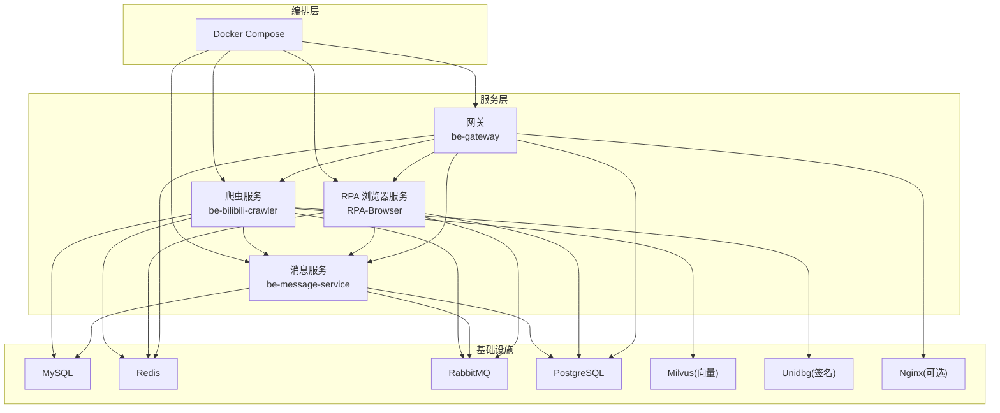
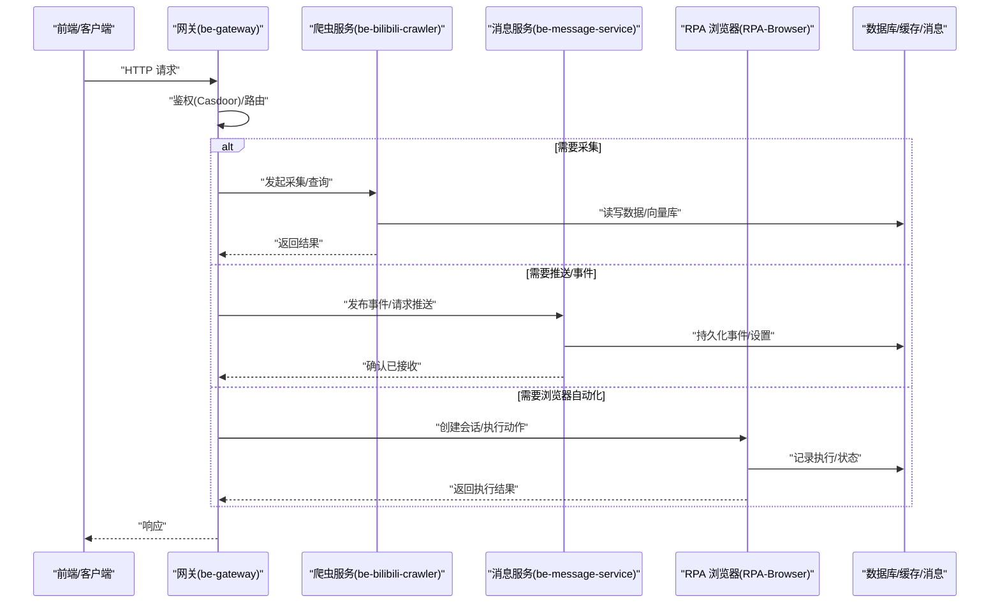
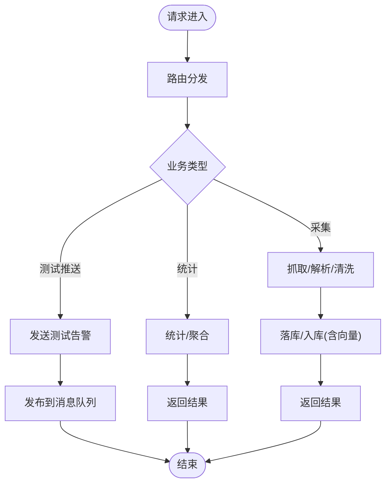
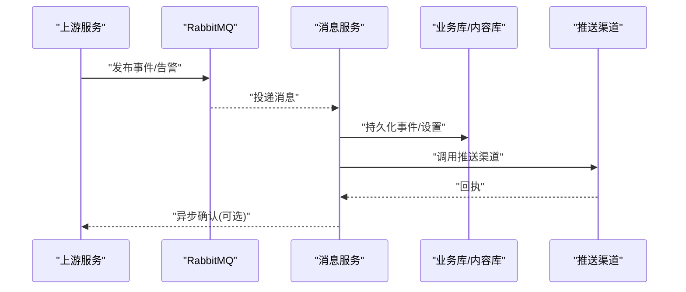
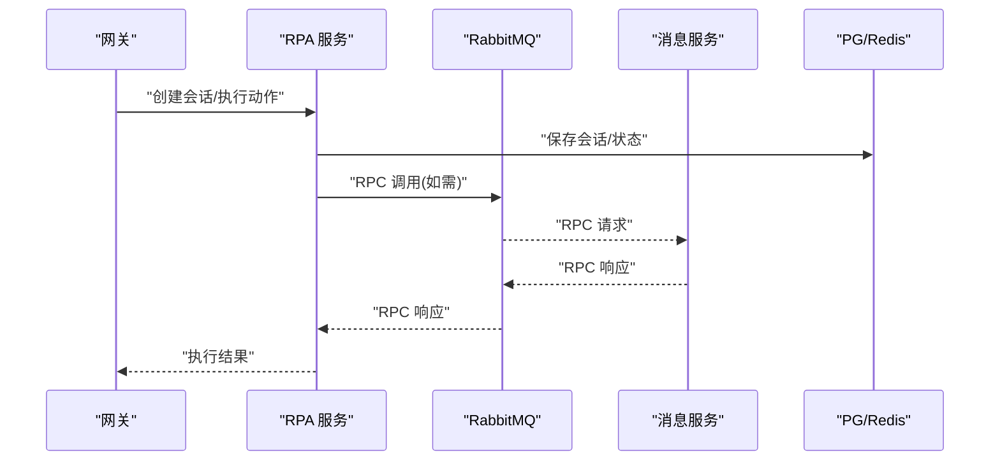
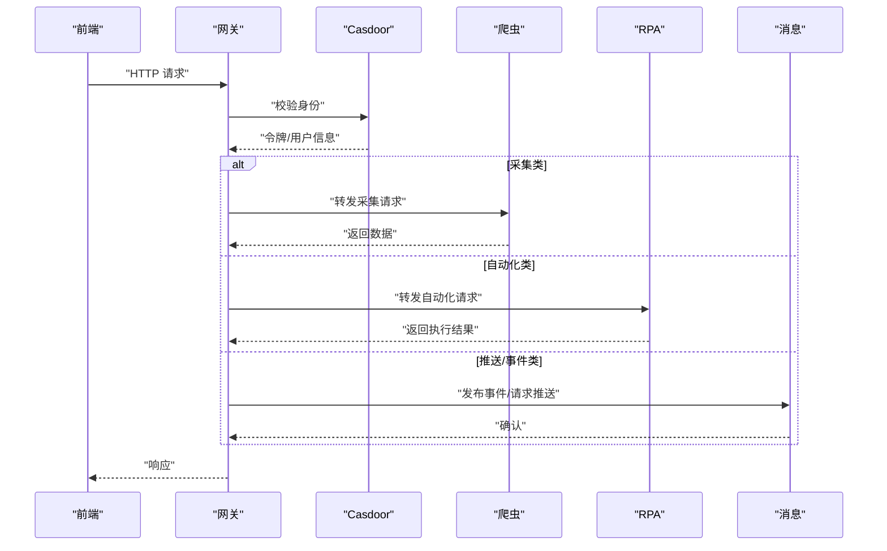
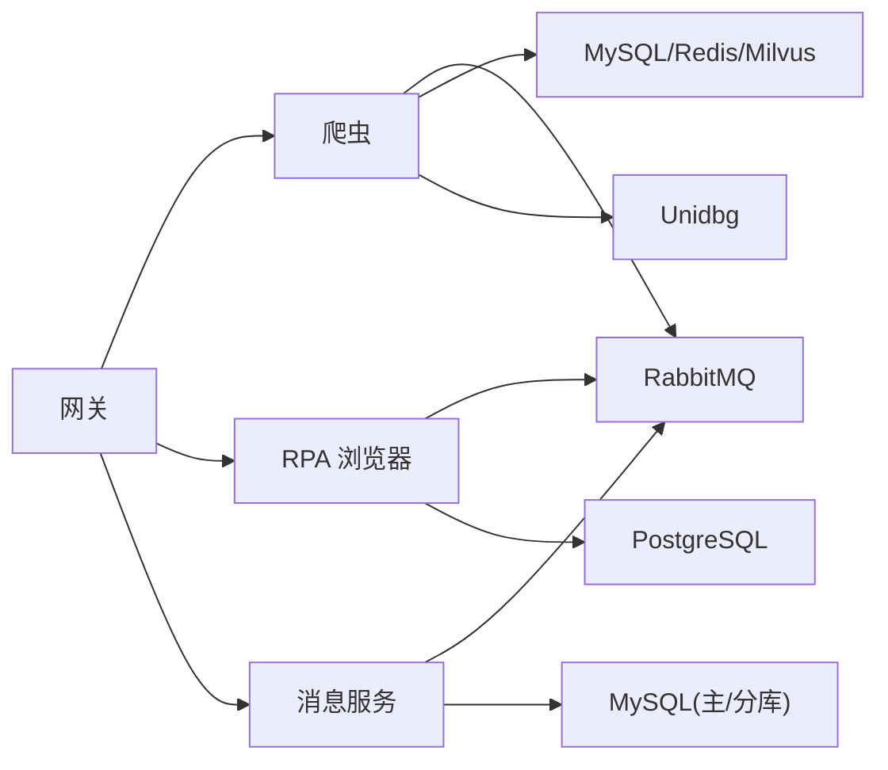

# 服务边界与职责划分

<cite>
**本文引用的文件**
- [README.md](file://README.md)
- [docker-compose.yml](file://docker-compose.yml)
- [be-bilibili-crawler/main.py](file://be-bilibili-crawler/main.py)
- [RPA-Browser/main.py](file://RPA-Browser/main.py)
- [be-gateway/index.js](file://be-gateway/index.js)
- [bili-common/bili_common/__init__.py](file://bili-common/bili_common/__init__.py)
</cite>

## 目录
1. [引言](#引言)
2. [项目结构](#项目结构)
3. [核心组件](#核心组件)
4. [架构总览](#架构总览)
5. [详细组件分析](#详细组件分析)
6. [依赖关系分析](#依赖关系分析)
7. [性能与资源隔离](#性能与资源隔离)
8. [故障排查指南](#故障排查指南)
9. [结论](#结论)
10. [附录](#附录)

## 引言
本文件面向 BilibiliExplosion 项目的微服务拆分，明确各服务的边界、职责与协作方式。重点覆盖：
- 爬虫服务：数据采集与任务调度
- 消息服务：统一消息推送与事件管理
- RPA 浏览器服务：自动化控制能力
- API 网关：请求路由与认证授权
同时给出服务拓扑、数据流向、部署单元与资源隔离策略，帮助读者理解系统如何以独立可部署的单元协同工作。

## 项目结构
仓库采用多子工程聚合，通过 Docker Compose 统一编排中间件与各服务。关键目录与角色如下：
- be-bilibili-crawler：Python/FastAPI 爬虫后端，提供数据采集与后台任务调度能力
- be-message-service：Python/FastAPI + FastStream 消息服务，负责统一消息推送与事件处理
- RPA-Browser：Python/FastAPI + Playwright 浏览器自动化服务
- be-gateway：Node.js/Express 网关，承担前端入口、路由转发与认证（Casdoor）
- unidbgSpringBoot：Java/Spring Boot 签名计算服务
- go-proxy-ipv6-pool-auto：Go 实现的 IPv6 代理池
- bili-common：Python 公共库，被多个 Python 服务复用
- Vue3FrontEndDemoExercise：前端工程（不在本次边界文档范围内）

图表来源
- [docker-compose.yml:120-164](file://docker-compose.yml#L120-L164)
- [docker-compose.yml:179-212](file://docker-compose.yml#L179-L212)
- [docker-compose.yml:227-260](file://docker-compose.yml#L227-L260)
- [docker-compose.yml:261-309](file://docker-compose.yml#L261-L309)

章节来源
- [README.md:12-22](file://README.md#L12-L22)
- [README.md:36-52](file://README.md#L36-L52)

## 核心组件
- 爬虫服务（be-bilibili-crawler）
  - 职责：对外暴露采集相关 API；管理后台任务与调度；对接外部平台抓取数据；将结果写入数据库/向量库；通过消息队列触发下游处理；调用签名服务完成鉴权或参数构造。
  - 关键入口：FastAPI 应用启动、全局异常处理、日志与缓存初始化、路由注册。
- 消息服务（be-message-service）
  - 职责：统一消息推送（多渠道）、事件订阅与消费、用户通知与设置、审计与清理等；通过 RabbitMQ 接收并分发消息；读写业务主库与内容分库。
  - 关键入口：Broker 连接、迁移、健康检查、消费者与 RPC 端点。
- RPA 浏览器服务（RPA-Browser）
  - 职责：提供浏览器实例生命周期管理、页面操作执行、会话与权限控制；通过 RPC 与消息服务交互；持久化执行记录与日志。
  - 关键入口：lifespan 中执行迁移、初始化依赖、启动后台任务、连接 RabbitMQ RPC、启动 RPC Server。
- API 网关（be-gateway）
  - 职责：统一入口、路由转发、认证授权（Casdoor）、限流与前置信息注入；协调爬虫、RPA、消息等服务完成业务流程。
  - 关键入口：Express 应用、中间件、路由模块、与上游服务的 HTTP/RPC 调用。

章节来源
- [be-bilibili-crawler/main.py:48-60](file://be-bilibili-crawler/main.py#L48-L60)
- [be-bilibili-crawler/main.py:63-112](file://be-bilibili-crawler/main.py#L63-L112)
- [RPA-Browser/main.py:36-63](file://RPA-Browser/main.py#L36-L63)
- [be-gateway/index.js:176-357](file://be-gateway/index.js#L176-L357)

## 架构总览
整体采用“网关 -> 业务服务”的分层模式，配合消息队列实现异步解耦。数据层由 MySQL、Redis、PostgreSQL、Milvus 组成，分别承载结构化数据、缓存、消息元数据与向量检索。认证由 Casdoor 统一提供。

图表来源
- [docker-compose.yml:179-212](file://docker-compose.yml#L179-L212)
- [docker-compose.yml:120-164](file://docker-compose.yml#L120-L164)
- [docker-compose.yml:227-260](file://docker-compose.yml#L227-L260)
- [docker-compose.yml:261-309](file://docker-compose.yml#L261-L309)

## 详细组件分析

### 爬虫服务（be-bilibili-crawler）
- 边界与职责
  - 对外提供数据采集与统计接口
  - 管理后台任务与调度（如定时抓取、报告生成）
  - 通过消息队列向消息服务发送告警与事件
  - 调用签名服务完成参数构造与鉴权
  - 使用 Redis 做缓存与去重，MySQL/Postgres/Milvus 存储结果
- 关键流程
  - 应用启动时注册路由、初始化缓存、配置日志
  - 全局异常处理器捕获异常并上报消息服务
  - 通过 MQ 控制器暴露消息收发能力
- 典型调用链
  - 前端/网关 -> 爬虫服务 -> 数据库/向量库 -> 消息服务（告警/事件）

图表来源
- [be-bilibili-crawler/main.py:48-60](file://be-bilibili-crawler/main.py#L48-L60)
- [be-bilibili-crawler/main.py:63-112](file://be-bilibili-crawler/main.py#L63-L112)

章节来源
- [be-bilibili-crawler/main.py:48-60](file://be-bilibili-crawler/main.py#L48-L60)
- [be-bilibili-crawler/main.py:63-112](file://be-bilibili-crawler/main.py#L63-L112)

### 消息服务（be-message-service）
- 边界与职责
  - 统一消息推送（多渠道），事件订阅与消费
  - 维护用户通知、设置、审计与清理任务
  - 通过 RabbitMQ 接收来自其他服务的事件
  - 读写业务主库与内容分库，支持 GeoIP 等增强能力
- 关键流程
  - Broker 连接与健康检查
  - 消费者处理不同事件（评论、私信、外部推送等）
  - 提供 RPC 接口供其他服务查询或触发
- 典型调用链
  - 爬虫/RPA/网关 -> 消息服务（发布事件/请求推送）-> 渠道适配 -> 外部通知

图表来源
- [docker-compose.yml:261-309](file://docker-compose.yml#L261-L309)

章节来源
- [docker-compose.yml:261-309](file://docker-compose.yml#L261-L309)

### RPA 浏览器服务（RPA-Browser）
- 边界与职责
  - 管理浏览器实例与页面生命周期
  - 提供页面操作、截图、录制、WebRTC 等能力
  - 通过 RabbitMQ RPC 与消息服务交互，获取资源详情或触发动作
  - 持久化执行记录、日志与权限信息
- 关键流程
  - 启动时执行数据库迁移与 Schema 校验
  - 初始化依赖、启动后台任务
  - 连接 RabbitMQ RPC Client，启动 RPC Server
- 典型调用链
  - 网关/消息服务 -> RPA 服务（创建会话/执行动作）-> 浏览器内核 -> 结果回传

图表来源
- [RPA-Browser/main.py:36-63](file://RPA-Browser/main.py#L36-L63)
- [docker-compose.yml:227-260](file://docker-compose.yml#L227-L260)

章节来源
- [RPA-Browser/main.py:36-63](file://RPA-Browser/main.py#L36-L63)
- [docker-compose.yml:227-260](file://docker-compose.yml#L227-L260)

### API 网关（be-gateway）
- 边界与职责
  - 统一入口、路由转发、认证授权（Casdoor）
  - 限流、前置信息注入、错误统一处理
  - 协调爬虫、RPA、消息等服务完成端到端流程
- 关键流程
  - 启动后加载配置、注册路由与中间件
  - 根据路径将请求转发至对应上游服务
  - 结合本地脚本/模块驱动自动化流程（如抽奖、直播弹幕）
- 典型调用链
  - 前端 -> 网关 -> 鉴权 -> 路由 -> 上游服务 -> 返回

图表来源
- [docker-compose.yml:179-212](file://docker-compose.yml#L179-L212)
- [be-gateway/index.js:176-357](file://be-gateway/index.js#L176-L357)

章节来源
- [be-gateway/index.js:176-357](file://be-gateway/index.js#L176-L357)
- [docker-compose.yml:179-212](file://docker-compose.yml#L179-L212)

## 依赖关系分析
- 服务间耦合
  - 网关对爬虫、RPA、消息服务存在强依赖（同步/异步混合）
  - 爬虫与消息服务通过 RabbitMQ 解耦，降低直接耦合度
  - RPA 与消息服务通过 RabbitMQ RPC 进行轻量级交互
- 数据流向
  - 采集数据：爬虫 -> 数据库/向量库 -> 消息服务（事件/告警）
  - 自动化流程：网关 -> RPA -> 数据库 -> 消息服务（状态/结果）
  - 推送链路：任意服务 -> 消息服务 -> 多渠道推送
- 外部依赖
  - 认证：Casdoor（网关与消息服务共用）
  - 签名：unidbg（爬虫调用）
  - 中间件：MySQL、Redis、RabbitMQ、PostgreSQL、Milvus

图表来源
- [docker-compose.yml:120-164](file://docker-compose.yml#L120-L164)
- [docker-compose.yml:179-212](file://docker-compose.yml#L179-L212)
- [docker-compose.yml:227-260](file://docker-compose.yml#L227-L260)
- [docker-compose.yml:261-309](file://docker-compose.yml#L261-L309)

章节来源
- [docker-compose.yml:120-164](file://docker-compose.yml#L120-L164)
- [docker-compose.yml:179-212](file://docker-compose.yml#L179-L212)
- [docker-compose.yml:227-260](file://docker-compose.yml#L227-L260)
- [docker-compose.yml:261-309](file://docker-compose.yml#L261-L309)

## 性能与资源隔离
- 独立部署单元
  - 每个服务均为独立容器，具备独立的进程空间与网络栈
  - 通过 docker-compose 声明依赖与服务发现（内部 DNS）
- 资源限制
  - 爬虫服务在编排中设置了内存上限，避免长时间运行导致 OOM
  - 其他服务可根据负载扩展副本数或使用 K8s 等资源配额机制
- 网络通信
  - 服务间通过容器内网通信，端口映射仅暴露必要入口
  - 消息队列作为异步总线，削峰填谷，提升吞吐与容错
- 建议
  - 为 CPU 密集型任务（如浏览器自动化、向量检索）分配更高 CPU 配额
  - 对 I/O 密集的服务（爬虫、消息）增加连接池与并发度
  - 使用健康检查与重启策略保障服务可用性

章节来源
- [docker-compose.yml:120-164](file://docker-compose.yml#L120-L164)
- [docker-compose.yml:310-322](file://docker-compose.yml#L310-L322)

## 故障排查指南
- 常见问题定位
  - 网关无法访问上游：检查环境变量与容器网络连通性
  - 消息服务不可用：查看 /health 端点与 RabbitMQ 连接状态
  - 爬虫异常未上报：检查全局异常处理器与消息队列连通性
  - RPA 浏览器执行失败：查看会话状态与浏览器日志
- 快速验证
  - 使用网关提供的健康检查与测试接口验证链路
  - 通过消息服务的测试接口验证推送链路
- 日志与监控
  - 各服务均输出结构化日志，建议集中收集与分析
  - 结合 Prometheus/Grafana 或 APM 工具观测指标

章节来源
- [be-bilibili-crawler/main.py:63-112](file://be-bilibili-crawler/main.py#L63-L112)
- [docker-compose.yml:310-322](file://docker-compose.yml#L310-L322)

## 结论
本项目通过清晰的微服务拆分与职责定义，实现了采集、自动化、消息与网关的解耦协作。基于 Docker Compose 的统一编排与资源隔离，保障了各服务的独立部署与弹性扩展。消息队列作为核心纽带，有效提升了系统的吞吐与鲁棒性。后续可在服务治理、可观测性与容量规划方面持续优化。

## 附录
- 公共模型与认证
  - bili-common 提供统一的响应模型与认证依赖，便于各 Python 服务保持一致的接口风格与鉴权方式
- 参考入口
  - 爬虫服务入口：[be-bilibili-crawler/main.py](file://be-bilibili-crawler/main.py)
  - RPA 浏览器入口：[RPA-Browser/main.py](file://RPA-Browser/main.py)
  - 网关入口：[be-gateway/index.js](file://be-gateway/index.js)
  - 公共库导出：[bili-common/bili_common/__init__.py](file://bili-common/bili_common/__init__.py)

章节来源
- [bili-common/bili_common/__init__.py:1-17](file://bili-common/bili_common/__init__.py#L1-L17)