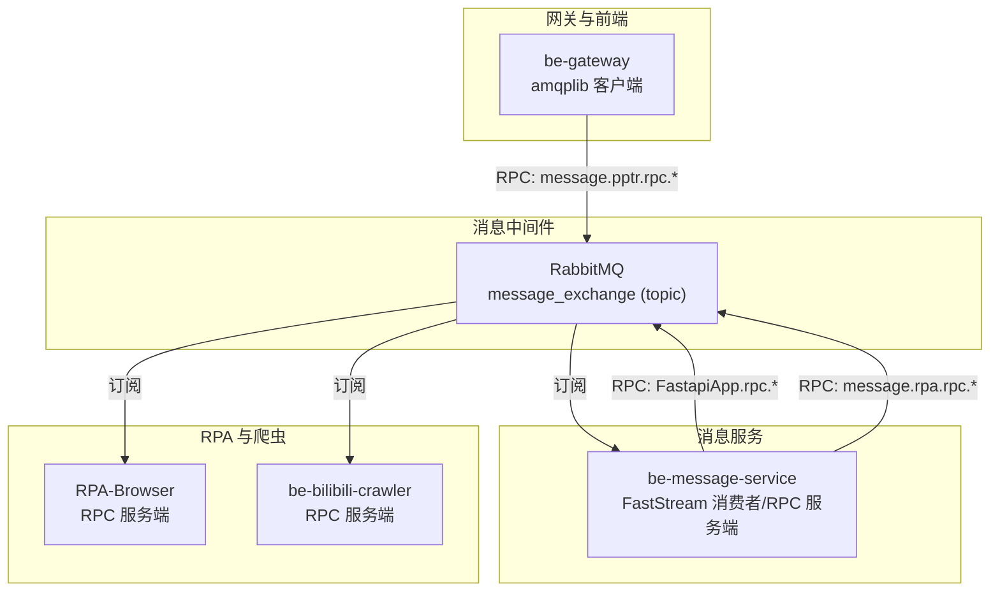
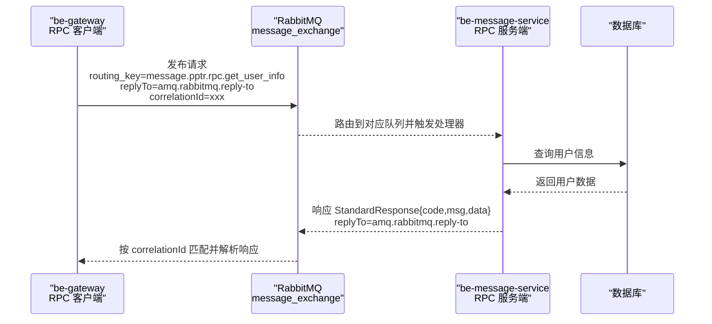
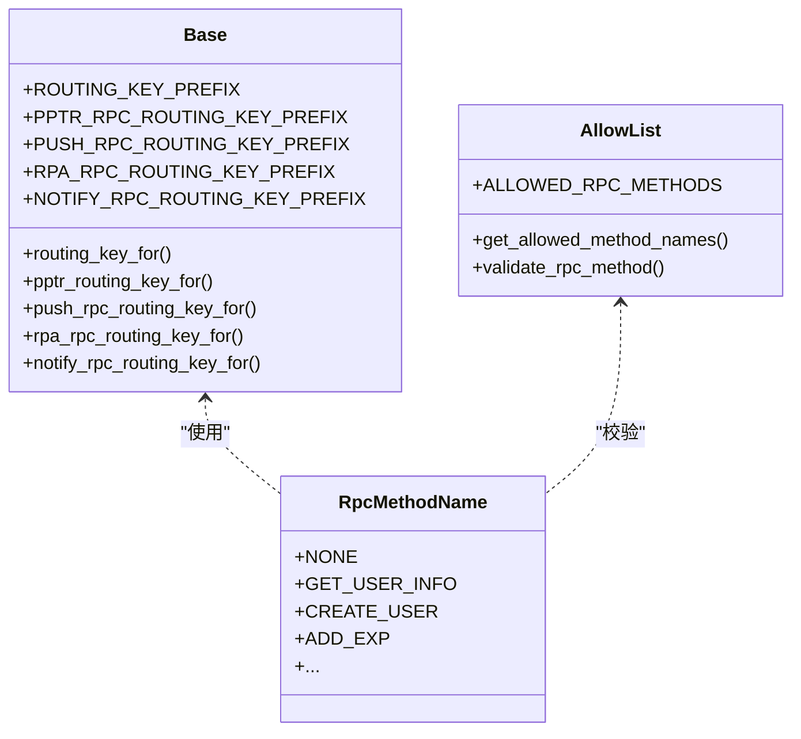
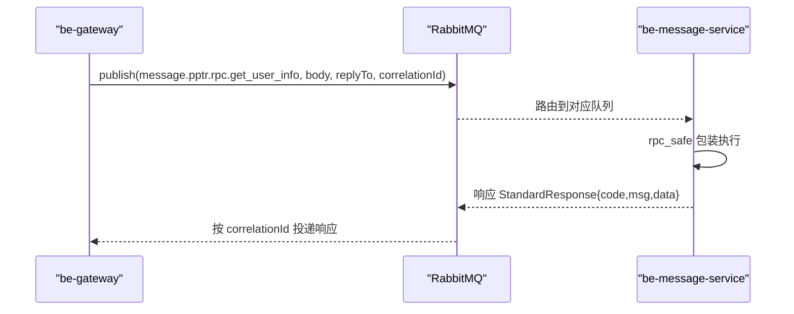
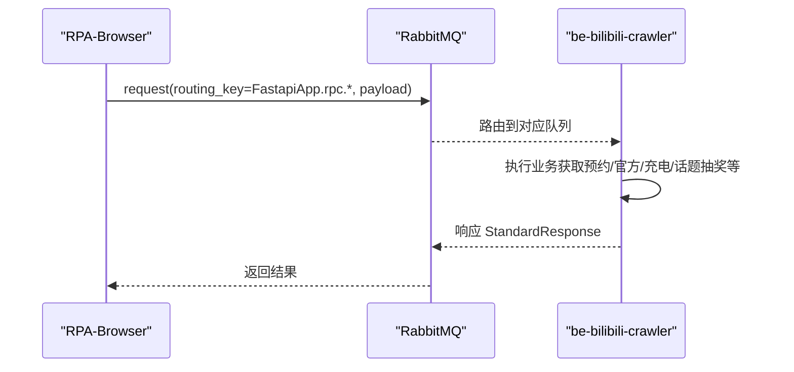
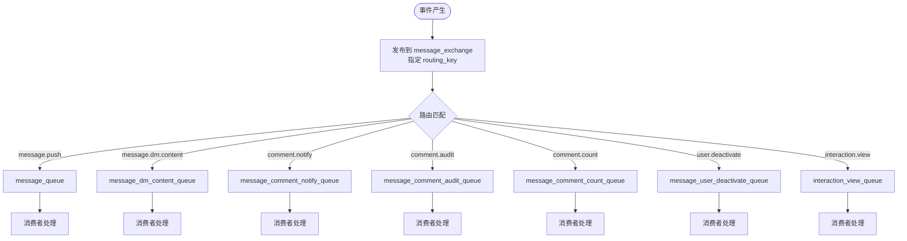
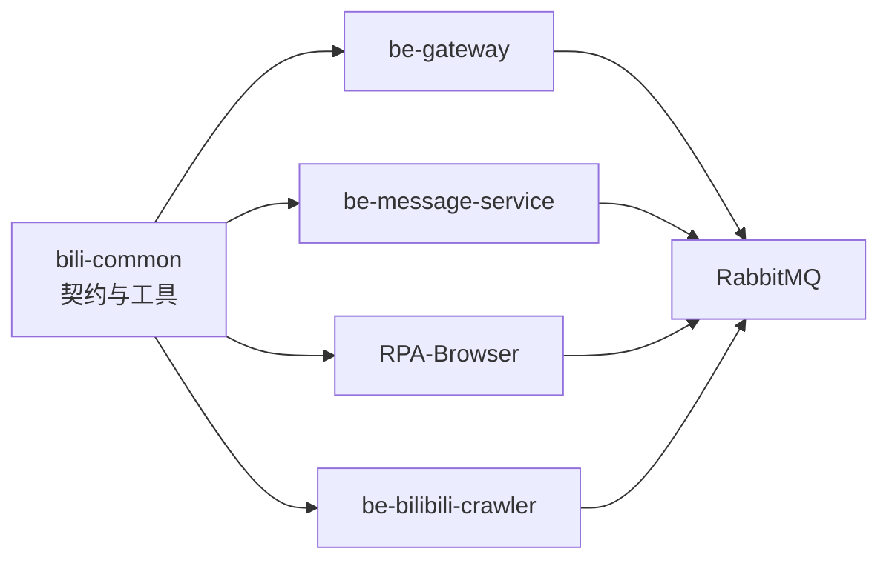

# 服务间通信协议

<cite>
**本文引用的文件**
- [bili-common/bili_common/rpc/__init__.py](file://bili-common/bili_common/rpc/__init__.py)
- [bili-common/bili_common/rpc/base.py](file://bili-common/bili_common/rpc/base.py)
- [bili-common/bili_common/models/rpc.py](file://bili-common/bili_common/models/rpc.py)
- [be-gateway/ExpressServerEnd/Service/mq/rpc_client.js](file://be-gateway/ExpressServerEnd/Service/mq/rpc_client.js)
- [RPA-Browser/app/services/mq/rpc_client.py](file://RPA-Browser/app/services/mq/rpc_client.py)
- [be-message-service/app/core/broker.py](file://be-message-service/app/core/broker.py)
- [be-message-service/app/mq/rpc_pptr_user.py](file://be-message-service/app/mq/rpc_pptr_user.py)
- [be-bilibili-crawler/Models/MQ/BaseMQModel.py](file://be-bilibili-crawler/Models/MQ/BaseMQModel.py)
</cite>

## 目录
1. [引言](#引言)
2. [项目结构](#项目结构)
3. [核心组件](#核心组件)
4. [架构总览](#架构总览)
5. [详细组件分析](#详细组件分析)
6. [依赖关系分析](#依赖关系分析)
7. [性能考虑](#性能考虑)
8. [故障诊断指南](#故障诊断指南)
9. [结论](#结论)
10. [附录](#附录)

## 引言
本文件面向 BilibiliExplosion 项目的“服务间通信协议”，聚焦以下目标：
- RPC 通信机制：同步调用与异步调用的使用场景、路由键与消息体约定。
- 消息队列通信模式：发布订阅、点对点（请求-响应）与事件驱动。
- 数据序列化格式：JSON 与 Protocol Buffers 的选择与权衡，以及自定义扩展点。
- 通信安全：身份验证、数据加密与传输保护策略。
- 版本管理与向后兼容：接口演进与兼容性保障方案。
- 性能优化与故障诊断：可观测性、超时重试、背压与降级。

## 项目结构
本项目采用多语言微服务协作，围绕 RabbitMQ 构建统一的消息总线，并通过 bili-common 沉淀跨服务的 RPC 契约与工具。关键路径如下：
- be-gateway（Node.js）通过 amqplib 发起 pptr 用户 RPC 请求，走 message_exchange + routing_key message.pptr.rpc.*。
- be-message-service（Python/FastStream）作为 RPC 服务端，订阅对应队列并执行业务逻辑，返回标准响应。
- RPA-Browser（Python/FastStream）提供资源查询等 RPC 服务端能力，被 be-message 以相同 RPC 模式调用。
- be-bilibili-crawler（Python/FastStream）提供抽奖相关 RPC 服务端能力，被 RPA-Browser 调用。
- bili-common 集中定义路由前缀、方法名枚举、参数/结果模型与通用客户端/装饰器。

图表来源
- [be-gateway/ExpressServerEnd/Service/mq/rpc_client.js:1-165](file://be-gateway/ExpressServerEnd/Service/mq/rpc_client.js#L1-L165)
- [be-message-service/app/core/broker.py:1-125](file://be-message-service/app/core/broker.py#L1-L125)
- [be-message-service/app/mq/rpc_pptr_user.py:1-407](file://be-message-service/app/mq/rpc_pptr_user.py#L1-L407)
- [RPA-Browser/app/services/mq/rpc_client.py:1-25](file://RPA-Browser/app/services/mq/rpc_client.py#L1-L25)
- [be-bilibili-crawler/Models/MQ/BaseMQModel.py:1-74](file://be-bilibili-crawler/Models/MQ/BaseMQModel.py#L1-L74)

章节来源
- [be-gateway/ExpressServerEnd/Service/mq/rpc_client.js:1-165](file://be-gateway/ExpressServerEnd/Service/mq/rpc_client.js#L1-L165)
- [be-message-service/app/core/broker.py:1-125](file://be-message-service/app/core/broker.py#L1-L125)
- [bili-common/bili_common/rpc/base.py:1-226](file://bili-common/bili_common/rpc/base.py#L1-L226)

## 核心组件
- 统一 RPC 契约与路由前缀：在 bili-common 中集中管理，避免各服务重复定义导致不一致。
- 同步 RPC（请求-响应）：基于 RabbitMQ Direct Reply-To（amq.rabbitmq.reply-to），客户端发送携带 correlationId 的请求，服务端将响应发回该虚拟队列，实现同步等待。
- 异步事件（发布订阅）：基于 topic exchange 的 routing_key 进行解耦投递，如站内信、私信落库、评论审核等。
- 安全与健壮性：rpc_safe 装饰器在服务端统一异常转标准响应；客户端对超时与连接异常抛出明确错误类型，禁止吞错。

章节来源
- [bili-common/bili_common/rpc/__init__.py:1-177](file://bili-common/bili_common/rpc/__init__.py#L1-L177)
- [bili-common/bili_common/rpc/base.py:1-226](file://bili-common/bili_common/rpc/base.py#L1-L226)
- [be-gateway/ExpressServerEnd/Service/mq/rpc_client.js:1-165](file://be-gateway/ExpressServerEnd/Service/mq/rpc_client.js#L1-L165)
- [be-message-service/app/mq/rpc_pptr_user.py:1-407](file://be-message-service/app/mq/rpc_pptr_user.py#L1-L407)

## 架构总览
下图展示跨服务的 RPC 与事件流：be-gateway 通过 amqplib 向 message_exchange 发送 pptr 用户 RPC 请求；be-message-service 消费后执行业务并返回标准响应；同时，站内信、私信、评论等事件通过独立 routing_key 进入不同队列，由相应消费者处理。

图表来源
- [be-gateway/ExpressServerEnd/Service/mq/rpc_client.js:34-84](file://be-gateway/ExpressServerEnd/Service/mq/rpc_client.js#L34-L84)
- [be-gateway/ExpressServerEnd/Service/mq/rpc_client.js:119-157](file://be-gateway/ExpressServerEnd/Service/mq/rpc_client.js#L119-L157)
- [be-message-service/app/mq/rpc_pptr_user.py:97-118](file://be-message-service/app/mq/rpc_pptr_user.py#L97-L118)

## 详细组件分析

### RPC 契约与路由前缀（bili-common）
- 路由前缀隔离：FastapiApp.rpc（抽奖）、message.pptr.rpc（pptr 用户）、message.push.rpc（站外推送）、message.rpa.rpc（RPA 资源）、message.notify.rpc（系统通知）。
- 方法名枚举与白名单：RpcMethodName 集中定义，配合 ALLOWED_RPC_METHODS 限制可调用方法，防止任意方法暴露。
- 路由生成函数：routing_key_for/pptr_routing_key_for/push_rpc_routing_key_for/rpa_rpc_routing_key_for/notify_rpc_routing_key_for 保证两端一致。

图表来源
- [bili-common/bili_common/rpc/base.py:23-113](file://bili-common/bili_common/rpc/base.py#L23-L113)
- [bili-common/bili_common/rpc/base.py:130-204](file://bili-common/bili_common/rpc/base.py#L130-L204)

章节来源
- [bili-common/bili_common/rpc/base.py:1-226](file://bili-common/bili_common/rpc/base.py#L1-L226)
- [bili-common/bili_common/models/rpc.py:1-42](file://bili-common/bili_common/models/rpc.py#L1-L42)
- [bili-common/bili_common/rpc/__init__.py:1-177](file://bili-common/bili_common/rpc/__init__.py#L1-L177)

### 同步 RPC：be-gateway 调用 be-message（pptr 用户）
- 客户端（be-gateway）：
  - 使用 amqplib 建立 channel，声明 topic exchange message_exchange。
  - 为每次调用生成 correlationId，设置 replyTo=amq.rabbitmq.reply-to，并注册专属 consumer 接收响应。
  - 超时与连接异常分别抛出 RpcTimeoutError / RpcTransportError，禁止当作业务成功处理。
- 服务端（be-message-service）：
  - 通过 @broker.subscriber 订阅 message.pptr.rpc.<method>，使用 rpc_safe 包装，确保异常转为标准响应。
  - 执行业务（如用户信息查询、创建、等级更新等），返回 StandardResponse。

图表来源
- [be-gateway/ExpressServerEnd/Service/mq/rpc_client.js:34-84](file://be-gateway/ExpressServerEnd/Service/mq/rpc_client.js#L34-L84)
- [be-gateway/ExpressServerEnd/Service/mq/rpc_client.js:119-157](file://be-gateway/ExpressServerEnd/Service/mq/rpc_client.js#L119-L157)
- [be-message-service/app/mq/rpc_pptr_user.py:97-118](file://be-message-service/app/mq/rpc_pptr_user.py#L97-L118)

章节来源
- [be-gateway/ExpressServerEnd/Service/mq/rpc_client.js:1-165](file://be-gateway/ExpressServerEnd/Service/mq/rpc_client.js#L1-L165)
- [be-message-service/app/mq/rpc_pptr_user.py:1-407](file://be-message-service/app/mq/rpc_pptr_user.py#L1-L407)

### 同步 RPC：RPA-Browser 调用 be-bilibili-crawler（抽奖）
- 客户端（RPA-Browser）：
  - 薄封装 bili_common.rpc.client.RpcClient，统一 amqp_url 注入与 request/response 流程。
- 服务端（be-bilibili-crawler）：
  - 通过 FastStream 的 RPC 订阅处理 FastapiApp.rpc.* 请求，返回标准响应。

图表来源
- [RPA-Browser/app/services/mq/rpc_client.py:1-25](file://RPA-Browser/app/services/mq/rpc_client.py#L1-L25)
- [be-bilibili-crawler/Models/MQ/BaseMQModel.py:38-74](file://be-bilibili-crawler/Models/MQ/BaseMQModel.py#L38-L74)

章节来源
- [RPA-Browser/app/services/mq/rpc_client.py:1-25](file://RPA-Browser/app/services/mq/rpc_client.py#L1-L25)
- [be-bilibili-crawler/Models/MQ/BaseMQModel.py:1-74](file://be-bilibili-crawler/Models/MQ/BaseMQModel.py#L1-L74)

### 异步事件：发布订阅与事件驱动
- 统一 exchange：message_exchange（topic），按 routing_key 分流到独立队列，避免耦合。
- 典型路由键：
  - message.push：外部渠道推送（站外提醒）。
  - message.dm.content：私信内容异步落库。
  - message.comment.notify / .audit / .count：评论通知、审核、计数削峰。
  - message.user.deactivate：用户注销异步删除。
  - interaction.view：浏览统计去重累计。
- 消费者与 HTTP 接口复用同一 broker 定义，避免绑定不一致。

图表来源
- [be-message-service/app/core/broker.py:1-125](file://be-message-service/app/core/broker.py#L1-L125)

章节来源
- [be-message-service/app/core/broker.py:1-125](file://be-message-service/app/core/broker.py#L1-L125)

### 数据序列化格式选择
- JSON：当前 RPC 请求/响应普遍使用 application/json，便于跨语言互通与调试。
- Protocol Buffers：仓库中存在 bilibili IM/动态等 proto 生成的 Python 模块，表明在部分子系统（如 IM、动态）已采用 Protobuf 以提升序列化效率与强类型约束。
- 自定义协议：通过 bili-common 的契约层（Pydantic/SQLModel）定义参数与结果模型，可在不改变传输层的情况下演进数据结构。

建议：
- 高吞吐、低延迟的内部 RPC 优先评估 Protobuf；对外或跨语言边界使用 JSON 以降低集成成本。
- 在 bili-common 中维护统一的字段命名与版本标记，便于向前/向后兼容。

章节来源
- [be-gateway/ExpressServerEnd/Service/mq/rpc_client.js:142-149](file://be-gateway/ExpressServerEnd/Service/mq/rpc_client.js#L142-L149)
- [be-bilibili-crawler/Service/GrpcModule/Grpc/GrpcProto/bilibili/im/interfaces/v1/im_pb2.py:128-157](file://be-bilibili-crawler/Service/GrpcModule/Grpc/GrpcProto/bilibili/im/interfaces/v1/im_pb2.py#L128-L157)
- [be-bilibili-crawler/Service/GrpcModule/Grpc/GrpcProto/bilibili/dynamic/interfaces/feed/v1/api_pb2.py:147-171](file://be-bilibili-crawler/Service/GrpcModule/Grpc/GrpcProto/bilibili/dynamic/interfaces/feed/v1/api_pb2.py#L147-L171)

### 通信安全机制
- 身份验证：
  - 网关层鉴权：be-gateway 在接入层完成用户认证与权限控制，RPC 仅承载受信任服务间调用。
  - 方法白名单：bili-common 中的 ALLOWED_RPC_METHODS 限制可调用方法，防止越权。
- 数据加密：
  - 传输层：建议通过 TLS 加密 RabbitMQ 连接（mTLS），或在反向代理/网关层启用 HTTPS/TLS。
  - 敏感字段：在应用层对敏感数据进行加密存储或传输（如密码、令牌）。
- 访问控制：
  - 路由键前缀隔离：不同系统使用独立前缀（message.pptr.rpc、FastapiApp.rpc 等），降低误用风险。
  - 最小权限原则：消费者仅订阅必要队列，发布者仅发布必要路由键。

章节来源
- [bili-common/bili_common/rpc/base.py:23-40](file://bili-common/bili_common/rpc/base.py#L23-L40)
- [bili-common/bili_common/rpc/base.py:130-204](file://bili-common/bili_common/rpc/base.py#L130-L204)

### 版本管理与向后兼容
- 语义化版本：公共 API 遵循 SemVer 2.0.0，MAJOR 用于不兼容变更，MINOR 用于兼容新增功能，PATCH 用于修复。
- 路由键与方法名：
  - 新增方法时保持旧方法可用，必要时引入新版本路由前缀或版本号后缀。
  - 通过 ALLOWED_RPC_METHODS 白名单逐步放开新能力。
- 数据模型：
  - 使用 Pydantic/SQLModel 的可选字段与默认值，确保旧客户端可忽略新增字段。
  - 在 bili-common 中集中维护契约，避免多份定义导致漂移。

章节来源
- [bili-common/bili_common/rpc/base.py:130-204](file://bili-common/bili_common/rpc/base.py#L130-L204)
- [bili-common/bili_common/rpc/__init__.py:1-177](file://bili-common/bili_common/rpc/__init__.py#L1-L177)

## 依赖关系分析
- 契约依赖：所有服务通过 bili-common 共享路由前缀、方法名与参数/结果模型，确保一致性。
- 运行时依赖：
  - be-gateway 依赖 amqplib 与 RabbitMQ。
  - be-message-service 与 RPA-Browser 依赖 FastStream/RabbitMQ。
  - be-bilibili-crawler 依赖 FastStream/RabbitMQ。
- 内部依赖：
  - be-message-service 的消费者与 HTTP 接口共用 broker 定义，避免绑定不一致。
  - 各 RPC 处理器通过 rpc_safe 装饰器统一异常处理。

图表来源
- [bili-common/bili_common/rpc/__init__.py:1-177](file://bili-common/bili_common/rpc/__init__.py#L1-L177)
- [be-message-service/app/core/broker.py:1-125](file://be-message-service/app/core/broker.py#L1-L125)

章节来源
- [bili-common/bili_common/rpc/__init__.py:1-177](file://bili-common/bili_common/rpc/__init__.py#L1-L177)
- [be-message-service/app/core/broker.py:1-125](file://be-message-service/app/core/broker.py#L1-L125)

## 性能考虑
- 连接复用与生命周期：
  - be-gateway 单 channel 复用，避免频繁建连；断连自动重置并重试。
  - be-message-service 共享 broker 实例，减少连接数。
- 超时与重试：
  - 客户端设置合理超时（如 5s），超时抛出明确异常，调用方可据此重试或降级。
  - 批量任务（如 seed_cli）具备重试与超时覆盖机制，避免偶发连接重置导致崩溃。
- 背压与削峰：
  - 通过独立队列与 topic exchange 分流高负载场景（如评论计数、互动统计）。
- 序列化开销：
  - 热点路径评估 Protobuf；非热点路径使用 JSON 降低复杂度。
- 可观测性：
  - 记录 correlationId、routing_key、耗时与错误类型，便于定位问题。

章节来源
- [be-gateway/ExpressServerEnd/Service/mq/rpc_client.js:34-84](file://be-gateway/ExpressServerEnd/Service/mq/rpc_client.js#L34-L84)
- [be-gateway/ExpressServerEnd/Service/mq/rpc_client.js:119-157](file://be-gateway/ExpressServerEnd/Service/mq/rpc_client.js#L119-L157)
- [be-message-service/app/core/broker.py:1-125](file://be-message-service/app/core/broker.py#L1-L125)

## 故障诊断指南
- 常见错误类型：
  - RpcTimeoutError：请求超时，检查服务端处理耗时、队列堆积与消费者健康度。
  - RpcTransportError：连接/通信异常，检查 RabbitMQ 连接、网络与权限。
- 诊断步骤：
  - 确认 routing_key 与 exchange 绑定正确（message_exchange topic）。
  - 查看消费者日志与队列深度，识别瓶颈与死信。
  - 核对 correlationId 是否匹配，避免响应丢失。
- 异常处理：
  - 服务端使用 rpc_safe 统一异常为标准响应，避免静默失败。
  - 客户端不吞错，必须向上抛出以便上层重试或降级。

章节来源
- [be-gateway/ExpressServerEnd/Service/mq/rpc_client.js:92-109](file://be-gateway/ExpressServerEnd/Service/mq/rpc_client.js#L92-L109)
- [be-gateway/ExpressServerEnd/Service/mq/rpc_client.js:119-157](file://be-gateway/ExpressServerEnd/Service/mq/rpc_client.js#L119-L157)
- [be-message-service/app/mq/rpc_pptr_user.py:97-118](file://be-message-service/app/mq/rpc_pptr_user.py#L97-L118)

## 结论
本项目通过 bili-common 沉淀统一的 RPC 契约与路由前缀，结合 RabbitMQ 的 topic exchange 与 Direct Reply-To 实现了稳定高效的服务间通信。同步 RPC 适用于即时响应场景（如用户信息查询），异步事件适用于解耦与削峰（如站内信、私信落库、评论审核）。通过方法白名单、路由前缀隔离与 rpc_safe 装饰器，提升了安全性与健壮性。未来可进一步引入 Protobuf 提升性能，并结合 TLS/mTLS 强化传输安全。

## 附录
- 术语说明：
  - routing_key：消息路由键，决定消息进入哪个队列。
  - exchange：消息交换机，负责根据规则将消息路由到队列。
  - correlationId：请求-响应关联标识，用于匹配响应。
  - replyTo：Direct Reply-To 虚拟队列，用于服务端将响应直接发回客户端。
- 最佳实践：
  - 严格使用 bili-common 的路由前缀与方法名，避免硬编码。
  - 客户端设置合理超时与重试策略，服务端使用 rpc_safe 统一异常。
  - 通过独立队列与 topic exchange 实现高内聚、低耦合的事件驱动架构。