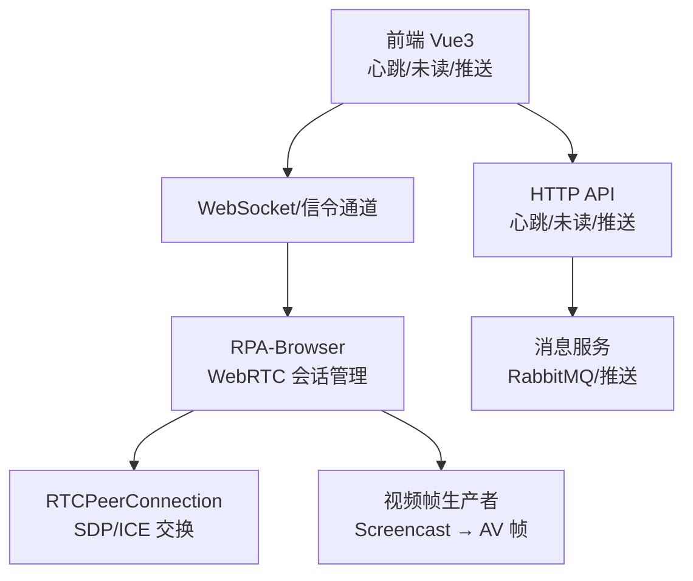
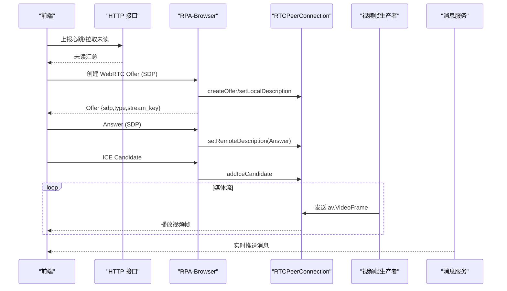
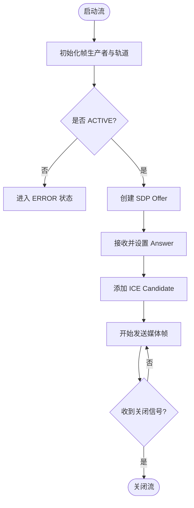
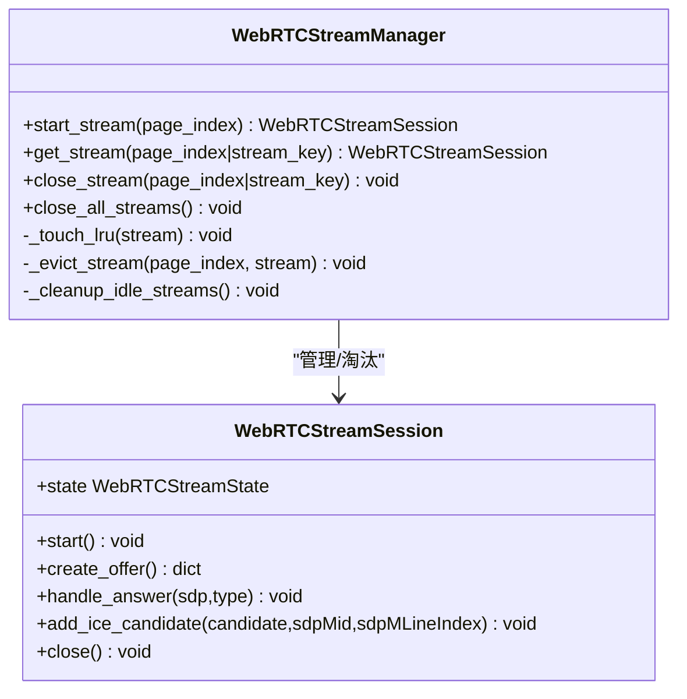
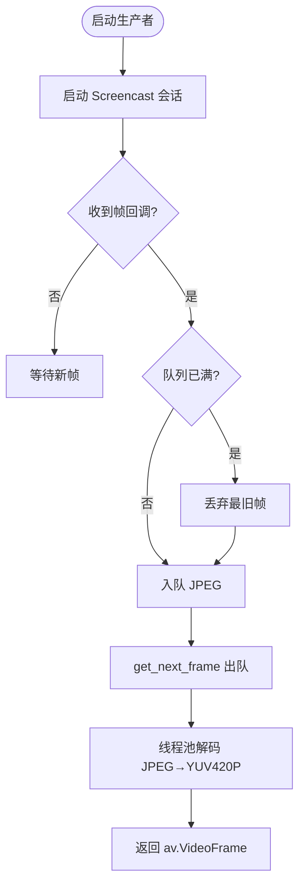
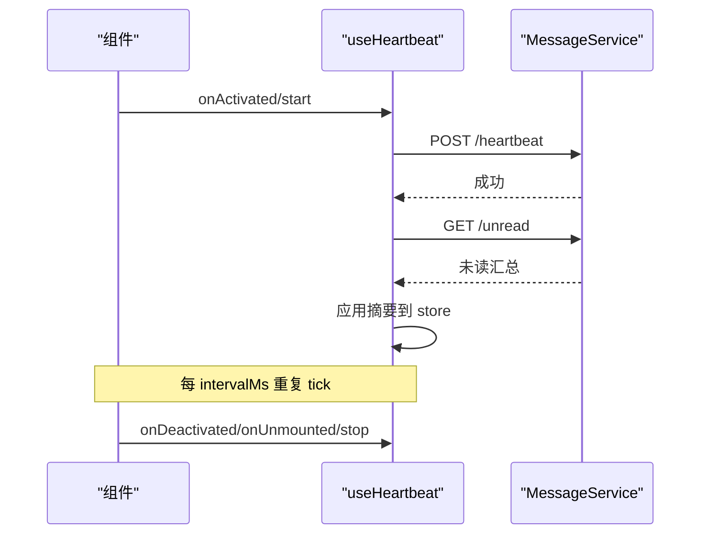
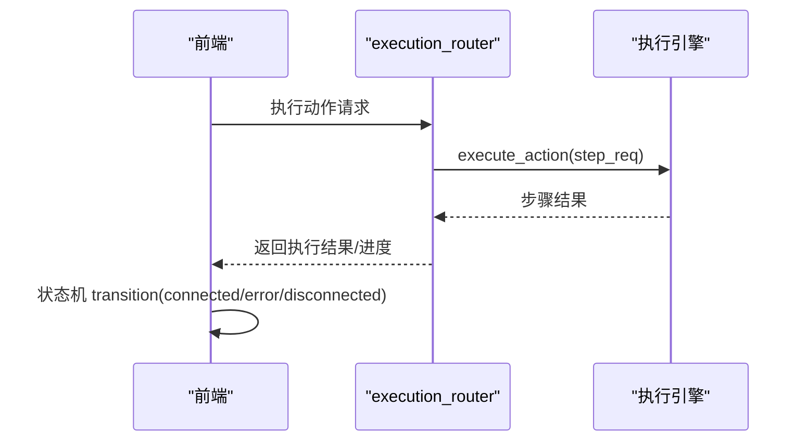
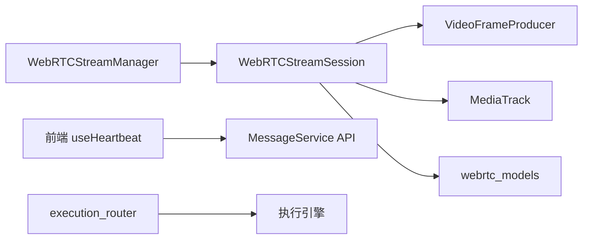

# 实时数据流

<cite>
**本文引用的文件**
- [stream_session.py](file://RPA-Browser/app/services/RPA_browser/webrtc/stream_session.py)
- [webrtc_models.py](file://RPA-Browser/app/models/runtime/webrtc_models.py)
- [stream_manager.py](file://RPA-Browser/app/services/RPA_browser/webrtc/stream_manager.py)
- [video_frame_producer.py](file://RPA-Browser/app/services/RPA_browser/webrtc/video_frame_producer.py)
- [useHeartbeat.ts](file://Vue3FrontEndDemoExercise/src/composables/useHeartbeat.ts)
- [MessageService.gen.ts](file://Vue3FrontEndDemoExercise/src/api/community/hey-api/services/MessageService.gen.ts)
- [PushService.gen.ts](file://Vue3FrontEndDemoExercise/src/api/community/hey-api/services/PushService.gen.ts)
- [消息推送微服务Service.gen.ts](file://Vue3FrontEndDemoExercise/src/api/bili_lottery_data/hey-api/services/消息推送微服务Service.gen.ts)
- [execution_router.py](file://RPA-Browser/app/controller/v1/browser_control/execution/execution_router.py)
- [useBrowserSessionState.ts](file://Vue3FrontEndDemoExercise/src/composables/useBrowserSessionState.ts)
</cite>

## 目录
1. [简介](#简介)
2. [项目结构](#项目结构)
3. [核心组件](#核心组件)
4. [架构总览](#架构总览)
5. [详细组件分析](#详细组件分析)
6. [依赖关系分析](#依赖关系分析)
7. [性能考量](#性能考量)
8. [故障排查指南](#故障排查指南)
9. [结论](#结论)
10. [附录](#附录)

## 简介
本文件面向 BilibiliExplosion 项目的“实时数据流”主题，聚焦基于 WebSocket/WebRTC 的实时通信与事件驱动的数据同步。内容涵盖：
- 连接建立、心跳检测、断线重连机制
- 服务端推送、客户端订阅、事件驱动的同步方式
- 浏览器自动化场景下的实时状态同步（页面操作反馈、执行进度更新、异常通知）
- 安全性与性能优化策略（连接池管理、数据压缩、带宽控制）
- 集成示例与调试方法，帮助构建高效实时交互

## 项目结构
本项目在前后端分离的基础上，围绕 RPA 浏览器控制与消息推送形成实时链路：
- 前端（Vue3）通过 HTTP 上报心跳并拉取未读汇总；通过 WebRTC 直连后端进行低延迟屏幕流传输
- 后端（RPA-Browser）提供 WebRTC 流生命周期管理与帧捕获；通过执行路由将动作下发到浏览器引擎
- 消息中心（be-message-service）负责统一推送通道与队列分发，前端通过 API 投递或测试推送

图表来源
- [useHeartbeat.ts:1-61](file://Vue3FrontEndDemoExercise/src/composables/useHeartbeat.ts#L1-L61)
- [MessageService.gen.ts:8-37](file://Vue3FrontEndDemoExercise/src/api/community/hey-api/services/MessageService.gen.ts#L8-L37)
- [stream_session.py:67-224](file://RPA-Browser/app/services/RPA_browser/webrtc/stream_session.py#L67-L224)
- [video_frame_producer.py:18-140](file://RPA-Browser/app/services/RPA_browser/webrtc/video_frame_producer.py#L18-L140)

章节来源
- [useHeartbeat.ts:1-61](file://Vue3FrontEndDemoExercise/src/composables/useHeartbeat.ts#L1-L61)
- [MessageService.gen.ts:8-37](file://Vue3FrontEndDemoExercise/src/api/community/hey-api/services/MessageService.gen.ts#L8-L37)
- [stream_session.py:67-224](file://RPA-Browser/app/services/RPA_browser/webrtc/stream_session.py#L67-L224)
- [video_frame_producer.py:18-140](file://RPA-Browser/app/services/RPA_browser/webrtc/video_frame_producer.py#L18-L140)

## 核心组件
- WebRTC 流会话（WebRTCStreamSession）：封装单个页面的 RTCPeerConnection 生命周期、信令处理（Offer/Answer/ICE）、活动状态追踪
- 流管理器（WebRTCStreamManager）：维护多页面流的 LRU 索引、闲置淘汰、并发关闭与查询
- 视频帧生产者（VideoFrameProducer）：基于 Playwright Screencast 捕获 JPEG 帧，线程池解码为 YUV420P，丢旧保新队列
- 前端心跳与未读刷新（useHeartbeat + MessageService）：周期性上报活跃心跳，拉取未读汇总，支撑实时推送
- 执行路由（execution_router）：将前端动作请求转换为执行引擎调用，配合状态机实现执行进度与结果回传

章节来源
- [stream_session.py:67-224](file://RPA-Browser/app/services/RPA_browser/webrtc/stream_session.py#L67-L224)
- [stream_manager.py:24-294](file://RPA-Browser/app/services/RPA_browser/webrtc/stream_manager.py#L24-L294)
- [video_frame_producer.py:18-229](file://RPA-Browser/app/services/RPA_browser/webrtc/video_frame_producer.py#L18-L229)
- [useHeartbeat.ts:1-61](file://Vue3FrontEndDemoExercise/src/composables/useHeartbeat.ts#L1-L61)
- [MessageService.gen.ts:8-37](file://Vue3FrontEndDemoExercise/src/api/community/hey-api/services/MessageService.gen.ts#L8-L37)
- [execution_router.py:343-370](file://RPA-Browser/app/controller/v1/browser_control/execution/execution_router.py#L343-L370)

## 架构总览
整体实时链路包括：
- 信令与媒体：前端通过 WebSocket 传递 SDP Offer/Answer 与 ICE Candidate，后端使用 aiortc 建立 P2P 媒体通道
- 帧采集与编码：后端从 Playwright 页面抓取 JPEG 帧，转 YUV420P 后通过 WebRTC 发送
- 心跳与推送：前端定时上报心跳，后端标记用户活跃以启用实时推送；消息经 RabbitMQ 由 message-service 分发
- 执行反馈：前端触发浏览器动作，后端执行引擎返回步骤级结果，结合状态机更新 UI

图表来源
- [useHeartbeat.ts:1-61](file://Vue3FrontEndDemoExercise/src/composables/useHeartbeat.ts#L1-L61)
- [MessageService.gen.ts:8-37](file://Vue3FrontEndDemoExercise/src/api/community/hey-api/services/MessageService.gen.ts#L8-L37)
- [stream_session.py:202-268](file://RPA-Browser/app/services/RPA_browser/webrtc/stream_session.py#L202-L268)
- [video_frame_producer.py:43-140](file://RPA-Browser/app/services/RPA_browser/webrtc/video_frame_producer.py#L43-L140)

## 详细组件分析

### WebRTC 流会话（WebRTCStreamSession）
- 职责：管理 RTCPeerConnection 的生命周期、信令处理、活动状态与错误恢复
- 关键流程：
  - start：启动帧生产者，创建媒体轨道，进入 ACTIVE
  - create_offer：生成 SDP Offer，设置本地描述，记录活动时间
  - handle_answer：设置远端描述，完成握手
  - add_ice_candidate：解析并添加 ICE 候选，打通网络路径
  - close：停止生产者、关闭连接、清理弱引用，幂等关闭
- 状态机：INITIALIZING → ACTIVE → CLOSED/ERROR，非法转换告警

图表来源
- [stream_session.py:163-268](file://RPA-Browser/app/services/RPA_browser/webrtc/stream_session.py#L163-L268)
- [webrtc_models.py:13-38](file://RPA-Browser/app/models/runtime/webrtc_models.py#L13-L38)

章节来源
- [stream_session.py:67-301](file://RPA-Browser/app/services/RPA_browser/webrtc/stream_session.py#L67-L301)
- [webrtc_models.py:13-66](file://RPA-Browser/app/models/runtime/webrtc_models.py#L13-L66)

### 流管理器（WebRTCStreamManager）
- 职责：多页面流的管理、LRU 淘汰、并发关闭与查询
- 数据结构：OrderedDict 主索引（LRU），辅助哈希索引（stream_key），弱引用打破循环
- 算法要点：
  - 查找 O(1)：按 page_index 或 stream_key 直接命中
  - 淘汰：定期扫描 OrderedDict 前部，超过 idle_timeout 的流关闭并从双索引移除
  - 访问即活跃：每次 get_stream 移动至末尾，保证最近使用优先保留
- 资源清理：close_all_streams 并行关闭所有流，避免泄漏

图表来源
- [stream_manager.py:24-294](file://RPA-Browser/app/services/RPA_browser/webrtc/stream_manager.py#L24-L294)
- [stream_session.py:67-224](file://RPA-Browser/app/services/RPA_browser/webrtc/stream_session.py#L67-L224)

章节来源
- [stream_manager.py:24-294](file://RPA-Browser/app/services/RPA_browser/webrtc/stream_manager.py#L24-L294)

### 视频帧生产者（VideoFrameProducer）
- 职责：从 Playwright Screencast 捕获 JPEG 帧，异步队列缓冲，线程池解码为 YUV420P
- 关键特性：
  - 丢旧保新：队列满时丢弃最旧帧，确保最新画面
  - 错误恢复：解码失败返回绿屏帧，避免黑屏
  - 健壮性：检测到已启动的 screencast 会话则先停止再重启
- 性能：CPU 密集型解码在线程池执行，不阻塞事件循环

图表来源
- [video_frame_producer.py:43-173](file://RPA-Browser/app/services/RPA_browser/webrtc/video_frame_producer.py#L43-L173)

章节来源
- [video_frame_producer.py:18-229](file://RPA-Browser/app/services/RPA_browser/webrtc/video_frame_producer.py#L18-L229)

### 前端心跳与未读刷新（useHeartbeat + MessageService）
- 行为：进入消息中心后上报一次心跳，随后按间隔轮询未读汇总；离开时清除定时器，避免泄漏
- 能力：支持 keep-alive 场景（onActivated/onDeactivated）与非 keep-alive 兜底（onMounted/onUnmounted）
- 推送联动：活跃用户走实时推送；非活跃用户降级为批量推送

图表来源
- [useHeartbeat.ts:1-61](file://Vue3FrontEndDemoExercise/src/composables/useHeartbeat.ts#L1-L61)
- [MessageService.gen.ts:8-37](file://Vue3FrontEndDemoExercise/src/api/community/hey-api/services/MessageService.gen.ts#L8-L37)

章节来源
- [useHeartbeat.ts:1-61](file://Vue3FrontEndDemoExercise/src/composables/useHeartbeat.ts#L1-L61)
- [MessageService.gen.ts:8-37](file://Vue3FrontEndDemoExercise/src/api/community/hey-api/services/MessageService.gen.ts#L8-L37)

### 执行路由与状态机（execution_router + useBrowserSessionState）
- 执行路由：将前端动作请求转换为执行引擎调用，支持单步与批处理，附带变量替换与认证头
- 状态机：前端维护 UI 状态（disconnected/connecting/connected/error）与后端生命周期状态的映射，错误码可映射为终止等语义

图表来源
- [execution_router.py:343-370](file://RPA-Browser/app/controller/v1/browser_control/execution/execution_router.py#L343-L370)
- [useBrowserSessionState.ts:1-206](file://Vue3FrontEndDemoExercise/src/composables/useBrowserSessionState.ts#L1-L206)

章节来源
- [execution_router.py:343-370](file://RPA-Browser/app/controller/v1/browser_control/execution/execution_router.py#L343-L370)
- [useBrowserSessionState.ts:1-206](file://Vue3FrontEndDemoExercise/src/composables/useBrowserSessionState.ts#L1-L206)

## 依赖关系分析
- 模块耦合：
  - stream_manager 依赖 stream_session 与 webrtc_models，管理其生命周期与资源
  - stream_session 依赖 video_frame_producer 与 media_track，完成帧采集与轨道封装
  - 前端 useHeartbeat 依赖 MessageService API，用于心跳与未读刷新
  - execution_router 依赖执行引擎，驱动浏览器自动化动作
- 外部依赖：
  - aiortc（RTCPeerConnection）用于 WebRTC 信令与媒体
  - Playwright Screencast 用于页面帧捕获
  - RabbitMQ/message-service 用于消息推送

图表来源
- [stream_manager.py:24-294](file://RPA-Browser/app/services/RPA_browser/webrtc/stream_manager.py#L24-L294)
- [stream_session.py:67-224](file://RPA-Browser/app/services/RPA_browser/webrtc/stream_session.py#L67-L224)
- [video_frame_producer.py:18-140](file://RPA-Browser/app/services/RPA_browser/webrtc/video_frame_producer.py#L18-L140)
- [useHeartbeat.ts:1-61](file://Vue3FrontEndDemoExercise/src/composables/useHeartbeat.ts#L1-L61)
- [MessageService.gen.ts:8-37](file://Vue3FrontEndDemoExercise/src/api/community/hey-api/services/MessageService.gen.ts#L8-L37)
- [execution_router.py:343-370](file://RPA-Browser/app/controller/v1/browser_control/execution/execution_router.py#L343-L370)

章节来源
- [stream_manager.py:24-294](file://RPA-Browser/app/services/RPA_browser/webrtc/stream_manager.py#L24-L294)
- [stream_session.py:67-224](file://RPA-Browser/app/services/RPA_browser/webrtc/stream_session.py#L67-L224)
- [video_frame_producer.py:18-140](file://RPA-Browser/app/services/RPA_browser/webrtc/video_frame_producer.py#L18-L140)
- [useHeartbeat.ts:1-61](file://Vue3FrontEndDemoExercise/src/composables/useHeartbeat.ts#L1-L61)
- [MessageService.gen.ts:8-37](file://Vue3FrontEndDemoExercise/src/api/community/hey-api/services/MessageService.gen.ts#L8-L37)
- [execution_router.py:343-370](file://RPA-Browser/app/controller/v1/browser_control/execution/execution_router.py#L343-L370)

## 性能考量
- 连接池管理
  - 使用 WebRTCStreamManager 的双向索引与 LRU 顺序，O(1) 查找与淘汰，避免内存泄漏
  - 定期任务清理闲置流，依据 idle_timeout 自动回收资源
- 数据压缩与带宽控制
  - 帧质量可调（quality 0-100），降低带宽占用
  - 最大帧率限制（max_fps）与帧队列大小（frame_queue_size）控制吞吐
  - 丢旧保新策略减少积压，保障低延迟
- 计算卸载
  - 视频解码在线程池执行，避免阻塞事件循环
  - 绿屏帧作为错误恢复，提升鲁棒性
- 心跳与推送
  - 前端心跳间隔可配置，避免频繁请求
  - 活跃用户实时推送，非活跃用户批量推送，降低系统压力

[本节为通用指导，无需具体文件来源]

## 故障排查指南
- WebRTC 连接问题
  - 检查 Offer/Answer/ICE 是否正确传递与设置
  - 关注 Connection/ICE 状态变更日志，定位网络或 NAT 穿透问题
- 帧采集异常
  - 若 Screencast 已启动报错，先停止再重启
  - 解码失败会返回绿屏帧，需检查 JPEG 数据完整性
- 心跳与推送
  - 确认前端组件生命周期钩子正确启动/停止定时器
  - 验证心跳接口与未读接口可达，消息队列与推送渠道正常
- 执行反馈
  - 检查执行路由参数替换与认证头传递
  - 根据状态机错误码映射，定位会话终止或异常原因

章节来源
- [stream_session.py:275-287](file://RPA-Browser/app/services/RPA_browser/webrtc/stream_session.py#L275-L287)
- [video_frame_producer.py:53-91](file://RPA-Browser/app/services/RPA_browser/webrtc/video_frame_producer.py#L53-L91)
- [useHeartbeat.ts:1-61](file://Vue3FrontEndDemoExercise/src/composables/useHeartbeat.ts#L1-L61)
- [useBrowserSessionState.ts:20-25](file://Vue3FrontEndDemoExercise/src/composables/useBrowserSessionState.ts#L20-L25)

## 结论
本项目通过 WebRTC 实现低延迟的浏览器屏幕流传输，结合前端心跳与消息推送形成完整的实时数据流闭环。流管理器采用 LRU 与双索引优化资源管理，视频帧生产者通过线程池与丢旧保新策略保障性能与稳定性。执行路由与状态机确保浏览器自动化操作的实时反馈与状态一致。建议在生产环境进一步细化带宽控制、加密与安全校验，并完善监控与告警体系。

[本节为总结，无需具体文件来源]

## 附录
- 集成示例
  - 前端心跳与未读刷新：参考 useHeartbeat 与 MessageService API
  - WebRTC 流建立：参考 stream_session 的 create_offer/handle_answer/add_ice_candidate
  - 推送测试：参考 PushService 与消息推送微服务 Service 的测试接口
- 调试方法
  - 浏览器开发者工具查看 WebRTC 统计信息（比特率、丢包率）
  - 后端日志关注 ICE/Connection 状态与帧生产错误
  - 消息服务侧检查队列消费与推送渠道连通性

章节来源
- [useHeartbeat.ts:1-61](file://Vue3FrontEndDemoExercise/src/composables/useHeartbeat.ts#L1-L61)
- [MessageService.gen.ts:8-37](file://Vue3FrontEndDemoExercise/src/api/community/hey-api/services/MessageService.gen.ts#L8-L37)
- [PushService.gen.ts:8-60](file://Vue3FrontEndDemoExercise/src/api/community/hey-api/services/PushService.gen.ts#L8-L60)
- [消息推送微服务Service.gen.ts:1-21](file://Vue3FrontEndDemoExercise/src/api/bili_lottery_data/hey-api/services/消息推送微服务Service.gen.ts#L1-L21)
- [stream_session.py:202-268](file://RPA-Browser/app/services/RPA_browser/webrtc/stream_session.py#L202-L268)