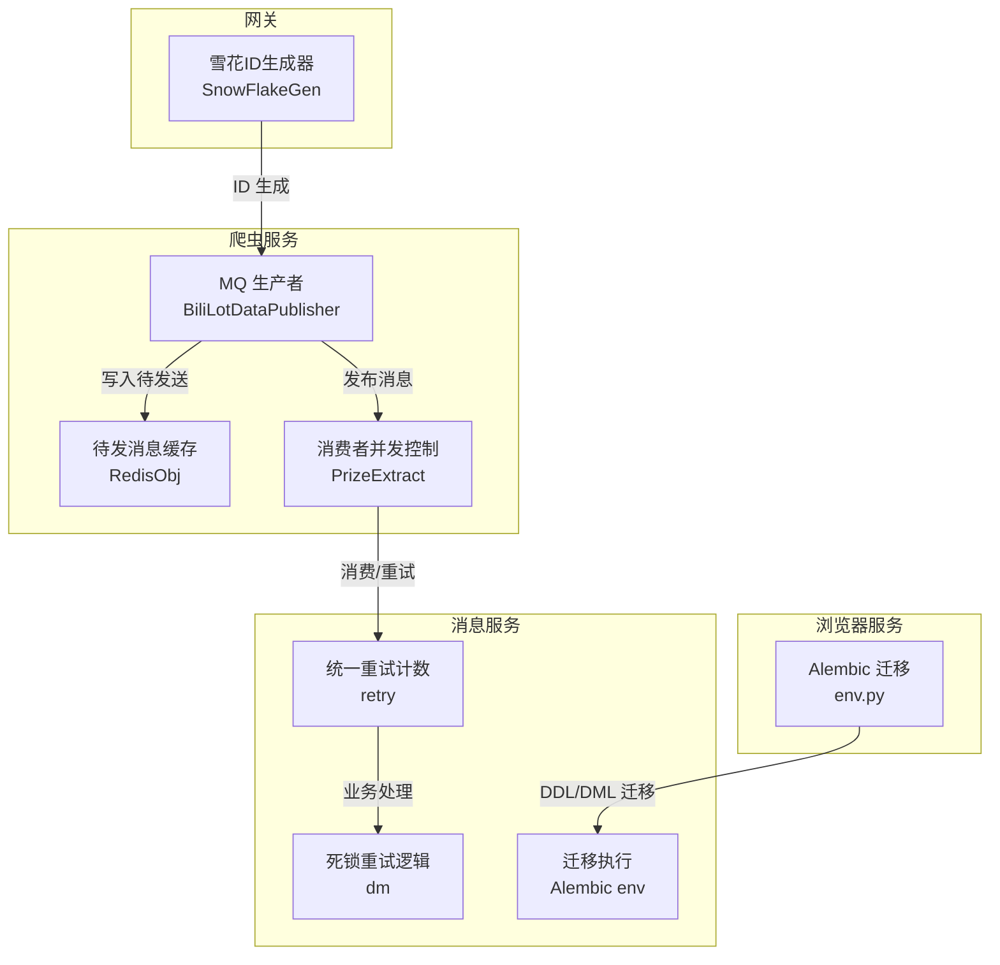
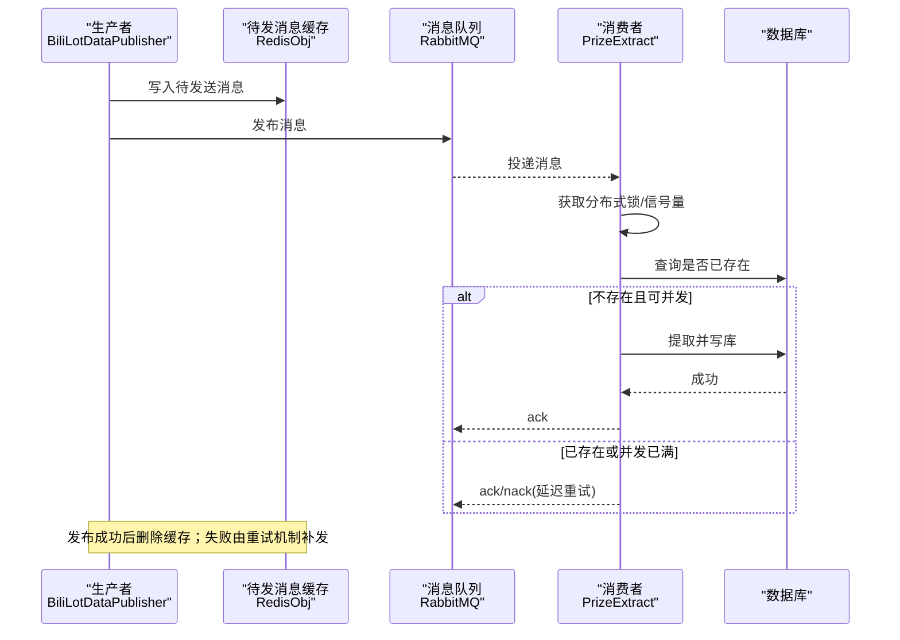
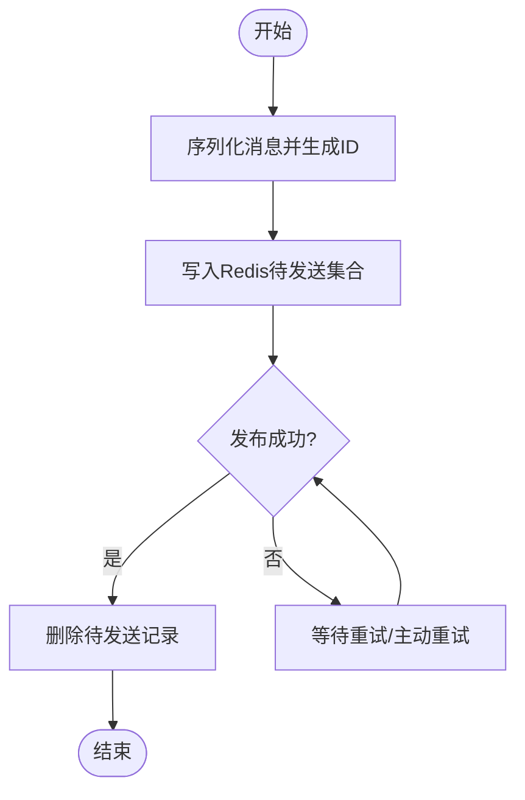
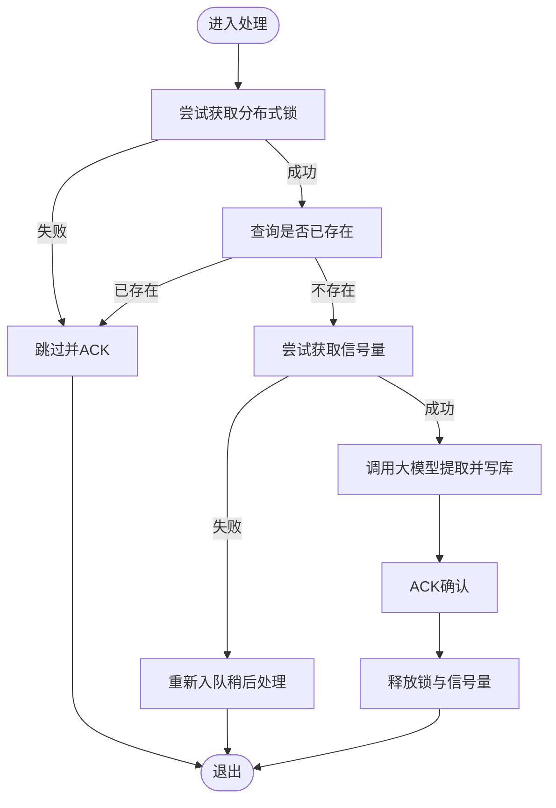
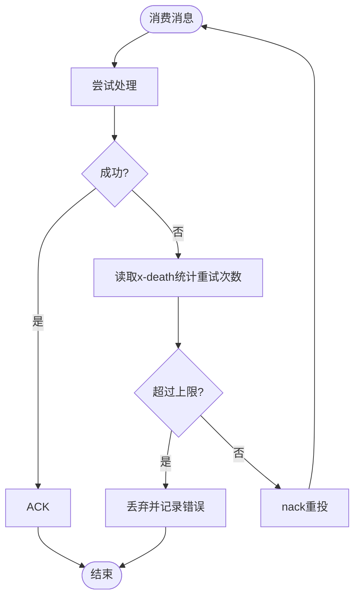
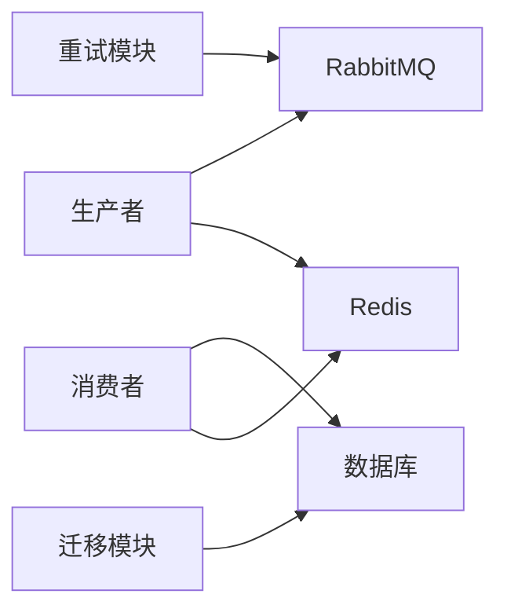

# 数据一致性策略

<cite>
**本文引用的文件**
- [BiliLotDataPublisher.py](file://be-bilibili-crawler/Service/MQ/base/MQClient/BiliLotDataPublisher.py)
- [RabbitmqPubCacheRedis.py](file://be-bilibili-crawler/Service/MQ/utils/RabbitmqPubCacheRedis.py)
- [PrizeExtract.py](file://be-bilibili-crawler/Service/MQ/base/MQClient/PrizeExtract.py)
- [retry.py](file://be-message-service/app/consumers/retry.py)
- [dm.py](file://be-message-service/app/services/message/dm/dm.py)
- [SnowFlakeGen.js](file://be-gateway/ExpressServerEnd/Tool/SnowFlakeGen.js)
- [snowflake-id.mdc](file://.codebuddy/rules/snowflake-id.mdc)
- [env.py（RPA-Browser）](file://RPA-Browser/alembic/env.py)
- [env.py（be-message-service）](file://be-message-service/alembic_pptr/env.py)
- [__init__.py（基础设施层）](file://be-message-service/app/core/__init__.py)
</cite>

## 目录
1. [引言](#引言)
2. [项目结构](#项目结构)
3. [核心组件](#核心组件)
4. [架构总览](#架构总览)
5. [详细组件分析](#详细组件分析)
6. [依赖关系分析](#依赖关系分析)
7. [性能考量](#性能考量)
8. [故障排查指南](#故障排查指南)
9. [结论](#结论)
10. [附录](#附录)

## 引言
本文件面向 BilibiliExplosion 项目的分布式数据一致性保障，围绕事务处理、幂等性设计、最终一致性、数据库主从复制与读写分离、分库分表一致性、消息队列一致性（含重试与补偿）、缓存与数据库一致性、以及备份与恢复策略进行系统化阐述。文档结合仓库中实际实现，给出可落地的方案与最佳实践，并通过流程图与时序图帮助读者理解关键流程。

## 项目结构
本项目采用多服务协作：
- be-bilibili-crawler：负责数据采集与入库消息生产，包含 MQ 发布封装、待发消息缓存与重试、消费者并发控制与去重。
- be-message-service：消息消费与业务处理，包含统一重试计数、死锁重试、迁移脚本等。
- be-gateway：网关侧提供雪花 ID 生成能力，配合前端规范保证 ID 一致性与精度安全。
- RPA-Browser：浏览器自动化与任务编排，具备 Alembic 迁移执行能力。
- bili-common：跨服务共享模型与工具。

图表来源
- [BiliLotDataPublisher.py:54-72](file://be-bilibili-crawler/Service/MQ/base/MQClient/BiliLotDataPublisher.py#L54-L72)
- [RabbitmqPubCacheRedis.py:21-49](file://be-bilibili-crawler/Service/MQ/utils/RabbitmqPubCacheRedis.py#L21-L49)
- [PrizeExtract.py:222-286](file://be-bilibili-crawler/Service/MQ/base/MQClient/PrizeExtract.py#L222-L286)
- [retry.py:19-27](file://be-message-service/app/consumers/retry.py#L19-L27)
- [dm.py:94-106](file://be-message-service/app/services/message/dm/dm.py#L94-L106)
- [SnowFlakeGen.js:72-201](file://be-gateway/ExpressServerEnd/Tool/SnowFlakeGen.js#L72-L201)
- [env.py（RPA-Browser）:46-72](file://RPA-Browser/alembic/env.py#L46-L72)
- [env.py（be-message-service）:68-89](file://be-message-service/alembic_pptr/env.py#L68-L89)

章节来源
- [BiliLotDataPublisher.py:54-72](file://be-bilibili-crawler/Service/MQ/base/MQClient/BiliLotDataPublisher.py#L54-L72)
- [RabbitmqPubCacheRedis.py:21-49](file://be-bilibili-crawler/Service/MQ/utils/RabbitmqPubCacheRedis.py#L21-L49)
- [PrizeExtract.py:222-286](file://be-bilibili-crawler/Service/MQ/base/MQClient/PrizeExtract.py#L222-L286)
- [retry.py:19-27](file://be-message-service/app/consumers/retry.py#L19-L27)
- [dm.py:94-106](file://be-message-service/app/services/message/dm/dm.py#L94-L106)
- [SnowFlakeGen.js:72-201](file://be-gateway/ExpressServerEnd/Tool/SnowFlakeGen.js#L72-L201)
- [env.py（RPA-Browser）:46-72](file://RPA-Browser/alembic/env.py#L46-L72)
- [env.py（be-message-service）:68-89](file://be-message-service/alembic_pptr/env.py#L68-L89)

## 核心组件
- 消息发布与持久化：通过 Redis 暂存“待发送消息”，发布成功后清理；失败时支持定时或主动重试，确保至少一次投递。
- 消费者并发与去重：使用 Redis 分布式锁与信号量限制大模型调用并发，避免资源争用与雪崩；按业务键去重，避免重复处理。
- 重试与补偿：基于 RabbitMQ 的 x-death 头统计重投次数，达到上限后丢弃并告警；对 MySQL 死锁场景进行有限次重试。
- 迁移与版本管理：各服务通过 Alembic 管理数据库变更，确保结构演进的一致性。
- 全局唯一 ID：网关侧提供雪花 ID 生成器，前后端以字符串传输，避免精度丢失。

章节来源
- [BiliLotDataPublisher.py:54-72](file://be-bilibili-crawler/Service/MQ/base/MQClient/BiliLotDataPublisher.py#L54-L72)
- [PrizeExtract.py:222-286](file://be-bilibili-crawler/Service/MQ/base/MQClient/PrizeExtract.py#L222-L286)
- [retry.py:19-27](file://be-message-service/app/consumers/retry.py#L19-L27)
- [dm.py:94-106](file://be-message-service/app/services/message/dm/dm.py#L94-L106)
- [SnowFlakeGen.js:72-201](file://be-gateway/ExpressServerEnd/Tool/SnowFlakeGen.js#L72-L201)
- [env.py（RPA-Browser）:46-72](file://RPA-Browser/alembic/env.py#L46-L72)
- [env.py（be-message-service）:68-89](file://be-message-service/alembic_pptr/env.py#L68-L89)

## 架构总览
下图展示从消息生产到消费、再到数据库落库的关键路径，以及一致性保障点（缓存持久化、去重锁、信号量、重试与补偿）。

图表来源
- [BiliLotDataPublisher.py:54-72](file://be-bilibili-crawler/Service/MQ/base/MQClient/BiliLotDataPublisher.py#L54-L72)
- [RabbitmqPubCacheRedis.py:31-49](file://be-bilibili-crawler/Service/MQ/utils/RabbitmqPubCacheRedis.py#L31-L49)
- [PrizeExtract.py:222-286](file://be-bilibili-crawler/Service/MQ/base/MQClient/PrizeExtract.py#L222-L286)

## 详细组件分析

### 消息发布与持久化（至少一次投递）
- 发布前将消息序列化并写入 Redis 待发送集合，记录路由键、交换器、时间戳等元信息。
- 发布成功后立即从缓存中移除；若发布失败，后续可通过重试接口扫描并重新投递。
- 该模式在 MQ 不可用或网络抖动时提供缓冲与恢复能力，提升可靠性。

图表来源
- [BiliLotDataPublisher.py:36-72](file://be-bilibili-crawler/Service/MQ/base/MQClient/BiliLotDataPublisher.py#L36-L72)
- [RabbitmqPubCacheRedis.py:31-49](file://be-bilibili-crawler/Service/MQ/utils/RabbitmqPubCacheRedis.py#L31-L49)

章节来源
- [BiliLotDataPublisher.py:36-72](file://be-bilibili-crawler/Service/MQ/base/MQClient/BiliLotDataPublisher.py#L36-L72)
- [RabbitmqPubCacheRedis.py:31-49](file://be-bilibili-crawler/Service/MQ/utils/RabbitmqPubCacheRedis.py#L31-L49)

### 消费者并发控制与去重（最终一致性）
- 分布式锁：以业务键为维度加锁，防止同一记录被重复处理。
- 全局信号量：限制大模型调用的并发数，避免外部依赖过载；并发满时将消息重新入队延后处理。
- 幂等性：先查库确认是否已存在提取结果，避免重复写入。
- 超时与自愈：锁与信号量均设置 TTL，崩溃后可自动释放，避免永久占用。

图表来源
- [PrizeExtract.py:222-286](file://be-bilibili-crawler/Service/MQ/base/MQClient/PrizeExtract.py#L222-L286)

章节来源
- [PrizeExtract.py:222-286](file://be-bilibili-crawler/Service/MQ/base/MQClient/PrizeExtract.py#L222-L286)

### 重试与补偿（防抖与限退）
- 统一重试计数：读取 RabbitMQ 消息头中的 x-death 数组统计重投次数，超过默认上限则丢弃并记录错误，避免死循环。
- 业务级重试：对 MySQL 死锁（错误码 1213）进行有限次重试，利用其瞬时特性快速自愈。
- 补偿机制：当消费者无法处理时，通过 nack 让 MQ 延迟重试；对于极端失败，人工介入与告警。

图表来源
- [retry.py:19-27](file://be-message-service/app/consumers/retry.py#L19-L27)
- [dm.py:94-106](file://be-message-service/app/services/message/dm/dm.py#L94-L106)

章节来源
- [retry.py:19-27](file://be-message-service/app/consumers/retry.py#L19-L27)
- [dm.py:94-106](file://be-message-service/app/services/message/dm/dm.py#L94-L106)

### 数据库迁移与版本管理（结构一致性）
- 各服务通过 Alembic 管理数据库结构变更，确保部署时结构一致。
- 在线迁移：启动时执行异步迁移，保证服务可用性与结构同步。
- 离线迁移：支持离线模式运行迁移，便于测试与回滚。

章节来源
- [env.py（RPA-Browser）:46-72](file://RPA-Browser/alembic/env.py#L46-L72)
- [env.py（be-message-service）:68-89](file://be-message-service/alembic_pptr/env.py#L68-L89)

### 全局唯一 ID 与精度安全（跨层一致性）
- 网关侧提供雪花 ID 生成器，支持时间回拨与序列耗尽保护，保证分布式环境下 ID 唯一有序。
- 前后端契约：ID 一律以字符串传输，避免 JS 精度丢失；后端响应同时提供 str 版本字段。

章节来源
- [SnowFlakeGen.js:72-201](file://be-gateway/ExpressServerEnd/Tool/SnowFlakeGen.js#L72-L201)
- [snowflake-id.mdc:45-52](file://.codebuddy/rules/snowflake-id.mdc#L45-L52)

## 依赖关系分析
- 生产者依赖 Redis 作为待发消息的持久化存储，依赖 RabbitMQ 完成消息投递。
- 消费者依赖 Redis 实现分布式锁与信号量，依赖数据库进行幂等判断与落库。
- 重试模块依赖 RabbitMQ 的消息头信息，结合业务异常类型进行差异化处理。
- 迁移模块依赖 Alembic 与数据库驱动，确保结构变更的可控与可回滚。

图表来源
- [BiliLotDataPublisher.py:54-72](file://be-bilibili-crawler/Service/MQ/base/MQClient/BiliLotDataPublisher.py#L54-L72)
- [PrizeExtract.py:222-286](file://be-bilibili-crawler/Service/MQ/base/MQClient/PrizeExtract.py#L222-L286)
- [retry.py:19-27](file://be-message-service/app/consumers/retry.py#L19-L27)
- [env.py（RPA-Browser）:46-72](file://RPA-Browser/alembic/env.py#L46-L72)

章节来源
- [BiliLotDataPublisher.py:54-72](file://be-bilibili-crawler/Service/MQ/base/MQClient/BiliLotDataPublisher.py#L54-L72)
- [PrizeExtract.py:222-286](file://be-bilibili-crawler/Service/MQ/base/MQClient/PrizeExtract.py#L222-L286)
- [retry.py:19-27](file://be-message-service/app/consumers/retry.py#L19-L27)
- [env.py（RPA-Browser）:46-72](file://RPA-Browser/alembic/env.py#L46-L72)

## 性能考量
- 并发控制：通过全局信号量限制大模型调用并发，避免下游压力过大；并发满时重新入队，平滑削峰。
- 去重与幂等：先查库再处理，减少重复计算与写放大。
- 缓存与锁 TTL：合理设置过期时间，避免僵尸锁与内存泄漏。
- 重试策略：基于 x-death 的重试上限与业务级死锁重试，平衡可靠性与吞吐。

[本节为通用指导，不直接分析具体文件]

## 故障排查指南
- 消息堆积：检查消费者是否因并发限制频繁重新入队；查看信号量 TTL 与重试上限配置。
- 重复处理：确认分布式锁是否生效；检查业务幂等逻辑（是否存在已存在记录）。
- 死锁频发：关注 MySQL 死锁错误码 1213，调整事务粒度或重试策略。
- 迁移失败：核对 Alembic 环境配置与数据库连接；必要时回滚迁移版本。

章节来源
- [PrizeExtract.py:222-286](file://be-bilibili-crawler/Service/MQ/base/MQClient/PrizeExtract.py#L222-L286)
- [retry.py:19-27](file://be-message-service/app/consumers/retry.py#L19-L27)
- [dm.py:94-106](file://be-message-service/app/services/message/dm/dm.py#L94-L106)
- [env.py（RPA-Browser）:46-72](file://RPA-Browser/alembic/env.py#L46-L72)
- [env.py（be-message-service）:68-89](file://be-message-service/alembic_pptr/env.py#L68-L89)

## 结论
本项目通过“缓存持久化 + 分布式锁/信号量 + 幂等校验 + 重试与补偿”的组合策略，实现了高可靠的数据一致性与最终一致性保障。结合 Alembic 迁移管理与雪花 ID 规范，确保了结构演进与跨层 ID 的一致性。建议在生产环境中持续监控消息堆积、重试次数与死锁频率，并根据业务负载动态调整并发与 TTL 参数。

[本节为总结性内容，不直接分析具体文件]

## 附录
- 基础设施层说明：运行时配置、MySQL 引擎、RabbitMQ broker、分库分表路由与迁移的统一入口。

章节来源
- [__init__.py（基础设施层）:1-2](file://be-message-service/app/core/__init__.py#L1-L2)