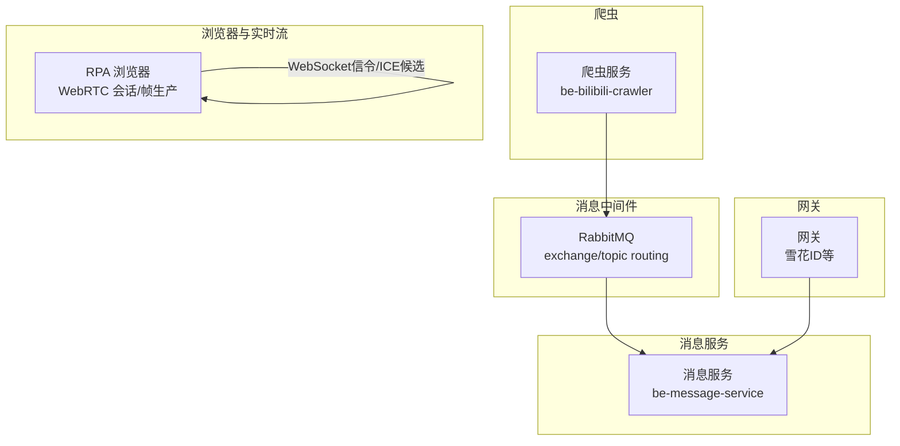
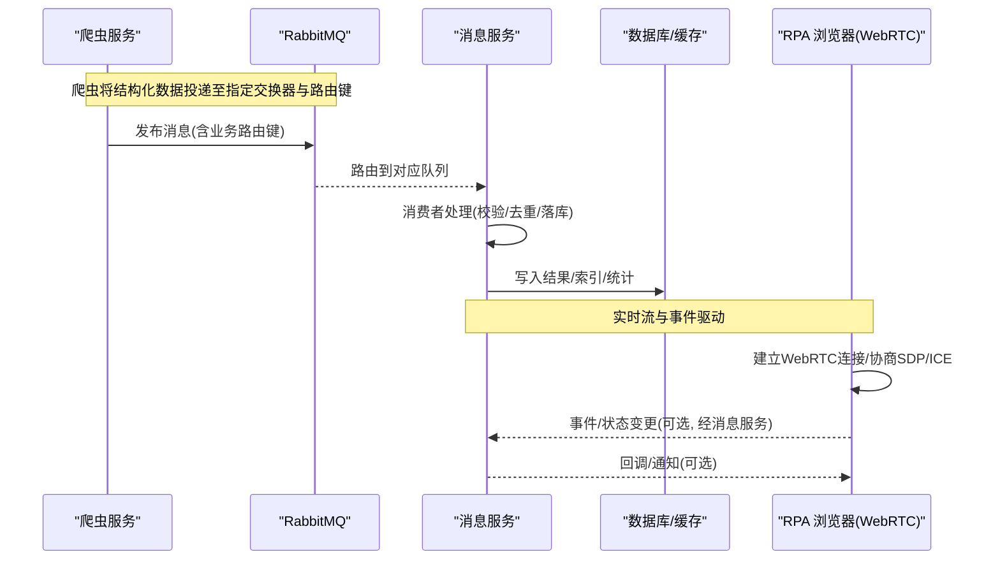
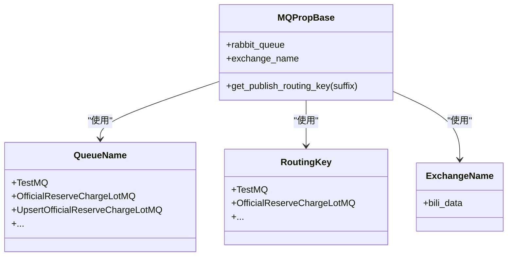
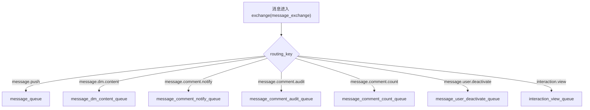
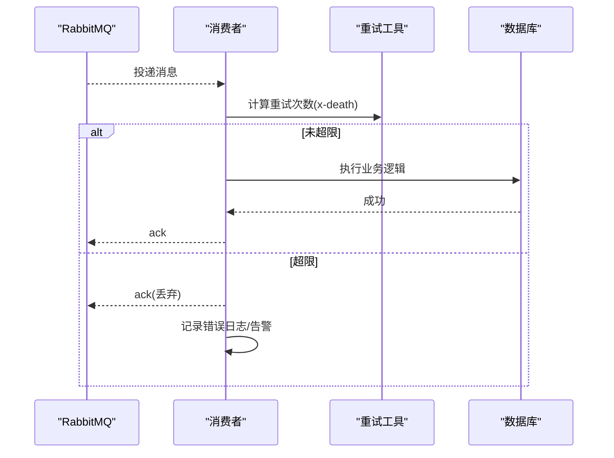
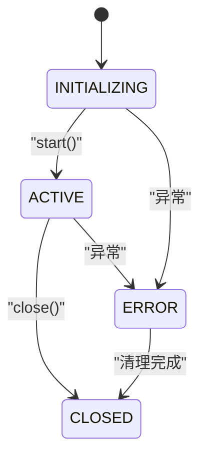
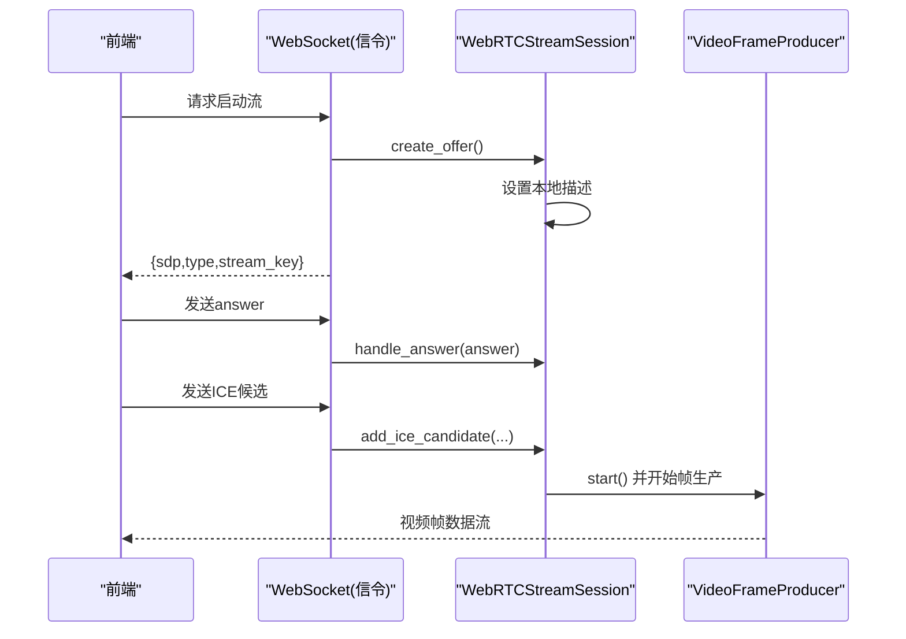
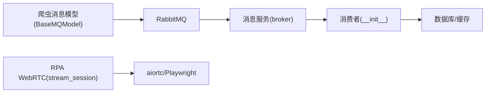

# 数据流设计

<cite>
**本文引用的文件**
- [BaseMQModel.py](file://be-bilibili-crawler/Models/MQ/BaseMQModel.py)
- [broker.py](file://be-message-service/app/core/broker.py)
- [retry.py](file://be-message-service/app/consumers/retry.py)
- [__init__.py（consumers）](file://be-message-service/app/consumers/__init__.py)
- [stream_session.py](file://RPA-Browser/app/services/RPA_browser/webrtc/stream_session.py)
- [stream_manager.py](file://RPA-Browser/app/services/RPA_browser/webrtc/stream_manager.py)
- [SnowFlakeGen.js](file://be-gateway/ExpressServerEnd/Tool/SnowFlakeGen.js)
- [test_mq.py](file://be-bilibili-crawler/test/test_mq.py)
- [BasicAsyncClient.py](file://be-bilibili-crawler/Service/MQ/base/BasicAsyncClient.py)
</cite>

## 目录
1. [引言](#引言)
2. [项目结构](#项目结构)
3. [核心组件](#核心组件)
4. [架构总览](#架构总览)
5. [详细组件分析](#详细组件分析)
6. [依赖关系分析](#依赖关系分析)
7. [性能考量](#性能考量)
8. [故障排查指南](#故障排查指南)
9. [结论](#结论)
10. [附录](#附录)

## 引言
本文件面向 BilibiliExplosion 项目的“数据采集到最终展示”的完整数据流，覆盖爬虫采集、消息队列路由与消费、实时数据流（WebRTC/事件驱动）、以及数据一致性策略（事务、幂等、备份恢复）。文档以代码级事实为依据，提供架构图与时序图，帮助读者理解关键业务场景下的数据流转过程。

## 项目结构
本项目由多个子系统组成：
- 爬虫服务（be-bilibili-crawler）：负责从外部平台抓取数据，并通过 RabbitMQ 将结构化消息投递到指定交换器与路由键。
- 消息服务（be-message-service）：统一的消息中心，定义 exchange/routing_key/queue，并提供消费者处理私信、评论、推送、用户注销、浏览统计等异步任务。
- RPA 浏览器（RPA-Browser）：基于 Playwright 的浏览器自动化能力，结合 WebRTC 实现实时视频流与会话管理。
- 网关（be-gateway）：提供通用能力（如雪花 ID），支撑分布式唯一标识生成。

图表来源
- [BaseMQModel.py:7-35](file://be-bilibili-crawler/Models/MQ/BaseMQModel.py#L7-L35)
- [broker.py:34-103](file://be-message-service/app/core/broker.py#L34-L103)

章节来源
- [BaseMQModel.py:7-35](file://be-bilibili-crawler/Models/MQ/BaseMQModel.py#L7-L35)
- [broker.py:34-103](file://be-message-service/app/core/broker.py#L34-L103)

## 核心组件
- 消息模型与路由（爬虫侧）
  - 通过枚举集中管理队列名、交换器名、路由键，便于扩展与维护。
  - 提供基础属性类用于构造 RabbitQueue 并支持动态拼接路由键。
- 消息路由与队列（消息服务侧）
  - 使用 TOPIC 交换器按 routing_key 分流到独立队列，确保不同业务解耦。
  - 明确区分站内信与第三方推送通道，避免耦合。
- 消费者与重试
  - 各模块消费者注册于统一入口，按 routing_key 分发。
  - 统一的重试计数工具读取 x-death 头，超过阈值丢弃并记录错误，防止死循环。
- 实时流与会话管理（RPA）
  - WebRTC 会话状态机保证生命周期正确转换；管理器维护 LRU 淘汰与双向索引，提升资源利用率。
- 分布式 ID（网关）
  - 雪花算法实现，支持时间回拨与超卖保护，保障全局唯一性。

章节来源
- [BaseMQModel.py:7-74](file://be-bilibili-crawler/Models/MQ/BaseMQModel.py#L7-L74)
- [broker.py:34-103](file://be-message-service/app/core/broker.py#L34-L103)
- [retry.py:1-30](file://be-message-service/app/consumers/retry.py#L1-L30)
- [__init__.py（consumers）:1-28](file://be-message-service/app/consumers/__init__.py#L1-L28)
- [stream_session.py:67-177](file://RPA-Browser/app/services/RPA_browser/webrtc/stream_session.py#L67-L177)
- [stream_manager.py:1-35](file://RPA-Browser/app/services/RPA_browser/webrtc/stream_manager.py#L1-L35)
- [SnowFlakeGen.js:72-201](file://be-gateway/ExpressServerEnd/Tool/SnowFlakeGen.js#L72-L201)

## 架构总览
整体数据流分为两条主线：
- 离线批处理线：爬虫采集 → 消息路由 → 消息服务消费者 → 持久化/索引/统计。
- 实时交互线：浏览器页面 → WebRTC 信令协商 → 视频帧生产 → 前端渲染；同时通过消息服务进行事件驱动的状态同步与通知。

图表来源
- [BaseMQModel.py:7-35](file://be-bilibili-crawler/Models/MQ/BaseMQModel.py#L7-L35)
- [broker.py:34-103](file://be-message-service/app/core/broker.py#L34-L103)
- [stream_session.py:163-234](file://RPA-Browser/app/services/RPA_browser/webrtc/stream_session.py#L163-L234)

## 详细组件分析

### 爬虫消息模型与路由
- 路由键与队列命名集中管理，便于扩展与审计。
- 基础属性类自动创建 RabbitQueue，绑定通配路由模式，支持动态后缀路由键，满足多租户/多场景投递。

图表来源
- [BaseMQModel.py:7-74](file://be-bilibili-crawler/Models/MQ/BaseMQModel.py#L7-L74)

章节来源
- [BaseMQModel.py:7-74](file://be-bilibili-crawler/Models/MQ/BaseMQModel.py#L7-L74)

### 消息服务路由与队列
- 使用单一 TOPIC 交换器 message_exchange，按 routing_key 分流到独立队列，确保业务隔离。
- 明确区分站内信与第三方推送，避免历史耦合问题。

图表来源
- [broker.py:34-103](file://be-message-service/app/core/broker.py#L34-L103)

章节来源
- [broker.py:34-103](file://be-message-service/app/core/broker.py#L34-L103)

### 消费者与错误重试机制
- 消费者入口集中注册，按 routing_key 分发到具体处理函数。
- 统一重试计数工具读取 x-death 头，超过默认上限则 ack 丢弃并记录错误，避免无限重试。

图表来源
- [__init__.py（consumers）:1-28](file://be-message-service/app/consumers/__init__.py#L1-L28)
- [retry.py:1-30](file://be-message-service/app/consumers/retry.py#L1-L30)

章节来源
- [__init__.py（consumers）:1-28](file://be-message-service/app/consumers/__init__.py#L1-L28)
- [retry.py:1-30](file://be-message-service/app/consumers/retry.py#L1-L30)

### 实时数据流：WebRTC 会话管理与状态同步
- 会话状态机确保 INITIALIZING→ACTIVE→CLOSED 的正确转换，异常路径进入 ERROR。
- 管理器使用弱引用打破循环引用，LRU 有序集合维护最近使用顺序，O(1) 查询闲置时长。
- 信令流程：客户端发起 offer → 服务端设置本地描述 → 返回 sdp/type → 客户端设置远程描述 → ICE 候选添加 → 媒体轨道开始传输。

图表来源
- [stream_session.py:67-177](file://RPA-Browser/app/services/RPA_browser/webrtc/stream_session.py#L67-L177)

图表来源
- [stream_session.py:163-234](file://RPA-Browser/app/services/RPA_browser/webrtc/stream_session.py#L163-L234)

章节来源
- [stream_session.py:67-301](file://RPA-Browser/app/services/RPA_browser/webrtc/stream_session.py#L67-L301)
- [stream_manager.py:1-35](file://RPA-Browser/app/services/RPA_browser/webrtc/stream_manager.py#L1-L35)

### 数据一致性保证策略
- 事务处理
  - 消费者在执行业务逻辑时采用数据库事务包裹，失败回滚，确保写路径原子性。
- 幂等性设计
  - 基于业务主键或唯一约束（如动态 ID、用户 ID）实现幂等写入；消息层通过去重表/Redis 标记已处理消息。
- 备份与恢复
  - 定期快照与增量备份；异常恢复时从最近一致点回放消息或重放任务进度。
- 分布式 ID
  - 雪花算法支持时间回拨与超卖保护，避免并发冲突。

章节来源
- [SnowFlakeGen.js:72-201](file://be-gateway/ExpressServerEnd/Tool/SnowFlakeGen.js#L72-L201)

## 依赖关系分析
- 爬虫侧消息模型依赖 FastStream 的 RabbitExchange/RabbitQueue，集中管理路由键与队列。
- 消息服务 broker 复用同一 broker 实例，避免多连接开销，确保 publisher/RPC/健康检查与消费者共用连接。
- 消费者入口集中注册，按 routing_key 分发到具体处理函数，降低耦合度。
- RPA 浏览器 WebRTC 会话依赖 aiortc 与 Playwright，状态机与管理器确保资源高效利用。

图表来源
- [BaseMQModel.py:7-74](file://be-bilibili-crawler/Models/MQ/BaseMQModel.py#L7-L74)
- [broker.py:34-103](file://be-message-service/app/core/broker.py#L34-L103)
- [__init__.py（consumers）:1-28](file://be-message-service/app/consumers/__init__.py#L1-L28)
- [stream_session.py:67-177](file://RPA-Browser/app/services/RPA_browser/webrtc/stream_session.py#L67-L177)

章节来源
- [BaseMQModel.py:7-74](file://be-bilibili-crawler/Models/MQ/BaseMQModel.py#L7-L74)
- [broker.py:34-103](file://be-message-service/app/core/broker.py#L34-L103)
- [__init__.py（consumers）:1-28](file://be-message-service/app/consumers/__init__.py#L1-L28)
- [stream_session.py:67-177](file://RPA-Browser/app/services/RPA_browser/webrtc/stream_session.py#L67-L177)

## 性能考量
- 消息队列
  - 使用 TOPIC 交换器与独立队列，避免热点竞争；合理设置 prefetch 与 QoS，控制消费速率。
- 消费者
  - 统一重试计数避免死循环；对高频率低优先级消息（如浏览统计）采用异步解耦。
- 实时流
  - WebRTC 会话状态机减少无效操作；管理器使用 LRU 与弱引用降低内存占用。
- 分布式 ID
  - 雪花算法支持时间回拨与超卖保护，避免并发冲突导致的性能抖动。

[本节为通用指导，不直接分析具体文件]

## 故障排查指南
- 消息未被消费
  - 检查路由键与队列绑定是否一致；确认消费者是否正确注册。
  - 参考测试用例验证发布与消费链路。
- 消费者异常
  - 查看重试计数与 x-death 头；超过阈值后消息被丢弃并记录错误。
  - 检查 nack/ack 调用与告警推送。
- 实时流异常
  - 检查 WebRTC 状态转换是否合法；查看 ICE 连接状态与远程描述设置。
  - 确认帧生产者是否正常启动与停止。

章节来源
- [test_mq.py:172-207](file://be-bilibili-crawler/test/test_mq.py#L172-L207)
- [retry.py:1-30](file://be-message-service/app/consumers/retry.py#L1-L30)
- [BasicAsyncClient.py:198-233](file://be-bilibili-crawler/Service/MQ/base/BasicAsyncClient.py#L198-L233)
- [stream_session.py:163-234](file://RPA-Browser/app/services/RPA_browser/webrtc/stream_session.py#L163-L234)

## 结论
本项目通过清晰的消息路由与消费者分层，实现了爬虫数据的高效采集与处理；借助 WebRTC 与状态机管理，提供了稳定的实时数据流能力；结合分布式 ID 与重试机制，保障了系统的一致性与可靠性。建议在生产环境中持续监控消息积压、消费者延迟与 WebRTC 连接质量，优化 QoS 与资源回收策略。

[本节为总结，不直接分析具体文件]

## 附录
- 关键术语
  - 交换器（Exchange）：消息路由的中枢，决定消息如何分发到队列。
  - 路由键（Routing Key）：消息的路由标识，用于匹配队列绑定规则。
  - 消费者（Consumer）：从队列中拉取并处理消息的服务端组件。
  - WebRTC：实时通信协议，支持音视频流与数据通道。
- 最佳实践
  - 集中管理路由键与队列命名，避免硬编码。
  - 使用状态机管理复杂生命周期，防止非法状态转换。
  - 对高并发场景引入去重与限流，保障系统稳定性。

[本节为概念说明，不直接分析具体文件]