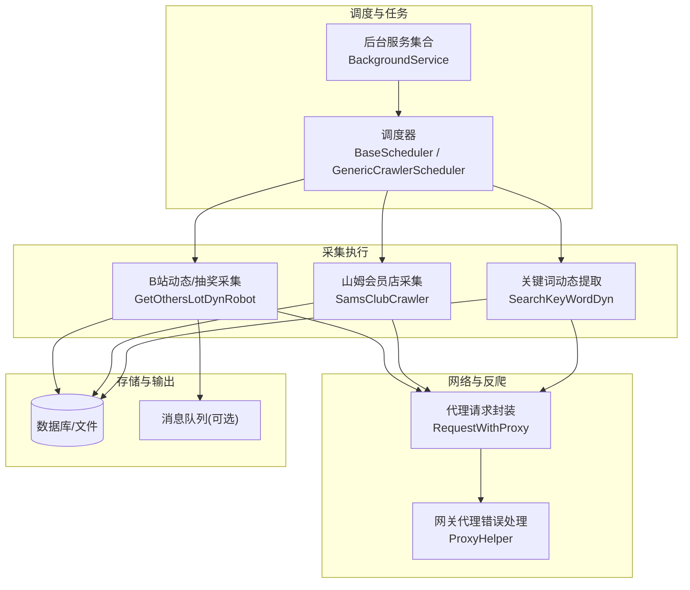
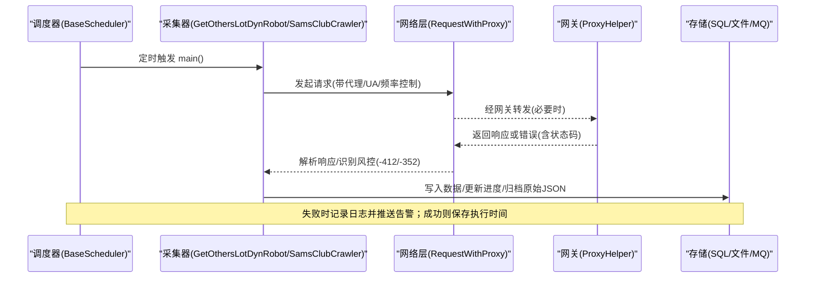
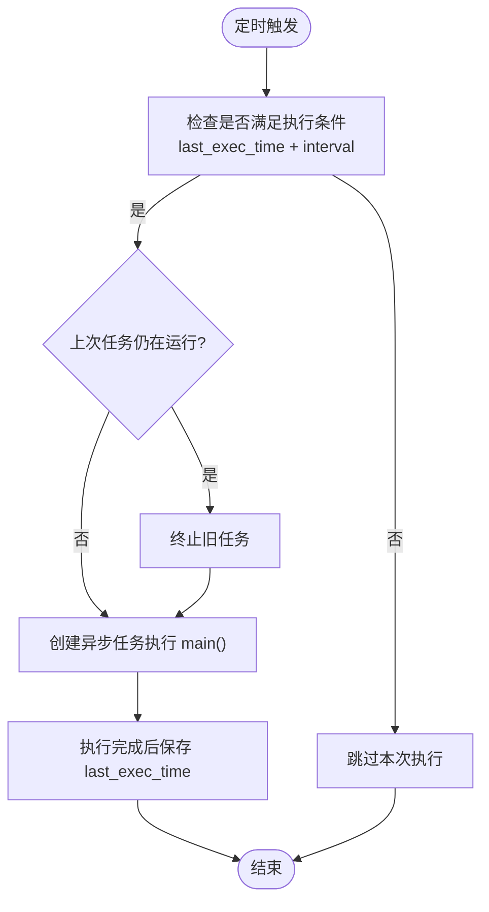
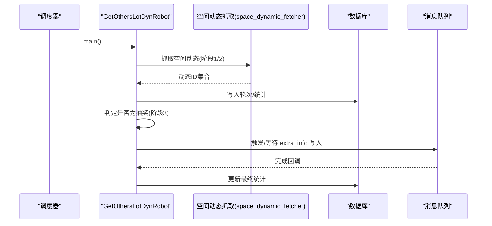
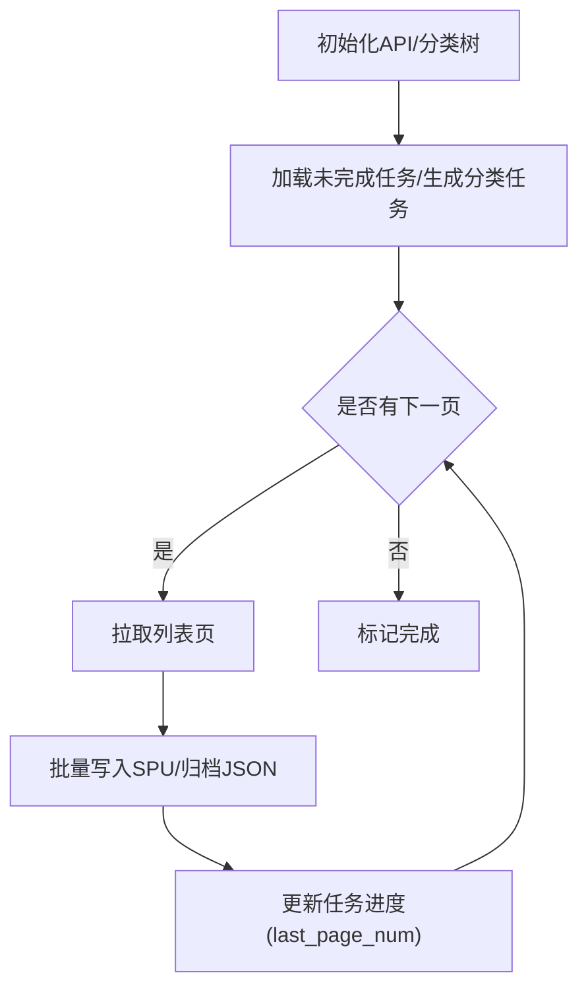
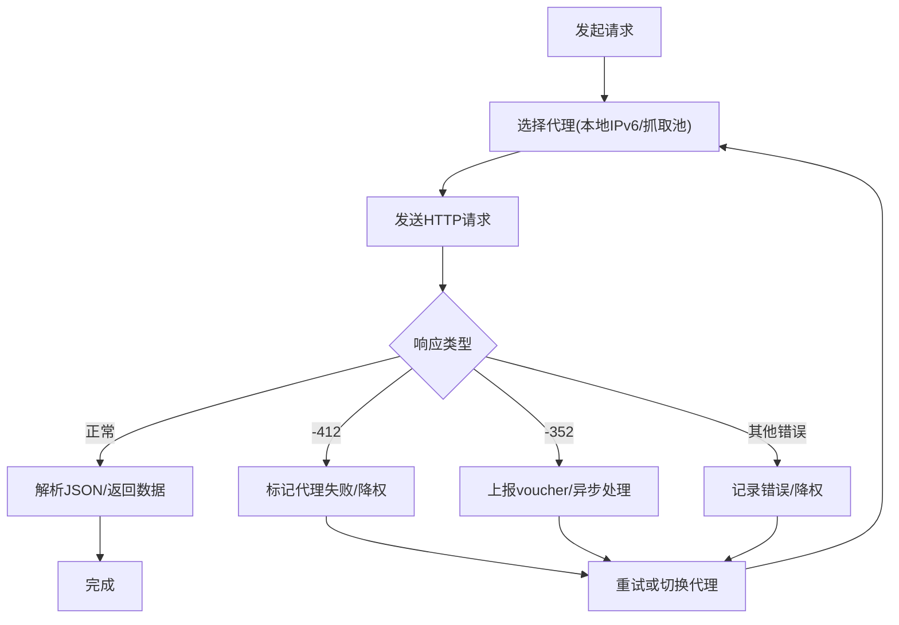
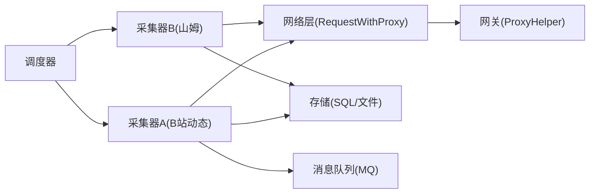

# 数据采集流程

<cite>
**本文引用的文件**
- [scheduler_launcher.py](file://be-bilibili-crawler/Service/BaseCrawler/launcher/scheduler_launcher.py)
- [CrawlerScheduler.py](file://be-bilibili-crawler/Service/BackgroundService/CrawlerScheduler.py)
- [RedisRequestProxy.py](file://be-bilibili-crawler/Utils/代理/redisProxyRequest/RedisRequestProxy.py)
- [main.py](file://be-bilibili-crawler/Service/samsclub/main.py)
- [samsclub_api.py](file://be-bilibili-crawler/Service/samsclub/api/samsclub_api.py)
- [robot.py](file://be-bilibili-crawler/Service/GetOthersLotDyn/core/robot.py)
- [space_dynamic_fetcher.py](file://be-bilibili-crawler/Service/GetOthersLotDyn/fetcher/space_dynamic_fetcher.py)
- [getKeyWordDynDetail.py](file://be-bilibili-crawler/Service/GrpcModule/GrpcSrc/获取特殊关键词动态/getKeyWordDynDetail.py)
- [首页刷视频.py](file://be-bilibili-crawler/scripts/bili/B站手机端首页刷视频/首页刷视频.py)
- [ProxyHelper.js](file://be-gateway/ExpressServerEnd/Controller/ProxyHelper.js)
</cite>

## 目录
1. [简介](#简介)
2. [项目结构](#项目结构)
3. [核心组件](#核心组件)
4. [架构总览](#架构总览)
5. [详细组件分析](#详细组件分析)
6. [依赖关系分析](#依赖关系分析)
7. [性能考量](#性能考量)
8. [故障排查指南](#故障排查指南)
9. [结论](#结论)
10. [附录](#附录)

## 简介
本文件面向 BilibiliExplosion 项目的“数据采集”主题，系统化阐述从调度到抓取、解析、清洗验证、存储归档的完整链路。重点覆盖：
- 爬虫调度与任务生命周期管理（创建、执行、监控、失败重试、结果归档）
- 多数据源采集策略（B站动态、官方抽奖、话题抽奖、山姆会员店等）
- 反爬机制应对（IP 代理池、用户代理轮换、请求频率控制、风控识别与恢复）
- 可扩展的采集实现方式与配置说明，帮助开发者快速理解并扩展新功能

## 项目结构
本项目采用多服务协作的架构：
- be-bilibili-crawler：核心爬虫与后台任务调度、数据抓取与处理
- RPA-Browser：浏览器自动化能力（用于复杂页面交互场景）
- Vue3FrontEndDemoExercise：前端展示与管理界面
- be-gateway：网关层，负责鉴权、限流、代理转发与错误处理
- bili-common：公共模型、RPC、工具库
- go-proxy-ipv6-pool-auto：IPv6 代理池自动维护服务

**图表来源**
- [scheduler_launcher.py:82-198](file://be-bilibili-crawler/Service/BaseCrawler/launcher/scheduler_launcher.py#L82-L198)
- [CrawlerScheduler.py:24-117](file://be-bilibili-crawler/Service/BackgroundService/CrawlerScheduler.py#L24-L117)
- [RedisRequestProxy.py:57-302](file://be-bilibili-crawler/Utils/代理/redisProxyRequest/RedisRequestProxy.py#L57-L302)
- [main.py:30-186](file://be-bilibili-crawler/Service/samsclub/main.py#L30-L186)
- [robot.py:37-362](file://be-bilibili-crawler/Service/GetOthersLotDyn/core/robot.py#L37-L362)
- [ProxyHelper.js:85-133](file://be-gateway/ExpressServerEnd/Controller/ProxyHelper.js#L85-L133)

**章节来源**
- [scheduler_launcher.py:82-198](file://be-bilibili-crawler/Service/BaseCrawler/launcher/scheduler_launcher.py#L82-L198)
- [CrawlerScheduler.py:24-117](file://be-bilibili-crawler/Service/BackgroundService/CrawlerScheduler.py#L24-L117)

## 核心组件
- 调度器与任务生命周期
  - BaseScheduler/GenericCrawlerScheduler：基于 APScheduler 的定时触发、任务去重、并发控制、异常推送、执行时间持久化
  - BackgroundService：集中注册各采集任务的 cron 表达式与默认间隔，统一启动/暂停/移除
- 采集执行器
  - GetOthersLotDynRobot：分阶段抓取 B站用户空间动态、发起者动态、判定是否为抽奖；支持并发控制与进度统计
  - SamsClubCrawler/SamsClubSPUDetailCrawler：按分类层级拉取商品列表与详情，断点续爬与进度跟踪
  - SearchKeyWordDyn：基于关键词筛选动态并结构化输出
- 网络与反爬
  - RequestWithProxy：统一 HTTP 请求封装，代理选择、权重调整、风控识别（-412/-352）、失败降级与告警
  - ProxyHelper：网关层代理错误处理、用户头清理、状态码映射与推送通知
- 存储与归档
  - SQL/文件落盘：分类信息、SPU 信息、任务进度、原始 JSON 备份
  - 消息队列：异步处理额外信息（如 MQ 消费者写入 t_lot_extra_info）

**章节来源**
- [scheduler_launcher.py:17-198](file://be-bilibili-crawler/Service/BaseCrawler/launcher/scheduler_launcher.py#L17-L198)
- [CrawlerScheduler.py:24-117](file://be-bilibili-crawler/Service/BackgroundService/CrawlerScheduler.py#L24-L117)
- [robot.py:37-362](file://be-bilibili-crawler/Service/GetOthersLotDyn/core/robot.py#L37-L362)
- [main.py:30-186](file://be-bilibili-crawler/Service/samsclub/main.py#L30-L186)
- [RedisRequestProxy.py:57-302](file://be-bilibili-crawler/Utils/代理/redisProxyRequest/RedisRequestProxy.py#L57-L302)
- [ProxyHelper.js:85-133](file://be-gateway/ExpressServerEnd/Controller/ProxyHelper.js#L85-L133)

## 架构总览
下图展示了从调度到抓取、解析、存储的端到端流程，以及反爬与网关层的协同。

**图表来源**
- [scheduler_launcher.py:138-198](file://be-bilibili-crawler/Service/BaseCrawler/launcher/scheduler_launcher.py#L138-L198)
- [RedisRequestProxy.py:139-302](file://be-bilibili-crawler/Utils/代理/redisProxyRequest/RedisRequestProxy.py#L139-L302)
- [ProxyHelper.js:85-133](file://be-gateway/ExpressServerEnd/Controller/ProxyHelper.js#L85-L133)
- [main.py:115-186](file://be-bilibili-crawler/Service/samsclub/main.py#L115-L186)
- [robot.py:212-362](file://be-bilibili-crawler/Service/GetOthersLotDyn/core/robot.py#L212-L362)

## 详细组件分析

### 调度器与任务生命周期
- 任务创建与注册
  - 通过 BackgroundService 将各采集任务以 cron 表达式注册到全局调度器
  - 每个任务具备唯一 job_id，支持首次立即执行、合并错过任务、限制并发实例数
- 执行判断与防抖
  - CrawlerExecutionInfo 维护 last_exec_time，结合 default_interval_seconds 决定是否需要执行
  - 若上次任务仍在运行，先终止旧任务再开新任务，避免永久停摆
- 监控与告警
  - 执行异常通过推送服务发送告警
  - 提供 pause/resume/remove/start 等管理能力

**图表来源**
- [scheduler_launcher.py:62-79](file://be-bilibili-crawler/Service/BaseCrawler/launcher/scheduler_launcher.py#L62-L79)
- [scheduler_launcher.py:138-198](file://be-bilibili-crawler/Service/BaseCrawler/launcher/scheduler_launcher.py#L138-L198)

**章节来源**
- [scheduler_launcher.py:17-198](file://be-bilibili-crawler/Service/BaseCrawler/launcher/scheduler_launcher.py#L17-L198)
- [CrawlerScheduler.py:24-117](file://be-bilibili-crawler/Service/BackgroundService/CrawlerScheduler.py#L24-L117)

### B站动态与抽奖采集（GetOthersLotDynRobot）
- 三阶段流水线
  - 第一阶段：抓取目标用户空间动态，收集动态 ID
  - 第二阶段：抓取发起抽奖用户的空间动态，扩大样本集
  - 第三阶段：判定每条动态是否为抽奖，统计结果并归档
- 并发与进度
  - 不同阶段使用不同并发度，ProgressCounter 跟踪运行中参数与完成计数
- 外部依赖
  - Redis 获取目标 UID 列表；SQL 写入轮次信息与统计；MQ 等待消费者处理 extra_info

**图表来源**
- [robot.py:212-362](file://be-bilibili-crawler/Service/GetOthersLotDyn/core/robot.py#L212-L362)
- [space_dynamic_fetcher.py:387-408](file://be-bilibili-crawler/Service/GetOthersLotDyn/fetcher/space_dynamic_fetcher.py#L387-L408)

**章节来源**
- [robot.py:37-362](file://be-bilibili-crawler/Service/GetOthersLotDyn/core/robot.py#L37-L362)
- [space_dynamic_fetcher.py:387-408](file://be-bilibili-crawler/Service/GetOthersLotDyn/fetcher/space_dynamic_fetcher.py#L387-L408)

### 山姆会员店采集（SamsClubCrawler）
- 分类与分页
  - 先拉取一级/二级分类树，持久化后按二级分类生成任务参数
  - 分页拉取商品列表，记录 last_page_num 实现断点续爬
- 数据存储与归档
  - 批量 upsert SPU 信息；同时按日期路径归档原始 JSON
- 并发与限速
  - SleepTimeGenerator 控制短/中/长延迟，降低被风控概率

**图表来源**
- [main.py:81-186](file://be-bilibili-crawler/Service/samsclub/main.py#L81-L186)
- [samsclub_api.py:484-521](file://be-bilibili-crawler/Service/samsclub/api/samsclub_api.py#L484-L521)

**章节来源**
- [main.py:30-186](file://be-bilibili-crawler/Service/samsclub/main.py#L30-L186)
- [samsclub_api.py:484-521](file://be-bilibili-crawler/Service/samsclub/api/samsclub_api.py#L484-L521)

### 关键词动态提取（SearchKeyWordDyn）
- 功能概述
  - 根据关键词范围查询动态，解析出标题、摘要、作者、互动数据、官方认证类型等字段
  - 输出为 CSV 便于离线分析
- 数据处理
  - 扁平化嵌套字典，抽取模块信息（预约/充电/官方抽奖），计算发布时间

**章节来源**
- [getKeyWordDynDetail.py:16-137](file://be-bilibili-crawler/Service/GrpcModule/GrpcSrc/获取特殊关键词动态/getKeyWordDynDetail.py#L16-L137)

### 反爬机制与网络层
- 代理池与权重
  - 本地 IPv6 代理与抓取代理池混合选择，权重动态调整；失败降权、成功加分
- 风控识别与恢复
  - 识别 -412（安全风控）、-352（需要凭证）等错误码，分别走不同处理流程
  - 对 -352 情况异步上报 voucher 信息，辅助后续解封
- 网关层错误处理
  - 统一清理不可信请求头，映射上游错误为 HTTP 状态码，推送系统级告警

**图表来源**
- [RedisRequestProxy.py:75-302](file://be-bilibili-crawler/Utils/代理/redisProxyRequest/RedisRequestProxy.py#L75-L302)
- [ProxyHelper.js:85-133](file://be-gateway/ExpressServerEnd/Controller/ProxyHelper.js#L85-L133)

**章节来源**
- [RedisRequestProxy.py:57-302](file://be-bilibili-crawler/Utils/代理/redisProxyRequest/RedisRequestProxy.py#L57-L302)
- [ProxyHelper.js:85-133](file://be-gateway/ExpressServerEnd/Controller/ProxyHelper.js#L85-L133)

### 用户代理轮换与频率控制
- 用户代理
  - 在部分脚本中显式设置 UA（如 bingbot），以降低风控概率
- 频率控制
  - 使用 SleepTimeGenerator 在不同粒度上随机延时，避免固定节奏被检测
  - 调度器层面通过 default_interval_seconds 控制最小执行间隔

**章节来源**
- [首页刷视频.py:270-302](file://be-bilibili-crawler/scripts/bili/B站手机端首页刷视频/首页刷视频.py#L270-L302)
- [main.py:51-69](file://be-bilibili-crawler/Service/samsclub/main.py#L51-L69)
- [scheduler_launcher.py:23-79](file://be-bilibili-crawler/Service/BaseCrawler/launcher/scheduler_launcher.py#L23-L79)

## 依赖关系分析
- 组件耦合
  - 调度器与采集器松耦合：通过接口 main()/run() 解耦
  - 网络层独立封装：所有采集器统一通过 RequestWithProxy 发起请求
  - 存储层抽象：SQL/文件/队列由各自模块内部实现，对外暴露统一方法
- 外部依赖
  - APScheduler：定时任务调度
  - curl_cffi/httpx：底层 HTTP 客户端
  - MySQL/Redis：持久化与缓存
  - 网关：统一入口与错误处理

**图表来源**
- [scheduler_launcher.py:82-198](file://be-bilibili-crawler/Service/BaseCrawler/launcher/scheduler_launcher.py#L82-L198)
- [RedisRequestProxy.py:57-302](file://be-bilibili-crawler/Utils/代理/redisProxyRequest/RedisRequestProxy.py#L57-L302)
- [ProxyHelper.js:85-133](file://be-gateway/ExpressServerEnd/Controller/ProxyHelper.js#L85-L133)

**章节来源**
- [scheduler_launcher.py:82-198](file://be-bilibili-crawler/Service/BaseCrawler/launcher/scheduler_launcher.py#L82-L198)
- [RedisRequestProxy.py:57-302](file://be-bilibili-crawler/Utils/代理/redisProxyRequest/RedisRequestProxy.py#L57-L302)
- [ProxyHelper.js:85-133](file://be-gateway/ExpressServerEnd/Controller/ProxyHelper.js#L85-L133)

## 性能考量
- 并发控制
  - 不同阶段按需调整 worker 数量与信号量，避免资源争用
- 速率限制
  - 多级延时策略（短/中/长）降低被风控概率，提升稳定性
- 断点续爬
  - 记录 last_page_num 与 unfinished_tasks，支持中断恢复
- 缓存与复用
  - 分类树与 API 版本信息缓存，减少重复请求
- 监控与可观测性
  - 进度计数器、最后更新时间、运行状态等指标便于运维观察

[本节为通用指导，不直接分析具体文件]

## 故障排查指南
- 常见错误码
  - -412：触发安全风控，需更换代理或降低频率
  - -352：需要凭证（voucher），异步上报并等待解封
  - 其他网络错误：连接超时、协议错误等，记录日志并降权代理
- 排查步骤
  - 查看调度器日志与执行时间，确认任务是否被正确触发
  - 检查代理池健康度与权重变化，确认是否存在大量失败代理
  - 核对网关错误处理与推送通知，定位上游失败原因
  - 校验存储层写入是否成功，关注断点续爬进度是否正确更新

**章节来源**
- [RedisRequestProxy.py:139-302](file://be-bilibili-crawler/Utils/代理/redisProxyRequest/RedisRequestProxy.py#L139-L302)
- [ProxyHelper.js:85-133](file://be-gateway/ExpressServerEnd/Controller/ProxyHelper.js#L85-L133)
- [scheduler_launcher.py:138-198](file://be-bilibili-crawler/Service/BaseCrawler/launcher/scheduler_launcher.py#L138-L198)

## 结论
本项目通过分层清晰的调度器、模块化采集器、统一的网络层与稳健的反爬策略，实现了从 B站动态到山姆会员店等多源数据的稳定采集。借助断点续爬、并发控制、频率调节与监控告警，系统在复杂网络环境下仍保持高可用与可扩展性。开发者可基于现有框架快速接入新数据源，并通过配置化手段灵活调整采集策略。

[本节为总结性内容，不直接分析具体文件]

## 附录
- 配置建议
  - 合理设置 default_interval_seconds 与 cron 表达式，平衡时效性与负载
  - 调整代理池权重与超时参数，适应不同站点特性
  - 启用进度与状态上报，便于可视化监控
- 扩展指引
  - 新增采集器：继承 UnlimitedCrawler，实现 key_params_gen/handle_fetch/is_stop/main
  - 接入调度器：在 BackgroundService 中注册任务，指定 cron 与间隔
  - 网络层复用：统一通过 RequestWithProxy 发起请求，享受代理与风控处理

[本节为通用指导，不直接分析具体文件]